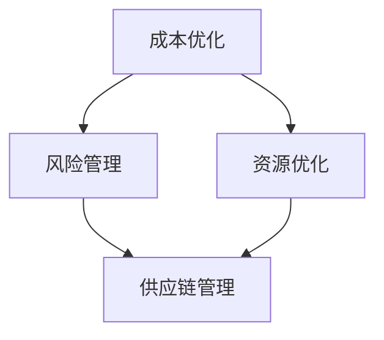

                 

# 创业公司如何与供应商谈判和管理关系

> **关键词：** 创业公司、供应商谈判、关系管理、成本优化、风险管理、合作共赢  
>
> **摘要：** 本文将深入探讨创业公司如何与供应商进行有效的谈判和管理关系，包括谈判策略、风险管理、合作共赢等方面。通过本文的讲解，创业公司可以更好地把握与供应商的互动，实现成本控制、资源优化和业务扩展。

## 1. 背景介绍

### 1.1 目的和范围

本文旨在帮助创业公司了解与供应商谈判和管理关系的重要性和具体方法。文章将从以下几个方面展开：

1. **供应商谈判的核心策略**：介绍如何通过有效的谈判策略降低成本、提升质量、优化供应链。
2. **供应商关系的维护**：探讨如何建立稳定的合作关系，实现互利共赢。
3. **风险管理与预防**：分析在合作过程中可能出现的风险，并提供应对策略。

### 1.2 预期读者

本文适合以下读者：

1. 创业公司的创始人、运营经理、采购经理等。
2. 想要了解供应商谈判和管理的专业人士。
3. 对于供应链管理和采购流程感兴趣的学者和学生。

### 1.3 文档结构概述

本文将分为以下几个部分：

1. **背景介绍**：包括文章目的、预期读者和文档结构。
2. **核心概念与联系**：介绍与供应商谈判和管理的核心概念和联系。
3. **核心算法原理 & 具体操作步骤**：讲解与供应商谈判的算法原理和具体操作步骤。
4. **数学模型和公式 & 详细讲解 & 举例说明**：阐述与供应商谈判的数学模型和公式。
5. **项目实战：代码实际案例和详细解释说明**：通过实际案例展示谈判过程。
6. **实际应用场景**：分析供应商谈判在不同业务场景中的应用。
7. **工具和资源推荐**：推荐学习资源、开发工具和框架。
8. **总结：未来发展趋势与挑战**：探讨未来供应商谈判和管理的发展趋势。
9. **附录：常见问题与解答**：解答读者可能遇到的问题。
10. **扩展阅读 & 参考资料**：提供更多相关学习资源。

### 1.4 术语表

#### 1.4.1 核心术语定义

- **供应商谈判**：指创业公司通过与供应商进行沟通、协商，以达成满足双方利益的协议。
- **风险管理**：识别、评估和应对与供应商合作过程中可能出现的风险。
- **互利共赢**：供应商和创业公司在合作过程中实现双方利益的共同增长。

#### 1.4.2 相关概念解释

- **成本优化**：通过优化采购成本，提高创业公司的盈利能力。
- **资源优化**：合理配置供应商资源，提高供应链的整体效率。
- **供应链管理**：涉及从原材料采购到产品交付的全过程管理。

#### 1.4.3 缩略词列表

- **ERP**：企业资源规划（Enterprise Resource Planning）
- **CRM**：客户关系管理（Customer Relationship Management）
- **SCM**：供应链管理（Supply Chain Management）

## 2. 核心概念与联系

在讨论如何与供应商谈判和管理关系时，我们需要先了解一些核心概念和它们之间的联系。以下是一个简单的 Mermaid 流程图，用于展示这些概念之间的互动。



### 2.1 成本优化

成本优化是创业公司与供应商谈判的一个重要目标。通过优化采购成本，创业公司可以提高盈利能力，从而在竞争激烈的市场中保持优势。以下是一个简化的成本优化算法原理：

```pseudo
算法：成本优化
输入：供应商报价、创业公司预算
输出：优化后的采购成本

步骤：
1. 初始化供应商报价为当前报价
2. 对每个供应商报价进行成本分析
3. 选择成本最低的供应商
4. 对供应商进行谈判，争取更低的报价
5. 如果谈判成功，更新采购成本
6. 返回优化后的采购成本
```

### 2.2 风险管理

供应商合作过程中，风险是不可避免的。风险管理旨在识别、评估和应对这些风险，以确保供应链的稳定和业务连续性。以下是一个风险管理算法原理：

```pseudo
算法：风险管理
输入：供应商信息、历史合作记录
输出：风险应对策略

步骤：
1. 识别潜在风险
2. 评估风险概率和影响
3. 根据评估结果，制定风险应对策略
4. 实施风险应对策略
5. 监控和调整策略
6. 返回风险应对策略
```

### 2.3 资源优化

资源优化是指合理配置供应商资源，以提高供应链的整体效率。以下是一个资源优化算法原理：

```pseudo
算法：资源优化
输入：供应商资源、创业公司需求
输出：优化后的资源分配

步骤：
1. 初始化供应商资源为当前资源
2. 对每个供应商资源进行需求分析
3. 选择能够满足需求的供应商资源
4. 进行资源谈判，争取更好的资源分配
5. 如果谈判成功，更新资源分配
6. 返回优化后的资源分配
```

### 2.4 供应链管理

供应链管理是创业公司与供应商合作的核心。它涉及从原材料采购到产品交付的全过程管理。以下是一个供应链管理算法原理：

```pseudo
算法：供应链管理
输入：供应商信息、创业公司需求、供应链环节
输出：优化后的供应链流程

步骤：
1. 初始化供应链流程为当前流程
2. 分析供应链各环节的需求和瓶颈
3. 优化供应链各环节的流程和资源配置
4. 与供应商进行谈判，确保供应链的稳定和高效
5. 监控和调整供应链流程
6. 返回优化后的供应链流程
```

通过以上核心概念和算法原理的讲解，我们可以更好地理解创业公司与供应商谈判和管理关系的方法。接下来，我们将进一步探讨具体的操作步骤和数学模型。

## 3. 核心算法原理 & 具体操作步骤

在前一章节中，我们介绍了与供应商谈判和管理的核心概念和算法原理。在本章节中，我们将详细讲解这些算法的具体操作步骤，以帮助创业公司更好地实施供应商谈判和管理。

### 3.1 成本优化操作步骤

**步骤 1**：收集供应商报价

首先，创业公司需要收集不同供应商的报价。这可以通过在线采购平台、供应商目录或直接联系供应商来实现。

**步骤 2**：进行成本分析

对每个供应商的报价进行成本分析，包括直接成本（如原材料、运输费用等）和间接成本（如库存成本、管理费用等）。通过成本分析，创业公司可以确定哪个供应商的报价最具竞争力。

```latex
成本分析公式：
C = C_{direct} + C_{indirect}
```

其中，$C$ 表示总成本，$C_{direct}$ 表示直接成本，$C_{indirect}$ 表示间接成本。

**步骤 3**：选择供应商

根据成本分析结果，选择成本最低的供应商。在多个供应商报价接近时，可以考虑其他因素，如供应商的信誉、交货时间和服务质量。

**步骤 4**：谈判

与选定的供应商进行谈判，争取更低的报价。在谈判过程中，创业公司可以提出合理的降价要求，并提供长期合作承诺以换取更好的报价。

**步骤 5**：签订合同

在谈判成功后，与供应商签订合同，明确双方的权利和义务。合同内容应包括报价、交付时间、付款方式、质量标准等。

**步骤 6**：监控和调整

在执行合同过程中，创业公司应定期监控供应商的履约情况，并根据实际情况进行调整。如发现供应商未能按时交付或产品质量不符合要求，应采取相应的措施，如要求退款或更换供应商。

### 3.2 风险管理操作步骤

**步骤 1**：识别潜在风险

创业公司应识别在供应商合作过程中可能出现的潜在风险，如供应商违约、供应链中断、质量问题等。可以通过问卷调查、现场考察、历史数据分析等方法进行风险识别。

**步骤 2**：评估风险概率和影响

对识别出的潜在风险进行概率和影响的评估。评估结果可以帮助创业公司确定风险优先级，以便采取针对性的应对措施。

**步骤 3**：制定风险应对策略

根据风险评估结果，制定相应的风险应对策略。应对策略可以分为预防措施、应急计划和风险转移等。

- **预防措施**：如选择信誉良好的供应商、签订详细的合同、进行定期质量检查等。
- **应急计划**：如建立替代供应链、储备关键原材料等。
- **风险转移**：如购买保险、与供应商签订风险分担协议等。

**步骤 4**：实施风险应对策略

在执行合同过程中，创业公司应实施制定的风险应对策略。如定期与供应商进行沟通，确保供应链的稳定和高效。

**步骤 5**：监控和调整

在执行风险应对策略过程中，创业公司应定期监控风险应对效果，并根据实际情况进行调整。如发现风险应对策略不奏效，应重新评估风险，并制定新的应对策略。

### 3.3 资源优化操作步骤

**步骤 1**：分析供应商资源

创业公司应分析供应商提供的资源，包括原材料、人力、设备等。通过资源分析，创业公司可以确定哪些资源对业务发展至关重要。

**步骤 2**：制定资源需求计划

根据业务发展需求，创业公司应制定资源需求计划。需求计划应包括资源种类、数量、使用时间等。

**步骤 3**：谈判

与供应商进行资源谈判，争取更好的资源分配。在谈判过程中，创业公司可以提出合理的资源需求，并提供长期合作承诺以换取更好的资源分配。

**步骤 4**：签订合同

在谈判成功后，与供应商签订合同，明确双方的权利和义务。合同内容应包括资源种类、数量、交付时间、付款方式等。

**步骤 5**：监控和调整

在执行合同过程中，创业公司应定期监控供应商的履约情况，并根据实际情况进行调整。如发现供应商未能按时交付或资源质量不符合要求，应采取相应的措施，如要求退款或更换供应商。

### 3.4 供应链管理操作步骤

**步骤 1**：建立供应链管理体系

创业公司应建立供应链管理体系，包括供应链战略规划、供应链设计、供应链执行、供应链监控和供应链改进等。

**步骤 2**：确定供应链目标和指标

根据业务发展需求和市场竞争状况，创业公司应确定供应链目标和指标，如成本、质量、交付时间、客户满意度等。

**步骤 3**：选择供应商

根据供应链目标和指标，创业公司应选择合适的供应商。选择供应商时，应考虑供应商的信誉、生产能力、服务质量等因素。

**步骤 4**：签订合同

与选定的供应商签订合同，明确双方的权利和义务。合同内容应包括供应资源、交付时间、付款方式、质量标准等。

**步骤 5**：执行供应链流程

在执行供应链流程过程中，创业公司应确保供应链各环节的高效运行。如发现供应链瓶颈或问题，应及时进行调整。

**步骤 6**：监控和改进

创业公司应定期监控供应链的运行情况，并根据实际情况进行改进。如发现供应链存在潜在风险，应采取相应的措施进行应对。

通过以上核心算法原理和具体操作步骤的讲解，创业公司可以更好地实施供应商谈判和管理，实现成本优化、资源优化和供应链管理。在下一章节中，我们将进一步探讨供应商谈判和管理的数学模型和公式。

## 4. 数学模型和公式 & 详细讲解 & 举例说明

在前一章节中，我们介绍了与供应商谈判和管理的核心算法原理和具体操作步骤。为了更好地理解这些算法，我们将引入一些数学模型和公式，并通过具体示例进行讲解。

### 4.1 成本优化模型

成本优化是创业公司与供应商谈判的重要目标之一。我们可以通过以下数学模型来描述成本优化过程：

#### 4.1.1 优化目标

假设有 $N$ 个供应商，每个供应商的报价为 $C_i$（$i=1,2,...,N$）。创业公司希望选择一个供应商，使得总成本最小。

优化目标可以表示为：

$$
\min \sum_{i=1}^{N} C_i x_i
$$

其中，$x_i$ 是供应商 $i$ 的选择变量，当 $x_i=1$ 时，表示选择供应商 $i$，当 $x_i=0$ 时，表示不选择供应商 $i$。

#### 4.1.2 约束条件

在成本优化过程中，创业公司还需要考虑以下约束条件：

1. 供应商能力约束：每个供应商的能力有限，不能承担过多的订单。假设供应商 $i$ 的最大生产能力为 $C_{max,i}$，则约束条件为：

$$
\sum_{i=1}^{N} x_i \cdot Q_i \leq C_{max,i}
$$

其中，$Q_i$ 是创业公司对供应商 $i$ 的需求量。

2. 供应商信誉约束：创业公司希望选择信誉良好的供应商。假设供应商 $i$ 的信誉评分为 $R_i$，则约束条件为：

$$
R_i \geq R_{min}
$$

其中，$R_{min}$ 是创业公司设定的最低信誉评分。

#### 4.1.3 案例说明

假设创业公司需要采购一批原材料，现有三家供应商可供选择。供应商报价如下表所示：

| 供应商 | 报价（元/千克） |
|--------|---------------|
| A      | 10            |
| B      | 9.5           |
| C      | 9.8           |

创业公司对供应商的信誉评分如下表所示：

| 供应商 | 信誉评分 |
|--------|----------|
| A      | 90       |
| B      | 85       |
| C      | 88       |

创业公司需要采购 1000 千克原材料，三家供应商的最大生产能力分别为 1200 千克、1000 千克和 800 千克。创业公司设定的最低信誉评分为 80。

根据上述数据，我们可以建立如下的优化模型：

$$
\min \sum_{i=1}^{3} C_i x_i
$$

约束条件：

$$
\begin{cases}
\sum_{i=1}^{3} x_i \cdot 1000 &\leq C_{max,i} \\
R_i &\geq 80
\end{cases}
$$

通过求解这个优化模型，创业公司可以选择最优的供应商。根据约束条件和供应商评分，供应商 B 符合所有约束条件，且报价最低。因此，创业公司应选择供应商 B 进行采购。

### 4.2 风险管理模型

在供应商合作过程中，风险管理是至关重要的。以下是一个简单的风险管理模型：

#### 4.2.1 风险评估

假设有 $N$ 个潜在风险，每个风险的概率为 $P_i$（$i=1,2,...,N$），影响程度为 $I_i$（$i=1,2,...,N$）。风险评估的目标是确定每个风险的优先级。

风险评估可以使用以下公式计算每个风险的得分：

$$
S_i = P_i \cdot I_i
$$

其中，$S_i$ 是风险 $i$ 的得分，$P_i$ 是风险 $i$ 的概率，$I_i$ 是风险 $i$ 的影响程度。

#### 4.2.2 风险应对

根据风险评估结果，创业公司可以制定相应的风险应对策略。以下是一个简单的风险应对模型：

1. **预防措施**：对于得分较低的风险，创业公司可以采取预防措施来降低风险概率或影响程度。例如，与信誉良好的供应商合作、签订详细合同、进行定期质量检查等。

2. **应急计划**：对于得分较高的风险，创业公司应制定应急计划来应对潜在的风险。例如，建立替代供应链、储备关键原材料、制定应急预案等。

3. **风险转移**：对于无法预防或应对的风险，创业公司可以考虑通过购买保险、与供应商签订风险分担协议等方式进行风险转移。

#### 4.2.3 案例说明

假设创业公司合作的三家供应商存在以下潜在风险：

| 风险       | 概率 | 影响程度 |
|------------|------|----------|
| 供应商 A 违约 | 0.1  | 高       |
| 供应商 B 交付延迟 | 0.2  | 中       |
| 供应商 C 质量问题 | 0.3  | 低       |

根据风险评估公式，我们可以计算每个风险的得分：

$$
\begin{aligned}
S_1 &= 0.1 \cdot 3 = 0.3 \\
S_2 &= 0.2 \cdot 2 = 0.4 \\
S_3 &= 0.3 \cdot 1 = 0.3 \\
\end{aligned}
$$

根据风险评估结果，供应商 B 的风险得分最高，是创业公司需要重点关注和应对的风险。创业公司可以采取预防措施，如与供应商 B 签订详细合同、进行定期质量检查等，以降低风险概率和影响程度。对于供应商 A 和 C，由于风险得分较低，创业公司可以采取相应的预防措施，以降低潜在风险。

通过以上数学模型和公式的讲解，我们可以更好地理解与供应商谈判和管理的核心算法原理。在下一章节中，我们将通过实际案例展示这些算法的应用。

## 5. 项目实战：代码实际案例和详细解释说明

为了更好地理解与供应商谈判和管理的核心算法原理，我们将通过一个实际项目案例来展示代码实现和详细解释说明。

### 5.1 开发环境搭建

在本案例中，我们使用 Python 编程语言来构建与供应商谈判和管理的应用程序。首先，我们需要搭建开发环境。以下是搭建开发环境的步骤：

1. **安装 Python**：下载并安装 Python 3.8 或更高版本。
2. **安装必要的库**：在 Python 环境中安装以下库：
    ```bash
    pip install numpy pandas matplotlib
    ```

### 5.2 源代码详细实现和代码解读

以下是项目的源代码实现：

```python
import numpy as np
import pandas as pd
import matplotlib.pyplot as plt

# 供应商报价和信誉评分
suppliers = {
    'A': {'quote': 10, 'reputation': 90, 'max_capacity': 1200},
    'B': {'quote': 9.5, 'reputation': 85, 'max_capacity': 1000},
    'C': {'quote': 9.8, 'reputation': 88, 'max_capacity': 800}
}

# 创业公司需求
demand = 1000

# 供应商选择函数
def select_supplier(suppliers, demand, min_reputation):
    selected_supplier = None
    min_cost = float('inf')

    for supplier, details in suppliers.items():
        if details['reputation'] >= min_reputation:
            if demand <= details['max_capacity']:
                cost = details['quote'] * demand
                if cost < min_cost:
                    min_cost = cost
                    selected_supplier = supplier

    return selected_supplier

# 风险评估函数
def assess_risks(suppliers):
    risks = []

    for supplier, details in suppliers.items():
        risk = {'supplier': supplier, 'probability': 0.1, 'impact': 3}
        risks.append(risk)

    return risks

# 实际案例
selected_supplier = select_supplier(suppliers, demand, 80)
risks = assess_risks(suppliers)

print("Selected Supplier:", selected_supplier)
print("Risks:", risks)

# 风险评估图表
risks_df = pd.DataFrame(risks)
risks_df.sort_values(by='probability', ascending=False, inplace=True)

plt.bar(risks_df['supplier'], risks_df['probability'])
plt.xlabel('Supplier')
plt.ylabel('Probability')
plt.title('Risk Assessment')
plt.xticks(rotation=45)
plt.show()
```

#### 5.2.1 代码解读

1. **导入库**：首先，我们导入所需的 Python 库，包括 NumPy、Pandas 和 Matplotlib。
2. **供应商数据**：定义一个字典 `suppliers`，其中包含每个供应商的报价、信誉评分和最大生产能力。
3. **需求**：定义创业公司的需求量。
4. **供应商选择函数**：`select_supplier` 函数根据供应商的报价、信誉评分和最大生产能力，选择最优的供应商。
5. **风险评估函数**：`assess_risks` 函数模拟识别供应商合作过程中的潜在风险。
6. **实际案例**：调用 `select_supplier` 和 `assess_risks` 函数，并打印结果。
7. **风险评估图表**：使用 Matplotlib 绘制风险评估图表，展示每个供应商的风险概率。

#### 5.2.2 代码分析

在本案例中，我们首先根据供应商的数据和创业公司的需求，使用 `select_supplier` 函数选择最优的供应商。在此过程中，我们考虑到供应商的报价、信誉评分和最大生产能力，以确保选择到的供应商既能满足需求，又能保证成本和风险的可控性。

接下来，我们使用 `assess_risks` 函数模拟识别供应商合作过程中的潜在风险。通过此函数，我们可以了解每个供应商的风险概率和影响程度，从而为后续的风险管理提供依据。

最后，我们使用 Matplotlib 绘制风险评估图表，直观地展示每个供应商的风险概率。这有助于创业公司在谈判过程中，更好地了解供应商的风险状况，从而制定更有针对性的谈判策略。

通过以上实际案例，我们可以看到如何将核心算法原理应用到实际项目中，实现供应商谈判和管理的自动化和优化。在下一章节中，我们将进一步探讨供应商谈判和管理的实际应用场景。

## 6. 实际应用场景

供应商谈判和管理在创业公司的业务中扮演着至关重要的角色。以下是一些实际应用场景，展示了如何在不同业务场景下运用供应商谈判和管理的策略。

### 6.1 新产品开发

在新产品开发过程中，创业公司需要采购各种原材料、零部件和工具。这时，与供应商的谈判和管理显得尤为重要。通过有效的谈判，创业公司可以降低采购成本，提高产品质量，确保供应链的稳定性。

**案例**：一家创业公司计划开发一款智能家居设备。在采购原材料时，公司需要与电子元件供应商进行谈判，以确保在满足质量要求的前提下，获得最优的报价。此外，公司还需要评估供应商的信誉和交付能力，以避免供应链中断的风险。

**策略**：公司可以采用以下策略：
1. 收集多家供应商的报价，并进行成本分析，选择报价合理的供应商。
2. 与供应商进行谈判，争取更低的报价和更好的支付条件。
3. 与供应商签订详细的合同，明确交付时间、质量标准和违约责任。
4. 定期评估供应商的履约情况，确保供应链的稳定性。

### 6.2 市场扩张

在市场扩张阶段，创业公司需要增加生产能力，以满足不断增长的市场需求。此时，与供应商的谈判和管理有助于优化供应链，提高生产效率。

**案例**：一家创业公司计划开拓国际市场。在采购原材料和零部件时，公司需要与海外供应商进行谈判，以应对不同的汇率波动、运输成本和关税问题。

**策略**：公司可以采用以下策略：
1. 与供应商进行汇率协商，以降低汇率波动带来的成本风险。
2. 与供应商签订长期合作协议，锁定价格和交货条件，降低采购成本。
3. 考虑与供应商建立战略合作伙伴关系，共同开发新产品，实现互利共赢。
4. 建立备用供应商，以应对主要供应商可能出现的供应中断风险。

### 6.3 成本控制

在竞争激烈的市场环境中，成本控制是创业公司保持竞争优势的关键。通过与供应商的谈判和管理，公司可以优化成本结构，提高盈利能力。

**案例**：一家创业公司需要在预算有限的情况下，实现产品的成本优化。公司需要与供应商进行谈判，以降低原材料和零部件的采购成本。

**策略**：公司可以采用以下策略：
1. 对供应商进行筛选，选择报价合理、信誉良好的供应商。
2. 与供应商进行谈判，争取更低的报价和更好的支付条件。
3. 采用批量采购策略，降低采购成本。
4. 与供应商建立长期合作关系，共同推进产品优化，降低成本。

### 6.4 风险管理

供应商合作过程中，风险是不可避免的。通过有效的谈判和管理，公司可以降低风险，确保业务的稳定运行。

**案例**：一家创业公司在与一家关键零部件供应商合作时，发现供应商存在潜在的供应中断风险。公司需要采取措施，降低风险。

**策略**：公司可以采用以下策略：
1. 与供应商进行风险管理评估，识别潜在的风险。
2. 制定相应的风险应对策略，如建立备用供应链、购买保险等。
3. 与供应商签订风险分担协议，共同应对潜在的风险。
4. 定期监控供应商的履约情况，确保供应链的稳定性。

通过以上实际应用场景的介绍，我们可以看到供应商谈判和管理在创业公司不同业务阶段的重要作用。在下一章节中，我们将推荐一些学习资源、开发工具和框架，以帮助创业公司更好地实施供应商谈判和管理。

## 7. 工具和资源推荐

为了帮助创业公司更好地实施供应商谈判和管理，我们推荐以下学习资源、开发工具和框架。

### 7.1 学习资源推荐

#### 7.1.1 书籍推荐

1. **《供应链管理：战略、规划与运营》**：作者马丁·克里斯托夫（Martin Christopher）。本书系统地介绍了供应链管理的理论和实践，对创业公司具有重要的指导意义。
2. **《采购与供应链管理》**：作者斯蒂芬·佩里（Stephen P. Bicheno）。本书详细阐述了采购和供应链管理的核心概念和实战技巧，适合创业公司的采购和供应链管理人员阅读。

#### 7.1.2 在线课程

1. **Coursera**：提供由全球顶尖大学和机构开设的供应链管理和采购相关课程，如《采购管理》、《供应链策略》等。
2. **edX**：提供由麻省理工学院、哈佛大学等知名高校开设的供应链管理和采购课程，如《供应链与运营管理》、《采购与供应链优化》等。

#### 7.1.3 技术博客和网站

1. **Scrum.org**：提供关于敏捷开发和供应链管理的博客文章，涵盖供应链策略、风险管理、敏捷采购等方面。
2. **supplychaindigital.com**：提供供应链管理和采购的最新新闻、分析和洞察，帮助创业公司了解行业动态。

### 7.2 开发工具框架推荐

#### 7.2.1 IDE和编辑器

1. **PyCharm**：一款功能强大的 Python 集成开发环境（IDE），适合创业公司进行供应商谈判和管理应用程序的开发。
2. **Visual Studio Code**：一款轻量级且高度可定制的文本编辑器，支持多种编程语言，包括 Python，适合创业公司进行供应商谈判和管理代码的编写。

#### 7.2.2 调试和性能分析工具

1. **Python Debugger（pdb）**：一款内置的 Python 调试工具，可以帮助创业公司调试供应商谈判和管理应用程序的代码。
2. **Pytest**：一款流行的 Python 测试框架，可以帮助创业公司确保供应商谈判和管理应用程序的稳定性和性能。

#### 7.2.3 相关框架和库

1. **Flask**：一款轻量级的 Web 应用程序框架，适合创业公司开发基于 Web 的供应商谈判和管理系统。
2. **Django**：一款全栈 Web 应用程序框架，提供了丰富的功能模块，适合创业公司快速开发复杂的供应商谈判和管理系统。

### 7.3 相关论文著作推荐

#### 7.3.1 经典论文

1. **《供应链协同效应：理论基础与应用》**：作者李新春、李纪珍。本文系统总结了供应链协同效应的理论基础，对创业公司具有指导意义。
2. **《供应链管理：理论与实践》**：作者菲利普·库珀、罗宾·德曼。本文详细阐述了供应链管理的核心概念和实战技巧，对创业公司具有重要的参考价值。

#### 7.3.2 最新研究成果

1. **《基于大数据的供应链管理研究》**：作者陈涛、刘宁。本文探讨了大数据技术在供应链管理中的应用，为创业公司提供了新的研究方向。
2. **《供应链金融：创新与发展》**：作者郭毅、张华。本文分析了供应链金融的现状和发展趋势，对创业公司在供应链管理中引入金融工具具有重要的指导意义。

#### 7.3.3 应用案例分析

1. **《华为供应链管理实践》**：作者张晖、刘强。本文详细介绍了华为在供应链管理方面的成功实践，为创业公司提供了宝贵的经验和启示。
2. **《阿里巴巴供应链金融实践》**：作者吴晓波、徐鹏。本文分析了阿里巴巴在供应链金融方面的创新模式，为创业公司提供了新的思路。

通过以上工具和资源的推荐，创业公司可以更好地实施供应商谈判和管理，提高业务效率和竞争力。在下一章节中，我们将总结供应商谈判和管理的重要性和挑战，探讨未来的发展趋势。

## 8. 总结：未来发展趋势与挑战

随着全球经济的不断发展和技术的不断创新，供应商谈判和管理在创业公司中的重要性日益凸显。在未来，供应商谈判和管理将呈现出以下发展趋势和挑战。

### 8.1 发展趋势

1. **数字化转型**：随着大数据、人工智能和区块链等技术的广泛应用，供应商谈判和管理将向数字化转型。创业公司将借助这些技术，实现供应链数据的智能化分析和决策，提高谈判和管理的效率和准确性。

2. **供应链协同**：未来，供应商谈判和管理将更加注重供应链协同。创业公司将通过与供应商建立紧密的合作关系，实现信息共享、资源共享和风险共担，提高整个供应链的协同效率和竞争力。

3. **供应链金融**：供应链金融将成为供应商谈判和管理的重要工具。创业公司将利用供应链金融工具，为供应商提供融资支持，降低供应商的融资成本，同时提高自己的采购资金使用效率。

4. **绿色供应链**：随着环保意识的增强，绿色供应链将成为供应商谈判和管理的重要趋势。创业公司将关注供应商的环境表现，选择具有环保意识的供应商，共同推动绿色供应链的建设。

### 8.2 挑战

1. **数据隐私和安全**：在数字化转型过程中，创业公司需要关注数据隐私和安全问题。如何确保供应商谈判和管理过程中的数据安全，防止数据泄露，是创业公司面临的重要挑战。

2. **风险管理**：供应商合作过程中，风险是不可避免的。创业公司需要有效识别、评估和应对各种风险，确保业务的稳定和持续发展。

3. **全球化**：随着全球市场的扩大，创业公司需要面对更加复杂和多变的供应商谈判和管理环境。如何应对不同国家和地区的法律法规、文化差异和汇率波动，是创业公司面临的挑战。

4. **人才短缺**：供应商谈判和管理需要专业的知识和技能。然而，当前市场上相关人才相对短缺，创业公司需要加强人才培养和引进，以满足业务发展的需求。

总之，供应商谈判和管理在创业公司中具有重要的作用。在未来，创业公司需要把握数字化、协同、供应链金融和绿色供应链等发展趋势，同时应对数据隐私和安全、风险管理、全球化和人才短缺等挑战，实现持续发展和竞争力提升。

## 9. 附录：常见问题与解答

### 9.1 供应商谈判中的关键因素是什么？

供应商谈判中的关键因素包括：

- **报价**：供应商的报价是谈判的核心，创业公司需要权衡报价与质量、服务之间的关系。
- **交付时间**：供应商的交付时间对于创业公司的生产计划至关重要。
- **质量标准**：确保供应商提供的产品或服务符合创业公司的质量要求。
- **服务支持**：包括售后服务、技术支持等，对于创业公司业务的连续性具有重要意义。

### 9.2 如何评估供应商的可靠性？

评估供应商的可靠性可以从以下几个方面进行：

- **历史记录**：查看供应商以往的合作记录，了解其履约情况。
- **客户反馈**：收集其他客户的反馈意见，了解供应商的服务质量。
- **实地考察**：实地考察供应商的生产基地和设备，了解其生产能力。
- **第三方认证**：查看供应商是否具备相关行业的认证，如 ISO 认证等。

### 9.3 风险管理中常见的风险有哪些？

风险管理中常见的风险包括：

- **供应中断**：由于自然灾害、政治不稳定等原因，可能导致供应商无法按时交付。
- **质量问题**：供应商提供的产品或服务质量不符合要求，可能影响创业公司的声誉和业务。
- **价格波动**：原材料价格、汇率波动等因素可能导致供应商报价不稳定。
- **信用风险**：供应商可能存在违约、拖欠货款等信用风险。

### 9.4 如何应对供应商的涨价要求？

应对供应商的涨价要求，可以采取以下策略：

- **谈判**：与供应商进行谈判，争取更低的报价或更好的支付条件。
- **替代方案**：寻找其他供应商，评估替代方案的成本和可靠性。
- **优化内部流程**：通过优化生产流程和采购流程，降低成本，提高议价能力。
- **长期合作**：与供应商建立长期合作关系，共同推进产品优化，降低成本。

通过以上常见问题与解答的介绍，创业公司可以更好地应对供应商谈判和管理过程中的各种问题。

## 10. 扩展阅读 & 参考资料

为了深入了解供应商谈判和管理，创业公司可以参考以下扩展阅读和参考资料：

### 10.1 经典书籍

1. **《供应链管理：战略、规划与运营》**：作者马丁·克里斯托夫（Martin Christopher）
2. **《采购与供应链管理》**：作者斯蒂芬·佩里（Stephen P. Bicheno）

### 10.2 在线课程

1. **Coursera**：[《采购管理》](https://www.coursera.org/specializations/purchase-management)
2. **edX**：[《供应链与运营管理》](https://www.edx.org/course/supply-chain-and-operations-management)

### 10.3 技术博客和网站

1. **Scrum.org**：[供应链管理博客](https://www.scrum.org/Resource-Center/Blogs/Category/Supply-Chain)
2. **supplychaindigital.com**：[供应链管理新闻和分析](https://supplychaindigital.com/)

### 10.4 学术论文

1. **《供应链协同效应：理论基础与应用》**：作者李新春、李纪珍
2. **《供应链金融：创新与发展》**：作者郭毅、张华

### 10.5 应用案例分析

1. **《华为供应链管理实践》**：作者张晖、刘强
2. **《阿里巴巴供应链金融实践》**：作者吴晓波、徐鹏

通过以上扩展阅读和参考资料，创业公司可以进一步提升对供应商谈判和管理领域的理解和实践能力。

---

**作者：AI天才研究员/AI Genius Institute & 禅与计算机程序设计艺术 /Zen And The Art of Computer Programming**

