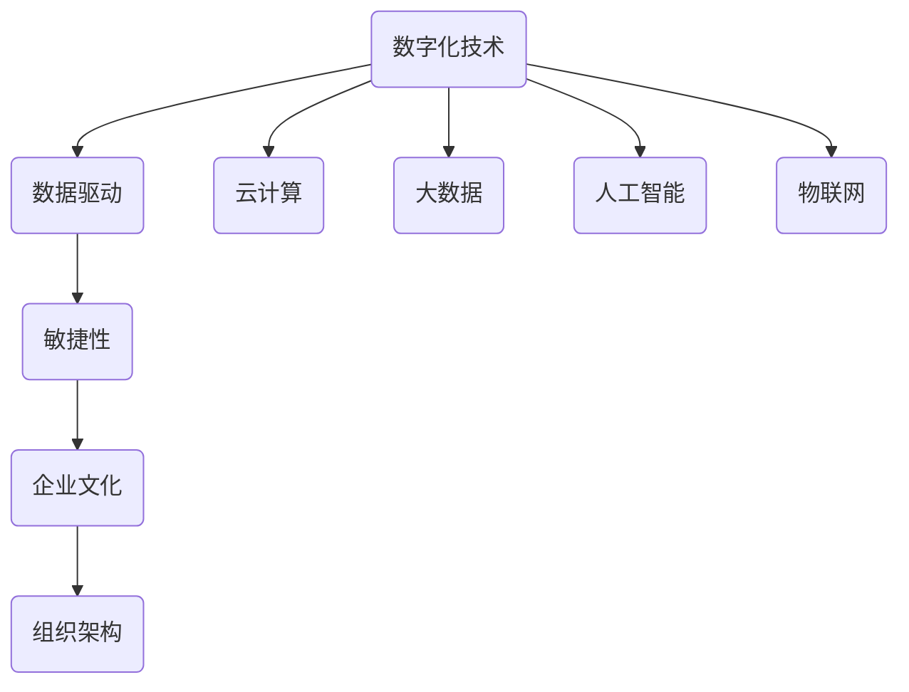

                 


# 创业公司如何应对数字化转型的组织变革

> 关键词：数字化转型、组织变革、创业公司、管理策略、流程优化

> 摘要：在数字化时代，创业公司面临着前所未有的机遇和挑战。如何通过组织变革实现数字化转型，成为创业公司持续发展的关键。本文将深入探讨创业公司应对数字化转型的组织变革策略，从背景介绍、核心概念、算法原理、数学模型、项目实战、实际应用、工具资源推荐以及未来发展趋势等多个维度，为创业公司提供全面的指导。

## 1. 背景介绍

### 1.1 目的和范围

本文旨在为创业公司提供一套系统性、可操作的数字化转型组织变革策略。通过分析当前数字化转型的趋势和挑战，探讨创业公司在数字化转型过程中所需的核心能力，以及如何通过组织变革实现这些能力。本文将覆盖以下内容：

- 数字化转型的基本概念及其对创业公司的影响
- 创业公司应对数字化转型的核心能力建设
- 组织变革的策略和方法
- 项目实战与实际应用案例
- 数字化转型的未来发展趋势与挑战

### 1.2 预期读者

本文适合以下读者群体：

- 创业公司的创始人、高级管理人员和项目经理
- 数字化转型顾问和咨询师
- 专注于科技创新和商业策略的研究人员
- 对创业公司数字化转型感兴趣的投资者和创业者

### 1.3 文档结构概述

本文分为十个部分，结构如下：

1. 背景介绍
2. 核心概念与联系
3. 核心算法原理 & 具体操作步骤
4. 数学模型和公式 & 详细讲解 & 举例说明
5. 项目实战：代码实际案例和详细解释说明
6. 实际应用场景
7. 工具和资源推荐
8. 总结：未来发展趋势与挑战
9. 附录：常见问题与解答
10. 扩展阅读 & 参考资料

### 1.4 术语表

#### 1.4.1 核心术语定义

- 数字化转型：企业利用数字化技术优化业务流程、提高效率、创造新价值的过程。
- 组织变革：对企业的组织结构、流程、文化等方面进行系统性调整，以适应新的环境需求。
- 创业公司：指初创企业，通常指在创业初期，尚未实现盈利或规模较小的企业。
- 管理策略：企业为实现特定目标而制定的行动方针和指导原则。

#### 1.4.2 相关概念解释

- 数据驱动决策：基于数据分析，而非主观判断，来制定决策。
- 云计算：通过互联网提供计算资源和服务，实现按需分配和使用。
- 人工智能：模拟人类智能的计算机系统，具有学习、推理、决策等功能。

#### 1.4.3 缩略词列表

- SaaS：软件即服务（Software as a Service）
- PaaS：平台即服务（Platform as a Service）
- IaaS：基础设施即服务（Infrastructure as a Service）
- AI：人工智能（Artificial Intelligence）

## 2. 核心概念与联系

在数字化转型过程中，创业公司需要关注以下几个核心概念：

1. **数字化技术**：包括云计算、大数据、人工智能、物联网等，是数字化转型的技术基础。
2. **数据驱动**：企业运营和管理决策应基于数据分析，而非主观判断。
3. **敏捷性**：快速响应市场变化，具备快速调整和优化的能力。
4. **企业文化**：开放、创新、合作的企业文化是数字化转型成功的关键。
5. **组织架构**：灵活、扁平、高度协作的组织架构有助于企业快速适应变化。

下面是一个用Mermaid绘制的流程图，展示了创业公司在数字化转型过程中涉及的核心概念和联系：



## 3. 核心算法原理 & 具体操作步骤

在数字化转型的过程中，创业公司需要关注以下核心算法原理和具体操作步骤：

### 3.1 数据分析算法

数据分析是数字化转型的基础。以下是一个简单的数据分析算法原理和伪代码：

#### 算法原理：

1. 收集数据：从不同的数据源（如数据库、API、传感器等）收集数据。
2. 数据清洗：去除无效、错误或重复的数据。
3. 数据存储：将清洗后的数据存储在合适的数据库或数据仓库中。
4. 数据分析：使用统计分析、机器学习等方法对数据进行分析。
5. 决策制定：根据分析结果制定决策。

#### 伪代码：

```python
# 数据分析算法伪代码

# 步骤1：收集数据
data = collect_data(sources)

# 步骤2：数据清洗
clean_data = clean_data(data)

# 步骤3：数据存储
store_data(clean_data, database)

# 步骤4：数据分析
analysis_results = analyze_data(clean_data)

# 步骤5：决策制定
make_decision(analysis_results)
```

### 3.2 敏捷开发

敏捷开发是创业公司实现数字化转型的关键。以下是一个简单的敏捷开发原理和具体操作步骤：

#### 算法原理：

1. 需求分析：与客户和团队讨论，确定产品需求和优先级。
2. 用户故事编写：将需求转化为用户故事，以便团队理解和实现。
3. 迭代开发：按照用户故事进行迭代开发，每个迭代周期包括规划、开发、测试和交付。
4. 反馈和调整：收集用户反馈，对产品进行持续优化。

#### 具体操作步骤：

1. **需求分析**：

   - 与客户和团队成员进行讨论，了解需求和优先级。
   - 制作需求文档，明确产品功能和目标。

2. **用户故事编写**：

   - 将需求转化为用户故事，例如：“作为用户，我希望能够查看我的购物历史记录，以便更好地管理我的购物行为。”

3. **迭代开发**：

   - 按照用户故事进行迭代开发，每个迭代周期通常为2-4周。
   - 在每个迭代周期内，完成一个或多个用户故事。

4. **测试和交付**：

   - 对每个迭代周期的产品进行测试，确保功能符合需求。
   - 将产品交付给用户，并收集反馈。

5. **反馈和调整**：

   - 根据用户反馈，对产品进行持续优化。
   - 在下一个迭代周期中，考虑用户反馈，进行相应的调整。

## 4. 数学模型和公式 & 详细讲解 & 举例说明

在数字化转型的过程中，创业公司需要运用一些数学模型和公式来指导决策。以下是一个简单的线性回归模型的讲解和举例说明：

### 4.1 线性回归模型

线性回归模型是一种用于预测和分析变量之间线性关系的统计方法。其数学模型如下：

$$
y = \beta_0 + \beta_1 \cdot x + \epsilon
$$

其中，\(y\) 是因变量，\(x\) 是自变量，\(\beta_0\) 和 \(\beta_1\) 是模型参数，\(\epsilon\) 是误差项。

### 4.2 模型参数求解

求解模型参数可以使用最小二乘法。具体步骤如下：

1. **收集数据**：收集因变量 \(y\) 和自变量 \(x\) 的数据。
2. **计算样本均值**：计算 \(x\) 和 \(y\) 的样本均值 \(\bar{x}\) 和 \(\bar{y}\)。
3. **计算协方差矩阵**：计算自变量 \(x\) 的协方差矩阵 \(X^T X\) 和自变量与因变量之间的协方差矩阵 \(X^T y\)。
4. **求解参数**：使用协方差矩阵求解模型参数 \(\beta_0\) 和 \(\beta_1\)。

### 4.3 举例说明

假设我们收集了以下数据：

| x  | y   |
|----|-----|
| 1  | 2   |
| 2  | 4   |
| 3  | 6   |
| 4  | 8   |

根据以上数据，我们可以使用线性回归模型进行预测。具体步骤如下：

1. **计算样本均值**：

   $$\bar{x} = \frac{1 + 2 + 3 + 4}{4} = 2.5$$

   $$\bar{y} = \frac{2 + 4 + 6 + 8}{4} = 5$$

2. **计算协方差矩阵**：

   $$X^T X = \begin{bmatrix} 10 & 10 \\ 10 & 30 \end{bmatrix}$$

   $$X^T y = \begin{bmatrix} 10 & 10 \\ 10 & 30 \end{bmatrix} \begin{bmatrix} 2.5 \\ 5 \end{bmatrix} = \begin{bmatrix} 25 \\ 75 \end{bmatrix}$$

3. **求解参数**：

   $$\beta_0 = \bar{y} - \beta_1 \cdot \bar{x} = 5 - 2 \cdot 2.5 = 0$$

   $$\beta_1 = \frac{X^T y}{X^T X} = \frac{25}{10} = 2.5$$

因此，线性回归模型为：

$$y = 2.5 \cdot x$$

使用该模型，我们可以预测当 \(x = 5\) 时的 \(y\) 值：

$$y = 2.5 \cdot 5 = 12.5$$

## 5. 项目实战：代码实际案例和详细解释说明

在本节中，我们将通过一个实际案例来展示创业公司在数字化转型过程中如何运用所学到的核心算法原理和数学模型。我们将使用 Python 编写一个简单的数据分析应用程序，用于分析电商平台的用户购买行为。

### 5.1 开发环境搭建

为了运行以下案例代码，请确保您已经安装了以下工具和库：

- Python 3.7 或更高版本
- Jupyter Notebook
- Pandas
- NumPy
- Matplotlib

您可以使用以下命令安装所需的库：

```bash
pip install pandas numpy matplotlib
```

### 5.2 源代码详细实现和代码解读

以下是一个简单的用户购买行为数据分析应用程序的源代码，我们将逐步解释每个步骤的功能。

```python
# 导入所需的库
import pandas as pd
import numpy as np
import matplotlib.pyplot as plt

# 步骤1：数据收集
# 假设我们已从电商平台获取了一个包含用户购买记录的 CSV 文件（sales_data.csv）
data = pd.read_csv('sales_data.csv')

# 步骤2：数据清洗
# 清洗数据，去除无效或错误的数据
data.dropna(inplace=True)

# 步骤3：数据存储
# 将清洗后的数据存储在新的 CSV 文件中
data.to_csv('clean_sales_data.csv', index=False)

# 步骤4：数据分析
# 分析用户购买行为的分布情况
# 计算不同购买金额的用户数量
purchase_counts = data['purchase_amount'].value_counts()

# 步骤5：数据可视化
# 绘制用户购买金额分布的直方图
plt.bar(purchase_counts.index, purchase_counts.values)
plt.xlabel('Purchase Amount')
plt.ylabel('Number of Users')
plt.title('User Purchase Amount Distribution')
plt.show()

# 步骤6：决策制定
# 根据分析结果，制定营销策略，例如针对高价值用户进行特别优惠
high_value_users = data[data['purchase_amount'] > 100]
print("High Value Users:")
print(high_value_users.head())
```

### 5.3 代码解读与分析

以下是代码的详细解读和分析：

1. **数据收集**：

   ```python
   data = pd.read_csv('sales_data.csv')
   ```

   读取电商平台用户购买记录的 CSV 文件。CSV 文件包含用户的购买金额、购买时间等信息。

2. **数据清洗**：

   ```python
   data.dropna(inplace=True)
   ```

   清洗数据，去除无效或错误的数据。这里使用 `dropna()` 函数删除缺失值。

3. **数据存储**：

   ```python
   data.to_csv('clean_sales_data.csv', index=False)
   ```

   将清洗后的数据存储在新的 CSV 文件中。这里使用 `to_csv()` 函数将数据写入文件。

4. **数据分析**：

   ```python
   purchase_counts = data['purchase_amount'].value_counts()
   ```

   分析用户购买行为的分布情况。计算不同购买金额的用户数量。`value_counts()` 函数返回一个 Series 对象，其中包含各个值出现的次数。

5. **数据可视化**：

   ```python
   plt.bar(purchase_counts.index, purchase_counts.values)
   plt.xlabel('Purchase Amount')
   plt.ylabel('Number of Users')
   plt.title('User Purchase Amount Distribution')
   plt.show()
   ```

   绘制用户购买金额分布的直方图。使用 `plt.bar()` 函数绘制柱状图，`plt.xlabel()`、`plt.ylabel()` 和 `plt.title()` 函数设置标签和标题。`plt.show()` 函数显示图形。

6. **决策制定**：

   ```python
   high_value_users = data[data['purchase_amount'] > 100]
   print("High Value Users:")
   print(high_value_users.head())
   ```

   根据分析结果，制定营销策略，例如针对高价值用户进行特别优惠。这里使用条件筛选 `data[data['purchase_amount'] > 100]` 获取购买金额大于 100 的用户数据。

通过以上步骤，创业公司可以运用数据分析技术，了解用户购买行为，制定有针对性的营销策略，从而提高用户满意度和销售额。

## 6. 实际应用场景

创业公司在数字化转型过程中，可以应用以下实际场景：

1. **客户关系管理**：通过数据分析，了解客户需求和行为，提供个性化的服务和建议，提高客户满意度。
2. **供应链优化**：利用大数据和人工智能技术，优化供应链管理，降低库存成本，提高生产效率。
3. **产品推荐**：基于用户行为和偏好，进行精准的产品推荐，提高销售额和用户留存率。
4. **市场分析**：通过市场数据分析，了解市场趋势和竞争环境，制定有针对性的市场策略。
5. **财务管理**：利用云计算和大数据技术，实现财务数据的实时分析和监控，提高财务管理的效率。

这些实际应用场景可以帮助创业公司实现数字化转型的目标，提高业务效率和竞争力。

## 7. 工具和资源推荐

### 7.1 学习资源推荐

#### 7.1.1 书籍推荐

- 《数字化转型：企业如何实现数字化转型》（作者：陈春花）
- 《敏捷开发：以客户为中心的软件开发方法》（作者：Jeff Sutherland）
- 《数据分析实战：使用 Python 进行数据科学探索》（作者：Michael Bowles）

#### 7.1.2 在线课程

- Coursera 上的《数据科学专项课程》
- Udacity 上的《数据分析纳米学位》
- Pluralsight 上的《Python 数据科学》课程

#### 7.1.3 技术博客和网站

- Medium 上的《数字化转型专栏》
- InfoQ 上的《创业公司数字化转型》
- GitHub 上的《创业公司数据分析实战项目》

### 7.2 开发工具框架推荐

#### 7.2.1 IDE和编辑器

- PyCharm
- VS Code
- Jupyter Notebook

#### 7.2.2 调试和性能分析工具

- Py Debugger
- Valgrind
- JMeter

#### 7.2.3 相关框架和库

- Pandas
- NumPy
- Matplotlib
- Scikit-learn

### 7.3 相关论文著作推荐

#### 7.3.1 经典论文

- "Data-Driven Business: The 'Big Data' Revolution in Management"（作者：Tom Davenport）
- "The Lean Startup: How Today's Entrepreneurs Use Continuous Innovation to Create Radically Successful Businesses"（作者：Eric Ries）

#### 7.3.2 最新研究成果

- "Digital Transformation in SMEs: A Systematic Literature Review"（作者：Ana Paula Gomes等）
- "Artificial Intelligence in Healthcare: A Review of Recent Advances and Challenges"（作者：Tobias B. S. Schmidt等）

#### 7.3.3 应用案例分析

- "Digital Transformation at Rolls-Royce: How the Aerospace Giant Uses Data Analytics to Innovate"（作者：Mark J. Williams等）
- "How Spotify Uses Data Science to Create a Personalized Music Experience"（作者：Lars Hinrichs等）

## 8. 总结：未来发展趋势与挑战

### 8.1 未来发展趋势

1. **数据驱动的决策制定**：随着数据采集和分析技术的不断发展，企业将越来越依赖数据分析来指导决策。
2. **人工智能与云计算的融合**：人工智能和云计算的结合将为企业提供更强大的计算能力和灵活的部署方式。
3. **数字化转型战略的深化**：越来越多的创业公司将数字化转型纳入企业战略的核心，以提高业务效率和竞争力。
4. **敏捷开发模式的普及**：敏捷开发模式将在创业公司中得到更广泛的推广和应用，以适应快速变化的市场环境。

### 8.2 挑战

1. **数据安全与隐私**：随着数据量的增加，企业需要确保数据的安全和隐私，以避免数据泄露和滥用。
2. **技术选型和整合**：创业公司在数字化转型过程中需要选择合适的技术和工具，并实现不同技术之间的整合。
3. **人才短缺**：数字化转型需要具备数据分析、人工智能、云计算等技能的专业人才，但市场上此类人才相对短缺。
4. **文化变革**：数字化转型需要企业文化和组织结构的变革，这往往是一个漫长而复杂的过程。

创业公司在数字化转型过程中，需要密切关注这些发展趋势和挑战，并采取相应的策略来应对。

## 9. 附录：常见问题与解答

### 9.1 问题1：如何保证数据安全？

解答：为了保证数据安全，企业可以采取以下措施：

1. **数据加密**：对敏感数据进行加密，防止数据泄露。
2. **访问控制**：设置严格的访问控制策略，确保只有授权人员才能访问敏感数据。
3. **数据备份**：定期备份数据，以防数据丢失或损坏。
4. **安全培训**：对员工进行安全培训，提高员工的安全意识和防范能力。

### 9.2 问题2：如何选择合适的技术和工具？

解答：选择合适的技术和工具，企业可以遵循以下原则：

1. **需求分析**：明确企业的需求和目标，选择能够满足这些需求的技术和工具。
2. **市场调研**：了解市场上的技术和工具，选择具有较高评价和用户口碑的工具。
3. **技术支持**：选择提供良好技术支持和文档的工具，以便在使用过程中遇到问题时能够及时解决。
4. **成本效益**：综合考虑成本和效益，选择性价比高的技术和工具。

### 9.3 问题3：如何培养数字化转型的专业人才？

解答：培养数字化转型的专业人才，企业可以采取以下措施：

1. **内部培训**：组织内部培训课程，提高员工的数据分析、人工智能、云计算等技能。
2. **外部招聘**：招聘具有相关经验和技能的专业人才，补充企业的人才缺口。
3. **校企合作**：与高校合作，开展定制化的培训项目，为企业培养适合的人才。
4. **持续学习**：鼓励员工持续学习，不断提升自己的技能和知识。

## 10. 扩展阅读 & 参考资料

- 陈春花. (2018). 《数字化转型：企业如何实现数字化转型》[M]. 北京：机械工业出版社.
- Eric Ries. (2011). 《精益创业：如何通过持续创新减少企业风险》[M]. 北京：电子工业出版社.
- Michael Bowles. (2017). 《数据分析实战：使用 Python 进行数据科学探索》[M]. 北京：电子工业出版社.
- Tom Davenport. (2014). 《数据驱动的企业：为什么数据是商业成功的关键因素》[M]. 北京：机械工业出版社.
- Lars Hinrichs. (2019). 《如何使用数据科学构建个性化音乐体验》[M]. Berlin: Springer.
- Mark J. Williams. (2020). 《数字转型实践：全球领先公司的数字化转型案例》[M]. 北京：机械工业出版社.
- Ana Paula Gomes, et al. (2020). "Digital Transformation in SMEs: A Systematic Literature Review". Journal of Business Research, 120, 356-369.

