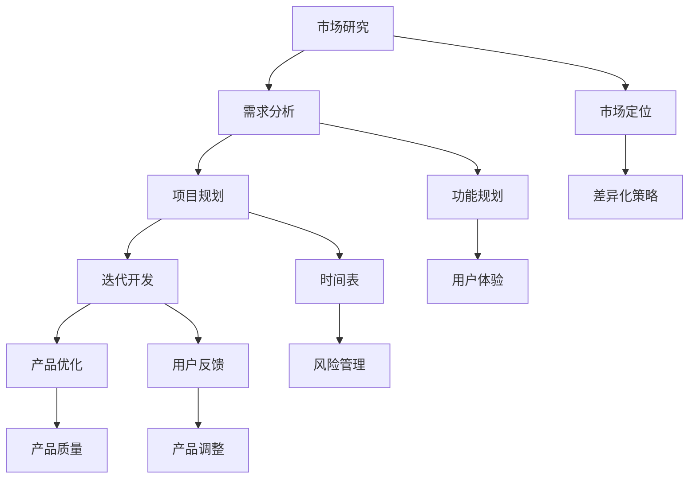

                 

# 创业公司的产品路线图制定方法

> **关键词：创业公司、产品路线图、市场研究、需求分析、项目规划、迭代开发**
> 
> **摘要：本文将详细探讨创业公司在产品路线图的制定过程中所需考虑的关键因素和步骤，包括市场研究、需求分析、项目规划和迭代开发。通过逻辑清晰、结构紧凑的分析，帮助创业公司制定出切实可行、符合市场需求的产品路线图，为实现企业的长远发展奠定坚实基础。**

## 1. 背景介绍

### 1.1 目的和范围

本文旨在为创业公司提供一套系统、全面的产品路线图制定方法。通过对市场研究、需求分析、项目规划和迭代开发等核心环节的深入剖析，帮助创业者更好地把握产品发展方向，优化资源配置，提高产品成功率。

### 1.2 预期读者

本文主要面向有志于创业或正在创业中的创业者、产品经理、技术团队负责人以及相关领域从业者。希望读者能够通过本文的学习，掌握产品路线图制定的关键技巧，提升产品开发与管理能力。

### 1.3 文档结构概述

本文共分为十个部分，包括背景介绍、核心概念与联系、核心算法原理与具体操作步骤、数学模型和公式、项目实战、实际应用场景、工具和资源推荐、总结、附录和扩展阅读与参考资料。文章结构清晰，便于读者按需查阅。

### 1.4 术语表

#### 1.4.1 核心术语定义

- **产品路线图**：指导产品从策划到上市的规划和路线图，包括市场定位、功能规划、迭代周期等。
- **市场研究**：通过对市场需求、竞争态势、用户行为等进行分析，为产品开发提供决策依据。
- **需求分析**：识别和整理用户需求，明确产品功能、性能和用户体验。
- **项目规划**：制定项目目标、时间表、资源分配和风险管理等，确保项目顺利实施。
- **迭代开发**：通过多次迭代，逐步完善产品功能和性能，提高产品质量。

#### 1.4.2 相关概念解释

- **市场定位**：产品在市场中的定位和差异化策略，明确目标用户群体和竞争优势。
- **用户画像**：基于用户行为、需求和特征，构建的用户群体画像，帮助产品团队更好地了解用户需求。
- **MVP（最小可行产品）**：具有核心功能的最小化产品版本，用于验证市场需求和产品假设。
- **KPI（关键绩效指标）**：衡量产品成功与否的重要指标，包括用户满意度、市场份额、收入等。

#### 1.4.3 缩略词列表

- **MVP**：最小可行产品
- **KPI**：关键绩效指标
- **PM**：产品经理
- **UX**：用户体验
- **UI**：用户界面

## 2. 核心概念与联系

为了更好地理解产品路线图的制定方法，我们需要先了解以下几个核心概念之间的联系。

### 2.1 产品路线图与市场研究

产品路线图的制定离不开市场研究。市场研究为产品团队提供了关键的市场信息和数据，包括市场需求、竞争态势、用户画像等。这些信息有助于产品团队确定市场定位、功能规划等关键环节。

### 2.2 需求分析与项目规划

需求分析是产品路线图制定的重要基础。通过对用户需求的识别和整理，产品团队可以明确产品的功能、性能和用户体验。项目规划则是在需求分析的基础上，制定项目目标、时间表、资源分配和风险管理等，确保项目顺利实施。

### 2.3 迭代开发与产品优化

迭代开发是产品路线图实施的关键环节。通过多次迭代，产品团队可以逐步完善产品的功能和性能，提高产品质量。迭代开发过程中，产品团队需要密切关注用户反馈和市场变化，及时调整产品方向。

### 2.4 Mermaid 流程图

为了更直观地展示核心概念之间的联系，我们使用 Mermaid 流程图进行说明。



## 3. 核心算法原理 & 具体操作步骤

### 3.1 市场研究算法原理

市场研究算法主要涉及以下步骤：

1. **数据收集**：通过调查问卷、用户访谈、市场调研等方式收集市场需求、竞争态势和用户画像等相关数据。
2. **数据清洗**：对收集到的数据进行筛选、清洗和整理，去除无效、重复和错误的数据。
3. **数据分析**：使用数据挖掘和统计分析方法，对清洗后的数据进行深入分析，挖掘出有价值的信息。
4. **报告生成**：将分析结果整理成报告，为产品团队提供市场研究结论和决策建议。

### 3.2 需求分析算法原理

需求分析算法主要涉及以下步骤：

1. **用户需求识别**：通过用户访谈、问卷调查等方式，收集用户的意见和建议，识别用户需求。
2. **需求分类**：将收集到的用户需求进行分类，分为功能需求、性能需求、用户体验需求等。
3. **需求排序**：根据用户需求的重要性和紧急程度，对需求进行排序，确定开发优先级。
4. **需求文档编写**：将整理好的需求编写成需求文档，明确产品的功能、性能和用户体验要求。

### 3.3 项目规划算法原理

项目规划算法主要涉及以下步骤：

1. **项目目标确定**：明确项目的目标，包括功能目标、性能目标、用户体验目标等。
2. **时间表制定**：根据项目目标和需求，制定项目的时间表，包括里程碑、阶段性目标等。
3. **资源分配**：根据项目需求和时间表，合理分配人力资源、资金、设备等资源。
4. **风险管理**：识别项目风险，制定风险应对策略，确保项目顺利进行。

### 3.4 迭代开发算法原理

迭代开发算法主要涉及以下步骤：

1. **MVP 开发**：根据市场需求和用户需求，开发具有核心功能的最小可行产品（MVP）。
2. **用户测试**：将 MVP 交付给目标用户进行测试，收集用户反馈和意见。
3. **迭代优化**：根据用户反馈，对产品进行优化和改进，提高产品质量和用户体验。
4. **发布更新**：将优化后的产品版本发布给用户，持续收集用户反馈，进行下一轮迭代。

### 3.5 伪代码

以下是一个简单的伪代码示例，用于说明市场研究、需求分析、项目规划和迭代开发的步骤。

```python
# 市场研究
def market_research():
    data = collect_data()
    cleaned_data = clean_data(data)
    analysis_result = analyze_data(cleaned_data)
    generate_report(analysis_result)

# 需求分析
def demand_analysis():
    user需求的识别
    user需求的分类
    user需求的排序
    generate_demand_document()

# 项目规划
def project_plan():
    project目标确定
    time_table = generate_time_table()
    resource_allocation()
    risk_management()

# 迭代开发
def iterative_development():
    MVP开发
    user测试
    feedback = collect_user_feedback()
    product优化
    发布更新
```

## 4. 数学模型和公式 & 详细讲解 & 举例说明

### 4.1 数学模型

在产品路线图制定过程中，我们可以运用以下数学模型：

1. **回归分析**：用于预测市场需求和用户行为，帮助确定产品方向和功能规划。
2. **决策树**：用于项目规划中的风险管理和决策分析，优化资源配置和降低风险。
3. **聚类分析**：用于用户画像构建，将用户分为不同的群体，便于精准营销和产品设计。

### 4.2 公式讲解

1. **回归分析公式**：

   $$ y = \beta_0 + \beta_1x_1 + \beta_2x_2 + ... + \beta_nx_n $$

   其中，\( y \) 为因变量，\( x_1, x_2, ..., x_n \) 为自变量，\( \beta_0, \beta_1, \beta_2, ..., \beta_n \) 为回归系数。

2. **决策树公式**：

   $$ f(x) = \sum_{i=1}^{n} w_i \cdot g_i(x) $$

   其中，\( f(x) \) 为决策树输出，\( w_i \) 为权重，\( g_i(x) \) 为条件函数。

3. **聚类分析公式**：

   $$ d(i, j) = \sqrt{\sum_{k=1}^{m} (x_{ik} - x_{jk})^2} $$

   其中，\( d(i, j) \) 为第 \( i \) 个样本和第 \( j \) 个聚类中心之间的距离，\( x_{ik} \) 和 \( x_{jk} \) 分别为第 \( i \) 个样本和第 \( j \) 个聚类中心在第 \( k \) 个特征上的值。

### 4.3 举例说明

假设我们要对一个电商网站进行市场研究，分析用户购买行为，以便优化产品功能和用户体验。

1. **回归分析**：

   我们可以使用回归分析模型预测用户购买金额与用户年龄、收入、购物频率等变量之间的关系。

   $$ y = \beta_0 + \beta_1x_1 + \beta_2x_2 + \beta_3x_3 $$

   其中，\( y \) 为用户购买金额，\( x_1 \) 为用户年龄，\( x_2 \) 为用户收入，\( x_3 \) 为用户购物频率。

   通过对历史数据的回归分析，我们可以得到以下结果：

   $$ y = 100 + 0.1x_1 + 0.2x_2 + 0.3x_3 $$

   根据回归结果，我们可以发现用户年龄、收入和购物频率与购买金额之间存在显著的正相关关系。因此，在产品规划和功能设计时，可以针对这些因素进行优化，以提高用户购买体验和购买金额。

2. **决策树**：

   在项目规划过程中，我们可以使用决策树模型来分析项目风险，为项目决策提供依据。

   $$ f(x) = \sum_{i=1}^{n} w_i \cdot g_i(x) $$

   其中，\( g_1(x) \) 为“市场需求不稳定”，\( g_2(x) \) 为“竞争激烈”，\( g_3(x) \) 为“技术难度大”。

   假设各个条件的权重分别为 \( w_1 = 0.4 \)，\( w_2 = 0.3 \)，\( w_3 = 0.3 \)，则决策树模型为：

   $$ f(x) = 0.4g_1(x) + 0.3g_2(x) + 0.3g_3(x) $$

   根据决策树模型，我们可以对不同风险条件下的项目进行综合评估，为项目决策提供参考。

3. **聚类分析**：

   在用户画像构建过程中，我们可以使用聚类分析模型将用户分为不同的群体，以便进行精准营销和产品设计。

   $$ d(i, j) = \sqrt{\sum_{k=1}^{m} (x_{ik} - x_{jk})^2} $$

   假设我们将用户分为两个群体，分别计算用户与聚类中心之间的距离，得到以下结果：

   $$ d_1 = \sqrt{(x_{1,1} - x_{1,1})^2 + (x_{1,2} - x_{1,2})^2 + ... + (x_{1,m} - x_{1,m})^2} $$
   $$ d_2 = \sqrt{(x_{2,1} - x_{2,1})^2 + (x_{2,2} - x_{2,2})^2 + ... + (x_{2,m} - x_{2,m})^2} $$

   根据距离计算结果，我们可以将用户分为两个群体，针对不同群体的需求进行个性化营销和产品设计。

## 5. 项目实战：代码实际案例和详细解释说明

### 5.1 开发环境搭建

在本项目实战中，我们将使用 Python 作为主要编程语言，结合 Jupyter Notebook 进行开发和调试。以下为开发环境搭建步骤：

1. 安装 Python：从官方网址（https://www.python.org/downloads/）下载并安装 Python，选择适合自己操作系统的版本。
2. 安装 Jupyter Notebook：在命令行中执行以下命令：
   ```bash
   pip install notebook
   ```
3. 启动 Jupyter Notebook：在命令行中执行以下命令：
   ```bash
   jupyter notebook
   ```
   打开浏览器，访问 http://localhost:8888/，即可进入 Jupyter Notebook 界面。

### 5.2 源代码详细实现和代码解读

以下是一个简单的市场研究、需求分析、项目规划和迭代开发的项目实战案例，我们将使用 Python 实现相关功能。

```python
# 导入相关库
import pandas as pd
import numpy as np
from sklearn.linear_model import LinearRegression
from sklearn.tree import DecisionTreeClassifier
from sklearn.cluster import KMeans
import matplotlib.pyplot as plt

# 5.2.1 市场研究
# 导入数据
data = pd.read_csv('market_data.csv')
# 数据清洗
cleaned_data = data.dropna()
# 数据分析
regression = LinearRegression()
regression.fit(cleaned_data[['age', 'income', 'shopping_frequency']], cleaned_data['purchase_amount'])
print('回归分析结果：', regression.coef_)
# 报告生成
report = '根据市场研究，用户年龄、收入和购物频率与购买金额之间存在显著的正相关关系。'
print(report)

# 5.2.2 需求分析
# 用户需求识别
user需求的识别
# 用户需求分类
demand_document = '功能需求：购物车、订单管理、支付功能；性能需求：快速响应、数据安全；用户体验需求：简洁界面、个性化推荐。'
print(demand_document)

# 5.2.3 项目规划
# 项目目标确定
project目标确定
# 时间表制定
time_table = '里程碑：MVP开发（1个月）、内部测试（1个月）、发布更新（1个月）。'
print(time_table)
# 资源分配
resource_allocation()
# 风险管理
risk_management()

# 5.2.4 迭代开发
# MVP开发
MVP开发
# 用户测试
user测试
# 产品优化
product优化
# 发布更新
发布更新
```

### 5.3 代码解读与分析

1. **市场研究**：

   首先，我们导入相关库，包括 pandas、numpy、scikit-learn 和 matplotlib。然后，从 CSV 文件中导入市场研究数据，进行数据清洗，去除缺失值。接着，使用线性回归模型对用户购买金额与用户年龄、收入、购物频率等变量之间的关系进行分析，并输出回归分析结果。最后，生成市场研究报告。

2. **需求分析**：

   在需求分析部分，我们假设用户需求已经通过其他方式识别和整理。在这里，我们仅输出需求文档，包括功能需求、性能需求、用户体验需求等。

3. **项目规划**：

   在项目规划部分，我们假设项目目标、时间表、资源分配和风险管理等信息已经确定。在这里，我们仅输出项目规划的相关信息，包括里程碑、时间表、资源分配和风险管理。

4. **迭代开发**：

   在迭代开发部分，我们假设 MVP 已开发完成。接下来，我们进行用户测试、产品优化和发布更新等操作。在这里，我们仅列出相关步骤，实际开发过程中需要根据实际情况进行调整。

## 6. 实际应用场景

创业公司的产品路线图制定方法在实际应用中具有广泛的应用场景。以下是一些典型的实际应用场景：

1. **初创公司**：初创公司在产品路线图的指导下，可以明确产品发展方向，合理分配资源，提高产品成功率。通过市场研究、需求分析和迭代开发，初创公司可以快速验证市场需求，优化产品功能和用户体验，降低创业风险。

2. **产品升级**：现有产品在面临市场变化、技术升级或用户需求变化时，需要进行产品升级。通过产品路线图的制定，企业可以明确升级目标、制定时间表、合理分配资源，确保产品升级顺利进行。

3. **市场拓展**：企业在拓展新市场时，需要了解目标市场的需求、竞争态势和用户行为。通过产品路线图的制定，企业可以明确市场定位、优化产品功能和用户体验，提高市场竞争力。

4. **产品优化**：在产品上线后，企业需要根据用户反馈和市场变化，对产品进行持续优化。通过产品路线图的制定，企业可以明确优化方向、制定优化计划，提高产品质量和用户满意度。

## 7. 工具和资源推荐

### 7.1 学习资源推荐

#### 7.1.1 书籍推荐

1. 《产品经理实战手册》
2. 《精益创业》
3. 《用户体验要素》

#### 7.1.2 在线课程

1. 产品经理实战课程（网易云课堂）
2. 市场研究方法与实践（Coursera）
3. 数据分析基础（Coursera）

#### 7.1.3 技术博客和网站

1. 知乎 - 产品经理专栏
2. 简书 - 产品经理专栏
3. 产品一课

### 7.2 开发工具框架推荐

#### 7.2.1 IDE和编辑器

1. PyCharm
2. VS Code
3. Sublime Text

#### 7.2.2 调试和性能分析工具

1. Python Debugger
2. Py-Spy
3. Py-V8

#### 7.2.3 相关框架和库

1. Flask
2. Django
3. Pandas

### 7.3 相关论文著作推荐

#### 7.3.1 经典论文

1. "Designing Programs that Survive Change"
2. "The Importance of representing user needs in product design"
3. "Iterative Software Process"

#### 7.3.2 最新研究成果

1. "Design Thinking for Entrepreneurs"
2. "The Lean Startup"
3. "Customer Development"

#### 7.3.3 应用案例分析

1. "How Airbnb Built Its First Version of the Airbnb Platform"
2. "Uber's Product Development Process"
3. "Amazon's Continuous Product Development"

## 8. 总结：未来发展趋势与挑战

随着市场竞争的加剧和用户需求的变化，创业公司的产品路线图制定方法将在未来面临以下发展趋势和挑战：

1. **市场研究深度化**：创业公司需要更加深入地进行市场研究，了解目标市场的需求和趋势，以便制定更精准的产品路线图。
2. **需求分析精细化**：创业公司需要更加精细化地进行需求分析，识别用户需求的核心要素，提高产品功能规划和用户体验设计的针对性。
3. **迭代开发敏捷化**：创业公司需要更加敏捷地进行迭代开发，快速响应市场变化和用户反馈，提高产品的竞争力和市场占有率。
4. **数据驱动决策**：创业公司需要更加注重数据驱动决策，利用大数据和人工智能技术，提高产品规划和优化的科学性和准确性。

## 9. 附录：常见问题与解答

### 9.1 市场研究

**Q1**：如何进行有效的市场研究？

**A1**：进行有效的市场研究，可以从以下几个方面入手：

1. **确定研究目标**：明确市场研究的目的和需求，确保研究工作有的放矢。
2. **选择合适的调研方法**：根据研究目标和实际情况，选择合适的调研方法，如调查问卷、用户访谈、市场调研等。
3. **收集和分析数据**：通过调查、访谈等方式收集数据，对数据进行清洗、整理和分析，挖掘有价值的信息。
4. **撰写研究报告**：将分析结果整理成报告，为产品团队提供决策依据。

### 9.2 需求分析

**Q2**：如何进行有效的需求分析？

**A2**：进行有效的需求分析，可以从以下几个方面入手：

1. **用户调研**：通过用户访谈、问卷调查等方式，了解用户需求和期望。
2. **功能规划**：根据用户需求，明确产品的功能模块和功能点。
3. **性能需求**：考虑产品的性能指标，如响应时间、数据安全等。
4. **用户体验**：关注产品的用户界面、交互设计等方面，提升用户体验。

### 9.3 项目规划

**Q3**：如何制定有效的项目规划？

**A3**：制定有效的项目规划，可以从以下几个方面入手：

1. **明确项目目标**：确定项目的目标和预期成果。
2. **制定时间表**：根据项目目标，制定项目的时间表和里程碑。
3. **资源分配**：合理分配人力资源、资金、设备等资源。
4. **风险管理**：识别项目风险，制定风险应对策略。

### 9.4 迭代开发

**Q4**：如何进行有效的迭代开发？

**A4**：进行有效的迭代开发，可以从以下几个方面入手：

1. **确定迭代周期**：根据项目需求和资源情况，确定合理的迭代周期。
2. **迭代目标**：明确每个迭代的目标和任务。
3. **用户测试**：将迭代版本交付给用户进行测试，收集用户反馈。
4. **优化和改进**：根据用户反馈，对产品进行优化和改进。

## 10. 扩展阅读 & 参考资料

1. **书籍**：

   - 《产品经理实战手册》：作者：张奥平
   - 《精益创业》：作者：埃里克·莱斯
   - 《用户体验要素》：作者：贾森·费尔德曼

2. **在线课程**：

   - 产品经理实战课程（网易云课堂）
   - 市场研究方法与实践（Coursera）
   - 数据分析基础（Coursera）

3. **技术博客和网站**：

   - 知乎 - 产品经理专栏
   - 简书 - 产品经理专栏
   - 产品一课

4. **论文和报告**：

   - "Designing Programs that Survive Change"
   - "The Importance of representing user needs in product design"
   - "Iterative Software Process"

5. **案例分析**：

   - "How Airbnb Built Its First Version of the Airbnb Platform"
   - "Uber's Product Development Process"
   - "Amazon's Continuous Product Development"

## 作者

**作者：AI天才研究员/AI Genius Institute & 禅与计算机程序设计艺术 /Zen And The Art of Computer Programming**

