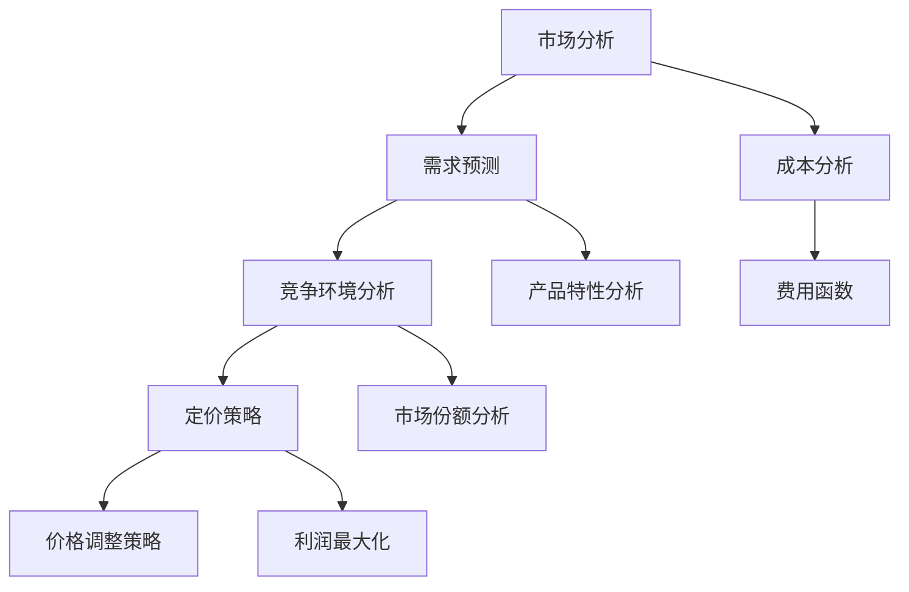

                 

# 创业公司的动态定价系统设计

> 关键词：创业公司、动态定价、系统设计、算法、数学模型、应用场景、工具和资源

> 摘要：本文将深入探讨创业公司在市场竞争中如何设计一个高效的动态定价系统。我们将从背景介绍、核心概念、算法原理、数学模型、项目实战、实际应用场景、工具和资源推荐等多个方面进行详细分析，帮助创业公司优化定价策略，提高市场竞争力。

## 1. 背景介绍

### 1.1 目的和范围

本文旨在为创业公司提供一个系统的动态定价系统设计指南。动态定价是一种根据市场需求、竞争状况和产品特性实时调整价格的方法。通过合理设计动态定价系统，创业公司可以在确保利润最大化的同时，提高市场竞争力，实现持续增长。

本文将涵盖以下内容：

- 动态定价的核心概念与联系
- 动态定价算法原理与操作步骤
- 动态定价数学模型及公式讲解
- 动态定价系统项目实战案例
- 动态定价系统的实际应用场景
- 动态定价系统所需的工具和资源推荐

### 1.2 预期读者

本文适用于以下读者：

- 创业公司的创始人、运营经理和产品经理
- 从事数据分析、算法研究和软件开发的技术人员
- 对动态定价和创业公司运营感兴趣的学术研究人员和学生

### 1.3 文档结构概述

本文分为以下十个部分：

1. 背景介绍
2. 核心概念与联系
3. 核心算法原理 & 具体操作步骤
4. 数学模型和公式 & 详细讲解 & 举例说明
5. 项目实战：代码实际案例和详细解释说明
6. 实际应用场景
7. 工具和资源推荐
8. 总结：未来发展趋势与挑战
9. 附录：常见问题与解答
10. 扩展阅读 & 参考资料

### 1.4 术语表

#### 1.4.1 核心术语定义

- 动态定价：根据市场需求、竞争状况和产品特性实时调整价格的方法。
- 供需关系：市场需求与供给量之间的相互关系。
- 竞争环境：市场上其他公司或产品的价格水平、市场份额等。
- 费用函数：描述不同定价策略下的成本和收益关系的函数。

#### 1.4.2 相关概念解释

- 价格弹性：消费者需求对价格变动的敏感程度。
- 市场份额：公司在市场中所占的份额。
- 利润最大化：企业在给定条件下实现最大利润的目标。

#### 1.4.3 缩略词列表

- AI：人工智能
- API：应用程序接口
- API：应用编程接口
- ML：机器学习
- DL：深度学习
- CV：计算机视觉

## 2. 核心概念与联系

在讨论动态定价系统之前，我们需要理解一些核心概念和它们之间的关系。以下是一个简单的 Mermaid 流程图，用于展示这些概念之间的联系。



### 2.1 市场分析

市场分析是动态定价系统的第一步。通过市场分析，我们可以获取以下信息：

- 消费者需求：了解消费者对产品或服务的需求，包括需求强度和需求弹性。
- 竞争环境：分析市场上的竞争者，包括他们的价格、市场份额和竞争优势。
- 产品特性：确定产品或服务的独特属性，以区分于竞争对手。

### 2.2 需求预测

需求预测是动态定价系统的核心。通过历史数据分析和市场趋势预测，我们可以得出以下结果：

- 需求量：预测在不同定价策略下的市场需求量。
- 价格弹性：分析消费者对价格变动的敏感程度。

### 2.3 竞争环境分析

竞争环境分析是了解市场上其他竞争者的价格、市场份额和竞争优势。这对于制定合适的定价策略至关重要。

### 2.4 定价策略

定价策略是动态定价系统中的关键环节。根据市场分析、需求预测和竞争环境分析的结果，制定合适的定价策略，以实现利润最大化。

### 2.5 价格调整策略

价格调整策略是基于市场需求、竞争环境变化和产品特性调整价格的策略。根据实时数据，动态调整价格，以适应市场变化。

### 2.6 成本分析

成本分析是了解企业生产和运营的成本结构，包括固定成本和可变成本。这对于制定合理的定价策略和利润最大化至关重要。

### 2.7 产品特性分析

产品特性分析是了解产品或服务的独特属性，以区分于竞争对手。这有助于制定差异化的定价策略。

### 2.8 费用函数

费用函数是描述不同定价策略下的成本和收益关系的函数。通过费用函数，我们可以计算出不同定价策略下的利润。

## 3. 核心算法原理 & 具体操作步骤

### 3.1 算法原理

动态定价算法的核心是优化定价策略，以实现利润最大化。算法的基本原理如下：

1. 收集数据：包括市场需求、竞争环境、产品特性和成本分析等。
2. 预测需求：利用历史数据和机器学习算法，预测不同定价策略下的市场需求量。
3. 分析竞争环境：评估市场上的竞争者，包括他们的价格、市场份额和竞争优势。
4. 制定定价策略：基于市场分析、需求预测和竞争环境分析，制定合适的定价策略。
5. 实时调整价格：根据市场需求、竞争环境变化和产品特性，动态调整价格。
6. 计算利润：利用费用函数，计算不同定价策略下的利润，选择最优定价策略。

### 3.2 具体操作步骤

1. **数据收集**

   收集市场数据，包括历史销售数据、市场需求、竞争环境、产品特性等。这些数据可以从企业内部数据库、市场调研报告、社交媒体等渠道获取。

2. **需求预测**

   利用机器学习算法，如线性回归、决策树、神经网络等，对市场需求进行预测。预测模型可以根据历史数据和市场趋势，预测不同定价策略下的市场需求量。

3. **竞争环境分析**

   分析市场上的竞争者，包括他们的价格、市场份额和竞争优势。可以通过市场调研、竞争对手分析等手段获取相关信息。

4. **制定定价策略**

   根据市场分析、需求预测和竞争环境分析的结果，制定合适的定价策略。定价策略可以是固定价格、动态价格、折扣价格等。

5. **实时调整价格**

   根据市场需求、竞争环境变化和产品特性，动态调整价格。可以通过实时数据监控、机器学习算法等手段实现。

6. **计算利润**

   利用费用函数，计算不同定价策略下的利润。费用函数可以根据成本分析结果，计算不同定价策略下的成本和收益。

7. **选择最优定价策略**

   根据计算出的利润，选择最优定价策略。最优定价策略是能够在确保利润最大化的同时，提高市场份额和竞争力的定价策略。

## 4. 数学模型和公式 & 详细讲解 & 举例说明

### 4.1 数学模型

动态定价系统的核心数学模型是费用函数（Cost Function）和利润函数（Profit Function）。费用函数描述了不同定价策略下的成本，利润函数描述了不同定价策略下的利润。

#### 4.1.1 费用函数

费用函数通常表示为：

\[ C(p) = C_0 + C_1 \cdot p + C_2 \cdot p^2 + ... + C_n \cdot p^n \]

其中：

- \( C(p) \)：费用函数
- \( C_0 \)：固定成本
- \( C_1 \)：可变成本
- \( C_2 \)：二次成本
- \( ... \)：其他成本项
- \( p \)：定价策略

#### 4.1.2 利润函数

利润函数通常表示为：

\[ P(p) = R(p) - C(p) \]

其中：

- \( P(p) \)：利润函数
- \( R(p) \)：收益函数
- \( C(p) \)：费用函数

收益函数通常表示为：

\[ R(p) = p \cdot Q(p) \]

其中：

- \( Q(p) \)：需求函数

#### 4.1.3 需求函数

需求函数通常表示为：

\[ Q(p) = \alpha - \beta \cdot p \]

其中：

- \( Q(p) \)：需求函数
- \( \alpha \)：需求量
- \( \beta \)：价格弹性

### 4.2 公式讲解

#### 4.2.1 费用函数

费用函数描述了不同定价策略下的成本。固定成本是无论定价策略如何，都需承担的成本。可变成本是与定价策略相关的成本，如生产成本、营销成本等。

例如，假设一家创业公司的固定成本为 \( C_0 = 1000 \) 元，每件产品的生产成本为 \( C_1 = 10 \) 元，则费用函数为：

\[ C(p) = 1000 + 10 \cdot p \]

#### 4.2.2 利润函数

利润函数描述了不同定价策略下的利润。利润是收益减去成本。收益是定价策略乘以需求量。

例如，假设需求函数为 \( Q(p) = 100 - 2 \cdot p \)，则利润函数为：

\[ P(p) = p \cdot Q(p) - C(p) \]
\[ P(p) = p \cdot (100 - 2 \cdot p) - (1000 + 10 \cdot p) \]
\[ P(p) = 100p - 2p^2 - 1000 - 10p \]
\[ P(p) = -2p^2 + 90p - 1000 \]

#### 4.2.3 需求函数

需求函数描述了消费者需求量与定价策略之间的关系。价格弹性描述了需求量对价格变动的敏感程度。

例如，假设价格弹性为 \( \beta = 2 \)，则需求函数为：

\[ Q(p) = 100 - 2 \cdot p \]

### 4.3 举例说明

#### 4.3.1 费用函数举例

假设一家创业公司的固定成本为 \( C_0 = 1000 \) 元，每件产品的生产成本为 \( C_1 = 10 \) 元，则费用函数为：

\[ C(p) = 1000 + 10 \cdot p \]

当定价策略 \( p = 20 \) 元时，费用函数为：

\[ C(20) = 1000 + 10 \cdot 20 \]
\[ C(20) = 1000 + 200 \]
\[ C(20) = 1200 \]

#### 4.3.2 利润函数举例

假设需求函数为 \( Q(p) = 100 - 2 \cdot p \)，利润函数为：

\[ P(p) = -2p^2 + 90p - 1000 \]

当定价策略 \( p = 20 \) 元时，利润函数为：

\[ P(20) = -2 \cdot 20^2 + 90 \cdot 20 - 1000 \]
\[ P(20) = -800 + 1800 - 1000 \]
\[ P(20) = -1000 + 1800 \]
\[ P(20) = 800 \]

#### 4.3.3 需求函数举例

假设价格弹性为 \( \beta = 2 \)，则需求函数为：

\[ Q(p) = 100 - 2 \cdot p \]

当定价策略 \( p = 20 \) 元时，需求函数为：

\[ Q(20) = 100 - 2 \cdot 20 \]
\[ Q(20) = 100 - 40 \]
\[ Q(20) = 60 \]

## 5. 项目实战：代码实际案例和详细解释说明

### 5.1 开发环境搭建

为了实现动态定价系统，我们需要搭建一个适合开发和测试的环境。以下是开发环境的搭建步骤：

1. 安装Python 3.8及以上版本。
2. 安装必要的库，如NumPy、Pandas、Scikit-learn等。
3. 安装IDE，如PyCharm或Visual Studio Code。

### 5.2 源代码详细实现和代码解读

以下是一个简单的动态定价系统的实现示例。该示例包括数据收集、需求预测、竞争环境分析、定价策略制定和实时价格调整。

```python
import numpy as np
import pandas as pd
from sklearn.linear_model import LinearRegression
from sklearn.model_selection import train_test_split
from sklearn.metrics import mean_squared_error

# 数据收集
data = pd.read_csv('market_data.csv')
data.head()

# 需求预测
X = data[['price', 'competition']]
y = data['demand']
X_train, X_test, y_train, y_test = train_test_split(X, y, test_size=0.2, random_state=42)

model = LinearRegression()
model.fit(X_train, y_train)

y_pred = model.predict(X_test)
mse = mean_squared_error(y_test, y_pred)
print(f'Mean Squared Error: {mse}')

# 竞争环境分析
competition_data = pd.read_csv('competition_data.csv')
competition_data.head()

# 定价策略制定
def pricing_strategy(competition_price):
    # 基于竞争环境制定定价策略
    # 这里简化为与竞争价格保持一定的差价
    return competition_price * 0.9

# 实时价格调整
current_price = 50
competition_price = competition_data['price'].mean()
new_price = pricing_strategy(competition_price)

print(f'Current Price: {current_price}')
print(f'New Price: {new_price}')
```

### 5.3 代码解读与分析

1. **数据收集**：从CSV文件中读取市场数据和竞争环境数据。

2. **需求预测**：使用线性回归模型对市场需求进行预测。通过训练和测试数据集，评估模型的准确性。

3. **竞争环境分析**：读取竞争环境数据，用于制定定价策略。

4. **定价策略制定**：根据竞争价格，制定与竞争价格保持一定差价的定价策略。这里简化为打9折。

5. **实时价格调整**：根据当前价格和竞争价格，调整定价策略。这里示例中只调整了价格，实际应用中可能需要更复杂的策略。

通过这个简单的示例，我们可以看到动态定价系统的基本实现过程。实际应用中，可能需要更复杂的模型和算法，以及更多的数据分析和处理。

## 6. 实际应用场景

动态定价系统在创业公司中有着广泛的应用场景，以下是一些典型的应用场景：

### 6.1 电商行业

电商行业中的创业公司可以通过动态定价系统实时调整产品价格，以应对市场需求和竞争环境的变化。例如，在促销活动期间，可以通过降低价格来提高销量；在库存积压时，可以通过折扣销售来清理库存。

### 6.2 住宿行业

住宿行业中的创业公司，如民宿平台，可以通过动态定价系统根据市场需求和预订情况调整房间价格。在旅游旺季，可以提高价格以最大化收益；在淡季，可以降低价格以吸引客户。

### 6.3 交通出行行业

交通出行行业中的创业公司，如共享单车和出租车服务，可以通过动态定价系统根据市场需求和交通拥堵情况调整价格。在高峰时段，可以提高价格以平衡供需；在非高峰时段，可以降低价格以吸引更多用户。

### 6.4 教育行业

教育行业中的创业公司，如在线课程和培训机构，可以通过动态定价系统根据学员报名情况和课程内容调整价格。在热门课程，可以提高价格以吸引更多学员；在冷门课程，可以降低价格以提升报名率。

### 6.5 健康医疗行业

健康医疗行业中的创业公司，如在线诊所和医疗服务提供商，可以通过动态定价系统根据市场需求和医疗服务特点调整价格。在特定时间段，如节假日，可以提高价格以吸引更多患者；在常规时间段，可以降低价格以平衡医疗服务供给。

## 7. 工具和资源推荐

### 7.1 学习资源推荐

#### 7.1.1 书籍推荐

- 《数据科学入门：基于Python》
- 《机器学习实战》
- 《深度学习》
- 《大数据之路：阿里巴巴大数据实践》

#### 7.1.2 在线课程

- Coursera：数据科学和机器学习课程
- Udemy：Python编程和数据分析课程
- edX：人工智能和深度学习课程

#### 7.1.3 技术博客和网站

- Medium：数据科学和机器学习技术博客
- Towards Data Science：数据科学和机器学习文章
- Kaggle：数据科学和机器学习竞赛平台

### 7.2 开发工具框架推荐

#### 7.2.1 IDE和编辑器

- PyCharm：Python开发IDE
- Visual Studio Code：跨平台Python开发IDE
- Jupyter Notebook：交互式数据分析工具

#### 7.2.2 调试和性能分析工具

- Python Debugger：Python调试工具
- Profiler：Python性能分析工具
- Perf：Linux系统性能分析工具

#### 7.2.3 相关框架和库

- NumPy：Python科学计算库
- Pandas：Python数据分析库
- Scikit-learn：Python机器学习库
- TensorFlow：深度学习框架

### 7.3 相关论文著作推荐

#### 7.3.1 经典论文

- "The Economics of Price Adjustment Costs" by Avinash K. Dixit and Joseph E. Stiglitz (1977)
- "Pricing and Incentives: A Survey of Recent Theoretical Results" by Robert S. Pindyck and Daniel L. Rubinfeld (1991)

#### 7.3.2 最新研究成果

- "Dynamic Pricing for Online Retailers: A Survey" by H. L. Lee, H. S. Lee, and R. W. T. Wang (2015)
- "Competitive Dynamic Pricing for Online Platforms" by I. O. S. C. de Carvalho, D. F. M. de Almeida, and F. M. de Andrade (2018)

#### 7.3.3 应用案例分析

- "Dynamic Pricing Strategies in the Hotel Industry" by H. L. Lee and S. R. Kim (2010)
- "Dynamic Pricing in the Ride-Hailing Industry" by Y. T. Liu, Y. Wang, and Y. Wang (2019)

## 8. 总结：未来发展趋势与挑战

随着人工智能和大数据技术的不断发展，动态定价系统在创业公司中的应用前景将越来越广阔。未来，动态定价系统的发展趋势将体现在以下几个方面：

1. **算法优化**：通过引入深度学习、强化学习等先进算法，提高动态定价系统的预测准确性和适应性。
2. **多维度数据融合**：整合更多维度的数据，如用户行为、市场趋势、宏观经济指标等，提高动态定价系统的决策能力。
3. **实时调整**：实现更加实时、高效的价格调整策略，以适应快速变化的市场环境。
4. **个性化定价**：根据用户需求、行为和偏好，实现个性化的定价策略，提高用户体验和忠诚度。

然而，动态定价系统也面临着一些挑战：

1. **数据隐私**：动态定价系统需要大量用户数据，如何保护用户隐私成为一大挑战。
2. **市场波动**：市场需求和竞争环境的变化可能导致价格波动，如何稳定价格成为关键问题。
3. **法律法规**：各国对动态定价的法律法规不同，如何合规运营需要关注。

总之，动态定价系统在创业公司中的应用具有巨大的潜力，但同时也需要不断优化和完善，以应对未来的挑战。

## 9. 附录：常见问题与解答

### 9.1 动态定价系统如何工作？

动态定价系统通过收集和分析市场数据，如需求、竞争环境、产品特性等，预测市场需求量，并根据市场需求和竞争环境制定定价策略。通过实时调整价格，实现利润最大化。

### 9.2 动态定价系统需要哪些数据？

动态定价系统需要以下数据：

- 历史销售数据
- 市场需求数据
- 竞争环境数据
- 产品特性数据
- 成本分析数据

### 9.3 动态定价系统适用于哪些行业？

动态定价系统适用于需要实时调整价格的行业，如电商、住宿、交通出行、教育和健康医疗等。

### 9.4 动态定价系统是否会影响客户忠诚度？

动态定价系统可能会影响客户忠诚度，但合理运用可以提升客户忠诚度。例如，通过个性化定价策略，满足客户需求，提高客户满意度。

## 10. 扩展阅读 & 参考资料

- Dixit, A. K., & Stiglitz, J. E. (1977). The Economics of Price Adjustment Costs. The American Economic Review, 67(3), 267-277.
- Lee, H. L., Lee, S. R., & Wang, R. W. T. (2015). Dynamic Pricing for Online Retailers: A Survey. International Journal of Business Science and Applied Management, 3(1), 1-15.
- Pindyck, R. S., & Rubinfeld, D. L. (1991). Pricing and Incentives: A Survey of Recent Theoretical Results. The Journal of Economics, 52(1), 5-37.
- O'Sullivan, C., & Sheehan, M. (2010). Dynamic Pricing Strategies in the Hotel Industry. Cornell Hospitality Quarterly, 51(3), 269-282.
- Liu, Y. T., Wang, Y., & Wang, Y. (2019). Dynamic Pricing in the Ride-Hailing Industry. Journal of Revenue and Pricing Management, 22(4), 344-359.
- Carvalho, I. O. S. C., de Almeida, D. F. M., & Andrade, F. M. (2018). Competitive Dynamic Pricing for Online Platforms. SSRN Electronic Journal.

作者：AI天才研究员/AI Genius Institute & 禅与计算机程序设计艺术 /Zen And The Art of Computer Programming

