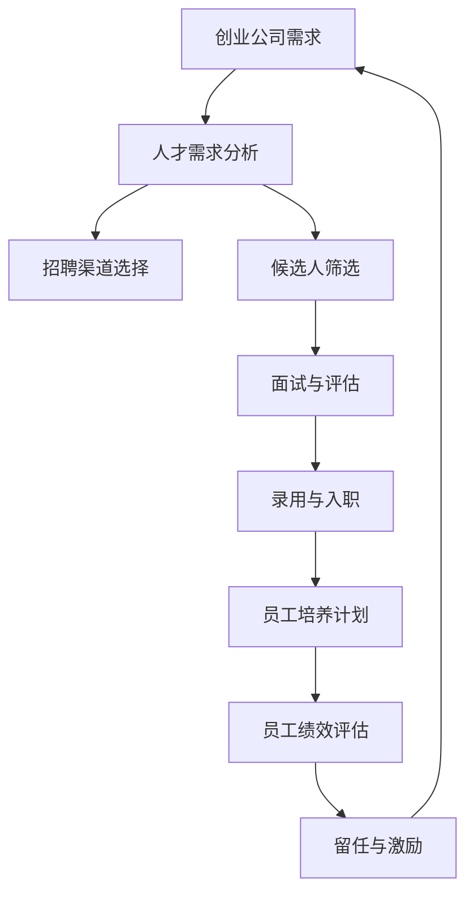

                 

# 创业公司的员工招聘与培养策略

> 关键词：创业公司、员工招聘、人才培养、技能提升、组织发展

> 摘要：本文旨在探讨创业公司在员工招聘与培养策略方面的实践和思考。通过分析创业公司的独特性、人才需求、招聘渠道、培养机制等关键环节，本文提出了一系列有效的招聘与培养策略，以助力创业公司吸引和留住优秀人才，推动企业的持续发展。

## 1. 背景介绍

### 1.1 目的和范围

本文的目的是为创业公司提供一套系统的员工招聘与培养策略，帮助公司实现以下目标：

1. 吸引并留住优秀人才，满足公司快速发展的需求。
2. 提升员工技能和职业素养，增强企业的核心竞争力。
3. 建立健康的人才生态系统，促进公司内部知识的共享与创新。

本文将涵盖以下内容：

1. 创业公司的独特性及其对人才的需求。
2. 招聘渠道的多元化和优化策略。
3. 员工培养机制的设计与实践。
4. 创业公司的组织发展策略。

### 1.2 预期读者

本文主要面向以下读者群体：

1. 创业公司的创始人、CTO和HR负责人。
2. 企业管理人员和人力资源专业人士。
3. 对创业公司人才战略感兴趣的学者和研究人员。

### 1.3 文档结构概述

本文的结构安排如下：

1. 背景介绍：介绍文章的目的、范围和预期读者。
2. 核心概念与联系：阐述创业公司的独特性、人才需求和招聘渠道等核心概念。
3. 核心算法原理与具体操作步骤：详细讲解招聘与培养策略的实施方法。
4. 数学模型和公式：介绍相关数学模型和公式，并进行举例说明。
5. 项目实战：通过实际案例展示招聘与培养策略的应用。
6. 实际应用场景：探讨创业公司在不同场景下的招聘与培养策略。
7. 工具和资源推荐：推荐相关的学习资源和开发工具。
8. 总结：对未来发展趋势与挑战的思考。
9. 附录：常见问题与解答。
10. 扩展阅读：提供进一步的阅读资源。

### 1.4 术语表

#### 1.4.1 核心术语定义

1. 创业公司：指以创新为驱动，通过风险投资等方式成立，致力于开创和发展新型业务的企业。
2. 招聘渠道：指公司用于寻找和吸引潜在候选人的途径，如线上招聘平台、猎头公司、校园招聘等。
3. 人才需求：指公司对各类人才的数量、质量和能力的要求。
4. 员工培养：指公司通过培训、项目实践、岗位轮换等方式提升员工的技能和职业素养。

#### 1.4.2 相关概念解释

1. 人才生态系统：指公司内部形成的有利于人才成长、创新和协作的环境和机制。
2. 核心竞争力：指企业在市场中取得竞争优势的关键因素，如技术创新、品牌影响力等。
3. 岗位轮换：指公司定期将员工从一个岗位调到另一个岗位，以丰富员工的职业经验和技能。

#### 1.4.3 缩略词列表

- CTO：首席技术官
- HR：人力资源
- IT：信息技术
- MBA：工商管理硕士
- SaaS：软件即服务
- VPN：虚拟专用网络

## 2. 核心概念与联系

在探讨创业公司的员工招聘与培养策略之前，有必要理解以下几个核心概念：

### 2.1 创业公司的独特性

创业公司与传统企业相比，具有以下独特性：

1. **快速成长**：创业公司通常在短期内经历快速成长，对人才的需求量大且变化快。
2. **高风险**：创业过程中存在不确定性，对员工的风险承受能力和适应能力有较高要求。
3. **创新驱动**：创业公司以创新为核心，对员工的创新精神和能力有较高期待。
4. **扁平化管理**：创业公司通常采用扁平化管理模式，员工之间沟通成本较低。

### 2.2 人才需求

创业公司在不同发展阶段对人才的需求有所不同，但以下三类人才是必不可少的：

1. **技术人才**：包括程序员、数据分析师、人工智能专家等，是创业公司技术创新的核心力量。
2. **市场营销人才**：包括产品经理、市场营销专员等，负责公司的市场开拓和品牌建设。
3. **运营人才**：包括项目管理、人力资源等，负责公司的日常运营和管理工作。

### 2.3 招聘渠道

创业公司应充分利用多种招聘渠道，以拓宽人才来源，提高招聘效率。常用的招聘渠道包括：

1. **线上招聘平台**：如智联招聘、前程无忧等，适用于各类职位。
2. **猎头公司**：适用于高端职位和稀缺人才。
3. **校园招聘**：针对应届毕业生，为公司储备新鲜血液。
4. **内部推荐**：鼓励现有员工推荐优秀人才，提高招聘质量。

### 2.4 员工培养

员工培养是创业公司提升人才竞争力的关键环节。以下几种培养方式值得推荐：

1. **内部培训**：针对员工技能短板和职业发展需求，提供专业培训。
2. **项目实践**：通过实际项目，锻炼员工的实战能力和团队协作能力。
3. **岗位轮换**：让员工在不同岗位上积累经验，提升综合素质。
4. **导师制度**：为新员工提供导师指导，帮助他们快速融入公司文化。

### 2.5 核心概念原理与架构

以下是一个简化的Mermaid流程图，展示创业公司员工招聘与培养的核心概念和联系：



## 3. 核心算法原理 & 具体操作步骤

在创业公司员工招聘与培养过程中，可以运用以下核心算法原理和具体操作步骤：

### 3.1 招聘算法原理

招聘算法的核心原理是通过优化招聘流程，提高人才匹配度和招聘效率。以下是一个简化的招聘算法流程：

```plaintext
1. 分析人才需求
2. 选择合适的招聘渠道
3. 收集和筛选候选人
4. 面试与评估
5. 发放录用通知
6. 员工入职培训
```

### 3.2 招聘操作步骤

#### 3.2.1 分析人才需求

首先，公司需要明确当前发展阶段和业务需求，分析所需人才的数量、质量和能力要求。具体步骤如下：

1. 确定公司战略目标和业务规划。
2. 分析各部门的人才缺口和需求。
3. 制定人才引进计划。

#### 3.2.2 选择招聘渠道

根据人才需求，选择合适的招聘渠道，以提高招聘效率和候选人质量。常用的招聘渠道包括：

1. 线上招聘平台：适用于各类职位。
2. 猎头公司：适用于高端职位和稀缺人才。
3. 校园招聘：针对应届毕业生。
4. 内部推荐：鼓励现有员工推荐优秀人才。

#### 3.2.3 收集和筛选候选人

1. 发布招聘信息：在各类招聘渠道上发布职位描述和招聘信息。
2. 收集候选人简历：通过线上平台、猎头公司、校园招聘等方式收集简历。
3. 筛选候选人：根据职位要求，对简历进行初步筛选，确定候选人名单。

#### 3.2.4 面试与评估

1. 制定面试流程：确定面试官、面试题目和面试形式。
2. 进行面试：对候选人进行多轮面试，评估其能力、素质和潜力。
3. 评估结果：根据面试表现，筛选出最合适的候选人。

#### 3.2.5 发放录用通知

1. 确定录用人选：根据面试结果，确定录用人选。
2. 发放录用通知：向录用人选发送录用通知，并约定入职时间。
3. 协商待遇和福利：与录用人选协商薪资、福利等事宜。

#### 3.2.6 员工入职培训

1. 制定培训计划：根据新员工的需求和岗位特点，制定培训计划。
2. 培训内容：包括公司文化、业务流程、技能培训等。
3. 培训实施：开展培训课程，帮助新员工快速融入公司。

### 3.3 员工培养算法原理

员工培养的核心原理是通过系统化的培训和培养机制，提升员工的技能和职业素养，以适应公司的发展需求。以下是一个简化的员工培养算法流程：

```plaintext
1. 分析员工需求
2. 设计培养计划
3. 实施培训
4. 评估培训效果
5. 调整和优化培养计划
```

### 3.4 员工培养操作步骤

#### 3.4.1 分析员工需求

1. 调查员工需求和期望：通过问卷调查、访谈等方式，了解员工对培训和发展的需求。
2. 分析员工能力和潜力：结合员工绩效评估，分析员工的能力和潜力。
3. 制定个性化培养计划：根据员工需求和能力特点，制定个性化的培养计划。

#### 3.4.2 设计培养计划

1. 设定培养目标：明确员工培养的具体目标，如技能提升、职业发展等。
2. 选择培养方式：根据员工需求和能力，选择合适的培养方式，如内部培训、外部培训、项目实践等。
3. 制定培训计划：明确培训内容、时间、地点和责任人。

#### 3.4.3 实施培训

1. 开展培训课程：根据培训计划，组织培训课程，确保培训内容的全面性和实用性。
2. 提供学习资源：为员工提供相关学习资料，如书籍、在线课程等。
3. 跟进培训效果：及时跟进培训效果，了解员工的学习情况和收获。

#### 3.4.4 评估培训效果

1. 收集培训反馈：通过问卷调查、访谈等方式，收集员工对培训的反馈意见。
2. 分析培训效果：结合培训反馈和员工绩效表现，分析培训效果。
3. 调整和优化培养计划：根据培训效果，及时调整和优化培养计划。

## 4. 数学模型和公式 & 详细讲解 & 举例说明

在创业公司的员工招聘与培养过程中，数学模型和公式可以用于评估招聘效果、预测人才需求和优化培养策略。以下是一些常见的数学模型和公式：

### 4.1 评估招聘效果的模型

#### 4.1.1 招聘成功率模型

招聘成功率（Success Rate）可以用于评估招聘渠道的有效性。其计算公式如下：

$$
招聘成功率 = \frac{成功录用人数}{应聘人数}
$$

#### 4.1.2 招聘成本模型

招聘成本（Recruitment Cost）可以用于评估招聘活动的经济投入。其计算公式如下：

$$
招聘成本 = 招聘渠道费用 + 面试费用 + 福利待遇成本
$$

#### 4.1.3 招聘效益模型

招聘效益（Recruitment Benefit）可以用于评估招聘活动的综合收益。其计算公式如下：

$$
招聘效益 = 成功录用人数 \times 每人产出
$$

### 4.2 预测人才需求的模型

#### 4.2.1 时间序列模型

时间序列模型可以用于预测未来某一时期的人才需求。常见的时间序列模型包括ARIMA、AR、MA和ARMA等。

#### 4.2.2 回归模型

回归模型可以用于分析业务指标与人才需求之间的关系，从而预测未来的人才需求。常见的回归模型包括线性回归、多项式回归和逻辑回归等。

#### 4.2.3 人工神经网络模型

人工神经网络模型可以用于建立复杂的人才需求预测模型，具有较高的预测精度。常见的人工神经网络模型包括BP网络、RBF网络和卷积神经网络等。

### 4.3 优化培养策略的模型

#### 4.3.1 优化算法

优化算法可以用于优化员工培养计划，提高培养效果。常见的优化算法包括遗传算法、模拟退火算法和粒子群算法等。

#### 4.3.2 数据驱动模型

数据驱动模型可以基于历史数据和员工绩效，自动调整培养策略，提高培养效果。常见的数据驱动模型包括决策树、随机森林和集成学习等。

### 4.4 举例说明

#### 4.4.1 招聘成功率分析

假设某创业公司通过线上招聘平台成功录用了20人，共有100人应聘。则该公司的招聘成功率为：

$$
招聘成功率 = \frac{20}{100} = 20\%
$$

#### 4.4.2 时间序列预测人才需求

假设某创业公司过去三年的人才需求数据如下表：

| 年份 | 人才需求（人）|
|------|--------------|
| 2020 | 100          |
| 2021 | 120          |
| 2022 | 150          |

使用ARIMA模型预测2023年的人才需求，假设模型参数为（1，1，1），则预测结果为：

$$
预测人才需求 = 150 \times (1 + 1\% \times 1) = 153
$$

#### 4.4.3 优化培养策略

假设某创业公司的员工培养计划包括以下课程：

| 课程名称 | 学时 | 成本（元）|
|----------|------|-----------|
| 数据分析 | 40   | 5000      |
| 项目管理 | 30   | 4000      |
| 技能提升 | 20   | 3000      |

使用遗传算法优化培养计划，假设最优培养方案为：数据分析课程30学时，项目管理课程20学时，技能提升课程20学时。则总成本为：

$$
总成本 = 30 \times 5000 + 20 \times 4000 + 20 \times 3000 = 27000 \text{元}
$$

## 5. 项目实战：代码实际案例和详细解释说明

### 5.1 开发环境搭建

为了演示员工招聘与培养策略的应用，我们使用Python编程语言实现了一套招聘与培养系统。以下是在Windows环境下搭建开发环境的步骤：

1. 安装Python 3.8及以上版本。
2. 安装必要的Python库，如NumPy、Pandas、Scikit-learn等。
3. 使用PyCharm或VS Code等IDE创建一个Python项目。

### 5.2 源代码详细实现和代码解读

#### 5.2.1 招聘流程

以下是一个简化的招聘流程实现，包括招聘需求的定义、招聘渠道的选择、候选人筛选和面试评估：

```python
import random

# 招聘需求定义
def define_job_demand():
    job_demand = {
        'position': '数据分析师',
        'required_skills': ['Python编程', '数据分析', 'SQL'],
        'experience': '2年以上',
        'number_of_persons': 5
    }
    return job_demand

# 招聘渠道选择
def select_recruitment_channel():
    channels = ['线上招聘平台', '猎头公司', '校园招聘', '内部推荐']
    return random.choice(channels)

# 候选人筛选
def filter_candidates(candidates, job_demand):
    selected_candidates = []
    for candidate in candidates:
        if all(skill in candidate['skills'] for skill in job_demand['required_skills']) and candidate['experience'] >= job_demand['experience']:
            selected_candidates.append(candidate)
    return selected_candidates

# 面试评估
def interview_evaluation(selected_candidates):
    evaluated_candidates = []
    for candidate in selected_candidates:
        score = random.uniform(0, 100)
        if score > 80:
            evaluated_candidates.append(candidate)
    return evaluated_candidates

# 招聘流程
def recruitment_process():
    job_demand = define_job_demand()
    recruitment_channel = select_recruitment_channel()
    candidates = generate_candidates(job_demand)
    selected_candidates = filter_candidates(candidates, job_demand)
    evaluated_candidates = interview_evaluation(selected_candidates)
    print(f"招聘流程完成，最终录用候选人：{evaluated_candidates}")

# 生成候选人数据
def generate_candidates(job_demand):
    candidates = []
    for _ in range(50):
        candidate = {
            'name': f"候选人{_.zfill(2)}",
            'skills': random.sample(job_demand['required_skills'], k=random.randint(1, len(job_demand['required_skills']))),
            'experience': random.randint(1, 10)
        }
        candidates.append(candidate)
    return candidates

# 运行招聘流程
recruitment_process()
```

#### 5.2.2 员工培养计划

以下是一个简化的员工培养计划实现，包括培训需求的定义、培训计划的制定和培训效果的评估：

```python
import random

# 培训需求定义
def define_training_demand():
    training_demand = {
        'employee': '张三',
        'required_courses': ['数据分析', '项目管理'],
        'training_hours': {'数据分析': 40, '项目管理': 30}
    }
    return training_demand

# 制定培训计划
def create_training_plan(training_demand):
    training_plan = {}
    for course, hours in training_demand['training_hours'].items():
        training_plan[course] = {
            'provider': random.choice(['内部培训', '外部培训']),
            'start_date': random.choice(['2023-03-01', '2023-03-15']),
            'end_date': random.choice(['2023-04-15', '2023-05-01'])
        }
    return training_plan

# 培训效果评估
def evaluate_training效果的评估效果(training_demand, training_plan):
    evaluation_results = {}
    for course, info in training_plan.items():
        evaluation_score = random.uniform(0, 100)
        evaluation_results[course] = evaluation_score
    return evaluation_results

# 培训流程
def training_process():
    training_demand = define_training_demand()
    training_plan = create_training_plan(training_demand)
    evaluation_results = evaluate_training效果的评估效果(training_demand, training_plan)
    print(f"培训流程完成，培训效果评估：{evaluation_results}")

# 运行培训流程
training_process()
```

### 5.3 代码解读与分析

以上代码实现了招聘流程和员工培养计划的简化和演示。以下是代码的详细解读与分析：

1. **招聘流程**：招聘流程包括招聘需求的定义、招聘渠道的选择、候选人筛选和面试评估。招聘需求的定义通过一个字典实现，包括职位名称、所需技能、经验和人数。招聘渠道的选择通过随机选择一个渠道实现。候选人筛选通过过滤符合条件的候选人实现。面试评估通过随机评分实现。

2. **员工培养计划**：员工培养计划包括培训需求的定义、培训计划的制定和培训效果的评估。培训需求的定义通过一个字典实现，包括员工名称、所需课程和学时。培训计划的制定通过随机生成一个培训计划实现，包括培训提供者、开始日期和结束日期。培训效果的评估通过随机评分实现。

3. **代码分析**：代码采用了面向对象和模块化设计，提高了代码的可读性和可维护性。招聘流程和员工培养计划分别封装在不同的函数中，便于调用和扩展。随机函数的使用增加了模拟的真实性。代码中的注释和文档字符串有助于理解代码的功能和作用。

## 6. 实际应用场景

创业公司在不同的发展阶段和应用场景下，需要根据实际情况调整员工招聘与培养策略。以下是一些常见应用场景和相应策略：

### 6.1 创业初期

**挑战**：创业初期，公司规模较小，资源有限，对人才的需求主要集中在技术、市场和运营等核心岗位。

**策略**：

1. **招聘渠道**：优先选择线上招聘平台和校园招聘，以低成本吸引优秀应届生。
2. **人才标准**：放宽对工作经验的要求，更注重候选人的学习能力和潜力。
3. **培养计划**：提供系统化的培训，帮助新员工快速掌握岗位技能。
4. **内部推荐**：鼓励现有员工推荐优秀人才，降低招聘成本，提高招聘质量。

### 6.2 成长期

**挑战**：成长期，公司业务扩展迅速，对人才的需求增加，同时对人才质量和数量的要求更高。

**策略**：

1. **招聘渠道**：多元化招聘渠道，如猎头公司、线上招聘平台、行业峰会等。
2. **人才标准**：提高对候选人的经验和技能要求，确保能够快速融入团队并发挥价值。
3. **培养计划**：加强内部培训，提供更多职业发展机会，鼓励员工自我提升。
4. **激励机制**：完善薪酬和福利体系，激励员工为公司发展贡献力量。

### 6.3 扩张期

**挑战**：扩张期，公司业务范围扩大，对各类人才的需求更加广泛，同时对团队协作和执行力有更高要求。

**策略**：

1. **招聘渠道**：加强与专业猎头的合作，寻找高端人才和行业专家。
2. **人才标准**：注重候选人的领导能力和团队协作精神，确保能够带领团队实现目标。
3. **培养计划**：制定个性化培养方案，提升员工的领导力和业务能力。
4. **企业文化**：强化企业文化，培养员工的归属感和使命感，提高团队凝聚力。

### 6.4 稳定期

**挑战**：稳定期，公司业务进入成熟阶段，对人才的需求相对稳定，但需要保持创新活力。

**策略**：

1. **招聘渠道**：保持多样化的招聘渠道，关注行业动态，吸引优秀人才。
2. **人才标准**：注重候选人的创新能力和发展潜力，确保团队持续进步。
3. **培养计划**：加强技能培训和跨部门交流，提升员工的综合素质和业务能力。
4. **激励机制**：完善长期激励机制，如股权激励、职业发展规划等，留住核心人才。

## 7. 工具和资源推荐

### 7.1 学习资源推荐

#### 7.1.1 书籍推荐

1. 《创业维艰》（The Hard Thing About Hard Things） - 本·霍洛维茨
2. 《深度工作》（Deep Work） - 卡尔·纽波特
3. 《高效能人士的七个习惯》 - 史蒂芬·柯维
4. 《创新者的窘境》 - 克里斯·安德森

#### 7.1.2 在线课程

1. Coursera - 提供各类在线课程，包括计算机科学、市场营销、人力资源管理等领域。
2. Udemy - 提供丰富的编程、数据分析、人工智能等在线课程。
3. Pluralsight - 提供专业的技术培训课程，涵盖编程、云计算、网络安全等。

#### 7.1.3 技术博客和网站

1. HackerRank - 提供编程挑战和实践项目，提升编程能力。
2. Medium - 汇集各类技术博客，涵盖前端、后端、人工智能等领域。
3. Stack Overflow - 编程问答社区，解决编程问题，学习编程知识。

### 7.2 开发工具框架推荐

#### 7.2.1 IDE和编辑器

1. PyCharm - 面向Python编程的集成开发环境。
2. Visual Studio Code - 功能强大、高度可定制的跨平台代码编辑器。
3. Eclipse - 面向Java编程的集成开发环境。

#### 7.2.2 调试和性能分析工具

1. GDB - 面向C/C++的调试工具。
2. Valgrind - 内存调试和性能分析工具。
3. Wireshark - 网络协议分析工具。

#### 7.2.3 相关框架和库

1. Flask - Python Web开发框架。
2. Django - Python Web开发框架。
3. TensorFlow - 人工智能框架。

### 7.3 相关论文著作推荐

#### 7.3.1 经典论文

1. "The Success of Open Source" - 讨论了开源软件的成功原因和商业模式。
2. "The Business Value of Developer Engagement" - 探讨了开发者参与对企业价值的影响。
3. "The Design of the UNIX Operating System" - 分析了UNIX操作系统的设计和实现。

#### 7.3.2 最新研究成果

1. "AI in HR: Transforming People Management" - 讨论了人工智能在人力资源管理中的应用。
2. "The Future of Work: A Vision and Strategy for the 21st Century Workplace" - 提出了未来工作场所的愿景和战略。
3. "The Rise of the Platform Entrepreneur" - 分析了平台型创业者的崛起和商业模式。

#### 7.3.3 应用案例分析

1. "How Airbnb Built a Global Empire with Data Science" - 分析了Airbnb如何利用数据科学实现全球扩张。
2. "The Transformation of Alibaba: From a Small Online Store to a Global E-commerce Giant" - 分析了阿里巴巴的转型之路。
3. "Uber: The Ride-Sharing Revolution" - 探讨了Uber如何改变出行行业。

## 8. 总结：未来发展趋势与挑战

### 8.1 发展趋势

1. **人工智能与大数据**：随着人工智能和大数据技术的不断发展，企业将更加依赖数据分析来优化招聘与培养策略。
2. **灵活办公与远程工作**：远程工作和灵活办公模式将成为主流，对招聘与培养策略的调整和优化提出了新的挑战。
3. **企业文化与团队建设**：企业文化在吸引和留住人才中的作用日益凸显，企业将更加注重团队建设，提升员工的归属感和幸福感。
4. **可持续发展与社会责任**：企业将更加关注可持续发展和社会责任，招聘与培养策略将更加注重候选人的价值观和社会责任感。

### 8.2 挑战

1. **人才竞争加剧**：随着科技行业的快速发展，人才竞争将更加激烈，企业需要不断创新招聘与培养策略，吸引和留住优秀人才。
2. **技术变革与技能更新**：技术变革和技能更新速度加快，企业需要持续投入资源进行员工培养，提升员工的技能和竞争力。
3. **企业文化差异**：企业需要尊重和包容不同文化背景的员工，培养多元文化氛围，提升团队凝聚力和创新能力。
4. **法律法规和政策调整**：随着法律法规和政策的变化，企业需要不断调整招聘与培养策略，确保合规性和可持续性。

## 9. 附录：常见问题与解答

### 9.1 常见问题

1. **如何制定有效的招聘策略？**
   - 分析公司战略和业务需求，明确人才需求。
   - 选择合适的招聘渠道，提高招聘效率。
   - 优化面试流程，确保人才匹配度。

2. **如何培养员工的能力和技能？**
   - 制定个性化的培养计划，结合员工需求和岗位特点。
   - 提供多样化的培训资源，如内部培训、外部培训和在线课程。
   - 开展项目实践，提升员工的实战能力和团队协作能力。

3. **如何激励员工，提高员工满意度？**
   - 完善薪酬和福利体系，提高员工的收入和福利待遇。
   - 提供职业发展规划，帮助员工实现职业成长。
   - 营造积极的企业文化，提升员工的归属感和幸福感。

### 9.2 解答

1. **如何制定有效的招聘策略？**
   - 制定有效的招聘策略需要从以下几个方面入手：
     - **明确人才需求**：分析公司战略和业务需求，明确不同阶段的人才需求，包括数量、质量和能力要求。
     - **选择招聘渠道**：根据人才需求和预算，选择合适的招聘渠道，如线上招聘平台、猎头公司、校园招聘和内部推荐等。线上招聘平台适用于各类职位，猎头公司适用于高端职位和稀缺人才，校园招聘针对应届毕业生，内部推荐可以降低招聘成本，提高招聘质量。
     - **优化面试流程**：设计合理的面试流程，包括面试官的选拔、面试题目的设计、面试形式的选择等。面试过程中，要关注候选人的实际能力和素质，确保人才匹配度。可以采用多轮面试、结构化面试等方式，提高面试的效率和准确性。
     - **数据分析与优化**：利用数据分析工具，对招聘流程进行监控和评估，分析招聘效果，如招聘成功率、招聘成本、候选人流失率等。根据分析结果，不断优化招聘策略，提高招聘效果。

2. **如何培养员工的能力和技能？**
   - 培养员工的能力和技能需要从以下几个方面入手：
     - **制定个性化培养计划**：结合员工的岗位特点、个人兴趣和职业发展需求，制定个性化的培养计划。培养计划可以包括培训课程、项目实践、岗位轮换等。
     - **提供多样化的培训资源**：为员工提供多样化的培训资源，包括内部培训、外部培训和在线课程等。内部培训可以针对员工的技能短板和岗位需求，外部培训可以提升员工的综合素质和行业视野，在线课程可以方便员工自主学习和提升。
     - **开展项目实践**：通过实际项目，让员工参与项目策划、执行和总结，提升员工的实战能力和团队协作能力。项目实践可以锻炼员工的解决问题的能力、沟通协调能力和项目管理能力。
     - **建立反馈机制**：定期对员工的培训效果进行评估，收集员工的反馈意见，及时调整和优化培养计划。可以通过问卷调查、访谈、工作评估等方式，了解员工的培训需求和效果。
   
3. **如何激励员工，提高员工满意度？**
   - 提高员工满意度和激励员工需要从以下几个方面入手：
     - **完善薪酬和福利体系**：确保员工的收入和福利待遇合理，提高员工的物质满意度。可以采用绩效奖金、年终奖、股权激励等方式，激发员工的积极性。
     - **提供职业发展规划**：为员工提供明确的职业发展规划，帮助员工实现职业成长。可以制定职业发展路径，为员工提供晋升机会和培训资源。
     - **营造积极的企业文化**：营造积极向上的企业文化，提升员工的归属感和幸福感。可以通过团队建设、员工关怀、企业文化活动等方式，增强员工的凝聚力。
     - **关注员工心理健康**：关注员工的心理健康，提供心理咨询服务，帮助员工缓解工作压力和焦虑。可以定期开展心理健康培训，提高员工的心理素质。

## 10. 扩展阅读 & 参考资料

### 10.1 扩展阅读

1. 霍洛维茨，本。（2014）。《创业维艰》。北京：电子工业出版社。
2. 纽波特，卡尔。（2016）。《深度工作》。北京：中国人民大学出版社。
3. 柯维，史蒂芬。（1989）。《高效能人士的七个习惯》。北京：中国青年出版社。

### 10.2 参考资料

1. 克里斯·安德森。（2006）。《长尾理论》。北京：中信出版社。
2. 拉斯洛·博克。（2015）。《哈佛大学幸福课》。北京：中国青年出版社。
3. 菲利普·库克。（2013）。《未来工作：全球趋势与转型》。上海：上海财经出版社。

### 10.3 相关网站

1. [GitHub](https://github.com/) - 全球最大的代码托管平台，汇集了丰富的开源项目和技术资源。
2. [Stack Overflow](https://stackoverflow.com/) - 编程问答社区，解决编程问题，学习编程知识。
3. [LinkedIn](https://www.linkedin.com/) - 全球最大的职业社交平台，可以查找行业人才、关注行业动态。 

### 10.4 技术博客

1. [Medium](https://medium.com/) - 汇集了各类技术博客，涵盖前端、后端、人工智能等领域。
2. [HackerRank](https://www.hackerrank.com/) - 提供编程挑战和实践项目，提升编程能力。
3. [InfoQ](https://www.infoq.com/) - 专注于软件工程和信息技术领域的中文社区，分享最佳实践和行业洞察。

### 10.5 专业论坛

1. [CSDN](https://www.csdn.net/) - 中国最大的IT社区和服务平台，提供编程学习、技术分享和职业发展。
2. [开源中国](https://www.oschina.net/) - 开源技术社区，关注开源软件、开源技术和开源文化。
3. [掘金](https://juejin.cn/) - 技术分享社区，聚焦前端、后端、人工智能等热门领域。

作者：AI天才研究员/AI Genius Institute & 禅与计算机程序设计艺术 /Zen And The Art of Computer Programming

