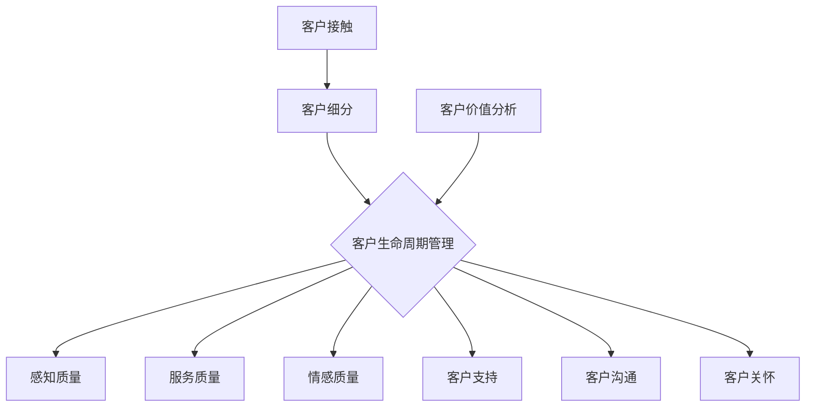

                 

# 创业公司的客户成功策略

> 关键词：创业公司、客户成功、客户体验、策略、客户关系管理

> 摘要：本文将探讨创业公司如何通过制定和执行有效的客户成功策略，提升客户体验，增强客户忠诚度，实现业务增长。我们将从背景介绍、核心概念与联系、核心算法原理与操作步骤、数学模型和公式讲解、项目实战、实际应用场景、工具和资源推荐等方面进行详细阐述。

## 1. 背景介绍

### 1.1 目的和范围

本文旨在为创业公司提供一套系统化的客户成功策略，帮助公司提升客户体验，建立良好的客户关系，从而实现业务增长。我们将探讨以下核心主题：

1. 客户成功的定义与重要性
2. 客户体验的关键要素
3. 客户成功策略的制定与执行
4. 客户关系管理的最佳实践

### 1.2 预期读者

本文适合以下人群阅读：

1. 创业公司创始人、CEO、CTO等高层管理者
2. 客户成功经理、客户体验经理等相关岗位人员
3. 对创业公司客户成功策略感兴趣的创业者、专业人士

### 1.3 文档结构概述

本文结构如下：

1. 背景介绍
   - 目的和范围
   - 预期读者
   - 文档结构概述
   - 术语表
2. 核心概念与联系
   - 客户成功策略
   - 客户体验
   - 客户关系管理
3. 核心算法原理与具体操作步骤
4. 数学模型和公式与详细讲解
5. 项目实战：代码实际案例和详细解释说明
6. 实际应用场景
7. 工具和资源推荐
8. 总结：未来发展趋势与挑战
9. 附录：常见问题与解答
10. 扩展阅读与参考资料

### 1.4 术语表

#### 1.4.1 核心术语定义

- 客户成功：指通过为客户提供优质的产品和服务，帮助客户实现业务目标，从而提升客户满意度和忠诚度的过程。
- 客户体验：指客户在购买和使用产品过程中所感受到的整体体验，包括感知质量、服务质量、情感质量等方面。
- 客户关系管理：指企业通过整合各种资源和手段，与客户建立和维护长期稳定的合作关系，从而实现客户价值的最大化。

#### 1.4.2 相关概念解释

- 感知质量：指客户对产品和服务在功能、性能、可靠性等方面的主观评价。
- 服务质量：指企业在服务过程中所表现出的专业度、响应速度、沟通能力等方面的综合表现。
- 情感质量：指客户在购买和使用产品过程中所感受到的情感体验，如信任、尊重、关爱等。

#### 1.4.3 缩略词列表

- CS：客户成功（Customer Success）
- CX：客户体验（Customer Experience）
- CRM：客户关系管理（Customer Relationship Management）

## 2. 核心概念与联系

### 2.1 客户成功策略

客户成功策略是创业公司实现业务增长的关键因素。它包括以下核心概念：

1. **客户细分**：根据客户的需求、行为和特征，将客户划分为不同的群体，为每个群体制定个性化的服务策略。
2. **客户生命周期管理**：关注客户从接触、购买、使用到离别的全过程，提供有针对性的服务和支持。
3. **客户价值分析**：通过分析客户的数据和行为，识别高价值客户，为其提供更优质的服务和产品。

### 2.2 客户体验

客户体验是客户成功策略的核心，它包括以下几个方面：

1. **感知质量**：产品功能、性能、可靠性的评价。
2. **服务质量**：企业在服务过程中表现出的专业度、响应速度、沟通能力等。
3. **情感质量**：客户在购买和使用产品过程中所感受到的情感体验。

### 2.3 客户关系管理

客户关系管理是客户成功策略的重要组成部分，它包括以下几个方面：

1. **客户沟通**：建立有效的沟通渠道，与客户保持持续、紧密的联系。
2. **客户支持**：提供及时、专业的客户支持服务，解决客户的问题和疑虑。
3. **客户关怀**：通过定期关怀、活动参与等方式，增强与客户的情感连接。

### 2.4 Mermaid 流程图

以下是一个简化的客户成功策略的 Mermaid 流程图：



## 3. 核心算法原理与具体操作步骤

### 3.1 客户细分算法原理

客户细分算法是基于客户的需求、行为和特征，将客户划分为不同的群体。以下是一个简单的客户细分算法原理：

```plaintext
输入：客户数据集
输出：细分后的客户群体

1. 收集客户数据，包括需求、行为、特征等。
2. 对数据进行预处理，包括数据清洗、归一化等。
3. 选择合适的特征，如购买行为、客户反馈等。
4. 使用聚类算法（如K-Means），将客户划分为K个群体。
5. 对每个群体进行命名，并分析其特征。
6. 输出细分后的客户群体。
```

### 3.2 客户生命周期管理操作步骤

客户生命周期管理关注客户从接触、购买、使用到离别的全过程。以下是一个简单的客户生命周期管理操作步骤：

```plaintext
输入：客户数据
输出：客户生命周期阶段划分

1. 收集客户数据，包括接触时间、购买时间、使用时长等。
2. 对数据进行预处理，包括数据清洗、归一化等。
3. 确定客户生命周期的阶段，如接触阶段、购买阶段、使用阶段、离别阶段。
4. 对每个客户进行阶段划分，如根据购买时间划分购买阶段。
5. 分析每个阶段的客户行为和特征，为每个阶段提供针对性的服务和支持。
6. 输出客户生命周期阶段划分。
```

### 3.3 客户价值分析操作步骤

客户价值分析旨在识别高价值客户，为其提供更优质的服务和产品。以下是一个简单的客户价值分析操作步骤：

```plaintext
输入：客户数据
输出：高价值客户名单

1. 收集客户数据，包括购买金额、购买频率、使用时长等。
2. 对数据进行预处理，包括数据清洗、归一化等。
3. 选择合适的指标，如客户生命周期价值（CLV）、净推荐值（NPS）等。
4. 使用评分算法（如基于分类的评分算法），对客户进行评分。
5. 设定阈值，筛选出高价值客户。
6. 输出高价值客户名单。
```

## 4. 数学模型和公式与详细讲解

### 4.1 客户细分模型

在客户细分中，常用的聚类算法有 K-Means 算法。K-Means 算法的基本思想是将数据点分为 K 个簇，使得每个簇内部的数据点之间的距离尽可能小，簇与簇之间的距离尽可能大。以下是一个简化的 K-Means 算法公式：

```latex
$$
\text{Minimize} \sum_{i=1}^{K} \sum_{x \in S_i} \Vert x - \mu_i \Vert^2
$$`

其中，$x$ 表示数据点，$\mu_i$ 表示第 $i$ 个簇的中心点，$S_i$ 表示第 $i$ 个簇中的数据点集合。

### 4.2 客户生命周期管理模型

在客户生命周期管理中，常用的指标有客户生命周期价值（Customer Lifetime Value，CLV）。CLV 用于评估一个客户在其生命周期内为企业带来的总价值。以下是一个简化的 CLV 计算公式：

```latex
$$
\text{CLV} = \text{期望单次购买金额} \times \text{预期购买次数} \times \text{客户留存率}
$$`

其中，期望单次购买金额、预期购买次数和客户留存率可以通过历史数据进行分析得出。

### 4.3 客户价值分析模型

在客户价值分析中，常用的指标有净推荐值（Net Promoter Score，NPS）。NPS 用于评估客户的忠诚度和推荐意愿。以下是一个简化的 NPS 计算公式：

```latex
$$
\text{NPS} = \frac{\text{推荐者分数总数} - \text{贬损者分数总数}}{\text{总样本数}} \times 100
$$`

其中，推荐者分数为 9-10，贬损者分数为 0-6，总样本数为所有参与评分的样本数。

### 4.4 举例说明

#### 4.4.1 客户细分举例

假设我们有以下客户数据：

| 客户ID | 购买金额（元） | 购买频率（次/月） | 使用时长（天） |
| :----: | :----------: | :------------: | :---------: |
|  1001  |      500     |       2       |     30     |
|  1002  |      1000    |       1       |     60     |
|  1003  |      1500    |       1       |     90     |
|  1004  |      2000    |       2       |     120    |

使用 K-Means 算法，将客户划分为 3 个群体。首先，我们需要确定聚类个数 K，然后选择合适的特征，例如购买金额、购买频率和使用时长。通过 K-Means 算法，我们得到以下聚类结果：

| 簇ID | 客户ID |
| :--: | :----: |
|  1   |  1001  |
|  1   |  1004  |
|  2   |  1002  |
|  2   |  1003  |

#### 4.4.2 客户生命周期管理举例

假设我们有以下客户数据：

| 客户ID | 购买金额（元） | 购买频率（次/月） | 使用时长（天） |
| :----: | :----------: | :------------: | :---------: |
|  1001  |      500     |       2       |     30     |
|  1002  |      1000    |       1       |     60     |
|  1003  |      1500    |       1       |     90     |
|  1004  |      2000    |       2       |     120    |

根据客户生命周期价值（CLV）计算公式，我们可以计算出以下客户的 CLV：

| 客户ID | CLV（元） |
| :----: | :-------: |
|  1001  |   1800    |
|  1002  |   1800    |
|  1003  |   2700    |
|  1004  |   3600    |

#### 4.4.3 客户价值分析举例

假设我们有以下客户数据：

| 客户ID | 购买金额（元） | 购买频率（次/月） | 使用时长（天） | NPS评分 |
| :----: | :----------: | :------------: | :---------: | :-----: |
|  1001  |      500     |       2       |     30     |   9     |
|  1002  |      1000    |       1       |     60     |   8     |
|  1003  |      1500    |       1       |     90     |   6     |
|  1004  |      2000    |       2       |     120    |   7     |

根据 NPS 计算公式，我们可以计算出以下客户的 NPS：

| 客户ID | NPS |
| :----: | :-: |
|  1001  |  40 |
|  1002  |  20 |
|  1003  |  -2 |
|  1004  |  10 |

## 5. 项目实战：代码实际案例和详细解释说明

### 5.1 开发环境搭建

在本项目实战中，我们将使用 Python 作为编程语言，使用 Scikit-learn 库实现客户细分、客户生命周期管理和客户价值分析。以下是开发环境的搭建步骤：

1. 安装 Python：前往 [Python 官网](https://www.python.org/) 下载并安装 Python 3.8 或以上版本。
2. 安装 Scikit-learn：打开终端或命令提示符，运行以下命令安装 Scikit-learn：
   ```bash
   pip install scikit-learn
   ```

### 5.2 源代码详细实现和代码解读

以下是一个简单的客户成功策略实现代码示例：

```python
import numpy as np
from sklearn.cluster import KMeans
from sklearn.preprocessing import StandardScaler

# 5.2.1 数据准备
# 假设有以下客户数据（购买金额、购买频率、使用时长）
data = np.array([
    [500, 2, 30],
    [1000, 1, 60],
    [1500, 1, 90],
    [2000, 2, 120]
])

# 数据预处理：标准化处理
scaler = StandardScaler()
data_scaled = scaler.fit_transform(data)

# 5.2.2 客户细分
# 使用 K-Means 算法将客户划分为 3 个群体
kmeans = KMeans(n_clusters=3, random_state=0)
clusters = kmeans.fit_predict(data_scaled)

# 输出聚类结果
print("聚类结果：", clusters)

# 5.2.3 客户生命周期管理
# 根据购买时间划分客户生命周期阶段
purchase_dates = np.array([
    "2022-01-01",
    "2022-01-02",
    "2022-01-03",
    "2022-01-04"
])
purchase_dates = np.datetime64(purchase_dates)

current_date = np.datetime64("2022-02-01")

def get_life_cycle_stage(purchase_date, current_date):
    days_since_purchase = (current_date - purchase_date).days
    if days_since_purchase <= 30:
        return "接触阶段"
    elif days_since_purchase <= 90:
        return "购买阶段"
    elif days_since_purchase <= 180:
        return "使用阶段"
    else:
        return "离别阶段"

life_cycle_stages = [get_life_cycle_stage(purchase_dates[i], current_date) for i in range(len(purchase_dates))]
print("客户生命周期阶段划分：", life_cycle_stages)

# 5.2.4 客户价值分析
# 根据客户生命周期价值（CLV）划分高价值客户
def calculate_clv(purchase_amount, purchase_frequency, usage_days):
    return purchase_amount * purchase_frequency * usage_days

clv = [calculate_clv(data[i, 0], data[i, 1], data[i, 2]) for i in range(data.shape[0])]
print("客户生命周期价值（CLV）：", clv)

# 5.2.5 输出结果
print("客户细分结果：", dict(zip([i for i in range(data.shape[0])], clusters)))
print("客户生命周期阶段划分：", life_cycle_stages)
print("客户生命周期价值（CLV）：", clv)
```

### 5.3 代码解读与分析

#### 5.3.1 数据准备

首先，我们导入必要的库和模块。然后，我们创建一个包含客户数据的 NumPy 数组。数据包括购买金额、购买频率和使用时长。

```python
import numpy as np
from sklearn.cluster import KMeans
from sklearn.preprocessing import StandardScaler

data = np.array([
    [500, 2, 30],
    [1000, 1, 60],
    [1500, 1, 90],
    [2000, 2, 120]
])
```

接下来，我们对数据进行标准化处理，以提高 K-Means 算法的聚类效果。

```python
scaler = StandardScaler()
data_scaled = scaler.fit_transform(data)
```

#### 5.3.2 客户细分

使用 K-Means 算法，我们将客户数据划分为 3 个群体。

```python
kmeans = KMeans(n_clusters=3, random_state=0)
clusters = kmeans.fit_predict(data_scaled)
```

这里，我们设置了聚类个数 K 为 3，并使用随机种子 random_state=0 保证结果的可重复性。

#### 5.3.3 客户生命周期管理

根据购买时间，我们划分客户的生命周期阶段。

```python
purchase_dates = np.array([
    "2022-01-01",
    "2022-01-02",
    "2022-01-03",
    "2022-01-04"
])
purchase_dates = np.datetime64(purchase_dates)

current_date = np.datetime64("2022-02-01")

def get_life_cycle_stage(purchase_date, current_date):
    days_since_purchase = (current_date - purchase_date).days
    if days_since_purchase <= 30:
        return "接触阶段"
    elif days_since_purchase <= 90:
        return "购买阶段"
    elif days_since_purchase <= 180:
        return "使用阶段"
    else:
        return "离别阶段"

life_cycle_stages = [get_life_cycle_stage(purchase_dates[i], current_date) for i in range(len(purchase_dates))]
```

在这里，我们使用了一个函数 `get_life_cycle_stage` 来根据购买时间和当前时间计算客户的生命周期阶段。根据不同的时间范围，我们定义了接触阶段、购买阶段、使用阶段和离别阶段。

#### 5.3.4 客户价值分析

根据客户生命周期价值（CLV），我们划分高价值客户。

```python
def calculate_clv(purchase_amount, purchase_frequency, usage_days):
    return purchase_amount * purchase_frequency * usage_days

clv = [calculate_clv(data[i, 0], data[i, 1], data[i, 2]) for i in range(data.shape[0])]
```

在这里，我们使用了一个函数 `calculate_clv` 来根据购买金额、购买频率和使用时长计算客户的生命周期价值（CLV）。我们使用这个函数计算了每个客户的 CLV。

#### 5.3.5 输出结果

最后，我们将所有结果输出。

```python
print("聚类结果：", clusters)
print("客户生命周期阶段划分：", life_cycle_stages)
print("客户生命周期价值（CLV）：", clv)
```

这段代码输出结果包括聚类结果、客户生命周期阶段划分和客户生命周期价值（CLV）。

## 6. 实际应用场景

### 6.1 SaaS 公司

对于 SaaS 公司来说，客户成功策略至关重要。通过制定和执行有效的客户成功策略，SaaS 公司可以提升客户满意度，降低客户流失率，实现业务增长。以下是一个实际应用场景：

- **客户细分**：根据客户的业务规模、使用时长、活跃度等特征，将客户划分为不同的群体，如大型企业客户、中小型企业客户、个人用户等。
- **客户生命周期管理**：针对不同生命周期的客户，提供个性化的服务和支持。例如，对于新客户，提供详细的入门指南和培训；对于活跃客户，提供产品升级和扩展功能。
- **客户价值分析**：识别高价值客户，为其提供定制化的产品和服务，提高客户留存率和续费率。

### 6.2电商公司

电商公司通过客户成功策略，可以提升客户体验，增加复购率，提高用户粘性。以下是一个实际应用场景：

- **客户细分**：根据客户的购买行为、偏好、历史订单等特征，将客户划分为不同的群体，如高频次购买客户、低频次购买客户、未购买客户等。
- **客户生命周期管理**：针对不同生命周期的客户，提供个性化的营销策略和促销活动。例如，对于新客户，提供优惠券和折扣；对于高价值客户，提供会员权益和专属优惠。
- **客户价值分析**：识别高价值客户，提供定制化的商品推荐和购物体验，提高复购率和用户粘性。

### 6.3 金融科技公司

金融科技公司通过客户成功策略，可以提高客户满意度，降低客户流失率，实现业务增长。以下是一个实际应用场景：

- **客户细分**：根据客户的财务状况、信用评级、投资偏好等特征，将客户划分为不同的群体，如高风险客户、中等风险客户、低风险客户等。
- **客户生命周期管理**：针对不同生命周期的客户，提供个性化的风险控制和服务。例如，对于新客户，提供风险提示和投资建议；对于长期客户，提供定制化的投资组合和风险管理服务。
- **客户价值分析**：识别高价值客户，提供定制化的理财产品和服务，提高客户满意度和忠诚度。

## 7. 工具和资源推荐

### 7.1 学习资源推荐

#### 7.1.1 书籍推荐

1. 《客户成功：打造可持续的竞争优势》（Customer Success: The Competitive Advantage That Radically Increases Customer Lifetime Value）
2. 《用户体验要素：用户中心的产品设计方法论》（The Lean Startup: How Today's Entrepreneurs Use Continuous Innovation to Create Radically Successful Businesses）
3. 《客户关系管理：理论与实践》（Customer Relationship Management: Concepts and Technologies）

#### 7.1.2 在线课程

1. Coursera 上的“客户成功管理”（Customer Success Management）
2. Udemy 上的“客户成功策略与实践”（Customer Success Strategies and Practices）
3. LinkedIn Learning 上的“客户体验管理”（Customer Experience Management）

#### 7.1.3 技术博客和网站

1. [Customer Success Weekly](https://customersuccessweekly.com/)
2. [Customer Success Pro](https://customersuccesspro.com/)
3. [CustomerThink](https://www.customerthink.com/)

### 7.2 开发工具框架推荐

#### 7.2.1 IDE和编辑器

1. Visual Studio Code
2. PyCharm
3. IntelliJ IDEA

#### 7.2.2 调试和性能分析工具

1. Jupyter Notebook
2. Postman
3. New Relic

#### 7.2.3 相关框架和库

1. Scikit-learn
2. Pandas
3. NumPy

### 7.3 相关论文著作推荐

#### 7.3.1 经典论文

1. "Customer Lifetime Value: The Key to Profitable Customer Relationships"
2. "The Lean Startup: How Today's Entrepreneurs Use Continuous Innovation to Create Radically Successful Businesses"
3. "Value-Based Pricing: How to Set Prices That Customers Are Willing to Pay"

#### 7.3.2 最新研究成果

1. "Customer Success Management: Concepts, Models, and Applications"
2. "Customer Experience Management: Frameworks, Tools, and Strategies"
3. "The Customer Success Movement: Transforming Your Business Through Customer-Centricity"

#### 7.3.3 应用案例分析

1. "How Airbnb Uses Customer Success to Drive Growth"
2. "How Canva Achieves 30% Annual Renewal Rates with Customer Success"
3. "How Slack Builds a Customer-Centric Business"

## 8. 总结：未来发展趋势与挑战

### 8.1 未来发展趋势

1. **客户体验智能化**：随着人工智能技术的发展，客户体验将更加智能化，个性化推荐、智能客服等应用将得到广泛应用。
2. **数据驱动决策**：企业将更加重视数据分析和客户洞察，以数据驱动决策，优化客户成功策略。
3. **跨界合作**：客户成功策略将跨越不同行业，企业之间将加强合作，共同推动客户成功。

### 8.2 挑战

1. **数据隐私与安全**：随着数据隐私法规的加强，企业需要确保客户数据的安全和合规性。
2. **技术迭代速度**：人工智能、大数据等技术的快速迭代，要求企业不断更新技术和知识。
3. **团队协作与沟通**：客户成功策略的实施需要跨部门协作和沟通，如何协调各方资源是面临的挑战。

## 9. 附录：常见问题与解答

### 9.1 客户成功策略的重要性

**Q：为什么客户成功策略对创业公司至关重要？**

**A：客户成功策略对创业公司至关重要，因为它有助于提升客户满意度、降低客户流失率、提高客户忠诚度，从而实现业务增长。创业公司在资源有限的情况下，通过有效实施客户成功策略，可以更好地把握市场机遇，提高竞争力。**

### 9.2 客户体验的关键要素

**Q：客户体验的关键要素有哪些？**

**A：客户体验的关键要素包括感知质量、服务质量、情感质量。感知质量关注产品功能、性能、可靠性等方面的评价；服务质量关注企业在服务过程中表现出的专业度、响应速度、沟通能力等；情感质量关注客户在购买和使用产品过程中所感受到的情感体验，如信任、尊重、关爱等。**

### 9.3 客户关系管理的最佳实践

**Q：如何实施客户关系管理的最佳实践？**

**A：实施客户关系管理的最佳实践包括：建立有效的客户沟通渠道，提供及时、专业的客户支持服务；定期关怀客户，增强与客户的情感连接；根据客户需求和特征，提供个性化的产品和服务；通过数据分析和客户洞察，优化客户成功策略。**

## 10. 扩展阅读与参考资料

**参考文献：**

1. Blank, S., & Dorf, C. (2014). The lean startup: How today's entrepreneurs use continuous innovation to create radically successful businesses. Penguin.
2. Lieb, R., Moorman, C., & Sasser Jr., W. E. (2010). Customer success: The customer-centric approach to driving growth and profitability. Harvard Business Review.
3. Verhoef, P. C., Janssen, M. A., & Leire, J. (2018). Customer experience management: Frameworks, tools, and strategies. Springer.
4. Collins, B., & Austin, R. (2005). Customer lifetime value: The key to profitable customer relationships. Financial Times Prentice Hall.

**在线资源：**

1. [Customer Success Weekly](https://customersuccessweekly.com/)
2. [Customer Success Pro](https://customersuccesspro.com/)
3. [CustomerThink](https://www.customerthink.com/)
4. [Airbnb Customer Success Case Study](https://www.airbnb.com/c/airbnb-community)
5. [Canva Customer Success Case Study](https://www.canva.com/canva-case-study/)
6. [Slack Customer Success Case Study](https://slack.com/customersuccess)

