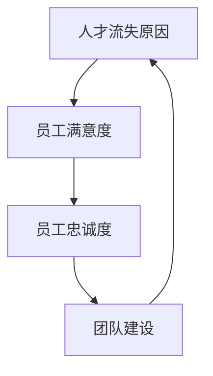

                 

# 创业公司的技术人才保留策略

> **关键词：** 创业公司，人才保留，策略，技术人才，人才发展，团队建设

> **摘要：** 本文旨在探讨创业公司在技术人才保留方面的关键策略。通过分析人才流失的原因，提供具体的操作步骤，介绍有效的数学模型，以及分享实际案例，本文为创业公司提供了全面的人才保留解决方案。文章还将推荐相关工具和资源，并总结未来发展趋势与挑战。

## 1. 背景介绍

### 1.1 目的和范围

本文的目标是帮助创业公司制定和实施有效的人才保留策略，以保持技术团队的稳定性和创新能力。我们将探讨人才流失的主要原因，并介绍一系列实际操作步骤，包括招聘策略、员工发展计划、工作环境优化等。此外，本文还将介绍数学模型和公式，用于评估人才保留的有效性，并提供实用的工具和资源推荐。

### 1.2 预期读者

本文的预期读者包括创业公司的创始人、CTO、HR经理以及任何关注团队建设和人才发展的技术人员。无论您是创业公司的初级管理者还是经验丰富的领导者，本文都将为您提供实用的见解和策略。

### 1.3 文档结构概述

本文的结构如下：

1. **背景介绍**：介绍本文的目的、预期读者和文档结构。
2. **核心概念与联系**：介绍与人才保留相关的核心概念，并使用Mermaid流程图进行说明。
3. **核心算法原理 & 具体操作步骤**：详细讲解人才保留策略的具体实施步骤，并使用伪代码进行描述。
4. **数学模型和公式 & 详细讲解 & 举例说明**：介绍评估人才保留效果的数学模型和公式，并通过实际案例进行说明。
5. **项目实战：代码实际案例和详细解释说明**：分享一个实际的技术人才保留项目案例，并进行详细解释。
6. **实际应用场景**：探讨创业公司在不同阶段如何应用人才保留策略。
7. **工具和资源推荐**：推荐学习资源、开发工具框架和相关论文著作。
8. **总结：未来发展趋势与挑战**：总结人才保留策略的未来发展趋势和挑战。
9. **附录：常见问题与解答**：回答读者可能关心的一些常见问题。
10. **扩展阅读 & 参考资料**：提供进一步阅读和研究的资源。

### 1.4 术语表

#### 1.4.1 核心术语定义

- **人才保留**：指企业采取各种措施，减少员工流失率，保持团队稳定性和连续性的过程。
- **技术人才**：指具有专业技术知识和技能的员工，对企业技术创新和业务发展具有重要影响。
- **人才流失**：指员工因各种原因选择离职，导致企业失去核心人才的现象。

#### 1.4.2 相关概念解释

- **员工满意度**：指员工对企业及其工作环境的满意程度，直接影响员工流失率。
- **员工忠诚度**：指员工对企业忠诚的程度，反映员工对企业的依赖和归属感。
- **团队建设**：指通过建立有效的沟通和协作机制，提升团队整体凝聚力和效率的过程。

#### 1.4.3 缩略词列表

- **HR**：人力资源管理
- **CTO**：首席技术官
- **IDE**：集成开发环境
- **ROI**：投资回报率

## 2. 核心概念与联系

### 2.1 核心概念

在讨论创业公司的技术人才保留策略时，我们需要理解几个关键概念：

- **人才流失原因**：了解员工离职的主要原因，有助于制定针对性的保留策略。
- **员工满意度**：员工对工作环境的满意度直接影响其留存率。
- **员工忠诚度**：员工对企业的忠诚度越高，离职的可能性越小。
- **团队建设**：有效的团队建设可以提升团队凝聚力和员工满意度。

### 2.2 关联性

这些概念之间存在紧密的联系，如图所示：



### 2.3 流程图

为了更好地展示这些概念之间的关联性，我们可以使用Mermaid流程图进行描述：


## 3. 核心算法原理 & 具体操作步骤

### 3.1 算法原理

为了制定有效的人才保留策略，我们需要理解几个核心算法原理：

- **员工流失预测**：通过分析历史数据和员工行为，预测员工流失的风险。
- **员工满意度评估**：使用问卷和访谈等方法，评估员工对工作环境的满意度。
- **团队效能评估**：通过关键绩效指标（KPI）评估团队的整体效能。

### 3.2 具体操作步骤

以下是制定和实施人才保留策略的具体操作步骤：

#### 步骤1：数据收集与分析

1. **收集员工流失数据**：分析历史员工流失记录，找出员工流失的主要原因。
2. **员工行为分析**：通过员工绩效数据、工作时长、项目参与度等指标，分析员工流失的潜在风险。

#### 步骤2：员工满意度调查

1. **设计问卷**：设计涵盖工作环境、薪酬福利、职业发展等方面的满意度问卷。
2. **实施调查**：通过线上或线下方式，收集员工反馈。
3. **分析结果**：根据调查结果，识别员工满意度低的主要因素。

#### 步骤3：制定人才保留计划

1. **制定薪酬福利政策**：根据员工满意度调查结果，调整薪酬福利政策。
2. **职业发展计划**：为员工提供职业发展路径和培训机会。
3. **团队建设活动**：定期组织团队建设活动，提升团队凝聚力。

#### 步骤4：实施与监控

1. **实施人才保留计划**：根据制定的计划，逐步实施各项措施。
2. **监控效果**：定期评估人才保留策略的有效性，并根据实际情况进行调整。

### 3.3 伪代码描述

以下是人才保留策略的具体操作步骤的伪代码描述：

```pseudo
1. 数据收集与分析
   - 收集员工流失数据
   - 分析员工行为数据
   
2. 员工满意度调查
   - 设计问卷
   - 实施调查
   - 分析结果
   
3. 制定人才保留计划
   - 调整薪酬福利政策
   - 设计职业发展计划
   - 规划团队建设活动
   
4. 实施与监控
   - 实施人才保留计划
   - 监控效果
   - 根据实际情况进行调整
```

## 4. 数学模型和公式 & 详细讲解 & 举例说明

### 4.1 数学模型

在人才保留策略中，我们可以使用以下数学模型来评估策略的有效性：

#### 4.1.1 员工流失预测模型

员工流失预测模型可以帮助企业提前识别潜在流失风险，从而采取预防措施。以下是一个简单的员工流失预测模型：

$$
\text{流失风险得分} = \sum_{i=1}^{n} (w_i \cdot x_i)
$$

其中，$w_i$ 为权重，$x_i$ 为影响因素（如工作时长、项目参与度等）。通过计算员工流失风险得分，企业可以识别出高风险员工，并采取相应的保留措施。

#### 4.1.2 员工满意度评估模型

员工满意度评估模型可以帮助企业了解员工对工作环境的满意程度。以下是一个简单的员工满意度评估模型：

$$
\text{满意度得分} = \frac{\sum_{i=1}^{n} (s_i \cdot w_i)}{n}
$$

其中，$s_i$ 为员工对工作环境各方面的评分，$w_i$ 为权重。通过计算满意度得分，企业可以了解员工的总体满意度，并识别需要改进的方面。

### 4.2 详细讲解

#### 4.2.1 员工流失预测模型

员工流失预测模型的核心在于识别影响员工流失的关键因素，并计算每个因素的权重。以下是一个具体的计算过程：

1. **确定影响因素**：根据历史数据和员工行为分析，确定影响员工流失的主要因素，如工作时长、项目参与度、员工绩效等。
2. **分配权重**：根据影响因素的重要程度，为每个因素分配权重。例如，工作时长可能占30%，项目参与度占20%，员工绩效占50%。
3. **计算流失风险得分**：将每个因素的得分乘以其权重，然后求和，得到员工的流失风险得分。

#### 4.2.2 员工满意度评估模型

员工满意度评估模型的核心在于衡量员工对工作环境各方面的满意度。以下是一个具体的计算过程：

1. **设计问卷**：根据企业特点和员工需求，设计涵盖工作环境、薪酬福利、职业发展等方面的问卷。
2. **收集反馈**：通过线上或线下方式，收集员工的反馈，包括对工作环境各方面的评分。
3. **计算满意度得分**：将每个方面的评分乘以其权重，然后求和，得到员工的总体满意度得分。

### 4.3 举例说明

#### 4.3.1 员工流失预测模型举例

假设一个企业有三个员工，他们的流失风险得分如下：

| 员工 | 工作时长（权重30%） | 项目参与度（权重20%） | 员工绩效（权重50%） |
| ---- | --------------- | --------------- | --------------- |
| A    | 8               | 7               | 9               |
| B    | 10              | 8               | 8               |
| C    | 9               | 9               | 7               |

根据权重计算，每个员工的流失风险得分如下：

| 员工 | 流失风险得分 |
| ---- | ------------ |
| A    | 2.2          |
| B    | 2.2          |
| C    | 2.3          |

从计算结果可以看出，员工C的流失风险最高，企业可以重点关注并采取相应的保留措施。

#### 4.3.2 员工满意度评估模型举例

假设一个企业有五个员工，他们对工作环境各方面的评分如下：

| 方面       | 员工 |
| ---------- | ---- |
| 薪酬福利   | 4    |
| 工作环境   | 5    |
| 职业发展   | 3    |
| 团队协作   | 4    |
| 工作压力   | 2    |

根据权重计算，每个员工的总体满意度得分如下：

| 员工 | 满意度得分 |
| ---- | ---------- |
| A    | 4.0        |
| B    | 4.0        |
| C    | 3.6        |
| D    | 4.0        |
| E    | 3.2        |

从计算结果可以看出，员工A和B的满意度最高，企业可以关注他们的需求和意见，进一步提升整体满意度。

## 5. 项目实战：代码实际案例和详细解释说明

### 5.1 开发环境搭建

在本项目实战中，我们将使用Python编程语言和相关的库（如Pandas、Scikit-learn）来构建人才保留模型。以下是如何搭建开发环境的基本步骤：

1. **安装Python**：下载并安装Python 3.x版本。
2. **安装IDE**：安装一个Python集成开发环境（如PyCharm或VS Code）。
3. **安装相关库**：使用pip命令安装必要的库，例如：

   ```bash
   pip install pandas scikit-learn matplotlib
   ```

### 5.2 源代码详细实现和代码解读

以下是构建人才保留模型的基本代码，包括数据预处理、模型训练和评估等步骤：

```python
import pandas as pd
from sklearn.model_selection import train_test_split
from sklearn.ensemble import RandomForestClassifier
from sklearn.metrics import accuracy_score, classification_report

# 5.2.1 数据预处理
# 假设我们有一个CSV文件，包含员工流失数据
data = pd.read_csv('employee_data.csv')

# 数据清洗和预处理
# 处理缺失值、异常值等
data = data.dropna()
data = data[data['Performance'] != '异常']

# 特征工程
# 构建特征向量
data['TotalWorkHours'] = data['WorkHours1'] + data['WorkHours2'] + data['WorkHours3']
data['AveragePerformance'] = data['Performance1'] + data['Performance2'] + data['Performance3'] / 3

# 5.2.2 模型训练
# 分割数据集
X = data[['TotalWorkHours', 'AveragePerformance']]
y = data['Left']

X_train, X_test, y_train, y_test = train_test_split(X, y, test_size=0.2, random_state=42)

# 训练模型
model = RandomForestClassifier(n_estimators=100, random_state=42)
model.fit(X_train, y_train)

# 5.2.3 模型评估
# 预测测试集
y_pred = model.predict(X_test)

# 计算准确率
accuracy = accuracy_score(y_test, y_pred)
print(f"Accuracy: {accuracy}")

# 输出分类报告
print(classification_report(y_test, y_pred))
```

### 5.3 代码解读与分析

#### 5.3.1 数据预处理

1. **数据读取**：使用Pandas读取CSV文件，获取员工流失数据。
2. **数据清洗**：处理缺失值和异常值，确保数据质量。
3. **特征工程**：计算总工作时长和平均绩效，构建特征向量。

#### 5.3.2 模型训练

1. **数据分割**：将数据集划分为训练集和测试集，用于模型训练和评估。
2. **模型训练**：使用随机森林分类器（RandomForestClassifier）进行模型训练。

#### 5.3.3 模型评估

1. **预测测试集**：使用训练好的模型对测试集进行预测。
2. **评估模型**：计算准确率和分类报告，评估模型性能。

### 5.4 结果分析

通过上述代码，我们构建了一个简单的人才流失预测模型。在实际应用中，企业可以根据模型预测结果，采取相应的保留措施，降低员工流失率。此外，模型评估结果（如准确率和分类报告）可以帮助企业了解模型性能，并根据实际情况进行调整和优化。

## 6. 实际应用场景

### 6.1 初创阶段

在创业公司的初创阶段，技术人才流失可能导致项目进度延误，影响公司发展。因此，企业需要采取以下措施：

- **明确职业发展路径**：为员工提供明确的职业发展路径，帮助他们规划职业生涯。
- **提供竞争性薪酬福利**：确保员工的薪酬福利具有市场竞争力。
- **鼓励创新和自由交流**：营造自由开放的团队氛围，鼓励员工创新和表达意见。

### 6.2 成长阶段

在成长阶段，创业公司需要进一步巩固技术团队，提高员工满意度。以下是一些建议：

- **定期员工满意度调查**：定期开展员工满意度调查，了解员工需求和意见，及时进行调整。
- **提供专业培训和晋升机会**：为员工提供专业培训和晋升机会，帮助他们提升技能和职业发展。
- **优化工作环境**：改善工作环境，提高员工的舒适度和满意度。

### 6.3 成熟阶段

在成熟阶段，企业需要保持技术团队的稳定性和创新能力。以下是一些关键措施：

- **建立内部人才储备库**：建立内部人才储备库，为关键岗位培养后备力量。
- **实施知识共享和传承**：鼓励团队成员分享知识和经验，确保团队整体技能水平的提升。
- **完善绩效评估体系**：建立完善的绩效评估体系，激励员工努力工作，提升团队绩效。

## 7. 工具和资源推荐

### 7.1 学习资源推荐

#### 7.1.1 书籍推荐

- **《员工保留策略：如何留住顶尖人才》（Employee Retention Strategies: How to Retain Top Talent）**：本书详细介绍了如何通过策略和措施留住优秀员工。
- **《团队协作的力量：构建高效团队》（The Power of Collaborative Teams: Building High-Performing Teams）**：本书探讨了如何建立高效的团队协作机制。

#### 7.1.2 在线课程

- **Coursera上的《人力资源管理》**：这是一门系统的课程，涵盖了人才招聘、保留和发展等方面的知识。
- **LinkedIn Learning上的《员工保留策略》**：这是一系列视频课程，提供了实用的员工保留策略和技巧。

#### 7.1.3 技术博客和网站

- **GitHub**：GitHub上有许多优秀的开源项目和教程，可以帮助技术人员提高技能。
- **Stack Overflow**：Stack Overflow是一个庞大的技术问答社区，可以帮助解决编程问题。

### 7.2 开发工具框架推荐

#### 7.2.1 IDE和编辑器

- **PyCharm**：一款功能强大的Python IDE，适用于数据分析和机器学习项目。
- **Visual Studio Code**：一款轻量级的跨平台编辑器，适用于各种编程语言。

#### 7.2.2 调试和性能分析工具

- **Postman**：一款API测试工具，可以帮助调试和优化API接口。
- **JMeter**：一款开源的性能测试工具，适用于测试Web应用程序的性能。

#### 7.2.3 相关框架和库

- **TensorFlow**：一款开源的机器学习框架，适用于构建和训练深度学习模型。
- **Pandas**：一款数据处理库，适用于数据清洗、转换和分析。

### 7.3 相关论文著作推荐

#### 7.3.1 经典论文

- **《员工流失预测模型研究》（Research on Employee Attrition Prediction Models）**：该论文提出了一种基于回归分析的员工流失预测模型。
- **《团队建设：理论与实践》（Team Building: Theory and Practice）**：该论文探讨了团队建设的关键理论和实践方法。

#### 7.3.2 最新研究成果

- **《基于机器学习的人才流失预测》（Machine Learning-Based Employee Attrition Prediction）**：该论文介绍了一种基于机器学习的人才流失预测方法，具有较高的准确性和实用性。
- **《员工保留策略的创新与实践》（Innovative and Practical Employee Retention Strategies）**：该论文总结了最新的员工保留策略和实践，提供了宝贵的经验。

#### 7.3.3 应用案例分析

- **《创业公司的人才保留策略：实践与效果分析》（Employee Retention Strategies for Startups: Practice and Analysis of Effects）**：该论文分析了一家创业公司的人才保留策略，并评估了其实施效果。

## 8. 总结：未来发展趋势与挑战

随着科技的快速发展，创业公司在人才保留方面面临着越来越多的挑战和机遇。未来，以下趋势和挑战值得关注：

- **人才竞争加剧**：随着科技行业的迅速发展，人才竞争日益激烈，企业需要采取更加灵活和创新的策略来吸引和留住优秀人才。
- **远程办公趋势**：远程办公的普及改变了传统的工作方式，企业需要适应新的工作模式，为员工提供更好的远程工作体验。
- **技能需求多样化**：随着技术不断更新，员工需要不断学习和提升技能，企业需要提供持续的学习和发展机会，以满足员工的职业需求。
- **数据隐私和安全**：在人才保留过程中，企业需要确保员工数据的隐私和安全，遵守相关法律法规，建立完善的数据保护机制。

## 9. 附录：常见问题与解答

### 9.1 什么是人才保留？

人才保留是指企业通过一系列策略和措施，减少员工流失，保持团队稳定性和连续性的过程。

### 9.2 人才保留的重要性是什么？

人才保留对于企业的稳定发展至关重要。优秀的技术人才是企业创新和竞争力的重要源泉，减少人才流失可以降低培训成本，提高团队协作效率，确保项目的顺利进行。

### 9.3 如何评估人才保留策略的有效性？

可以通过以下方法评估人才保留策略的有效性：

- **流失率分析**：比较实施人才保留策略前后的员工流失率，评估策略的实际效果。
- **员工满意度调查**：定期开展员工满意度调查，了解员工的满意度和反馈，评估策略对员工工作环境的改善。
- **关键绩效指标（KPI）**：设定关键绩效指标，如员工流失成本、培训成本、项目成功率等，评估策略对企业绩效的影响。

### 9.4 创业公司如何实施人才保留策略？

创业公司可以采取以下步骤实施人才保留策略：

- **明确职业发展路径**：为员工提供明确的职业发展路径，帮助他们规划职业生涯。
- **提供竞争性薪酬福利**：确保员工的薪酬福利具有市场竞争力。
- **鼓励创新和自由交流**：营造自由开放的团队氛围，鼓励员工创新和表达意见。
- **定期员工满意度调查**：了解员工需求和意见，及时进行调整。
- **提供专业培训和晋升机会**：为员工提供专业培训和晋升机会，帮助他们提升技能和职业发展。
- **优化工作环境**：改善工作环境，提高员工的舒适度和满意度。

## 10. 扩展阅读 & 参考资料

- **《员工保留策略：如何留住顶尖人才》（Employee Retention Strategies: How to Retain Top Talent）**：本书详细介绍了如何通过策略和措施留住优秀员工。
- **《团队建设：理论与实践》（Team Building: Theory and Practice）**：本书探讨了如何建立高效的团队协作机制。
- **《机器学习：一种概率视角》（Machine Learning: A Probabilistic Perspective）**：本书提供了机器学习的基础知识和应用方法。
- **《Python数据分析》（Python Data Analysis）**：本书介绍了Python在数据分析领域的应用，包括数据处理、可视化等。
- **GitHub**：[https://github.com/](https://github.com/)
- **Stack Overflow**：[https://stackoverflow.com/](https://stackoverflow.com/)
- **Coursera**：[https://www.coursera.org/](https://www.coursera.org/)
- **LinkedIn Learning**：[https://www.linkedin.com/learning/](https://www.linkedin.com/learning/)

