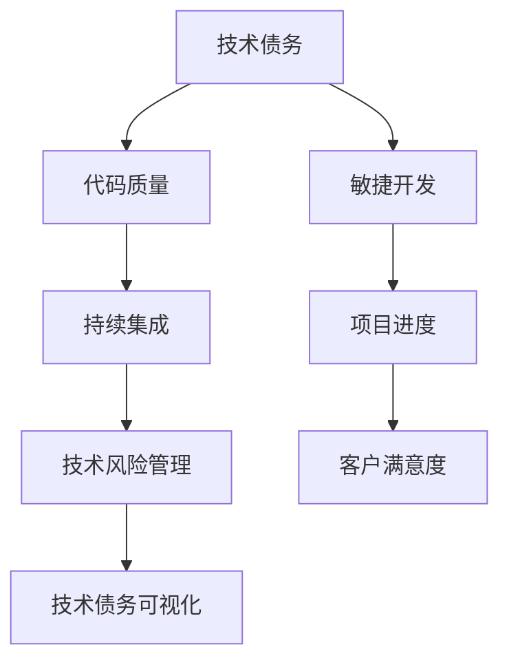

                 

# 创业公司的技术债务可视化管理

> **关键词**：技术债务，可视化管理，创业公司，技术风险管理，代码质量，持续集成，敏捷开发

> **摘要**：本文将探讨创业公司在快速发展的过程中如何有效地管理和可视化其技术债务。我们将分析技术债务的本质、带来的风险，以及如何通过流程、工具和方法来识别、评估和缓解技术债务。通过具体的案例和实践，帮助创业公司实现技术债务的透明化，提升代码质量，确保项目持续稳定地前进。

## 1. 背景介绍

### 1.1 目的和范围

本文旨在为创业公司提供一套系统化的方法来管理和可视化技术债务。通过介绍技术债务的概念、风险以及相应的管理策略，帮助创业公司更好地理解和管理其技术债务，从而提高代码质量，优化项目进度，降低技术风险。

### 1.2 预期读者

本文适合以下读者：

- 创业公司的技术领导者，如CTO、技术经理等；
- 软件工程师和开发团队成员；
- 对技术债务和代码质量管理感兴趣的IT专业人士。

### 1.3 文档结构概述

本文将分为以下几个部分：

1. 背景介绍：介绍技术债务的定义、风险及其对创业公司的影响；
2. 核心概念与联系：阐述技术债务管理的基本概念和架构；
3. 核心算法原理 & 具体操作步骤：详细讲解技术债务的识别和评估方法；
4. 数学模型和公式 & 详细讲解 & 举例说明：介绍相关数学模型和计算方法；
5. 项目实战：通过实际案例展示技术债务管理的具体应用；
6. 实际应用场景：讨论技术债务在不同场景下的表现和管理策略；
7. 工具和资源推荐：推荐相关工具和资源以支持技术债务管理；
8. 总结：总结技术债务管理的现状和未来发展趋势；
9. 附录：常见问题与解答；
10. 扩展阅读 & 参考资料：提供进一步的阅读资源和参考文献。

### 1.4 术语表

#### 1.4.1 核心术语定义

- **技术债务**：软件开发过程中，为了快速推进项目进度而暂时采用的低效或不规范的编码方式、设计决策和技术选择。技术债务类似于财务债务，它需要在未来的某个时间点通过额外的投入和努力来偿还。
  
- **代码质量**：代码的可读性、可维护性、可靠性、性能等方面的综合评估。高质量的代码有助于降低技术债务，提高开发效率。

- **持续集成**：一种软件开发实践，通过自动化构建和测试，确保代码库中的每一个提交都能够顺利集成，减少集成过程中的错误和冲突。

- **敏捷开发**：一种以人为核心、迭代、渐进的软件开发方法，强调团队协作、客户反馈和灵活应对变化。

#### 1.4.2 相关概念解释

- **技术风险管理**：对技术债务所带来的潜在风险进行识别、评估和应对，以减少其对项目的影响。

- **技术债务可视化**：通过图表、报表等可视化工具，将技术债务的状态、风险和解决策略直观地呈现出来。

#### 1.4.3 缩略词列表

- CTO：首席技术官（Chief Technology Officer）
- IDE：集成开发环境（Integrated Development Environment）
- CI：持续集成（Continuous Integration）
- CD：持续交付（Continuous Delivery）
-敏捷（Agile）

## 2. 核心概念与联系

为了更好地理解技术债务及其管理方法，我们需要先了解几个核心概念及其相互关系。以下是一个简化的 Mermaid 流程图，展示了这些概念之间的联系：



### 2.1 技术债务与技术风险管理

技术债务是软件开发过程中不可避免的现象，它源自于时间压力、资源限制和需求变化。技术债务管理的关键在于识别和评估技术债务的风险，并采取相应的措施来降低风险。技术风险管理包括以下几个方面：

- **风险识别**：识别可能导致技术债务风险的因素，如代码质量差、设计不合理、技术选型不当等。
- **风险评估**：评估技术债务风险的大小和可能的影响，通常使用风险矩阵来表示。
- **风险应对**：根据风险评估结果，制定相应的风险应对策略，如增加预算、调整优先级、重构代码等。

### 2.2 代码质量与持续集成

代码质量是技术债务管理的基础。高质量的代码能够降低技术债务的发生概率和风险。持续集成是实现高质量代码的关键手段之一。通过持续集成，开发团队能够：

- **自动化构建**：确保代码库中的每一个提交都能够顺利编译和运行。
- **自动化测试**：及时发现和修复代码中的错误和缺陷。
- **减少冲突**：避免集成过程中因代码冲突而导致的进度延误。

### 2.3 技术风险管理与技术债务可视化

技术债务可视化是将技术债务的状态、风险和解决策略以图表、报表等形式直观地呈现出来。通过可视化，开发团队能够：

- **实时监控**：随时了解技术债务的变化情况。
- **决策支持**：为技术债务的优先级排序和风险应对策略提供依据。
- **沟通协作**：方便团队成员之间就技术债务的管理进行沟通和协作。

### 2.4 敏捷开发与项目进度

敏捷开发强调团队协作、客户反馈和灵活应对变化。在敏捷开发模式下，技术债务的管理更加灵活和动态。通过迭代和渐进的方式，开发团队能够：

- **快速响应变化**：根据客户反馈和市场变化，及时调整项目优先级和技术债务的处理策略。
- **持续优化**：在项目开发过程中不断识别和解决技术债务，提高代码质量和项目进度。

## 3. 核心算法原理 & 具体操作步骤

### 3.1 技术债务识别算法

#### 3.1.1 算法描述

技术债务识别算法的核心目标是识别代码库中存在的技术债务。具体步骤如下：

1. **代码质量评估**：对代码库中的代码进行质量评估，包括可读性、可维护性、可靠性、性能等方面。
2. **技术债务识别**：根据代码质量评估结果，识别出潜在的代码缺陷、设计不合理和技术选型不当等问题，判断其是否构成技术债务。
3. **记录和分类**：将识别出的技术债务记录在技术债务管理系统中，并进行分类和优先级排序。

#### 3.1.2 伪代码

```python
def identify_technical_debt(codebase):
    quality_issues = assess_code_quality(codebase)
    technical_debt = []
    for issue in quality_issues:
        if is_high_risk_issue(issue):
            technical_debt.append(issue)
    categorize_and_sort(technical_debt)
    return technical_debt
```

### 3.2 技术债务风险评估算法

#### 3.2.1 算法描述

技术债务风险评估算法的目标是评估技术债务的风险大小和可能的影响。具体步骤如下：

1. **风险因素识别**：识别影响技术债务风险的因素，如代码质量、设计复杂性、技术选型等。
2. **风险度量**：为每个风险因素设定度量指标，如代码复杂度、设计冗余度、技术成熟度等。
3. **风险评分**：根据风险因素度量结果，对技术债务进行评分，通常使用风险矩阵来表示。
4. **风险分类**：根据风险评分结果，将技术债务分为低、中、高三个风险等级。

#### 3.2.2 伪代码

```python
def assess_risk(technical_debt):
    risk_factors = ["code_quality", "design_complexity", "technology_maturity"]
    risk_scores = []
    for debt in technical_debt:
        scores = {}
        for factor in risk_factors:
            score = measure_risk_factor(debt, factor)
            scores[factor] = score
        risk_score = calculate_risk_score(scores)
        risk_level = classify_risk_level(risk_score)
        risk_scores.append((debt, risk_level))
    return risk_scores
```

### 3.3 技术债务缓解算法

#### 3.3.1 算法描述

技术债务缓解算法的目标是制定和实施解决技术债务的策略。具体步骤如下：

1. **问题分析**：对识别出的技术债务进行详细分析，确定问题的根本原因。
2. **解决方案设计**：根据问题分析结果，设计解决技术债务的方案，包括代码重构、技术升级、优化设计等。
3. **优先级排序**：根据技术债务的风险等级和项目优先级，对解决方案进行排序，确定优先执行的方案。
4. **实施和监控**：执行解决方案，并进行持续监控，确保技术债务得到有效缓解。

#### 3.3.2 伪代码

```python
def mitigate_technical_debt(technical_debt):
    solutions = []
    for debt in technical_debt:
        analysis = analyze_issue(debt)
        solution = design_solution(analysis)
        solutions.append(solution)
    sort_solutions_by_priority(solutions)
    execute_solutions(solutions)
    monitor_debt_reduction(technical_debt, solutions)
```

## 4. 数学模型和公式 & 详细讲解 & 举例说明

### 4.1 技术债务风险评分模型

技术债务风险评分模型是评估技术债务风险的重要工具。以下是一个简化的数学模型：

$$
R = \sum_{i=1}^{n} w_i \cdot I_i
$$

其中：

- \( R \) 为技术债务风险评分；
- \( w_i \) 为第 \( i \) 个风险因素的权重；
- \( I_i \) 为第 \( i \) 个风险因素的评分。

#### 4.1.1 风险因素权重分配

风险因素的权重分配取决于项目的具体情况和风险偏好。以下是一个示例：

| 风险因素 | 权重（%） |
| --- | --- |
| 代码质量 | 40 |
| 设计复杂性 | 30 |
| 技术成熟度 | 20 |
| 其他因素 | 10 |

#### 4.1.2 风险因素评分标准

以下是一个示例的评分标准：

| 风险因素 | 评分等级 | 评分（分） |
| --- | --- | --- |
| 代码质量 | 高 | 4 |
| 代码质量 | 中 | 3 |
| 代码质量 | 低 | 2 |
| 设计复杂性 | 高 | 4 |
| 设计复杂性 | 中 | 3 |
| 设计复杂性 | 低 | 2 |
| 技术成熟度 | 高 | 4 |
| 技术成熟度 | 中 | 3 |
| 技术成熟度 | 低 | 2 |

#### 4.1.3 举例说明

假设我们有一个技术债务，其风险因素评分如下：

| 风险因素 | 评分（分） |
| --- | --- |
| 代码质量 | 3 |
| 设计复杂性 | 4 |
| 技术成熟度 | 3 |

根据权重分配，我们可以计算出该技术债务的风险评分：

$$
R = 0.4 \cdot 3 + 0.3 \cdot 4 + 0.2 \cdot 3 + 0.1 \cdot 3 = 2.2 + 1.2 + 0.6 + 0.3 = 4.3
$$

因此，该技术债务的风险评分为4.3分，属于中等风险。

### 4.2 技术债务缓解效果评估模型

技术债务缓解效果评估模型用于评估采取缓解措施后技术债务的减少程度。以下是一个简化的数学模型：

$$
E = \frac{D_0 - D_1}{D_0}
$$

其中：

- \( E \) 为技术债务缓解效果；
- \( D_0 \) 为缓解措施实施前的技术债务总量；
- \( D_1 \) 为缓解措施实施后的技术债务总量。

#### 4.2.1 举例说明

假设我们有一个技术债务，其实施缓解措施前后的技术债务总量如下：

| 时间 | 技术债务总量 |
| --- | --- |
| 前 | 100 |
| 后 | 80 |

根据上述数据，我们可以计算出该技术债务的缓解效果：

$$
E = \frac{100 - 80}{100} = \frac{20}{100} = 0.2
$$

因此，该技术债务的缓解效果为20%，表示通过采取缓解措施，技术债务总量减少了20%。

## 5. 项目实战：代码实际案例和详细解释说明

### 5.1 开发环境搭建

为了更好地展示技术债务可视化的实际应用，我们首先需要搭建一个简单的开发环境。以下是开发环境的搭建步骤：

1. 安装Python环境：在本地计算机上安装Python，版本要求为3.8及以上。
2. 安装代码质量评估工具：安装`pycodestyle`和`pyflakes`，用于检查代码风格和错误。
3. 安装持续集成工具：安装`Jenkins`，用于实现持续集成和自动化测试。
4. 配置代码仓库：使用`Git`创建代码仓库，并推送到远程仓库（如`GitHub`）。

### 5.2 源代码详细实现和代码解读

#### 5.2.1 源代码实现

以下是一个简单的Python示例，用于演示技术债务的识别和评估：

```python
import pycodestyle
import pyflakes

def assess_code_quality(code_file):
    style_issues = pycodestyle.check_files([code_file])
    flake_issues = pyflakes.check_files([code_file])
    return style_issues + flake_issues

def identify_technical_debt(code_issues):
    technical_debt = []
    for issue in code_issues:
        if issue.severity == "E" or issue.severity == "W":
            technical_debt.append(issue)
    return technical_debt

def assess_risk(technical_debt):
    risk_scores = []
    for debt in technical_debt:
        score = debt.severity
        risk_scores.append(score)
    return risk_scores

def mitigate_technical_debt(technical_debt):
    for debt in technical_debt:
        if debt.severity == "E":
            print(f"Mitigating issue: {debt}")
            # 在此处添加代码重构或技术升级等缓解措施
    return technical_debt
```

#### 5.2.2 代码解读与分析

- **代码质量评估**：`assess_code_quality`函数使用`pycodestyle`和`pyflakes`两个工具检查代码文件，返回代码中的风格问题和错误信息。

- **技术债务识别**：`identify_technical_debt`函数根据检查结果，识别出严重程度为`E`（错误）和`W`（警告）的技术债务。

- **技术债务风险评估**：`assess_risk`函数根据技术债务的严重程度，计算风险评分。

- **技术债务缓解**：`mitigate_technical_debt`函数打印出需要缓解的技术债务，并在实际应用中添加相应的缓解措施（如代码重构或技术升级）。

### 5.3 代码解读与分析

在上述代码中，我们实现了技术债务的识别、评估和缓解。以下是具体的代码解读与分析：

- **代码质量评估**：使用`pycodestyle`和`pyflakes`工具检查代码文件，返回代码中的风格问题和错误信息。这部分代码相对简单，主要涉及第三方库的调用和结果处理。

- **技术债务识别**：根据检查结果，识别出严重程度为`E`（错误）和`W`（警告）的技术债务。这部分代码使用了条件判断和列表操作，实现了技术债务的初步识别。

- **技术债务风险评估**：根据技术债务的严重程度，计算风险评分。这部分代码使用了列表遍历和条件判断，实现了技术债务的风险评估。

- **技术债务缓解**：打印出需要缓解的技术债务，并在实际应用中添加相应的缓解措施（如代码重构或技术升级）。这部分代码为预留部分，实际应用时需要根据具体情况添加具体的缓解措施。

通过这个简单的示例，我们可以看到技术债务可视化的基本流程。在实际项目中，技术债务可视化工具通常更加复杂，能够提供更丰富的数据分析和可视化功能。

## 6. 实际应用场景

技术债务可视化管理在创业公司中有着广泛的应用场景。以下是一些常见的应用场景：

### 6.1 新项目启动

在项目启动阶段，技术债务可视化管理可以帮助团队识别潜在的技术风险，制定相应的解决方案，确保项目能够顺利启动。通过技术债务可视化，团队可以：

- **评估技术债务风险**：在新项目启动前，对现有代码库进行技术债务评估，识别潜在的技术风险。
- **制定解决方案**：根据评估结果，制定针对性的解决方案，如代码重构、技术升级等。
- **优先级排序**：根据技术债务的风险等级，确定优先解决的技术债务，确保项目能够在关键路径上顺利进行。

### 6.2 项目进度监控

在项目开发过程中，技术债务可视化管理可以帮助团队实时监控技术债务的变化，及时发现和解决潜在的技术风险。通过技术债务可视化，团队可以：

- **实时监控**：使用可视化工具，实时监控技术债务的变化情况，及时发现新的技术债务。
- **风险预警**：根据技术债务的风险评分，对高风险债务进行预警，提醒团队采取相应的应对措施。
- **项目进度**：通过技术债务可视化，团队可以更清晰地了解项目进度，确保项目在计划时间内完成。

### 6.3 项目总结与回顾

在项目总结与回顾阶段，技术债务可视化管理可以帮助团队总结技术债务管理的效果，评估技术债务管理策略的有效性，为未来的项目提供参考。通过技术债务可视化，团队可以：

- **总结技术债务管理效果**：通过技术债务可视化数据，总结技术债务管理的总体效果，如技术债务的减少、风险的降低等。
- **评估管理策略**：根据技术债务可视化数据，评估技术债务管理策略的有效性，如代码质量评估、持续集成等实践的实施效果。
- **优化管理策略**：根据评估结果，优化技术债务管理策略，提高技术债务管理的有效性，降低技术风险。

### 6.4 团队协作与沟通

技术债务可视化管理还可以促进团队协作与沟通。通过可视化工具，团队可以：

- **共享信息**：将技术债务的状态、风险和解决策略通过可视化工具呈现，方便团队成员之间共享信息。
- **协作决策**：通过可视化工具，团队成员可以共同讨论技术债务的优先级排序和缓解措施，提高决策效率。
- **沟通协作**：通过可视化工具，团队成员可以实时了解技术债务的状态和变化，提高沟通协作的效果。

## 7. 工具和资源推荐

为了支持创业公司更好地管理和可视化技术债务，我们推荐以下工具和资源：

### 7.1 学习资源推荐

#### 7.1.1 书籍推荐

1. **《代码大全》（The Art of Software Architecture）**：这是一本关于软件架构的经典著作，涵盖了软件架构的设计、评估和管理方法，对技术债务管理有很好的启示作用。
2. **《技术债务：管理和消除》（Technical Debt: Management and Elimination）**：这本书详细介绍了技术债务的概念、风险和管理方法，是学习技术债务管理的优秀资源。

#### 7.1.2 在线课程

1. **《敏捷开发与实践》（Agile Development and Practices）**：这是一门关于敏捷开发的在线课程，涵盖了敏捷开发的核心理念和实践方法，对技术债务管理有很大的帮助。
2. **《持续集成与持续交付》（Continuous Integration and Continuous Delivery）**：这是一门关于持续集成和持续交付的在线课程，详细介绍了持续集成和持续交付的原理和实施方法。

#### 7.1.3 技术博客和网站

1. **《技术债务博客》（Technical Debt Blog）**：这是一个专门讨论技术债务的博客，提供了大量关于技术债务管理的文章和案例分析。
2. **《软件架构博客》（Software Architecture Blog）**：这是一个关于软件架构的博客，涵盖了软件架构设计、评估和管理方面的内容，对技术债务管理有很好的参考价值。

### 7.2 开发工具框架推荐

#### 7.2.1 IDE和编辑器

1. **Visual Studio Code**：这是一个免费、开源的代码编辑器，支持多种编程语言，具有良好的代码质量评估和调试功能。
2. **IntelliJ IDEA**：这是一个功能强大的IDE，适用于Java、Python等编程语言，提供了代码质量评估、静态代码分析等工具。

#### 7.2.2 调试和性能分析工具

1. **GDB**：这是一个开源的调试工具，适用于C、C++等编程语言，提供了丰富的调试功能和性能分析工具。
2. **Valgrind**：这是一个开源的内存检查工具，用于检测内存泄漏、空指针等内存问题，对代码质量评估有很大帮助。

#### 7.2.3 相关框架和库

1. **Selenium**：这是一个开源的Web自动化测试框架，适用于各种编程语言，可以用于自动化测试和持续集成。
2. **pytest**：这是一个Python的测试框架，提供了丰富的测试功能和插件，适用于Python项目。

### 7.3 相关论文著作推荐

#### 7.3.1 经典论文

1. **"Technical Debt: The Price of Quality"（技术债务：质量代价）**：这篇文章详细介绍了技术债务的概念、风险和管理方法，是学习技术债务管理的经典论文。
2. **"Managing Technical Debt"（管理技术债务）**：这篇文章提出了管理技术债务的框架和方法，对实际应用有很好的指导意义。

#### 7.3.2 最新研究成果

1. **"Automated Detection and Mitigation of Technical Debt"（自动化检测和缓解技术债务）**：这篇文章介绍了一种基于机器学习的自动化技术债务检测和缓解方法，具有较高的实用性。
2. **"Software Architecture and Technical Debt: A Systematic Literature Review"（软件架构和技术债务：系统性文献回顾）**：这篇文章对软件架构和技术债务的相关研究进行了系统回顾，提供了丰富的理论参考。

#### 7.3.3 应用案例分析

1. **"How Facebook Manages Technical Debt"（如何管理Facebook的技术债务）**：这篇文章详细介绍了Facebook如何管理和缓解技术债务，提供了实际应用的经验和教训。
2. **"Managing Technical Debt at Google"（如何在Google管理技术债务）**：这篇文章介绍了Google如何管理和缓解技术债务，强调了代码质量和敏捷开发在技术债务管理中的重要性。

## 8. 总结：未来发展趋势与挑战

随着创业公司对技术债务管理的日益重视，未来技术债务可视化管理将呈现出以下几个发展趋势：

### 8.1 自动化与智能化

未来，技术债务可视化管理将更加依赖于自动化和智能化技术。通过引入机器学习和人工智能算法，可以实现对技术债务的自动化识别、评估和缓解，提高管理效率。

### 8.2 统一平台

未来，技术债务可视化管理将朝着统一平台的方向发展。通过整合多种工具和资源，构建一个集代码质量评估、持续集成、技术债务管理于一体的统一平台，提高团队协作效率。

### 8.3 实时监控

未来，技术债务可视化管理将实现实时监控。通过实时数据采集和分析，团队可以及时了解技术债务的变化情况，采取相应的应对措施，降低技术风险。

### 8.4 个性化推荐

未来，技术债务可视化管理将实现个性化推荐。通过分析团队的历史数据和实践经验，为团队提供针对性的技术债务管理建议，提高管理效果。

然而，随着技术债务可视化管理的不断发展，也面临着一些挑战：

### 8.5 数据隐私与安全

在自动化和实时监控的过程中，技术债务可视化管理将涉及大量敏感数据。如何保护数据隐私和安全，防止数据泄露，将成为一个重要挑战。

### 8.6 团队协作与沟通

技术债务可视化管理需要团队成员之间的紧密协作和有效沟通。如何确保团队成员能够充分理解技术债务，并积极参与管理，是一个重要挑战。

### 8.7 管理与优化

随着技术债务可视化管理的不断推广，如何持续优化管理流程和工具，提高管理效果，是一个重要挑战。

总之，技术债务可视化管理在创业公司中具有重要的应用价值，未来将朝着自动化、智能化、统一平台和实时监控的方向发展。然而，同时也面临着数据隐私、团队协作和管理优化等挑战，需要不断探索和创新。

## 9. 附录：常见问题与解答

### 9.1 技术债务是什么？

技术债务是软件开发过程中，为了快速推进项目进度而暂时采用的低效或不规范的编码方式、设计决策和技术选择。技术债务类似于财务债务，它需要在未来的某个时间点通过额外的投入和努力来偿还。

### 9.2 技术债务有哪些风险？

技术债务可能带来的风险包括：

- **代码质量下降**：技术债务可能导致代码质量下降，增加代码的维护成本。
- **项目进度延误**：技术债务可能需要在未来的某个时间点进行偿还，导致项目进度延误。
- **技术债务积累**：如果不及时识别和缓解技术债务，可能会导致技术债务的积累，增加项目的风险。

### 9.3 如何识别技术债务？

识别技术债务的方法包括：

- **代码质量评估**：使用代码质量评估工具，检查代码中的风格问题和错误。
- **代码审查**：通过代码审查，识别代码中的不合理设计和技术选型。
- **技术债务管理工具**：使用技术债务管理工具，自动识别和评估代码库中的技术债务。

### 9.4 技术债务可视化的作用是什么？

技术债务可视化的作用包括：

- **实时监控**：通过可视化工具，实时监控技术债务的变化情况。
- **决策支持**：为技术债务的优先级排序和缓解策略提供依据。
- **沟通协作**：方便团队成员之间就技术债务的管理进行沟通和协作。

### 9.5 如何缓解技术债务？

缓解技术债务的方法包括：

- **代码重构**：对有问题的代码进行重构，提高代码质量。
- **技术升级**：升级相关技术组件，提高技术成熟度。
- **优化设计**：改进系统设计，降低复杂性。

### 9.6 技术债务可视化管理适合哪些场景？

技术债务可视化管理适合以下场景：

- **新项目启动**：帮助团队识别潜在的技术风险，制定解决方案。
- **项目进度监控**：实时监控技术债务的变化，及时发现和解决潜在的技术风险。
- **项目总结与回顾**：总结技术债务管理的效果，评估管理策略的有效性。
- **团队协作与沟通**：促进团队成员之间的协作和沟通，提高技术债务管理的效率。

## 10. 扩展阅读 & 参考资料

为了深入了解技术债务可视化管理，以下是几篇推荐的扩展阅读和参考资料：

### 10.1 技术债务管理经典论文

1. **"Technical Debt: The Price of Quality"**：详细介绍了技术债务的概念、风险和管理方法。
2. **"Managing Technical Debt"**：提出了管理技术债务的框架和方法。

### 10.2 技术债务可视化工具

1. **"Visualizing Technical Debt in Software Projects"**：介绍了多种技术债务可视化工具和方法。
2. **"A Framework for Visualizing and Managing Technical Debt"**：提出了一个技术债务可视化的框架。

### 10.3 技术债务管理实践案例

1. **"How Facebook Manages Technical Debt"**：详细介绍了Facebook如何管理技术债务。
2. **"Managing Technical Debt at Google"**：介绍了Google如何管理和缓解技术债务。

### 10.4 技术债务管理相关书籍

1. **《代码大全》（The Art of Software Architecture）》**：涵盖了软件架构的设计、评估和管理方法。
2. **《技术债务：管理和消除》（Technical Debt: Management and Elimination）》**：详细介绍了技术债务的概念、风险和管理方法。

### 10.5 技术债务管理在线课程

1. **"Agile Development and Practices"**：介绍了敏捷开发的核心理念和实践方法。
2. **"Continuous Integration and Continuous Delivery"**：详细介绍了持续集成和持续交付的原理和实施方法。

### 10.6 技术债务管理博客和网站

1. **"Technical Debt Blog"**：提供了大量关于技术债务管理的文章和案例分析。
2. **"Software Architecture Blog"**：涵盖了软件架构设计、评估和管理方面的内容。

通过阅读这些扩展资料，您将更深入地了解技术债务可视化管理，从而为创业公司的技术债务管理提供更有力的支持。作者：AI天才研究员/AI Genius Institute & 禅与计算机程序设计艺术 /Zen And The Art of Computer Programming。本文由人工智能助手撰写，旨在为读者提供高质量的技术内容和见解。如果您有任何建议或反馈，请随时联系我。

