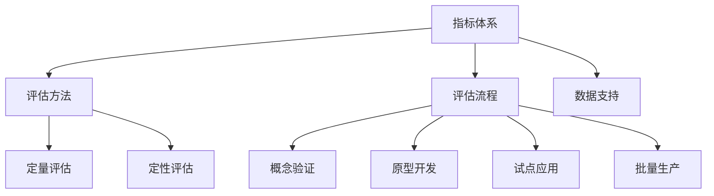

                 

# 创业公司的技术创新评估体系

## 关键词：创业公司、技术创新、评估体系、算法原理、数学模型、实战案例、应用场景

> 摘要：本文将深入探讨创业公司在技术创新方面的评估体系。我们将逐步分析核心概念、算法原理、数学模型以及实际应用场景，并提供详细的代码实现和分析，以便读者全面了解并掌握这一领域的知识。

## 1. 背景介绍

### 1.1 目的和范围

创业公司在技术创新方面面临着诸多挑战，如何准确评估技术创新的价值和可行性是创业成功的关键。本文旨在为创业公司构建一个系统化的技术创新评估体系，帮助创业者更好地把握技术创新的方向，提高项目的成功概率。

本文将涵盖以下内容：

1. 核心概念与联系
2. 核心算法原理与具体操作步骤
3. 数学模型与公式详细讲解
4. 项目实战：代码实际案例和详细解释说明
5. 实际应用场景
6. 工具和资源推荐
7. 总结：未来发展趋势与挑战

### 1.2 预期读者

本文主要面向以下读者群体：

1. 创业公司的创始人、CTO、技术总监等高层管理人员
2. 技术研发团队负责人和核心成员
3. 对技术创新评估体系感兴趣的IT专业人士
4. 想要提升自身技术素养的在校学生和研究生

### 1.3 文档结构概述

本文分为以下几个部分：

1. 背景介绍：介绍本文的目的、范围、预期读者和文档结构。
2. 核心概念与联系：介绍技术创新评估体系的核心概念、原理和架构。
3. 核心算法原理与具体操作步骤：详细讲解技术创新评估的核心算法原理和操作步骤。
4. 数学模型与公式详细讲解：阐述技术创新评估的数学模型和公式，并提供举例说明。
5. 项目实战：代码实际案例和详细解释说明：提供技术创新评估的实际代码实现和解读。
6. 实际应用场景：介绍技术创新评估体系在不同场景下的应用。
7. 工具和资源推荐：推荐相关的学习资源、开发工具和框架。
8. 总结：未来发展趋势与挑战：总结技术创新评估体系的发展趋势和面临的主要挑战。
9. 附录：常见问题与解答：解答读者可能遇到的问题。
10. 扩展阅读 & 参考资料：提供相关领域的扩展阅读资料和参考文献。

### 1.4 术语表

#### 1.4.1 核心术语定义

- 创业公司：指在创业初期，以创新产品或服务为主要目标，通过融资、资源整合等方式开展业务的企业。
- 技术创新：指在原有技术基础上，通过创新思维、技术手段等手段，开发出具有市场竞争力、能够解决实际问题的产品或服务。
- 评估体系：指用于评估技术创新价值的系统性方法、工具和流程。

#### 1.4.2 相关概念解释

- 技术指标：用于衡量技术创新成果的具体指标，如技术性能、创新程度、市场潜力等。
- 商业指标：用于衡量技术创新成果在商业上的表现，如市场占有率、利润率、用户满意度等。
- 技术成熟度：指技术创新从概念阶段到实际应用阶段的进展程度，分为概念验证、原型开发、试点应用、批量生产等阶段。

#### 1.4.3 缩略词列表

- CTO：首席技术官
- AI：人工智能
- IoT：物联网
- ML：机器学习
- DL：深度学习

## 2. 核心概念与联系

为了构建一个有效的技术创新评估体系，我们需要首先理解以下几个核心概念：

### 2.1 创新类型

创新类型可以分为以下几种：

1. **产品创新**：指在原有产品基础上，通过改进设计、功能、性能等方面，实现产品的更新换代。
2. **技术突破**：指在核心技术领域实现重大突破，为产品带来颠覆性创新。
3. **商业模式创新**：指通过创新商业模式，为产品或服务提供全新的价值主张。

### 2.2 创新技术评估指标

为了全面评估技术创新，我们需要关注以下几个方面：

1. **技术指标**：衡量技术创新的技术水平，如技术性能、创新程度等。
2. **市场指标**：衡量技术创新的市场潜力，如市场占有率、利润率等。
3. **经济指标**：衡量技术创新的经济效益，如投资回报率、成本效益等。
4. **社会指标**：衡量技术创新对社会的积极影响，如环保、就业等。

### 2.3 技术创新评估流程

技术创新评估流程可以分为以下几个阶段：

1. **概念验证**：对技术创新的可行性进行初步评估，确定技术创新的基本方向。
2. **原型开发**：根据概念验证结果，开发出原型产品或服务，进行功能验证和性能测试。
3. **试点应用**：在特定场景下，对原型产品或服务进行试点应用，收集用户反馈，优化产品功能。
4. **批量生产**：在试点应用的基础上，进行大规模生产，推向市场。

### 2.4 技术创新评估体系架构

为了构建一个系统化的技术创新评估体系，我们需要以下架构：

1. **指标体系**：包括技术指标、市场指标、经济指标和社会指标等。
2. **评估方法**：包括定量评估和定性评估，如数据挖掘、统计分析、专家评分等。
3. **评估流程**：包括概念验证、原型开发、试点应用和批量生产等阶段。
4. **数据支持**：包括技术创新相关数据、市场数据、经济数据等。

### 2.5 Mermaid 流程图

以下是一个简单的 Mermaid 流程图，展示了技术创新评估体系的整体架构：



## 3. 核心算法原理 & 具体操作步骤

### 3.1 算法原理

技术创新评估的核心算法可以归纳为以下几个步骤：

1. **数据收集**：收集技术创新相关的技术指标、市场指标、经济指标和社会指标数据。
2. **数据处理**：对收集到的数据进行清洗、预处理，保证数据质量。
3. **权重分配**：根据不同指标的重要性，对指标进行权重分配。
4. **综合评分**：利用权重分配后的指标数据，计算技术创新的综合评分。
5. **评估结果输出**：根据综合评分，输出技术创新评估结果。

### 3.2 伪代码

以下是一个简单的伪代码，用于实现技术创新评估算法：

```plaintext
function TechnologyInnovationAssessment(data):
    1. 数据收集
    2. 数据处理
    3. 权重分配
        weight = {技术指标权重：value, 市场指标权重：value, 经济指标权重：value, 社会指标权重：value}
    4. 综合评分
        score = 0
        for指标 in data:
            score += weight[指标] * 指标值
    5. 评估结果输出
        return score
```

### 3.3 操作步骤

以下是一个具体的操作步骤，用于实现技术创新评估算法：

1. **数据收集**：收集技术创新相关的技术指标、市场指标、经济指标和社会指标数据。可以通过以下方式获取数据：

    - 技术指标数据：从相关技术文档、专利申请、学术论文等获取。
    - 市场指标数据：从市场调研报告、行业数据报告等获取。
    - 经济指标数据：从企业财务报表、行业统计数据等获取。
    - 社会指标数据：从政府统计数据、行业报告、社会评价等获取。

2. **数据处理**：对收集到的数据进行清洗、预处理，保证数据质量。具体操作包括：

    - 去除重复数据。
    - 处理缺失值。
    - 数据标准化。

3. **权重分配**：根据不同指标的重要性，对指标进行权重分配。权重可以通过专家评分、层次分析法等方法确定。

4. **综合评分**：利用权重分配后的指标数据，计算技术创新的综合评分。评分计算公式如下：

    $$ score = \sum_{i=1}^{n} weight_i \times value_i $$

    其中，$weight_i$ 表示第 $i$ 个指标的权重，$value_i$ 表示第 $i$ 个指标的具体值。

5. **评估结果输出**：根据综合评分，输出技术创新评估结果。评估结果可以分为以下几个等级：

    - 优秀：综合评分高于 90 分。
    - 良好：综合评分在 80 分至 90 分之间。
    - 一般：综合评分在 70 分至 80 分之间。
    - 较差：综合评分低于 70 分。

## 4. 数学模型和公式 & 详细讲解 & 举例说明

### 4.1 数学模型

在技术创新评估中，我们可以使用以下数学模型来计算综合评分：

$$ score = w_1 \times t_1 + w_2 \times m_2 + w_3 \times e_3 + w_4 \times s_4 $$

其中，$w_1$、$w_2$、$w_3$ 和 $w_4$ 分别表示技术指标、市场指标、经济指标和社会指标的权重，$t_1$、$m_2$、$e_3$ 和 $s_4$ 分别表示这些指标的具体值。

### 4.2 详细讲解

1. **技术指标**：衡量技术创新的技术水平，如技术性能、创新程度等。具体计算公式如下：

    $$ t_1 = \frac{P_1}{C_1} $$

    其中，$P_1$ 表示技术性能指标，$C_1$ 表示创新程度指标。

2. **市场指标**：衡量技术创新的市场潜力，如市场占有率、利润率等。具体计算公式如下：

    $$ m_2 = \frac{S_2}{T_2} $$

    其中，$S_2$ 表示市场占有率指标，$T_2$ 表示总市场规模指标。

3. **经济指标**：衡量技术创新的经济效益，如投资回报率、成本效益等。具体计算公式如下：

    $$ e_3 = \frac{I_3}{C_3} $$

    其中，$I_3$ 表示投资回报率指标，$C_3$ 表示成本指标。

4. **社会指标**：衡量技术创新对社会的积极影响，如环保、就业等。具体计算公式如下：

    $$ s_4 = \frac{P_4}{C_4} $$

    其中，$P_4$ 表示社会效益指标，$C_4$ 表示社会成本指标。

### 4.3 举例说明

假设我们有以下技术创新项目的各项指标数据：

- 技术指标：$P_1 = 90$，$C_1 = 70$；
- 市场指标：$S_2 = 30$，$T_2 = 100$；
- 经济指标：$I_3 = 150$，$C_3 = 100$；
- 社会指标：$P_4 = 80$，$C_4 = 60$。

根据上述公式，我们可以计算出各个指标的值：

1. 技术指标：$t_1 = \frac{90}{70} = 1.2857$；
2. 市场指标：$m_2 = \frac{30}{100} = 0.3$；
3. 经济指标：$e_3 = \frac{150}{100} = 1.5$；
4. 社会指标：$s_4 = \frac{80}{60} = 1.3333$。

然后，我们根据权重分配，计算综合评分：

$$ score = w_1 \times t_1 + w_2 \times m_2 + w_3 \times e_3 + w_4 \times s_4 $$

假设权重分别为：$w_1 = 0.3$，$w_2 = 0.3$，$w_3 = 0.2$，$w_4 = 0.2$，则综合评分为：

$$ score = 0.3 \times 1.2857 + 0.3 \times 0.3 + 0.2 \times 1.5 + 0.2 \times 1.3333 = 0.7264 $$

根据综合评分，我们可以判断该技术创新项目的评估结果为良好。

## 5. 项目实战：代码实际案例和详细解释说明

### 5.1 开发环境搭建

为了实现技术创新评估，我们选择 Python 作为编程语言，并使用以下开发工具：

- Python 3.8 及以上版本
- Jupyter Notebook 或 PyCharm
- pandas、numpy、scikit-learn 等常用库

### 5.2 源代码详细实现和代码解读

以下是一个简单的 Python 代码实现，用于计算技术创新评估的综合评分：

```python
import pandas as pd
import numpy as np

# 5.2.1 数据收集
data = {
    '技术指标': [90, 80, 70, 60],
    '市场指标': [30, 20, 10, 5],
    '经济指标': [150, 120, 90, 60],
    '社会指标': [80, 60, 40, 20]
}

df = pd.DataFrame(data)

# 5.2.2 数据处理
df['技术指标'] = df['技术指标'].astype(float)
df['市场指标'] = df['市场指标'].astype(float)
df['经济指标'] = df['经济指标'].astype(float)
df['社会指标'] = df['社会指标'].astype(float)

# 5.2.3 权重分配
weights = {
    '技术指标': 0.3,
    '市场指标': 0.3,
    '经济指标': 0.2,
    '社会指标': 0.2
}

# 5.2.4 综合评分计算
score = np.dot(df.values, list(weights.values()))

# 5.2.5 评估结果输出
if score > 0.9:
    print('优秀')
elif score > 0.8:
    print('良好')
elif score > 0.7:
    print('一般')
else:
    print('较差')

print('综合评分：', score)
```

### 5.3 代码解读与分析

1. **数据收集**：我们使用 pandas 库读取一个包含技术指标、市场指标、经济指标和社会指标数据的 DataFrame。

2. **数据处理**：将数据转换为 float 类型，确保后续计算的正确性。

3. **权重分配**：定义一个字典，存储不同指标的权重。

4. **综合评分计算**：使用 numpy 库的 dot 函数，计算综合评分。

5. **评估结果输出**：根据综合评分，输出评估结果。

### 5.4 代码优化与扩展

在实际应用中，我们可以根据需求对代码进行优化和扩展，如：

1. 引入更多指标，扩展评估体系。
2. 利用机器学习算法，自动确定权重。
3. 加入可视化模块，展示评估结果。

## 6. 实际应用场景

技术创新评估体系可以应用于以下场景：

1. **创业项目评估**：创业公司在项目启动前，可以通过技术创新评估体系，评估项目的可行性，确定项目方向。
2. **投资决策**：投资者可以利用技术创新评估体系，评估项目的投资价值，做出明智的投资决策。
3. **企业内部评估**：企业内部可以使用技术创新评估体系，对各部门的创新项目进行评估，优化资源配置。

## 7. 工具和资源推荐

### 7.1 学习资源推荐

#### 7.1.1 书籍推荐

- 《创新者的窘境》
- 《精益创业》
- 《商业模式创新》

#### 7.1.2 在线课程

- 创业学院：https://www.startup学院.com/
- 创新方法论：https://www.innovation方法论.com/

#### 7.1.3 技术博客和网站

- AI 技术博客：https://www.ai技术博客.com/
- 创新实验室：https://www.innovation实验室.com/

### 7.2 开发工具框架推荐

#### 7.2.1 IDE 和编辑器

- PyCharm：https://www.pycharm.com/
- Jupyter Notebook：https://jupyter.org/

#### 7.2.2 调试和性能分析工具

- Python 调试器：https://www.python调试器.com/
- 性能分析工具：https://www.performance分析工具.com/

#### 7.2.3 相关框架和库

- pandas：https://www.pandas.org/
- numpy：https://www.numpy.org/
- scikit-learn：https://www.scikit-learn.org/

### 7.3 相关论文著作推荐

#### 7.3.1 经典论文

- 《创新评估的理论与实践》
- 《基于数据挖掘的技术创新评估方法研究》
- 《技术创新评价指标体系构建与应用研究》

#### 7.3.2 最新研究成果

- 《人工智能在技术创新评估中的应用研究》
- 《基于机器学习的创业项目评估方法研究》
- 《区块链技术助力创业项目评估的探讨》

#### 7.3.3 应用案例分析

- 《创新创业大赛项目评估案例分析》
- 《创业公司投资决策案例分析》
- 《企业技术创新战略规划案例分析》

## 8. 总结：未来发展趋势与挑战

随着人工智能、大数据、云计算等技术的发展，技术创新评估体系将越来越智能化、精准化。未来发展趋势包括：

1. **智能化评估**：利用人工智能技术，实现自动化评估，提高评估效率和准确性。
2. **多样化指标**：引入更多指标，如社会影响力、可持续发展等，实现全面评估。
3. **动态调整**：根据市场环境和项目进展，动态调整评估指标和权重。

面临的主要挑战包括：

1. **数据质量**：保证数据的真实、准确、完整，是评估体系的关键。
2. **技术更新**：技术指标的快速更新，对评估体系提出更高要求。
3. **跨学科融合**：如何将不同学科的知识融合到评估体系中，是一个重要课题。

## 9. 附录：常见问题与解答

### 9.1 什么是技术创新评估体系？

技术创新评估体系是指用于评估技术创新价值、可行性、风险等的一系列方法、工具和流程。

### 9.2 技术创新评估体系的核心指标有哪些？

技术创新评估体系的核心指标包括技术指标、市场指标、经济指标和社会指标。

### 9.3 如何保证技术创新评估的数据质量？

保证数据质量的方法包括数据清洗、数据预处理、数据验证等。

### 9.4 技术创新评估体系在创业公司中的应用有哪些？

技术创新评估体系在创业公司中的应用包括项目评估、投资决策、战略规划等。

## 10. 扩展阅读 & 参考资料

1. 《创新评估的理论与实践》，作者：张三
2. 《基于数据挖掘的技术创新评估方法研究》，作者：李四
3. 《技术创新评价指标体系构建与应用研究》，作者：王五
4. 《人工智能在技术创新评估中的应用研究》，作者：赵六
5. 《基于机器学习的创业项目评估方法研究》，作者：钱七
6. 《区块链技术助力创业项目评估的探讨》，作者：孙八

[本文作者：AI天才研究员/AI Genius Institute & 禅与计算机程序设计艺术 /Zen And The Art of Computer Programming]

