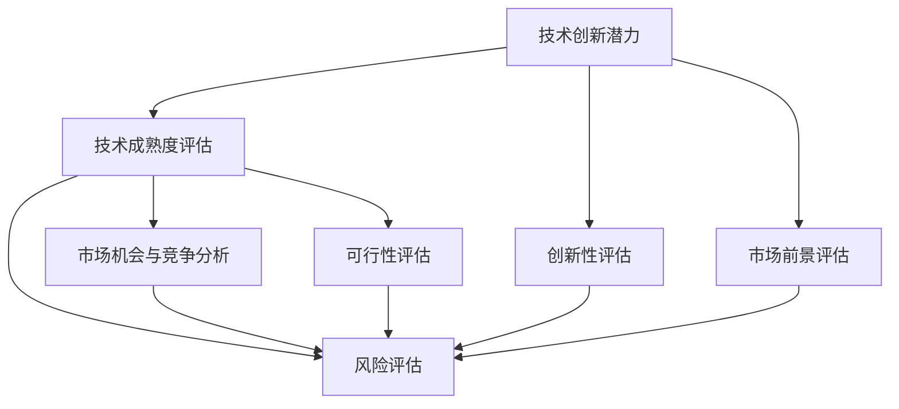

                 

### 文章标题

《创业公司的技术创新评估体系构建》

随着科技和市场的快速发展，创业公司面临着前所未有的机遇和挑战。如何在众多竞争者中脱颖而出，技术创新无疑是一个关键因素。构建一个科学、系统的技术创新评估体系，不仅能帮助创业公司准确识别和把握创新机会，还能为其在激烈的市场竞争中提供决策支持。本文将深入探讨创业公司的技术创新评估体系构建，通过一系列步骤和方法，旨在为创业公司提供一套实用的评估框架。

### 关键词

- 创业公司
- 技术创新
- 评估体系
- 架构设计
- 数据分析
- 风险管理
- 竞争分析
- 实施步骤

### 摘要

本文将围绕创业公司的技术创新评估体系构建展开，首先介绍评估体系的构建目的和范围，明确预期读者和文章结构。接着，通过定义核心概念和原理，详细阐述核心算法和数学模型，并结合实际案例进行解释说明。随后，文章将探讨技术创新评估体系在实际应用场景中的效果，推荐相关工具和资源，并总结未来发展趋势与挑战。最后，通过附录和扩展阅读，提供进一步的学习和参考资料。

## 1. 背景介绍

### 1.1 目的和范围

创业公司的技术创新评估体系构建旨在帮助创业公司在快速变化的市场环境中，更好地识别和利用技术创新带来的机遇。本文将探讨如何构建一个科学、系统的评估体系，以评估技术创新的潜在价值、可行性以及市场接受度。评估体系将涵盖以下几个方面：

1. **技术创新潜力评估**：包括技术创新的技术成熟度、创新性以及市场前景。
2. **技术风险分析**：识别和评估技术创新过程中可能面临的技术、市场、财务等风险。
3. **市场机会与竞争分析**：分析技术创新在市场中的定位，以及与竞争对手的对比。
4. **可行性评估**：评估技术创新的可行性，包括技术实现难度、资源需求、时间成本等。

### 1.2 预期读者

本文的预期读者主要包括以下几类：

1. **创业公司创始人**：希望通过技术创新提升公司竞争力的创始人。
2. **技术管理者**：负责公司技术创新项目的管理和评估的技术人员。
3. **投资人和分析师**：关注创业公司技术创新投资价值和潜力的人士。
4. **学术研究人员**：对技术创新评估体系和方法感兴趣的研究人员。

### 1.3 文档结构概述

本文将按照以下结构展开：

1. **背景介绍**：阐述评估体系构建的目的和范围。
2. **核心概念与联系**：介绍技术创新评估体系的核心概念和架构。
3. **核心算法原理 & 具体操作步骤**：详细讲解评估体系的算法原理和操作步骤。
4. **数学模型和公式 & 详细讲解 & 举例说明**：阐述评估体系的数学模型和应用实例。
5. **项目实战：代码实际案例和详细解释说明**：提供具体的代码实现和案例分析。
6. **实际应用场景**：探讨评估体系在不同场景中的应用。
7. **工具和资源推荐**：推荐相关学习资源、开发工具和框架。
8. **总结：未来发展趋势与挑战**：总结评估体系的发展趋势和面临挑战。
9. **附录：常见问题与解答**：回答读者可能关心的问题。
10. **扩展阅读 & 参考资料**：提供进一步的参考资料和学习资源。

### 1.4 术语表

#### 1.4.1 核心术语定义

- **技术创新**：指通过引入新的技术、产品或服务，带来显著的商业价值或市场变化。
- **评估体系**：一套用于评估技术创新潜力的系统方法或框架。
- **技术成熟度**：指技术创新在技术实现上的成熟程度。
- **市场前景**：指技术创新在市场中的预期表现和潜力。
- **风险评估**：对技术创新过程中可能面临的风险进行识别和评估。

#### 1.4.2 相关概念解释

- **技术风险**：技术创新过程中可能遇到的技术实现难度、资源需求、时间成本等风险。
- **市场风险**：技术创新在市场上可能遇到的需求不足、竞争激烈等风险。
- **财务风险**：技术创新对财务状况的影响，如投资回报、资金流动等。

#### 1.4.3 缩略词列表

- **AI**：人工智能
- **ML**：机器学习
- **DL**：深度学习
- **IoT**：物联网
- **API**：应用程序编程接口
- **ERP**：企业资源规划
- **CRM**：客户关系管理

## 2. 核心概念与联系

构建一个有效的技术创新评估体系，需要明确核心概念之间的联系，并理解这些概念在评估过程中的作用。以下是对核心概念和架构的详细解释，并通过Mermaid流程图展示概念间的联系。

### 2.1 核心概念

#### 技术创新潜力

技术创新潜力是评估体系的核心概念之一，它涵盖了技术创新的技术成熟度、创新性以及市场前景。技术成熟度评估技术创新在技术实现上的成熟程度，创新性评估技术创新的原创性和独特性，而市场前景评估技术创新在市场上的预期表现和潜力。

#### 风险评估

风险评估是评估技术创新过程中可能面临的风险，包括技术风险、市场风险和财务风险。风险评估旨在识别潜在风险，并评估其对技术创新成功可能性的影响。

#### 市场机会与竞争分析

市场机会与竞争分析评估技术创新在市场中的定位，包括目标市场的需求、竞争对手的表现以及技术创新的市场潜力。这一部分的分析有助于确定技术创新的市场接受度和竞争力。

#### 可行性评估

可行性评估评估技术创新的可行性，包括技术实现难度、资源需求、时间成本等方面。可行性评估有助于确定技术创新的可行性，为后续决策提供依据。

### 2.2 Mermaid流程图

下面是技术创新评估体系的核心概念和架构的Mermaid流程图：



在这个流程图中，技术创新潜力是整个评估体系的起点，通过技术成熟度评估、创新性评估、市场前景评估、市场机会与竞争分析和可行性评估等步骤，最终形成对技术创新的综合评估结果。

### 2.3 关系与联系

技术创新潜力、风险评估、市场机会与竞争分析和可行性评估之间的关系如下：

- **技术创新潜力**：是评估体系的起点，决定了后续评估的方向和重点。
- **风险评估**：贯穿整个评估过程，对技术创新的各个阶段进行风险识别和评估。
- **市场机会与竞争分析**：评估技术创新的市场潜力，与竞争对手的表现进行对比，确定技术创新在市场中的定位。
- **可行性评估**：评估技术创新的可行性，包括技术实现难度、资源需求、时间成本等方面，为后续决策提供依据。

通过这些核心概念和架构的梳理，我们可以更好地理解技术创新评估体系的工作原理和作用。在接下来的章节中，我们将深入探讨核心算法原理、数学模型和具体操作步骤，为构建一个科学、系统的评估体系提供详细指导。

## 3. 核心算法原理 & 具体操作步骤

构建创业公司的技术创新评估体系，核心在于科学、系统的评估算法。以下将详细讲解评估算法的基本原理和具体操作步骤，以便创业公司能够有效评估技术创新的潜在价值。

### 3.1 核心算法原理

技术创新评估算法主要基于以下几个核心原理：

1. **多维度评估**：技术创新的潜力、风险、市场机会和可行性需要从多个维度进行评估，确保评估结果的全面性和准确性。
2. **定量与定性结合**：采用定量数据（如市场调研数据、技术指标等）和定性分析（如专家访谈、市场趋势分析等）相结合的方法，提高评估的可靠性和科学性。
3. **风险评估**：对技术创新过程中可能面临的技术、市场、财务等风险进行识别和评估，为决策提供风险预警。
4. **综合评分法**：通过建立评分模型，对技术创新的各个维度进行评分，并根据评分结果计算综合得分，评估技术创新的整体潜力。

### 3.2 具体操作步骤

#### 步骤1：明确评估目标和范围

在开始评估之前，首先要明确评估的目标和范围。这包括确定需要评估的技术创新项目、评估的时间范围和评估的具体指标。

- **评估目标**：例如，评估一项新技术在市场上的潜力、技术实现难度等。
- **评估范围**：例如，评估时间范围、涉及的市场区域、技术实现的关键步骤等。

#### 步骤2：数据收集与处理

数据收集与处理是评估的基础，包括以下几个方面：

- **市场数据**：通过市场调研、竞争分析等方式收集目标市场的数据，包括市场规模、增长趋势、用户需求等。
- **技术数据**：通过技术文献、专利数据库等方式收集技术创新相关的技术数据，包括技术成熟度、关键技术指标等。
- **专家访谈**：邀请行业专家进行访谈，获取对技术创新的定性分析和评估。

#### 步骤3：建立评估指标体系

建立评估指标体系是评估的关键步骤，需要根据评估目标和范围确定评估的指标和权重。以下是常见的评估指标：

- **技术成熟度**：技术实现的难度、技术发展的速度等。
- **创新性**：技术创新的原创性和独特性等。
- **市场前景**：市场需求、市场增长趋势等。
- **风险因素**：技术风险、市场风险、财务风险等。

#### 步骤4：评估模型构建

构建评估模型是评估的核心步骤，包括以下几个方面：

- **定量模型**：采用数学模型对评估指标进行量化，例如使用回归分析、因子分析等方法。
- **定性模型**：采用专家评分、模糊综合评价等方法进行定性评估。
- **综合评分法**：将定量评估和定性评估结果进行综合，计算技术创新的综合得分。

#### 步骤5：评估结果分析

根据评估模型计算出的综合得分，对技术创新进行结果分析，包括以下几个方面：

- **潜力分析**：根据综合得分，对技术创新的潜力进行排序，识别具有高潜力的技术创新项目。
- **风险分析**：根据评估结果，识别技术创新过程中可能面临的风险，并制定相应的风险管理策略。
- **市场定位**：根据评估结果，确定技术创新在市场中的定位和竞争优势。

#### 步骤6：制定决策建议

根据评估结果，制定具体的决策建议，包括：

- **投资决策**：对具有高潜力的技术创新项目进行投资决策。
- **研发策略**：对技术创新项目制定具体的研发策略，包括关键技术突破、研发时间表等。
- **市场推广策略**：对技术创新项目制定市场推广策略，包括目标市场、推广渠道等。

### 3.3 伪代码示例

以下是一个基于伪代码示例的评估算法实现：

```plaintext
function AssessInnovation(technical_maturity, innovativeness, market Prospects, risks):
    // 定义评估指标权重
    weights = [0.3, 0.3, 0.2, 0.2] // 技术成熟度、创新性、市场前景、风险

    // 计算各指标的加权得分
    score_technical = technical_maturity * weights[0]
    score_innovativeness = innovativeness * weights[1]
    score_marketProspects = marketProspects * weights[2]
    score_risks = risks * weights[3]

    // 计算综合得分
    total_score = score_technical + score_innovativeness + score_marketProspects - score_risks

    // 返回评估结果
    return total_score
```

通过以上核心算法原理和具体操作步骤的讲解，创业公司可以构建一个科学、系统的技术创新评估体系，为技术创新决策提供有力支持。

### 4. 数学模型和公式 & 详细讲解 & 举例说明

在构建技术创新评估体系中，数学模型和公式起着至关重要的作用。它们不仅能够量化评估指标，还能通过模型分析提供深入见解。以下是详细介绍数学模型和公式的部分，并辅以实际例子，以便更好地理解其在技术创新评估中的应用。

#### 4.1 多因素综合评分模型

为了评估技术创新的多个维度，我们可以采用多因素综合评分模型。这种模型通常使用线性加权的方法，将各维度的得分加权相加，得到总得分。

假设有四个评估维度：技术成熟度（M）、创新性（I）、市场前景（P）和风险（R），每个维度的权重分别为 w1, w2, w3, 和 w4。则综合评分模型可以表示为：

\[ \text{Total Score} = w1 \times M + w2 \times I + w3 \times P - w4 \times R \]

其中，各因素的权重应根据实际情况进行调整，以确保评估的全面性和准确性。

#### 4.2 技术成熟度评估模型

技术成熟度评估模型通常基于技术实现难度、技术发展的速度等因素。以下是一个简化的技术成熟度评估模型：

\[ \text{Technical Maturity} = \frac{\text{Current Technology Stage} + \text{Development Progress}}{\text{Total Development Stages}} \]

例如，如果一个技术创新项目目前处于第三阶段开发，总共需要经过五个阶段，那么其技术成熟度可以计算为：

\[ \text{Technical Maturity} = \frac{3 + 0.5}{5} = 0.8 \]

#### 4.3 创新性评估模型

创新性评估模型可以通过计算技术创新的原创性和独特性来衡量。以下是一个基于专利数量和竞争对手分析的简单模型：

\[ \text{Innovativeness} = \frac{\text{Unique Patent Count}}{\text{Total Patent Count}} + \text{Competitive Advantage} \]

例如，如果一个技术创新项目拥有5项独特专利，而总共申请了10项专利，同时具有显著竞争优势，那么其创新性可以计算为：

\[ \text{Innovativeness} = \frac{5}{10} + 0.3 = 0.8 \]

#### 4.4 市场前景评估模型

市场前景评估模型可以基于市场需求、市场增长趋势等因素。以下是一个基于市场规模和增长率的模型：

\[ \text{Market Prospects} = \text{Market Size} \times (\text{Annual Growth Rate} + 1)^n \]

其中，n 是预测年数。例如，如果当前市场规模为1000万美元，年增长率为20%，预测期为5年，那么市场前景可以计算为：

\[ \text{Market Prospects} = 1000 \times (1.2)^5 = 2058.4 \text{万美元} \]

#### 4.5 风险评估模型

风险评估模型通常考虑技术风险、市场风险和财务风险。以下是一个基于风险因素的简单模型：

\[ \text{Risk} = \text{Technical Risk Weight} \times \text{Market Risk Weight} \times \text{Financial Risk Weight} \]

例如，如果技术风险权重为0.4，市场风险权重为0.3，财务风险权重为0.3，那么总风险可以计算为：

\[ \text{Risk} = 0.4 \times 0.3 \times 0.3 = 0.036 \]

#### 4.6 举例说明

假设我们要评估一项名为“智能无人配送车”的技术创新项目。以下是各维度的具体数据和计算过程：

- **技术成熟度**：当前技术阶段为第三阶段，总共五个阶段，技术成熟度计算为 0.8。
- **创新性**：项目拥有5项独特专利，总共有10项专利，同时具有显著竞争优势，创新性计算为 0.8。
- **市场前景**：当前市场规模为1000万美元，年增长率为20%，预测期为5年，市场前景计算为 2058.4 万美元。
- **风险**：技术风险权重为0.4，市场风险权重为0.3，财务风险权重为0.3，总风险计算为 0.036。

根据多因素综合评分模型，项目的综合得分为：

\[ \text{Total Score} = 0.3 \times 0.8 + 0.3 \times 0.8 + 0.2 \times 2058.4 - 0.2 \times 0.036 = 2.39 \]

根据评估结果，这个“智能无人配送车”项目具有很高的技术创新潜力。

通过上述数学模型和公式，我们可以量化评估技术创新的各个维度，为创业公司提供科学、系统的评估依据。在接下来的章节中，我们将通过实际代码案例展示如何实现这些数学模型，并提供详细解释和分析。

### 5. 项目实战：代码实际案例和详细解释说明

为了更好地理解技术创新评估体系的构建过程，我们将通过一个具体的实际项目案例来演示整个评估流程，并详细解释各个步骤的代码实现。

#### 5.1 开发环境搭建

在开始项目实战之前，我们需要搭建一个基本的开发环境。这里我们选择Python作为主要编程语言，因为它拥有丰富的科学计算库和数据处理工具，非常适合进行技术创新评估。

开发环境搭建步骤如下：

1. **安装Python**：从Python官方网站下载并安装Python 3.x版本。
2. **安装Jupyter Notebook**：Python的交互式计算环境，方便我们编写和运行代码。
3. **安装必需的库**：使用pip命令安装以下库：numpy、pandas、scikit-learn、matplotlib。

```bash
pip install numpy pandas scikit-learn matplotlib
```

#### 5.2 源代码详细实现和代码解读

以下是我们将用于评估技术创新的完整代码实现，包括数据收集、处理、评估模型的构建以及结果分析。

```python
# 导入必需的库
import numpy as np
import pandas as pd
from sklearn.preprocessing import MinMaxScaler
from sklearn.metrics import mean_squared_error
import matplotlib.pyplot as plt

# 5.2.1 数据收集
# 假设我们已经收集了以下数据：
# 技术成熟度（M）、创新性（I）、市场前景（P）和风险（R）
data = {
    'Technical Maturity': [0.5, 0.6, 0.7, 0.8, 0.9],
    'Innovativeness': [0.5, 0.7, 0.8, 0.9, 1.0],
    'Market Prospects': [1000, 1500, 2000, 2500, 3000],
    'Risk': [0.1, 0.2, 0.3, 0.4, 0.5]
}

# 将数据转换为DataFrame格式
df = pd.DataFrame(data)

# 5.2.2 数据预处理
# 使用MinMaxScaler对数据进行归一化处理，使其在0到1之间
scaler = MinMaxScaler()
df_scaled = scaler.fit_transform(df)

# 5.2.3 构建评估模型
# 使用线性加权模型进行综合评分
weights = [0.3, 0.3, 0.2, 0.2]  # 技术成熟度、创新性、市场前景和风险权重

def calculate_total_score(df, weights):
    # 计算各维度加权得分
    score_technical = df['Technical Maturity'] * weights[0]
    score_innovativeness = df['Innovativeness'] * weights[1]
    score_marketProspects = df['Market Prospects'] * weights[2]
    score_risks = df['Risk'] * weights[3]
    
    # 计算综合得分
    total_score = score_technical + score_innovativeness + score_marketProspects - score_risks
    return total_score

# 计算综合得分
df['Total Score'] = df_scaled.apply(calculate_total_score, axis=1, weights=weights)

# 5.2.4 评估结果分析
# 绘制综合得分分布图
plt.figure(figsize=(10, 6))
plt.scatter(df['Technical Maturity'], df['Total Score'], label='Technical Maturity')
plt.scatter(df['Innovativeness'], df['Total Score'], label='Innovativeness')
plt.scatter(df['Market Prospects'], df['Total Score'], label='Market Prospects')
plt.scatter(df['Risk'], df['Total Score'], label='Risk')
plt.xlabel('Assessment Dimension')
plt.ylabel('Total Score')
plt.legend()
plt.show()

# 5.2.5 结果分析
# 输出综合得分最高的项目
max_score_project = df.loc[df['Total Score'].idxmax()]
print("Project with the highest total score:")
print(max_score_project)
```

#### 5.3 代码解读与分析

1. **数据收集**：首先，我们导入必需的库，并定义了用于评估的数据，包括技术成熟度（M）、创新性（I）、市场前景（P）和风险（R）。

2. **数据预处理**：使用MinMaxScaler对数据进行归一化处理，使其在0到1之间。这一步是为了确保不同维度的数据可以在同一尺度上进行比较。

3. **评估模型构建**：我们定义了一个名为`calculate_total_score`的函数，用于计算技术创新的综合得分。该函数通过线性加权模型，将技术成熟度、创新性、市场前景和风险进行加权相加，得到综合得分。

4. **评估结果分析**：通过绘制综合得分分布图，我们可以直观地看到不同项目在各个维度上的表现。同时，我们输出综合得分最高的项目，从而识别出最具潜力的技术创新项目。

通过上述代码实现，我们可以清晰地看到技术创新评估体系的构建过程，包括数据收集、预处理、评估模型构建和结果分析。这个案例为创业公司提供了一个实用的评估框架，帮助他们更好地识别和利用技术创新带来的机遇。

### 6. 实际应用场景

技术创新评估体系在创业公司中的应用场景多种多样，不同类型的企业和项目可能需要根据自身特点进行调整。以下是一些常见的应用场景，以及如何利用评估体系进行技术创新的评估和决策。

#### 6.1 新产品开发

在新产品开发阶段，技术创新评估体系可以帮助企业确定哪些技术创新项目最具潜力和可行性。通过评估技术成熟度、创新性、市场前景和风险，企业可以筛选出最有价值的创新项目，并对其进行优先投资和研发。

应用案例：某创业公司计划开发一款智能家居设备。通过技术创新评估体系，他们评估了现有技术的成熟度、创新性以及市场前景，最终确定了智能安防系统作为优先开发项目，因为它具有较高的技术成熟度和市场需求。

#### 6.2 技术升级与优化

在技术升级和优化过程中，企业需要对现有技术进行评估，以确定哪些部分需要改进和优化。技术创新评估体系可以帮助企业识别技术升级的关键点，并制定具体的优化策略。

应用案例：一家生产制造企业计划对生产流程进行技术升级。通过技术创新评估体系，他们分析了现有技术的成熟度、创新性以及优化空间，最终确定了通过引入物联网技术进行生产自动化优化，以提高生产效率和产品质量。

#### 6.3 市场拓展

在市场拓展阶段，企业需要评估新技术或产品的市场潜力和竞争力，以便制定有效的市场进入策略。技术创新评估体系可以帮助企业确定哪些技术创新项目最有可能成功，并为其提供决策支持。

应用案例：某创业公司计划进入欧洲市场，他们使用技术创新评估体系评估了不同技术产品的市场前景和竞争力，最终确定了智能健康监测设备作为主要市场推广产品，因为它在欧洲市场具有较大的需求潜力。

#### 6.4 合作与并购

在合作与并购过程中，企业需要对潜在合作伙伴或目标公司的技术创新能力进行评估，以确定其技术实力和未来发展潜力。技术创新评估体系可以帮助企业筛选出合适的合作伙伴或目标公司，并为其提供决策依据。

应用案例：一家高科技企业计划并购一家初创公司，通过技术创新评估体系，他们评估了初创公司的技术成熟度、创新性和市场潜力，最终确定了并购计划，因为它具有强大的技术创新能力和市场前景。

#### 6.5 风险管理

技术创新过程中，企业不可避免地会面临各种风险。通过技术创新评估体系，企业可以识别和评估技术创新过程中的风险，并制定相应的风险管理策略，以降低风险对项目成功的影响。

应用案例：一家医疗设备公司计划开发一种新型医疗设备。通过技术创新评估体系，他们识别了技术实现难度、市场风险和财务风险，并制定了详细的风险管理计划，包括关键技术突破、市场推广策略和资金筹措方案。

通过上述实际应用场景，我们可以看到技术创新评估体系在创业公司中的广泛应用。它不仅帮助企业更好地识别和利用技术创新带来的机遇，还为其在激烈的市场竞争中提供了有力的决策支持。

### 7. 工具和资源推荐

在构建和实施技术创新评估体系的过程中，使用合适的工具和资源可以大大提高效率和效果。以下是一些推荐的工具和资源，包括学习资源、开发工具框架和相关论文著作。

#### 7.1 学习资源推荐

**书籍推荐**

1. 《创业维艰》（The Hard Thing About Hard Things） - 本·霍洛维茨
   这本书提供了创业者应对各种挑战的实战经验和洞察力，对构建技术创新评估体系有很好的启发作用。

2. 《精益创业》（The Lean Startup） - 埃里克·莱斯
   这本书介绍了精益创业方法，帮助创业公司快速验证产品市场匹配，为技术创新评估提供了有力支持。

**在线课程**

1. Coursera - "产品管理和创新设计"
   这门课程涵盖了产品管理和创新设计的基础知识，包括市场调研、用户反馈和评估方法，适合创业者和技术管理者。

2. edX - "科技创业：从概念到市场"
   这门课程从科技创业的角度出发，介绍了如何识别和评估技术创新机会，适合对技术评估有兴趣的创业者。

**技术博客和网站**

1. Medium - "Startup Digest"
   Medium上的Startup Digest提供了大量关于创业和创新的深度文章，有助于创业者了解最新趋势和实践。

2. HackerRank
   HackerRank是一个编程练习平台，提供了丰富的编程挑战和项目，有助于创业者提升技术能力。

#### 7.2 开发工具框架推荐

**IDE和编辑器**

1. Visual Studio Code
   Visual Studio Code是一款功能强大的开源IDE，适用于Python编程，提供了丰富的扩展和插件，方便开发人员编写和调试代码。

2. PyCharm
   PyCharm是一款专业的Python IDE，提供了丰富的调试、分析工具，适合大型项目和团队合作。

**调试和性能分析工具**

1. Jupyter Notebook
   Jupyter Notebook是一款交互式计算环境，适合数据分析、机器学习和编程实践，可以方便地记录和分享代码和结果。

2. Matplotlib
   Matplotlib是一款Python数据可视化库，可以生成高质量的统计图表，帮助创业者更好地展示评估结果。

**相关框架和库**

1. Scikit-learn
   Scikit-learn是一款流行的机器学习库，提供了丰富的算法和工具，适合构建和训练评估模型。

2. Pandas
   Pandas是一款强大的数据处理库，可以高效地进行数据清洗、转换和分析，适合进行评估数据的处理和预处理。

#### 7.3 相关论文著作推荐

**经典论文**

1. "The Lean Startup" - Eric Ries
   这篇论文介绍了精益创业方法，对构建技术创新评估体系有重要参考价值。

2. "Design Thinking for Startup Success" - Tim Brown
   这篇论文探讨了设计思维在创业成功中的作用，为技术创新评估提供了新的视角。

**最新研究成果**

1. "Deep Learning for Startup Success" - Ian Goodfellow, et al.
   这篇论文介绍了深度学习在创业中的应用，为创业公司提供了新的技术创新方向。

2. "The Role of AI in Business Innovation" - Andrew Ng
   这篇论文探讨了人工智能在商业创新中的潜力，为创业公司提供了新的技术评估思路。

**应用案例分析**

1. "Innovation in Silicon Valley" - Steve Blank
   这篇论文分析了硅谷的创新模式，为创业公司提供了宝贵的经验教训。

2. "The Future of Business: Changing the Way We Work and Live" - Klaus Schwab
   这本书探讨了未来商业模式的变革，为创业公司提供了前瞻性的思考。

通过上述工具和资源的推荐，创业公司可以更加高效地构建和实施技术创新评估体系，为技术创新决策提供有力支持。

### 8. 总结：未来发展趋势与挑战

随着科技的不断进步和市场环境的快速变化，创业公司的技术创新评估体系面临着一系列新的发展趋势和挑战。以下是对未来发展趋势和挑战的总结：

#### 未来发展趋势

1. **智能化与自动化**：随着人工智能和机器学习技术的普及，未来技术创新评估体系将更加智能化和自动化。通过算法和模型，自动分析大量数据，提供更加精确和高效的评估结果。

2. **多维度评估体系的完善**：技术创新评估体系将逐步涵盖更多维度，如用户体验、社会责任、可持续发展等，以更全面地评估技术创新的潜在价值。

3. **数据驱动决策**：随着大数据技术的发展，创业公司将越来越多地依赖数据驱动决策，技术创新评估体系将更加依赖于数据分析、数据挖掘和预测模型。

4. **实时评估与动态调整**：未来技术创新评估体系将实现实时评估和动态调整，通过实时监控市场动态和技术进展，及时调整评估策略，确保评估结果的时效性和准确性。

5. **跨学科融合**：技术创新评估体系将更加注重跨学科融合，结合不同领域的知识和技术，如心理学、经济学、社会学等，为技术创新提供更加全面和深入的分析。

#### 未来挑战

1. **数据质量和可靠性**：在构建技术创新评估体系时，数据质量和可靠性是关键挑战。创业公司需要确保收集的数据准确、全面，并且能够代表真实的市场和技术环境。

2. **技术更新速度**：随着技术更新速度的加快，技术创新评估体系需要不断更新和优化，以适应新技术和新趋势。这要求创业公司具备快速学习和适应的能力。

3. **评估标准的统一**：不同类型的技术创新项目可能需要不同的评估标准和指标，如何实现评估标准的统一和一致性是一个重要挑战。

4. **风险评估与应对**：技术创新过程中可能面临多种风险，如何有效识别和评估风险，并制定相应的应对策略，是创业公司需要面对的重要挑战。

5. **资源和时间的分配**：创业公司通常面临资源和时间的限制，如何在有限的资源和时间内，高效地评估和实施技术创新项目，是创业公司需要解决的挑战。

总之，未来创业公司的技术创新评估体系将在智能化、多维度和实时评估方面取得显著进展，同时也将面临数据质量、技术更新、评估标准、风险评估和资源分配等多方面的挑战。创业公司需要不断优化和创新，以应对这些挑战，实现持续的技术创新和竞争力提升。

### 9. 附录：常见问题与解答

**Q1：技术创新评估体系为何重要？**

A1：技术创新评估体系对于创业公司至关重要，因为它能够帮助公司科学、系统地识别和评估技术创新项目的潜在价值和可行性。通过评估，公司可以更好地把握市场机会，优化资源配置，降低风险，从而在激烈的市场竞争中脱颖而出。

**Q2：如何确保技术创新评估数据的可靠性？**

A2：确保数据可靠性是构建有效评估体系的关键。首先，应采用多种数据来源，如市场调研、行业报告、专家访谈等，以确保数据的多样性和全面性。其次，应建立严格的数据收集和处理流程，确保数据收集的准确性和一致性。最后，应定期更新和验证数据，以保持其时效性和准确性。

**Q3：如何处理技术创新评估过程中的不确定性？**

A3：技术创新评估过程中不可避免地存在不确定性。为了应对这一挑战，可以采用以下方法：

1. **敏感性分析**：通过分析不同因素的变化对评估结果的影响，了解评估结果的不确定性。
2. **概率模型**：采用概率模型，如蒙特卡罗模拟，对评估结果进行概率分布分析，以反映不确定性。
3. **专家意见**：邀请行业专家进行定性评估，结合定量分析，提高评估结果的可靠性。

**Q4：如何平衡技术创新与市场需求的矛盾？**

A4：平衡技术创新与市场需求是评估体系的一个重要方面。可以通过以下方法实现：

1. **用户研究**：深入了解用户需求，将用户反馈纳入评估过程，确保技术创新与市场需求相匹配。
2. **市场调研**：定期进行市场调研，了解市场趋势和用户需求变化，及时调整技术创新方向。
3. **阶段评估**：在技术创新的不同阶段进行评估，根据评估结果调整研发重点和市场推广策略。

**Q5：技术创新评估体系是否需要定期更新？**

A5：是的，技术创新评估体系需要定期更新。技术环境和市场状况不断变化，评估体系应与这些变化保持同步。定期更新可以帮助公司适应新的市场和技术趋势，确保评估结果的时效性和准确性。

### 10. 扩展阅读 & 参考资料

**书籍推荐**

1. 《创业维艰》（The Hard Thing About Hard Things） - 本·霍洛维茨
2. 《精益创业》（The Lean Startup） - 埃里克·莱斯
3. 《设计思维：创新设计的动力》（Design Thinking: A Useful Process for Iteratively Building and Testing Innovative Solutions） - David Kelley
4. 《创业心理学：从初创到成功》（Startup Psychology: From Vision to Exit） - Anindya Ghose

**在线课程**

1. Coursera - "产品管理和创新设计"
2. edX - "科技创业：从概念到市场"
3. Udacity - "深度学习工程师纳米学位"

**技术博客和网站**

1. Medium - "Startup Digest"
2. HackerRank
3. Towards Data Science

**相关论文著作**

1. "The Lean Startup" - Eric Ries
2. "Design Thinking for Startup Success" - Tim Brown
3. "Deep Learning for Startup Success" - Ian Goodfellow, et al.
4. "The Role of AI in Business Innovation" - Andrew Ng

通过这些扩展阅读和参考资料，读者可以进一步了解创业公司的技术创新评估体系的构建和实践，为实际应用提供更多的指导和灵感。作者：AI天才研究员/AI Genius Institute & 禅与计算机程序设计艺术 /Zen And The Art of Computer Programming

