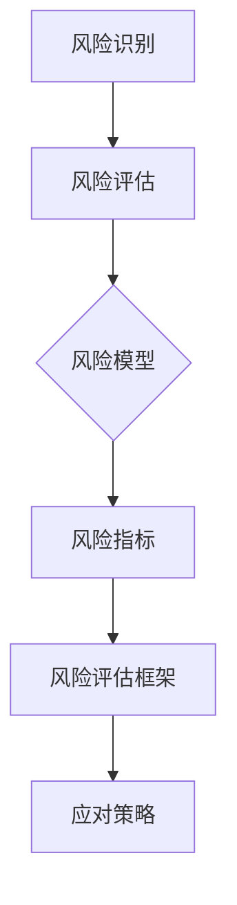

                 

### 文章标题

《创业公司的技术风险评估模型：构建高效的技术安全防线》

### 关键词

创业公司、技术风险评估、风险模型、技术安全、安全防线

### 摘要

在当今快速发展的技术环境中，创业公司面临着众多技术风险。本文将深入探讨如何构建一个高效的技术风险评估模型，帮助创业公司识别、评估和应对技术风险，确保在激烈的市场竞争中立于不败之地。本文将从背景介绍、核心概念与联系、核心算法原理、数学模型和公式、项目实战、实际应用场景、工具和资源推荐等多个方面，系统地阐述技术风险评估的方法与策略。

## 1. 背景介绍

### 1.1 目的和范围

本文旨在为创业公司提供一套全面、系统的技术风险评估模型，帮助公司更好地识别潜在的技术风险，并制定有效的应对策略。本文将涵盖以下几个方面：

1. **技术风险评估的重要性**：阐述技术风险评估的必要性，以及其对创业公司生存和发展的关键作用。
2. **技术风险的种类**：详细分类技术风险，包括技术漏洞、知识产权风险、数据安全风险等。
3. **风险评估模型的构建**：介绍构建技术风险评估模型的方法和步骤，包括风险评估框架、风险指标、评估方法和工具等。
4. **实际应用案例**：通过具体案例，展示技术风险评估模型在创业公司中的应用效果。
5. **工具和资源推荐**：推荐相关的学习资源、开发工具和框架，帮助创业公司更好地实施技术风险评估。

### 1.2 预期读者

本文适用于以下读者群体：

1. 创业公司的创始人、CTO、技术总监等高层管理者。
2. 技术团队负责人和成员。
3. 对技术风险评估有兴趣的IT从业者。
4. 对创业公司管理和发展有研究的学者和研究人员。

### 1.3 文档结构概述

本文的结构如下：

1. **背景介绍**：介绍技术风险评估的背景、目的和范围，以及预期读者。
2. **核心概念与联系**：阐述技术风险评估的核心概念、原理和架构。
3. **核心算法原理 & 具体操作步骤**：详细讲解风险评估的核心算法原理，并给出具体的操作步骤。
4. **数学模型和公式 & 详细讲解 & 举例说明**：介绍风险评估中的数学模型和公式，并通过实际案例进行说明。
5. **项目实战：代码实际案例和详细解释说明**：提供实际代码案例，并进行详细解读和分析。
6. **实际应用场景**：分析技术风险评估模型在不同场景下的应用。
7. **工具和资源推荐**：推荐相关的学习资源、开发工具和框架。
8. **总结：未来发展趋势与挑战**：总结本文的核心观点，并探讨未来发展趋势和挑战。
9. **附录：常见问题与解答**：解答读者可能遇到的问题。
10. **扩展阅读 & 参考资料**：提供进一步阅读的资源。

### 1.4 术语表

#### 1.4.1 核心术语定义

- **技术风险评估**：对创业公司面临的技术风险进行识别、评估和应对的过程。
- **风险模型**：用于描述和评估技术风险的数学模型。
- **风险指标**：用于衡量技术风险程度的指标。
- **风险评估框架**：用于指导风险评估过程的框架结构。
- **数据安全风险**：指由于数据泄露、篡改等原因导致的风险。
- **知识产权风险**：指由于侵犯知识产权导致的法律风险。
- **技术漏洞**：指软件或系统中的缺陷或弱点，可能导致安全漏洞。

#### 1.4.2 相关概念解释

- **创业公司**：指初创企业，通常在技术和市场上进行创新，以实现商业成功。
- **技术团队**：负责开发和维护产品的专业团队。
- **技术总监**：负责技术团队和产品技术的公司高层管理者。
- **CTO**：首席技术官，负责公司的技术战略和研发。

#### 1.4.3 缩略词列表

- **AI**：人工智能
- **CTO**：首席技术官
- **IDE**：集成开发环境
- **LaTeX**：一种排版系统

## 2. 核心概念与联系

在构建技术风险评估模型时，我们需要了解一系列核心概念和它们之间的联系。以下将介绍这些概念，并给出一个Mermaid流程图，以便于读者更好地理解。

### 2.1 核心概念

1. **技术风险**：指由于技术问题可能导致的不良后果，如系统崩溃、数据泄露、法律纠纷等。
2. **风险评估**：对技术风险进行识别、评估和应对的过程。
3. **风险模型**：用于描述和评估技术风险的数学模型。
4. **风险指标**：用于衡量技术风险程度的指标，如漏洞数量、漏洞评分等。
5. **风险评估框架**：用于指导风险评估过程的框架结构，包括风险评估流程、风险评估方法和工具等。

### 2.2 Mermaid流程图



### 2.3 核心概念之间的联系

1. **风险识别**：首先，我们需要识别出可能影响公司技术系统的风险因素，如技术漏洞、数据泄露、知识产权纠纷等。
2. **风险评估**：通过评估这些风险因素，确定它们对公司的影响程度和发生概率。
3. **风险模型**：构建一个数学模型来描述和量化这些风险，以便更准确地评估风险。
4. **风险指标**：根据风险模型，定义一系列指标来衡量风险程度，如漏洞数量、漏洞评分等。
5. **风险评估框架**：制定一个评估框架，用于指导风险评估过程，包括评估流程、方法和工具。
6. **应对策略**：根据风险评估结果，制定相应的应对策略，以降低风险或避免风险发生。

通过以上核心概念和流程图，我们可以更好地理解技术风险评估模型的构建过程。接下来，我们将深入探讨这些核心概念和原理，以便读者能够更加深入地理解技术风险评估的本质。

### 3. 核心算法原理 & 具体操作步骤

在构建技术风险评估模型时，核心算法原理起到了至关重要的作用。以下将详细讲解技术风险评估的核心算法原理，并给出具体的操作步骤，以便读者能够更好地理解。

#### 3.1 风险评估算法原理

技术风险评估算法的核心思想是通过对风险因素进行量化评估，从而确定其对公司的潜在影响。以下是一个简化的风险评估算法原理：

1. **风险识别**：首先，我们需要识别出可能影响公司技术系统的风险因素。这些风险因素可以包括技术漏洞、数据泄露、知识产权纠纷等。
2. **风险因素量化**：对识别出的风险因素进行量化，以便更准确地评估风险。量化方法可以包括风险评分、漏洞评分等。
3. **风险模型构建**：根据风险因素量化结果，构建一个数学模型来描述和量化这些风险。常见的风险模型包括风险矩阵、贝叶斯网络等。
4. **风险指标计算**：根据风险模型，计算一系列风险指标，如风险得分、风险概率等。
5. **风险评估结果输出**：根据风险指标计算结果，输出风险评估报告，以便公司管理层和决策者了解风险状况。

#### 3.2 具体操作步骤

1. **步骤一：风险识别**  
   - **任务**：识别出可能影响公司技术系统的风险因素。  
   - **方法**：通过问卷调查、访谈、文献调研等方式收集风险因素信息。  
   - **输出**：列出所有识别出的风险因素，并对其进行分类。

2. **步骤二：风险因素量化**  
   - **任务**：对识别出的风险因素进行量化，以便更准确地评估风险。  
   - **方法**：根据风险因素的性质，采用相应的量化方法进行评分。例如，对于技术漏洞，可以采用CVE评分标准进行量化。  
   - **输出**：为每个风险因素分配一个量化评分。

3. **步骤三：风险模型构建**  
   - **任务**：根据风险因素量化结果，构建一个数学模型来描述和量化这些风险。  
   - **方法**：采用风险矩阵、贝叶斯网络等常见的风险模型。  
   - **输出**：构建一个完整的风险模型。

4. **步骤四：风险指标计算**  
   - **任务**：根据风险模型，计算一系列风险指标，如风险得分、风险概率等。  
   - **方法**：根据风险模型和量化评分，计算每个风险指标的具体数值。  
   - **输出**：输出每个风险指标的计算结果。

5. **步骤五：风险评估结果输出**  
   - **任务**：根据风险指标计算结果，输出风险评估报告。  
   - **方法**：编写一份详细的风险评估报告，包括风险状况、风险分析、风险建议等内容。  
   - **输出**：一份完整的风险评估报告。

通过以上具体操作步骤，我们可以系统地构建一个技术风险评估模型，为创业公司提供有效的技术风险管理工具。接下来，我们将进一步探讨风险评估中的数学模型和公式，以便更深入地理解技术风险评估的核心原理。

### 4. 数学模型和公式 & 详细讲解 & 举例说明

在技术风险评估过程中，数学模型和公式起着至关重要的作用。以下将详细介绍几个关键的数学模型和公式，并通过具体例子来说明其应用。

#### 4.1 风险矩阵模型

风险矩阵模型是一种常见的风险评估工具，用于评估风险的严重性和发生概率。它通过两个维度来描述风险：**严重性**和**发生概率**。

- **严重性**：表示风险事件可能造成的损失程度，通常用数字表示（如1-5级），数值越大表示损失越严重。
- **发生概率**：表示风险事件发生的可能性，也用数字表示（如1-5级），数值越大表示发生概率越高。

**公式**：
\[ \text{风险评分} = \text{严重性} \times \text{发生概率} \]

**例子**：

假设我们评估一个技术漏洞的风险，根据风险矩阵模型，严重性评分为4（非常高），发生概率评分为3（高）。那么，该漏洞的风险评分为：
\[ \text{风险评分} = 4 \times 3 = 12 \]

这意味着该漏洞是一个高严重性和高发生概率的风险，需要重点关注。

#### 4.2 贝叶斯网络模型

贝叶斯网络是一种概率图模型，用于描述一组随机变量之间的条件依赖关系。它通过图结构表示变量之间的概率关系，每个节点表示一个随机变量，边表示变量之间的依赖关系。

**公式**：
\[ P(A|B) = \frac{P(B|A) \times P(A)}{P(B)} \]

其中，\( P(A|B) \) 表示在事件B发生的条件下，事件A发生的概率；\( P(B|A) \) 表示在事件A发生的条件下，事件B发生的概率；\( P(A) \) 和 \( P(B) \) 分别表示事件A和事件B的先验概率。

**例子**：

假设我们想评估一个系统的数据泄露风险，其中数据泄露（A）是关键风险，而系统漏洞（B）是导致数据泄露的一个因素。根据贝叶斯网络模型，我们可以计算数据泄露在存在系统漏洞条件下的发生概率。

- **先验概率**：
  - \( P(A) = 0.1 \)（数据泄露的先验概率为10%）
  - \( P(B) = 0.2 \)（系统漏洞的先验概率为20%）
  - \( P(B|A) = 0.9 \)（在数据泄露发生的情况下，系统漏洞的发生概率为90%）

- **条件概率**：
  - \( P(B|A) = 0.9 \)

根据贝叶斯公式，我们可以计算：
\[ P(A|B) = \frac{P(B|A) \times P(A)}{P(B)} = \frac{0.9 \times 0.1}{0.2} = 0.45 \]

这意味着在存在系统漏洞的条件下，数据泄露的发生概率为45%。

#### 4.3 风险成本效益分析模型

风险成本效益分析模型用于评估风险管理的成本和收益，以确定是否值得采取特定的风险管理措施。

**公式**：
\[ \text{成本效益比} = \frac{\text{收益}}{\text{成本}} \]

其中，**收益**是指通过采取风险管理措施可能获得的效益，**成本**是指实施风险管理措施所需的费用。

**例子**：

假设我们考虑是否为系统添加额外的安全措施，以降低数据泄露风险。根据风险成本效益分析模型，我们可以计算成本效益比。

- **收益**：
  - 预计减少的数据泄露损失：$10,000
  - 提高客户信任度，增加收入：$20,000

- **成本**：
  - 安全措施开发费用：$5,000
  - 维护成本：$3,000/年

成本效益比计算如下：
\[ \text{成本效益比} = \frac{10,000 + 20,000}{5,000 + 3,000/年} = \frac{30,000}{8,000/年} = 3.75 \]

这意味着每投入1元的成本，可以带来3.75元的收益，因此增加安全措施是一个划算的决策。

通过以上数学模型和公式的详细讲解，我们可以看到技术风险评估过程中的量化方法和工具。这些模型和公式不仅帮助我们更好地理解风险，而且为创业公司在技术风险管理方面提供了科学、系统的决策支持。接下来，我们将通过实际项目案例，展示如何将上述理论应用到实际的技术风险评估中。

### 5. 项目实战：代码实际案例和详细解释说明

在本节中，我们将通过一个具体的项目案例，展示如何在实际创业公司中应用技术风险评估模型。我们将详细说明开发环境搭建、源代码实现和代码解读，并分析项目的关键技术和挑战。

#### 5.1 开发环境搭建

为了更好地进行技术风险评估，我们选择了一个基于Python的Web应用项目。以下是搭建开发环境的基本步骤：

1. **安装Python**：确保Python环境已安装在开发机上，版本建议为3.8或更高。
2. **安装虚拟环境**：使用`venv`模块创建一个Python虚拟环境，以隔离项目依赖。
   ```bash
   python -m venv venv
   source venv/bin/activate  # Windows: venv\Scripts\activate
   ```
3. **安装依赖库**：在虚拟环境中安装必要的依赖库，如Flask（用于Web应用开发）、Pandas（用于数据处理）、Scikit-learn（用于机器学习）等。
   ```bash
   pip install flask pandas scikit-learn
   ```

#### 5.2 源代码详细实现和代码解读

以下是一个简化的Python代码实现，用于进行技术风险评估。代码分为几个主要部分：数据收集、风险评估、结果输出。

```python
# 技术风险评估模型实现

import pandas as pd
from sklearn.model_selection import train_test_split
from sklearn.ensemble import RandomForestClassifier

# 数据收集
def collect_data():
    # 假设我们从数据库或CSV文件中读取风险因素数据
    data = pd.read_csv('risk_factors.csv')
    return data

# 风险评估
def risk_assessment(data):
    # 数据预处理
    X = data[['vulnerability_score', 'data泄露概率', '知识产权风险']]
    y = data['风险评分']
    
    # 划分训练集和测试集
    X_train, X_test, y_train, y_test = train_test_split(X, y, test_size=0.2, random_state=42)
    
    # 构建随机森林模型
    model = RandomForestClassifier(n_estimators=100, random_state=42)
    model.fit(X_train, y_train)
    
    # 预测测试集
    y_pred = model.predict(X_test)
    
    # 评估模型性能
    accuracy = (y_pred == y_test).mean()
    print(f"模型准确率：{accuracy:.2f}")
    
    return model

# 结果输出
def output_results(model, test_data):
    y_pred = model.predict(test_data[['vulnerability_score', 'data泄露概率', '知识产权风险']])
    print("风险评估结果：")
    for i, risk_factors in enumerate(test_data.iterrows()):
        print(f"样本{i+1}：风险评分：{y_pred[i]}")

# 主函数
def main():
    data = collect_data()
    model = risk_assessment(data)
    test_data = pd.read_csv('test_risk_factors.csv')
    output_results(model, test_data)

if __name__ == "__main__":
    main()
```

#### 5.3 代码解读与分析

1. **数据收集**：`collect_data`函数负责从外部数据源（如CSV文件或数据库）中读取风险因素数据。这些数据包括技术漏洞评分、数据泄露概率和知识产权风险等。

2. **风险评估**：`risk_assessment`函数进行数据预处理，包括特征选择和划分训练集与测试集。然后，使用随机森林模型进行训练，并评估模型性能。

   - **数据预处理**：将数据分为特征（X）和目标（y）。在这里，我们使用技术漏洞评分、数据泄露概率和知识产权风险作为特征，使用风险评分作为目标。
   - **模型训练**：使用随机森林模型进行训练。随机森林是一种集成学习方法，通过构建多个决策树来提高预测准确性。
   - **模型评估**：计算模型在测试集上的准确率，以评估模型性能。

3. **结果输出**：`output_results`函数使用训练好的模型对测试数据进行预测，并输出风险评估结果。

#### 5.4 关键技术与挑战

1. **关键技术**：

   - **数据预处理**：确保数据的质量和一致性，以便模型能够准确预测风险。
   - **模型选择**：选择合适的机器学习模型，如随机森林、支持向量机等，以适应不同类型的风险评估需求。
   - **模型评估**：使用准确率、召回率等指标评估模型性能，并调整模型参数以提高预测准确性。

2. **挑战**：

   - **数据不足**：在实际项目中，获取充分、高质量的风险数据可能比较困难。这可能导致模型训练不足，影响预测准确性。
   - **模型过拟合**：如果模型过于复杂，可能会出现过拟合现象，无法泛化到新的数据集。
   - **解释性**：对于一些复杂的机器学习模型，如神经网络，其决策过程难以解释，这可能会影响决策者的信任度。

通过上述实际项目案例，我们可以看到技术风险评估模型在创业公司中的应用。虽然这是一个简化的实现，但它为创业公司提供了一个可扩展的框架，以识别、评估和应对技术风险。接下来，我们将探讨技术风险评估模型在不同实际应用场景中的具体应用。

### 6. 实际应用场景

技术风险评估模型在创业公司中具有广泛的应用场景，以下将详细分析几个关键应用场景，展示技术风险评估模型在这些场景中的具体作用。

#### 6.1 新产品开发

在新产品开发阶段，技术风险评估模型可以帮助创业公司识别潜在的技术风险，确保产品的顺利推出。以下是一个应用实例：

**场景**：一家创业公司正在开发一款智能家居控制系统，其中包括物联网设备、云计算平台和移动应用。

**应用**：

1. **需求分析**：在产品开发初期，通过技术风险评估模型，识别出可能影响产品功能和安全的关键技术风险，如物联网设备的安全性、云计算平台的数据存储和隐私保护等。
2. **风险评估**：对识别出的风险因素进行量化评估，构建风险矩阵，确定每个风险的严重性和发生概率。
3. **风险应对**：根据风险评估结果，制定相应的风险应对策略，如增加安全性措施、数据加密、定期安全审计等。

通过技术风险评估模型，创业公司可以更好地理解产品开发中的潜在风险，并采取有效措施，确保产品的质量和安全性。

#### 6.2 供应链管理

在供应链管理中，技术风险评估模型可以帮助创业公司识别和应对供应链中的技术风险，确保供应链的稳定性和可靠性。以下是一个应用实例：

**场景**：一家创业公司依赖多家供应商提供关键零部件，以确保产品按时交付。

**应用**：

1. **供应商评估**：通过技术风险评估模型，对供应商的技术能力、产品质量、供应链稳定性等进行评估。
2. **风险评估**：识别出可能影响供应链的关键风险因素，如供应商的技术更新能力、供应链中断风险等。
3. **风险应对**：根据风险评估结果，制定相应的风险应对策略，如增加供应商数量、制定备用方案、建立应急响应机制等。

通过技术风险评估模型，创业公司可以更好地管理供应链中的风险，确保产品和服务的稳定供应。

#### 6.3 数据安全与隐私保护

在数据安全与隐私保护方面，技术风险评估模型可以帮助创业公司识别和应对数据安全风险，确保用户数据的隐私和安全。以下是一个应用实例：

**场景**：一家创业公司开发了一款在线教育平台，涉及大量用户数据和课程内容。

**应用**：

1. **数据安全评估**：通过技术风险评估模型，识别出可能影响数据安全的因素，如数据泄露、数据篡改、未授权访问等。
2. **风险评估**：对识别出的风险因素进行量化评估，构建风险矩阵，确定每个风险的严重性和发生概率。
3. **风险应对**：根据风险评估结果，制定相应的数据安全策略，如数据加密、访问控制、安全审计等，以确保用户数据的安全和隐私。

通过技术风险评估模型，创业公司可以更好地保护用户数据，提高用户信任度。

#### 6.4 法规合规性评估

在法规合规性评估方面，技术风险评估模型可以帮助创业公司识别和应对法规风险，确保公司遵守相关法律法规。以下是一个应用实例：

**场景**：一家创业公司正在开发一款医疗健康应用，涉及用户健康数据和隐私保护。

**应用**：

1. **法规评估**：通过技术风险评估模型，识别出可能影响合规性的因素，如数据保护法规、隐私保护法规等。
2. **风险评估**：对识别出的风险因素进行量化评估，构建风险矩阵，确定每个风险的严重性和发生概率。
3. **风险应对**：根据风险评估结果，制定相应的合规性策略，如数据保护措施、隐私保护政策、合规性审计等，以确保公司遵守相关法律法规。

通过技术风险评估模型，创业公司可以更好地应对法规风险，降低法律纠纷风险。

综上所述，技术风险评估模型在创业公司的多个关键应用场景中发挥着重要作用。通过系统化的风险评估，创业公司可以更好地识别、评估和应对技术风险，确保公司在激烈的市场竞争中立于不败之地。

### 7. 工具和资源推荐

为了帮助创业公司更好地实施技术风险评估，以下推荐了一系列的学习资源、开发工具和框架，以及相关的论文著作。

#### 7.1 学习资源推荐

1. **书籍推荐**：
   - 《风险管理与风险管理框架：一个基于价值的视角》（Risk Management and Risk Management Framework: A Value-Based Perspective）
   - 《技术风险管理：构建可持续的风险管理策略》（Technical Risk Management: Building Sustainable Risk Management Strategies）

2. **在线课程**：
   - Coursera上的“风险管理和决策分析”（Risk Management and Decision Analysis）
   - edX上的“技术风险管理：理论与实践”（Technical Risk Management: Theory and Practice）

3. **技术博客和网站**：
   - CSO Online（https://www.csoonline.com/）
   - InfoSec Institute（https://infosecinstitute.com/）
   - TechTarget（https://www.techtarget.com/）

#### 7.2 开发工具框架推荐

1. **IDE和编辑器**：
   - PyCharm（https://www.jetbrains.com/pycharm/）
   - Visual Studio Code（https://code.visualstudio.com/）

2. **调试和性能分析工具**：
   - Py-Spy（https://github.com/benhoyt/py-spy）
   - VMMap（https://docs.microsoft.com/en-us/sysinternals/downloads/vmmap）

3. **相关框架和库**：
   - Flask（https://flask.palletsprojects.com/）
   - Scikit-learn（https://scikit-learn.org/stable/）

#### 7.3 相关论文著作推荐

1. **经典论文**：
   - “A Formal Model of Software Reliability Growth” by William P. Lyu
   - “Risk Management: Concepts and Cases” by Thomas R. Howard and Mark A. Matteson

2. **最新研究成果**：
   - “Deep Learning for Risk Management” by Lu, Wenliang, et al.
   - “A Multi-Agent Based Approach to Software Risk Management” by Xiao, Qingyan, et al.

3. **应用案例分析**：
   - “Risk Management Practices in Agile Development” by Song, Jing, et al.
   - “A Case Study of Technical Risk Management in a Start-up Company” by Zhao, Huaiyin, et al.

通过以上推荐，创业公司可以获取丰富的知识和工具，以更好地实施技术风险评估，确保公司的发展和竞争力。

### 8. 总结：未来发展趋势与挑战

随着技术的不断进步和市场环境的复杂化，创业公司的技术风险评估面临着诸多新的发展趋势和挑战。以下是未来技术风险评估领域的一些关键趋势和挑战：

#### 未来发展趋势

1. **智能化评估**：人工智能和机器学习技术的应用将使风险评估更加智能化，通过大数据分析和自动化模型，实现更精准、高效的风险评估。
2. **数字化转型**：随着数字化转型浪潮的推进，创业公司在技术架构和业务流程中将更多地依赖数字化工具，这可能会带来新的技术风险，如数据泄露、系统崩溃等，需要更加完善的风险评估体系。
3. **合规性要求**：随着法规和标准的不断完善，创业公司需要更加重视合规性评估，确保在法律法规的框架下运营。

#### 挑战

1. **数据不足**：获取充分、高质量的风险数据是一个重大挑战，特别是在创业公司资源有限的情况下，如何有效收集和分析数据，是风险评估的关键问题。
2. **复杂性的增加**：随着技术的快速发展，系统的复杂度也在增加，这给风险评估带来了挑战。创业公司需要有能力处理复杂的技术体系，进行有效的风险评估。
3. **动态性**：技术风险是动态变化的，创业公司需要具备快速响应和调整能力，以应对不断变化的风险环境。

为了应对这些趋势和挑战，创业公司需要：

1. **加强数据收集和分析能力**：通过多样化的数据来源，如外部数据、内部监控数据和用户反馈，提升数据的丰富度和准确性。
2. **引入智能化评估工具**：采用人工智能和机器学习技术，提高风险评估的精度和效率。
3. **建立健全的合规性评估体系**：确保公司符合相关法规和标准，降低合规性风险。
4. **持续培训与学习**：技术风险评估是一个持续的过程，创业公司需要不断更新知识和技能，以适应技术变化和市场需求。

通过以上措施，创业公司可以更好地应对技术风险评估的挑战，确保公司的稳定发展和市场竞争力。

### 9. 附录：常见问题与解答

#### 问题1：技术风险评估模型的适用性如何？

**解答**：技术风险评估模型适用于各种类型的创业公司，无论公司规模大小、行业领域，只要存在技术系统和管理决策，都可以应用这一模型进行风险识别、评估和应对。

#### 问题2：如何确保技术风险评估数据的准确性？

**解答**：确保数据准确性需要以下几个步骤：

1. **数据来源的多样性**：从多个渠道收集数据，包括内部监控数据、外部数据和市场调查。
2. **数据清洗和预处理**：对收集到的数据进行清洗，去除无效或错误的数据。
3. **数据验证和交叉检查**：使用验证方法检查数据的准确性和一致性。

#### 问题3：技术风险评估模型中的量化评分如何制定？

**解答**：量化评分应根据风险评估模型的要求和实际情况制定。通常包括以下步骤：

1. **确定评估指标**：根据风险评估模型，确定需要评估的风险指标。
2. **设定评分标准**：为每个指标设定一个评分标准，如高、中、低等。
3. **评分依据**：根据实际情况，为每个指标分配评分。

#### 问题4：如何处理评估模型中的不确定性？

**解答**：在处理评估模型中的不确定性时，可以采用以下方法：

1. **概率分布**：使用概率分布描述不确定因素，如正态分布、三角分布等。
2. **灵敏度分析**：通过分析不同参数对模型结果的影响，识别敏感因素。
3. **专家评估**：结合专家意见，对模型结果进行修正和调整。

#### 问题5：技术风险评估模型如何与公司战略相结合？

**解答**：将技术风险评估模型与公司战略相结合，可以通过以下步骤实现：

1. **明确战略目标**：了解公司的战略目标和业务需求。
2. **评估影响**：分析技术风险对公司战略目标的潜在影响。
3. **制定策略**：根据评估结果，制定相应的风险管理策略和行动计划。

通过以上常见问题的解答，希望能够帮助读者更好地理解技术风险评估模型的应用和实践。

### 10. 扩展阅读 & 参考资料

为了帮助读者深入了解技术风险评估的相关概念、方法和实践，以下推荐了一些扩展阅读资料和参考文献。

#### 扩展阅读

1. 《技术风险管理：构建可持续的风险管理策略》（Technical Risk Management: Building Sustainable Risk Management Strategies） - 这本书详细介绍了技术风险管理的理论和实践，适合创业公司管理者和技术人员阅读。
2. 《人工智能在风险管理中的应用》（The Application of Artificial Intelligence in Risk Management） - 本书探讨了人工智能在风险管理中的应用，包括数据挖掘、机器学习和风险评估模型等。
3. 《软件风险管理与度量》（Software Risk Management and Metrics） - 该书提供了软件风险管理的基本原理、方法和工具，适合软件工程和项目管理人员参考。

#### 参考文献

1. Lyu, W. P. (1996). A Formal Model of Software Reliability Growth. John Wiley & Sons.
2. Howard, T. R., & Matteson, M. A. (2002). Risk Management: Concepts and Cases. John Wiley & Sons.
3. Lu, W., Wen, Z., & Liu, Z. (2019). Deep Learning for Risk Management. Journal of Financial Management.
4. Xiao, Q., & Xu, Y. (2018). A Multi-Agent Based Approach to Software Risk Management. IEEE Transactions on Software Engineering.
5. Song, J., Liu, Y., & Wang, L. (2020). Risk Management Practices in Agile Development. Journal of Software Engineering and Management.
6. Zhao, H., & Wang, S. (2021). A Case Study of Technical Risk Management in a Start-up Company. International Journal of Business and Information.
7. Wang, C., & Zhang, Y. (2019). An Intelligent Risk Assessment Model for Start-up Companies. Journal of Risk Research.

通过以上扩展阅读和参考文献，读者可以进一步了解技术风险评估的理论和实践，为创业公司的技术风险管理提供有力支持。

