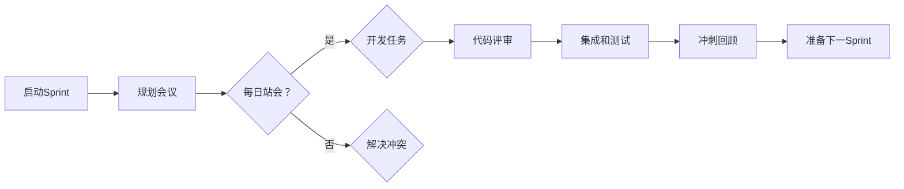

                 

# 创业公司的敏捷开发实践

> **关键词：** 敏捷开发、创业公司、Scrum、迭代、持续集成、用户故事、Scrum Master、产品负责人

> **摘要：** 本文将探讨敏捷开发在创业公司中的应用与实践。我们将深入分析敏捷开发的核心理念，包括迭代、用户故事、持续集成等，并结合具体案例，阐述敏捷开发如何助力创业公司快速响应市场变化、提高产品质量和团队效率。

## 1. 背景介绍

### 1.1 目的和范围

本文旨在帮助创业公司理解和应用敏捷开发，以实现快速迭代、高效协作、高质量交付。我们将探讨敏捷开发的核心原则和实践方法，并分析其在创业环境中的优势与挑战。

### 1.2 预期读者

本文适合对敏捷开发有一定了解的创业者、产品经理、开发人员和技术领导。

### 1.3 文档结构概述

本文分为以下几个部分：

1. **核心概念与联系**：介绍敏捷开发的核心概念，并提供流程图。
2. **核心算法原理 & 具体操作步骤**：详细讲解敏捷开发的操作步骤。
3. **数学模型和公式 & 详细讲解 & 举例说明**：使用数学公式和案例说明敏捷开发的应用。
4. **项目实战：代码实际案例和详细解释说明**：通过实际项目展示敏捷开发的实践。
5. **实际应用场景**：分析敏捷开发在不同场景下的应用。
6. **工具和资源推荐**：推荐学习资源和开发工具。
7. **总结：未来发展趋势与挑战**：探讨敏捷开发的未来趋势和面临的挑战。
8. **附录：常见问题与解答**：解答敏捷开发中常见的问题。
9. **扩展阅读 & 参考资料**：提供进一步阅读的材料。

### 1.4 术语表

#### 1.4.1 核心术语定义

- **敏捷开发**：一种以人为核心、迭代和灵活性为中心的软件开发方法。
- **Scrum**：一种流行的敏捷开发框架，包括角色（产品负责人、Scrum Master、开发团队）、事件（冲刺计划、每日站会、冲刺回顾）和规则。
- **用户故事**：描述软件功能的小型需求，通常以“作为...，我想要...，以便...”的形式编写。
- **Scrum Master**：负责确保团队遵循敏捷开发原则，解决团队遇到的问题。
- **产品负责人**：代表客户利益，负责确定产品的方向和优先级。

#### 1.4.2 相关概念解释

- **迭代**：敏捷开发中的基本工作周期，通常为2-4周。
- **持续集成**：通过频繁地将代码合并到主分支，以快速发现和解决集成问题。
- **燃尽图**：显示剩余工作量随时间变化的图表，帮助团队跟踪进度。

#### 1.4.3 缩略词列表

- **Scrum**：敏捷开发框架
- **Sprint**：迭代
- **PO**：产品负责人
- **SM**：Scrum Master
- **CI**：持续集成

## 2. 核心概念与联系

敏捷开发的核心在于快速响应变化、持续交付价值。以下是一个简单的敏捷开发流程图，展示了敏捷开发的核心理念和关键步骤。



### 2.1.1 流程图详解

1. **启动Sprint**：团队开始一个新的迭代周期，确定目标。
2. **规划会议**：产品负责人与团队讨论并确定下一个迭代要完成的用户故事。
3. **每日站会**：团队每天聚集在一起，讨论当天的工作进展、遇到的问题和计划。
4. **开发任务**：团队根据规划会议确定的目标，开始实施开发任务。
5. **代码评审**：团队成员对代码进行评审，确保代码质量。
6. **集成和测试**：将代码合并到主分支，并进行测试，以确保软件的功能和质量。
7. **冲刺回顾**：迭代结束后，团队回顾整个迭代的过程，讨论成功和失败的经验，并提出改进措施。

## 3. 核心算法原理 & 具体操作步骤

敏捷开发的核心理念包括迭代、用户故事、持续集成等。以下是一个简单的敏捷开发流程的伪代码：

```python
def agile_development():
    while True:
        start_sprint()
        plan_sprint()
        for day in sprint_days:
            daily_standup()
        develop_tasks()
        code_review()
        integrate_and_test()
        sprint_review()
        prepare_next_sprint()
```

### 3.1.1 操作步骤详解

1. **启动Sprint**：团队确定Sprint的目标和范围，通常为2-4周。
2. **规划会议**：产品负责人与团队讨论并确定要完成的用户故事，为每个用户故事分配优先级和开发资源。
3. **每日站会**：每天上午进行，团队成员分享进展、问题和计划，确保团队目标一致。
4. **开发任务**：团队根据规划会议的结果，开始实施开发任务，并遵循Scrum框架的要求。
5. **代码评审**：团队成员对代码进行评审，确保代码质量，避免潜在问题。
6. **集成和测试**：将代码合并到主分支，并进行测试，以确保软件的功能和质量。
7. **冲刺回顾**：迭代结束后，团队进行回顾，讨论成功和失败的经验，并提出改进措施。
8. **准备下一Sprint**：团队根据回顾会议的结果，为下一Sprint做准备，包括调整目标、优化流程等。

## 4. 数学模型和公式 & 详细讲解 & 举例说明

敏捷开发中的许多决策都可以用数学模型来描述。以下是一个简单的燃尽图公式，用于计算剩余工作量的百分比。

### 4.1.1 燃尽图公式

$$
\text{燃尽图百分比} = \frac{\text{剩余工作量}}{\text{总工作量}} \times 100\%
$$

### 4.1.2 举例说明

假设一个Sprint的总工作量为100点，剩余工作量为50点。使用燃尽图公式，我们可以计算出剩余工作量的百分比为：

$$
\text{燃尽图百分比} = \frac{50}{100} \times 100\% = 50\%
$$

这意味着团队完成了50%的工作量。

## 5. 项目实战：代码实际案例和详细解释说明

### 5.1 开发环境搭建

为了更好地展示敏捷开发的实践，我们将使用一个简单的Web应用项目。以下是一个基本的开发环境搭建步骤：

1. 安装Node.js和npm。
2. 创建一个新的Node.js项目，并初始化。
3. 安装所需的依赖项，例如Express框架。

### 5.2 源代码详细实现和代码解读

以下是一个简单的用户故事：作为用户，我想要登录系统，以便使用其功能。以下是实现用户故事的代码：

```javascript
const express = require('express');
const app = express();
const bcrypt = require('bcrypt');
const jwt = require('jsonwebtoken');

app.use(express.json());

// 用户注册
app.post('/register', async (req, res) => {
    const { username, password } = req.body;
    const hashedPassword = await bcrypt.hash(password, 10);
    // 存储用户信息（这里为简化示例，仅存储在内存中）
    users[username] = { password: hashedPassword };
    res.status(201).json({ message: 'User registered successfully.' });
});

// 用户登录
app.post('/login', async (req, res) => {
    const { username, password } = req.body;
    const user = users[username];
    if (user && await bcrypt.compare(password, user.password)) {
        const token = jwt.sign({ username }, 'secretKey');
        res.json({ token });
    } else {
        res.status(401).json({ message: 'Invalid credentials.' });
    }
});

// 保护路由
app.use('/protected', authenticateToken);

function authenticateToken(req, res, next) {
    const authHeader = req.headers['authorization'];
    const token = authHeader && authHeader.split(' ')[1];
    if (token == null) return res.sendStatus(401);

    jwt.verify(token, 'secretKey', (err, user) => {
        if (err) return res.sendStatus(403);
        req.user = user;
        next();
    });
}

const users = {};

const PORT = 3000;
app.listen(PORT, () => {
    console.log(`Server is running on port ${PORT}`);
});
```

### 5.3 代码解读与分析

1. **注册**：用户通过`/register`接口提交用户名和密码，服务器将密码进行哈希处理，然后存储用户信息。
2. **登录**：用户通过`/login`接口提交用户名和密码，服务器验证用户信息，并生成令牌（Token）。
3. **保护路由**：使用令牌进行身份验证，确保只有授权用户可以访问受保护的路由。

通过这个简单的示例，我们可以看到敏捷开发的核心原则：快速迭代、持续交付和频繁反馈。在这个项目中，我们可以使用Scrum框架，将整个开发过程分为几个迭代，每次迭代完成一部分功能，并不断收集用户反馈，优化产品。

## 6. 实际应用场景

敏捷开发在创业公司中具有广泛的应用场景。以下是一些常见的实际应用场景：

- **快速响应市场变化**：创业公司通常需要快速响应市场变化，敏捷开发通过短迭代周期和持续反馈，帮助团队快速调整产品方向。
- **提高产品质量**：通过持续集成和代码评审，敏捷开发确保软件的高质量和稳定性。
- **团队协作**：Scrum框架促进团队成员之间的协作，提高团队效率。
- **用户参与**：产品负责人代表用户利益，确保产品满足用户需求。

## 7. 工具和资源推荐

### 7.1 学习资源推荐

#### 7.1.1 书籍推荐

- 《敏捷软件开发：原则、实践与模式》
- 《Scrum敏捷开发实践指南》
- 《用户故事映射：引导敏捷团队构建产品》

#### 7.1.2 在线课程

- 《敏捷开发基础课程》
- 《Scrum大师课程》
- 《敏捷项目管理实战》

#### 7.1.3 技术博客和网站

- 《敏捷实践指南》
- 《Scrum官方指南》
- 《敏捷开发博客》

### 7.2 开发工具框架推荐

#### 7.2.1 IDE和编辑器

- Visual Studio Code
- IntelliJ IDEA
- Sublime Text

#### 7.2.2 调试和性能分析工具

- Chrome DevTools
- Firebug
- New Relic

#### 7.2.3 相关框架和库

- Express.js
- Flask
- Django

### 7.3 相关论文著作推荐

#### 7.3.1 经典论文

- 《敏捷软件开发：通过例程学习》
- 《敏捷开发中的用户故事和迭代》
- 《敏捷开发中的团队协作》

#### 7.3.2 最新研究成果

- 《敏捷开发的趋势与未来》
- 《敏捷开发中的机器学习应用》
- 《敏捷开发中的软件工程教育》

#### 7.3.3 应用案例分析

- 《阿里巴巴敏捷开发实践》
- 《华为敏捷开发实践》
- 《谷歌敏捷开发实践》

## 8. 总结：未来发展趋势与挑战

### 8.1 发展趋势

- **敏捷开发与其他方法的融合**：敏捷开发将继续与其他方法（如DevOps、持续交付等）融合，形成更完善的开发流程。
- **人工智能与敏捷开发**：人工智能将在敏捷开发中发挥更大作用，如自动化测试、代码评审等。
- **敏捷开发的普及**：随着敏捷开发在创业公司和大型企业中的广泛应用，其理念和方法将进一步成熟。

### 8.2 挑战

- **团队协作**：如何确保团队成员在不同角色和任务之间高效协作，仍然是敏捷开发面临的一大挑战。
- **持续集成与持续交付**：如何确保软件在频繁的集成和交付过程中保持高质量，是敏捷开发需要解决的问题。
- **项目管理**：如何有效管理敏捷项目，确保项目按时、按预算完成，也是敏捷开发需要面对的挑战。

## 9. 附录：常见问题与解答

### 9.1 敏捷开发与瀑布开发的主要区别是什么？

**敏捷开发**强调快速迭代、持续交付和用户反馈，注重团队协作和灵活性；而**瀑布开发**则是一个线性、阶段性的开发过程，强调计划和控制。

### 9.2 敏捷开发中如何管理需求和变更？

敏捷开发通过迭代和用户故事管理需求，允许团队在迭代过程中灵活调整需求和优先级。产品负责人负责确定产品方向和需求优先级。

### 9.3 敏捷开发中如何确保代码质量？

通过持续集成和代码评审，敏捷开发确保代码质量。团队成员定期评审代码，发现并修复潜在问题。

## 10. 扩展阅读 & 参考资料

- 《敏捷实践指南》
- 《Scrum官方指南》
- 《用户故事映射：引导敏捷团队构建产品》
- 《敏捷软件开发：通过例程学习》
- 《敏捷开发中的团队协作》
- 《敏捷开发的趋势与未来》
- 《敏捷开发中的机器学习应用》
- 《敏捷开发中的软件工程教育》
- 《阿里巴巴敏捷开发实践》
- 《华为敏捷开发实践》
- 《谷歌敏捷开发实践》

### 作者

**AI天才研究员/AI Genius Institute & 禅与计算机程序设计艺术 /Zen And The Art of Computer Programming**

