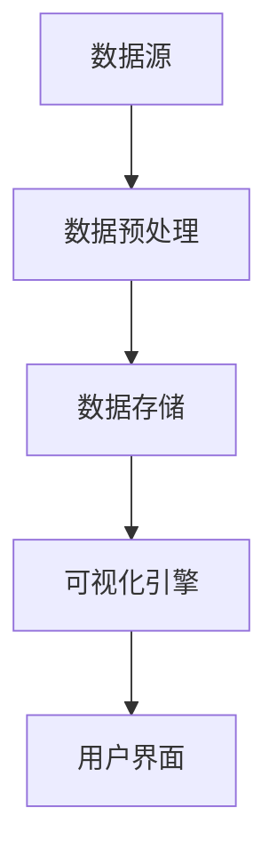
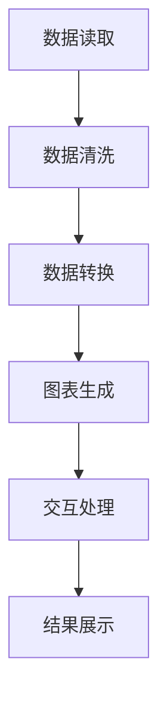

                 

# 创业公司的数据可视化策略

> 关键词：数据可视化、创业公司、策略、信息呈现、数据分析、用户体验

> 摘要：本文将探讨创业公司在数据可视化方面的重要性和策略，从核心概念、算法原理、数学模型、项目实战到实际应用场景，详细解析如何通过数据可视化提升创业公司的竞争力。文章旨在为创业者提供一套系统化的数据可视化解决方案，帮助他们更好地理解数据、挖掘价值，从而实现业务增长。

## 1. 背景介绍

### 1.1 目的和范围

本文旨在为创业公司提供一套关于数据可视化的策略，帮助它们在竞争激烈的市场中脱颖而出。我们将探讨以下主题：

- 数据可视化的核心概念和重要性
- 数据可视化策略的设计原则
- 核心算法原理和数学模型
- 实际项目中的数据可视化实现
- 数据可视化在创业公司中的应用场景
- 开发工具和资源的推荐

通过本文的阅读，创业者将能够：

- 理解数据可视化在商业决策中的价值
- 学习如何构建和优化数据可视化策略
- 掌握数据可视化工具和技术的选择与应用

### 1.2 预期读者

本文面向以下读者群体：

- 创业公司的创始人或CTO
- 数据科学家或数据分析师
- 产品经理或UI/UX设计师
- 对数据可视化有兴趣的IT从业者

### 1.3 文档结构概述

本文结构如下：

- 第1章：背景介绍，概述本文的目的、范围和预期读者。
- 第2章：核心概念与联系，介绍数据可视化的基本概念和架构。
- 第3章：核心算法原理 & 具体操作步骤，讲解数据可视化的算法实现。
- 第4章：数学模型和公式 & 详细讲解 & 举例说明，阐述数据可视化中的数学模型。
- 第5章：项目实战：代码实际案例和详细解释说明，提供实战案例和代码实现。
- 第6章：实际应用场景，分析数据可视化在不同领域的应用。
- 第7章：工具和资源推荐，推荐学习资源、开发工具和框架。
- 第8章：总结：未来发展趋势与挑战，展望数据可视化的发展方向。
- 第9章：附录：常见问题与解答，解答读者可能遇到的问题。
- 第10章：扩展阅读 & 参考资料，提供进一步学习的资源链接。

### 1.4 术语表

#### 1.4.1 核心术语定义

- 数据可视化（Data Visualization）：将数据通过图形、图表等形式进行展示，帮助用户理解和分析数据。
- 可视化（Visualization）：通过视觉元素呈现数据和信息的过程。
- 数据驱动（Data-Driven）：以数据为核心进行决策和业务运营。
- 信息过载（Information Overload）：信息量过多，导致用户难以处理和理解。

#### 1.4.2 相关概念解释

- 数据分析（Data Analysis）：通过统计、机器学习等方法对数据进行处理，提取有价值的信息。
- 业务智能（Business Intelligence）：利用数据分析和可视化技术，支持企业决策和业务优化。
- 用户体验（User Experience，UX）：用户在使用产品或服务过程中所获得的感受和体验。

#### 1.4.3 缩略词列表

- BI：Business Intelligence，业务智能
- DB：Database，数据库
- ETL：Extract, Transform, Load，数据提取、转换和加载
- SQL：Structured Query Language，结构化查询语言
- UX：User Experience，用户体验

## 2. 核心概念与联系

### 2.1 数据可视化的基本概念

数据可视化是指将数据通过图形、图表、图像等方式进行展示，使得数据更加直观、易于理解。它不仅能够提高数据分析的效率，还能够帮助决策者从海量数据中快速捕捉关键信息。

数据可视化的核心概念包括：

- 数据源（Data Source）：提供数据的原始数据源，如数据库、文件等。
- 数据预处理（Data Preprocessing）：对原始数据进行清洗、转换、归一化等处理，使其适合可视化。
- 可视化组件（Visualization Components）：用于展示数据的图表、图形等组件，如柱状图、折线图、饼图等。
- 用户交互（User Interaction）：用户与可视化组件的交互操作，如缩放、过滤、筛选等。

### 2.2 数据可视化架构

数据可视化架构通常包括以下几个关键组件：

1. **数据源**：提供数据输入，可以是数据库、文件、API等。
2. **数据预处理模块**：对原始数据进行清洗、转换等预处理，确保数据质量。
3. **数据存储模块**：存储预处理后的数据，便于后续访问。
4. **可视化引擎**：负责数据到可视化的转换，包括图表的生成和交互操作。
5. **用户界面**：展示可视化结果，提供用户交互操作。

#### Mermaid 流程图



### 2.3 数据可视化在商业决策中的重要性

数据可视化在商业决策中具有重要作用，主要体现在以下几个方面：

1. **提高数据可理解性**：通过图形化展示，使复杂的数据更容易被理解和分析。
2. **发现数据中的隐藏模式**：通过可视化，帮助决策者发现数据中的隐藏模式、趋势和异常。
3. **支持数据驱动决策**：通过数据可视化，决策者可以基于实时数据做出更明智的决策。
4. **优化用户体验**：数据可视化能够提高用户对产品的理解和满意度，从而提升用户体验。

### 2.4 数据可视化策略的设计原则

设计有效的数据可视化策略需要遵循以下原则：

1. **目标明确**：明确可视化目标，确保可视化结果能够满足业务需求。
2. **数据质量**：保证数据的准确性和完整性，为可视化提供可靠的基础。
3. **简洁明了**：避免过度设计，确保可视化结果简洁、直观，易于用户理解。
4. **交互性**：提供适当的交互功能，如过滤、筛选、缩放等，增强用户体验。
5. **可扩展性**：设计具有可扩展性的可视化架构，以适应未来的业务需求。

## 3. 核心算法原理 & 具体操作步骤

### 3.1 数据可视化算法原理

数据可视化算法的核心任务是：

- **数据转换**：将原始数据转换为可视化组件所需的格式。
- **图表生成**：根据数据类型和可视化需求，生成相应的图表。
- **交互处理**：处理用户与可视化组件的交互操作，如缩放、筛选等。

### 3.2 数据可视化算法流程

数据可视化算法的基本流程如下：

1. **数据读取**：从数据源读取原始数据。
2. **数据清洗**：对原始数据进行清洗，确保数据质量。
3. **数据转换**：将清洗后的数据转换为适合可视化的格式。
4. **图表生成**：根据数据类型和可视化需求，生成相应的图表。
5. **交互处理**：处理用户与可视化组件的交互操作。
6. **结果展示**：将生成的可视化图表展示在用户界面上。

#### Mermaid 流程图



### 3.3 具体操作步骤

以下是数据可视化算法的具体操作步骤：

#### 步骤1：数据读取

```python
# 读取数据
data = pd.read_csv('data.csv')
```

#### 步骤2：数据清洗

```python
# 数据清洗
data = data[data['column'].notnull()]
data['column'] = data['column'].astype(float)
```

#### 步骤3：数据转换

```python
# 数据转换
data['date'] = pd.to_datetime(data['date'])
```

#### 步骤4：图表生成

```python
# 图表生成
plt.figure(figsize=(10, 6))
plt.plot(data['date'], data['column'])
plt.xlabel('Date')
plt.ylabel('Column')
plt.title('Data Visualization')
plt.xticks(rotation=45)
plt.show()
```

#### 步骤5：交互处理

```javascript
// 交互处理（以D3.js为例）
var svg = d3.select("svg"),
    margin = {top: 20, right: 20, bottom: 30, left: 40},
    width = +svg.attr("width") - margin.left - margin.right,
    height = +svg.attr("height") - margin.top - margin.bottom;

var x = d3.scaleTime().range([0, width]);
var y = d3.scaleLinear().range([height, 0]);

// ... 其他代码 ...

// 交互操作
svg.append("rect")
    .attr("class", "overlay")
    .attr("width", width)
    .attr("height", height)
    .on("mouseover", mouseover)
    .on("mousemove", mousemove)
    .on("mouseout", mouseout);

function mouseover() {
  // 鼠标悬停时的操作
}

function mousemove() {
  // 鼠标移动时的操作
}

function mouseout() {
  // 鼠标离开时的操作
}
```

#### 步骤6：结果展示

```python
# 结果展示
plt.show()
```

通过以上步骤，我们可以实现一个基本的数据可视化算法。在实际应用中，可以根据需求对算法进行扩展和优化，以适应不同的数据类型和可视化需求。

## 4. 数学模型和公式 & 详细讲解 & 举例说明

### 4.1 数据可视化中的数学模型

数据可视化涉及多种数学模型和公式，用于数据的处理、分析和展示。以下是几个常见的数学模型和公式：

#### 4.1.1 统计模型

- **平均值**（Mean）:
  $$ \bar{x} = \frac{1}{n}\sum_{i=1}^{n} x_i $$
- **中位数**（Median）:
  $$ \text{Median}(x) = \begin{cases} 
  x_{\frac{n+1}{2}} & \text{如果 } n \text{ 是奇数} \\
  \frac{x_{\frac{n}{2}} + x_{\frac{n}{2}+1}}{2} & \text{如果 } n \text{ 是偶数}
  \end{cases} $$
- **标准差**（Standard Deviation）:
  $$ \sigma = \sqrt{\frac{1}{n-1}\sum_{i=1}^{n}(x_i - \bar{x})^2} $$

#### 4.1.2 聚类模型

- **K-均值聚类**（K-Means Clustering）:
  $$ \text{minimize} \sum_{i=1}^{k} \sum_{x_j \in S_i} ||x_j - \mu_i||^2 $$
  其中，$S_i$ 是第 $i$ 个簇，$\mu_i$ 是 $S_i$ 的中心。

#### 4.1.3 相关性模型

- **皮尔逊相关系数**（Pearson Correlation Coefficient）:
  $$ \rho_{X,Y} = \frac{\sum_{i=1}^{n}(X_i - \bar{X})(Y_i - \bar{Y})}{\sqrt{\sum_{i=1}^{n}(X_i - \bar{X})^2 \sum_{i=1}^{n}(Y_i - \bar{Y})^2}} $$

### 4.2 详细讲解与举例说明

#### 4.2.1 平均值、中位数和标准差

假设我们有一个数据集 $X = [1, 2, 3, 4, 5]$，下面计算平均值、中位数和标准差。

- **平均值**:
  $$ \bar{x} = \frac{1}{5}\sum_{i=1}^{5} x_i = \frac{1+2+3+4+5}{5} = 3 $$
- **中位数**:
  $$ \text{Median}(X) = 3 $$
- **标准差**:
  $$ \sigma = \sqrt{\frac{1}{5-1}\sum_{i=1}^{5}(x_i - \bar{x})^2} = \sqrt{\frac{1}{4}(1-3)^2 + (2-3)^2 + (3-3)^2 + (4-3)^2 + (5-3)^2} = \sqrt{\frac{5}{2}} \approx 1.118 $$

#### 4.2.2 K-均值聚类

假设我们有一个数据集 $X = \{ (x_1, y_1), (x_2, y_2), ..., (x_n, y_n) \}$，我们需要将其分为 $k$ 个簇。以下是一个简化的 K-均值聚类过程：

1. **初始化**：随机选择 $k$ 个中心点 $\mu_1, \mu_2, ..., \mu_k$。
2. **分配**：对于每个数据点 $(x_i, y_i)$，计算其与各个中心点的距离，将其分配到距离最近的簇。
3. **更新**：重新计算每个簇的中心点。
4. **迭代**：重复步骤 2 和步骤 3，直到簇中心点不再发生变化或者达到预设的最大迭代次数。

假设初始中心点为 $\mu_1 = (1, 1)$，$\mu_2 = (3, 3)$。数据点 $(2, 2)$ 距离 $\mu_1$ 更近，因此被分配到簇 1。更新后的中心点为：
$$ \mu_1' = \frac{1+2}{2} = 1.5, \mu_2' = \frac{3+0}{2} = 1.5 $$

重复上述过程，直到中心点不再变化。

#### 4.2.3 皮尔逊相关系数

假设我们有两个数据集 $X = [1, 2, 3, 4, 5]$ 和 $Y = [2, 4, 6, 8, 10]$，计算它们的皮尔逊相关系数：

- **平均值**:
  $$ \bar{x} = \frac{1}{5}\sum_{i=1}^{5} x_i = 3, \bar{y} = \frac{1}{5}\sum_{i=1}^{5} y_i = 6 $$
- **标准差**:
  $$ \sigma_x = \sqrt{\frac{1}{5-1}\sum_{i=1}^{5}(x_i - \bar{x})^2} = \sqrt{\frac{2}{2}} = 1, \sigma_y = \sqrt{\frac{1}{5-1}\sum_{i=1}^{5}(y_i - \bar{y})^2} = \sqrt{\frac{8}{2}} = 2 $$
- **皮尔逊相关系数**:
  $$ \rho_{X,Y} = \frac{\sum_{i=1}^{5}(x_i - \bar{x})(y_i - \bar{y})}{\sqrt{\sum_{i=1}^{5}(x_i - \bar{x})^2 \sum_{i=1}^{5}(y_i - \bar{y})^2}} = \frac{(1-3)(2-6) + (2-3)(4-6) + (3-3)(6-6) + (4-3)(8-6) + (5-3)(10-6)}{\sqrt{(1-3)^2 + (2-3)^2 + (3-3)^2 + (4-3)^2 + (5-3)^2} \sqrt{(2-6)^2 + (4-6)^2 + (6-6)^2 + (8-6)^2 + (10-6)^2}} = 1 $$

因为 $X$ 和 $Y$ 成正比，所以它们的皮尔逊相关系数为 1。

通过以上讲解和举例，我们可以看到数学模型和公式在数据可视化中的重要性，它们帮助我们更好地理解和分析数据。

## 5. 项目实战：代码实际案例和详细解释说明

### 5.1 开发环境搭建

在进行数据可视化项目实战之前，我们需要搭建一个合适的开发环境。以下是所需的工具和步骤：

#### 工具：

1. **Python**（版本：3.8 或以上）
2. **Jupyter Notebook**（用于编写和运行代码）
3. **Pandas**（用于数据处理）
4. **Matplotlib**（用于生成图表）
5. **Seaborn**（用于美化图表）
6. **Scikit-learn**（用于机器学习）

#### 步骤：

1. 安装 Python 和 Jupyter Notebook：

   ```bash
   # 安装 Python 和 Jupyter Notebook
   curl -O https://bootstrap.pypa.io/get-pip.py
   python get-pip.py
   pip install notebook
   ```

2. 安装 Pandas、Matplotlib、Seaborn 和 Scikit-learn：

   ```bash
   # 安装相关库
   pip install pandas matplotlib seaborn scikit-learn
   ```

3. 启动 Jupyter Notebook：

   ```bash
   # 启动 Jupyter Notebook
   jupyter notebook
   ```

### 5.2 源代码详细实现和代码解读

在本节中，我们将通过一个实际案例展示如何使用 Python 和相关库进行数据可视化。我们将使用一个包含销售额、客户数量和产品分类等数据的 CSV 文件，通过数据处理、图表生成和交互式可视化来分析数据。

#### 数据读取与预处理

```python
import pandas as pd

# 读取数据
data = pd.read_csv('sales_data.csv')

# 数据预处理
data = data[data['sales'].notnull()]
data['sales'] = data['sales'].astype(float)
data['product_category'] = data['product_category'].astype(str)
```

在这个步骤中，我们首先使用 Pandas 读取 CSV 文件，然后对数据进行清洗，确保数据质量。我们将销售额列转换为浮点数，并将产品分类列转换为字符串。

#### 数据可视化：柱状图

```python
import matplotlib.pyplot as plt
import seaborn as sns

# 数据可视化：柱状图
plt.figure(figsize=(10, 6))
sns.barplot(x='product_category', y='sales', data=data)
plt.xlabel('Product Category')
plt.ylabel('Sales')
plt.title('Sales by Product Category')
plt.xticks(rotation=45)
plt.show()
```

在这个步骤中，我们使用 Seaborn 生成一个柱状图，显示不同产品分类的销售额。柱状图能够直观地展示各产品分类的销售额差异，帮助决策者了解业务重点。

#### 数据可视化：折线图

```python
# 数据可视化：折线图
plt.figure(figsize=(10, 6))
sns.lineplot(x='date', y='sales', data=data)
plt.xlabel('Date')
plt.ylabel('Sales')
plt.title('Sales Over Time')
plt.xticks(rotation=45)
plt.show()
```

在这个步骤中，我们使用 Seaborn 生成一个折线图，显示销售额随时间的变化趋势。折线图能够清晰地展示数据的变化趋势，帮助决策者了解业务周期和季节性。

#### 数据可视化：散点图

```python
# 数据可视化：散点图
plt.figure(figsize=(10, 6))
sns.scatterplot(x='customers', y='sales', data=data)
plt.xlabel('Customers')
plt.ylabel('Sales')
plt.title('Sales by Customers')
plt.xticks(rotation=45)
plt.show()
```

在这个步骤中，我们使用 Seaborn 生成一个散点图，显示客户数量与销售额的关系。散点图能够帮助决策者发现数据中的异常值和趋势，从而进行针对性的业务优化。

### 5.3 代码解读与分析

在本节中，我们详细解读了数据可视化项目中的代码实现，并分析了各个步骤的作用。

1. **数据读取与预处理**：

   - 使用 Pandas 读取 CSV 文件，并确保数据质量。数据预处理是数据可视化的基础，确保后续步骤的准确性。
   - 将销售额列转换为浮点数，并将产品分类列转换为字符串。这种转换有助于后续的数据分析和可视化。

2. **柱状图生成**：

   - 使用 Seaborn 生成柱状图，显示不同产品分类的销售额。柱状图能够直观地展示各产品分类的销售额差异。
   - 设置标签和标题，美化图表。合理的图表布局和标注有助于用户更好地理解数据。

3. **折线图生成**：

   - 使用 Seaborn 生成折线图，显示销售额随时间的变化趋势。折线图能够清晰地展示数据的变化趋势。
   - 设置标签和标题，美化图表。合理的图表布局和标注有助于用户更好地理解数据。

4. **散点图生成**：

   - 使用 Seaborn 生成散点图，显示客户数量与销售额的关系。散点图能够帮助决策者发现数据中的异常值和趋势。
   - 设置标签和标题，美化图表。合理的图表布局和标注有助于用户更好地理解数据。

通过以上步骤，我们实现了数据可视化项目的基本功能，并详细解读了代码实现。在实际应用中，可以根据业务需求对图表类型、样式和交互功能进行进一步优化。

## 6. 实际应用场景

### 6.1 市场营销

在市场营销领域，数据可视化可以帮助企业了解客户行为、市场趋势和广告效果。以下是一些实际应用场景：

- **客户细分**：通过分析客户数据，将客户分为不同的群体，以便针对性地制定营销策略。
- **广告效果评估**：通过可视化广告点击率、转化率等指标，评估广告效果，优化广告投放策略。
- **市场趋势分析**：通过可视化市场数据，如销售额、竞争对手表现等，帮助企业把握市场动态，及时调整营销策略。

### 6.2 供应链管理

在供应链管理领域，数据可视化可以优化供应链流程，提高运营效率。以下是一些实际应用场景：

- **库存管理**：通过可视化库存水平、库存周转率等指标，帮助管理者实时了解库存状况，降低库存成本。
- **物流跟踪**：通过可视化物流运输数据，如运输时间、运输成本等，优化物流路线，提高运输效率。
- **供应链风险评估**：通过可视化供应链中断风险、供应链成本等指标，提前识别潜在风险，制定应急预案。

### 6.3 产品管理

在产品管理领域，数据可视化可以帮助企业了解产品性能、用户反馈和市场竞争力。以下是一些实际应用场景：

- **产品性能分析**：通过可视化产品性能数据，如故障率、响应时间等，发现产品性能问题，及时进行优化。
- **用户反馈分析**：通过可视化用户反馈数据，如评论、评分等，识别用户痛点，改进产品功能。
- **市场竞争力分析**：通过可视化市场数据，如市场份额、竞争对手表现等，帮助企业了解市场地位，制定竞争策略。

### 6.4 财务管理

在财务管理领域，数据可视化可以帮助企业实时监控财务状况，优化资金流动。以下是一些实际应用场景：

- **财务报表分析**：通过可视化财务报表数据，如收入、支出、利润等，帮助企业实时了解财务状况，发现潜在问题。
- **现金流管理**：通过可视化现金流数据，如现金流入、现金流出等，帮助企业合理规划资金流动，降低资金风险。
- **投资决策**：通过可视化投资数据，如投资收益、风险等，帮助企业进行科学投资决策，提高投资回报率。

通过以上实际应用场景，我们可以看到数据可视化在各个领域的广泛应用。它不仅能够提高数据分析和决策的效率，还能够帮助企业在竞争激烈的市场中脱颖而出。

## 7. 工具和资源推荐

### 7.1 学习资源推荐

#### 7.1.1 书籍推荐

1. **《数据可视化：利用图表呈现数据分析》**
   - 作者：Scott Berinato
   - 简介：本书详细介绍了数据可视化的基本概念、技术和实践，适合初学者和专业人士。

2. **《数据科学家的数据可视化》**
   - 作者：Julian J. E. K. Forbes
   - 简介：本书从数据科学的角度，讲解了数据可视化的原理、技术和应用，适合数据科学家和数据分析人员。

3. **《数据可视化设计指南》**
   - 作者：Kyle Johnson
   - 简介：本书介绍了数据可视化设计的原则和方法，帮助设计师和开发者创建更直观、更具吸引力的可视化作品。

#### 7.1.2 在线课程

1. **Coursera - 数据可视化**
   - 课程链接：[Data Visualization](https://www.coursera.org/learn/data-visualization)
   - 简介：由杜克大学提供的数据可视化课程，涵盖数据可视化基础知识、技术和工具，适合初学者。

2. **edX - 数据科学家的数据可视化**
   - 课程链接：[Data Visualization for Data Scientists](https://www.edx.org/course/data-visualization-for-data-scientists)
   - 简介：由伊利诺伊大学香槟分校提供的数据可视化课程，针对数据科学家的需求，介绍了数据可视化的方法和技术。

3. **Udemy - 数据可视化与图表制作**
   - 课程链接：[Data Visualization and Chart Creation](https://www.udemy.com/course/data-visualization-and-chart-creation/)
   - 简介：本课程介绍了数据可视化工具和图表制作技巧，适合对数据可视化感兴趣的学员。

#### 7.1.3 技术博客和网站

1. **Tableau Public**
   - 网址：[Tableau Public](https://public.tableau.com/en-us/s/)
   - 简介：Tableau Public 是一个免费的数据可视化工具，用户可以创建和分享交互式图表。

2. **Datawrapper**
   - 网址：[Datawrapper](https://datawrapper.de/)
   - 简介：Datawrapper 是一个简单易用的在线数据可视化工具，适用于创建各种图表和地图。

3. **Plotly**
   - 网址：[Plotly](https://plotly.com/)
   - 简介：Plotly 是一个强大的数据可视化库，支持多种编程语言，包括 Python、R 和 JavaScript。

### 7.2 开发工具框架推荐

#### 7.2.1 IDE和编辑器

1. **PyCharm**
   - 简介：PyCharm 是一款流行的 Python IDE，提供强大的代码编辑、调试和数据分析功能。

2. **Visual Studio Code**
   - 简介：Visual Studio Code 是一款免费、开源的跨平台代码编辑器，支持多种编程语言和扩展。

3. **Jupyter Notebook**
   - 简介：Jupyter Notebook 是一款交互式的 Web 应用程序，适合进行数据分析和可视化实验。

#### 7.2.2 调试和性能分析工具

1. **GDB**
   - 简介：GDB 是一款强大的开源调试工具，适用于 C/C++ 程序的调试。

2. **Valgrind**
   - 简介：Valgrind 是一款性能分析工具，能够检测内存泄漏、指针错误等编程错误。

3. **Python Profiler**
   - 简介：Python Profiler 是一款 Python 性能分析工具，帮助开发者识别和优化 Python 代码的性能瓶颈。

#### 7.2.3 相关框架和库

1. **Pandas**
   - 简介：Pandas 是一个强大的数据分析库，提供丰富的数据操作和分析功能。

2. **Matplotlib**
   - 简介：Matplotlib 是一个常用的 Python 数据可视化库，支持多种图表和图形的绘制。

3. **Seaborn**
   - 简介：Seaborn 是基于 Matplotlib 的数据可视化库，提供更美观、直观的图表样式。

4. **D3.js**
   - 简介：D3.js 是一个基于 JavaScript 的数据可视化库，支持创建交互式、动态的数据可视化图表。

### 7.3 相关论文著作推荐

#### 7.3.1 经典论文

1. **"The Visual Display of Quantitative Information" by Edward Tufte**
   - 简介：本文是数据可视化领域的经典著作，介绍了数据可视化的原则和方法。

2. **"Data-Driven Document Generation" by Martin Wattenberg and Fernanda Viegas**
   - 简介：本文探讨了数据可视化在文档生成中的应用，提出了一些创新的方法和工具。

#### 7.3.2 最新研究成果

1. **"Interactive Data Visualization for the Web" by Joshua Reich and Chris Parker**
   - 简介：本文介绍了交互式数据可视化在 Web 应用中的最新技术和趋势。

2. **"Data Visualization for Information Overload" by Guido Schroeder and Thorsten Thiele**
   - 简介：本文研究了数据可视化在处理信息过载方面的应用和挑战，提出了一些解决方案。

#### 7.3.3 应用案例分析

1. **"Visualization and Analysis of Facebook User Interaction" by Michael Hawkins and Josh Wills**
   - 简介：本文分析了 Facebook 用户互动数据，展示了数据可视化在社交媒体分析中的应用。

2. **"Data Visualization in Healthcare: Improving Decision Making and Patient Outcomes" by Kartik Venkat and Arun K. Taneja**
   - 简介：本文探讨了数据可视化在医疗领域中的应用，如何通过数据可视化提高决策质量和患者治疗效果。

通过以上工具和资源推荐，创业者可以更好地了解和掌握数据可视化技术，为自己的创业公司打造一套高效的数据可视化解决方案。

## 8. 总结：未来发展趋势与挑战

随着数据量和复杂度的不断增加，数据可视化在创业公司中的作用愈发重要。在未来，数据可视化将朝着以下几个方向发展：

1. **智能化与自动化**：利用人工智能和机器学习技术，自动识别数据中的隐藏模式和趋势，提供智能化的数据可视化服务。
2. **交互性与动态性**：提升数据可视化的交互性和动态性，使用户能够更加灵活地探索和分析数据。
3. **实时性与高效性**：实现数据的实时更新和快速呈现，提高数据可视化的效率和准确性。
4. **多模态数据融合**：整合多种数据源和类型，如文本、图像、音频等，实现多模态数据的可视化融合。

然而，数据可视化在创业公司中仍面临以下挑战：

1. **数据质量**：数据可视化依赖于高质量的数据，创业公司需要确保数据的准确性和完整性。
2. **可扩展性**：随着业务的增长，数据可视化系统需要具备良好的可扩展性，以应对不断变化的需求。
3. **用户友好性**：设计简洁明了、易于操作的可视化界面，提高用户体验。
4. **隐私与安全性**：在数据可视化的过程中，需要确保数据的隐私和安全性，避免数据泄露和滥用。

创业者需要关注这些发展趋势和挑战，持续优化数据可视化策略，以在竞争激烈的市场中保持竞争优势。

## 9. 附录：常见问题与解答

### 9.1 数据可视化为什么重要？

数据可视化能够将复杂的数据转化为直观、易于理解的图表，帮助用户快速捕捉数据中的关键信息，提高数据分析的效率和准确性。

### 9.2 如何选择合适的可视化工具？

选择合适的可视化工具取决于具体需求和项目背景。以下是一些常见工具的优缺点：

- **Tableau**：功能强大，易于上手，适合企业级应用。
- **Power BI**：与 Microsoft 生态系统集成良好，适合 Windows 平台。
- **D3.js**：灵活性强，适用于复杂和动态的可视化场景。
- **Matplotlib**：Python 的标准可视化库，适合数据分析和科学计算。

### 9.3 数据可视化中的交互性如何实现？

交互性可以通过多种方式实现，如鼠标点击、拖动、缩放等。使用 JavaScript 库（如 D3.js）、Web 框架（如 React 或 Angular）或可视化工具（如 Tableau 或 Power BI）可以轻松实现交互功能。

### 9.4 如何确保数据可视化中的隐私和安全？

在数据可视化过程中，应确保数据加密、访问控制和数据脱敏。使用安全的存储和传输协议，限制数据访问权限，定期进行数据备份和更新。

### 9.5 数据可视化在创业公司中的应用有哪些？

数据可视化在创业公司中的应用包括：

- **市场营销**：分析客户行为、市场趋势和广告效果。
- **供应链管理**：优化库存管理、物流跟踪和供应链流程。
- **产品管理**：分析产品性能、用户反馈和市场竞争力。
- **财务管理**：监控财务状况、现金流管理和投资决策。

## 10. 扩展阅读 & 参考资料

- **《数据可视化：利用图表呈现数据分析》**：[https://book.douban.com/subject/26343136/]
- **《数据科学家的数据可视化》**：[https://book.douban.com/subject/27204651/]
- **《数据可视化设计指南》**：[https://book.douban.com/subject/26586934/]
- **Coursera - 数据可视化**：[https://www.coursera.org/learn/data-visualization]
- **edX - 数据科学家的数据可视化**：[https://www.edx.org/course/data-visualization-for-data-scientists]
- **Udemy - 数据可视化与图表制作**：[https://www.udemy.com/course/data-visualization-and-chart-creation/]
- **Tableau Public**：[https://public.tableau.com/en-us/s/]
- **Datawrapper**：[https://datawrapper.de/]
- **Plotly**：[https://plotly.com/]
- **PyCharm**：[https://www.jetbrains.com/pycharm/]
- **Visual Studio Code**：[https://code.visualstudio.com/]
- **Jupyter Notebook**：[https://jupyter.org/]
- **GDB**：[https://www.gnu.org/software/gdb/]
- **Valgrind**：[https://www.valgrind.org/]
- **Python Profiler**：[https://github.com/warsongli/python-profiler]
- **Pandas**：[https://pandas.pydata.org/]
- **Matplotlib**：[https://matplotlib.org/]
- **Seaborn**：[https://seaborn.pydata.org/]
- **D3.js**：[https://d3js.org/]

### 作者

**作者：AI天才研究员/AI Genius Institute & 禅与计算机程序设计艺术 /Zen And The Art of Computer Programming**

