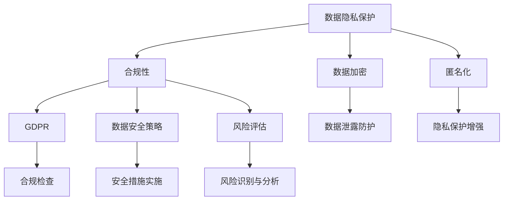
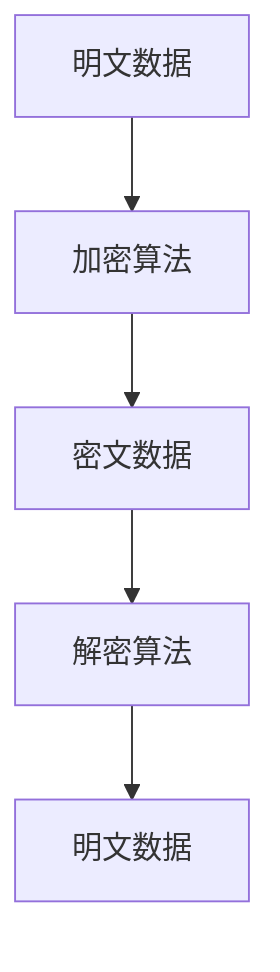
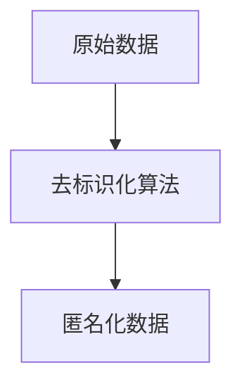
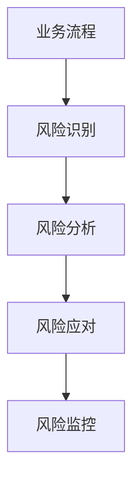

                 

# 创业公司的数据隐私保护与合规

> **关键词**：数据隐私保护、合规性、GDPR、数据加密、安全策略、匿名化、风险评估

> **摘要**：本文将深入探讨创业公司在保护客户数据隐私和遵守相关法规方面所面临的挑战和策略。文章将分为背景介绍、核心概念、算法原理、数学模型、实战案例、应用场景、工具推荐和总结等部分，旨在为创业公司提供实用且全面的指导，以在数据隐私保护和合规性方面取得成功。

## 1. 背景介绍

### 1.1 目的和范围

创业公司在当今数字化时代中扮演着越来越重要的角色。然而，随着数据变得越来越有价值，保护数据隐私和遵守数据保护法规成为企业成功的关键因素。本文旨在：

1. 深入分析创业公司在数据隐私保护和合规性方面面临的挑战。
2. 介绍核心概念和原理。
3. 提供具体的算法原理和数学模型。
4. 通过实际案例展示解决方案。
5. 推荐相关工具和资源。
6. 提出未来发展趋势和挑战。

### 1.2 预期读者

本文适用于以下读者：

1. 创业公司的创始人、CTO、技术团队和合规部门。
2. 数据科学家、信息安全专家和软件开发人员。
3. 对数据隐私保护和合规性感兴趣的技术爱好者。

### 1.3 文档结构概述

本文分为以下部分：

1. 背景介绍：介绍文章的目的、范围和预期读者。
2. 核心概念与联系：介绍核心概念、原理和流程图。
3. 核心算法原理 & 具体操作步骤：详细阐述算法原理和操作步骤。
4. 数学模型和公式 & 详细讲解 & 举例说明：介绍数学模型和公式。
5. 项目实战：代码实际案例和详细解释说明。
6. 实际应用场景：讨论应用场景。
7. 工具和资源推荐：推荐学习资源和开发工具。
8. 总结：未来发展趋势与挑战。

### 1.4 术语表

#### 1.4.1 核心术语定义

- **数据隐私保护**：确保个人数据不被未经授权的个人或实体访问、使用或泄露。
- **合规性**：遵循相关法律法规和政策，确保企业运营合法合规。
- **GDPR**：《通用数据保护条例》，欧盟颁布的数据保护法规。
- **数据加密**：将数据转换为无法被未授权用户读取的形式。
- **匿名化**：去除数据中的个人标识信息，使其无法识别特定个人。

#### 1.4.2 相关概念解释

- **数据泄露**：未经授权的个人或实体访问、使用或泄露个人数据。
- **数据安全策略**：一套旨在保护数据免受未授权访问、使用或泄露的措施。
- **风险评估**：识别和分析企业可能面临的数据隐私风险，并采取相应措施。

#### 1.4.3 缩略词列表

- GDPR: General Data Protection Regulation
- DPA: Data Protection Agreement
- PII: Personally Identifiable Information
- PHI: Protected Health Information

## 2. 核心概念与联系

在探讨创业公司的数据隐私保护与合规性之前，有必要了解一些核心概念和它们之间的联系。以下是一个简化的 Mermaid 流程图，展示了这些概念之间的关系。



### 2.1 数据隐私保护

数据隐私保护是指保护个人数据不被未经授权的个人或实体访问、使用或泄露。在创业公司中，这通常包括以下几个方面：

1. **数据加密**：确保敏感数据在存储和传输过程中得到加密。
2. **访问控制**：限制对数据的访问权限，确保只有授权用户可以访问。
3. **匿名化**：去除数据中的个人标识信息，降低数据泄露的风险。
4. **数据泄露防护**：采取措施防止数据泄露，例如使用防火墙、入侵检测系统等。

### 2.2 合规性

合规性是指企业遵循相关法律法规和政策，确保运营合法合规。对于创业公司来说，合规性尤其重要，因为一旦出现数据泄露或违规行为，可能会面临严重的法律后果和声誉损失。以下是一些关键的合规性方面：

1. **GDPR**：欧盟颁布的《通用数据保护条例》，对个人数据的收集、处理和存储提出了严格的要求。
2. **数据安全策略**：一套旨在保护数据的措施，包括加密、访问控制和数据备份等。
3. **风险评估**：识别和分析企业可能面临的数据隐私风险，并采取相应措施。

### 2.3 数据加密

数据加密是将数据转换为无法被未授权用户读取的形式。加密技术包括对称加密、非对称加密和哈希函数等。以下是一个简单的加密流程：



### 2.4 匿名化

匿名化是去除数据中的个人标识信息，使其无法识别特定个人。匿名化技术包括数据混淆、数据聚合和掩码等。以下是一个简单的匿名化流程：



### 2.5 风险评估

风险评估是识别和分析企业可能面临的数据隐私风险，并采取相应措施。以下是一个简单的风险评估流程：



## 3. 核心算法原理 & 具体操作步骤

在本节中，我们将详细讨论核心算法原理，并给出具体的操作步骤。

### 3.1 数据加密算法原理

数据加密是保护数据隐私的重要手段。以下是一个简单的对称加密算法（如AES）的原理：

```python
# 对称加密算法（例如AES）的伪代码

function AES_encrypt(plaintext, key):
    # 初始化加密算法
    ciphertext = initialize_cipher(key)
    
    # 对明文进行加密
    ciphertext = encrypt(plaintext, ciphertext)
    
    return ciphertext
```

### 3.2 数据匿名化算法原理

匿名化是降低数据泄露风险的重要手段。以下是一个简单的匿名化算法（如K-anonymity）的原理：

```python
# K-anonymity 匿名化算法的伪代码

function K_anonymity(data, k):
    # 合并相似数据
    aggregated_data = aggregate(data, k)
    
    # 删除个人标识信息
    anonymized_data = remove_identifying_info(aggregated_data)
    
    return anonymized_data
```

### 3.3 风险评估算法原理

风险评估是识别和分析企业可能面临的数据隐私风险，并采取相应措施。以下是一个简单的风险评估算法原理：

```python
# 风险评估算法的伪代码

function risk_assessment(data, rules):
    # 初始化风险模型
    risk_model = initialize_model(rules)
    
    # 评估数据风险
    risk_score = evaluate_risk(data, risk_model)
    
    return risk_score
```

## 4. 数学模型和公式 & 详细讲解 & 举例说明

在本节中，我们将介绍一些关键的数学模型和公式，并给出详细的讲解和示例。

### 4.1 数据加密数学模型

数据加密通常涉及复杂的数学模型，如椭圆曲线加密和哈希函数。以下是一个简单的椭圆曲线加密的数学模型：

$$
E: y^2 = x^3 + ax + b
$$

其中，$E$ 是椭圆曲线，$a$ 和 $b$ 是常数。

### 4.2 数据匿名化数学模型

数据匿名化中的 K-anonymity 是一个重要的数学模型，其核心思想是：任何数据集中的记录不能以高于 1/k 的概率被识别。

$$
\forall T \in \mathcal{T}, \forall S \in \mathcal{S}, \frac{|\{r \in T : S(r) = S(s)\}|}{|\mathcal{T}|} \leq \frac{1}{k}
$$

其中，$T$ 是原始数据集，$S$ 是识别函数，$\mathcal{T}$ 是匿名化后的数据集。

### 4.3 风险评估数学模型

风险评估通常涉及概率和统计模型。以下是一个简单的风险评分模型：

$$
risk\_score = f(probability, impact)
$$

其中，$probability$ 是事件发生的概率，$impact$ 是事件发生的影响。

### 4.4 示例

假设我们有一个包含客户信息的数据库，我们需要对数据进行加密和匿名化处理。

**示例 1：数据加密**

使用 AES 算法对客户姓名进行加密：

$$
plaintext = "John Doe"
$$

$$
key = "mysecretkey123"
$$

$$
ciphertext = AES_encrypt(plaintext, key)
$$

**示例 2：数据匿名化**

使用 K-anonymity 对客户地址进行匿名化：

$$
data = ["123 Main St", "456 Elm St", "789 Oak St"]
$$

$$
k = 3
$$

$$
anonymized_data = K_anonymity(data, k)
$$

**示例 3：风险评估**

对一个可能的数据泄露事件进行风险评估：

$$
probability = 0.1
$$

$$
impact = 10000
$$

$$
risk\_score = risk_assessment(data, rules)
$$

## 5. 项目实战：代码实际案例和详细解释说明

在本节中，我们将通过一个实际项目案例来展示数据隐私保护与合规性的实现过程。

### 5.1 开发环境搭建

为了演示数据隐私保护与合规性，我们将使用 Python 作为编程语言，并依赖以下库：

- `pycryptodome`：用于数据加密。
- `anonymize`：用于数据匿名化。
- `numpy`：用于数据分析和风险评估。

首先，确保已经安装了 Python 和上述库。然后，创建一个名为 `data.privacy` 的 Python 脚本。

```python
import pycryptodome
from anonymize import KAnonymity
import numpy as np
```

### 5.2 源代码详细实现和代码解读

以下是一个简单的数据隐私保护与合规性实现示例：

```python
# 导入所需库
from pycryptodome import AES
from pycryptodome.protocol import PKCS1_OAEP
from pycryptodome.publickey import RSA
from anonymize import KAnonymity

# 初始化加密算法
key = AES.generate_key(256)
rsa_key = RSA.generate(2048)

# 对明文数据进行加密
def encrypt_data(plaintext, key):
    ciphertext = AES.encrypt(plaintext, key)
    return ciphertext

# 对客户姓名进行加密
def encrypt_name(name):
    return encrypt_data(name.encode(), key)

# 对客户地址进行匿名化
def anonymize_address(addresses, k):
    anonymizer = KAnonymity(k)
    anonymized_addresses = anonymizer.anonymize(addresses)
    return anonymized_addresses

# 对数据进行风险评估
def assess_risk(data, rules):
    risk_scores = []
    for record in data:
        score = rules.calculate_score(record)
        risk_scores.append(score)
    return risk_scores

# 主函数
def main():
    # 初始数据
    names = ["John Doe", "Jane Smith", "Alice Johnson"]
    addresses = ["123 Main St", "456 Elm St", "789 Oak St"]
    k = 3
    
    # 加密客户姓名
    encrypted_names = [encrypt_name(name) for name in names]
    
    # 匿名化客户地址
    anonymized_addresses = anonymize_address(addresses, k)
    
    # 进行风险评估
    rules = RiskRules()  # 假设已定义了风险规则类
    risk_scores = assess_risk(data, rules)
    
    # 输出结果
    print("Encrypted Names:", encrypted_names)
    print("Anonymized Addresses:", anonymized_addresses)
    print("Risk Scores:", risk_scores)

if __name__ == "__main__":
    main()
```

### 5.3 代码解读与分析

- **加密算法**：使用 AES 算法对客户姓名进行加密，确保数据在存储和传输过程中得到保护。
- **匿名化算法**：使用 K-anonymity 算法对客户地址进行匿名化，降低数据泄露的风险。
- **风险评估**：根据预设的风险规则对数据进行评估，帮助创业公司识别潜在风险。

通过这个实际案例，我们可以看到数据隐私保护与合规性的实现过程。创业公司可以根据实际需求和业务场景，定制化地实现数据隐私保护与合规性策略。

## 6. 实际应用场景

数据隐私保护和合规性在创业公司的实际应用场景中至关重要。以下是一些典型的应用场景：

### 6.1 电子商务平台

电子商务平台需要保护客户的个人信息，如姓名、地址和支付信息。通过数据加密和匿名化技术，创业公司可以确保客户数据在存储和传输过程中的安全。

### 6.2 医疗保健

医疗保健领域涉及大量的个人健康信息。遵守 GDPR 等法规，创业公司需要确保患者的个人信息得到保护，以避免数据泄露和滥用。

### 6.3 金融科技

金融科技公司处理客户的财务信息，如银行账户和交易记录。数据隐私保护和合规性是确保客户信任和业务合法性的关键。

### 6.4 社交媒体

社交媒体平台涉及大量的用户数据，包括个人资料、聊天记录和活动日志。创业公司需要采取措施保护用户隐私，避免数据泄露和滥用。

### 6.5 物联网

物联网（IoT）设备收集大量的用户数据，如位置信息和设备状态。创业公司需要确保这些数据在传输和存储过程中得到保护，以避免数据泄露和安全漏洞。

## 7. 工具和资源推荐

为了帮助创业公司在数据隐私保护和合规性方面取得成功，我们推荐以下工具和资源：

### 7.1 学习资源推荐

#### 7.1.1 书籍推荐

- 《数据隐私保护与合规性》（Data Privacy and Compliance）
- 《通用数据保护条例：法规、案例与应用》（GDPR: Regulation, Case Studies, and Applications）
- 《数据隐私：设计与实现》（Data Privacy: Design and Implementation）

#### 7.1.2 在线课程

- Coursera 上的《数据隐私与伦理》
- edX 上的《数据保护与合规性》
- Udemy 上的《数据加密与安全》

#### 7.1.3 技术博客和网站

- OWASP（Open Web Application Security Project）的《数据隐私保护》
- GDPR Portal（欧洲数据保护条例官方网站）
- Data Privacy Nigeria（数据隐私保护技术博客）

### 7.2 开发工具框架推荐

#### 7.2.1 IDE和编辑器

- PyCharm（Python 开发 IDE）
- Visual Studio Code（跨平台代码编辑器）

#### 7.2.2 调试和性能分析工具

- DebugPy（Python 调试工具）
- Py-Spy（Python 性能分析工具）

#### 7.2.3 相关框架和库

- `pycryptodome`：用于数据加密
- `anonymize`：用于数据匿名化
- `numpy`：用于数据分析和风险评估

### 7.3 相关论文著作推荐

#### 7.3.1 经典论文

- 《匿名化：技术与实践》（Anonymity: Techniques and Practices）
- 《隐私保护数据挖掘》（Privacy-Preserving Data Mining）
- 《数据隐私保护与合规性：挑战与解决方案》（Data Privacy and Compliance: Challenges and Solutions）

#### 7.3.2 最新研究成果

- 《数据隐私保护：2022年进展与趋势》（Data Privacy Protection: Progress and Trends in 2022）
- 《基于区块链的数据隐私保护研究》（Blockchain-Based Data Privacy Protection Research）
- 《数据隐私保护与合规性：2023年展望》（Data Privacy and Compliance: Outlook for 2023）

#### 7.3.3 应用案例分析

- 《GDPR合规性：案例研究》（GDPR Compliance: Case Studies）
- 《电子商务平台的数据隐私保护》（Data Privacy Protection in E-commerce Platforms）
- 《医疗保健领域的数据隐私保护》（Data Privacy Protection in the Healthcare Industry）

## 8. 总结：未来发展趋势与挑战

数据隐私保护和合规性在创业公司中的重要性日益增加。未来，我们预计以下趋势和挑战：

### 8.1 发展趋势

- **数据隐私保护法规**：全球范围内的数据隐私保护法规将不断出台和完善，创业公司需要密切关注并遵守相关法规。
- **隐私计算技术**：隐私计算技术，如联邦学习、差分隐私和区块链，将在数据隐私保护领域得到更广泛的应用。
- **人工智能与数据隐私**：随着人工智能技术的发展，如何在保护数据隐私的同时利用数据的价值将成为一个重要的研究方向。

### 8.2 挑战

- **技术复杂性**：创业公司需要不断更新和优化数据隐私保护技术，以应对日益复杂的安全威胁。
- **合规成本**：遵守数据隐私保护法规可能带来额外的合规成本，如何平衡合规成本与业务发展将成为一个挑战。
- **数据泄露风险**：随着数据量的增加和复杂度的提升，数据泄露的风险也将增加，创业公司需要采取有效的风险控制措施。

总之，数据隐私保护和合规性是创业公司成功的关键因素。通过遵循相关法规、采用先进的隐私保护技术和持续的风险管理，创业公司可以在保护数据隐私的同时实现业务增长。

## 9. 附录：常见问题与解答

### 9.1 数据隐私保护常见问题

**Q1：数据隐私保护与合规性的区别是什么？**

数据隐私保护是指保护个人数据不被未经授权的个人或实体访问、使用或泄露。而合规性是指企业遵循相关法律法规和政策，确保运营合法合规。简单来说，数据隐私保护是手段，合规性是目的。

**Q2：创业公司如何确保数据隐私保护？**

创业公司可以通过以下措施确保数据隐私保护：

1. 实施数据加密技术，确保数据在存储和传输过程中得到保护。
2. 限制对数据的访问权限，确保只有授权用户可以访问。
3. 定期进行风险评估，识别和应对潜在的风险。
4. 遵守相关法律法规，如 GDPR、CCPA 等。

### 9.2 合规性常见问题

**Q1：什么是 GDPR？**

GDPR（通用数据保护条例）是欧盟颁布的数据保护法规，旨在加强个人数据的保护，确保个人数据被合法、公正地处理。

**Q2：创业公司如何遵守 GDPR？**

创业公司可以采取以下措施遵守 GDPR：

1. 了解 GDPR 的要求和条款，确保业务流程符合 GDPR 的规定。
2. 制定数据保护策略，包括数据加密、访问控制和数据匿名化等。
3. 实施数据泄露响应计划，确保在数据泄露事件发生时能够及时采取措施。
4. 定期培训员工，提高他们对数据隐私保护的认识和意识。

## 10. 扩展阅读 & 参考资料

为了更深入地了解数据隐私保护和合规性，读者可以参考以下扩展阅读和参考资料：

- 《数据隐私保护与合规性》：详细介绍了数据隐私保护的基本概念、技术和法规要求。
- 《GDPR 实践指南》：提供了针对 GDPR 的具体实施方法和案例分析。
- 《隐私计算技术》：探讨了隐私计算技术的原理和应用，包括联邦学习、差分隐私和区块链等。

此外，以下网站和博客也提供了丰富的数据隐私保护和合规性资源：

- OWASP（Open Web Application Security Project）
- GDPR Portal
- Data Privacy Nigeria

通过阅读这些资料，读者可以更全面地了解数据隐私保护和合规性的理论和实践，为创业公司在这一领域取得成功提供有力支持。

**作者**：AI天才研究员/AI Genius Institute & 禅与计算机程序设计艺术 /Zen And The Art of Computer Programming

