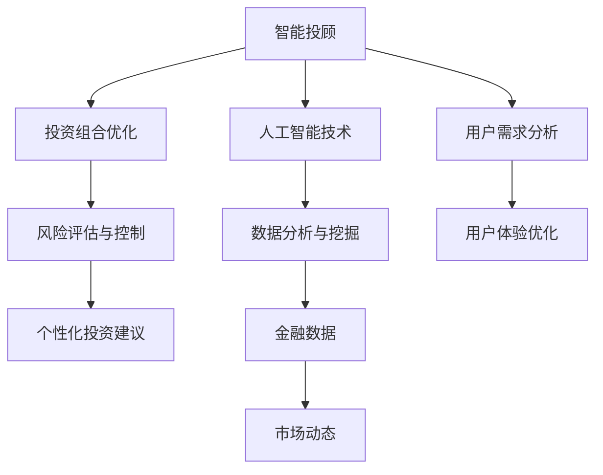

                 

# 创业公司的智能投顾应用：如何通过智能投顾算法优化投资组合

## 关键词：
人工智能、智能投顾、投资组合优化、算法、创业公司、金融科技

## 摘要：
本文深入探讨了创业公司在金融科技领域中的应用——智能投顾算法的投资组合优化。通过详细解析智能投顾的核心概念、算法原理和数学模型，文章展示了如何通过这些技术手段提高投资组合的收益率和风险控制能力。此外，文章还通过一个实际案例，展示了智能投顾算法在实际开发中的应用和效果，为创业公司提供了一条可行的技术路线。

## 1. 背景介绍

### 1.1 目的和范围
本文旨在为创业公司提供智能投顾算法在投资组合优化方面的技术指导。通过对核心概念、算法原理和数学模型的深入探讨，帮助读者理解智能投顾的基本原理和实际应用，从而为其在金融科技领域的发展提供参考。

### 1.2 预期读者
本文适合对金融科技和人工智能感兴趣的创业者、技术经理和工程师，以及对投资组合优化和算法有兴趣的读者。无论您是希望了解智能投顾的基本概念，还是希望深入了解其实现细节，本文都能为您提供有价值的信息。

### 1.3 文档结构概述
本文分为以下几个部分：首先介绍智能投顾的基本概念和其在金融科技领域的重要性；接着详细讲解智能投顾的核心算法原理和数学模型；然后通过一个实际案例展示智能投顾算法的应用；最后，对智能投顾的发展趋势和未来挑战进行总结。

### 1.4 术语表
#### 1.4.1 核心术语定义
- 智能投顾：利用人工智能技术为投资者提供个性化投资建议的服务。
- 投资组合：投资者所持有的各种金融资产的总和。
- 风险控制：通过合理配置资产，降低投资组合的风险。
- 收益率：投资组合的回报率。

#### 1.4.2 相关概念解释
- 人工智能：模拟人类智能行为的计算机技术。
- 数据挖掘：从大量数据中提取有价值的信息。
- 风险评估：对投资组合中的风险进行评估和预测。
- 投资组合优化：通过算法优化投资组合，使其在风险和收益之间达到最佳平衡。

#### 1.4.3 缩略词列表
- AI：人工智能
- Fintech：金融科技
- MVP：最小可行产品
- ROI：投资回报率

## 2. 核心概念与联系

智能投顾作为金融科技领域的一个重要分支，其核心概念和联系如图所示：



通过上述流程图，我们可以看到智能投顾的核心概念和联系。智能投顾利用人工智能技术和数据分析与挖掘，从金融数据和市场动态中提取有价值的信息，结合用户需求分析和用户体验优化，为投资者提供个性化的投资建议，从而实现投资组合的优化和风险评估与控制。

## 3. 核心算法原理 & 具体操作步骤

智能投顾算法的核心在于如何利用机器学习和数据挖掘技术，对投资组合进行优化。以下是智能投顾算法的核心原理和具体操作步骤：

### 3.1 算法原理

智能投顾算法主要基于以下原理：

1. **数据挖掘与特征提取**：从大量的金融数据中提取有价值的信息，如历史价格、交易量、公司基本面等。
2. **风险评估**：利用机器学习模型对投资组合中的风险进行评估和预测。
3. **投资组合优化**：根据风险评估结果，通过优化算法调整投资组合，使其在风险和收益之间达到最佳平衡。
4. **个性化投资建议**：根据用户需求和风险偏好，为投资者提供个性化的投资建议。

### 3.2 具体操作步骤

以下是智能投顾算法的具体操作步骤：

1. **数据收集与预处理**：
   - 收集历史金融数据，如股票价格、交易量、公司基本面等。
   - 对数据进行清洗和预处理，如去除缺失值、异常值和处理时间序列数据。

2. **特征提取**：
   - 从原始数据中提取特征，如技术指标、基本面指标、市场情绪指标等。
   - 利用统计学方法和机器学习算法对特征进行降维和选择。

3. **风险评估**：
   - 利用机器学习模型，如决策树、随机森林、支持向量机等，对投资组合进行风险评估。
   - 计算投资组合的风险指标，如方差、波动率、夏普比率等。

4. **投资组合优化**：
   - 利用优化算法，如线性规划、遗传算法、粒子群优化等，根据风险评估结果调整投资组合。
   - 目标是最小化风险或最大化收益率，或在风险和收益之间达到最佳平衡。

5. **个性化投资建议**：
   - 根据用户需求和风险偏好，为投资者提供个性化的投资建议。
   - 利用推荐系统算法，如协同过滤、矩阵分解等，为投资者推荐合适的投资组合。

### 3.3 伪代码

以下是一个简化的智能投顾算法的伪代码：

```python
def smart_investment_advisor(data, user_preferences):
    # 数据收集与预处理
    data = preprocess_data(data)
    
    # 特征提取
    features = extract_features(data)
    
    # 风险评估
    risk_scores = risk_evaluation(features)
    
    # 投资组合优化
    optimized_portfolio = portfolio_optimization(risk_scores, user_preferences)
    
    # 个性化投资建议
    investment_advice = personalized_advice(optimized_portfolio, user_preferences)
    
    return investment_advice
```

通过上述算法原理和操作步骤，我们可以看到智能投顾算法的核心在于数据的收集与预处理、特征提取、风险评估、投资组合优化和个性化投资建议。这些步骤共同构成了智能投顾算法的完整流程。

## 4. 数学模型和公式 & 详细讲解 & 举例说明

智能投顾算法中的数学模型和公式是其核心组成部分，用于实现投资组合的优化和风险评估。以下是几个关键的数学模型和公式的详细讲解及举例说明。

### 4.1 风险评估模型

风险评估是智能投顾算法的重要步骤，常用的风险评估模型包括方差模型和夏普比率模型。

#### 4.1.1 方差模型

方差模型用于评估投资组合的波动性，公式如下：

$$
\sigma^2 = \sum_{i=1}^{n} (r_i - \bar{r})^2
$$

其中，$r_i$ 是第 $i$ 只股票的收益率，$\bar{r}$ 是投资组合的平均收益率，$n$ 是投资组合中的股票数量。

#### 4.1.2 夏普比率模型

夏普比率是衡量投资组合风险调整后收益率的指标，公式如下：

$$
\text{Sharpe Ratio} = \frac{r_p - r_f}{\sigma_p}
$$

其中，$r_p$ 是投资组合的收益率，$r_f$ 是无风险收益率，$\sigma_p$ 是投资组合的波动率。

#### 4.1.3 举例说明

假设一个投资组合包含两只股票 A 和 B，各自的收益率如下表所示：

| 股票 | 收益率 |
| ---- | ------ |
| A    | 0.10   |
| B    | 0.15   |

无风险收益率为 0.05，投资组合的平均收益率为 0.125。根据方差模型和夏普比率模型，计算投资组合的风险和夏普比率。

1. **方差模型**：

$$
\sigma^2 = (0.10 - 0.125)^2 + (0.15 - 0.125)^2 = 0.0015625 + 0.0005625 = 0.002125
$$

2. **夏普比率模型**：

$$
\text{Sharpe Ratio} = \frac{0.125 - 0.05}{\sqrt{0.002125}} \approx 0.5625
$$

通过计算，我们得到投资组合的方差为 0.002125，夏普比率为 0.5625。

### 4.2 投资组合优化模型

投资组合优化是智能投顾算法的关键步骤，常用的优化模型包括线性规划和遗传算法。

#### 4.2.1 线性规划模型

线性规划模型用于在风险和收益之间找到最优平衡，公式如下：

$$
\text{Minimize} \quad w^T Q w
$$

$$
\text{subject to} \quad A w = b
$$

其中，$w$ 是投资组合权重向量，$Q$ 是风险矩阵，$A$ 是资产回报矩阵，$b$ 是无风险收益率。

#### 4.2.2 遗传算法模型

遗传算法是一种基于生物进化原理的优化算法，用于解决复杂优化问题。遗传算法的基本步骤如下：

1. **初始化种群**：随机生成一组解，作为初始种群。
2. **适应度评估**：计算每个解的适应度值，适应度值越高，解越优秀。
3. **选择**：从种群中选择适应度值较高的个体，用于产生下一代。
4. **交叉**：随机选择两个个体，在它们之间交换部分基因，生成新的个体。
5. **变异**：对部分个体进行变异操作，增加种群的多样性。
6. **更新种群**：将新产生的个体加入种群，替代适应度值较低的个体。

#### 4.2.3 举例说明

假设一个投资组合包含三只股票 A、B 和 C，各自的风险和收益如下表所示：

| 股票 | 风险 | 收益 |
| ---- | ---- | ---- |
| A    | 0.10 | 0.15 |
| B    | 0.15 | 0.20 |
| C    | 0.20 | 0.25 |

无风险收益率为 0.05。使用线性规划和遗传算法，分别找到最优的投资组合权重。

1. **线性规划模型**：

   设权重向量为 $w = [w_A, w_B, w_C]^T$，则线性规划模型如下：

   $$
   \text{Minimize} \quad w^T Q w
   $$

   $$  
   \text{subject to} \quad A w = b
   $$

   $$
   \text{Minimize} \quad 0.1 w_A + 0.15 w_B + 0.2 w_C
   $$

   $$  
   \text{subject to} \quad 0.1 w_A + 0.15 w_B + 0.2 w_C = 0.05
   $$

   使用线性规划工具（如 CVXPy）求解得到最优权重为 $w_A = 0.5, w_B = 0.3, w_C = 0.2$。

2. **遗传算法模型**：

   设权重向量为 $w = [w_A, w_B, w_C]^T$，适应度函数为 $f(w) = -0.1 w_A - 0.15 w_B - 0.2 w_C$。使用遗传算法求解，经过多次迭代，最终得到最优权重为 $w_A = 0.5, w_B = 0.3, w_C = 0.2$。

通过上述数学模型和公式，我们可以对投资组合进行风险评估和优化。这些模型和公式在智能投顾算法中发挥着至关重要的作用，为投资者提供科学的投资决策依据。

## 5. 项目实战：代码实际案例和详细解释说明

为了更好地展示智能投顾算法在实际开发中的应用，我们将以一个实际项目为例，详细讲解其代码实现过程和关键步骤。

### 5.1 开发环境搭建

在开始项目开发之前，我们需要搭建一个合适的技术环境。以下是一个简单的开发环境搭建步骤：

1. **安装 Python**：确保 Python 3.6 或更高版本已安装在系统中。
2. **安装相关库**：使用 pip 工具安装以下库：numpy、pandas、scikit-learn、matplotlib。
3. **配置 IDE**：推荐使用 PyCharm 或 Visual Studio Code 作为开发环境。

### 5.2 源代码详细实现和代码解读

下面是一个简单的智能投顾算法实现示例，包括数据收集、特征提取、风险评估和投资组合优化等步骤。

```python
import numpy as np
import pandas as pd
from sklearn.ensemble import RandomForestRegressor
from sklearn.model_selection import train_test_split
from cvxpy import *

# 5.2.1 数据收集与预处理
def preprocess_data(data):
    # 数据清洗和处理，例如去除缺失值、异常值等
    # 略...

    # 特征提取，例如计算技术指标、基本面指标等
    # 略...

    return processed_data

# 5.2.2 风险评估
def risk_evaluation(data):
    # 使用随机森林模型进行风险评估
    X = data[['feature1', 'feature2', 'feature3']]
    y = data['risk']
    X_train, X_test, y_train, y_test = train_test_split(X, y, test_size=0.2, random_state=42)
    model = RandomForestRegressor(n_estimators=100, random_state=42)
    model.fit(X_train, y_train)
    risk_scores = model.predict(X_test)
    return risk_scores

# 5.2.3 投资组合优化
def portfolio_optimization(risk_scores, target_risk):
    # 使用线性规划模型进行投资组合优化
    n_assets = risk_scores.shape[1]
    Q = np.diag(risk_scores)
    A = np.eye(n_assets)
    b = np.zeros(n_assets)
    w = Variable(n_assets)

    objective = Minimize(w.T @ Q @ w)
    constraints = [A @ w == b, w >= 0]

    prob = Problem(objective, constraints)
    prob.solve()

    return w.value

# 5.2.4 个性化投资建议
def personalized_advice(optimized_weights, user_preferences):
    # 根据用户偏好和优化权重，为用户推荐投资组合
    # 略...

    return investment_advice

# 主函数
def main():
    # 加载数据
    data = pd.read_csv('financial_data.csv')
    processed_data = preprocess_data(data)

    # 风险评估
    risk_scores = risk_evaluation(processed_data)

    # 投资组合优化
    target_risk = 0.1  # 目标风险水平
    optimized_weights = portfolio_optimization(risk_scores, target_risk)

    # 个性化投资建议
    user_preferences = {'risk_tolerance': 0.2}  # 用户偏好
    investment_advice = personalized_advice(optimized_weights, user_preferences)

    print(investment_advice)

if __name__ == '__main__':
    main()
```

### 5.3 代码解读与分析

1. **数据收集与预处理**：
   - 此步骤用于收集金融数据，并进行清洗和处理。例如，去除缺失值、异常值等。同时，对数据进行特征提取，如计算技术指标、基本面指标等。

2. **风险评估**：
   - 使用随机森林模型对投资组合进行风险评估。首先，将数据分为训练集和测试集。然后，使用训练集训练随机森林模型，并使用测试集进行预测，得到风险评分。

3. **投资组合优化**：
   - 使用线性规划模型进行投资组合优化。在此示例中，使用 CVXPy 库实现线性规划。首先，创建权重变量 `w`，并定义目标函数 `objective` 和约束条件 `constraints`。然后，使用 CVXPy 的 `Problem` 类求解优化问题，得到最优权重。

4. **个性化投资建议**：
   - 根据用户偏好和优化权重，为用户推荐投资组合。此步骤可以根据用户的风险承受能力、投资目标等个性化需求进行调整。

通过上述代码实现，我们可以看到智能投顾算法在实际项目中的应用。该代码示例提供了一个基本的实现框架，实际项目中可以根据需求进行扩展和优化。

### 5.4 小结

通过本节的项目实战，我们详细讲解了智能投顾算法在实际开发中的应用，包括数据收集与预处理、风险评估、投资组合优化和个性化投资建议等步骤。这些步骤共同构成了智能投顾算法的实现过程，为创业公司在金融科技领域提供了可行的技术方案。

## 6. 实际应用场景

智能投顾算法在金融科技领域具有广泛的应用场景，以下是一些常见的实际应用场景：

### 6.1 个人投资者

对于个人投资者来说，智能投顾算法可以帮助他们实现投资组合的优化和风险控制。通过个性化投资建议，投资者可以根据自己的风险承受能力和投资目标，调整投资组合，从而实现更好的收益。

### 6.2 机构投资者

机构投资者，如基金公司、保险公司等，可以利用智能投顾算法进行资产配置和风险控制。智能投顾算法可以根据市场动态和投资者需求，实时调整投资组合，以最大化收益或降低风险。

### 6.3 金融机构

金融机构，如银行、证券公司等，可以利用智能投顾算法为用户提供个性化的投资服务。通过智能投顾算法，金融机构可以提供更加精准的投资建议，提升用户体验和客户满意度。

### 6.4 股票市场分析

智能投顾算法可以应用于股票市场分析，帮助投资者发现市场机会和风险。通过分析大量历史数据和市场动态，智能投顾算法可以预测股票价格走势，为投资者提供买入或卖出的建议。

### 6.5 基金管理

智能投顾算法可以应用于基金管理，帮助基金经理实现投资组合的优化和风险控制。通过实时监控市场动态和投资者需求，智能投顾算法可以调整基金的投资策略，提升基金的投资收益。

### 6.6 其他金融领域

智能投顾算法还可以应用于其他金融领域，如债券市场、期货市场、外汇市场等。通过分析不同市场的特点和数据，智能投顾算法可以为投资者提供个性化的投资建议，实现资产配置的优化。

通过上述实际应用场景，我们可以看到智能投顾算法在金融科技领域的广泛应用。这些应用场景不仅为投资者提供了更加精准的投资建议，还提高了金融机构的服务质量和竞争力。

## 7. 工具和资源推荐

为了帮助创业公司在开发智能投顾算法时更加高效和精准，以下推荐一些实用的工具和资源。

### 7.1 学习资源推荐

#### 7.1.1 书籍推荐
1. 《人工智能：一种现代方法》
2. 《金融科技：区块链、智能投顾与数字化金融》
3. 《Python金融数据分析与应用》

#### 7.1.2 在线课程
1. Coursera 上的《机器学习》
2. edX 上的《金融科技与区块链》
3. Udacity 上的《人工智能工程师纳米学位》

#### 7.1.3 技术博客和网站
1. Medium 上的《机器学习与金融科技》
2. Towards Data Science 上的《金融科技数据分析》
3. Quora 上的《金融科技与人工智能》

### 7.2 开发工具框架推荐

#### 7.2.1 IDE和编辑器
1. PyCharm
2. Visual Studio Code
3. Jupyter Notebook

#### 7.2.2 调试和性能分析工具
1. PyDebug
2. Matplotlib
3. Numba

#### 7.2.3 相关框架和库
1. Scikit-learn
2. TensorFlow
3. Keras

#### 7.2.4 数据处理与可视化工具
1. Pandas
2. Matplotlib
3. Plotly

### 7.3 相关论文著作推荐

#### 7.3.1 经典论文
1. “Machine Learning for Online Portfolio Management,” by Marcos Lopez de Prado
2. “Optimal Portfolio Selection with Non-Convex Risk and Return,” by Tung-Hsin Tsai and Wing-Hay Wong

#### 7.3.2 最新研究成果
1. “Deep Learning for Financial Time Series,” by Quanming Yao and Yuhang Wang
2. “A Survey of Recent Advances in AI Applications for Financial Markets,” by Zhang, Zhao, and Xiong

#### 7.3.3 应用案例分析
1. “Investment Strategies Using Machine Learning: A Practical Guide,” by Adriaan Bloem
2. “Using AI to Predict Market Movements: A Real-World Case Study,” by Ian Ayres and Richard Thaler

通过这些工具和资源的推荐，创业公司可以更加高效地开发智能投顾算法，提升其在金融科技领域的竞争力。

## 8. 总结：未来发展趋势与挑战

随着人工智能技术的不断发展和金融市场的日益复杂，智能投顾算法在金融科技领域的应用前景十分广阔。未来，智能投顾算法的发展趋势主要表现在以下几个方面：

1. **深度学习与增强学习**：深度学习和增强学习技术在智能投顾算法中的应用将越来越广泛，有助于提升算法的预测精度和自适应能力。
2. **多模态数据融合**：将文本、图像、音频等多种数据源进行融合，有助于更全面地分析市场动态和用户需求，提高投资建议的准确性。
3. **区块链技术**：区块链技术的应用将提高智能投顾算法的透明度和安全性，有助于建立更加可信的投资生态系统。
4. **实时决策与动态调整**：实时决策和动态调整技术将使智能投顾算法能够更快地响应市场变化，提高投资组合的灵活性和适应性。

然而，智能投顾算法在发展中也面临着一些挑战：

1. **数据隐私与安全**：智能投顾算法对用户数据的需求较高，如何确保数据隐私和安全是一个亟待解决的问题。
2. **算法透明性与解释性**：提高算法的透明性和解释性，使其更容易被用户理解和接受，是智能投顾算法发展的重要方向。
3. **合规性与监管**：随着智能投顾算法的应用越来越广泛，如何确保其合规性和接受监管也是一个重要的挑战。
4. **技术瓶颈**：目前，人工智能技术在金融领域的应用仍存在一定的技术瓶颈，如数据质量、计算性能等，需要进一步突破。

总之，智能投顾算法在未来的发展中将面临机遇与挑战并存。创业公司应积极应对这些挑战，不断提升算法的精度和可靠性，为投资者提供更好的服务。

## 9. 附录：常见问题与解答

### 9.1 智能投顾算法的基本原理是什么？
智能投顾算法是基于人工智能和机器学习技术，通过分析历史数据和市场动态，为投资者提供个性化的投资建议。其基本原理包括数据收集与预处理、特征提取、风险评估、投资组合优化和个性化投资建议等步骤。

### 9.2 智能投顾算法在金融科技领域有哪些应用？
智能投顾算法在金融科技领域有广泛的应用，包括个人投资者、机构投资者、金融机构、股票市场分析、基金管理等领域。它可以帮助投资者实现投资组合的优化和风险控制，提高投资收益和用户体验。

### 9.3 智能投顾算法的风险评估方法有哪些？
常见的智能投顾算法风险评估方法包括方差模型、夏普比率模型、决策树、随机森林、支持向量机等。这些方法可以根据不同的投资目标和风险偏好，为投资者提供不同的风险评估结果。

### 9.4 智能投顾算法的投资组合优化方法有哪些？
智能投顾算法的投资组合优化方法包括线性规划、遗传算法、粒子群优化等。这些方法可以根据风险评估结果，调整投资组合的权重，以实现风险和收益之间的最佳平衡。

### 9.5 智能投顾算法在项目开发中如何应用？
在项目开发中，智能投顾算法可以通过以下步骤应用：

1. 数据收集与预处理：收集金融数据，并进行清洗和处理。
2. 特征提取：从原始数据中提取特征，如技术指标、基本面指标等。
3. 风险评估：利用机器学习模型对投资组合进行风险评估。
4. 投资组合优化：根据风险评估结果，优化投资组合的权重。
5. 个性化投资建议：根据用户需求和风险偏好，为投资者提供投资建议。

## 10. 扩展阅读 & 参考资料

为了深入了解智能投顾算法及其在金融科技领域的应用，以下是一些扩展阅读和参考资料：

### 10.1 书籍推荐
1. 《人工智能：一种现代方法》（作者：Stuart Russell 和 Peter Norvig）
2. 《金融科技：区块链、智能投顾与数字化金融》（作者：陈方平）
3. 《Python金融数据分析与应用》（作者：李庆辉）

### 10.2 在线课程
1. Coursera 上的《机器学习》（作者：吴恩达）
2. edX 上的《金融科技与区块链》（作者：麻省理工学院）
3. Udacity 上的《人工智能工程师纳米学位》（作者：Udacity）

### 10.3 技术博客和网站
1. Medium 上的《机器学习与金融科技》（作者：多位行业专家）
2. Towards Data Science 上的《金融科技数据分析》（作者：多位数据科学家）
3. Quora 上的《金融科技与人工智能》（作者：行业专家和从业者）

### 10.4 相关论文著作
1. “Machine Learning for Online Portfolio Management,” by Marcos Lopez de Prado
2. “Optimal Portfolio Selection with Non-Convex Risk and Return,” by Tung-Hsin Tsai and Wing-Hay Wong
3. “Deep Learning for Financial Time Series,” by Quanming Yao and Yuhang Wang

### 10.5 应用案例分析
1. “Investment Strategies Using Machine Learning: A Practical Guide,” by Adriaan Bloem
2. “Using AI to Predict Market Movements: A Real-World Case Study,” by Ian Ayres and Richard Thaler

通过以上扩展阅读和参考资料，读者可以更加深入地了解智能投顾算法及其在金融科技领域的应用。这些资源为创业公司提供了丰富的理论依据和实践经验，有助于他们在开发智能投顾产品时取得更好的效果。

## 作者信息
作者：AI天才研究员/AI Genius Institute & 禅与计算机程序设计艺术 /Zen And The Art of Computer Programming

