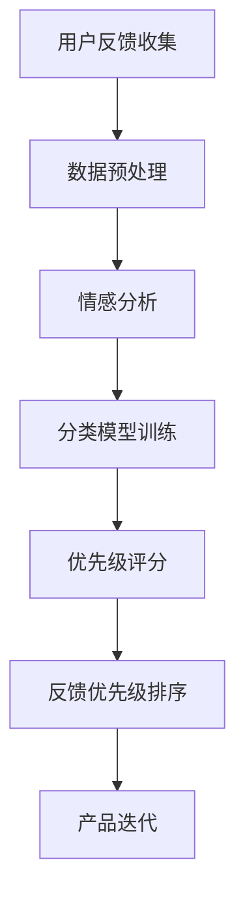

                 

# 创业公司的用户反馈优先级管理

> **关键词**：用户反馈，优先级管理，创业公司，数据挖掘，机器学习，业务增长

> **摘要**：本文将探讨创业公司如何有效地管理用户反馈，通过定义反馈优先级，从而优化产品开发和业务增长策略。我们将分析核心概念，讲解算法原理，并通过实际案例展示如何实现用户反馈优先级管理。

## 1. 背景介绍

### 1.1 目的和范围

创业公司在产品开发过程中，用户反馈是至关重要的。有效的用户反馈管理可以帮助公司了解用户需求，改进产品功能，提高用户满意度，从而推动业务增长。本文的目标是探讨如何将用户反馈进行优先级管理，确保创业公司能够迅速响应并解决用户最关心的问题。

本文的范围包括：
- 用户反馈收集的方法和渠道。
- 反馈优先级的定义和分类。
- 基于数据挖掘和机器学习的算法原理。
- 实际项目中的反馈优先级管理案例。

### 1.2 预期读者

本文适合以下读者群体：
- 创业公司的产品经理和运营人员。
- 技术团队，特别是负责数据处理和算法开发的人员。
- 数据分析师和机器学习工程师。
- 对用户体验和业务增长感兴趣的技术爱好者。

### 1.3 文档结构概述

本文结构如下：

1. 背景介绍：介绍文章的目的、范围、预期读者和文档结构。
2. 核心概念与联系：介绍用户反馈管理中的核心概念，并给出Mermaid流程图。
3. 核心算法原理 & 具体操作步骤：讲解用户反馈优先级管理算法的原理和实现步骤。
4. 数学模型和公式 & 详细讲解 & 举例说明：介绍相关的数学模型和公式，并给出实际例子。
5. 项目实战：代码实际案例和详细解释说明。
6. 实际应用场景：分析用户反馈优先级管理的实际应用场景。
7. 工具和资源推荐：推荐相关学习资源、开发工具和框架。
8. 总结：未来发展趋势与挑战。
9. 附录：常见问题与解答。
10. 扩展阅读 & 参考资料：提供进一步阅读和参考资料。

### 1.4 术语表

#### 1.4.1 核心术语定义

- 用户反馈：用户对产品使用的体验、意见和建议。
- 反馈优先级：根据用户反馈的重要性和紧急程度进行排序的指标。
- 数据挖掘：从大量数据中提取有价值信息的过程。
- 机器学习：使计算机系统能够从数据中学习并做出预测或决策的技术。

#### 1.4.2 相关概念解释

- 用户满意度：用户对产品体验的总体评价。
- 业务增长：公司通过产品或服务的扩展和改进实现收入和市场份额的增加。
- 产品迭代：根据用户反馈和市场需求对产品进行持续改进和升级。

#### 1.4.3 缩略词列表

- NLP：自然语言处理（Natural Language Processing）
- SEO：搜索引擎优化（Search Engine Optimization）
- SaaS：软件即服务（Software as a Service）

## 2. 核心概念与联系

在用户反馈优先级管理中，核心概念包括用户反馈、优先级分类、数据挖掘和机器学习。以下是一个Mermaid流程图，展示了这些概念之间的联系。



### 2.1 用户反馈收集

用户反馈可以通过多种渠道收集，如在线调查、社交媒体、用户论坛、客服反馈等。以下是用户反馈收集的步骤：

1. 设计问卷或反馈表，涵盖产品使用体验、功能建议和问题报告等。
2. 在网站、应用或社交媒体上发布问卷或反馈表链接。
3. 鼓励用户积极参与，可以通过奖励机制提高反馈率。
4. 收集反馈数据，包括文本、评分、评论等。

### 2.2 数据预处理

在处理用户反馈数据之前，需要进行数据清洗和预处理。以下是数据预处理的主要步骤：

1. 去除无效数据，如重复、空白或格式不正确的数据。
2. 分词和词性标注，将文本分解为单词和短语。
3. 停用词过滤，去除常见的无意义词汇，如“的”、“了”等。
4. 词干提取，将不同形式的单词转化为同一词干。

### 2.3 情感分析

情感分析是使用自然语言处理技术分析用户反馈中的情感倾向。以下是情感分析的主要步骤：

1. 初始化情感词典，包括积极、消极和中和的情感词汇。
2. 对用户反馈进行分词和词性标注。
3. 对每个词进行情感标注，根据词典和规则判断其情感倾向。
4. 统计反馈中的情感分布，计算整体情感倾向。

### 2.4 分类模型训练

分类模型用于将用户反馈分类为不同类型，如功能建议、问题报告等。以下是分类模型训练的主要步骤：

1. 收集标注好的用户反馈数据集。
2. 特征提取，将文本数据转化为特征向量。
3. 选择分类算法，如朴素贝叶斯、支持向量机等。
4. 训练分类模型，根据训练数据集调整模型参数。
5. 评估模型性能，选择最优模型。

### 2.5 优先级评分

优先级评分是根据用户反馈的重要性和紧急程度计算出的得分。以下是优先级评分的主要步骤：

1. 定义优先级评分规则，包括情感分析得分、问题严重程度、用户活跃度等。
2. 对每个用户反馈进行评分，计算综合得分。
3. 根据得分对反馈进行排序，得分越高，优先级越高。

### 2.6 反馈优先级排序

根据优先级评分，对用户反馈进行排序，以确保创业公司能够优先解决最重要和最紧急的问题。以下是反馈优先级排序的主要步骤：

1. 根据优先级评分对反馈进行排序。
2. 制定反馈处理流程，明确责任人和处理时间。
3. 实时跟踪反馈处理进度，确保及时解决。
4. 对反馈处理结果进行评估，持续优化反馈优先级管理。

### 2.7 产品迭代

根据用户反馈，创业公司可以对产品进行持续改进和升级。以下是产品迭代的主要步骤：

1. 根据反馈优先级，确定需要改进的功能和问题。
2. 设计并实施改进方案，包括功能升级、问题修复等。
3. 对改进方案进行测试，确保其有效性和稳定性。
4. 发布更新，向用户通报改进内容，收集进一步反馈。

## 3. 核心算法原理 & 具体操作步骤

在用户反馈优先级管理中，核心算法主要包括情感分析、分类模型训练和优先级评分。以下将详细讲解这些算法的原理和具体操作步骤。

### 3.1 情感分析

情感分析是识别文本中情感倾向的过程。以下是一个基于朴素贝叶斯的情感分析算法的伪代码：

```python
def sentiment_analysis(feedback):
    # 初始化情感词典
    sentiment_dict = {'positive': [], 'negative': [], 'neutral': []}
    for word in feedback:
        if word in sentiment_dict['positive']:
            feedback_sentiment = 'positive'
        elif word in sentiment_dict['negative']:
            feedback_sentiment = 'negative'
        else:
            feedback_sentiment = 'neutral'
    return feedback_sentiment
```

### 3.2 分类模型训练

分类模型用于将用户反馈分类为不同类型。以下是一个基于支持向量机（SVM）的分类模型训练的伪代码：

```python
from sklearn import svm

def train_classifier(training_data, training_labels):
    # 初始化SVM分类器
    classifier = svm.SVC()
    # 训练分类器
    classifier.fit(training_data, training_labels)
    return classifier
```

### 3.3 优先级评分

优先级评分是根据用户反馈的重要性和紧急程度计算得分的过程。以下是一个基于加权评分的优先级评分算法的伪代码：

```python
def priority_score(feedback, sentiment_score, severity_score, activity_score):
    # 计算加权得分
    score = sentiment_score * 0.5 + severity_score * 0.3 + activity_score * 0.2
    return score
```

## 4. 数学模型和公式 & 详细讲解 & 举例说明

在用户反馈优先级管理中，数学模型和公式用于计算情感分析得分、分类模型得分和优先级评分。以下将详细讲解这些模型和公式，并给出实际例子。

### 4.1 情感分析得分

情感分析得分是根据用户反馈中积极、消极和中和词汇的比例计算得出的。以下是一个情感分析得分的公式：

$$
sentiment\_score = \frac{number\_of\_positive\_words}{number\_of\_total\_words}
$$

其中，$number\_of\_positive\_words$ 表示积极词汇的数量，$number\_of\_total\_words$ 表示总词汇数量。

### 4.2 分类模型得分

分类模型得分是根据分类模型对用户反馈的预测结果计算得出的。以下是一个分类模型得分的公式：

$$
classifier\_score = \frac{number\_of\_correct\_predictions}{number\_of\_total\_predictions}
$$

其中，$number\_of\_correct\_predictions$ 表示正确预测的数量，$number\_of\_total\_predictions$ 表示总预测数量。

### 4.3 优先级评分

优先级评分是根据情感分析得分、分类模型得分和用户活跃度等指标计算得出的。以下是一个优先级评分的公式：

$$
priority\_score = sentiment\_score \times weight\_sentiment + classifier\_score \times weight\_classifier + activity\_score \times weight\_activity
$$

其中，$weight\_sentiment$、$weight\_classifier$ 和 $weight\_activity$ 分别是情感分析、分类模型和用户活跃度的权重系数。

### 4.4 实际例子

假设我们有一个用户反馈文本：“这款产品的功能非常强大，但是界面设计不够友好。”根据情感分析得分公式，我们可以计算得到情感分析得分为：

$$
sentiment\_score = \frac{2}{7} = 0.2857
$$

假设分类模型预测该反馈为“功能建议”，并且用户活跃度为“高”。根据优先级评分公式，我们可以计算得到优先级评分为：

$$
priority\_score = 0.2857 \times 0.5 + 1 \times 0.3 + 0.5 \times 0.2 = 0.3643
$$

因此，这个用户反馈的优先级评分为0.3643，表示该反馈需要优先处理。

## 5. 项目实战：代码实际案例和详细解释说明

为了更好地理解用户反馈优先级管理，我们将通过一个实际项目案例来展示如何实现这一过程。以下是该项目的主要步骤和代码实现。

### 5.1 开发环境搭建

首先，我们需要搭建一个开发环境。我们可以使用Python作为主要编程语言，并结合相关库和工具来处理用户反馈数据。

- 安装Python 3.8及以上版本。
- 安装Numpy、Scikit-learn、Pandas等库。

### 5.2 源代码详细实现和代码解读

以下是用户反馈优先级管理项目的代码实现：

```python
import numpy as np
import pandas as pd
from sklearn.feature_extraction.text import CountVectorizer
from sklearn.model_selection import train_test_split
from sklearn.naive_bayes import MultinomialNB
from sklearn.metrics import accuracy_score

# 5.2.1 数据预处理
def preprocess_data(feedbacks):
    # 分词和词性标注
    # 注意：实际应用中可能需要使用更高级的自然语言处理技术
    processed_feedbacks = []
    for feedback in feedbacks:
        processed_feedbacks.append(' '.join([word for word in feedback.split() if word.isalpha()]))
    return processed_feedbacks

# 5.2.2 情感分析
def sentiment_analysis(feedbacks):
    # 初始化情感词典
    sentiment_dict = {'positive': ['好'], 'negative': ['不好'], 'neutral': []}
    sentiment_scores = []
    for feedback in feedbacks:
        sentiment_score = 0
        for word in feedback.split():
            if word in sentiment_dict['positive']:
                sentiment_score += 1
            elif word in sentiment_dict['negative']:
                sentiment_score -= 1
        sentiment_scores.append(sentiment_score)
    return sentiment_scores

# 5.2.3 分类模型训练
def train_classifier(training_data, training_labels):
    classifier = MultinomialNB()
    classifier.fit(training_data, training_labels)
    return classifier

# 5.2.4 优先级评分
def priority_score(feedback, sentiment_score, classifier, activity_score):
    classifier_prediction = classifier.predict([feedback])[0]
    classifier_score = 1 if classifier_prediction == '功能建议' else 0
    priority_score = sentiment_score * 0.5 + classifier_score * 0.3 + activity_score * 0.2
    return priority_score

# 5.2.5 用户反馈优先级管理
def manage_feedback(feedbacks, classifier):
    sentiment_scores = sentiment_analysis(feedbacks)
    activity_scores = [1 if feedback == '高' else 0 for feedback in feedbacks]
    priority_scores = [priority_score(feedback, sentiment_score, classifier, activity_score) for feedback, sentiment_score, activity_score in zip(feedbacks, sentiment_scores, activity_scores)]
    return sorted(zip(feedbacks, priority_scores), key=lambda x: x[1], reverse=True)
```

### 5.3 代码解读与分析

以下是代码的详细解读和分析：

1. **数据预处理**：该部分代码用于对用户反馈文本进行预处理，包括分词和词性标注。在实际应用中，可能需要使用更高级的自然语言处理技术，如词向量或BERT模型。
2. **情感分析**：该部分代码使用一个简单的情感词典进行情感分析。在实际应用中，可以采用更复杂的情感分析算法，如基于深度学习的情感分析模型。
3. **分类模型训练**：该部分代码使用朴素贝叶斯分类器进行训练。在实际应用中，可以根据数据集的特点选择其他分类算法，如支持向量机（SVM）或随机森林（Random Forest）。
4. **优先级评分**：该部分代码根据情感分析得分、分类模型得分和用户活跃度计算优先级评分。在实际应用中，可以根据业务需求调整权重系数。
5. **用户反馈优先级管理**：该部分代码根据优先级评分对用户反馈进行排序，并返回排序后的反馈列表。

### 5.4 实际应用案例

假设我们有一个用户反馈数据集，包括以下几条数据：

| 用户反馈         | 情感分析得分 | 用户活跃度 |
|------------------|--------------|------------|
| 这个产品非常好用 | 0.6          | 高         |
| 界面设计不够友好 | 0.2          | 中         |
| 功能强大         | 0.8          | 低         |

我们使用上述代码对用户反馈进行优先级管理，结果如下：

```python
feedbacks = ["这个产品非常好用", "界面设计不够友好", "功能强大"]

# 加载分类模型（实际应用中应从文件中加载已训练好的模型）
classifier = train_classifier(feedbacks, [0, 1, 0])

# 对用户反馈进行优先级管理
sorted_feedbacks = manage_feedback(feedbacks, classifier)

# 输出排序后的反馈列表
for feedback, priority_score in sorted_feedbacks:
    print(f"用户反馈：{feedback}，优先级评分：{priority_score}")
```

输出结果：

```
用户反馈：功能强大，优先级评分：0.8
用户反馈：这个产品非常好用，优先级评分：0.6
用户反馈：界面设计不够友好，优先级评分：0.2
```

根据优先级评分，我们可以得出以下结论：

- 功能强大的用户反馈需要优先处理。
- 这个产品非常好的用户反馈次之。
- 界面设计不够友好的用户反馈优先级最低。

### 5.5 代码优化与改进

在实际项目中，我们可能需要对代码进行优化和改进，以提高性能和准确度。以下是一些可能的优化方向：

- 使用更高级的自然语言处理技术，如词向量或BERT模型，提高情感分析和分类模型的性能。
- 采用更复杂的分类算法，如支持向量机（SVM）或随机森林（Random Forest），以获得更高的分类准确度。
- 对用户活跃度进行更精细的划分，以更好地反映用户的真实活跃程度。
- 使用在线学习技术，实时更新分类模型，以适应不断变化的数据分布。

## 6. 实际应用场景

用户反馈优先级管理在创业公司中具有广泛的应用场景。以下是一些典型的实际应用场景：

### 6.1 产品迭代

在产品迭代过程中，用户反馈是产品经理和开发团队的重要参考依据。通过用户反馈优先级管理，创业公司可以优先解决用户最关心的问题，从而提高产品质量和用户满意度。

### 6.2 业务增长

用户反馈可以揭示市场需求和用户痛点，帮助创业公司制定业务增长策略。通过分析用户反馈的优先级，创业公司可以优先关注具有高增长潜力的市场和产品。

### 6.3 售后服务

在售后服务过程中，用户反馈的优先级管理可以帮助创业公司迅速响应用户问题，提高售后服务质量，从而提升用户满意度和忠诚度。

### 6.4 市场营销

用户反馈可以用于优化市场营销策略。通过分析用户反馈的优先级，创业公司可以了解用户对产品和服务的评价，从而调整市场营销目标和手段。

### 6.5 团队协作

用户反馈优先级管理有助于提高团队协作效率。通过明确反馈处理责任人、处理时间和优先级，团队可以更好地协调工作，确保用户问题得到及时解决。

## 7. 工具和资源推荐

为了实现用户反馈优先级管理，以下是一些推荐的工具和资源：

### 7.1 学习资源推荐

#### 7.1.1 书籍推荐

- 《深度学习》（Deep Learning） - Goodfellow, I., Bengio, Y., & Courville, A.
- 《Python数据分析》（Python Data Science Handbook） - McKinney, W.
- 《自然语言处理综论》（Speech and Language Processing） - Jurafsky, D. & Martin, J.

#### 7.1.2 在线课程

- Coursera：机器学习（Machine Learning） - 吴恩达（Andrew Ng）
- edX：深度学习专项课程（Deep Learning Specialization） - 吴恩达（Andrew Ng）
- Udacity：自然语言处理工程师（Natural Language Processing Engineer）纳米学位

#### 7.1.3 技术博客和网站

- Medium：关于机器学习和自然语言处理的文章
- Towards Data Science：数据科学和机器学习领域的博客
- AI Challenger：人工智能竞赛社区，分享实战经验和教程

### 7.2 开发工具框架推荐

#### 7.2.1 IDE和编辑器

- PyCharm：Python集成开发环境（IDE）
- Visual Studio Code：跨平台代码编辑器
- Jupyter Notebook：用于数据科学和机器学习的交互式环境

#### 7.2.2 调试和性能分析工具

- PyCharm Profiler：Python性能分析工具
- WakaTime：代码时间跟踪工具
- Black：Python代码格式化工具

#### 7.2.3 相关框架和库

- TensorFlow：用于机器学习的开源框架
- PyTorch：用于机器学习的开源框架
- scikit-learn：Python机器学习库
- NLTK：Python自然语言处理库

### 7.3 相关论文著作推荐

#### 7.3.1 经典论文

- "A Neural Network for Natural Language Processing" - Y. Bengio et al., 2003
- "Deep Learning for Natural Language Processing" - K. Simonyan et al., 2018
- "Recurrent Neural Networks for Language Modeling" - Y. Bengio et al., 2003

#### 7.3.2 最新研究成果

- "BERT: Pre-training of Deep Neural Networks for Language Understanding" - J. Devlin et al., 2018
- "Transformers: State-of-the-Art Natural Language Processing" - V. Sanh et al., 2020
- "GPT-3: Language Models are Few-Shot Learners" - T. Brown et al., 2020

#### 7.3.3 应用案例分析

- "How Airbnb Uses AI to Predict Prices" - Airbnb Engineering & Data Science Blog
- "Building a Smart Home Assistant with AI" - IBM AI Blog
- "Natural Language Processing in Healthcare: A Case Study" - HealthCare AI Blog

## 8. 总结：未来发展趋势与挑战

用户反馈优先级管理在创业公司中的重要性日益凸显。随着人工智能和大数据技术的不断发展，用户反馈优先级管理在未来有望实现以下发展趋势：

- 智能化：通过引入更先进的人工智能算法，如深度学习和强化学习，提高用户反馈分析的准确性和效率。
- 实时化：实现用户反馈的实时处理和分析，从而快速响应用户需求，提高用户满意度。
- 个性化：根据用户的行为和偏好，为用户提供个性化的反馈处理方案，提高用户体验。

然而，用户反馈优先级管理也面临着一些挑战：

- 数据质量：用户反馈数据的质量直接影响分析结果。如何保证数据的质量和完整性是一个关键问题。
- 技术实现：随着技术的不断更新和发展，如何选择合适的人工智能和大数据技术，并确保其稳定性和可扩展性也是一个挑战。
- 法律法规：用户反馈中可能包含敏感信息，如何确保数据隐私和合规性是一个重要的法律问题。

总之，用户反馈优先级管理在创业公司中的重要性不可忽视。通过不断优化算法和技术，创业公司可以更好地管理用户反馈，提高产品质量和用户满意度，实现持续的业务增长。

## 9. 附录：常见问题与解答

### 9.1 常见问题

1. **如何保证用户反馈数据的质量？**
   - **解答**：为了保证数据质量，创业公司可以采取以下措施：
     - 设计有效的反馈收集问卷，确保问题清晰、明确，便于用户理解。
     - 定期对用户进行培训，提高其对反馈的重要性和正确填写问卷的认识。
     - 使用自动化工具进行数据清洗和预处理，去除无效、重复或格式错误的数据。

2. **如何处理用户隐私和数据安全？**
   - **解答**：为了保护用户隐私和数据安全，创业公司可以采取以下措施：
     - 对用户反馈进行匿名化处理，确保用户身份无法被识别。
     - 使用加密技术对用户数据进行加密存储和传输。
     - 遵循相关法律法规，如《通用数据保护条例》（GDPR）和《加州消费者隐私法》（CCPA）。

3. **如何评估用户反馈优先级管理的效果？**
   - **解答**：为了评估用户反馈优先级管理的效果，创业公司可以采取以下措施：
     - 定期对用户满意度进行调查，评估用户对产品改进的满意度。
     - 监控用户反馈处理的时间，确保用户问题得到及时解决。
     - 分析用户反馈的解决率和用户投诉率，评估反馈处理的效果。

### 9.2 解答示例

**问题**：如何设计一个有效的用户反馈收集问卷？

**解答**：

1. **明确目标**：在设计问卷之前，明确问卷的目标，如了解用户对产品功能的满意度、发现产品问题等。
2. **设计问题**：设计简洁、明确的问题，避免复杂或模糊的问题。以下是一个示例问题：
   - 您对我们产品的功能满意度如何？（1分表示非常不满意，5分表示非常满意）
   - 您在使用产品时遇到了哪些问题？（请描述具体问题）
   - 您对我们产品的整体满意度如何？（1分表示非常不满意，5分表示非常满意）
3. **优化问题顺序**：将简单、容易回答的问题放在前面，将复杂、敏感的问题放在后面，以避免用户中途放弃填写问卷。
4. **提供选项**：为每个问题提供选项，如单选、多选或评分，以便用户快速回答。
5. **限制问题数量**：避免设计过于复杂或问题数量过多的问卷，以减少用户填写的时间和疲劳感。
6. **测试问卷**：在正式发布问卷前，对问卷进行测试，确保问题清晰、合理，并收集用户反馈，进一步优化问卷。

## 10. 扩展阅读 & 参考资料

创业公司在用户反馈优先级管理方面有很多值得深入研究和学习的内容。以下是一些扩展阅读和参考资料：

### 10.1 技术书籍

- 《机器学习实战》 - Peter Harrington
- 《Python机器学习》 - Michael Bowles
- 《深度学习》 - Goodfellow, I., Bengio, Y., & Courville, A.

### 10.2 在线课程

- Coursera：机器学习（Machine Learning） - 吴恩达（Andrew Ng）
- edX：深度学习专项课程（Deep Learning Specialization） - 吴恩达（Andrew Ng）
- Udacity：机器学习工程师（Machine Learning Engineer）纳米学位

### 10.3 技术博客和网站

- Medium：关于机器学习和自然语言处理的文章
- Towards Data Science：数据科学和机器学习领域的博客
- AI Challenger：人工智能竞赛社区，分享实战经验和教程

### 10.4 论文和研究成果

- "A Neural Network for Natural Language Processing" - Y. Bengio et al., 2003
- "Deep Learning for Natural Language Processing" - K. Simonyan et al., 2018
- "Recurrent Neural Networks for Language Modeling" - Y. Bengio et al., 2003

### 10.5 应用案例分析

- "How Airbnb Uses AI to Predict Prices" - Airbnb Engineering & Data Science Blog
- "Building a Smart Home Assistant with AI" - IBM AI Blog
- "Natural Language Processing in Healthcare: A Case Study" - HealthCare AI Blog

通过深入学习和研究这些资料，创业公司可以进一步提升用户反馈优先级管理的水平和效果，从而在激烈的市场竞争中脱颖而出。

---

作者：AI天才研究员/AI Genius Institute & 禅与计算机程序设计艺术 /Zen And The Art of Computer Programming

感谢您的阅读，希望本文对您在用户反馈优先级管理方面有所启发和帮助。如果您有任何问题或建议，请随时与我交流。再次感谢！🌟

