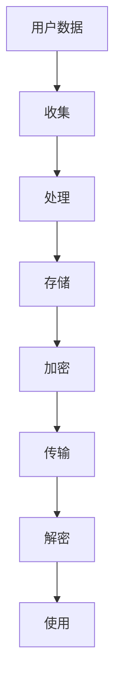

                 

# 创业公司的用户数据加密策略

> **关键词：** 用户数据加密、创业公司、安全策略、加密算法、隐私保护

> **摘要：** 本篇文章将探讨创业公司在保护用户数据时所需的加密策略。我们首先介绍用户数据加密的重要性，然后逐步解析创业公司应如何制定和实施有效的数据加密方案，以保障用户隐私和数据安全。

## 1. 背景介绍

### 1.1 目的和范围

本文旨在帮助创业公司在数字时代保护用户数据，减少数据泄露和滥用的风险。我们将探讨用户数据加密策略的制定原则、实施步骤以及相关的技术和工具。

### 1.2 预期读者

本篇文章面向创业公司的技术团队、CTO、数据安全和隐私保护负责人，以及对数据加密有兴趣的读者。

### 1.3 文档结构概述

本文将分为以下几个部分：

1. 背景介绍：阐述用户数据加密的重要性。
2. 核心概念与联系：介绍用户数据加密的基本概念和架构。
3. 核心算法原理 & 具体操作步骤：详细讲解数据加密的算法和实现。
4. 数学模型和公式 & 详细讲解 & 举例说明：分析加密算法的数学基础。
5. 项目实战：代码实际案例和详细解释说明。
6. 实际应用场景：讨论数据加密在创业公司的应用。
7. 工具和资源推荐：推荐相关学习资源和开发工具。
8. 总结：未来发展趋势与挑战。
9. 附录：常见问题与解答。
10. 扩展阅读 & 参考资料。

### 1.4 术语表

#### 1.4.1 核心术语定义

- 用户数据：指创业公司从用户收集、处理和存储的数据，如个人信息、交易记录、通信记录等。
- 加密：将数据转换为不可读形式的过程，需要解密密钥来恢复原始数据。
- 密钥管理：指密钥的生成、存储、分发、轮换和销毁等过程。

#### 1.4.2 相关概念解释

- 对称加密：使用相同密钥进行加密和解密。
- 非对称加密：使用一对密钥进行加密和解密，其中公钥加密，私钥解密。
- 哈希函数：将任意长度的输入数据映射为固定长度的输出值，常用于数据完整性校验和数字签名。

#### 1.4.3 缩略词列表

- SSL/TLS：安全套接字层/传输层安全协议。
- AES：高级加密标准。
- RSA：一种非对称加密算法。

## 2. 核心概念与联系

用户数据加密是保护数据隐私和安全的关键技术。以下是用户数据加密的核心概念和架构，我们将使用Mermaid流程图来展示这些概念之间的联系。



### 2.1 用户数据的生命周期

用户数据在创业公司的生命周期中经历了多个阶段，包括收集、处理、存储、传输和使用。在每个阶段，数据都需要得到加密保护，以防止未经授权的访问。

### 2.2 数据加密的层次结构

数据加密可以分为三个层次：

1. **传输层加密**：在数据传输过程中使用SSL/TLS等协议保护数据。
2. **存储层加密**：在数据存储时使用对称或非对称加密算法保护数据。
3. **应用层加密**：在应用程序中对敏感数据进行加密处理。

## 3. 核心算法原理 & 具体操作步骤

为了实现用户数据的加密，我们需要了解几种核心加密算法，包括对称加密（如AES）和非对称加密（如RSA）。下面，我们将详细讲解这些算法的原理和具体操作步骤。

### 3.1 对称加密算法：AES

**算法原理**：

- **AES**（Advanced Encryption Standard，高级加密标准）是一种基于块加密的对称加密算法，使用128、192或256位密钥对数据进行加密。
- **加密过程**：输入数据被分成若干块（128位），每个块通过一系列轮加密操作转换为密文。
- **解密过程**：密文通过逆加密操作恢复为明文。

**具体操作步骤**：

```plaintext
加密过程：
1. 初始化密钥
2. 初始化初始轮密钥
3. 对输入数据分块
4. 对每个数据块进行加密
   a. 执行字节替换（SubBytes）
   b. 执行行移位（ShiftRows）
   c. 执行列混淆（MixColumns）
   d. 执行轮密钥加（AddRoundKey）
5. 输出密文

解密过程：
1. 初始化密钥
2. 初始化初始轮密钥
3. 对输入数据分块
4. 对每个数据块进行解密
   a. 执行轮密钥加（AddRoundKey）
   b. 执行逆列混淆（InverseMixColumns）
   c. 执行逆行移位（InverseShiftRows）
   d. 执行逆字节替换（InverseSubBytes）
5. 输出明文
```

### 3.2 非对称加密算法：RSA

**算法原理**：

- **RSA**（Rivest-Shamir-Adleman，一种基于大数分解的非对称加密算法）使用一对密钥，其中公钥加密，私钥解密。
- **加密过程**：将消息转换为整数，使用公钥进行加密。
- **解密过程**：使用私钥将加密后的消息恢复为原始消息。

**具体操作步骤**：

```plaintext
加密过程：
1. 选择两个大素数p和q，计算n = p * q和φ(n) = (p-1) * (q-1)
2. 选择一个整数e，使得1 < e < φ(n)，且e和φ(n)互质
3. 计算d，满足d * e ≡ 1 (mod φ(n))
4. 公钥为(n, e)，私钥为(n, d)
5. 将消息m转换为整数M
6. 计算c = M^e mod n

解密过程：
1. 接收密文c
2. 计算M = c^d mod n
3. 输出明文M
```

## 4. 数学模型和公式 & 详细讲解 & 举例说明

### 4.1 对称加密算法：AES的数学模型

对称加密算法AES涉及到多种数学变换，主要包括字节替换、行移位、列混淆和轮密钥加。

- **字节替换（SubBytes）**：
  $$ S = \text{SubBytes}(A) $$
  其中，$A$是输入字节，$S$是替换后的字节。

- **行移位（ShiftRows）**：
  $$ S = \text{ShiftRows}(A) $$
  其中，$A$是输入字节矩阵，$S$是行移位后的字节矩阵。

- **列混淆（MixColumns）**：
  $$ S = \text{MixColumns}(A) $$
  其中，$A$是输入字节矩阵，$S$是列混淆后的字节矩阵。

- **轮密钥加（AddRoundKey）**：
  $$ S = A \oplus K $$
  其中，$A$是输入字节，$K$是轮密钥。

**举例说明**：

假设输入字节矩阵为：

$$ A = \begin{bmatrix}
1 & 2 & 3 & 4 \\
5 & 6 & 7 & 8 \\
9 & 10 & 11 & 12 \\
13 & 14 & 15 & 16
\end{bmatrix} $$

使用轮密钥：

$$ K = \begin{bmatrix}
1 & 0 & 0 & 0 \\
0 & 1 & 0 & 0 \\
0 & 0 & 1 & 0 \\
0 & 0 & 0 & 1
\end{bmatrix} $$

轮密钥加后的结果为：

$$ S = A \oplus K = \begin{bmatrix}
1 & 2 & 3 & 4 \\
5 & 6 & 7 & 8 \\
9 & 10 & 11 & 12 \\
13 & 14 & 15 & 16
\end{bmatrix} $$

### 4.2 非对称加密算法：RSA的数学模型

非对称加密算法RSA的核心在于大数分解和模运算。

- **模运算**：
  $$ c = M^e \mod n $$
  其中，$M$是消息，$e$是公钥指数，$n$是模数。

- **解密**：
  $$ M = c^d \mod n $$
  其中，$d$是私钥指数。

**举例说明**：

假设选择素数：

$$ p = 61, q = 53 $$

计算：

$$ n = p \times q = 3233 $$
$$ φ(n) = (p-1) \times (q-1) = 60 \times 52 = 3120 $$

选择公钥指数：

$$ e = 17 $$

计算私钥指数：

$$ d = 7 $$

假设消息：

$$ M = 1234 $$

加密过程：

$$ c = M^e \mod n = 1234^{17} \mod 3233 = 2965 $$

解密过程：

$$ M = c^d \mod n = 2965^7 \mod 3233 = 1234 $$

## 5. 项目实战：代码实际案例和详细解释说明

### 5.1 开发环境搭建

在开始项目实战之前，我们需要搭建一个适合开发和测试的环境。以下是一个基本的开发环境搭建步骤：

1. 安装Python 3.8或更高版本。
2. 安装PyCryptoDome库，可以使用以下命令：

```bash
pip install pycryptodome
```

3. 创建一个新的Python项目文件夹，并在其中创建一个名为`main.py`的文件。

### 5.2 源代码详细实现和代码解读

以下是使用PyCryptoDome库实现AES和RSA加密的代码。

```python
from Crypto.PublicKey import RSA
from Crypto.Cipher import AES, PKCS1_OAEP
from Crypto.Random import get_random_bytes
from base64 import b64encode, b64decode

# 对称加密：AES
def aes_encrypt(plain_text, key):
    cipher = AES.new(key, AES.MODE_EAX)
    ciphertext, tag = cipher.encrypt_and_digest(plain_text)
    return b64encode(cipher.nonce + cipher.tag + ciphertext).decode()

def aes_decrypt(ciphertext, key, nonce, tag):
    cipher = AES.new(key, AES.MODE_EAX, nonce=nonce)
    return cipher.decrypt_and_verify(ciphertext, tag)

# 非对称加密：RSA
def rsa_encrypt(plain_text, public_key):
    rsa_cipher = PKCS1_OAEP.new(public_key)
    ciphertext = rsa_cipher.encrypt(plain_text)
    return b64encode(ciphertext).decode()

def rsa_decrypt(ciphertext, private_key):
    rsa_cipher = PKCS1_OAEP.new(private_key)
    return rsa_cipher.decrypt(b64decode(ciphertext))

# 主函数
def main():
    # AES密钥和加密
    key = get_random_bytes(16)  # AES密钥长度为16字节
    plain_text = b"Hello, World!"
    ciphertext = aes_encrypt(plain_text, key)
    print(f"AES加密结果：{ciphertext}")

    # RSA密钥生成和加密
    rsa_key = RSA.generate(2048)
    rsa_public_key = rsa_key.publickey()
    rsa_private_key = rsa_key
    rsa_ciphertext = rsa_encrypt(plain_text, rsa_public_key)
    print(f"RSA加密结果：{rsa_ciphertext}")

    # RSA解密
    decrypted_text = rsa_decrypt(rsa_ciphertext, rsa_private_key)
    print(f"RSA解密结果：{decrypted_text}")

    # AES解密
    decrypted_text = aes_decrypt(b64decode(ciphertext), key)
    print(f"AES解密结果：{decrypted_text}")

if __name__ == "__main__":
    main()
```

### 5.3 代码解读与分析

#### 5.3.1 对称加密：AES

- `aes_encrypt`函数：使用AES算法进行加密，生成密文。
  - `cipher = AES.new(key, AES.MODE_EAX)`：创建一个新的AES加密对象，使用EAX模式。
  - `ciphertext, tag = cipher.encrypt_and_digest(plain_text)`：加密明文并生成消息认证码（MAC）。
  - `b64encode(cipher.nonce + cipher.tag + ciphertext).decode()`：将加密结果编码为Base64字符串。

- `aes_decrypt`函数：使用AES算法进行解密，恢复明文。
  - `cipher = AES.new(key, AES.MODE_EAX, nonce=nonce)`：创建一个新的AES加密对象，使用EAX模式和指定的随机数。
  - `return cipher.decrypt_and_verify(ciphertext, tag)`：解密密文并验证消息认证码。

#### 5.3.2 非对称加密：RSA

- `rsa_encrypt`函数：使用RSA算法进行加密，生成密文。
  - `rsa_cipher = PKCS1_OAEP.new(public_key)`：创建一个新的RSA加密对象，使用PKCS1_OAEP模式。
  - `ciphertext = rsa_cipher.encrypt(plain_text)`：使用公钥加密明文。

- `rsa_decrypt`函数：使用RSA算法进行解密，恢复明文。
  - `rsa_cipher = PKCS1_OAEP.new(private_key)`：创建一个新的RSA加密对象，使用PKCS1_OAEP模式和私钥。

## 6. 实际应用场景

用户数据加密在创业公司中有多种实际应用场景，以下是一些典型的场景：

1. **用户账户信息保护**：用户账户信息，如用户名、密码、电子邮件地址等，应使用加密算法进行保护。
2. **交易数据安全**：交易数据，如支付信息、订单详情等，必须在传输和存储过程中进行加密。
3. **通信隐私**：创业公司可能需要提供安全的通信服务，如即时消息或邮件服务，这些通信内容应使用加密算法进行保护。
4. **数据备份与恢复**：在备份数据时，为确保数据安全，应使用加密算法对备份数据进行加密。

## 7. 工具和资源推荐

### 7.1 学习资源推荐

#### 7.1.1 书籍推荐

- 《加密与密码学基础》（作者：Douglas R. Stinson）：这本书详细介绍了加密算法和密码学的基础知识，适合初学者。

#### 7.1.2 在线课程

- Coursera的《密码学》：这门课程由知名密码学家Dan Boneh教授主讲，深入浅出地介绍了密码学的基础知识。

#### 7.1.3 技术博客和网站

- Crypto Stack Exchange：这是一个关于密码学和技术的问题和答案平台，适合寻找具体的技术问题和解决方案。

### 7.2 开发工具框架推荐

#### 7.2.1 IDE和编辑器

- PyCharm：PyCharm是一款功能强大的Python IDE，支持加密算法的编写和调试。

#### 7.2.2 调试和性能分析工具

- GDB：GDB是一款功能强大的调试工具，适用于加密算法的性能分析和调试。

#### 7.2.3 相关框架和库

- PyCryptoDome：PyCryptoDome是一个开源的Python加密库，支持多种加密算法。

## 7.3 相关论文著作推荐

#### 7.3.1 经典论文

- “A Method for Obtaining Digital Signatures and Public-Key Cryptosystems”（作者：Rivest, Shamir, Adleman）：这篇论文介绍了RSA加密算法的基本原理。

#### 7.3.2 最新研究成果

- “Post-Quantum Cryptography Standardization”（作者：The NIST Post-Quantum Cryptography Project Team）：这篇论文讨论了量子计算对密码学的影响以及未来的发展方向。

#### 7.3.3 应用案例分析

- “Data Encryption in Cloud Computing: A Survey”（作者：Md. Abdus Salam, Muhammad Asif Hossain）：这篇论文详细分析了云计算环境中数据加密的应用案例。

## 8. 总结：未来发展趋势与挑战

用户数据加密在保护用户隐私和数据安全方面发挥着重要作用。随着技术的不断发展，未来用户数据加密将面临以下趋势和挑战：

1. **量子计算的影响**：量子计算的发展可能会对现有的加密算法造成威胁，促使新的加密算法和密码学理论的发展。
2. **加密算法的升级**：随着计算能力的提升，现有的加密算法可能需要升级以增强安全性。
3. **隐私保护法规的加强**：全球范围内对数据隐私保护的法规越来越严格，创业公司需要遵守这些法规并不断完善加密策略。
4. **安全性的平衡**：在提高数据安全性的同时，还需要考虑系统的性能和用户体验。

## 9. 附录：常见问题与解答

### 9.1 加密算法的选择

- **问题**：面对众多的加密算法，我们应该如何选择合适的算法？
- **解答**：根据应用场景和需求选择加密算法。例如，对于需要高效加密的场合，可以选择AES；对于需要确保数据完整性和来源的可信性的场合，可以选择RSA。

### 9.2 密钥管理

- **问题**：如何管理密钥以确保系统的安全性？
- **解答**：密钥管理是加密安全性的关键。建议使用安全的密钥存储解决方案，定期更换密钥，并确保密钥的分发和存储遵循最佳实践。

## 10. 扩展阅读 & 参考资料

- [Wikipedia: Advanced Encryption Standard](https://en.wikipedia.org/wiki/Advanced_Encryption_Standard)
- [Wikipedia: RSA (加密算法)](https://en.wikipedia.org/wiki/RSA_(cryptography))
- [NIST: Post-Quantum Cryptography Standardization](https://csrc.nist.gov/Projects/post-quantum-cryptography)
- [Coursera: Cryptography I](https://www.coursera.org/learn/crypto1)

