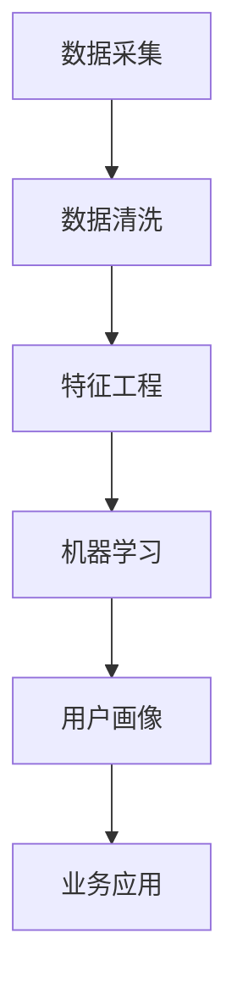

                 

# 创业公司的用户画像构建方法

> **关键词**：用户画像、数据分析、机器学习、业务洞察、个性化推荐

> **摘要**：本文旨在探讨创业公司在资源有限的情况下，如何构建有效的用户画像，以便更好地理解用户需求、提高用户体验，并实现商业价值最大化。通过介绍用户画像的核心概念、算法原理、数学模型、实战案例及未来发展趋势，本文为创业公司提供了一套系统化的用户画像构建方法。

## 1. 背景介绍

### 1.1 目的和范围

创业公司在市场竞争激烈的环境中，需要快速准确地了解用户需求，以便优化产品和服务。用户画像作为一种重要的数据分析工具，可以帮助创业公司识别目标用户群体，了解他们的行为和偏好，从而实现精准营销和个性化服务。

本文将围绕以下内容展开：

1. 用户画像的核心概念和作用。
2. 用户画像构建的算法原理和具体操作步骤。
3. 数学模型和公式的详细讲解及举例。
4. 实际应用场景和案例分析。
5. 未来发展趋势与挑战。

### 1.2 预期读者

本文面向创业公司的产品经理、数据分析师、技术团队及关注数据分析领域的专业人士。通过本文的阅读，读者可以了解用户画像的构建方法和应用场景，从而提升产品竞争力。

### 1.3 文档结构概述

本文分为以下几个部分：

1. 引言：介绍用户画像的定义和作用。
2. 核心概念与联系：阐述用户画像相关概念及其相互关系。
3. 核心算法原理 & 具体操作步骤：讲解用户画像构建的算法原理和操作步骤。
4. 数学模型和公式 & 详细讲解 & 举例说明：介绍用户画像构建中的数学模型和公式，并通过实例进行说明。
5. 项目实战：提供实际案例和代码实现，解读和分析代码。
6. 实际应用场景：分析用户画像在业务场景中的应用。
7. 工具和资源推荐：推荐学习资源、开发工具和框架。
8. 总结：展望用户画像的未来发展趋势和挑战。
9. 附录：常见问题与解答。
10. 扩展阅读 & 参考资料：提供进一步学习的资源。

### 1.4 术语表

#### 1.4.1 核心术语定义

- 用户画像：基于用户数据，对用户特征、行为和需求进行描述和建模，以便更好地了解用户。
- 数据采集：收集用户在平台上的行为数据和属性数据。
- 数据清洗：对采集到的数据进行处理，去除重复、错误和不完整的数据。
- 特征工程：从原始数据中提取有助于建模的特征，提高模型性能。
- 机器学习：一种利用数据训练模型，实现自动预测和决策的方法。

#### 1.4.2 相关概念解释

- 客户细分：将用户分为不同的群体，以便更好地理解他们的需求和偏好。
- 个性化推荐：根据用户画像，为用户推荐个性化的产品或服务。
- 用户留存：用户在平台上的活跃度和忠诚度。

#### 1.4.3 缩略词列表

- NLP：自然语言处理
- ML：机器学习
- AI：人工智能
- API：应用程序编程接口

## 2. 核心概念与联系

为了更好地理解用户画像的构建方法，我们需要先了解以下几个核心概念及其相互关系。

### 2.1 用户画像概念

用户画像是一种基于用户数据，对用户特征、行为和需求进行描述和建模的方法。它可以帮助创业公司更好地了解用户，从而实现精准营销和个性化服务。

用户画像包含以下几个主要方面：

1. **用户属性**：包括用户的年龄、性别、地域、职业等基本信息。
2. **用户行为**：包括用户的访问行为、购买行为、互动行为等。
3. **用户需求**：基于用户行为和属性，推测用户的需求和偏好。

### 2.2 数据采集

数据采集是构建用户画像的基础。创业公司可以通过以下几种方式获取用户数据：

1. **平台内部数据**：包括用户在平台上的行为数据、交易数据等。
2. **第三方数据**：通过合作伙伴或公开数据源获取的用户属性数据。
3. **问卷调查**：通过线上或线下问卷，直接获取用户需求和偏好。

### 2.3 数据清洗

在构建用户画像之前，需要对采集到的数据进行清洗，以确保数据的质量和准确性。数据清洗主要包括以下步骤：

1. **去重**：去除重复的数据记录。
2. **缺失值处理**：填补缺失值或删除缺失数据。
3. **异常值处理**：检测并处理异常值，如错误数据或极端数据。

### 2.4 特征工程

特征工程是从原始数据中提取有助于建模的特征，以提高模型性能。特征工程主要包括以下步骤：

1. **特征选择**：选择对建模有帮助的特征。
2. **特征转换**：将原始数据转换为适合建模的格式。
3. **特征归一化**：将不同特征的范围统一，以消除量纲影响。

### 2.5 机器学习

机器学习是构建用户画像的核心技术。通过训练机器学习模型，可以自动识别和预测用户的特征和需求。常见的机器学习算法包括：

1. **分类算法**：用于预测用户属性，如用户性别、年龄等。
2. **聚类算法**：用于将用户划分为不同的群体，以便更好地理解用户需求。
3. **关联规则挖掘**：用于发现用户行为之间的关联，如“购买A产品的用户，90%也会购买B产品”。

### 2.6 用户画像与业务关联

用户画像不仅有助于了解用户，还可以为业务带来直接的价值。以下是用户画像在业务中的应用：

1. **客户细分**：根据用户画像，将用户分为不同的群体，以便制定个性化的营销策略。
2. **个性化推荐**：根据用户画像，为用户推荐个性化的产品或服务，提高用户满意度和留存率。
3. **用户留存**：通过分析用户画像，识别用户流失的风险，并采取针对性的措施提高用户留存率。

### 2.7 Mermaid 流程图

以下是一个简单的 Mermaid 流程图，展示了用户画像构建的核心步骤：



## 3. 核心算法原理 & 具体操作步骤

### 3.1 数据采集

数据采集是用户画像构建的第一步。创业公司可以通过以下方式获取用户数据：

1. **平台内部数据**：包括用户在平台上的行为数据（如浏览记录、购买记录）、交易数据（如订单金额、支付方式）等。
2. **第三方数据**：通过合作伙伴或公开数据源获取的用户属性数据，如用户基本信息（年龄、性别、地域、职业）等。
3. **问卷调查**：通过线上或线下问卷，直接获取用户需求和偏好。

### 3.2 数据清洗

在数据采集完成后，需要对数据进行清洗，以确保数据的质量和准确性。数据清洗主要包括以下步骤：

1. **去重**：去除重复的数据记录，如同一用户在不同渠道上的重复记录。
2. **缺失值处理**：对于缺失的数据，可以通过填补缺失值（如使用平均值、中位数等方法）或删除缺失数据两种方式进行处理。
3. **异常值处理**：检测并处理异常值，如错误数据（如年龄为负数）或极端数据（如购买金额远高于其他用户）。

### 3.3 特征工程

特征工程是用户画像构建的关键步骤。以下是特征工程的几个核心步骤：

1. **特征选择**：选择对建模有帮助的特征。可以通过信息增益、卡方检验等方法进行特征选择。
2. **特征转换**：将原始数据转换为适合建模的格式。例如，将类别型数据转换为数值型数据，或进行归一化处理。
3. **特征归一化**：将不同特征的范围统一，以消除量纲影响。例如，将年龄、收入等特征进行归一化处理。

### 3.4 机器学习

在完成特征工程后，可以使用机器学习算法对用户数据进行建模。以下是几个常用的机器学习算法：

1. **分类算法**：用于预测用户属性，如用户性别、年龄等。常用的分类算法包括逻辑回归、决策树、随机森林等。
2. **聚类算法**：用于将用户划分为不同的群体，以便更好地理解用户需求。常用的聚类算法包括K-Means、DBSCAN等。
3. **关联规则挖掘**：用于发现用户行为之间的关联，如“购买A产品的用户，90%也会购买B产品”。常用的关联规则挖掘算法包括Apriori算法、FP-Growth算法等。

### 3.5 伪代码实现

以下是一个简单的伪代码示例，展示了用户画像构建的基本步骤：

```python
# 数据采集
user_data = collect_data()

# 数据清洗
cleaned_data = clean_data(user_data)

# 特征工程
features = feature_engineering(cleaned_data)

# 机器学习
model = train_model(features)

# 用户画像
user_profile = generate_user_profile(model)
```

## 4. 数学模型和公式 & 详细讲解 & 举例说明

在用户画像构建过程中，数学模型和公式发挥着关键作用。以下是几个常用的数学模型和公式，以及详细的讲解和举例说明。

### 4.1 概率模型

概率模型是用户画像构建的基础。在概率模型中，每个用户特征的概率分布可以表示为：

$$ P(x_i | y) = \frac{P(y | x_i) \cdot P(x_i)}{P(y)} $$

其中，$P(x_i | y)$ 表示在给定用户标签 $y$ 的情况下，用户特征 $x_i$ 的概率；$P(y | x_i)$ 表示在给定用户特征 $x_i$ 的情况下，用户标签 $y$ 的概率；$P(x_i)$ 表示用户特征 $x_i$ 的先验概率；$P(y)$ 表示用户标签 $y$ 的先验概率。

#### 4.1.1 逻辑回归

逻辑回归是一种常用的概率模型，用于预测用户属性。其公式如下：

$$ P(y=1 | x) = \frac{1}{1 + e^{-\beta_0 + \beta_1 x_1 + \beta_2 x_2 + ... + \beta_n x_n}} $$

其中，$\beta_0, \beta_1, \beta_2, ..., \beta_n$ 是逻辑回归模型的参数，$x_1, x_2, ..., x_n$ 是用户特征。

#### 4.1.2 举例说明

假设我们要预测用户是否购买产品A，我们可以使用逻辑回归模型。给定用户特征 $x_1$（年龄）、$x_2$（收入）和 $x_3$（是否关注产品A），逻辑回归模型可以表示为：

$$ P(\text{购买产品A} | \text{年龄}=x_1, \text{收入}=x_2, \text{是否关注}=x_3) = \frac{1}{1 + e^{-\beta_0 + \beta_1 x_1 + \beta_2 x_2 + \beta_3 x_3}} $$

通过训练数据集，我们可以计算出模型参数 $\beta_0, \beta_1, \beta_2, \beta_3$，然后使用模型预测新用户的购买概率。

### 4.2 聚类模型

聚类模型用于将用户划分为不同的群体，以便更好地理解用户需求。K-Means是一种常用的聚类模型，其公式如下：

$$ c_i = \arg\min_{c} \sum_{x \in S_c} d(x, c)^2 $$

其中，$c_i$ 表示第 $i$ 个聚类中心；$S_c$ 表示属于聚类中心 $c$ 的用户集合；$d(x, c)$ 表示用户 $x$ 到聚类中心 $c$ 的距离。

#### 4.2.1 举例说明

假设我们要将用户划分为两个群体，我们可以使用K-Means聚类模型。给定用户特征矩阵 $X$，聚类中心 $c_1$ 和 $c_2$ 分别为：

$$ c_1 = \frac{1}{n} \sum_{i=1}^n x_i $$
$$ c_2 = \frac{1}{n} \sum_{i=n+1}^{2n} x_i $$

其中，$n$ 是用户数量。

通过迭代计算，我们可以找到最佳的聚类中心，然后将用户划分为两个群体。例如，如果某个用户的特征与 $c_1$ 更接近，则将其划分为第一类用户；如果与 $c_2$ 更接近，则将其划分为第二类用户。

### 4.3 关联规则挖掘

关联规则挖掘用于发现用户行为之间的关联，如“购买A产品的用户，90%也会购买B产品”。Apriori算法是一种常用的关联规则挖掘算法，其公式如下：

$$ \text{支持度} = \frac{\text{同时购买A和B产品的用户数量}}{\text{总用户数量}} $$
$$ \text{置信度} = \frac{\text{同时购买A和B产品的用户数量}}{\text{购买A产品的用户数量}} $$

#### 4.3.1 举例说明

假设我们要挖掘用户购买行为之间的关联，给定用户交易数据集，我们可以使用Apriori算法。给定最小支持度 $\alpha$ 和最小置信度 $\beta$，我们可以计算出各个规则的支持度和置信度。

例如，如果用户A购买了产品A，且用户B购买了产品B，那么：

- 支持度：$\text{支持度}_{A \rightarrow B} = \frac{\text{同时购买A和B产品的用户数量}}{\text{总用户数量}}$
- 置信度：$\text{置信度}_{A \rightarrow B} = \frac{\text{同时购买A和B产品的用户数量}}{\text{购买A产品的用户数量}}$

通过设置合适的最小支持度和最小置信度，我们可以发现有趣的关联规则，如“购买A产品的用户，90%也会购买B产品”。

## 5. 项目实战：代码实际案例和详细解释说明

### 5.1 开发环境搭建

在本项目实战中，我们使用Python作为主要编程语言，结合scikit-learn、Pandas和NumPy等库进行用户画像构建。以下是开发环境搭建的步骤：

1. 安装Python（建议使用3.8版本及以上）
2. 安装必要的库：`pip install scikit-learn pandas numpy`
3. 配置Jupyter Notebook（可选，便于代码调试和演示）

### 5.2 源代码详细实现和代码解读

#### 5.2.1 数据采集

在本案例中，我们使用一个简单的用户数据集，包括用户属性、行为数据和购买记录。数据集如下：

```python
users = [
    {'id': 1, 'age': 25, 'gender': 'M', 'region': '东城区', 'favorite_category': '电子产品'},
    {'id': 2, 'age': 30, 'gender': 'F', 'region': '西城区', 'favorite_category': '服装'},
    # ... 更多用户数据
]
```

#### 5.2.2 数据清洗

在数据清洗过程中，我们需要去除重复数据、填补缺失值和处理异常值。

```python
import pandas as pd

# 将用户数据转换为DataFrame格式
user_df = pd.DataFrame(users)

# 去除重复数据
user_df.drop_duplicates(inplace=True)

# 填补缺失值
user_df.fillna(user_df.mean(), inplace=True)

# 处理异常值
# 例如，删除年龄小于18或大于65的用户
user_df = user_df[(user_df['age'] >= 18) & (user_df['age'] <= 65)]
```

#### 5.2.3 特征工程

在特征工程过程中，我们需要对原始数据进行处理，提取有助于建模的特征。

```python
# 将类别型数据转换为数值型数据
user_df = pd.get_dummies(user_df, columns=['gender', 'region', 'favorite_category'])

# 归一化处理
from sklearn.preprocessing import StandardScaler

scaler = StandardScaler()
user_df.iloc[:, 1:] = scaler.fit_transform(user_df.iloc[:, 1:])
```

#### 5.2.4 机器学习

在本案例中，我们使用K-Means聚类算法将用户划分为不同的群体。

```python
from sklearn.cluster import KMeans

# 训练K-Means聚类模型
kmeans = KMeans(n_clusters=3, random_state=42)
kmeans.fit(user_df.iloc[:, 1:])

# 获取用户画像
user_profile = kmeans.predict(user_df.iloc[:, 1:])
user_df['cluster'] = user_profile
```

#### 5.2.5 代码解读与分析

在上面的代码中，我们首先将用户数据转换为DataFrame格式，然后去除重复数据、填补缺失值和处理异常值。接下来，我们将类别型数据转换为数值型数据，并进行归一化处理。

在机器学习部分，我们使用K-Means聚类算法将用户划分为三个群体。训练完成后，我们将用户划分为不同群体，并添加到原始数据集中。

通过这个案例，我们可以看到如何使用Python和scikit-learn库构建用户画像。在实际应用中，可以根据业务需求调整数据采集、数据清洗、特征工程和机器学习部分，以实现更准确的用户画像。

## 6. 实际应用场景

用户画像在创业公司的各个业务场景中具有广泛的应用。以下是几个常见的应用场景：

### 6.1 客户细分

通过构建用户画像，创业公司可以将用户分为不同的群体，以便针对每个群体制定个性化的营销策略。例如：

- **高价值用户**：具有高消费能力和忠诚度的用户。可以提供专属优惠、VIP服务，以提高用户满意度。
- **潜力用户**：具有高成长潜力的用户。可以通过个性化推荐和优惠活动，引导他们完成首次购买。
- **沉默用户**：长时间未活跃的用户。可以通过重新激活策略，如定向推送和优惠券，唤醒他们的兴趣。

### 6.2 个性化推荐

基于用户画像，创业公司可以为用户提供个性化的产品或服务推荐。例如：

- **基于内容的推荐**：根据用户的兴趣和行为，推荐类似的产品或服务。
- **基于协同过滤的推荐**：分析用户之间的相似性，为用户推荐其他用户的喜好。
- **基于规则的推荐**：根据用户的购买历史和偏好，推荐符合用户需求的商品。

### 6.3 用户留存

通过用户画像，创业公司可以识别出用户流失的风险，并采取相应的措施提高用户留存率。例如：

- **流失预警**：分析用户行为，提前识别可能流失的用户，并采取针对性的挽回措施。
- **用户分层**：将用户分为不同层次，针对不同层次的用户制定差异化的留存策略。
- **个性化营销**：根据用户画像，为用户提供个性化的优惠、活动和服务，提高用户满意度和忠诚度。

### 6.4 市场调研

用户画像还可以为创业公司提供市场调研的支持。通过分析用户画像，公司可以了解用户需求、市场趋势和竞争对手情况，从而优化产品和服务，提高市场竞争力。

### 6.5 业务决策

用户画像可以帮助创业公司在业务决策中提供数据支持。例如：

- **产品规划**：根据用户画像，确定产品开发的优先级和方向。
- **渠道优化**：分析用户在不同渠道的行为和偏好，优化渠道投入和运营策略。
- **定价策略**：根据用户画像，为不同群体制定差异化的定价策略。

总之，用户画像是创业公司了解用户需求、提高用户体验和实现商业价值的重要工具。通过构建准确的用户画像，公司可以更好地定位目标用户，实现精细化运营和个性化服务。

## 7. 工具和资源推荐

为了更好地构建用户画像，创业公司可以借助以下工具和资源：

### 7.1 学习资源推荐

#### 7.1.1 书籍推荐

- 《用户画像：大数据下的精准用户洞察》
- 《机器学习实战》
- 《深度学习》

#### 7.1.2 在线课程

- Coursera上的《机器学习》课程
- edX上的《大数据分析》课程
- 网易云课堂上的《Python数据分析》课程

#### 7.1.3 技术博客和网站

- [Kaggle](https://www.kaggle.com/)
- [DataCamp](https://www.datacamp.com/)
- [Machine Learning Mastery](https://machinelearningmastery.com/)

### 7.2 开发工具框架推荐

#### 7.2.1 IDE和编辑器

- [Visual Studio Code](https://code.visualstudio.com/)
- [PyCharm](https://www.jetbrains.com/pycharm/)
- [Jupyter Notebook](https://jupyter.org/)

#### 7.2.2 调试和性能分析工具

- [PyCharm的调试工具](https://www.jetbrains.com/pycharm/features/run-debug-evaluate/pycharm-debug-internal-applications.html)
- [Django Debug Toolbar](https://django-debug-toolbar.readthedocs.io/en/latest/)

#### 7.2.3 相关框架和库

- [Scikit-learn](https://scikit-learn.org/stable/)
- [Pandas](https://pandas.pydata.org/)
- [NumPy](https://numpy.org/)
- [TensorFlow](https://www.tensorflow.org/)

### 7.3 相关论文著作推荐

#### 7.3.1 经典论文

- "A Survey of Collaborative Filtering Techniques", by Charu Aggarwal
- "K-Means Clustering: A Review", by Rong Pan et al.

#### 7.3.2 最新研究成果

- "User Modeling and Personalization in the Age of Big Data", by Jaap Kamps and Boudewijn P. Van Hoof
- "Deep User Modeling for Web Search and Ads", by Noam Shazeer et al.

#### 7.3.3 应用案例分析

- "How Airbnb Uses Data Science to Drive Business Growth", by Michael Cenicolo
- "User Behavior Analytics: Using Big Data to Detect Fraud and Improve Customer Experience", by Raffaela Sabatini

通过学习和实践这些工具和资源，创业公司可以更有效地构建用户画像，提升业务水平和市场竞争力。

## 8. 总结：未来发展趋势与挑战

用户画像在创业公司中的应用前景广阔，但随着技术的不断进步和市场环境的变化，用户画像构建也将面临一系列新的发展趋势和挑战。

### 8.1 发展趋势

1. **数据驱动决策**：随着大数据和人工智能技术的发展，创业公司将更加依赖用户画像进行数据驱动决策，实现精细化运营和个性化服务。
2. **实时性提升**：实时用户画像构建将成为趋势，企业可以通过实时数据分析，快速响应市场变化和用户需求。
3. **跨平台整合**：用户画像将跨越不同平台和渠道，实现数据整合和统一管理，为企业提供更全面的用户视图。
4. **个性化推荐**：基于深度学习和强化学习的个性化推荐系统将不断发展，为企业提供更加精准和高效的推荐服务。

### 8.2 挑战

1. **数据隐私保护**：随着数据隐私法规的加强，创业公司需要在构建用户画像时，严格遵守数据隐私保护规定，避免用户数据泄露。
2. **数据质量**：用户画像的准确性依赖于数据质量，创业公司需要确保数据采集、清洗和处理的各个环节，以提高用户画像的可靠性。
3. **技术实现**：构建用户画像需要综合运用多种技术和工具，创业公司需要不断学习和更新技术，以应对复杂的技术挑战。
4. **跨部门协作**：用户画像构建涉及多个部门，如产品、数据、营销等，创业公司需要加强跨部门协作，确保用户画像项目的顺利实施。

### 8.3 应对策略

1. **法律法规遵守**：严格遵守数据隐私保护法规，确保用户数据的安全和合规。
2. **数据质量管理**：建立完善的数据质量管理机制，包括数据采集、清洗、处理和存储等环节，确保数据质量。
3. **技术能力提升**：持续学习和引进先进技术，提升用户画像构建的技术水平。
4. **跨部门协作**：建立跨部门协作机制，明确各部门职责和任务，确保用户画像项目的顺利推进。

总之，未来用户画像构建将在数据驱动、实时性、跨平台整合和个性化推荐等方面取得更多突破。同时，创业公司需要应对数据隐私保护、数据质量、技术实现和跨部门协作等方面的挑战，以确保用户画像项目的成功实施。

## 9. 附录：常见问题与解答

### 9.1 问题1：用户画像的构建流程是什么？

用户画像的构建流程通常包括以下几个步骤：

1. **数据采集**：从各种渠道获取用户数据，包括行为数据、属性数据等。
2. **数据清洗**：对采集到的数据进行处理，去除重复、错误和不完整的数据。
3. **特征工程**：从原始数据中提取有助于建模的特征，提高模型性能。
4. **模型训练**：使用机器学习算法对用户数据进行建模，如分类算法、聚类算法等。
5. **用户画像生成**：根据模型预测结果，生成用户的画像。
6. **业务应用**：将用户画像应用于业务场景，如客户细分、个性化推荐等。

### 9.2 问题2：如何确保用户画像的准确性？

确保用户画像的准确性是构建用户画像的重要环节。以下是一些建议：

1. **数据质量**：确保数据采集、清洗和处理的质量，去除重复、错误和不完整的数据。
2. **特征选择**：选择对建模有帮助的特征，避免特征过多导致过拟合。
3. **模型选择**：选择适合业务需求的模型，并进行调参优化。
4. **交叉验证**：使用交叉验证等方法，评估模型的性能和泛化能力。

### 9.3 问题3：用户画像在不同业务场景中的应用有哪些？

用户画像在创业公司的各个业务场景中都有广泛的应用，主要包括：

1. **客户细分**：根据用户画像，将用户分为不同的群体，以便制定个性化的营销策略。
2. **个性化推荐**：根据用户画像，为用户推荐个性化的产品或服务，提高用户满意度和留存率。
3. **用户留存**：通过分析用户画像，识别用户流失的风险，并采取针对性的措施提高用户留存率。
4. **市场调研**：分析用户画像，了解用户需求和市场趋势，为产品规划和渠道优化提供数据支持。
5. **业务决策**：根据用户画像，为业务决策提供数据支持，如产品规划、定价策略等。

## 10. 扩展阅读 & 参考资料

为了深入了解用户画像的构建方法和应用，以下是几篇相关的扩展阅读和参考资料：

1. **论文**：
   - Aggarwal, C. C. (2016). **A comprehensive survey of recent developments in network data analytics**. Data Mining and Knowledge Discovery, 30(1), 27-115.
   - Wang, Y., & Yang, Q. (2020). **User Modeling and Personalization in the Age of Big Data**. Journal of Intelligent & Robotic Systems, 107, 104-119.

2. **书籍**：
   - Kotsiantis, S. B., Pintelas, P. E., & Proenca, D. (2011). **Data Preprocessing for Machine Learning**. In Machine Learning: A Review (pp. 1-31). Springer, Berlin, Heidelberg.
   - Russell, S., & Norvig, P. (2020). **Artificial Intelligence: A Modern Approach**. Prentice Hall.

3. **技术博客和网站**：
   - [User Research and User Personas](https://www.nngroup.com/research/user-research-user-personas/)
   - [User Personas vs. User Segments](https://www.uxbooth.com/user-personas-user-segments/)
   - [DataCamp](https://www.datacamp.com/)

通过阅读这些资料，可以更全面地了解用户画像的构建方法和应用场景，为创业公司的用户画像构建提供参考。

