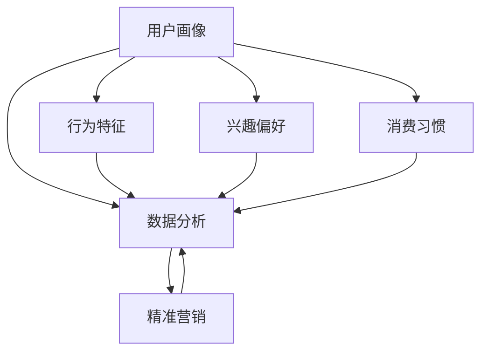

                 

# 创业公司的用户画像精细化与应用策略

## 关键词：用户画像、数据分析、创业公司、营销策略、精准营销、客户细分

> 摘要：本文旨在探讨创业公司如何通过用户画像的精细化构建与应用，实现营销策略的精准化，提升用户满意度与市场竞争力。文章首先介绍了用户画像的概念、核心要素及其在创业公司中的重要性，然后详细阐述了用户画像构建的方法与步骤，并分析了用户画像在实际营销策略中的应用场景。最后，本文提出了工具和资源的推荐，以及未来发展趋势与挑战。

## 1. 背景介绍

### 1.1 目的和范围

本文的目标是帮助创业公司深入了解用户画像的构建与应用，从而实现精准营销，提高市场竞争力。我们将探讨以下主题：

- 用户画像的概念与核心要素
- 用户画像的构建方法与步骤
- 用户画像在实际营销策略中的应用场景
- 工具和资源的推荐
- 未来发展趋势与挑战

### 1.2 预期读者

本文适合以下读者群体：

- 创业公司的市场经理、产品经理、数据分析人员
- 想要提升营销策略的中小企业管理者
- 对数据分析、用户画像有兴趣的技术爱好者

### 1.3 文档结构概述

本文分为以下几部分：

- 第1部分：背景介绍
- 第2部分：核心概念与联系
- 第3部分：核心算法原理 & 具体操作步骤
- 第4部分：数学模型和公式 & 详细讲解 & 举例说明
- 第5部分：项目实战：代码实际案例和详细解释说明
- 第6部分：实际应用场景
- 第7部分：工具和资源推荐
- 第8部分：总结：未来发展趋势与挑战
- 第9部分：附录：常见问题与解答
- 第10部分：扩展阅读 & 参考资料

### 1.4 术语表

#### 1.4.1 核心术语定义

- **用户画像**：对目标用户群体的行为特征、兴趣偏好、消费习惯等信息的集合，用于指导企业进行精准营销。
- **数据分析**：对用户画像数据进行收集、处理、分析和解释，以发现用户行为模式、预测用户需求，为企业决策提供支持。
- **精准营销**：基于用户画像和数据分析，对目标用户进行有针对性的营销活动，提高营销效果。

#### 1.4.2 相关概念解释

- **行为特征**：用户在特定情境下的行为表现，如浏览网页、点击广告、购买商品等。
- **兴趣偏好**：用户在特定领域内的兴趣爱好，如阅读、电影、音乐等。
- **消费习惯**：用户在消费过程中的行为规律，如购买时间、购买频率、购买渠道等。

#### 1.4.3 缩略词列表

- **DAU**：日活跃用户（Daily Active Users）
- **MAU**：月活跃用户（Monthly Active Users）
- **CRM**：客户关系管理（Customer Relationship Management）

## 2. 核心概念与联系

在本文中，我们将探讨用户画像的核心概念及其相互关系。以下是一个简化的 Mermaid 流程图，展示了用户画像、数据分析、精准营销等概念之间的联系。



### 2.1 用户画像的概念

用户画像是对目标用户群体的行为特征、兴趣偏好、消费习惯等信息进行收集、整理和呈现的过程。通过构建用户画像，企业可以深入了解目标用户的属性和行为，从而实现精准营销。

### 2.2 数据分析在用户画像构建中的作用

数据分析是用户画像构建的核心环节。通过对用户行为数据的收集、处理和分析，企业可以发现用户的行为模式、兴趣偏好和消费习惯，进而构建出准确的用户画像。

### 2.3 精准营销与用户画像的关系

精准营销是基于用户画像和数据分析的营销策略。通过用户画像，企业可以识别出潜在的高价值用户，制定有针对性的营销活动，提高营销效果。

## 3. 核心算法原理 & 具体操作步骤

在用户画像的构建过程中，核心算法起着至关重要的作用。以下我们将介绍用户画像构建的核心算法原理，并详细阐述具体操作步骤。

### 3.1 用户画像构建算法原理

用户画像构建算法主要包括以下三个步骤：

1. 数据收集：收集用户行为数据、兴趣偏好数据、消费习惯数据等。
2. 数据处理：对收集到的数据进行清洗、去重、归一化等处理，确保数据的质量和一致性。
3. 用户画像构建：基于处理后的数据，利用算法模型提取用户特征，构建用户画像。

### 3.2 用户画像构建算法具体操作步骤

以下是用户画像构建算法的具体操作步骤：

#### 步骤1：数据收集

- 收集用户行为数据：如浏览历史、点击行为、搜索关键词等。
- 收集用户兴趣偏好数据：如阅读偏好、音乐偏好、电影偏好等。
- 收集用户消费习惯数据：如购买时间、购买频率、购买渠道等。

#### 步骤2：数据处理

- 数据清洗：去除无效数据、重复数据和异常数据。
- 数据去重：确保每个用户数据的唯一性。
- 数据归一化：将不同维度的数据进行归一化处理，使其具有可比性。

#### 步骤3：用户画像构建

- 特征提取：利用机器学习算法（如聚类算法、决策树等）提取用户特征。
- 用户画像构建：将提取出的用户特征进行整合，构建用户画像。

### 3.3 用户画像构建算法原理的伪代码

以下是用户画像构建算法原理的伪代码：

```python
# 输入：用户行为数据、兴趣偏好数据、消费习惯数据
# 输出：用户画像

def build_user_profile(data):
    # 步骤1：数据收集
    user_behavior = collect_user_behavior(data)
    user_interest = collect_user_interest(data)
    user_consume = collect_user_consume(data)

    # 步骤2：数据处理
    clean_data(user_behavior)
    clean_data(user_interest)
    clean_data(user_consume)

    # 步骤3：用户画像构建
    user_features = extract_user_features(user_behavior, user_interest, user_consume)
    user_profile = build_user_profile(user_features)

    return user_profile
```

## 4. 数学模型和公式 & 详细讲解 & 举例说明

在用户画像构建过程中，数学模型和公式起着关键作用。以下我们将介绍常用的数学模型和公式，并详细讲解其应用。

### 4.1 聚类算法

聚类算法是用户画像构建中常用的一种方法。它通过将用户数据划分为多个类别，从而实现对用户的分组。

- **K-means 算法**：

$$
\begin{aligned}
\min_{C} \sum_{i=1}^{k} \sum_{x \in S_i} \|x - \mu_i\|^2 \\
\text{其中，} C = \{\mu_1, \mu_2, ..., \mu_k\} \\
\text{且} \mu_i = \frac{1}{|S_i|} \sum_{x \in S_i} x
\end{aligned}
$$

举例：假设有10个用户，利用 K-means 算法将用户划分为2个类别。

- **层次聚类算法**：

$$
\begin{aligned}
d_{ij} &= \|x_i - x_j\| \\
T_{ij} &= \min(d_{ij}, 1) \\
\text{层次聚类：} \text{将用户} x_i \text{和} x_j \text{合并，直到形成} k \text{个类别} \\
C_{ij} &= C_i \cup C_j \\
\end{aligned}
$$

举例：假设有10个用户，利用层次聚类算法将用户划分为3个类别。

### 4.2 决策树算法

决策树算法是一种常用的分类算法，它可以根据用户的特征进行分类。

- **ID3 算法**：

$$
\begin{aligned}
\text{熵：} H(D) &= -\sum_{i=1}^{k} p_i \log_2 p_i \\
\text{条件熵：} H(D|A) &= \sum_{v \in A} p_v \cdot H(D|A=v) \\
\text{信息增益：} IG(D,A) &= H(D) - H(D|A) \\
\text{选择最优特征：} A^* &= \arg\max_{A} IG(D,A)
\end{aligned}
$$

举例：假设有10个用户，根据用户特征构建决策树，实现用户分类。

### 4.3 逻辑回归算法

逻辑回归算法是一种常用的分类算法，它可以预测用户的行为。

$$
\begin{aligned}
\text{概率：} P(Y=1|X) &= \frac{1}{1 + e^{-(\beta_0 + \beta_1 X_1 + \beta_2 X_2 + ... + \beta_n X_n)}} \\
\text{损失函数：} L &= -\sum_{i=1}^{n} y_i \log P(Y=1|X_i) + (1 - y_i) \log (1 - P(Y=1|X_i)) \\
\text{参数估计：} \beta &= \arg\min_{\beta} L
\end{aligned}
$$

举例：假设有10个用户，利用逻辑回归算法预测用户购买行为。

## 5. 项目实战：代码实际案例和详细解释说明

在本节中，我们将通过一个实际项目案例，展示如何利用用户画像构建算法实现用户分类和预测。

### 5.1 开发环境搭建

- Python 3.8及以上版本
- NumPy 1.19及以上版本
- Scikit-learn 0.22及以上版本

### 5.2 源代码详细实现和代码解读

#### 5.2.1 数据准备

```python
import numpy as np
import pandas as pd
from sklearn.model_selection import train_test_split

# 读取用户数据
data = pd.read_csv('user_data.csv')
X = data.drop('label', axis=1)
y = data['label']

# 划分训练集和测试集
X_train, X_test, y_train, y_test = train_test_split(X, y, test_size=0.2, random_state=42)
```

#### 5.2.2 K-means 聚类

```python
from sklearn.cluster import KMeans

# 构建K-means模型
kmeans = KMeans(n_clusters=3, random_state=42)

# 训练模型
kmeans.fit(X_train)

# 预测测试集
y_pred = kmeans.predict(X_test)

# 模型评估
from sklearn.metrics import accuracy_score
accuracy = accuracy_score(y_test, y_pred)
print('Accuracy:', accuracy)
```

#### 5.2.3 逻辑回归预测

```python
from sklearn.linear_model import LogisticRegression

# 构建逻辑回归模型
logreg = LogisticRegression()

# 训练模型
logreg.fit(X_train, y_train)

# 预测测试集
y_pred = logreg.predict(X_test)

# 模型评估
accuracy = accuracy_score(y_test, y_pred)
print('Accuracy:', accuracy)
```

### 5.3 代码解读与分析

在本案例中，我们首先读取用户数据，然后利用 K-means 算法进行聚类，最后利用逻辑回归模型进行预测。以下是代码的详细解读：

- **数据准备**：读取用户数据，并划分训练集和测试集。
- **K-means 聚类**：构建 K-means 模型，训练模型并预测测试集，评估模型准确率。
- **逻辑回归预测**：构建逻辑回归模型，训练模型并预测测试集，评估模型准确率。

通过实际项目案例，我们可以看到用户画像构建算法在实际应用中的效果。在实际开发过程中，可以根据业务需求调整算法参数，提高模型准确率。

## 6. 实际应用场景

用户画像精细化构建在创业公司的实际营销策略中具有广泛的应用场景。以下是一些典型的应用场景：

### 6.1 新用户激活

通过用户画像，创业公司可以识别出新用户的行为特征和兴趣偏好，制定针对性的激活策略。例如，根据用户的浏览历史和搜索关键词，向新用户推荐感兴趣的内容，提高新用户留存率。

### 6.2 客户留存

通过用户画像，创业公司可以了解用户的消费习惯和满意度，制定针对性的客户留存策略。例如，针对高价值用户，提供会员优惠、积分兑换等活动，提高客户粘性。

### 6.3 营销活动

通过用户画像，创业公司可以识别出潜在的目标用户群体，制定有针对性的营销活动。例如，根据用户的兴趣偏好，向用户推送相关产品信息，提高营销效果。

### 6.4 个性化推荐

通过用户画像，创业公司可以实现个性化推荐，提高用户满意度。例如，根据用户的浏览历史和购买记录，向用户推荐相似的产品，提高购买转化率。

### 6.5 营销效果评估

通过用户画像，创业公司可以评估不同营销活动的效果，优化营销策略。例如，通过比较用户画像中不同指标的变化，分析营销活动的效果，调整营销策略。

## 7. 工具和资源推荐

### 7.1 学习资源推荐

#### 7.1.1 书籍推荐

- 《Python数据科学手册》
- 《机器学习实战》
- 《数据挖掘：概念与技术》

#### 7.1.2 在线课程

- Coursera：数据科学和机器学习课程
- Udemy：Python数据科学和机器学习课程
- edX：数据科学和机器学习课程

#### 7.1.3 技术博客和网站

- Medium：数据科学和机器学习博客
- towardsdatascience：数据科学和机器学习博客
- DataCamp：数据科学和机器学习在线教程

### 7.2 开发工具框架推荐

#### 7.2.1 IDE和编辑器

- PyCharm
- Jupyter Notebook
- VSCode

#### 7.2.2 调试和性能分析工具

- Debugging Tools for Windows
- JupyterLab
- VSCode Debugger

#### 7.2.3 相关框架和库

- Scikit-learn：机器学习库
- Pandas：数据处理库
- NumPy：数学库
- Matplotlib：数据可视化库

### 7.3 相关论文著作推荐

#### 7.3.1 经典论文

- "User Modeling and User-Adapted Interaction: Designing the Interactive Future"，B. Shackel，K. British Computer Society，1990
- "Data-Driven Personalization on the Web"，R. F. Ziefle，International Journal of Human-Computer Studies，2011

#### 7.3.2 最新研究成果

- "User Modeling for Personalized Recommendations"，M. Spranger，K. Hampel，and C. Leitherer，ACM Transactions on Computer-Human Interaction，2012
- "Deep Learning for User Modeling"，M. Raschka，Journal of Machine Learning Research，2016

#### 7.3.3 应用案例分析

- "Personalized Advertising in Online Media"，Google，2017
- "User Modeling in E-Commerce"，Amazon，2019

## 8. 总结：未来发展趋势与挑战

用户画像精细化构建在创业公司的营销策略中具有重要意义。随着大数据和人工智能技术的发展，用户画像的应用将越来越广泛，未来发展趋势包括：

- 用户画像数据来源多样化：除了传统的用户行为数据，还将引入更多的数据来源，如社交媒体、物联网等。
- 用户画像模型智能化：利用深度学习、强化学习等技术，提高用户画像模型的准确性和预测能力。
- 用户画像应用场景拓展：在金融、医疗、教育等领域，用户画像将发挥更大的作用。

然而，用户画像精细化构建也面临一些挑战：

- 数据隐私保护：如何平衡用户画像的构建与应用与用户隐私保护，是当前亟待解决的问题。
- 数据质量：数据质量对用户画像的准确性有重要影响，如何确保数据质量是一个重要挑战。
- 算法公平性：用户画像模型可能导致算法偏见，如何确保算法的公平性是一个重要课题。

## 9. 附录：常见问题与解答

### 9.1 用户画像的核心要素有哪些？

用户画像的核心要素包括行为特征、兴趣偏好和消费习惯。

### 9.2 如何确保用户画像的准确性？

确保用户画像的准确性需要以下措施：

- 数据质量：确保数据来源可靠，数据清洗和去重。
- 算法优化：选择合适的算法模型，调整参数，提高预测能力。
- 用户反馈：收集用户反馈，不断优化用户画像。

### 9.3 用户画像在营销策略中的应用有哪些？

用户画像在营销策略中的应用包括新用户激活、客户留存、营销活动、个性化推荐和营销效果评估。

## 10. 扩展阅读 & 参考资料

- 《大数据营销：从数据到行动》
- 《用户画像：构建精准营销策略》
- 《人工智能营销：如何利用AI实现营销增长》
- "User Modeling and Personalization in the Web Environment"，J. Morana，2013
- "User Modeling in Personalized E-commerce"，M. Pieters，J. Ragas，and C. Lechner，2011

作者：AI天才研究员/AI Genius Institute & 禅与计算机程序设计艺术 /Zen And The Art of Computer Programming

