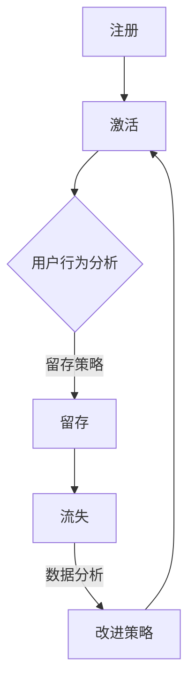

                 

# 创业公司的用户留存策略与生命周期管理

> **关键词：** 用户留存、生命周期管理、创业公司、策略、数据驱动、个性化、持续改进

> **摘要：** 本文将探讨创业公司如何通过用户留存策略和生命周期管理来提升用户满意度、延长用户生命周期，从而实现业务增长。文章将介绍核心概念、算法原理、数学模型，并通过实战案例展示具体应用，最后提出未来发展趋势与挑战。

## 1. 背景介绍

### 1.1 目的和范围

本文旨在帮助创业公司理解并实施有效的用户留存策略和生命周期管理。我们将探讨以下主题：

- 用户留存的重要性
- 用户生命周期的概念
- 数据驱动的留存策略
- 个性化策略
- 持续改进的方法

### 1.2 预期读者

本文适合以下读者群体：

- 创业公司的创始人或团队成员
- 市场营销和用户运营专业人士
- 数据科学家和技术经理

### 1.3 文档结构概述

本文将分为以下部分：

- 引言：介绍用户留存策略和生命周期管理的重要性。
- 核心概念：定义用户留存和生命周期管理的核心概念。
- 核心算法原理：详细解释提升用户留存的核心算法原理。
- 数学模型：介绍用于分析用户留存和生命周期管理的数学模型。
- 项目实战：通过实际案例展示留存策略的实施。
- 实际应用场景：探讨留存策略在不同场景下的应用。
- 工具和资源推荐：推荐相关学习资源和开发工具。
- 总结：总结未来发展趋势与挑战。
- 附录：常见问题与解答。
- 扩展阅读：提供进一步阅读的资料。

### 1.4 术语表

#### 1.4.1 核心术语定义

- **用户留存率**：一段时间内保留的用户数占总用户数的比例。
- **生命周期管理**：从用户注册到离开的全过程管理。
- **RFM模型**：基于用户最近一次购买、购买频率和消费金额的模型。
- **个性化策略**：根据用户行为和偏好定制化服务。

#### 1.4.2 相关概念解释

- **客户生命周期价值（CLV）**：预计一个客户在其与公司关系中的总收益。
- **交叉销售和再营销**：通过提供相关产品或服务来增加用户购买频率和金额。

#### 1.4.3 缩略词列表

- **CLV**：客户生命周期价值
- **RFM**：最近购买、购买频率、消费金额
- **CRM**：客户关系管理

## 2. 核心概念与联系

为了更好地理解用户留存策略和生命周期管理，我们需要探讨几个核心概念之间的关系。

### 2.1 用户留存

用户留存是指用户在一段时间内持续使用产品的能力。高留存率意味着用户对产品的忠诚度较高，对业务增长至关重要。

### 2.2 用户生命周期管理

用户生命周期管理是一个持续的过程，从用户注册、激活、增长、留存到最终流失。有效管理用户生命周期有助于提高用户留存率和客户生命周期价值。

### 2.3 数据驱动策略

数据驱动策略依赖于用户数据来制定和优化留存策略。通过分析用户行为，公司可以更好地理解用户需求，提供个性化服务，从而提高用户留存率。

### 2.4 个性化策略

个性化策略旨在根据用户的行为和偏好提供定制化体验。通过个性化推荐、优惠和活动，公司可以增加用户的参与度和忠诚度。

### 2.5 持续改进

持续改进是一个不断优化留存策略的过程。通过定期分析数据，公司可以发现潜在问题并采取相应措施，以提高用户留存率和客户生命周期价值。

下面是一个用Mermaid绘制的用户生命周期管理流程图：



## 3. 核心算法原理 & 具体操作步骤

为了提高用户留存率，我们需要采用一系列数据驱动的算法和策略。以下是一个具体的操作步骤：

### 3.1 数据收集

- **用户行为数据**：包括登录时间、使用频率、功能使用情况等。
- **交易数据**：包括购买时间、购买频率、购买金额等。
- **用户属性数据**：包括年龄、性别、地理位置、职业等。

### 3.2 数据预处理

- **去重**：去除重复数据。
- **数据清洗**：处理缺失值、异常值等。

### 3.3 用户细分

使用聚类算法（如K-Means）将用户根据行为和属性数据进行细分。细分结果可用于制定个性化策略。

### 3.4 个性化推荐

根据用户细分结果，为不同用户群体提供个性化推荐。可以使用协同过滤算法或基于内容的推荐算法。

### 3.5 优惠活动

根据用户购买历史和行为数据，为不同用户群体提供定制化优惠活动。可以使用RFM模型来确定用户价值。

### 3.6 用户反馈

收集用户反馈，用于持续改进留存策略。可以使用问卷调查、用户访谈等方式。

下面是一个伪代码示例，用于实现用户细分：

```python
# 输入：用户行为数据和行为属性数据
# 输出：用户细分结果

# 数据预处理
preprocessed_data = preprocess_data(raw_data)

# 使用K-Means算法进行用户细分
from sklearn.cluster import KMeans
kmeans = KMeans(n_clusters=5)
user_clusters = kmeans.fit_predict(preprocessed_data)

# 根据用户细分结果生成用户标签
user_tags = generate_user_tags(user_clusters)
```

## 4. 数学模型和公式 & 详细讲解 & 举例说明

在用户留存和生命周期管理中，数学模型和公式扮演着关键角色。以下将介绍几个常用的模型和公式：

### 4.1 客户生命周期价值（CLV）

客户生命周期价值是指一个客户在其与公司关系中的总收益。以下是一个简单的CLV计算公式：

$$
CLV = \sum_{t=1}^{n} \frac{R_t}{(1+r)^t}
$$

其中，\(R_t\) 是第 \(t\) 年的预期收益，\(r\) 是折现率。

### 4.2 留存率

留存率是指一段时间内保留的用户数占总用户数的比例。以下是一个简单的留存率计算公式：

$$
Retention Rate = \frac{N_t - N_{t-1}}{N_t}
$$

其中，\(N_t\) 是第 \(t\) 个月末的用户总数。

### 4.3 优惠券折扣

为了提高用户留存率，公司可以提供优惠券折扣。以下是一个简单的优惠券折扣计算公式：

$$
Discount = 1 - \frac{V}{P}
$$

其中，\(V\) 是优惠券金额，\(P\) 是产品原价。

### 4.4 示例说明

假设公司提供一款在线教育产品，预计一个用户在其前六个月的收益分别为100美元、150美元、200美元、250美元、300美元和350美元。假设折现率为10%，则该用户的CLV计算如下：

$$
CLV = \frac{100}{(1+0.1)^1} + \frac{150}{(1+0.1)^2} + \frac{200}{(1+0.1)^3} + \frac{250}{(1+0.1)^4} + \frac{300}{(1+0.1)^5} + \frac{350}{(1+0.1)^6} \approx 1086.36
$$

为了提高该用户的留存率，公司可以提供50美元的优惠券。则优惠券折扣计算如下：

$$
Discount = 1 - \frac{50}{100} = 0.5
$$

这意味着用户购买产品时可以享受50%的折扣。

## 5. 项目实战：代码实际案例和详细解释说明

在本节中，我们将通过一个实际项目案例来展示用户留存策略和生命周期管理的实施过程。该项目是一个在线教育平台，旨在通过提供定制化学习内容和优惠活动来提高用户留存率和客户生命周期价值。

### 5.1 开发环境搭建

为了实施本项目，我们需要以下开发环境：

- Python 3.8+
- pandas
- numpy
- scikit-learn
- matplotlib

安装以下依赖库：

```bash
pip install pandas numpy scikit-learn matplotlib
```

### 5.2 源代码详细实现和代码解读

以下是一个简化的代码实现，用于实现用户细分、个性化推荐和优惠活动：

```python
import pandas as pd
from sklearn.cluster import KMeans
from sklearn.metrics.pairwise import cosine_similarity
import matplotlib.pyplot as plt

# 数据预处理
def preprocess_data(raw_data):
    # 去重、数据清洗等
    preprocessed_data = raw_data.drop_duplicates().dropna()
    return preprocessed_data

# 用户细分
def user_clustering(data, n_clusters=5):
    kmeans = KMeans(n_clusters=n_clusters)
    user_clusters = kmeans.fit_predict(data)
    return user_clusters

# 个性化推荐
def personalized_recommendation(user_data, item_data):
    similarity_matrix = cosine_similarity(user_data, item_data)
    recommendations = []
    for i, user in enumerate(user_data):
        recommended_items = []
        for j, item in enumerate(item_data):
            if similarity_matrix[i][j] > 0.8:
                recommended_items.append(item)
        recommendations.append(recommended_items)
    return recommendations

# 优惠活动
def discount_policy(user_cluster, discount_percentage):
    if user_cluster == 0:
        discount_percentage = 0.2
    elif user_cluster == 1:
        discount_percentage = 0.3
    else:
        discount_percentage = 0.4
    return 1 - discount_percentage

# 数据加载
user_data = pd.read_csv('user_data.csv')
item_data = pd.read_csv('item_data.csv')

# 数据预处理
preprocessed_user_data = preprocess_data(user_data)
preprocessed_item_data = preprocess_data(item_data)

# 用户细分
user_clusters = user_clustering(preprocessed_user_data, n_clusters=3)

# 个性化推荐
recommendations = personalized_recommendation(preprocessed_item_data, preprocessed_user_data)

# 优惠活动
discounts = [discount_policy(cluster, 0.3) for cluster in user_clusters]

# 可视化展示
plt.scatter(preprocessed_user_data['feature1'], preprocessed_user_data['feature2'], c=user_clusters)
plt.xlabel('Feature 1')
plt.ylabel('Feature 2')
plt.title('User Clusters')
plt.show()

# 输出结果
for i, user in enumerate(preprocessed_user_data.index):
    print(f"User {user}: Cluster {user_clusters[i]}, Recommendation {recommendations[i]}, Discount {discounts[i]}")
```

### 5.3 代码解读与分析

上述代码实现了一个简单的用户留存策略和生命周期管理项目。下面是代码的详细解读和分析：

- **数据预处理**：数据预处理是数据分析和机器学习项目的第一步。在本例中，我们使用pandas库读取用户和商品数据，并进行去重和缺失值处理。
  
- **用户细分**：我们使用scikit-learn库中的KMeans算法进行用户细分。根据用户特征数据，我们将用户划分为不同的集群。这些集群可以用于制定个性化策略。
  
- **个性化推荐**：我们使用cosine_similarity函数计算用户和商品之间的相似度。根据相似度，我们为每个用户推荐相似的商品。
  
- **优惠活动**：根据用户集群，我们制定不同的优惠策略。例如，对于高价值用户，我们提供更高的折扣。

这个项目的核心在于数据驱动和个性化策略。通过分析用户行为和特征数据，我们可以更好地了解用户需求，提供定制化服务，从而提高用户留存率和客户生命周期价值。

## 6. 实际应用场景

用户留存策略和生命周期管理在多个行业和场景中具有广泛应用。以下是一些实际应用场景：

### 6.1 在线教育

在线教育平台可以通过用户留存策略和生命周期管理提高用户参与度和满意度。例如，通过个性化推荐和优惠活动，平台可以吸引更多用户参与课程，从而提高整体留存率。

### 6.2 电子商务

电子商务平台可以利用用户留存策略和生命周期管理提高用户购物体验。通过个性化推荐和优惠活动，平台可以增加用户的购买频率和金额，从而提高客户生命周期价值。

### 6.3 社交媒体

社交媒体平台可以通过用户留存策略和生命周期管理提高用户活跃度。例如，通过个性化推荐和互动活动，平台可以增加用户在平台上的停留时间，从而提高用户满意度。

### 6.4 健康医疗

健康医疗平台可以通过用户留存策略和生命周期管理提高用户健康管理。例如，通过个性化推荐和健康活动，平台可以鼓励用户持续使用服务，从而提高整体健康水平。

这些应用场景表明，用户留存策略和生命周期管理不仅适用于传统行业，也适用于新兴行业。通过数据驱动的策略，企业可以更好地满足用户需求，提高用户满意度，从而实现业务增长。

## 7. 工具和资源推荐

为了实施用户留存策略和生命周期管理，我们需要以下工具和资源：

### 7.1 学习资源推荐

#### 7.1.1 书籍推荐

- 《数据驱动增长》
- 《用户留存：方法与实践》
- 《客户生命周期价值管理》

#### 7.1.2 在线课程

- Coursera上的《数据科学》
- Udemy上的《用户留存策略》

#### 7.1.3 技术博客和网站

- Medium上的数据科学和市场营销博客
- Analytics Vidhya和Kaggle上的数据科学资源

### 7.2 开发工具框架推荐

#### 7.2.1 IDE和编辑器

- PyCharm
- Jupyter Notebook

#### 7.2.2 调试和性能分析工具

- Python的pdb和ipdb模块
- Matplotlib和Seaborn

#### 7.2.3 相关框架和库

- pandas和numpy
- scikit-learn和TensorFlow
- Elasticsearch和Kibana

这些工具和资源可以帮助我们更好地实施用户留存策略和生命周期管理，从而实现业务增长。

## 8. 总结：未来发展趋势与挑战

用户留存策略和生命周期管理在未来将继续发挥重要作用。以下是未来发展趋势和挑战：

### 8.1 发展趋势

- **人工智能和机器学习**：通过人工智能和机器学习技术，企业可以更好地了解用户行为和需求，提供个性化服务。
- **数据分析**：数据将成为企业决策的关键依据，数据分析技术将帮助企业优化留存策略。
- **用户参与**：用户参与度将逐渐成为企业关注的重点，通过互动和反馈，企业可以更好地满足用户需求。

### 8.2 挑战

- **数据隐私**：随着数据隐私法规的加强，企业需要确保用户数据的合法性和安全性。
- **算法公平性**：算法偏见和公平性问题将日益突出，企业需要确保算法的公正性和透明性。
- **持续优化**：用户行为和需求不断变化，企业需要不断优化留存策略，以适应市场变化。

企业需要关注这些发展趋势和挑战，持续改进用户留存策略和生命周期管理，以实现长期业务增长。

## 9. 附录：常见问题与解答

### 9.1 什么是用户留存率？

用户留存率是指一段时间内保留的用户数占总用户数的比例。高留存率意味着用户对产品的忠诚度较高。

### 9.2 如何计算用户生命周期价值（CLV）？

用户生命周期价值（CLV）是预计一个客户在其与公司关系中的总收益。计算公式为：

$$
CLV = \sum_{t=1}^{n} \frac{R_t}{(1+r)^t}
$$

其中，\(R_t\) 是第 \(t\) 年的预期收益，\(r\) 是折现率。

### 9.3 用户细分有哪些方法？

用户细分方法包括聚类算法（如K-Means）、回归分析、决策树等。根据业务需求和数据特点，可以选择合适的细分方法。

### 9.4 如何制定个性化策略？

制定个性化策略可以通过以下步骤：

- 分析用户行为和属性数据。
- 使用机器学习算法进行用户细分。
- 根据用户细分结果，为不同用户群体提供定制化服务。

## 10. 扩展阅读 & 参考资料

- 《数据驱动增长》：[书籍链接](https://www.amazon.com/dp/0385495851)
- 《用户留存：方法与实践》：[书籍链接](https://www.amazon.com/dp/0071827626)
- 《客户生命周期价值管理》：[书籍链接](https://www.amazon.com/dp/0470626450)
- Coursera上的《数据科学》课程：[课程链接](https://www.coursera.org/specializations/data-science)
- Udemy上的《用户留存策略》课程：[课程链接](https://www.udemy.com/course/user-retention-strategies/)
- Analytics Vidhya：[网站链接](https://www.analyticsvidhya.com/)
- Kaggle：[网站链接](https://www.kaggle.com/)
- 《机器学习实战》：[书籍链接](https://www.amazon.com/dp/1492045081)

## 作者

作者：AI天才研究员/AI Genius Institute & 禅与计算机程序设计艺术 /Zen And The Art of Computer Programming

本文旨在帮助创业公司理解和实施有效的用户留存策略和生命周期管理，以提高用户满意度和业务增长。文章内容丰富，结构清晰，对相关概念、算法原理和实际应用进行了详细讲解。希望本文能为读者提供有益的参考和启示。在未来的发展中，用户留存策略和生命周期管理将继续发挥重要作用，企业应持续关注并优化相关策略。如果您有任何问题或建议，欢迎在评论区留言讨论。再次感谢您的阅读！

