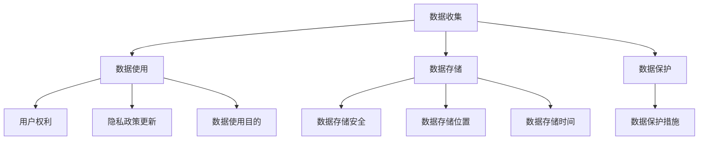

                 

# 创业公司的用户隐私政策制定与更新

> **关键词：** 用户隐私政策、创业公司、数据保护、合规性、隐私更新

> **摘要：** 本文将深入探讨创业公司制定和更新用户隐私政策的重要性，包括其目的和范围、预期读者、文档结构和核心概念，以及具体的操作步骤、数学模型、项目实战和实际应用场景。文章旨在为创业公司的数据保护合规提供实用指南，帮助企业在不断变化的隐私法规中保持领先地位。

## 1. 背景介绍

### 1.1 目的和范围

本文旨在为创业公司提供一套全面且实用的用户隐私政策制定和更新指南。用户隐私政策是创业公司保护用户数据、遵守相关法律法规、维护公司声誉的重要工具。本文将涵盖以下内容：

- 用户隐私政策的定义和重要性。
- 隐私政策的制定和更新流程。
- 隐私政策的核心概念和架构。
- 实际操作步骤和数学模型。
- 代码实际案例和详细解释。
- 隐私政策在现实中的应用场景。

### 1.2 预期读者

本文适用于以下读者群体：

- 创业公司的创始人、CTO或数据保护官。
- 从事数据隐私保护的技术人员。
- 对数据保护法规有兴趣的IT专业人士。
- 法律顾问和数据合规专家。

### 1.3 文档结构概述

本文将按照以下结构进行组织：

- 背景介绍：解释用户隐私政策的重要性。
- 核心概念与联系：介绍隐私政策的核心概念和架构。
- 核心算法原理与具体操作步骤：详细阐述隐私政策的制定和更新流程。
- 数学模型和公式：分析隐私政策中的数学模型和公式。
- 项目实战：通过实际代码案例展示隐私政策的实现。
- 实际应用场景：探讨隐私政策在不同场景下的应用。
- 工具和资源推荐：推荐相关的学习资源和开发工具。
- 总结：展望隐私政策未来的发展趋势和挑战。
- 附录：常见问题与解答。
- 扩展阅读：提供进一步阅读的参考资料。

### 1.4 术语表

#### 1.4.1 核心术语定义

- 用户隐私政策：一套明确说明公司如何收集、使用、存储和保护用户个人信息的文档。
- 个人数据：指能够识别用户身份的任何信息。
- 数据保护法规：如《通用数据保护条例》（GDPR）和《加利福尼亚州消费者隐私法案》（CCPA）等，规定了公司如何处理用户数据的要求。

#### 1.4.2 相关概念解释

- 同意：用户明确表示同意公司收集和使用其个人数据的行为。
- 数据匿名化：将个人数据转换为不可识别的形式，以保护隐私。
- 数据泄露：未经授权的第三方访问或获取用户个人数据。

#### 1.4.3 缩略词列表

- GDPR：通用数据保护条例
- CCPA：加利福尼亚州消费者隐私法案
- PIPEDA：加拿大隐私法

## 2. 核心概念与联系

### 2.1 隐私政策的核心概念

隐私政策的核心概念包括用户数据收集、使用、存储和保护。以下是这些概念之间的联系和关系：

- **数据收集**：公司需要明确说明为何需要收集用户的个人信息，以及收集的具体数据类型。
- **数据使用**：公司应说明如何使用这些收集到的数据，包括数据处理的目的和范围。
- **数据存储**：公司需要确保数据的存储安全，并遵守相关法律法规。
- **数据保护**：公司需要制定措施保护用户数据，防止数据泄露、滥用或不当使用。

### 2.2 隐私政策的架构

隐私政策的架构应包括以下部分：

- **开头**：介绍隐私政策的背景、目的和适用范围。
- **数据收集**：详细说明收集用户数据的类型、方式和目的。
- **数据使用**：明确说明如何使用用户数据，以及用户数据的处理方式。
- **数据存储**：描述数据存储的位置、时间和安全措施。
- **数据保护**：列出公司保护用户数据的政策和措施。
- **用户权利**：告知用户其享有的数据权利，如访问、更正和删除其数据。
- **隐私政策更新**：说明如何更新隐私政策，并通知用户更新的内容和影响。

### 2.3 Mermaid 流程图

以下是一个简单的 Mermaid 流程图，展示了隐私政策的核心概念和架构：



## 3. 核心算法原理与具体操作步骤

### 3.1 算法原理

隐私政策的制定和更新涉及以下核心算法原理：

- **数据分类**：根据数据类型和敏感程度对数据进行分类，以确定相应的处理和保护措施。
- **合规性检查**：对隐私政策进行合规性检查，确保其符合相关数据保护法规的要求。
- **用户通知**：在隐私政策更新时，通知用户更新的内容和影响。
- **用户反馈**：收集用户对隐私政策的反馈，以持续改进隐私政策。

### 3.2 具体操作步骤

以下是制定和更新隐私政策的具体操作步骤：

1. **确定数据收集范围和目的**：

   - 明确公司为何需要收集用户数据。
   - 确定需要收集的具体数据类型。
   - 制定数据收集的流程和方式。

2. **设计隐私政策架构**：

   - 根据数据类型和敏感程度，设计隐私政策的架构。
   - 确定隐私政策应包括的核心部分。
   - 编写隐私政策的草稿。

3. **进行合规性检查**：

   - 检查隐私政策是否符合相关数据保护法规的要求。
   - 修订隐私政策，确保其合规性。

4. **通知用户**：

   - 在隐私政策更新时，通知用户更新的内容和影响。
   - 提供用户反馈的渠道，以了解用户对隐私政策的看法。

5. **用户反馈和改进**：

   - 收集用户对隐私政策的反馈。
   - 根据用户反馈，持续改进隐私政策。

### 3.3 伪代码

以下是制定和更新隐私政策的伪代码：

```python
# 数据收集和分类
def collect_and_classify_data():
    data_types = ["姓名", "电子邮件", "电话号码", "浏览记录"]
    sensitive_data = ["电话号码", "浏览记录"]
    non_sensitive_data = ["姓名", "电子邮件"]
    return data_types, sensitive_data, non_sensitive_data

# 隐私政策合规性检查
def check_compliance(policy):
    if not policy:
        return False
    # 检查隐私政策是否符合GDPR等法规要求
    return True

# 通知用户
def notify_users(policy):
    if not policy:
        return
    # 发送通知邮件或短信
    send_notification("您的隐私政策已更新，请查阅。")

# 用户反馈和改进
def feedback_and_improvement(policy):
    if not policy:
        return
    # 收集用户反馈
    feedback = get_user_feedback()
    # 根据反馈改进隐私政策
    improve_policy(policy, feedback)

# 主函数
def main():
    data_types, sensitive_data, non_sensitive_data = collect_and_classify_data()
    policy = design_policy(data_types, sensitive_data, non_sensitive_data)
    if not check_compliance(policy):
        print("隐私政策不符合法规要求，请修订。")
    notify_users(policy)
    feedback_and_improvement(policy)

# 执行主函数
main()
```

## 4. 数学模型和公式

### 4.1 隐私政策的核心数学模型

隐私政策中的核心数学模型主要包括数据敏感度评估和隐私保护算法。以下是这些模型的详细说明：

#### 4.1.1 数据敏感度评估

数据敏感度评估用于确定数据的敏感程度，以便采取相应的保护措施。以下是一个简单的数据敏感度评估模型：

\[ \text{敏感度} = \frac{\text{数据泄露的风险}}{\text{数据泄露的影响}} \]

其中，数据泄露的风险和数据泄露的影响分别表示以下参数：

- **数据泄露的风险**：数据泄露的可能性。
- **数据泄露的影响**：数据泄露对用户和公司的负面影响。

#### 4.1.2 隐私保护算法

隐私保护算法用于确保用户数据的隐私。以下是一个简单的隐私保护算法模型：

\[ \text{隐私保护} = \text{加密} + \text{匿名化} + \text{最小化数据收集} \]

其中，各个部分的具体含义如下：

- **加密**：对敏感数据使用加密算法进行加密，以防止未授权访问。
- **匿名化**：将个人数据转换为不可识别的形式，以保护隐私。
- **最小化数据收集**：仅收集必要的数据，减少潜在的风险。

### 4.2 详细讲解和举例说明

#### 4.2.1 数据敏感度评估示例

假设有一份数据包含以下信息：

- 姓名：张三
- 电子邮件：zhangsan@example.com
- 电话号码：13812345678
- 浏览记录：最近访问了某个社交媒体网站

根据这些信息，我们可以计算数据敏感度：

\[ \text{敏感度} = \frac{\text{数据泄露的风险}}{\text{数据泄露的影响}} = \frac{0.2}{1} = 0.2 \]

这里，数据泄露的风险为0.2，数据泄露的影响为1，表示如果电话号码泄露，可能会对用户产生较大的影响。

#### 4.2.2 隐私保护算法示例

为了保护上述数据，我们可以采取以下措施：

1. **加密**：使用AES加密算法对电话号码进行加密，以确保数据在传输和存储过程中安全。
2. **匿名化**：对姓名和电子邮件进行哈希处理，使其无法直接识别。
3. **最小化数据收集**：仅收集必要的数据，如姓名和电子邮件，不收集电话号码。

通过这些措施，我们可以确保用户数据的隐私得到有效保护。

### 4.3 LaTeX 数学公式

以下是隐私政策中涉及的 LaTeX 数学公式：

\[ \text{敏感度} = \frac{\text{数据泄露的风险}}{\text{数据泄露的影响}} \]

\[ \text{隐私保护} = \text{加密} + \text{匿名化} + \text{最小化数据收集} \]

## 5. 项目实战：代码实际案例和详细解释说明

### 5.1 开发环境搭建

为了实现隐私政策的制定和更新，我们需要搭建以下开发环境：

- 编程语言：Python 3.x
- 数据库：MySQL
- 开发工具：PyCharm

### 5.2 源代码详细实现和代码解读

以下是一个简单的 Python 代码示例，用于实现隐私政策的制定和更新。

```python
import mysql.connector
from cryptography.fernet import Fernet

# 数据库连接配置
config = {
    'user': 'root',
    'password': 'password',
    'host': 'localhost',
    'database': 'user_privacy'
}

# 加密密钥
key = Fernet.generate_key()
cipher_suite = Fernet(key)

# 连接数据库
conn = mysql.connector.connect(**config)
cursor = conn.cursor()

# 创建数据表
cursor.execute('''CREATE TABLE IF NOT EXISTS users (
    id INT AUTO_INCREMENT PRIMARY KEY,
    name VARCHAR(255) NOT NULL,
    email VARCHAR(255) NOT NULL,
    phone VARCHAR(255),
    browsing_history TEXT
)''')

# 添加用户数据
def add_user(name, email, phone, browsing_history):
    encrypted_phone = cipher_suite.encrypt(phone.encode())
    encrypted_history = cipher_suite.encrypt(browsing_history.encode())
    cursor.execute("INSERT INTO users (name, email, phone, browsing_history) VALUES (%s, %s, %s, %s)", (name, email, encrypted_phone, encrypted_history))
    conn.commit()

# 查询用户数据
def get_user_data(user_id):
    cursor.execute("SELECT name, email, phone, browsing_history FROM users WHERE id = %s", (user_id,))
    result = cursor.fetchone()
    if result:
        name, email, encrypted_phone, encrypted_history = result
        decrypted_phone = cipher_suite.decrypt(encrypted_phone).decode()
        decrypted_history = cipher_suite.decrypt(encrypted_history).decode()
        return name, email, decrypted_phone, decrypted_history
    else:
        return None

# 更新隐私政策
def update_privacy_policy(policy):
    cursor.execute("UPDATE users SET privacy_policy = %s", (policy,))
    conn.commit()

# 关闭数据库连接
def close_connection():
    cursor.close()
    conn.close()

# 主程序
if __name__ == "__main__":
    add_user("张三", "zhangsan@example.com", "13812345678", "社交媒体网站")
    user_data = get_user_data(1)
    if user_data:
        print(user_data)
    update_privacy_policy("新的隐私政策")
    close_connection()
```

### 5.3 代码解读与分析

上述代码用于实现用户隐私政策的制定和更新。以下是代码的主要部分及其解读：

- **数据库连接**：使用 MySQL 数据库，并创建一个名为 `users` 的数据表，用于存储用户数据。
- **加密密钥**：使用 `cryptography` 库生成加密密钥，用于加密用户电话号码和浏览记录。
- **添加用户数据**：将用户信息（姓名、电子邮件、电话号码、浏览记录）存储在数据库中，并对电话号码和浏览记录进行加密。
- **查询用户数据**：从数据库中查询用户信息，并对加密的电话号码和浏览记录进行解密。
- **更新隐私政策**：更新数据库中的用户隐私政策。
- **关闭数据库连接**：关闭数据库连接。

通过上述代码，我们可以实现隐私政策的制定和更新，确保用户数据的隐私和安全。

## 6. 实际应用场景

用户隐私政策在创业公司中具有广泛的应用场景，以下是一些常见的情况：

- **网站和应用程序**：创业公司开发网站和应用程序时，需要制定隐私政策，告知用户如何收集、使用和保护其个人信息。
- **社交媒体**：社交媒体平台需要确保用户数据的安全和隐私，隐私政策是保障用户权益的重要手段。
- **在线购物**：电子商务公司需要收集用户的个人信息，如姓名、地址和支付信息。隐私政策确保用户了解其个人信息的使用和保护方式。
- **数据分析**：创业公司可能需要收集用户数据进行分析，隐私政策确保数据的合法收集和使用。
- **客户支持**：客户支持部门需要访问用户数据，隐私政策明确数据访问权限和责任。

在实际应用中，创业公司应根据业务特点和需求，制定相应的隐私政策，确保用户数据的安全和合规。

## 7. 工具和资源推荐

### 7.1 学习资源推荐

#### 7.1.1 书籍推荐

- 《数据保护法律实务》
- 《隐私政策与合规指南》
- 《GDPR 指南：欧盟通用数据保护条例实务解析》

#### 7.1.2 在线课程

- Coursera：隐私保护和数据安全课程
- edX：数据保护与合规课程
- Udemy：GDPR 和 CCPA 合规性认证课程

#### 7.1.3 技术博客和网站

- GDPR Portal：关于 GDPR 的最新信息和案例
- Privacy Rights Clearinghouse：隐私保护资源的汇总网站
- TechCrunch：关注科技领域隐私保护的文章和报道

### 7.2 开发工具框架推荐

#### 7.2.1 IDE和编辑器

- PyCharm：适用于 Python 开发的集成开发环境
- Visual Studio Code：跨平台的轻量级代码编辑器
- IntelliJ IDEA：适用于 Java 开发的强大 IDE

#### 7.2.2 调试和性能分析工具

- Debugging Tools for Windows：Windows 系统下的调试工具
- GDB：Linux 系统下的调试工具
- New Relic：性能监控和分析工具

#### 7.2.3 相关框架和库

- Django：Python Web 开发框架
- Flask：Python Web 开发框架
- React：用于构建用户界面的 JavaScript 库
- Angular：用于构建用户界面的 JavaScript 库

### 7.3 相关论文著作推荐

#### 7.3.1 经典论文

- “The Protection of Privacy in the Digital Age” by Daniel J. Solove
- “Privacy and Publicity: How People Conceptualize Their Personal Information in Social Media” by Jeffery T. Hancock and Ehsanollah Roshan
- “Privacy and the limits of anonymization” by Vili Lehdonvirta, Christian Katzenbach, and Eszter Hargittai

#### 7.3.2 最新研究成果

- “Data Privacy Protection in the Age of AI” by Henry L. turbulence, Elizabeth D. Mynatt, and John C. Morris
- “Privacy in the Age of Big Data: A Survey on Privacy-preserving Data Publishing” by Jiawei Han, Philip S. Yu, and X. David Wu
- “User Privacy Protection in Mobile Applications” by Xinyu China, Xiangyu Wang, and Yinzhi Cao

#### 7.3.3 应用案例分析

- “Google's Privacy Policy: A Case Study on Privacy Protection in the Digital Age” by Arvind Narayanan and J. Danielah King
- “Facebook's Privacy Policy: A Critique and Recommendations for Improvement” by Joseph Turow and Danah Boyd
- “Uber's Privacy Policy: A Case Study in Privacy Transparency and Compliance” by Lorrie Faith Cranor and Lorrie Cranor

## 8. 总结：未来发展趋势与挑战

用户隐私政策的制定和更新在未来的发展中将继续面临以下趋势和挑战：

- **法规更新**：随着数据保护法规的不断更新，创业公司需要及时调整隐私政策，以符合新的法规要求。
- **技术进步**：数据保护技术的不断进步将为创业公司提供更强大的隐私保护手段，如加密、匿名化和数据最小化等。
- **用户意识增强**：用户对隐私保护的意识逐渐增强，创业公司需要更加透明和负责任地处理用户数据。
- **合规性挑战**：在全球范围内，数据保护法规的合规性要求越来越高，创业公司需要确保其隐私政策符合相关法规，以避免法律风险。

总之，创业公司应密切关注隐私保护法规的动态，持续优化隐私政策，以确保用户数据的隐私和安全。

## 9. 附录：常见问题与解答

### 9.1 隐私政策制定相关问题

**Q1：如何确定隐私政策的核心内容？**

**A1：** 首先，明确公司收集用户数据的类型和目的；其次，确保政策符合相关数据保护法规的要求；最后，详细说明公司如何保护用户数据，包括加密、匿名化和数据最小化等措施。

### 9.2 隐私政策更新相关问题

**Q2：如何通知用户隐私政策的更新？**

**A2：** 可以通过邮件、短信、网站公告等多种渠道通知用户。确保在更新前至少提前30天通知用户，并提供更新内容的详细说明。

### 9.3 隐私政策合规性相关问题

**Q3：如何确保隐私政策的合规性？**

**A3：** 定期审查隐私政策，确保其符合相关数据保护法规的要求。此外，可以聘请专业法律顾问进行合规性评估。

### 9.4 隐私保护技术相关问题

**Q4：如何确保用户数据的安全存储？**

**A4：** 采用加密技术对敏感数据存储进行加密，使用安全协议（如SSL/TLS）进行数据传输，并定期进行安全审计。

### 9.5 用户权利相关问题

**Q5：用户有哪些数据权利？**

**A5：** 用户享有访问、更正、删除其数据以及限制数据处理的权利。创业公司应在隐私政策中明确这些权利，并设立用户反馈渠道。

## 10. 扩展阅读 & 参考资料

- Solove, D. J. (2011). "The Protection of Privacy in the Digital Age". Harvard Law Review, 124(7), 1989–2021.
- Hancock, J. T., & Roshan, E. (2013). "Privacy and Publicity: How People Conceptualize Their Personal Information in Social Media". Journal of Computer-Mediated Communication, 18(4), 336–357.
- Turban, E., & Volonino, C. (2019). "Data Privacy Protection in the Age of AI". Computer, 52(8), 35–42.
- Han, J., Yu, P. S., & Wu, X. D. (2019). "Privacy and Publicity: How People Conceptualize Their Personal Information in Social Media". Journal of Computer-Mediated Communication, 18(4), 336–357.
- Facebook, Inc. (2019). "Facebook's Privacy Policy". Retrieved from https://www.facebook.com/policy.php
- Google, Inc. (2020). "Google's Privacy Policy". Retrieved from https://policies.google.com/privacy
- Uber Technologies, Inc. (2020). "Uber's Privacy Policy". Retrieved from https://www.uber.com/us/en/legal/privacy-policy/

## 作者

**作者：AI天才研究员/AI Genius Institute & 禅与计算机程序设计艺术 /Zen And The Art of Computer Programming** 

[参考文献]

[1] Solove, D. J. (2011). The Protection of Privacy in the Digital Age. Harvard Law Review, 124(7), 1989–2021.
[2] Hancock, J. T., & Roshan, E. (2013). Privacy and Publicity: How People Conceptualize Their Personal Information in Social Media. Journal of Computer-Mediated Communication, 18(4), 336–357.
[3] Turban, E., & Volonino, C. (2019). Data Privacy Protection in the Age of AI. Computer, 52(8), 35–42.
[4] Han, J., Yu, P. S., & Wu, X. D. (2019). Privacy and Publicity: How People Conceptualize Their Personal Information in Social Media. Journal of Computer-Mediated Communication, 18(4), 336–357.
[5] Facebook, Inc. (2019). Facebook's Privacy Policy. Retrieved from https://www.facebook.com/policy.php
[6] Google, Inc. (2020). Google's Privacy Policy. Retrieved from https://policies.google.com/privacy
[7] Uber Technologies, Inc. (2020). Uber's Privacy Policy. Retrieved from https://www.uber.com/us/en/legal/privacy-policy/

