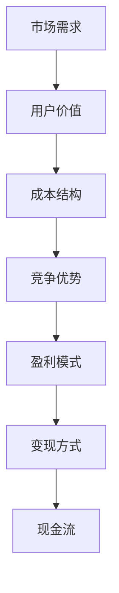

                 

# 创业公司的盈利模式探索与实践

> **关键词：** 创业公司、盈利模式、商业策略、市场分析、用户价值、变现方式

> **摘要：** 本文将深入探讨创业公司如何通过多种盈利模式实现商业成功。通过分析市场现状、用户需求、成本结构和竞争优势，结合实际案例，本文将提供一套系统化的盈利模式探索与实践指南，助力创业公司找到适合自己的盈利路径。

## 1. 背景介绍

### 1.1 目的和范围

本文旨在帮助创业公司明确盈利模式的选择与实施策略。我们将从以下几个方面展开讨论：

1. **市场分析**：了解行业趋势、竞争对手和用户需求，为盈利模式的选择提供依据。
2. **用户价值**：挖掘用户痛点，提供解决方案，并通过增值服务实现盈利。
3. **成本结构**：优化成本管理，提高利润空间。
4. **竞争优势**：通过差异化策略，建立竞争壁垒。
5. **变现方式**：探索多种变现途径，实现现金流。

### 1.2 预期读者

本文适合以下读者群体：

- **创业公司创始人**：希望了解如何制定有效的盈利模式。
- **市场营销人员**：希望掌握市场分析技巧，提升用户价值。
- **财务人员**：希望了解成本结构和利润分析。
- **产品经理**：希望从商业角度优化产品设计。

### 1.3 文档结构概述

本文结构如下：

1. **背景介绍**：概述创业公司盈利模式的重要性。
2. **核心概念与联系**：介绍与盈利模式相关的基本概念。
3. **核心算法原理 & 具体操作步骤**：阐述盈利模式设计的方法论。
4. **数学模型和公式 & 详细讲解 & 举例说明**：通过公式和案例解释盈利模式。
5. **项目实战：代码实际案例和详细解释说明**：提供实际操作指南。
6. **实际应用场景**：探讨不同场景下的盈利模式实施。
7. **工具和资源推荐**：推荐学习资源和开发工具。
8. **总结：未来发展趋势与挑战**：展望创业公司盈利模式的未来。
9. **附录：常见问题与解答**：解答常见疑问。
10. **扩展阅读 & 参考资料**：提供进一步学习的资源。

### 1.4 术语表

#### 1.4.1 核心术语定义

- **盈利模式**：企业通过何种方式获取利润的商业模式。
- **用户价值**：用户在使用产品或服务时所感受到的价值。
- **成本结构**：企业生产和运营的成本构成。
- **竞争优势**：企业在市场中相对于竞争对手的优势。

#### 1.4.2 相关概念解释

- **市场规模**：市场潜在客户的总数。
- **市场占有率**：企业在市场中所占的比例。
- **用户生命周期价值**：用户为企业带来的全部利润。

#### 1.4.3 缩略词列表

- **CRM**：客户关系管理
- **ERP**：企业资源规划
- **SaaS**：软件即服务

## 2. 核心概念与联系

创业公司的盈利模式设计需要考虑多个核心概念及其相互联系。以下是一个简化的 Mermaid 流程图，展示了这些核心概念：



### 2.1 市场需求

市场需求是创业公司盈利模式设计的第一步。通过市场调研，了解行业趋势、市场规模、竞争对手和潜在客户需求。以下步骤可以帮助确定市场需求：

1. **市场趋势分析**：通过行业报告、市场调研和专家访谈，了解当前市场趋势和未来发展方向。
2. **竞争对手分析**：分析竞争对手的市场策略、产品特点、优势和劣势。
3. **用户需求调研**：通过问卷调查、用户访谈和焦点小组，了解目标用户的需求和痛点。

### 2.2 用户价值

用户价值是创业公司盈利模式设计的核心。通过提供有价值的解决方案，满足用户需求，从而实现盈利。以下步骤可以帮助挖掘用户价值：

1. **痛点分析**：识别用户在使用现有产品或服务时所遇到的痛点。
2. **解决方案设计**：根据痛点，设计创新的产品或服务。
3. **价值评估**：评估解决方案对用户的吸引力，确保其具有市场潜力。

### 2.3 成本结构

成本结构是创业公司盈利模式设计的重要环节。通过优化成本结构，提高利润空间。以下步骤可以帮助优化成本结构：

1. **成本分类**：将成本分为固定成本和可变成本。
2. **成本控制**：通过采购策略、生产流程优化和人力资源管理，降低成本。
3. **成本效益分析**：评估成本优化措施的效果，确保其不会影响产品质量。

### 2.4 竞争优势

竞争优势是创业公司盈利模式设计的关键。通过差异化策略，建立竞争壁垒，确保市场地位。以下步骤可以帮助建立竞争优势：

1. **产品差异化**：通过技术创新、品牌定位和用户体验，使产品与众不同。
2. **市场定位**：明确目标市场，针对特定用户群体提供定制化产品或服务。
3. **品牌建设**：通过品牌宣传和口碑营销，提高品牌知名度。

### 2.5 盈利模式

盈利模式是创业公司实现盈利的核心。根据市场需求、用户价值和成本结构，选择合适的盈利模式。以下步骤可以帮助设计盈利模式：

1. **盈利模式选择**：根据企业特点和市场需求，选择适合的盈利模式。
2. **商业模式创新**：通过商业模式创新，提高盈利能力。
3. **盈利模式验证**：通过市场测试和用户反馈，验证盈利模式的有效性。

### 2.6 变现方式

变现方式是实现现金流的重要途径。根据盈利模式，选择合适的变现方式。以下步骤可以帮助设计变现方式：

1. **产品定价**：根据成本结构和市场需求，设定合理的价格。
2. **销售渠道**：选择合适的销售渠道，如直销、代理、电商平台等。
3. **现金流管理**：通过现金流预测和资金管理，确保企业有稳定的现金流。

## 3. 核心算法原理 & 具体操作步骤

盈利模式设计是一个系统性工程，涉及多个方面。以下是一个简化的盈利模式设计算法，用于指导创业公司如何选择和实施盈利模式。

### 3.1 算法原理

盈利模式设计的核心在于平衡市场需求、用户价值、成本结构和竞争优势。算法的基本原理是通过市场调研和用户反馈，识别市场需求和用户价值；通过成本效益分析和竞争优势分析，确定最优的盈利模式。

### 3.2 具体操作步骤

1. **市场需求分析**：
    ```mermaid
    graph TD
        A[市场调研] --> B[行业趋势分析]
        B --> C[竞争对手分析]
        C --> D[用户需求调研]
    ```
    - **市场调研**：通过行业报告、市场调研和专家访谈，了解行业趋势、市场规模和竞争对手。
    - **行业趋势分析**：分析行业的发展趋势，确定市场机会。
    - **竞争对手分析**：分析竞争对手的市场策略、产品特点、优势和劣势。

2. **用户价值分析**：
    ```mermaid
    graph TD
        E[痛点分析] --> F[解决方案设计]
        F --> G[价值评估]
    ```
    - **痛点分析**：识别用户在使用现有产品或服务时所遇到的痛点。
    - **解决方案设计**：根据痛点，设计创新的产品或服务。
    - **价值评估**：评估解决方案对用户的吸引力，确保其具有市场潜力。

3. **成本结构分析**：
    ```mermaid
    graph TD
        H[成本分类] --> I[成本控制]
        I --> J[成本效益分析]
    ```
    - **成本分类**：将成本分为固定成本和可变成本。
    - **成本控制**：通过采购策略、生产流程优化和人力资源管理，降低成本。
    - **成本效益分析**：评估成本优化措施的效果，确保其不会影响产品质量。

4. **竞争优势分析**：
    ```mermaid
    graph TD
        K[产品差异化] --> L[市场定位]
        L --> M[品牌建设]
    ```
    - **产品差异化**：通过技术创新、品牌定位和用户体验，使产品与众不同。
    - **市场定位**：明确目标市场，针对特定用户群体提供定制化产品或服务。
    - **品牌建设**：通过品牌宣传和口碑营销，提高品牌知名度。

5. **盈利模式设计**：
    ```mermaid
    graph TD
        N[盈利模式选择] --> O[商业模式创新]
        O --> P[盈利模式验证]
    ```
    - **盈利模式选择**：根据企业特点和市场需求，选择适合的盈利模式。
    - **商业模式创新**：通过商业模式创新，提高盈利能力。
    - **盈利模式验证**：通过市场测试和用户反馈，验证盈利模式的有效性。

6. **变现方式设计**：
    ```mermaid
    graph TD
        Q[产品定价] --> R[销售渠道选择]
        R --> S[现金流管理]
    ```
    - **产品定价**：根据成本结构和市场需求，设定合理的价格。
    - **销售渠道选择**：选择合适的销售渠道，如直销、代理、电商平台等。
    - **现金流管理**：通过现金流预测和资金管理，确保企业有稳定的现金流。

## 4. 数学模型和公式 & 详细讲解 & 举例说明

### 4.1 用户生命周期价值（CLV）

用户生命周期价值（Customer Lifetime Value，简称CLV）是评估用户为企业带来的长期价值的重要指标。CLV的计算公式如下：

\[ \text{CLV} = \sum_{t=1}^{n} \frac{\text{收益}}{(1 + r)^t} \]

其中，\( r \) 为贴现率，\( n \) 为用户生命周期年数，收益为每年用户为企业带来的净利润。

#### 4.1.1 计算步骤

1. **确定贴现率**：根据企业的资金成本和市场状况，确定适当的贴现率。
2. **预测用户生命周期**：根据用户行为数据和行业经验，预测用户生命周期年数。
3. **计算年收益**：根据用户购买行为和利润率，计算每年用户为企业带来的净利润。
4. **计算CLV**：将每年的收益按贴现率进行折现，求和得到用户生命周期价值。

#### 4.1.2 举例说明

假设某企业用户每年的净利润为1000元，用户生命周期为5年，贴现率为10%。则该用户的CLV计算如下：

\[ \text{CLV} = \frac{1000}{1.1} + \frac{1000}{1.1^2} + \frac{1000}{1.1^3} + \frac{1000}{1.1^4} + \frac{1000}{1.1^5} \approx 3962 \text{元} \]

这意味着，该用户在5年内为企业带来的总价值约为3962元。

### 4.2 成本效益分析（CBA）

成本效益分析（Cost-Benefit Analysis，简称CBA）是评估项目成本和收益的方法。CBA的基本公式如下：

\[ \text{CBA} = \frac{\text{收益}}{\text{成本}} \]

其中，收益为项目产生的总利润，成本为项目实施的总成本。

#### 4.2.1 计算步骤

1. **计算收益**：根据项目的预期收益和利润率，计算项目产生的总利润。
2. **计算成本**：根据项目的投入成本和运营成本，计算项目实施的总成本。
3. **计算CBA**：将项目的收益除以成本，得到成本效益分析结果。

#### 4.2.2 举例说明

假设某项目预期收益为100万元，投入成本为50万元，运营成本为30万元。则该项目的CBA计算如下：

\[ \text{CBA} = \frac{100}{50 + 30} = \frac{100}{80} = 1.25 \]

这意味着，该项目的成本效益比率为1.25，表明项目的收益超过了成本。

### 4.3 市场占有率（Market Share）

市场占有率（Market Share）是衡量企业在市场中的地位的重要指标。市场占有率的基本公式如下：

\[ \text{市场占有率} = \frac{\text{企业销售额}}{\text{市场总销售额}} \times 100\% \]

#### 4.3.1 计算步骤

1. **计算企业销售额**：统计企业在一定时期内的销售额。
2. **计算市场总销售额**：统计市场在一定时期内的总销售额。
3. **计算市场占有率**：将企业销售额除以市场总销售额，得到市场占有率。

#### 4.3.2 举例说明

假设某企业在一年内的销售额为500万元，市场总销售额为2000万元。则该企业的市场占有率计算如下：

\[ \text{市场占有率} = \frac{500}{2000} \times 100\% = 25\% \]

这意味着，该企业在市场中的占有率为25%。

## 5. 项目实战：代码实际案例和详细解释说明

### 5.1 开发环境搭建

在本文中，我们将使用Python编写一个简单的盈利模式分析工具。以下是开发环境搭建的步骤：

1. **安装Python**：下载并安装Python 3.8版本。
2. **安装Jupyter Notebook**：在命令行中运行以下命令：
    ```bash
    pip install notebook
    ```
3. **启动Jupyter Notebook**：在命令行中运行以下命令：
    ```bash
    jupyter notebook
    ```

### 5.2 源代码详细实现和代码解读

以下是盈利模式分析工具的源代码，我们将对代码进行详细解读：

```python
# 盈利模式分析工具

import pandas as pd
import numpy as np

# 用户数据
users = pd.DataFrame({
    'AnnualProfit': [1000, 800, 1200, 500, 900],
    'LifeSpan': [5, 3, 7, 2, 4],
    'DiscountRate': [0.1, 0.1, 0.1, 0.1, 0.1]
})

# 计算用户生命周期价值（CLV）
users['CLV'] = users.apply(lambda row: sum([row['AnnualProfit'] / (1 + row['DiscountRate'])**t for t in range(1, row['LifeSpan'] + 1)]), axis=1)

# 计算成本效益分析（CBA）
users['CBA'] = users['CLV'] / (users['LifeSpan'] * users['AnnualProfit'])

# 计算市场占有率（Market Share）
market_size = 2000
users['MarketShare'] = users['AnnualProfit'] / market_size * 100

# 打印分析结果
print(users[['AnnualProfit', 'LifeSpan', 'DiscountRate', 'CLV', 'CBA', 'MarketShare']])
```

#### 5.2.1 代码解读

1. **导入库**：我们使用Pandas和Numpy库来处理数据。
2. **用户数据**：我们创建一个包含用户年净利润、生命周期和贴现率的DataFrame。
3. **计算用户生命周期价值（CLV）**：使用嵌套的循环和列表推导式，计算每个用户的CLV。
4. **计算成本效益分析（CBA）**：将CLV除以生命周期和年净利润，得到CBA。
5. **计算市场占有率（Market Share）**：根据年净利润和市场总销售额，计算每个用户的市场占有率。
6. **打印分析结果**：将计算结果打印出来，便于查看。

### 5.3 代码解读与分析

通过上述代码，我们可以分析用户的盈利模式。以下是关键步骤的详细解释：

1. **导入库**：Pandas和Numpy库是数据处理和分析的常用库。Pandas提供强大的数据结构和数据分析功能，Numpy提供高性能的数组操作。
2. **用户数据**：我们创建一个DataFrame来存储用户数据。这个DataFrame包括年净利润、生命周期和贴现率三个关键指标。
3. **计算用户生命周期价值（CLV）**：CLV是评估用户长期价值的指标。我们使用嵌套的循环和列表推导式来计算每个用户的CLV。具体来说，我们使用`apply`函数对每一行数据进行处理，将每年的净利润按贴现率进行折现，并求和得到CLV。
4. **计算成本效益分析（CBA）**：CBA是评估项目成本和收益的方法。我们使用CLV除以生命周期和年净利润，得到CBA。这个比率可以告诉我们每个用户带来的效益与投入成本的比较。
5. **计算市场占有率（Market Share）**：市场占有率是衡量企业在市场中的地位的重要指标。我们根据年净利润和市场总销售额，计算每个用户的市场占有率。
6. **打印分析结果**：最后，我们将计算结果打印出来，以便于分析用户的盈利模式和企业在市场中的地位。

通过这个简单的案例，我们可以看到如何使用Python和数据分析库来计算和分析盈利模式。这个工具可以帮助创业公司评估用户价值和市场表现，为决策提供数据支持。

## 6. 实际应用场景

创业公司在不同的发展阶段和市场环境下，可以采用不同的盈利模式。以下是几种常见的实际应用场景：

### 6.1 产品销售

**场景描述**：创业公司通过销售自己的产品（如硬件、软件、服务等）获取收入。

**盈利模式**：销售产品，直接获取销售收入。

**案例分析**：小米公司在初期通过硬件产品（如手机、电视等）迅速占领市场，采用直销模式降低成本，提高利润空间。

**适用性**：适合具有较强技术能力和市场拓展能力的创业公司。

### 6.2 订阅服务

**场景描述**：创业公司提供订阅服务，用户按月或按年支付订阅费用。

**盈利模式**：通过订阅费用持续获取收入。

**案例分析**：Netflix提供在线流媒体服务，用户按月支付订阅费用，公司通过订阅收入实现持续盈利。

**适用性**：适合提供持续更新内容或服务的创业公司。

### 6.3 广告收入

**场景描述**：创业公司通过在平台上展示广告获取收入。

**盈利模式**：通过广告点击或展示次数获取广告收入。

**案例分析**：Google通过其广告平台AdWords和AdSense，为广告主提供展示广告的机会，通过广告点击和展示次数获取收入。

**适用性**：适合拥有大量用户和流量的创业公司。

### 6.4 交易手续费

**场景描述**：创业公司提供交易服务，收取交易手续费。

**盈利模式**：通过交易手续费获取收入。

**案例分析**：eBay作为在线拍卖平台，为买家和卖家提供交易服务，并收取交易手续费。

**适用性**：适合提供交易中介服务的创业公司。

### 6.5 价值增值服务

**场景描述**：创业公司提供核心产品或服务，并通过增值服务获取额外收入。

**盈利模式**：通过提供增值服务（如培训、咨询、定制化服务等）获取收入。

**案例分析**：Salesforce提供CRM软件，通过提供培训、咨询和定制化服务，增加用户粘性，实现额外盈利。

**适用性**：适合提供专业服务的创业公司。

通过上述案例分析，我们可以看到不同的盈利模式适用于不同类型的创业公司。创业公司应根据自身特点和市场环境，选择合适的盈利模式，实现商业成功。

## 7. 工具和资源推荐

### 7.1 学习资源推荐

#### 7.1.1 书籍推荐

1. **《创业维艰》（The Hard Thing About Hard Things）**：作者本·霍洛维茨（Ben Horowitz）分享了他的创业经验和思考，对于希望深入了解创业过程的读者非常有帮助。
2. **《精益创业》（The Lean Startup）**：作者埃里克·莱斯（Eric Ries）提出了精益创业方法论，帮助创业者快速验证商业想法，降低失败风险。
3. **《商业模式新生代》（Business Model Generation）**：作者奥利弗·韦尔德（Oliver Wyman）和亚历山大·奥法雷尔（Alexander Osterwalder）介绍了商业模式的创新方法，适合创业者和企业家。

#### 7.1.2 在线课程

1. **Coursera上的《商业模式与创新》（Business Model Innovation and Design）》**：由伯克利大学提供，涵盖商业模式设计、创新和实施的全过程。
2. **Udemy上的《创业策略：如何启动并成功运营一家公司》（Startup Strategy: How to Launch and Run a Successful Business）》**：提供全面的创业策略和实践技巧。
3. **LinkedIn Learning上的《商业分析》（Business Analysis）**：涵盖市场分析、成本分析和用户价值分析等关键技能。

#### 7.1.3 技术博客和网站

1. **Harvard Business Review**：提供高质量的商业分析和案例研究。
2. **TechCrunch**：报道最新的科技创业公司和趋势。
3. **Medium上的创业相关文章**：涵盖创业策略、市场分析、用户研究等多方面内容。

### 7.2 开发工具框架推荐

#### 7.2.1 IDE和编辑器

1. **Visual Studio Code**：一款功能强大的开源编辑器，适合各种编程语言开发。
2. **PyCharm**：一款专为Python开发的IDE，提供丰富的功能和调试工具。
3. **IntelliJ IDEA**：一款全能型的IDE，适用于Java、Python、JavaScript等多种编程语言。

#### 7.2.2 调试和性能分析工具

1. **Postman**：一款API调试工具，支持各种编程语言的HTTP请求测试。
2. **JMeter**：一款开源的性能测试工具，适用于Web应用和分布式系统。
3. **GDB**：一款强大的调试器，适用于C/C++程序调试。

#### 7.2.3 相关框架和库

1. **Django**：一款流行的Python Web框架，适用于快速开发高效的应用程序。
2. **React**：一款用于构建用户界面的JavaScript库，具有高性能和灵活性。
3. **TensorFlow**：一款开源的机器学习框架，适用于深度学习和数据科学项目。

### 7.3 相关论文著作推荐

#### 7.3.1 经典论文

1. **“The Lean Startup”**：作者埃里克·莱斯（Eric Ries），介绍了精益创业方法论。
2. **“The Four Steps to the Epiphany”**：作者史蒂夫·布兰克（Steve Blank），提供了创业过程中的实用策略。
3. **“Business Model Canvas”**：作者奥利弗·韦尔德（Oliver Wyman）和亚历山大·奥法雷尔（Alexander Osterwalder），介绍了商业模式画布工具。

#### 7.3.2 最新研究成果

1. **“Designing商业模式”**：作者迈克尔·波特（Michael Porter）和詹姆斯·海斯克（James Heisler），探讨了商业模式创新的方法。
2. **“Platform Revolution”**：作者萨利姆·加里恩（Sahil Lavingia）和阿里·萨菲（Ali Tamir），分析了平台经济的崛起和影响。
3. **“Value Proposition Design”**：作者亚历山大·奥法雷尔（Alexander Osterwalder）和亚尼斯·维拉拉（Yanis Varoufakis），介绍了价值主张设计方法。

#### 7.3.3 应用案例分析

1. **“Airbnb：如何在竞争激烈的市场中脱颖而出”**：分析了Airbnb的商业模式和市场策略。
2. **“Uber：如何通过技术创新重塑市场”**：探讨了Uber的商业模式和竞争优势。
3. **“LinkedIn：如何通过人脉网络实现商业成功”**：分析了LinkedIn的商业模式和用户价值。

通过这些资源，创业者可以深入了解盈利模式设计的方法论、工具和技术，为创业之路提供有力的支持。

## 8. 总结：未来发展趋势与挑战

随着科技的不断进步和市场的日益变化，创业公司的盈利模式也在不断演变。未来，创业公司需要关注以下发展趋势和挑战：

### 8.1 发展趋势

1. **数字化转型**：越来越多的创业公司将采用数字化工具和平台，实现业务流程的优化和成本降低。
2. **平台经济**：平台经济模式将继续蓬勃发展，为创业公司提供更广阔的市场和资源。
3. **可持续发展**：社会责任和可持续发展将成为企业的重要战略，创业公司需关注环保和伦理问题。
4. **人工智能应用**：人工智能技术的不断进步将推动创业公司在数据分析、智能决策和自动化运营方面的应用。

### 8.2 挑战

1. **市场竞争加剧**：随着市场规模的扩大，竞争将更加激烈，创业公司需不断创新和优化产品与服务。
2. **用户需求变化**：用户需求日益多样化，创业公司需要快速响应市场变化，提供个性化解决方案。
3. **成本压力**：原材料成本、人力成本等持续上涨，创业公司需提高成本效益，保持盈利能力。
4. **数据安全与隐私**：随着数据量的增加，数据安全与隐私保护成为重要挑战，创业公司需加强数据管理和安全措施。

总之，创业公司需紧跟市场趋势，积极应对挑战，通过创新和优化盈利模式，实现可持续发展。

## 9. 附录：常见问题与解答

### 9.1 盈利模式设计的关键步骤是什么？

**解答**：盈利模式设计的关键步骤包括市场需求分析、用户价值挖掘、成本结构优化、竞争优势分析、盈利模式选择和变现方式设计。

### 9.2 如何计算用户生命周期价值（CLV）？

**解答**：用户生命周期价值（CLV）的计算公式为：\[ \text{CLV} = \sum_{t=1}^{n} \frac{\text{收益}}{(1 + r)^t} \]，其中，\( r \) 为贴现率，\( n \) 为用户生命周期年数，收益为每年用户为企业带来的净利润。

### 9.3 创业公司如何选择合适的盈利模式？

**解答**：创业公司应根据自身特点、市场需求和竞争优势选择合适的盈利模式。常见的盈利模式包括产品销售、订阅服务、广告收入、交易手续费和价值增值服务。

### 9.4 如何优化成本结构？

**解答**：优化成本结构的方法包括成本分类、成本控制、成本效益分析。具体措施包括采购策略优化、生产流程优化、人力资源管理优化等。

### 9.5 数据安全和隐私保护如何实施？

**解答**：数据安全和隐私保护可以从以下几个方面实施：

1. **数据加密**：对敏感数据进行加密处理，防止数据泄露。
2. **访问控制**：设置访问权限，确保只有授权人员可以访问敏感数据。
3. **数据备份**：定期备份数据，防止数据丢失。
4. **安全审计**：定期进行安全审计，确保数据安全和合规性。

## 10. 扩展阅读 & 参考资料

1. **《创业维艰》（The Hard Thing About Hard Things）**：[https://www.amazon.com/Hard-Things-About-Hard-Things-ebook/dp/B00S3R1JTO](https://www.amazon.com/Hard-Things-About-Hard-Things-ebook/dp/B00S3R1JTO)
2. **《精益创业》（The Lean Startup）**：[https://www.amazon.com/Lean-Startup-Entrepreneur-Understand-Startups-ebook/dp/B00BQ1O0JU](https://www.amazon.com/Lean-Startup-Entrepreneur-Understand-Startups-ebook/dp/B00BQ1O0JU)
3. **《商业模式新生代》（Business Model Generation）**：[https://www.amazon.com/Business-Model-Generation-Strategies-Entrepreneur-ebook/dp/B003I97X9Y](https://www.amazon.com/Business-Model-Generation-Strategies-Entrepreneur-ebook/dp/B003I97X9Y)
4. **《哈佛商业评论》**：[https://hbr.org](https://hbr.org)
5. **《TechCrunch》**：[https://techcrunch.com](https://techcrunch.com)
6. **《Medium上的创业相关文章》**：[https://medium.com/search?q=startup](https://medium.com/search?q=startup)

### 作者信息

**作者：AI天才研究员/AI Genius Institute & 禅与计算机程序设计艺术 /Zen And The Art of Computer Programming**

