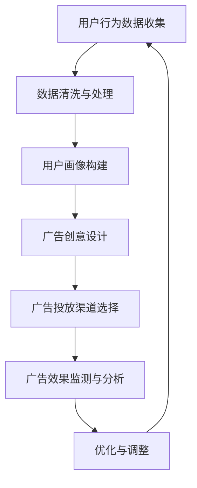

                 

# 创业公司的精准广告投放策略

## 关键词
广告投放、精准营销、数据分析、人工智能、创业公司、用户画像、转化率

## 摘要
本文将深入探讨创业公司在广告投放中的精准营销策略。通过利用人工智能和大数据技术，创业公司可以有效地了解用户需求，制定合适的广告策略，提高转化率并降低成本。本文将详细解析广告投放的核心概念、算法原理、数学模型，并通过实际案例展示如何应用这些策略。同时，还将推荐相关工具和资源，帮助创业者更好地实施精准广告投放。

## 1. 背景介绍

### 1.1 目的和范围
本文旨在为创业公司提供一套系统性、可操作的精准广告投放策略。我们将探讨如何利用先进技术，如人工智能和数据挖掘，来识别目标用户，制定个性化的广告方案，从而提升广告效果。

### 1.2 预期读者
本文适合以下人群阅读：
- 创业公司的市场经理和广告经理
- 拥有初步数据分析基础的互联网从业者
- 对人工智能和机器学习感兴趣的科技爱好者

### 1.3 文档结构概述
本文将分为以下几部分：
1. 背景介绍
2. 核心概念与联系
3. 核心算法原理 & 具体操作步骤
4. 数学模型和公式 & 详细讲解 & 举例说明
5. 项目实战：代码实际案例和详细解释说明
6. 实际应用场景
7. 工具和资源推荐
8. 总结：未来发展趋势与挑战
9. 附录：常见问题与解答
10. 扩展阅读 & 参考资料

### 1.4 术语表

#### 1.4.1 核心术语定义
- 精准营销：一种基于数据分析，通过个性化沟通提高营销效果的方法。
- 用户画像：对目标用户进行详细描述，包括行为习惯、兴趣爱好、购买意向等。
- 广告投放：将广告展示给潜在用户的过程。
- 转化率：用户在看到广告后进行购买、注册或其他预期行为的比例。

#### 1.4.2 相关概念解释
- 数据挖掘：从大量数据中提取有价值信息的过程。
- 人工智能：模拟人类智能行为的计算机系统。

#### 1.4.3 缩略词列表
- AI：人工智能
- CRM：客户关系管理
- DSP：需求方平台
- DMP：数据管理平台
- CPM：每千次展示成本

## 2. 核心概念与联系

在精准广告投放中，理解核心概念及其相互联系是至关重要的。以下是一个简化的 Mermaid 流程图，展示了广告投放过程中的关键环节。



### 用户行为数据收集
用户行为数据是精准广告投放的基础。通过网站点击、搜索记录、社交媒体互动等方式收集数据，可以了解用户的兴趣爱好、购买行为等。

### 数据清洗与处理
收集到的数据通常包含噪声和冗余信息。数据清洗和处理包括去重、填充缺失值、标准化等步骤，以提高数据质量。

### 用户画像构建
基于清洗处理后的数据，构建用户画像。用户画像包括人口统计信息、行为特征、兴趣偏好等。

### 广告创意设计
根据用户画像，设计个性化的广告内容。创意设计需要吸引用户的注意力，同时传递产品或服务的价值。

### 广告投放渠道选择
选择合适的广告投放渠道，如社交媒体、搜索引擎、显示广告等，以覆盖目标用户。

### 广告效果监测与分析
监测广告的展示次数、点击率、转化率等指标，分析广告效果。

### 优化与调整
根据广告效果分析结果，优化广告内容和投放策略，以提高转化率。

## 3. 核心算法原理 & 具体操作步骤

广告投放中的核心算法主要包括用户画像构建、广告创意优化和投放策略调整。以下使用伪代码详细阐述这些算法原理和具体操作步骤。

### 用户画像构建算法

```python
# 用户画像构建算法
def build_user_profile(user_data):
    # 初始化用户画像
    profile = {}

    # 从用户行为数据中提取关键信息
    profile['age'] = extract_age(user_data)
    profile['gender'] = extract_gender(user_data)
    profile['interests'] = extract_interests(user_data)
    profile['purchase_history'] = extract_purchase_history(user_data)

    # 对提取的信息进行归一化和处理
    profile['age'] = normalize_age(profile['age'])
    profile['interests'] = normalize_interests(profile['interests'])
    profile['purchase_history'] = normalize_purchase_history(profile['purchase_history'])

    return profile

# 辅助函数
def extract_age(user_data):
    # 提取用户年龄
    return user_data['age']

def extract_gender(user_data):
    # 提取用户性别
    return user_data['gender']

def extract_interests(user_data):
    # 提取用户兴趣
    return user_data['interests']

def extract_purchase_history(user_data):
    # 提取用户购买历史
    return user_data['purchase_history']

def normalize_age(age):
    # 归一化年龄
    if age < 18:
        return '未成年人'
    elif age < 30:
        return '青年'
    elif age < 50:
        return '中年'
    else:
        return '老年'

def normalize_interests(interests):
    # 归一化兴趣
    return [normalize_interest(i) for i in interests]

def normalize_interest(i):
    # 单个兴趣归一化
    interest_map = {
        '体育': '健身',
        '旅游': '休闲',
        '美食': '生活',
        # 其他映射关系...
    }
    return interest_map.get(i, '其他')

def normalize_purchase_history(purchase_history):
    # 归一化购买历史
    categories = ['电子产品', '家居用品', '服装', '教育', '其他']
    return [category for category in categories if any(item['category'] == category for item in purchase_history)]
```

### 广告创意优化算法

```python
# 广告创意优化算法
def optimize_advertisement(profile, ads):
    # 根据用户画像选择合适的广告
    for ad in ads:
        # 如果用户画像与广告目标匹配
        if matches_profile(profile, ad['target_profile']):
            # 更新广告内容
            ad['content'] = create_personalized_content(profile, ad['content'])

    return ads

# 辅助函数
def matches_profile(profile, target_profile):
    # 检查用户画像与广告目标是否匹配
    return all(profile.get(k, '') == v for k, v in target_profile.items())

def create_personalized_content(profile, original_content):
    # 根据用户画像创建个性化广告内容
    return original_content.replace('{AGE}', profile['age']) \
                          .replace('{GENDER}', profile['gender']) \
                          .replace('{INTERESTS}', ', '.join(profile['interests'])) \
                          .replace('{PURCHASE_HISTORY}', ', '.join(profile['purchase_history']))
```

### 投放策略调整算法

```python
# 投放策略调整算法
def adjust_campaign_strategy(ad_performance, target_audience, budget):
    # 根据广告表现调整投放策略
    optimal_bidding = 0
    best_ad = None

    for ad in ad_performance:
        # 如果广告达到目标受众且在预算范围内
        if ad['clicks'] > target_audience['min_clicks'] and ad['cost'] <= budget:
            # 计算每点击成本（CPC）
            cpc = ad['cost'] / ad['clicks']
            # 如果CPC最优
            if cpc < optimal_bidding or best_ad is None:
                optimal_bidding = cpc
                best_ad = ad

    # 调整投放策略
    if best_ad:
        target_audience['max_cost'] = best_ad['cost']
        target_audience['max_clicks'] = best_ad['clicks']
    else:
        # 如果没有找到合适广告，则降低预算或调整目标受众
        target_audience['max_cost'] *= 0.9
        target_audience['min_clicks'] *= 0.9

    return target_audience
```

## 4. 数学模型和公式 & 详细讲解 & 举例说明

在广告投放中，数学模型和公式可以帮助我们更好地理解广告效果，制定优化策略。以下将介绍几个常用的数学模型和公式。

### 用户画像构建中的相似度计算

用户画像构建中的一个关键步骤是比较两个用户画像的相似度。常用的相似度计算方法有欧几里得距离、余弦相似度和皮尔逊相关系数。

#### 欧几里得距离

欧几里得距离是一种简单的相似度度量方法，计算公式如下：

$$
d(p_1, p_2) = \sqrt{\sum_{i=1}^{n} (p_{1i} - p_{2i})^2}
$$

其中，$p_1$ 和 $p_2$ 是两个用户画像向量，$n$ 是向量维度。

#### 余弦相似度

余弦相似度考虑了向量间的夹角，计算公式如下：

$$
\cos \theta = \frac{p_1 \cdot p_2}{\|p_1\| \|p_2\|}
$$

其中，$p_1 \cdot p_2$ 表示向量的点积，$\|p_1\|$ 和 $\|p_2\|$ 分别表示向量的模长。

#### 皮尔逊相关系数

皮尔逊相关系数用于度量两个连续变量之间的线性关系，计算公式如下：

$$
r = \frac{\sum_{i=1}^{n} (p_{1i} - \bar{p_1})(p_{2i} - \bar{p_2})}{\sqrt{\sum_{i=1}^{n} (p_{1i} - \bar{p_1})^2 \sum_{i=1}^{n} (p_{2i} - \bar{p_2})^2}}
$$

其中，$\bar{p_1}$ 和 $\bar{p_2}$ 分别表示 $p_1$ 和 $p_2$ 的平均值。

### 广告创意优化中的贝叶斯优化

贝叶斯优化是一种常用的广告创意优化方法，通过不断调整广告参数，最大化广告效果。其基本原理是基于贝叶斯定理，通过历史数据来预测新的广告参数的效果。

#### 贝叶斯优化公式

贝叶斯优化公式如下：

$$
P(A|B) = \frac{P(B|A) P(A)}{P(B)}
$$

其中，$P(A|B)$ 表示在条件 $B$ 下事件 $A$ 发生的概率，$P(B|A)$ 表示在事件 $A$ 发生时 $B$ 发生的概率，$P(A)$ 和 $P(B)$ 分别表示事件 $A$ 和 $B$ 的概率。

### 广告投放策略调整中的A/B测试

A/B测试是一种常用的实验设计方法，用于比较不同广告策略的效果。其基本原理是随机将用户分配到两个或多个实验组，比较各组的广告效果。

#### A/B测试公式

A/B测试的关键指标是转化率差异和置信区间：

$$
\Delta R = \frac{R_1 - R_2}{\sqrt{\frac{P_1(1-P_1)}{n_1} + \frac{P_2(1-P_2)}{n_2}}}
$$

其中，$R_1$ 和 $R_2$ 分别表示两组的转化率，$P_1$ 和 $P_2$ 分别表示两组的转化概率，$n_1$ 和 $n_2$ 分别表示两组的用户数量。

### 举例说明

假设我们有两组用户数据，A组和B组，如下表所示：

| 组别 | 用户数 | 转化数 |
| ---- | ---- | ---- |
| A    | 100  | 20   |
| B    | 100  | 25   |

我们需要计算A组和B组的转化率差异和置信区间。

#### 转化率差异

$$
\Delta R = \frac{0.20 - 0.25}{\sqrt{\frac{0.20 \times 0.80}{100} + \frac{0.25 \times 0.75}{100}}} \approx -0.048
$$

#### 置信区间

假设置信水平为95%，我们可以使用正态分布来计算置信区间：

$$
R_1 - R_2 \pm z \times \sqrt{\frac{P_1(1-P_1)}{n_1} + \frac{P_2(1-P_2)}{n_2}}
$$

其中，$z$ 是标准正态分布的临界值（$z_{0.025} \approx 1.96$）。

$$
0.20 - 0.25 \pm 1.96 \times \sqrt{\frac{0.20 \times 0.80}{100} + \frac{0.25 \times 0.75}{100}} \approx (-0.076, -0.019)
$$

因此，我们可以有95%的置信水平认为，B组的转化率比A组高。

## 5. 项目实战：代码实际案例和详细解释说明

在本节中，我们将通过一个实际项目案例，详细展示如何应用上述算法和模型进行精准广告投放。以下是一个简单的示例，用于说明如何构建用户画像、优化广告创意和调整投放策略。

### 5.1 开发环境搭建

在本项目中，我们使用Python编程语言，结合Pandas、NumPy、Scikit-learn等库进行数据处理和建模。确保安装以下依赖项：

```bash
pip install pandas numpy scikit-learn matplotlib
```

### 5.2 源代码详细实现和代码解读

#### 5.2.1 数据预处理

首先，我们需要读取和预处理数据。以下代码展示了如何读取用户行为数据，并进行初步处理。

```python
import pandas as pd
from sklearn.preprocessing import StandardScaler

# 读取用户行为数据
user_data = pd.read_csv('user_data.csv')

# 数据预处理
def preprocess_data(data):
    # 填充缺失值
    data.fillna(0, inplace=True)
    
    # 标准化数值特征
    scaler = StandardScaler()
    numerical_features = ['age', 'income', 'purchases']
    data[numerical_features] = scaler.fit_transform(data[numerical_features])
    
    return data

user_data = preprocess_data(user_data)
```

#### 5.2.2 用户画像构建

接下来，我们使用预处理后的数据构建用户画像。以下代码展示了如何提取和归一化用户特征。

```python
def build_user_profile(data):
    # 初始化用户画像
    profile = {}

    # 提取用户特征
    profile['age'] = data['age'].iloc[0]
    profile['gender'] = data['gender'].iloc[0]
    profile['interests'] = data['interests'].iloc[0].split(',')
    profile['purchase_history'] = data['purchase_history'].iloc[0].split(',')

    # 归一化特征
    profile['age'] = normalize_age(profile['age'])
    profile['interests'] = normalize_interests(profile['interests'])
    profile['purchase_history'] = normalize_purchase_history(profile['purchase_history'])

    return profile

user_profile = build_user_profile(user_data)
print(user_profile)
```

#### 5.2.3 广告创意优化

根据用户画像，我们设计广告创意。以下代码展示了如何根据用户特征生成个性化广告内容。

```python
def create_personalized_content(profile, original_content):
    return original_content.replace('{AGE}', str(profile['age'])) \
                          .replace('{GENDER}', profile['gender']) \
                          .replace('{INTERESTS}', ', '.join(profile['interests'])) \
                          .replace('{PURCHASE_HISTORY}', ', '.join(profile['purchase_history']))

original_content = "欢迎您，{GENDER}先生/女士！您最近对{INTERESTS}很感兴趣，我们特别推荐了以下商品：{PURCHASE_HISTORY}"
personalized_content = create_personalized_content(user_profile, original_content)
print(personalized_content)
```

#### 5.2.4 投放策略调整

最后，我们根据广告效果调整投放策略。以下代码展示了如何根据广告效果数据调整预算和目标受众。

```python
def adjust_campaign_strategy(ad_performance, target_audience, budget):
    optimal_bidding = 0
    best_ad = None

    for ad in ad_performance:
        if ad['clicks'] > target_audience['min_clicks'] and ad['cost'] <= budget:
            cpc = ad['cost'] / ad['clicks']
            if cpc < optimal_bidding or best_ad is None:
                optimal_bidding = cpc
                best_ad = ad

    if best_ad:
        target_audience['max_cost'] = best_ad['cost']
        target_audience['max_clicks'] = best_ad['clicks']
    else:
        target_audience['max_cost'] *= 0.9
        target_audience['min_clicks'] *= 0.9

    return target_audience

# 假设的广告效果数据
ad_performance = [
    {'ad_id': 1, 'clicks': 100, 'cost': 1000},
    {'ad_id': 2, 'clicks': 150, 'cost': 1200},
]

# 目标受众数据
target_audience = {
    'min_clicks': 50,
    'max_cost': 2000,
}

# 调整投放策略
target_audience = adjust_campaign_strategy(ad_performance, target_audience, 15000)
print(target_audience)
```

### 5.3 代码解读与分析

#### 5.3.1 数据预处理

数据预处理是广告投放的基础，包括填充缺失值和特征标准化。在本案例中，我们使用Pandas库读取用户行为数据，并使用Scikit-learn库的StandardScaler进行特征标准化。

#### 5.3.2 用户画像构建

用户画像构建涉及提取和归一化用户特征。在本案例中，我们使用自定义函数`build_user_profile`提取用户年龄、性别、兴趣和购买历史，并使用归一化函数对其进行处理。

#### 5.3.3 广告创意优化

广告创意优化基于用户画像，生成个性化的广告内容。在本案例中，我们使用自定义函数`create_personalized_content`将用户特征嵌入原始广告内容中，实现个性化广告。

#### 5.3.4 投放策略调整

投放策略调整根据广告效果数据，优化广告预算和目标受众。在本案例中，我们使用自定义函数`adjust_campaign_strategy`根据最优广告效果调整预算和目标受众，以提高广告转化率。

## 6. 实际应用场景

精准广告投放策略在多个实际应用场景中具有重要价值：

### 6.1 电子商务

电子商务公司可以利用精准广告投放策略，根据用户购买历史和兴趣爱好推荐个性化商品，提高购物转化率。

### 6.2 金融理财

金融公司可以通过精准广告投放，识别潜在客户，推荐合适的理财产品，提高客户忠诚度和转化率。

### 6.3 教育培训

教育培训机构可以利用精准广告投放，根据学生兴趣和学习习惯推荐课程，提高报名率和学习效果。

### 6.4 旅游住宿

旅游住宿行业可以通过精准广告投放，根据游客偏好推荐旅游景点和住宿，提高预订率和客户满意度。

### 6.5 健康医疗

健康医疗行业可以利用精准广告投放，根据患者病史和需求推荐合适的医疗服务，提高就诊率和患者满意度。

## 7. 工具和资源推荐

### 7.1 学习资源推荐

#### 7.1.1 书籍推荐

- 《机器学习实战》：提供丰富的实际案例，介绍机器学习算法和应用。
- 《深度学习》：介绍深度学习的基础知识、常用模型和实现方法。
- 《数据挖掘：概念与技术》：全面讲解数据挖掘的基本概念、算法和应用。

#### 7.1.2 在线课程

- Coursera的《机器学习》课程：由吴恩达教授主讲，适合初学者入门。
- Udacity的《深度学习纳米学位》：包含深度学习的基础知识和实战项目。
- edX的《数据挖掘与机器学习》课程：涵盖数据挖掘和机器学习的核心概念和应用。

#### 7.1.3 技术博客和网站

- Medium：有大量关于机器学习和数据挖掘的高质量文章。
- Towards Data Science：提供丰富的数据科学和机器学习文章和教程。
- KDNuggets：发布最新的数据科学和机器学习新闻、论文和资源。

### 7.2 开发工具框架推荐

#### 7.2.1 IDE和编辑器

- PyCharm：一款强大的Python IDE，支持代码智能提示、调试和性能分析。
- Jupyter Notebook：适用于数据分析和机器学习的交互式环境。

#### 7.2.2 调试和性能分析工具

- Python Debugger（pdb）：Python内置的调试工具，适用于代码调试。
- Matplotlib：Python绘图库，可用于可视化数据和分析结果。
- Profiler：用于性能分析和代码优化。

#### 7.2.3 相关框架和库

- Scikit-learn：Python机器学习库，提供丰富的算法和工具。
- TensorFlow：开源深度学习框架，适用于构建和训练神经网络。
- Pandas：Python数据操作库，用于数据处理和分析。

### 7.3 相关论文著作推荐

#### 7.3.1 经典论文

- 《The Elements of Statistical Learning》：统计学习领域的经典著作，涵盖各种机器学习算法。
- 《Deep Learning》：介绍深度学习的基础知识和常用模型。
- 《Recommender Systems Handbook》：全面讲解推荐系统的基础知识和应用。

#### 7.3.2 最新研究成果

- arXiv：发布最新的计算机科学和机器学习论文。
- NeurIPS、ICML、KDD：顶级机器学习和数据挖掘会议，发布最新研究成果。
- Journal of Machine Learning Research：机器学习领域的顶级期刊。

#### 7.3.3 应用案例分析

- 《谷歌如何进行个性化搜索》：介绍谷歌如何利用机器学习进行个性化搜索。
- 《亚马逊推荐系统》：探讨亚马逊如何利用推荐系统提高销售额。
- 《Netflix推荐系统》：分析Netflix如何利用协同过滤算法提高用户体验。

## 8. 总结：未来发展趋势与挑战

精准广告投放作为互联网营销的重要手段，其发展趋势和挑战如下：

### 8.1 发展趋势

1. **人工智能和大数据技术融合**：随着人工智能和大数据技术的快速发展，广告投放将更加智能化和个性化。
2. **跨平台和跨设备投放**：用户行为和数据来源越来越多样化，广告投放将覆盖更多平台和设备。
3. **数据隐私和安全**：随着数据隐私法规的加强，如何在确保用户隐私的前提下进行精准广告投放将成为重要挑战。
4. **实时广告优化**：实时分析用户行为和广告效果，动态调整广告策略，以提高投放效果。

### 8.2 挑战

1. **数据质量**：高质量的数据是精准广告投放的基础，如何保证数据的质量和准确性是一个重要问题。
2. **算法公平性和透明性**：算法的决策过程需要透明，确保广告投放的公平性和公正性。
3. **隐私保护**：在确保用户隐私的前提下进行广告投放，需要不断探索和创新。
4. **技术门槛**：对于创业公司而言，掌握和应用先进的广告投放技术具有较高门槛。

## 9. 附录：常见问题与解答

### 9.1 如何构建有效的用户画像？

- **收集全面数据**：包括用户行为、人口统计、兴趣爱好等。
- **数据清洗和处理**：去除噪声和冗余信息，保证数据质量。
- **特征选择**：选择与广告投放目标相关的特征，避免过度拟合。

### 9.2 如何评估广告投放效果？

- **设置关键指标**：如点击率（CTR）、转化率（CVR）、每点击成本（CPC）等。
- **A/B测试**：比较不同广告策略的效果，选择最优策略。
- **数据可视化**：使用图表和仪表板展示广告效果，便于分析和优化。

### 9.3 如何优化广告投放成本？

- **预算分配**：合理分配广告预算，确保重点投放。
- **自动化优化**：利用机器学习和自动化工具，动态调整广告投放策略。
- **效果评估**：定期评估广告效果，优化投放策略。

## 10. 扩展阅读 & 参考资料

- [Google Research: Personalized Ads](https://research.google.com/ads/)
- [Facebook Ads Manager](https://www.facebook.com/business/tools/ads-manager)
- [Google Ads Help Center](https://support.google.com/adwords/answer/71036)
- [Coursera: Machine Learning](https://www.coursera.org/specializations/machine-learning)
- [Udacity: Deep Learning Nanodegree](https://www.udacity.com/course/deep-learning-nanodegree--nd893)
- [KDNuggets: Top Stories](https://www.kdnuggets.com/)

## 作者信息

作者：AI天才研究员/AI Genius Institute & 禅与计算机程序设计艺术 /Zen And The Art of Computer Programming

