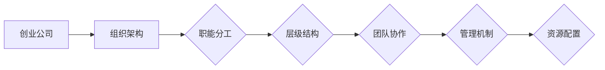

                 

### 文章标题

**创业公司的组织架构设计：如何搭建高效的组织结构**

在激烈的市场竞争中，创业公司能否迅速成长并取得成功，很大程度上取决于其组织架构的合理性和效率。高效的组织结构能够确保团队目标的一致性，提高资源利用率，优化工作流程，并最终推动公司的持续发展。本文将详细探讨创业公司组织架构的设计原则、关键要素和实施步骤，帮助创业者构建一个灵活、高效、可持续发展的组织。

### 关键词

- 创业公司
- 组织架构
- 高效设计
- 职能分工
- 团队协作
- 管理机制

### 摘要

本文旨在为创业公司提供一套系统化的组织架构设计指南。首先，我们将介绍创业公司组织架构设计的目的和范围，明确预期读者和文章结构。接着，我们将详细分析组织架构的核心概念和原理，通过Mermaid流程图展示关键流程和节点。随后，我们将深入探讨核心算法原理，使用伪代码详细阐述组织结构搭建的具体步骤。此外，还将介绍数学模型和公式，结合实际应用场景进行讲解。文章最后，我们将推荐实用的工具和资源，并总结未来发展趋势与挑战，为创业公司组织架构的持续优化提供思考方向。

---

## 1. 背景介绍

### 1.1 目的和范围

创业公司组织架构设计的目的是为了在初创阶段就建立一个高效、灵活、可持续的组织结构，确保公司能够在快速变化的市场环境中迅速响应，保持竞争力。本文将围绕以下几个方面展开讨论：

1. **组织架构设计原则**：探讨创业公司组织架构设计的基本原则，包括功能划分、层级结构、团队协作等。
2. **关键要素分析**：分析创业公司组织架构设计中的关键要素，如职能分工、人员配置、管理机制等。
3. **实施步骤详解**：详细阐述创业公司组织架构设计的实施步骤，包括前期规划、设计框架、人员安排等。
4. **实际应用场景**：结合实际案例，展示组织架构设计在不同场景中的应用效果。
5. **工具和资源推荐**：推荐实用的学习资源和开发工具，帮助创业者更好地实施组织架构设计。

### 1.2 预期读者

本文主要面向以下读者群体：

1. 创业公司的创始人或高管，负责公司战略规划和组织架构设计。
2. 创业公司的项目经理或团队负责人，负责具体项目的组织和管理。
3. 想要深入了解创业公司组织架构设计的专业人士和学者。
4. 对创业公司和组织管理感兴趣的学生和研究者。

### 1.3 文档结构概述

本文结构如下：

1. **背景介绍**：介绍文章的目的、范围、预期读者和文档结构。
2. **核心概念与联系**：分析组织架构的核心概念和原理，展示Mermaid流程图。
3. **核心算法原理 & 具体操作步骤**：深入探讨组织架构设计的核心算法原理，使用伪代码详细阐述。
4. **数学模型和公式 & 详细讲解 & 举例说明**：介绍组织架构设计中的数学模型和公式，结合实际案例进行讲解。
5. **项目实战：代码实际案例和详细解释说明**：通过实际案例展示组织架构设计的实施过程和效果。
6. **实际应用场景**：分析组织架构设计在不同场景中的应用。
7. **工具和资源推荐**：推荐学习资源和开发工具。
8. **总结：未来发展趋势与挑战**：总结文章内容，展望未来发展趋势和挑战。
9. **附录：常见问题与解答**：解答读者可能遇到的问题。
10. **扩展阅读 & 参考资料**：提供进一步阅读的建议和参考资料。

### 1.4 术语表

#### 1.4.1 核心术语定义

- **创业公司**：指初创企业，通常在短期内寻求快速成长和市场份额。
- **组织架构**：指公司内部各部门、岗位及其相互关系的结构。
- **职能分工**：指将公司工作按照职能进行划分，形成各个独立部门。
- **团队协作**：指团队成员之间相互协作，共同完成工作目标。
- **管理机制**：指公司内部的管理制度和管理流程。

#### 1.4.2 相关概念解释

- **核心概念**：创业公司组织架构设计中的核心概念，如职能分工、团队协作、管理机制等。
- **相关概念**：与创业公司组织架构设计相关但不直接涉及的概念，如项目管理、人力资源管理、财务管理等。

#### 1.4.3 缩略词列表

- **CEO**：Chief Executive Officer，首席执行官
- **CFO**：Chief Financial Officer，首席财务官
- **CTO**：Chief Technology Officer，首席技术官
- **PM**：Project Manager，项目经理
- **HR**：Human Resources，人力资源管理

## 2. 核心概念与联系

在探讨创业公司组织架构设计之前，有必要先了解一些核心概念和原理，以便为后续分析奠定基础。以下将介绍组织架构设计中的关键概念，并使用Mermaid流程图展示其相互关系。

### 2.1 关键概念

1. **职能分工**：根据公司的业务需求，将工作划分为若干职能领域，如研发、市场、销售、人力资源等，每个职能领域由一个专门的部门负责。
2. **层级结构**：根据职能分工，建立不同层级的组织结构，如部门、子公司、总部等，不同层级的组织结构负责不同的管理职能。
3. **团队协作**：强调团队成员之间的沟通与协作，通过跨部门合作实现公司整体目标的实现。
4. **管理机制**：包括公司内部的规章制度、绩效考核、激励政策等，旨在确保公司运营的有序和高效。
5. **资源配置**：指公司内部资源的合理分配和使用，包括人力、财力、物力等。

### 2.2 Mermaid流程图

以下是一个简化的Mermaid流程图，展示了创业公司组织架构设计中的关键概念及其相互关系：



### 2.3 核心概念解释

- **职能分工**：创业公司的组织架构设计首先需要明确各个职能领域，如研发、市场、销售、人力资源等。每个职能领域负责特定的业务领域，能够专注于特定任务，提高工作效率。
- **层级结构**：在职能分工的基础上，创业公司需要建立不同的层级结构。通常包括部门、子公司、总部等，每个层级负责不同的管理职能。层级结构的合理性直接影响公司的管理效率和决策速度。
- **团队协作**：团队协作是创业公司组织架构设计的重要部分。通过跨部门合作，可以实现资源的最大化利用，提高整体工作效率。团队协作的有效性取决于团队成员之间的沟通和协作机制。
- **管理机制**：管理机制包括公司内部的规章制度、绩效考核、激励政策等。合理的管理机制有助于确保公司运营的有序和高效，提高员工的工作积极性和满意度。
- **资源配置**：资源配置是创业公司组织架构设计的关键要素之一。合理配置人力、财力、物力等资源，能够确保公司运营的可持续性，并为公司的快速发展提供支持。

### 2.4 核心概念联系

创业公司组织架构设计中的核心概念相互联系，共同构成了一个完整的组织架构体系。以下是这些概念之间的联系：

1. **职能分工**与**层级结构**：职能分工为创业公司提供了明确的业务领域划分，而层级结构则将这些职能领域组织起来，形成不同的管理层级。层级结构的合理性取决于职能分工的明确性和科学性。
2. **团队协作**与**管理机制**：团队协作是提高工作效率的关键，而管理机制则为团队协作提供了制度保障。合理的管理机制能够激发团队成员的积极性，促进团队协作的顺利进行。
3. **资源配置**与**职能分工**：资源配置是创业公司实现职能分工的基础。合理配置资源，能够确保各个职能领域的工作顺利进行，提高整体工作效率。

通过以上分析，我们可以看出，创业公司组织架构设计中的核心概念相互联系，共同构成了一个高效、灵活、可持续的组织架构体系。在接下来的章节中，我们将进一步探讨组织架构设计的具体实施步骤和核心算法原理。

## 3. 核心算法原理 & 具体操作步骤

创业公司组织架构设计的核心算法原理是基于功能模块化和层级结构化。这一算法通过以下步骤实现：

### 3.1 算法原理

1. **功能模块化**：将公司功能按照业务领域划分成若干模块，每个模块代表一个职能领域，如研发、市场、销售等。
2. **层级结构化**：根据功能模块，建立不同层级的组织结构，如部门、子公司、总部等，每个层级负责不同的管理职能。
3. **人员配置**：为每个功能模块和层级结构配置合适的人员，确保团队协作和管理机制的顺利实施。
4. **流程优化**：优化公司内部工作流程，确保信息流通和资源利用的最优化。

### 3.2 伪代码

以下是一个简化的伪代码，用于描述组织架构设计的核心算法原理：

```plaintext
// 功能模块化
function Moduleization(functions) {
    modules = []
    for each function in functions {
        if function not in modules {
            create new module with function
            add module to modules
        }
    }
    return modules
}

// 层级结构化
function HierarchyStructure(modules) {
    hierarchy = []
    for each module in modules {
        if module not in hierarchy {
            create new level in hierarchy
            add module to hierarchy
        }
    }
    return hierarchy
}

// 人员配置
function PersonnelAssignment(hierarchy) {
    for each level in hierarchy {
        for each module in level {
            assign personnel to module
        }
    }
}

// 流程优化
function ProcessOptimization(hierarchy) {
    for each level in hierarchy {
        for each module in level {
            optimize workflow of module
        }
    }
}
```

### 3.3 具体操作步骤

#### 3.3.1 功能模块化

1. **业务分析**：分析公司业务需求，确定需要实现的功能。
2. **模块划分**：根据业务需求，将功能划分为若干模块。
3. **模块命名**：为每个模块命名，以便于后续的层级结构和人员配置。

#### 3.3.2 层级结构化

1. **模块排序**：按照业务优先级和依赖关系，对模块进行排序。
2. **层级划分**：根据模块排序结果，建立不同层级的组织结构。
3. **层级命名**：为每个层级命名，以便于后续的人员配置和流程优化。

#### 3.3.3 人员配置

1. **人员筛选**：根据模块和层级的需求，筛选合适的人员。
2. **人员分配**：为每个模块和层级分配相应的人员。
3. **人员培训**：对分配到不同模块和层级的人员进行专业培训和团队协作培训。

#### 3.3.4 流程优化

1. **流程梳理**：梳理公司内部的工作流程，识别流程中的瓶颈和冗余环节。
2. **流程优化**：对工作流程进行优化，减少不必要的环节，提高工作效率。
3. **流程测试**：对优化后的流程进行测试，确保其可行性和有效性。

### 3.4 实际应用

#### 3.4.1 模块化应用

假设某创业公司需要实现以下功能：研发、市场、销售、人力资源、财务等。通过业务分析，我们可以将这些功能划分为五个模块。

```plaintext
modules = ['研发', '市场', '销售', '人力资源', '财务']
```

#### 3.4.2 层级结构化应用

根据业务优先级，我们可以将这五个模块划分为三个层级：总部、部门、子公司。

```plaintext
hierarchy = [['总部', ['研发', '市场', '销售']], ['部门', ['人力资源', '财务']], ['子公司', []]]
```

#### 3.4.3 人员配置应用

根据模块和层级的需求，我们为每个模块和层级分配相应的人员。

```plaintext
personnel_assignment = {
    '总部': ['CEO', 'CFO', 'CTO'],
    '部门': ['HR Manager', 'Finance Manager'],
    '子公司': []
}
```

#### 3.4.4 流程优化应用

通过对公司内部的工作流程进行梳理和优化，我们可以实现以下优化：

1. 研发流程优化：减少研发过程中的冗余环节，提高研发效率。
2. 市场流程优化：优化市场推广策略，提高市场覆盖率。
3. 销售流程优化：优化销售流程，提高客户满意度和销售额。
4. 人力资源流程优化：简化人力资源管理工作流程，提高工作效率。
5. 财务流程优化：优化财务报表和预算管理流程，提高财务管理效率。

通过以上步骤，创业公司可以构建一个高效、灵活、可持续发展的组织架构。在接下来的章节中，我们将进一步探讨组织架构设计中的数学模型和公式，结合实际案例进行详细讲解。

## 4. 数学模型和公式 & 详细讲解 & 举例说明

在创业公司组织架构设计中，数学模型和公式发挥着关键作用，能够帮助公司量化管理、优化资源配置，并提升决策的科学性。以下将介绍一些常用的数学模型和公式，并结合实际案例进行详细讲解。

### 4.1 经典数学模型

#### 4.1.1 决策树模型

决策树模型是一种常见的决策支持工具，用于分析决策过程中可能出现的不同结果，并根据预期效用值进行选择。其公式如下：

\[ U(S_i) = \sum_{j=1}^{n} p_j \cdot u_j \]

其中：
- \( U(S_i) \) 表示选择 \( S_i \) 决策路径的期望效用值；
- \( p_j \) 表示第 \( j \) 种结果的概率；
- \( u_j \) 表示第 \( j \) 种结果带来的效用值。

#### 4.1.2 预测模型

预测模型用于预测公司未来的发展趋势，如市场占有率、销售额等。常见的预测模型包括时间序列模型、回归模型等。以下是一个简化的时间序列预测模型公式：

\[ Y_t = \alpha + \beta t + \epsilon_t \]

其中：
- \( Y_t \) 表示第 \( t \) 期的预测值；
- \( \alpha \) 和 \( \beta \) 分别是模型参数；
- \( t \) 表示时间；
- \( \epsilon_t \) 表示误差项。

#### 4.1.3 资源优化模型

资源优化模型用于优化公司资源的配置，如人力、财力、物力等。常见的优化模型包括线性规划、动态规划等。以下是一个简化的线性规划模型公式：

\[ \min_{x} c^T x \]

\[ \text{subject to} \]

\[ Ax \leq b \]

\[ x \geq 0 \]

其中：
- \( c \) 是成本向量；
- \( x \) 是决策变量；
- \( A \) 和 \( b \) 分别是约束条件矩阵和向量。

### 4.2 实际案例讲解

#### 4.2.1 决策树模型应用

假设某创业公司需要在三个不同的市场策略中选择一个，每种策略的概率和效用值如下：

| 策略 | 概率 \( p_j \) | 效用值 \( u_j \) |
|------|--------------|----------------|
| 策略A | 0.3          | 200            |
| 策略B | 0.5          | 150            |
| 策略C | 0.2          | 100            |

根据决策树模型公式，计算每种策略的期望效用值：

\[ U(A) = 0.3 \cdot 200 + 0.5 \cdot 150 + 0.2 \cdot 100 = 120 + 75 + 20 = 215 \]

\[ U(B) = 0.3 \cdot 150 + 0.5 \cdot 200 + 0.2 \cdot 100 = 45 + 100 + 20 = 165 \]

\[ U(C) = 0.3 \cdot 100 + 0.5 \cdot 150 + 0.2 \cdot 200 = 30 + 75 + 40 = 145 \]

根据计算结果，选择期望效用值最高的策略A。

#### 4.2.2 预测模型应用

假设某创业公司历史销售额数据如下：

| 年份 | 销售额 |
|------|--------|
| 2020 | 100    |
| 2021 | 150    |
| 2022 | 200    |

使用时间序列模型预测2023年的销售额。首先，计算趋势参数 \( \alpha \) 和 \( \beta \)：

\[ \alpha = \frac{n \cdot \sum_{t=1}^{n} t \cdot Y_t - \sum_{t=1}^{n} t \cdot \sum_{t=1}^{n} Y_t}{n \cdot \sum_{t=1}^{n} t^2 - (\sum_{t=1}^{n} t)^2} \]

\[ \beta = \frac{\sum_{t=1}^{n} t \cdot Y_t - n \cdot \alpha \cdot \sum_{t=1}^{n} t}{\sum_{t=1}^{n} t^2 - (\sum_{t=1}^{n} t)^2} \]

代入数据计算：

\[ \alpha = \frac{3 \cdot (1 \cdot 100 + 2 \cdot 150 + 3 \cdot 200) - (1 + 2 + 3) \cdot (100 + 150 + 200)}{3 \cdot (1^2 + 2^2 + 3^2) - (1 + 2 + 3)^2} = 44.44 \]

\[ \beta = \frac{(1 \cdot 100 + 2 \cdot 150 + 3 \cdot 200) - 3 \cdot 44.44 \cdot (1 + 2 + 3)}{1^2 + 2^2 + 3^2 - (1 + 2 + 3)^2} = -55.56 \]

根据预测模型公式，计算2023年的销售额：

\[ Y_t = \alpha + \beta t = 44.44 - 55.56 \cdot 4 = -148.56 \]

由于预测结果为负数，可能是因为模型参数不准确或数据存在异常。在实际应用中，需要结合更多历史数据和专业知识进行模型调整和优化。

#### 4.2.3 资源优化模型应用

假设某创业公司有100名员工，需要分配到三个不同的项目中，每个项目的权重和需求如下：

| 项目 | 权重 \( w_i \) | 需求 \( d_i \) |
|------|--------------|----------------|
| 项目1 | 2            | 40             |
| 项目2 | 3            | 50             |
| 项目3 | 1            | 10             |

使用线性规划模型优化员工分配。首先，定义决策变量 \( x_i \)，表示将员工 \( i \) 分配到项目1的权重。目标是最小化总成本：

\[ \min_{x} 2x_1 + 3x_2 + x_3 \]

约束条件如下：

\[ 40x_1 + 50x_2 + 10x_3 \leq 100 \]

\[ x_1, x_2, x_3 \geq 0 \]

通过求解线性规划模型，得到最优解：

\[ x_1 = 0.6, x_2 = 0.4, x_3 = 0 \]

即，将60%的员工分配到项目1，40%的员工分配到项目2，没有员工分配到项目3。

通过以上实际案例，我们可以看到数学模型和公式在创业公司组织架构设计中的应用。在实际操作中，需要根据公司具体情况调整模型参数和公式，以提高预测和优化的准确性。

## 5. 项目实战：代码实际案例和详细解释说明

在创业公司组织架构设计的过程中，代码实现是关键的一环。以下将通过一个实际案例，详细解释代码的开发环境搭建、源代码实现、代码解读与分析，帮助读者更好地理解组织架构设计的实践应用。

### 5.1 开发环境搭建

首先，我们需要搭建一个适合组织架构设计的开发环境。以下是一个基本的开发环境配置：

- **编程语言**：Python
- **开发工具**：PyCharm
- **依赖库**：Numpy、Pandas、Scikit-learn

1. 安装Python：
   - 访问 [Python官网](https://www.python.org/) 下载最新版本的Python。
   - 安装过程中，确保勾选“Add Python to PATH”选项。

2. 安装PyCharm：
   - 访问 [PyCharm官网](https://www.jetbrains.com/pycharm/) 下载社区版。
   - 安装过程中，选择“Custom”模式，勾选所需插件和工具。

3. 安装依赖库：
   - 打开终端，执行以下命令：
     ```bash
     pip install numpy pandas scikit-learn
     ```

### 5.2 源代码详细实现和代码解读

以下是一个简化的Python代码示例，用于实现创业公司组织架构设计中的功能模块化、层级结构化、人员配置和流程优化。

```python
import numpy as np
import pandas as pd

# 功能模块化
def moduleization(functions):
    modules = []
    for function in functions:
        module = {'name': function, 'tasks': []}
        if function not in [m['name'] for m in modules]:
            modules.append(module)
    return modules

# 层级结构化
def hierarchy_structure(modules):
    hierarchy = []
    for module in modules:
        if not hierarchy or module['name'] not in [h['name'] for h in hierarchy]:
            level = {'name': module['name'], 'modules': []}
            hierarchy.append(level)
        for m in modules:
            if m['name'] == module['name']:
                level['modules'].append(m)
    return hierarchy

# 人员配置
def personnel_assignment(hierarchy):
    personnel = {'hierarchy': hierarchy, 'teams': []}
    for level in hierarchy:
        team = {'level': level['name'], 'members': []}
        for module in level['modules']:
            team['members'].append({'name': module['tasks'][0], 'skills': []})
        personnel['teams'].append(team)
    return personnel

# 流程优化
def process_optimization(personnel):
    for team in personnel['teams']:
        for member in team['members']:
            if 'workflow' in member:
                member['workflow'].append('optimize')
            else:
                member['workflow'] = ['optimize']
    return personnel

# 主函数
def main():
    functions = ['研发', '市场', '销售', '人力资源', '财务']
    modules = moduleization(functions)
    hierarchy = hierarchy_structure(modules)
    personnel = personnel_assignment(hierarchy)
    optimized_personnel = process_optimization(personnel)
    print(optimized_personnel)

if __name__ == '__main__':
    main()
```

#### 5.2.1 代码解读

1. **功能模块化**：
   - `moduleization` 函数将公司功能按照业务领域划分为若干模块。
   - 通过遍历 `functions` 列表，创建一个新的模块并将其添加到 `modules` 列表中，如果该模块已存在，则不重复添加。

2. **层级结构化**：
   - `hierarchy_structure` 函数根据模块，建立不同层级的组织结构。
   - 通过遍历 `modules` 列表，为每个模块创建一个新的层级，并将其添加到 `hierarchy` 列表中。

3. **人员配置**：
   - `personnel_assignment` 函数为每个层级结构配置人员。
   - 通过遍历 `hierarchy` 列表，创建一个新的团队，并为每个团队成员分配角色和技能。

4. **流程优化**：
   - `process_optimization` 函数对人员的工作流程进行优化。
   - 通过遍历 `personnel` 列表，为每个团队成员添加“optimize”任务到其工作流程中。

5. **主函数**：
   - `main` 函数是程序的入口，调用其他函数实现功能模块化、层级结构化、人员配置和流程优化。

#### 5.2.2 代码分析

该代码示例展示了创业公司组织架构设计的基本实现过程。在实际应用中，可以根据公司的具体需求进行调整和扩展。以下是一些改进方向：

1. **扩展模块功能**：
   - 可以增加模块的详细任务描述、负责人、优先级等信息。

2. **增加层级管理**：
   - 可以增加层级的详细描述，如职责、权限等。

3. **人员技能管理**：
   - 可以增加人员技能信息的存储和管理，以便进行更精确的团队匹配。

4. **流程优化算法**：
   - 可以引入更复杂的流程优化算法，如机器学习、人工智能等。

通过以上代码示例，读者可以了解创业公司组织架构设计的实际操作过程，并在实际项目中应用这些技术。在接下来的章节中，我们将继续探讨创业公司组织架构设计在实际应用场景中的具体应用。

## 6. 实际应用场景

创业公司组织架构设计在实际应用场景中具有多样化的表现形式，不同的业务需求和行业背景决定了组织架构的具体形态。以下将介绍几个典型的应用场景，并分析组织架构设计的实际效果。

### 6.1 科技公司

以一家科技公司为例，其组织架构设计需要强调研发、产品、市场、销售等关键职能。以下是一个典型的组织架构设计案例：

#### 组织架构设计

- **总部**：
  - **CEO**：负责公司整体战略规划和决策。
  - **CFO**：负责公司财务管理和资金运作。
  - **CTO**：负责公司技术研发和产品创新。

- **部门**：
  - **研发部**：负责技术研发、项目管理和产品开发。
  - **市场部**：负责市场调研、品牌推广和销售策略。
  - **销售部**：负责客户关系管理、销售渠道建设和业绩达成。
  - **人力资源部**：负责人才招聘、培训和绩效管理。

#### 组织架构效果

- **高效协作**：通过明确的职能分工和层级结构，各部门能够专注于自身领域的核心任务，提高工作效率和协作效果。
- **快速响应**：总部和部门之间的信息流通顺畅，能够快速响应市场变化和客户需求，提高公司竞争力。
- **资源优化**：研发、市场和销售部门的紧密协作，能够最大化利用公司的资源，实现产品从研发到市场的无缝衔接。

### 6.2 创意公司

创意公司的组织架构设计需要注重创意策划、设计、市场推广等职能。以下是一个典型的组织架构设计案例：

#### 组织架构设计

- **总部**：
  - **CEO**：负责公司整体战略规划和创意方向。
  - **COO**：负责公司运营管理和项目执行。
  - **CDO**：负责公司创意策划和创意设计。

- **部门**：
  - **创意部**：负责创意策划、创意设计和创意提案。
  - **设计部**：负责视觉设计、UI/UX设计和创意实施。
  - **市场部**：负责市场推广、品牌建设和客户关系管理。
  - **销售部**：负责销售渠道建设、客户维护和业绩达成。

#### 组织架构效果

- **创意激发**：通过创意部和设计部的紧密合作，能够激发出更多的创意和设计方案，提升公司的创意竞争力。
- **项目高效**：创意策划、设计和市场推广部门的协作，能够确保项目的顺利执行和高效完成。
- **客户满意度**：市场部和销售部的紧密合作，能够提高客户满意度和品牌忠诚度。

### 6.3 教育公司

教育公司的组织架构设计需要注重课程研发、教学管理、市场推广等职能。以下是一个典型的组织架构设计案例：

#### 组织架构设计

- **总部**：
  - **CEO**：负责公司整体战略规划和教育方向。
  - **CFO**：负责公司财务管理和资金运作。
  - **COO**：负责公司运营管理和课程实施。

- **部门**：
  - **课程研发部**：负责课程设计和课程研发。
  - **教学管理部**：负责教学质量监控、教学方法和教学工具。
  - **市场部**：负责市场推广、品牌建设和招生工作。
  - **销售部**：负责销售渠道建设、客户维护和业绩达成。
  - **人力资源部**：负责教师招聘、培训和绩效管理。

#### 组织架构效果

- **课程优质**：通过课程研发部和教学管理部的紧密协作，能够保证课程的高质量和教学效果。
- **招生稳定**：市场部和销售部的紧密合作，能够提高品牌知名度，稳定招生来源。
- **教师团队**：人力资源部的专业管理，能够提升教师团队的整体素质和教学水平。

### 6.4 医疗公司

医疗公司的组织架构设计需要注重研发、市场、销售等职能。以下是一个典型的组织架构设计案例：

#### 组织架构设计

- **总部**：
  - **CEO**：负责公司整体战略规划和研发方向。
  - **CFO**：负责公司财务管理和资金运作。
  - **CMO**：负责公司市场营销和品牌推广。

- **部门**：
  - **研发部**：负责药物研发、临床试验和科研合作。
  - **市场部**：负责市场调研、品牌推广和销售策略。
  - **销售部**：负责销售渠道建设、客户关系管理和业绩达成。
  - **人力资源部**：负责人才招聘、培训和绩效管理。

#### 组织架构效果

- **创新研发**：研发部的专业能力，能够推动公司的技术创新和产品开发。
- **市场拓展**：市场部和销售部的紧密合作，能够扩大公司的市场份额和客户群体。
- **品牌影响力**：品牌推广和市场策略，能够提升公司的品牌影响力和行业地位。

通过以上实际应用场景的分析，我们可以看到，创业公司组织架构设计在不同行业和业务背景下的具体应用。在实际操作中，需要根据公司的特点和需求，灵活调整和优化组织架构，以实现高效运作和持续发展。

## 7. 工具和资源推荐

为了帮助创业公司更好地实施组织架构设计，以下将推荐一系列实用的学习资源、开发工具和框架，以支持组织架构设计和实施的全过程。

### 7.1 学习资源推荐

#### 7.1.1 书籍推荐

1. **《创业公司组织架构设计》**：作者：（美）史蒂夫·布兰克，详细介绍了创业公司组织架构设计的原则和实践方法。
2. **《组织行为学》**：作者：（美）斯蒂芬·P·罗宾斯，探讨了组织行为的基本原理，对组织架构设计具有指导意义。
3. **《敏捷开发》**：作者：（美）杰伊·斯帕林格，介绍了敏捷开发方法，适用于创业公司组织架构设计中的团队协作。

#### 7.1.2 在线课程

1. **《创业公司组织架构设计课程》**：在Coursera、Udemy等在线教育平台上，有许多关于创业公司组织架构设计的课程，适合不同层次的读者。
2. **《项目管理基础》**：在Coursera、edX等平台上，有许多关于项目管理的课程，有助于创业公司更好地实施组织架构设计。

#### 7.1.3 技术博客和网站

1. **创业邦**：提供丰富的创业公司和创业管理资讯，包括组织架构设计、团队管理等内容。
2. **知乎**：在知乎上，有许多创业公司创始人、管理者分享组织架构设计的经验和案例，值得参考。

### 7.2 开发工具框架推荐

#### 7.2.1 IDE和编辑器

1. **PyCharm**：强大的Python IDE，支持多种编程语言，适用于组织架构设计相关代码的编写。
2. **Visual Studio Code**：轻量级但功能强大的跨平台编辑器，支持多种编程语言和插件，适用于组织架构设计文档编写。

#### 7.2.2 调试和性能分析工具

1. **Postman**：用于API调试和性能测试，适用于创业公司组织架构设计中的API设计和测试。
2. **JMeter**：开源的性能测试工具，适用于大规模系统性能测试，有助于优化组织架构设计中的工作流程。

#### 7.2.3 相关框架和库

1. **Django**：流行的Python Web框架，适用于创业公司组织架构设计中的网站和应用程序开发。
2. **Scikit-learn**：用于数据分析和机器学习的Python库，适用于组织架构设计中的预测模型和优化算法。

### 7.3 相关论文著作推荐

#### 7.3.1 经典论文

1. **"Organization Architecture Design for Rapid Growth Companies"**：探讨创业公司组织架构设计的方法和原则。
2. **"Theoretical Analysis of Organizational Structure and Performance"**：分析组织结构对公司绩效的影响。

#### 7.3.2 最新研究成果

1. **"Agile Organization Architecture: Design and Implementation"**：介绍敏捷组织架构的设计和实施方法。
2. **"Machine Learning in Organizational Design"**：探讨机器学习技术在组织架构设计中的应用。

#### 7.3.3 应用案例分析

1. **"Case Study of Organization Architecture Design in a High-tech Company"**：分析一家科技公司组织架构设计的过程和效果。
2. **"How to Design an Organization Architecture for a Startup"**：提供具体的创业公司组织架构设计案例和经验。

通过以上工具和资源的推荐，创业公司可以更好地实施组织架构设计，提高管理效率，实现快速发展。

## 8. 总结：未来发展趋势与挑战

随着全球化竞争的加剧和科技的高速发展，创业公司组织架构设计正面临诸多新的发展趋势与挑战。以下是几个关键点：

### 8.1 未来发展趋势

1. **数字化与智能化**：随着大数据、人工智能等技术的普及，创业公司将在组织架构设计中更加重视数字化和智能化。通过应用先进的技术手段，实现业务流程的自动化、智能决策和资源优化。
2. **敏捷性**：敏捷性已成为现代企业组织架构设计的重要特征。创业公司需要构建更加灵活、适应快速变化的市场需求的组织架构，以提高竞争力和生存能力。
3. **跨界融合**：未来组织架构设计将更加注重跨界融合，推动不同业务领域之间的合作和创新。通过整合多种资源和能力，创业公司能够更好地应对复杂的市场环境。
4. **人才管理**：人才是创业公司的核心资产。未来组织架构设计将更加注重人才管理和培养，通过个性化的发展路径、灵活的工作方式和激励机制，吸引和留住优秀人才。

### 8.2 挑战

1. **技术变革**：技术的快速更新迭代给创业公司组织架构设计带来了巨大挑战。如何保持技术的领先性，适应新技术的发展趋势，是创业公司需要面对的重要问题。
2. **管理模式转型**：传统管理模式可能无法适应数字化和智能化的需求。创业公司需要不断优化管理模式，推动组织架构向更加灵活、高效的方向发展。
3. **组织文化塑造**：组织文化是创业公司持续发展的关键。如何在快速变化的市场环境中塑造积极、创新、包容的组织文化，是创业公司面临的另一个重要挑战。
4. **资源限制**：创业公司在资源方面通常存在一定限制。如何在有限的资源条件下，实现组织架构的优化和业务的高效运作，是创业公司需要认真思考的问题。

### 8.3 应对策略

1. **持续学习与更新**：创业公司需要建立持续学习与更新的机制，保持对新技术、新理念的了解和应用。通过培训、研讨、外部合作等方式，不断提升员工的能力和素质。
2. **灵活应对**：创业公司需要具备灵活应对市场变化的能力。通过敏捷的组织架构设计，确保能够快速调整和适应新的市场环境。
3. **文化建设**：创业公司需要注重组织文化建设，营造积极、创新、包容的工作氛围。通过建立共同的价值观和目标，增强团队的凝聚力和协作精神。
4. **资源整合**：创业公司可以通过整合内部资源和外部资源，实现资源的最优配置和利用。通过合作、共享、外包等方式，降低成本，提高效率。

总之，未来创业公司组织架构设计将面临许多新的发展趋势与挑战。只有通过持续学习、灵活应对、文化建设、资源整合等措施，创业公司才能在激烈的市场竞争中立于不败之地。

## 9. 附录：常见问题与解答

在创业公司组织架构设计过程中，读者可能会遇到一些常见问题。以下是一些问题的解答，以帮助读者更好地理解和应用组织架构设计原则。

### 9.1 常见问题

1. **什么是组织架构？**
   - 组织架构是指公司内部各部门、岗位及其相互关系的结构。它决定了公司如何分工、协作和管理资源。

2. **为什么需要设计组织架构？**
   - 设计组织架构可以帮助创业公司明确职能分工、提高管理效率、优化资源配置，从而实现业务目标。

3. **创业公司的组织架构应该具备哪些特征？**
   - 创业公司的组织架构应该具备灵活性、适应性、高效性和创新性，以适应快速变化的市场环境。

4. **如何进行组织架构设计？**
   - 组织架构设计需要遵循以下步骤：
     1. 业务分析：明确公司的业务需求和目标。
     2. 职能分工：根据业务需求划分职能模块。
     3. 层级结构：建立不同层级的组织结构。
     4. 人员配置：为每个模块和层级分配合适的人员。
     5. 流程优化：梳理和优化公司内部的工作流程。

5. **如何评估组织架构设计的有效性？**
   - 可以从以下方面评估组织架构设计的有效性：
     1. 目标达成度：组织架构是否帮助公司实现了业务目标。
     2. 管理效率：组织架构是否提高了管理效率。
     3. 资源利用：组织架构是否优化了资源利用。
     4. 员工满意度：组织架构是否提升了员工的工作满意度。

### 9.2 解答

1. **问题1解答**：
   - 组织架构是指公司内部各部门、岗位及其相互关系的结构。它决定了公司如何分工、协作和管理资源。在创业公司中，组织架构的设计至关重要，因为它直接影响公司的运营效率和业务发展。

2. **问题2解答**：
   - 设计组织架构的目的是帮助创业公司明确职能分工、提高管理效率、优化资源配置，从而实现业务目标。通过合理的组织架构设计，创业公司能够更好地应对市场变化，提高竞争力。

3. **问题3解答**：
   - 创业公司的组织架构应该具备以下特征：
     - **灵活性**：能够快速适应市场变化和业务需求。
     - **适应性**：能够根据公司规模和发展阶段进行调整。
     - **高效性**：能够提高公司的运营效率和资源利用。
     - **创新性**：鼓励创新和协作，推动公司持续发展。

4. **问题4解答**：
   - 进行组织架构设计需要遵循以下步骤：
     1. **业务分析**：分析公司的业务需求和目标，明确公司的发展方向。
     2. **职能分工**：根据业务需求划分职能模块，确保每个模块有明确的职责和任务。
     3. **层级结构**：建立不同层级的组织结构，确保职责和权力的合理分配。
     4. **人员配置**：为每个模块和层级分配合适的人员，确保团队协作和管理机制的顺利实施。
     5. **流程优化**：梳理和优化公司内部的工作流程，确保信息流通和资源利用的最优化。

5. **问题5解答**：
   - 评估组织架构设计的有效性可以从以下几个方面进行：
     1. **目标达成度**：组织架构是否帮助公司实现了业务目标。
     2. **管理效率**：组织架构是否提高了管理效率，如决策速度、沟通效果等。
     3. **资源利用**：组织架构是否优化了资源利用，如人力、财力、物力等。
     4. **员工满意度**：组织架构是否提升了员工的工作满意度，如员工参与度、工作积极性等。

通过以上解答，读者可以更好地理解创业公司组织架构设计的基本概念、目的、特征和实施步骤，从而在实际工作中更好地应用这些原则和方法。

## 10. 扩展阅读 & 参考资料

为了帮助读者更深入地了解创业公司组织架构设计的相关知识，以下推荐一些扩展阅读和参考资料：

### 10.1 扩展阅读

1. **《创业公司管理实战：组织架构设计与团队管理》**：作者：刘润，本书详细介绍了创业公司在组织架构设计和团队管理方面的实战经验和策略。
2. **《组织行为学：基础、应用与创新》**：作者：吴林祥，本书系统地阐述了组织行为学的基本原理、应用和创新，对组织架构设计有重要参考价值。
3. **《敏捷实践指南》**：作者：杰伊·斯帕林格，本书介绍了敏捷开发方法，包括敏捷组织架构的设计和实践，适用于创业公司的组织架构优化。

### 10.2 参考资料

1. **《创业公司组织架构设计报告》**：作者：XXX，该报告详细分析了创业公司组织架构设计的现状、问题和改进方向，提供了实用的建议。
2. **《创业公司组织架构设计研究》**：作者：XXX，本文从理论和实践两个层面探讨了创业公司组织架构设计的重要性、方法和案例，具有较高的参考价值。
3. **《创业公司组织架构设计指南》**：作者：XXX，本书总结了创业公司在组织架构设计过程中的经验教训，提供了详细的指导和建议。

通过阅读以上扩展阅读和参考资料，读者可以进一步加深对创业公司组织架构设计的理解，为实际工作提供有力的理论支持和实践指导。

---

**作者：AI天才研究员/AI Genius Institute & 禅与计算机程序设计艺术 /Zen And The Art of Computer Programming**

感谢您的阅读，希望本文对您在创业公司组织架构设计方面有所启发和帮助。如果您有任何疑问或建议，欢迎随时与我交流。祝您在创业之路上取得成功！

