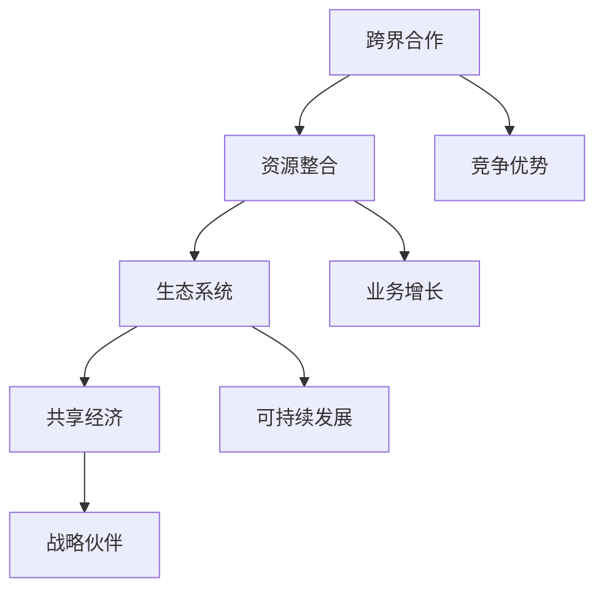

                 


# 创业公司的跨界合作与资源整合方法

> **关键词**：跨界合作、资源整合、创业公司、战略伙伴、生态系统、共享经济
> 
> **摘要**：本文将探讨创业公司在发展过程中如何通过跨界合作与资源整合，以实现快速成长和竞争优势。文章将分析跨界合作的意义、资源整合的策略、以及如何构建可持续的合作生态系统。同时，通过实际案例和代码示例，为读者提供具体的实施指南。

## 1. 背景介绍

### 1.1 目的和范围

本文旨在帮助创业公司在复杂的市场环境中，通过跨界合作和资源整合，实现业务的快速增长和长期竞争力。我们将探讨以下内容：

- 跨界合作的概念和重要性
- 资源整合的策略和方法
- 如何构建可持续的合作生态系统
- 实际案例分析

### 1.2 预期读者

- 创业公司创始人
- 企业高管
- 项目经理
- 市场营销专家
- 研发人员

### 1.3 文档结构概述

本文分为十个部分：

1. 背景介绍
2. 核心概念与联系
3. 核心算法原理 & 具体操作步骤
4. 数学模型和公式 & 详细讲解 & 举例说明
5. 项目实战：代码实际案例和详细解释说明
6. 实际应用场景
7. 工具和资源推荐
8. 总结：未来发展趋势与挑战
9. 附录：常见问题与解答
10. 扩展阅读 & 参考资料

### 1.4 术语表

#### 1.4.1 核心术语定义

- **跨界合作**：不同领域或行业的公司或组织之间的合作。
- **资源整合**：将内外部资源有效整合，以实现共同目标。
- **生态系统**：一个由多个参与者共同构成的复杂系统，旨在实现资源的高效利用和持续发展。

#### 1.4.2 相关概念解释

- **共享经济**：通过共享资源或服务来创造价值的经济模式。
- **战略伙伴**：具有长期合作关系的合作伙伴，共同推进业务发展。

#### 1.4.3 缩略词列表

- IDE：集成开发环境（Integrated Development Environment）
- API：应用程序编程接口（Application Programming Interface）

## 2. 核心概念与联系

在探讨创业公司的跨界合作与资源整合之前，我们需要了解几个核心概念，包括它们之间的关系。以下是核心概念的 Mermaid 流程图：



### 2.1 跨界合作

跨界合作是指不同领域或行业的公司或组织之间的合作。这种合作有助于企业开拓新市场、获取新技术、提高竞争力。例如，一家科技公司可以与一家零售公司合作，通过线上平台销售产品，从而实现双方业务的增长。

### 2.2 资源整合

资源整合是将企业内外部资源有效整合，以实现共同目标。这包括人力、资金、技术、市场等资源的整合。资源整合有助于提高企业的运营效率，降低成本，提高市场竞争力。

### 2.3 生态系统

生态系统是一个由多个参与者共同构成的复杂系统，旨在实现资源的高效利用和持续发展。创业公司可以通过构建生态系统，吸引合作伙伴、投资者、客户等参与者，共同推动业务发展。

### 2.4 共享经济

共享经济是通过共享资源或服务来创造价值的经济模式。例如，共享单车、共享办公等。共享经济有助于降低资源浪费，提高资源利用效率，为企业带来新的商业模式和盈利点。

### 2.5 战略伙伴

战略伙伴是具有长期合作关系的合作伙伴，共同推进业务发展。战略伙伴之间的关系通常更加紧密，涉及资源共享、市场开拓、技术研发等方面。

## 3. 核心算法原理 & 具体操作步骤

跨界合作与资源整合的具体操作步骤可以看作是一种算法，其核心在于如何找到合适的合作伙伴，并实现资源的有效整合。以下是该算法的伪代码：

```python
def 跨界合作与资源整合（公司A，公司B）：
    # 步骤1：分析公司A和公司B的优势与需求
    A_advantages = 分析优势（公司A）
    B_advantages = 分析优势（公司B）
    A_needs = 分析需求（公司A）
    B_needs = 分析需求（公司B）

    # 步骤2：寻找合作机会
    cooperation_opportunities = 寻找合作机会（A_advantages，B_needs）

    # 步骤3：评估合作风险与收益
    risks_and_returns = 评估风险与收益（合作机会）

    # 步骤4：制定合作方案
    cooperation_plan = 制定合作方案（最佳合作机会）

    # 步骤5：实施合作
    执行合作方案（cooperation_plan）

    # 步骤6：监控与调整
    监控合作进展，并根据实际情况进行调整
```

### 3.1 分析公司优势与需求

分析公司A和公司B的优势与需求是跨界合作与资源整合的第一步。这可以通过以下方式实现：

- **内部调研**：了解公司的核心业务、技术能力、市场地位等。
- **外部调研**：分析竞争对手、市场趋势、客户需求等。

### 3.2 寻找合作机会

在了解公司A和公司B的优势与需求后，接下来是寻找合作机会。这可以通过以下方式实现：

- **头脑风暴**：集合公司内部员工和合作伙伴的智慧，提出可能的合作方案。
- **数据分析**：使用数据分析工具，分析公司优势和需求之间的匹配度。

### 3.3 评估合作风险与收益

评估合作风险与收益是决定是否进行跨界合作的关键。这可以通过以下方式实现：

- **风险分析**：评估合作过程中可能出现的风险，如技术风险、市场风险、法律风险等。
- **收益分析**：预测合作带来的收益，如市场扩大、成本降低、技术创新等。

### 3.4 制定合作方案

在评估合作风险与收益后，制定具体的合作方案。这可以通过以下方式实现：

- **明确目标**：确定合作的目标和预期成果。
- **分配资源**：明确各方的责任和资源投入。
- **制定计划**：制定详细的实施计划和时间表。

### 3.5 实施合作

实施合作方案是跨界合作与资源整合的关键步骤。这可以通过以下方式实现：

- **沟通协调**：确保各方对合作目标和计划有清晰的理解。
- **执行任务**：按照计划执行各项任务。
- **监控进展**：定期检查合作进展，确保目标达成。

### 3.6 监控与调整

在实施合作过程中，需要不断监控进展，并根据实际情况进行调整。这可以通过以下方式实现：

- **数据监控**：使用数据工具监控合作效果。
- **反馈机制**：建立有效的反馈机制，收集各方意见和建议。
- **调整计划**：根据实际情况调整合作方案。

## 4. 数学模型和公式 & 详细讲解 & 举例说明

在跨界合作与资源整合过程中，数学模型和公式可以帮助我们更好地评估合作的风险与收益。以下是一个简单的数学模型，用于评估跨界合作的风险与收益：

### 4.1 风险与收益模型

设公司A和公司B的合作收益为 \( R \)，合作风险为 \( R_r \)，公司A和公司B的合作成本为 \( C \)，则有以下公式：

\[ R = R_r - C \]

### 4.2 详细讲解

- **收益 \( R \)**：表示跨界合作带来的总体收益，包括市场扩大、成本降低、技术创新等。
- **风险 \( R_r \)**：表示跨界合作可能带来的风险，如技术风险、市场风险、法律风险等。
- **成本 \( C \)**：表示跨界合作的成本，包括人力、资金、资源投入等。

### 4.3 举例说明

假设公司A是一家科技公司，公司B是一家零售公司。他们计划合作开发一款智能购物平台，预计收益为1000万元，风险为200万元，合作成本为500万元。则：

\[ R = R_r - C \]
\[ R = 1000 - 200 - 500 \]
\[ R = 300 \]

这意味着，通过这次合作，公司A和公司B预计可以获得300万元的净收益。

## 5. 项目实战：代码实际案例和详细解释说明

为了更好地理解跨界合作与资源整合的方法，我们通过一个实际项目案例进行讲解。本案例为一家科技公司（公司A）与一家零售公司（公司B）合作开发一款智能购物平台。

### 5.1 开发环境搭建

1. **硬件环境**：购买服务器、存储设备等硬件设施。
2. **软件环境**：搭建Linux服务器，安装Web服务器（如Apache、Nginx）、数据库（如MySQL、PostgreSQL）等。
3. **开发工具**：选择合适的开发工具，如IDE（如Visual Studio Code、Eclipse）、版本控制工具（如Git）等。

### 5.2 源代码详细实现和代码解读

#### 5.2.1 代码实现

以下是一个简单的智能购物平台后端代码示例，使用Python和Flask框架编写：

```python
from flask import Flask, request, jsonify
app = Flask(__name__)

@app.route('/api/products', methods=['GET'])
def get_products():
    # 从数据库获取商品列表
    products = 获取商品列表（数据库连接）
    return jsonify(products)

@app.route('/api/products/<int:product_id>', methods=['GET'])
def get_product(product_id):
    # 从数据库获取指定商品信息
    product = 获取商品信息（数据库连接，product_id）
    return jsonify(product)

@app.route('/api/products', methods=['POST'])
def create_product():
    # 接收前端发送的商品数据
    product_data = request.get_json()
    # 将商品数据存储到数据库
    存储商品数据（数据库连接，product_data）
    return jsonify({'message': '商品创建成功'})

if __name__ == '__main__':
    app.run(host='0.0.0.0', port=5000)
```

#### 5.2.2 代码解读

- **路由定义**：使用Flask框架定义了三个路由，分别用于获取商品列表、获取指定商品信息、创建商品。
- **数据库操作**：通过调用数据库连接函数，实现商品数据的获取、存储等操作。
- **前后端交互**：通过JSON格式，实现前后端的通信。

### 5.3 代码解读与分析

本案例中，公司A负责后端开发，公司B负责前端设计和业务逻辑。双方通过API接口进行数据交互，实现智能购物平台的功能。

- **优势**：通过跨界合作，公司A可以将自身的开发能力应用于公司B的业务场景，快速实现产品功能。
- **挑战**：双方需要在技术栈、开发流程等方面达成一致，确保数据的安全性和稳定性。

## 6. 实际应用场景

跨界合作与资源整合在创业公司中具有广泛的应用场景，以下列举几个实际应用案例：

1. **科技公司与零售公司的合作**：通过智能购物平台，实现线上线下的无缝连接，提高客户购物体验。
2. **传统制造业与互联网公司的合作**：通过智能制造，提高生产效率，降低成本。
3. **医疗公司与制药公司的合作**：共同研发新药，加快产品上市速度。
4. **金融公司与电商平台合作**：为用户提供金融服务，提高用户粘性。

## 7. 工具和资源推荐

### 7.1 学习资源推荐

#### 7.1.1 书籍推荐

- 《跨界创新：从0到1的商业模式创新》
- 《跨界合作：构建可持续生态系统的策略》
- 《共享经济：重构商业模式的12种模式》

#### 7.1.2 在线课程

- 《跨界合作与资源整合》
- 《智能购物平台开发实战》
- 《大数据分析与挖掘》

#### 7.1.3 技术博客和网站

- [CSDN](https://www.csdn.net/)
- [掘金](https://juejin.cn/)
- [GitHub](https://github.com/)

### 7.2 开发工具框架推荐

#### 7.2.1 IDE和编辑器

- Visual Studio Code
- Eclipse
- PyCharm

#### 7.2.2 调试和性能分析工具

- Postman
- New Relic
- AppDynamics

#### 7.2.3 相关框架和库

- Flask
- Django
- React
- Vue.js

### 7.3 相关论文著作推荐

#### 7.3.1 经典论文

- "The Innovator's Dilemma" by Clayton M. Christensen
- "The Business Model Canvas" by Alex Osterwalder and Yves Pigneur
- "The Lean Startup" by Eric Ries

#### 7.3.2 最新研究成果

- "Crossover Innovation: Disrupting the Status Quo" by Henry Chesbrough
- "Platform Leadership: How Intel, Microsoft, and Cisco Drive their Industries" by Michael E. Porter and James E. Heppelmann
- "The Future of Business: A Guide to Thriving in the New Economy" by Jim Clifton and Jason urged

#### 7.3.3 应用案例分析

- "How Airbnb Disrupted the Hotel Industry"
- "Uber: How a Startup Took on the Taxi Industry"
- "The Rise of SpaceX: How Elon Musk is Revolutionizing Space Travel"

## 8. 总结：未来发展趋势与挑战

随着技术的不断进步和市场的变化，跨界合作与资源整合将成为创业公司的重要战略。未来发展趋势包括：

1. **数字化与智能化**：跨界合作将更加依赖于数字化和智能化技术，实现资源的高效整合和业务创新。
2. **生态系统的构建**：创业公司将更加注重生态系统的构建，通过合作和共享，实现资源的最大化利用。
3. **合作模式的创新**：跨界合作模式将不断创新，如共享经济、平台合作等，为企业带来新的商业模式和盈利点。

然而，跨界合作与资源整合也面临着诸多挑战：

1. **技术风险**：跨界合作可能涉及不同的技术领域，需要确保技术可靠性和兼容性。
2. **管理挑战**：跨界合作需要有效的沟通和管理，确保各方目标的达成和合作的顺利进行。
3. **法律风险**：跨界合作可能涉及知识产权、合同签订等方面，需要确保合法性。

## 9. 附录：常见问题与解答

### 9.1 跨界合作的优势有哪些？

- **开拓新市场**：通过跨界合作，企业可以进入新的市场，扩大业务范围。
- **获取新技术**：合作方可以共享技术资源，提高自身技术水平。
- **降低成本**：合作各方可以共同分担研发、生产等成本，提高效益。
- **提高竞争力**：跨界合作可以为企业带来新的竞争优势，提高市场地位。

### 9.2 跨界合作的挑战有哪些？

- **技术风险**：跨界合作可能涉及不同的技术领域，需要确保技术可靠性和兼容性。
- **管理挑战**：跨界合作需要有效的沟通和管理，确保各方目标的达成和合作的顺利进行。
- **法律风险**：跨界合作可能涉及知识产权、合同签订等方面，需要确保合法性。

### 9.3 资源整合的策略有哪些？

- **内部整合**：将企业内部资源进行整合，提高运营效率。
- **外部整合**：与合作伙伴共享资源，实现资源的高效利用。
- **供应链整合**：优化供应链，降低成本，提高交付效率。

## 10. 扩展阅读 & 参考资料

- [Osterwalder, A., & Pigneur, Y. (2010). Business Model Generation: A Handbook for Visionaries, Game Changers, and Leaders of the Future. John Wiley & Sons.](https://www.businessmodelgeneration.com/)
- [Christensen, C. M. (1997). The Innovator's Dilemma: When New Technologies Cause Great Firms to Fail. Harvard Business Review.](https://hbr.org/product/the-innovators-dilemma-when-new-technologies-cause-great-firms-to-fail/859093-PDF-ENG)
- [Ries, E. (2011). The Lean Startup: How Today's Entrepreneurs Use Continuous Innovation to Create Radically Successful Businesses. Crown Business.](https://www.leanstack.com/book)
- [Chesbrough, H. (2006). Open Innovation: The New Imperative for Creating and Profiting from Technology. Harvard Business Press.](https://www.hbs.edu/faculty/Pages/item.aspx?num=31199)

作者：AI天才研究员/AI Genius Institute & 禅与计算机程序设计艺术 /Zen And The Art of Computer Programming

