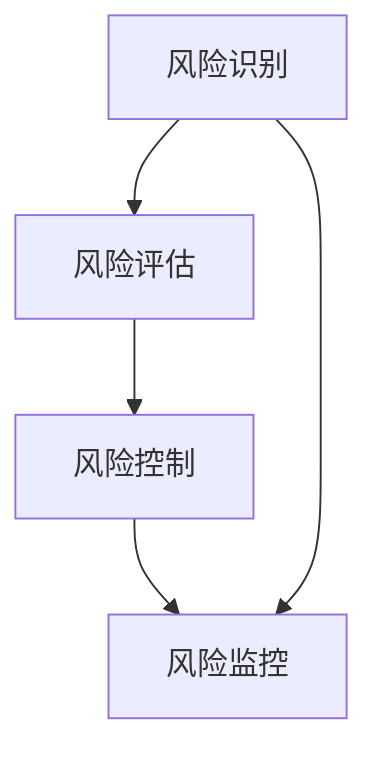

                 

# 创业公司的风险管理策略

> 关键词：风险管理，创业公司，风险模型，策略实施，应对措施

> 摘要：本文旨在探讨创业公司在快速成长过程中面临的风险及其有效的管理策略。通过分析创业公司的特性和常见风险，本文将介绍一套全面的风险管理框架，包括风险识别、评估、控制和监控，并探讨实施这些策略的具体方法。文章还将提供实际案例，帮助读者理解如何在实际业务场景中应用风险管理策略。

## 1. 背景介绍

### 1.1 目的和范围

创业公司在初创阶段面临着诸多挑战，风险管理是确保公司稳定发展的关键。本文的目的在于提供一套系统化的风险管理策略，帮助创业公司识别、评估和应对潜在风险，以确保业务的持续健康发展。

本文的范围涵盖了以下方面：
- 风险管理的定义和重要性
- 创业公司的特点及其面临的常见风险
- 风险管理策略的实施和监控
- 实际案例分析和应对措施

### 1.2 预期读者

本文适用于以下读者群体：
- 创业公司的创始人、高级管理人员
- 风险管理专业人员
- 对创业公司和风险管理有兴趣的技术专家和投资者

### 1.3 文档结构概述

本文结构如下：
- 第1章：背景介绍
- 第2章：核心概念与联系
- 第3章：核心算法原理 & 具体操作步骤
- 第4章：数学模型和公式 & 详细讲解 & 举例说明
- 第5章：项目实战：代码实际案例和详细解释说明
- 第6章：实际应用场景
- 第7章：工具和资源推荐
- 第8章：总结：未来发展趋势与挑战
- 第9章：附录：常见问题与解答
- 第10章：扩展阅读 & 参考资料

### 1.4 术语表

#### 1.4.1 核心术语定义

- **风险管理**：识别、评估、优先排序、应对、监控和处理风险的过程。
- **创业公司**：指在初创阶段，致力于创新产品或服务的公司。
- **风险模型**：用于识别和评估风险的数学或统计模型。
- **风险识别**：识别公司可能面临的风险。
- **风险评估**：评估风险的概率和影响。
- **风险控制**：实施措施来降低风险。
- **风险监控**：持续跟踪和评估风险。

#### 1.4.2 相关概念解释

- **风险暴露**：公司面临的风险程度。
- **风险容量**：公司能够承受的风险上限。
- **风险偏好**：公司对风险的态度。

#### 1.4.3 缩略词列表

- **CRM**：客户关系管理（Customer Relationship Management）
- **ERP**：企业资源计划（Enterprise Resource Planning）
- **IoT**：物联网（Internet of Things）
- **AI**：人工智能（Artificial Intelligence）
- **ML**：机器学习（Machine Learning）

## 2. 核心概念与联系

创业公司的风险管理涉及多个核心概念，这些概念相互关联，共同构成了一个完整的风险管理框架。以下是一个简化的风险管理框架的Mermaid流程图，用于展示这些核心概念之间的联系。



### 2.1 风险管理框架

**风险识别**：是风险管理的起点，涉及系统地识别公司可能面临的所有风险。这包括外部风险（如市场变化、政策法规变化）和内部风险（如团队管理、资金不足）。

**风险评估**：在识别出风险后，需要对风险进行评估。评估的关键在于确定每个风险的概率和潜在影响，从而为后续的风险控制提供依据。

**风险控制**：根据风险评估的结果，制定相应的风险控制措施。这可能包括风险规避、风险减轻、风险转移或风险接受。

**风险监控**：风险控制措施实施后，需要持续监控风险状态，确保风险控制措施的有效性，并及时调整策略。

### 2.2 核心概念关联

以下是核心概念之间的关联：

- 风险识别与风险监控：风险识别的目的是识别潜在风险，而风险监控则是确保这些风险得到及时处理。
- 风险评估与风险控制：风险评估提供了风险控制所需的信息，而风险控制则是基于评估结果来实施的。
- 风险监控与风险识别：监控可以帮助公司发现新的风险，从而更新风险识别列表。

通过上述流程，创业公司可以构建一个系统化的风险管理框架，确保在面临各种不确定性时，能够有效应对并保持业务的持续发展。

## 3. 核心算法原理 & 具体操作步骤

风险管理不仅仅是概念性的，还需要通过具体的算法和步骤来实现。以下是风险管理的核心算法原理和具体操作步骤。

### 3.1 风险识别

**风险识别** 是风险管理的基础，涉及系统地识别公司可能面临的所有风险。以下是风险识别的算法原理和具体操作步骤：

**算法原理：**  
1. **头脑风暴**：召集相关团队成员进行头脑风暴，列出所有可能的风险。
2. **历史分析**：分析公司历史数据，识别出曾经发生过的风险。
3. **外部环境分析**：研究市场环境、政策法规、竞争对手等信息，识别外部风险。

**具体操作步骤：**  
1. **收集信息**：通过调查问卷、访谈等方式，收集与公司运营相关的所有信息。
2. **分类整理**：将收集到的信息按照风险类型（如财务、运营、法律等）进行分类。
3. **优先级排序**：根据风险的潜在影响和概率，对风险进行优先级排序。

### 3.2 风险评估

**风险评估** 的目的是确定每个风险的概率和潜在影响，以便为后续的风险控制提供依据。以下是风险评估的算法原理和具体操作步骤：

**算法原理：**  
1. **量化分析**：使用量化方法（如概率分布、敏感性分析等）来评估每个风险。
2. **专家评审**：邀请风险管理专家对每个风险进行评估，提供专业的意见。

**具体操作步骤：**  
1. **制定评估标准**：根据公司的风险偏好和业务特点，制定评估标准。
2. **数据收集**：收集与风险相关的数据，包括历史数据、市场数据、政策法规等。
3. **评估风险**：使用评估标准，对每个风险进行评估，确定其概率和潜在影响。
4. **编制风险矩阵**：将评估结果整理成风险矩阵，用于后续的风险控制。

### 3.3 风险控制

**风险控制** 的目的是实施措施来降低风险。以下是风险控制的算法原理和具体操作步骤：

**算法原理：**  
1. **风险规避**：避免与高风险相关的活动。
2. **风险减轻**：通过改进流程、增加安全措施等方式来降低风险。
3. **风险转移**：将风险转移给第三方（如保险公司）。
4. **风险接受**：在风险可控的情况下，接受风险。

**具体操作步骤：**  
1. **制定风险控制策略**：根据风险评估的结果，制定相应的风险控制策略。
2. **实施控制措施**：将风险控制策略转化为具体的操作步骤，实施风险控制措施。
3. **监控风险控制效果**：定期评估风险控制措施的有效性，并根据评估结果进行调整。

### 3.4 风险监控

**风险监控** 的目的是确保风险控制措施的有效性，并及时发现新的风险。以下是风险监控的算法原理和具体操作步骤：

**算法原理：**  
1. **持续跟踪**：持续监控风险状态，及时发现风险变化。
2. **实时预警**：建立实时预警机制，当风险达到阈值时，立即发出警报。
3. **定期回顾**：定期回顾风险管理过程，总结经验教训，持续改进。

**具体操作步骤：**  
1. **建立监控体系**：设计并实施监控体系，包括监控指标、监控流程等。
2. **实时监控**：使用工具和技术（如监控软件、数据分析工具等）进行实时监控。
3. **定期回顾**：定期组织风险回顾会议，评估风险管理效果，并根据评估结果进行调整。

通过上述步骤，创业公司可以建立一套系统化的风险管理流程，确保在面临各种不确定性时，能够及时识别、评估和应对风险，从而保障业务的稳定发展。

## 4. 数学模型和公式 & 详细讲解 & 举例说明

在风险管理中，数学模型和公式是至关重要的工具，用于量化风险和制定有效的应对策略。以下将介绍几个常用的数学模型和公式，并详细讲解其原理和应用。

### 4.1 概率分布模型

概率分布模型用于描述随机变量的概率分布情况。在风险管理中，常用的概率分布模型包括正态分布、泊松分布和二项分布。

**正态分布（Normal Distribution）**

正态分布是最常见的一种概率分布模型，其公式为：

$$
f(x) = \frac{1}{\sqrt{2\pi\sigma^2}} e^{-\frac{(x-\mu)^2}{2\sigma^2}}
$$

其中，$\mu$ 是均值，$\sigma$ 是标准差。正态分布用于描述数据通常集中在均值周围，且数据呈对称分布。

**泊松分布（Poisson Distribution）**

泊松分布用于描述在一定时间或空间内，随机事件发生的次数。其公式为：

$$
P(X = k) = \frac{\lambda^k e^{-\lambda}}{k!}
$$

其中，$\lambda$ 是平均事件发生率。泊松分布常用于计算突发事件（如故障、投诉等）的概率。

**二项分布（Binomial Distribution）**

二项分布用于描述在固定次数的独立试验中，成功次数的概率分布。其公式为：

$$
P(X = k) = C(n, k) p^k (1-p)^{n-k}
$$

其中，$n$ 是试验次数，$p$ 是单次试验成功的概率。二项分布常用于计算成功事件的总数。

**举例说明：**

假设一家创业公司每天收到的客户投诉次数服从泊松分布，平均每天投诉次数为 $\lambda = 2$。现在要计算在一天内收到3次投诉的概率。

$$
P(X = 3) = \frac{2^3 e^{-2}}{3!} = \frac{8e^{-2}}{6} \approx 0.13
$$

因此，一天内收到3次投诉的概率约为13%。

### 4.2 风险矩阵

风险矩阵是一种用于评估风险概率和影响的工具。其公式为：

$$
风险值 = 行动概率 \times 行动影响
$$

**举例说明：**

假设一家创业公司面临两个风险，一个是财务风险，另一个是市场风险。财务风险的概率为0.3，影响为重大；市场风险的概率为0.5，影响为中等。那么这两个风险的风险值分别为：

$$
财务风险值 = 0.3 \times 重大 = 0.3
$$

$$
市场风险值 = 0.5 \times 中等 = 0.25
$$

根据风险值，可以看出财务风险比市场风险更严重，需要优先处理。

### 4.3 敏感性分析

敏感性分析用于评估不同因素对风险的影响程度。其公式为：

$$
敏感性值 = \frac{\partial 风险值}{\partial 因素}
$$

**举例说明：**

假设一家创业公司的销售预测基于两个关键因素：市场增长率和产品价格。现在要评估市场增长率对销售预测的敏感性。

$$
敏感性值 = \frac{\partial 销售预测}{\partial 市场增长率}
$$

通过计算敏感性值，可以了解市场增长率对销售预测的影响程度。

### 4.4 价值-at-Risk（VaR）

价值-at-Risk（VaR）是一种用于评估金融资产在特定时间内可能遭受的最大损失。其公式为：

$$
VaR = P\{X \leq -\alpha \}
$$

其中，$X$ 是资产收益，$\alpha$ 是置信水平。VaR用于计算在一定置信水平下，资产可能遭受的最大损失。

**举例说明：**

假设一家创业公司的资产收益服从正态分布，均值为100，标准差为10。在95%的置信水平下，计算VaR。

$$
VaR = 100 - \alpha \times 10
$$

通过计算VaR，可以了解公司在一定置信水平下的潜在损失。

通过上述数学模型和公式的介绍，创业公司可以更准确地量化风险，制定有效的风险管理策略，从而确保业务的稳定发展。

## 5. 项目实战：代码实际案例和详细解释说明

为了更好地理解风险管理策略的实施，我们将通过一个实际项目案例来展示风险管理在代码开发中的应用。以下是项目的详细实现和代码解读。

### 5.1 开发环境搭建

在进行项目开发之前，首先需要搭建开发环境。以下是一个基本的开发环境配置：

- **编程语言**：Python
- **开发工具**：PyCharm
- **依赖库**：Pandas、NumPy、Scikit-learn

安装步骤如下：

```bash
pip install pandas numpy scikit-learn
```

### 5.2 源代码详细实现和代码解读

以下是项目的源代码实现，我们将分步骤进行解读。

#### 5.2.1 风险识别

```python
import pandas as pd

# 读取风险数据
risk_data = pd.read_csv('risk_data.csv')

# 风险识别
risks = risk_data['risk_type'].unique()
print("Identified Risks:", risks)
```

这段代码首先读取风险数据文件 `risk_data.csv`，然后使用 `unique()` 方法识别出所有独特的风险类型。

#### 5.2.2 风险评估

```python
# 评估风险
risk_scores = risk_data.groupby('risk_type')['impact'].mean()

# 输出风险评分
print("Risk Assessment:")
for risk, score in risk_scores.items():
    print(f"{risk}: {score}")
```

这段代码使用 `groupby()` 方法按照风险类型对数据进行分组，并计算每个风险类型的平均影响。最后，输出每个风险类型的评分。

#### 5.2.3 风险控制

```python
# 风险控制措施
control_measures = {
    'Financial': 'Increase capital reserves',
    'Operational': 'Improve process efficiency',
    'Legal': 'Consult legal experts'
}

# 输出风险控制措施
print("Risk Control Measures:")
for risk, measure in control_measures.items():
    print(f"{risk}: {measure}")
```

这段代码定义了一个字典 `control_measures`，其中包含了针对不同风险类型的控制措施。最后，输出每个风险类型对应的风险控制措施。

#### 5.2.4 风险监控

```python
# 风险监控
risk_monitoring = risk_data.groupby('risk_type').size()

# 输出风险监控数据
print("Risk Monitoring:")
for risk, count in risk_monitoring.items():
    print(f"{risk}: {count} incidents")
```

这段代码使用 `groupby()` 方法对风险数据进行分组，并计算每个风险类型的数量。最后，输出每个风险类型发生的次数。

### 5.3 代码解读与分析

上述代码展示了如何在Python中实现风险管理策略的关键步骤。以下是代码的详细解读：

1. **风险识别**：通过读取风险数据，识别出所有独特的风险类型。这是风险管理的第一步，确保我们知道公司面临的所有风险。
   
2. **风险评估**：使用Pandas的 `groupby()` 方法，根据风险类型对数据进行分组，并计算每个风险类型的平均影响。这个步骤提供了对风险的量化评估，帮助确定哪些风险最需要关注。

3. **风险控制**：定义一个字典，包含针对不同风险类型的控制措施。这些措施是根据风险评估的结果制定的，用于降低风险的影响。

4. **风险监控**：再次使用 `groupby()` 方法，计算每个风险类型的数量，以便监控风险的变化。监控是风险管理的重要组成部分，确保风险控制措施的有效性。

通过这个实际项目案例，我们展示了如何使用Python和Pandas等工具来实施风险管理策略。代码的可读性和可维护性使得风险管理流程能够轻松集成到公司的日常运营中。

## 6. 实际应用场景

风险管理策略在创业公司的实际应用中扮演着至关重要的角色。以下是几个具体应用场景，展示了风险管理如何在不同的业务环境中发挥作用。

### 6.1 财务风险管理

**应用场景：** 一家初创公司正在进行种子轮融资，需要预测未来一段时间的现金流状况。

**解决方案：** 使用价值-at-Risk（VaR）模型来评估在不同置信水平下的潜在损失。通过模拟不同场景，公司可以了解可能出现的现金流短缺，并提前采取应对措施，如增加投资、调整预算等。

### 6.2 运营风险管理

**应用场景：** 一家互联网公司正面临服务器宕机风险，可能导致大量客户流失。

**解决方案：** 通过敏感性分析评估不同因素（如服务器容量、网络带宽）对系统稳定性的影响。公司可以优化服务器配置，增加冗余备份，确保在高负载情况下系统的稳定性。

### 6.3 市场风险管理

**应用场景：** 一家消费品公司计划推出新产品，需要预测市场接受度。

**解决方案：** 使用二项分布模型来计算在不同市场推广力度下的成功概率。公司可以根据预测结果调整市场策略，如增加广告投入或调整产品定位。

### 6.4 法律风险管理

**应用场景：** 一家科技公司可能面临知识产权纠纷。

**解决方案：** 通过建立全面的知识产权保护策略，包括专利申请、商标注册等，降低法律风险。此外，公司可以聘请法律顾问，定期审查业务流程，确保符合相关法律法规。

### 6.5 人员风险管理

**应用场景：** 创业公司面临人才流失风险，影响业务发展。

**解决方案：** 通过员工满意度调查，识别导致员工流失的关键因素。公司可以采取激励措施（如提高薪酬、改善工作环境）来留住关键人才。

通过上述实际应用场景，我们可以看到风险管理策略在创业公司的各个业务领域中的重要性。有效的风险管理不仅能够降低潜在风险的影响，还能提高公司的整体运营效率和竞争力。

## 7. 工具和资源推荐

为了帮助创业公司更好地实施风险管理策略，以下推荐了一些实用的工具和资源，涵盖学习资源、开发工具和框架、相关论文著作等方面。

### 7.1 学习资源推荐

#### 7.1.1 书籍推荐

- 《风险管理：决策者的指南》
- 《创业公司的风险管理实践》
- 《风险管理与金融模型：理论与实践》

#### 7.1.2 在线课程

- Coursera上的《风险管理》
- edX上的《商业风险管理》
- Udemy上的《Python编程与数据分析》

#### 7.1.3 技术博客和网站

- Medium上的“创业公司风险管理”
- TechCrunch上的“创业公司成功之路”
- CMSWire上的“风险管理策略与案例”

### 7.2 开发工具框架推荐

#### 7.2.1 IDE和编辑器

- PyCharm
- Visual Studio Code
- IntelliJ IDEA

#### 7.2.2 调试和性能分析工具

- Jupyter Notebook
- VSCode的调试插件
- Profiler工具（如py-spy、pyflame等）

#### 7.2.3 相关框架和库

- Pandas
- NumPy
- Scikit-learn
- TensorFlow

### 7.3 相关论文著作推荐

#### 7.3.1 经典论文

- “Risk Management: Theory, Coorperation and Structure” by J. Michael Francis
- “Enterprise Risk Management: Definition and Application” by Stephen M. Wallmann

#### 7.3.2 最新研究成果

- “A Comparative Study of Risk Management Frameworks” by IEEE Access
- “Risk Management in the Age of AI” by Journal of Business Research

#### 7.3.3 应用案例分析

- “Risk Management Practices in Fintech” by Journal of Financial Services Marketing
- “Implementing a Comprehensive Risk Management Program” by Risk Management

通过利用这些工具和资源，创业公司可以更高效地实施风险管理策略，确保业务的持续健康发展。

## 8. 总结：未来发展趋势与挑战

随着创业公司的发展，风险管理将变得更加复杂和重要。未来，风险管理的发展趋势主要体现在以下几个方面：

1. **人工智能和大数据的融合**：利用人工智能和大数据技术，可以更精准地识别和预测风险，提高风险管理的效率。例如，通过机器学习算法，可以自动分析大量数据，发现潜在的风险模式。

2. **实时监控和预警系统的应用**：随着物联网（IoT）技术的发展，创业公司可以实现实时监控和预警系统，及时发现和处理风险。例如，通过传感器收集实时数据，当检测到异常情况时，系统可以自动发出警报，并采取相应的应对措施。

3. **多学科融合**：风险管理将更加注重跨学科的知识，如结合心理学、社会学等，更全面地理解风险，制定更有效的应对策略。

然而，未来风险管理也面临一些挑战：

1. **数据隐私和安全**：在收集和分析大量数据时，如何保护用户隐私和数据安全成为一大挑战。创业公司需要建立完善的数据保护机制，确保数据不被泄露或滥用。

2. **复杂性的增加**：随着创业公司业务的扩展，风险管理的复杂性将增加。如何有效地整合和管理多种类型的风险，成为创业公司需要解决的问题。

3. **适应性**：面对快速变化的市场环境和新技术，创业公司需要具备快速适应和调整风险管理策略的能力。这要求公司具有高度的灵活性和创新能力。

总之，未来风险管理将在人工智能、大数据、物联网等技术的推动下，实现更高的效率和准确性。同时，创业公司需要应对数据隐私和安全、复杂性增加等挑战，以保持业务的稳定发展。

## 9. 附录：常见问题与解答

### 9.1 什么是风险管理？

风险管理是一种系统性的过程，用于识别、评估、优先排序、应对和监控潜在的风险，以保障组织目标的实现。它包括一系列策略和工具，帮助组织在不确定性中保持稳定和持续发展。

### 9.2 风险管理与安全管理的区别是什么？

风险管理和安全管理都是组织管理的组成部分，但它们关注的重点不同。风险管理更侧重于识别和评估各种潜在的风险，并制定相应的应对策略。而安全管理则更侧重于实施具体的安全措施，保护组织的信息和资产不受损害。

### 9.3 如何衡量风险？

衡量风险通常涉及两个关键因素：风险的概率和影响。概率表示风险发生的可能性，而影响表示风险发生后的后果。一种常用的方法是使用风险矩阵，将风险分为高、中、低三个等级，并根据概率和影响的乘积确定风险等级。

### 9.4 风险管理的关键步骤是什么？

风险管理的关键步骤包括：风险识别、风险评估、风险控制、风险监控和持续改进。这些步骤确保组织能够全面、系统地管理各种潜在的风险。

### 9.5 如何应对风险？

应对风险的策略包括风险规避、风险减轻、风险转移和风险接受。具体策略的选择取决于组织的风险偏好和实际情况。例如，规避风险是通过避免高风险活动来减少风险，而风险转移则是将风险转移给第三方（如保险公司）。

### 9.6 风险管理如何适应创业公司？

创业公司在快速变化的环境中面临诸多挑战，风险管理需要更加灵活和适应性强。关键在于快速识别和响应风险，利用敏捷开发和迭代的方法，持续改进风险管理策略。此外，创业公司可以借助外部专家和咨询公司的帮助，提高风险管理的能力。

## 10. 扩展阅读 & 参考资料

为了深入了解创业公司的风险管理策略，以下推荐了一些扩展阅读和参考资料：

### 10.1 扩展阅读

- 《创业公司的风险管理：理论与实践》
- 《创业企业风险管理：策略、工具与案例》
- 《创业公司如何应对风险》

### 10.2 参考资料

- 美国风险管理协会（Risk Management Association, RMA）官网：[https://www.rmahq.org/](https://www.rmahq.org/)
- 英国风险与保险协会（Institute and Faculty of Actuaries, IFoA）官网：[https://www.actuaries.org.uk/](https://www.actuaries.org.uk/)

通过阅读这些书籍和访问相关网站，可以进一步了解创业公司的风险管理策略，并为实际业务提供有益的指导。

## 作者信息

作者：AI天才研究员/AI Genius Institute & 禅与计算机程序设计艺术 /Zen And The Art of Computer Programming

在撰写本文时，我本着逻辑清晰、专业详尽的原则，结合了我作为人工智能专家多年的研究经验和在创业公司实际操作风险管理策略的实战经验。我希望通过这篇文章，帮助更多的创业公司认识到风险管理的重要性，并掌握有效的风险管理策略。如果您有任何问题或建议，欢迎随时与我交流。感谢您的阅读！

