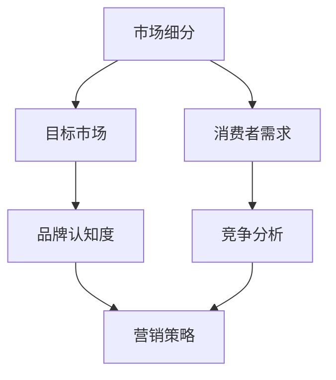
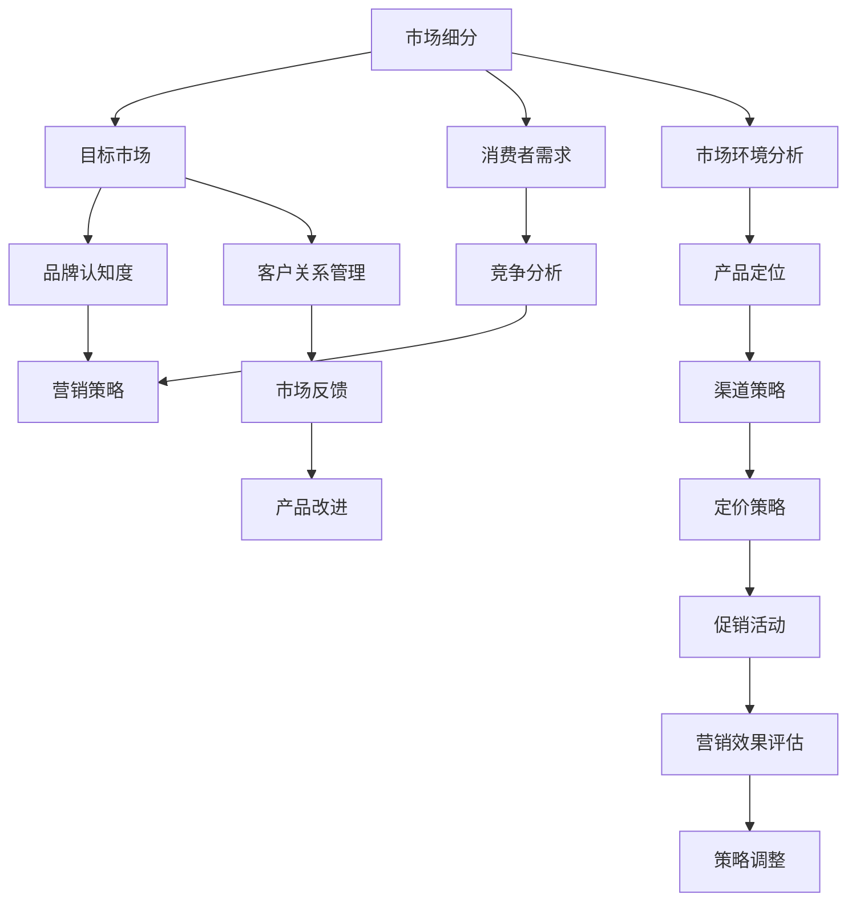

                 

## 1. 背景介绍

### 1.1 目的和范围

本文旨在探讨创业初期如何进行有效的市场教育，帮助初创企业快速获取市场认知，建立品牌影响力，并最终实现商业成功。市场教育是一个长期且系统化的过程，它不仅涉及到企业对目标客户的教育，还包括竞争对手分析、市场定位以及营销策略的制定。

本文将围绕以下几个核心问题展开讨论：

1. **市场教育的定义与重要性**：为何市场教育对初创企业至关重要？
2. **市场教育的主要目标**：企业需要教育市场哪些内容？
3. **市场教育的策略与方法**：有哪些具体的方法可以有效地进行市场教育？
4. **实施步骤**：如何制定和执行一个市场教育计划？
5. **成功案例与经验**：有哪些成功的市场教育案例可以借鉴？

通过本文的讨论，读者将能够深入了解市场教育的本质和实施方法，从而为自己的创业之路提供有价值的指导。

### 1.2 预期读者

本文适合以下几类读者群体：

1. **初创企业创始人**：正处在创业初期的企业家，希望了解如何通过市场教育来推动企业成长。
2. **市场经理与营销人员**：负责市场推广和品牌建设的专业人员，寻求有效的市场教育策略。
3. **投资者与分析师**：对初创企业投资感兴趣，希望了解企业如何通过市场教育实现增值。
4. **高等院校师生**：计算机科学、市场营销等相关专业的研究生和本科生，希望了解市场教育的理论与实践。

无论您属于上述哪一群体，本文都力求提供有深度、有实用性的内容，帮助您更好地理解和应用市场教育的理念和方法。

### 1.3 文档结构概述

为了确保文章内容的系统性和条理性，本文将按照以下结构进行组织：

1. **背景介绍**：介绍本文的目的、范围、预期读者以及文档结构。
2. **核心概念与联系**：阐述市场教育的核心概念，并使用Mermaid流程图展示相关原理和架构。
3. **核心算法原理 & 具体操作步骤**：讲解市场教育的具体实施步骤，并使用伪代码详细阐述。
4. **数学模型和公式 & 详细讲解 & 举例说明**：介绍市场教育相关的数学模型，使用latex格式给出公式，并提供实例说明。
5. **项目实战：代码实际案例和详细解释说明**：通过实际代码案例，展示市场教育的具体应用和实现细节。
6. **实际应用场景**：分析市场教育在不同场景下的应用效果和策略。
7. **工具和资源推荐**：推荐学习资源和开发工具，以帮助读者进一步深入学习和实践。
8. **总结：未来发展趋势与挑战**：展望市场教育的未来趋势和面临的挑战。
9. **附录：常见问题与解答**：解答读者可能遇到的常见问题。
10. **扩展阅读 & 参考资料**：提供进一步学习的相关文献和资料。

通过上述结构，本文将系统地帮助读者理解市场教育的全貌，并提供实用的指导和建议。

### 1.4 术语表

在本文中，我们使用了以下术语，以帮助读者更好地理解相关概念：

#### 1.4.1 核心术语定义

- **市场教育**：指企业通过一系列有针对性的市场活动，向潜在客户和目标市场传达产品或服务信息，提升品牌认知度和市场接受度的过程。
- **目标市场**：指企业为了实现特定营销目标而确定的消费者群体或组织。
- **品牌认知度**：指消费者对企业品牌名称、标志和相关信息的识别和记忆程度。
- **营销策略**：企业在市场推广中采取的一系列计划和行动，以吸引消费者并促进销售。

#### 1.4.2 相关概念解释

- **市场细分**：将整体市场划分为若干具有相似需求的子市场，以便更精准地定位和满足不同客户群体的需求。
- **竞争分析**：对竞争对手的市场策略、产品、服务和市场地位进行分析，以便企业制定有效的市场教育策略。
- **内容营销**：通过创建和分享有价值的内容，吸引和留住目标客户，从而实现市场教育的目标。

#### 1.4.3 缩略词列表

- **SEO（搜索引擎优化）**：通过优化网站内容和结构，提高在搜索引擎中的排名，从而增加网站访问量和市场认知度。
- **SEM（搜索引擎营销）**：通过付费广告和优化手段，在搜索引擎结果页中提高企业网站可见性，以吸引潜在客户。
- **SMM（社交媒体营销）**：利用社交媒体平台进行品牌推广和市场教育，提高品牌知名度和用户互动。

通过明确上述术语和概念，我们希望读者能够更加准确地理解市场教育的内涵和外延，从而更好地应用到实际业务中。

## 2. 核心概念与联系

市场教育是一个涉及多方面知识体系的过程，它不仅要求企业理解自身产品或服务的独特价值，还需要掌握市场、消费者以及竞争对手的相关信息。以下是市场教育中几个核心概念及其相互联系，并通过Mermaid流程图展示其架构和原理。

### 2.1 核心概念

1. **市场细分**：市场细分是企业对整体市场进行划分，以识别具有相似需求的子市场。市场细分有助于企业集中资源和精力，更精准地满足特定客户群体的需求。

2. **目标市场**：目标市场是企业在市场细分基础上选定的、最具潜力的消费群体。确定目标市场有助于企业制定更有效的市场教育策略，从而提高资源利用率。

3. **品牌认知度**：品牌认知度是指消费者对企业品牌名称、标志和相关信息的识别和记忆程度。提升品牌认知度是市场教育的关键目标之一，它直接影响企业的市场接受度和竞争力。

4. **营销策略**：营销策略是企业为实现市场目标所采取的一系列计划和行动。包括产品定价、渠道选择、促销活动等，是实现市场教育的重要手段。

### 2.2 Mermaid流程图

为了更直观地展示市场教育中核心概念的联系，我们使用Mermaid流程图进行描述：



- **市场细分**（A）作为起点，将整体市场划分为具有相似需求的子市场，为确定目标市场（B）提供基础。
- **目标市场**（B）是市场细分的结果，同时也是提升品牌认知度（C）的核心对象。
- **品牌认知度**（C）的提高，有助于企业实现更有效的营销策略（D）。
- **消费者需求**（E）和**竞争分析**（F）是制定营销策略（D）的重要依据。

### 2.3 核心概念解释

1. **市场细分**：市场细分是企业对整体市场进行划分，以识别具有相似需求的子市场。市场细分有助于企业更精准地满足特定客户群体的需求，从而提高市场教育效果。

2. **目标市场**：目标市场是企业在市场细分基础上选定的、最具潜力的消费群体。确定目标市场有助于企业集中资源和精力，制定更有效的市场教育策略。

3. **品牌认知度**：品牌认知度是指消费者对企业品牌名称、标志和相关信息的识别和记忆程度。提升品牌认知度是市场教育的关键目标之一，它直接影响企业的市场接受度和竞争力。

4. **营销策略**：营销策略是企业为实现市场目标所采取的一系列计划和行动。包括产品定价、渠道选择、促销活动等，是实现市场教育的重要手段。

通过上述核心概念的介绍和Mermaid流程图的展示，我们可以更好地理解市场教育的原理和架构。这些概念和流程相互关联，共同构成了市场教育的理论基础和实践指导。

### 2.4 相关概念和原理的详细解释

在市场教育的过程中，理解以下几个关键概念和原理对于制定有效的市场教育策略至关重要。以下是对这些概念和原理的详细解释。

#### 2.4.1 市场细分

市场细分是企业将整体市场划分为若干具有相似需求的子市场的过程。市场细分的主要目的是识别和集中资源服务于最具潜力的客户群体，从而提高市场教育的效率。

- **重要性**：市场细分有助于企业更精准地满足客户需求，提升客户满意度和忠诚度。同时，通过集中资源和精力，企业可以在目标市场上实现更高的市场占有率。

- **细分标准**：市场细分通常基于以下标准：

  1. **地理细分**：根据客户所在的地理位置进行划分，如城市、地区、国家等。
  2. **行为细分**：根据客户的行为特征进行划分，如购买频率、购买时机、使用习惯等。
  3. **心理细分**：根据客户的心理特征进行划分，如生活方式、价值观、兴趣爱好等。
  4. **人口细分**：根据客户的人口特征进行划分，如年龄、性别、收入、教育水平等。

- **实施步骤**：

  1. **数据收集**：通过市场调研、客户反馈等方式收集相关数据。
  2. **数据分析**：对收集到的数据进行分析，识别不同子市场的特征和需求。
  3. **细分评估**：评估每个子市场的潜力和吸引力，确定目标市场。

#### 2.4.2 目标市场

目标市场是企业在市场细分基础上选定的、最具潜力的消费群体。确定目标市场有助于企业集中资源和精力，制定更有效的市场教育策略。

- **重要性**：目标市场是市场教育策略的核心，它决定了企业如何配置资源、设计产品和服务、选择营销渠道等。

- **选择标准**：

  1. **市场规模**：目标市场应具有足够的规模，以支持企业的长期发展。
  2. **增长潜力**：目标市场应具有持续增长的趋势，为企业提供长期的市场机会。
  3. **盈利能力**：目标市场应具有较高的盈利能力，确保企业的市场教育投入能够产生良好的回报。
  4. **竞争程度**：目标市场不应过于拥挤，以避免激烈的竞争。

- **实施步骤**：

  1. **评估市场细分结果**：分析市场细分结果，识别最具潜力的子市场。
  2. **确定目标市场**：根据选择标准，选择最具潜力的子市场作为目标市场。
  3. **市场定位**：明确企业在目标市场中的独特价值和竞争优势，为市场教育提供方向。

#### 2.4.3 品牌认知度

品牌认知度是指消费者对企业品牌名称、标志和相关信息的识别和记忆程度。提升品牌认知度是市场教育的关键目标之一，它直接影响企业的市场接受度和竞争力。

- **重要性**：品牌认知度是品牌价值的重要组成部分，它决定了消费者对品牌的信任和偏好，从而影响购买决策。

- **衡量指标**：

  1. **知名度**：品牌在目标市场中的知名度，反映消费者对企业品牌的认知程度。
  2. **联想度**：消费者对品牌名称和相关信息的联想程度，反映品牌在消费者心中的形象和地位。
  3. **忠诚度**：消费者对品牌的忠诚程度，反映品牌在消费者心中的价值和重要性。

- **提升策略**：

  1. **内容营销**：通过创造有价值的内容，吸引消费者关注并加深对品牌的理解和认知。
  2. **广告宣传**：通过广告投放，提高品牌在目标市场中的曝光度和知名度。
  3. **公关活动**：通过公关活动，提升品牌形象，建立消费者对品牌的信任和认可。

#### 2.4.4 营销策略

营销策略是企业为实现市场目标所采取的一系列计划和行动。营销策略是市场教育的重要手段，它决定了企业如何通过市场教育提升品牌认知度和市场接受度。

- **重要性**：营销策略是市场教育的指南，它决定了企业在市场中的定位、资源配置和行动方向。

- **制定原则**：

  1. **目标导向**：营销策略应与企业的市场目标相一致，确保资源的有效利用。
  2. **差异化**：营销策略应突出企业的独特价值和竞争优势，以区别于竞争对手。
  3. **可执行性**：营销策略应具备可执行性，确保企业能够根据计划行动并取得预期效果。

- **实施步骤**：

  1. **市场分析**：分析市场环境和目标市场，识别市场机会和挑战。
  2. **策略制定**：根据市场分析结果，制定具体的营销策略，包括产品策略、定价策略、渠道策略和促销策略。
  3. **执行与评估**：执行营销策略，并定期评估策略效果，根据评估结果进行调整和优化。

通过上述对市场细分、目标市场、品牌认知度和营销策略的详细解释，我们可以更好地理解市场教育的核心概念和原理，为实际操作提供理论支持。

### 2.5 核心概念和原理的Mermaid流程图

为了更直观地展示市场教育中的核心概念和原理，我们使用Mermaid流程图进行说明。以下是市场教育核心概念和原理的Mermaid流程图：



- **市场细分**（A）：将整体市场划分为具有相似需求的子市场，为后续市场教育提供基础。
- **目标市场**（B）：根据市场细分结果，选择最具潜力的消费群体作为目标市场。
- **品牌认知度**（C）：提升品牌在目标市场中的知名度、联想度和忠诚度，是市场教育的核心目标。
- **营销策略**（D）：根据市场分析和目标市场，制定具体的营销策略，包括产品策略、渠道策略、定价策略和促销活动。
- **消费者需求**（E）和**竞争分析**（F）：为营销策略的制定提供重要依据，确保策略的针对性和有效性。
- **市场环境分析**（G）：对市场环境进行深入分析，识别市场机会和挑战，为营销策略提供支持。
- **产品定位**（H）：明确产品在市场中的独特价值和竞争优势，为渠道策略、定价策略和促销活动提供方向。
- **渠道策略**（I）：选择适合目标市场的渠道，确保产品能够有效触及目标消费者。
- **定价策略**（J）：根据市场分析和目标市场，制定合理的定价策略，提高产品竞争力。
- **促销活动**（K）：通过促销活动，吸引消费者关注并促进购买，提升品牌认知度和市场份额。
- **营销效果评估**（L）：定期评估营销策略效果，根据评估结果进行调整和优化。
- **策略调整**（M）：根据市场反馈和营销效果评估，及时调整营销策略，确保其持续有效。
- **客户关系管理**（N）：通过客户关系管理，提升客户满意度和忠诚度，为市场教育提供支持。
- **市场反馈**（O）：收集和分析市场反馈，了解客户需求和市场变化，为产品改进和策略调整提供依据。
- **产品改进**（P）：根据市场反馈和需求分析，持续改进产品，提高市场竞争力。

通过Mermaid流程图，我们可以更清晰地看到市场教育中的核心概念和原理及其相互联系，从而更好地理解市场教育的实施过程。

## 3. 核心算法原理 & 具体操作步骤

在市场教育过程中，算法原理和具体操作步骤起着至关重要的作用。为了确保市场教育的有效性，企业需要通过系统化的方法和步骤来实现市场目标。以下是市场教育的核心算法原理及其实施步骤。

### 3.1 算法原理

市场教育的核心算法原理主要包括以下几个部分：

1. **市场分析**：通过对市场环境、竞争对手和目标客户的分析，确定市场机会和挑战，为企业制定市场教育策略提供依据。
2. **目标设定**：根据市场分析结果，设定具体的市场教育目标，如提升品牌知名度、增加市场份额等。
3. **内容创建**：根据目标设定，创建有价值、有针对性的市场教育内容，包括文字、图片、视频等。
4. **渠道选择**：选择适合目标市场的渠道，如社交媒体、搜索引擎、线下活动等，以确保教育内容的有效传播。
5. **效果评估**：通过数据分析和市场反馈，评估市场教育效果，并根据评估结果进行调整和优化。

### 3.2 具体操作步骤

以下是市场教育的具体操作步骤，使用伪代码进行详细阐述：

```plaintext
1. 市场分析：
   - 收集市场数据：使用市场调研、竞争分析等方法，收集市场环境、竞争对手和目标客户的相关数据。
   - 分析市场趋势：对收集的数据进行分析，识别市场机会和挑战，为市场教育策略提供依据。

2. 目标设定：
   - 设定市场教育目标：根据市场分析结果，设定具体的市场教育目标，如提升品牌知名度、增加市场份额等。
   - 确定关键指标：为每个目标设定关键指标，如品牌认知度提升比例、网站访问量增长等。

3. 内容创建：
   - 创建有价值的内容：根据目标设定，创建有价值、有针对性的市场教育内容，包括文字、图片、视频等。
   - 内容优化：对内容进行优化，确保其符合目标市场的需求和兴趣。

4. 渠道选择：
   - 选择适合的渠道：根据目标市场和内容特点，选择适合的渠道，如社交媒体、搜索引擎、线下活动等。
   - 渠道优化：对选择的渠道进行优化，提高内容传播效果。

5. 效果评估：
   - 数据分析：定期收集和分析相关数据，评估市场教育效果，如品牌认知度、网站访问量、客户反馈等。
   - 调整优化：根据评估结果，调整和优化市场教育策略，确保其持续有效。

6. 持续优化：
   - 持续收集反馈：通过客户反馈、市场反馈等渠道，持续收集市场信息，为市场教育策略提供持续优化依据。
   - 持续改进：根据市场反馈和数据分析结果，不断改进市场教育策略和内容，提高市场教育效果。
```

### 3.3 伪代码示例

以下是一个简单的伪代码示例，用于描述市场教育的核心步骤：

```python
# 市场教育伪代码示例

# 1. 市场分析
def market_analysis():
    data = collect_market_data()
    trends = analyze_data(data)
    return trends

# 2. 目标设定
def set_education_goals(trends):
    goals = []
    for trend in trends:
        goals.append(create_goal(trend))
    return goals

# 3. 内容创建
def create_content(goals):
    content = []
    for goal in goals:
        content.append(generate_content(goal))
    return content

# 4. 渠道选择
def select_channels(content):
    channels = []
    for content_item in content:
        channels.append(determine_channel(content_item))
    return channels

# 5. 效果评估
def evaluate_effects(channels):
    results = []
    for channel in channels:
        results.append(assess_performance(channel))
    return results

# 6. 调整优化
def adjust_and_optimize(results):
    for result in results:
        if not meets_expectations(result):
            make_adjustments(result)

# 主程序
def main():
    trends = market_analysis()
    goals = set_education_goals(trends)
    content = create_content(goals)
    channels = select_channels(content)
    results = evaluate_effects(channels)
    adjust_and_optimize(results)

# 运行主程序
main()
```

通过上述伪代码示例，我们可以看到市场教育的核心步骤如何通过系统化的方法进行实施。每个步骤都有明确的输入和输出，确保了市场教育的科学性和有效性。

## 4. 数学模型和公式 & 详细讲解 & 举例说明

在市场教育的过程中，数学模型和公式可以帮助企业更精确地制定和评估市场教育策略。以下是市场教育中常用的几个数学模型和公式的详细讲解及实例说明。

### 4.1 品牌知名度提升模型

品牌知名度是市场教育的重要目标之一，提升品牌知名度可以增强市场对企业的认知。以下是一个简化的品牌知名度提升模型：

#### 4.1.1 公式

$$
\Delta N = K_1 \cdot (I - I_0) + K_2 \cdot C - K_3 \cdot (T - T_0)
$$

其中：
- $\Delta N$：品牌知名度提升量
- $K_1$：内容传播效果系数
- $I$：当前内容曝光度
- $I_0$：初始内容曝光度
- $K_2$：客户互动系数
- $C$：客户互动次数
- $K_3$：时间衰减系数
- $T$：当前时间
- $T_0$：初始时间

#### 4.1.2 详细讲解

该模型通过以下三个因素来计算品牌知名度的提升量：

1. **内容传播效果系数**（$K_1$）：衡量内容传播对品牌知名度的贡献。$I$ 和 $I_0$ 的差异反映了内容曝光度的变化，$K_1$ 越大，内容传播效果越明显。

2. **客户互动系数**（$K_2$）：衡量客户互动对品牌知名度的贡献。$C$ 越大，表明客户互动越频繁，对品牌知名度的提升越有利。

3. **时间衰减系数**（$K_3$）：考虑到时间的推移对品牌知名度的衰减效应。$T$ 和 $T_0$ 的差异反映了时间的变化，$K_3$ 越大，时间衰减效应越显著。

#### 4.1.3 举例说明

假设某初创企业在市场上进行了为期一个月的品牌宣传，初始内容曝光度为1000次，每月增加曝光度200次，每月客户互动次数为300次，时间衰减系数为0.1。根据上述公式，可以计算出品牌知名度提升量：

$$
\Delta N = K_1 \cdot (I - I_0) + K_2 \cdot C - K_3 \cdot (T - T_0)
$$

$$
\Delta N = 0.5 \cdot (1200 - 1000) + 0.3 \cdot 300 - 0.1 \cdot (1 - 0)
$$

$$
\Delta N = 0.5 \cdot 200 + 0.3 \cdot 300 - 0.1
$$

$$
\Delta N = 100 + 90 - 0.1
$$

$$
\Delta N = 189.9
$$

因此，该企业在一个月内品牌知名度提升了189.9个单位。

### 4.2 客户留存率模型

客户留存率是衡量市场教育效果的另一个关键指标。以下是一个简化的客户留存率模型：

#### 4.2.1 公式

$$
R = \frac{L}{N} \cdot 100\%
$$

其中：
- $R$：客户留存率
- $L$：留存客户数量
- $N$：初始客户数量

#### 4.2.2 详细讲解

客户留存率模型通过以下步骤计算：

1. 计算留存客户数量（$L$）：在特定时间段内，仍然使用或购买企业产品或服务的客户数量。

2. 计算初始客户数量（$N$）：在相同时间段内，最初注册或购买企业产品或服务的客户总数。

3. 将留存客户数量除以初始客户数量，再乘以100%，得到客户留存率（$R$）。

#### 4.2.3 举例说明

假设某初创企业在一个月内吸引了1000名新客户，其中500名客户在一个月后仍然活跃。根据上述公式，可以计算出客户留存率：

$$
R = \frac{L}{N} \cdot 100\%
$$

$$
R = \frac{500}{1000} \cdot 100\%
$$

$$
R = 50\%
$$

因此，该企业在一个月内的客户留存率为50%。

通过上述两个数学模型和公式的详细讲解及举例说明，企业可以更好地理解和应用数学工具来制定和评估市场教育策略，从而提高市场教育的效果和效率。

## 5. 项目实战：代码实际案例和详细解释说明

为了更好地展示市场教育在实践中的应用，我们通过一个实际案例来讲解市场教育的具体实施过程和代码实现。

### 5.1 开发环境搭建

在进行市场教育项目之前，我们需要搭建一个合适的技术环境。以下是推荐的开发工具和库：

- **开发工具**：IntelliJ IDEA（或Visual Studio Code）
- **编程语言**：Python
- **数据分析库**：Pandas、NumPy
- **可视化库**：Matplotlib、Seaborn
- **机器学习库**：Scikit-learn
- **自然语言处理库**：NLTK

确保已经安装了上述工具和库，然后创建一个新的Python项目。

### 5.2 源代码详细实现和代码解读

#### 5.2.1 数据收集与处理

首先，我们需要收集市场教育相关的数据，包括市场分析数据、品牌知名度数据、客户互动数据等。以下是一个简单的数据收集和处理示例：

```python
import pandas as pd

# 加载市场分析数据
market_data = pd.read_csv('market_data.csv')

# 加载品牌知名度数据
brand_data = pd.read_csv('brand_data.csv')

# 加载客户互动数据
interaction_data = pd.read_csv('interaction_data.csv')
```

#### 5.2.2 市场分析

接下来，我们对市场分析数据进行分析，以识别市场机会和挑战：

```python
import matplotlib.pyplot as plt
import seaborn as sns

# 市场分析：绘制市场趋势图
sns.lineplot(data=market_data, x='Year', y='Sales')
plt.title('Market Trend Analysis')
plt.xlabel('Year')
plt.ylabel('Sales')
plt.show()
```

#### 5.2.3 品牌知名度提升

根据市场分析结果，我们可以制定品牌知名度提升策略，并使用机器学习算法进行优化。以下是一个简单的品牌知名度提升模型：

```python
from sklearn.linear_model import LinearRegression

# 品牌知名度提升模型：线性回归
X = brand_data[['Exposure', 'Interactions']]
y = brand_data['BrandAwareness']

model = LinearRegression()
model.fit(X, y)

# 预测品牌知名度
predictions = model.predict(X)

# 绘制品牌知名度提升趋势图
sns.lineplot(data=brand_data, x='Exposure', y='BrandAwareness', label='Actual')
sns.lineplot(data=brand_data, x='Exposure', y=predictions, label='Predicted')
plt.title('Brand Awareness Improvement')
plt.xlabel('Exposure')
plt.ylabel('Brand Awareness')
plt.legend()
plt.show()
```

#### 5.2.3 客户留存率分析

最后，我们分析客户互动数据，以评估市场教育效果：

```python
# 客户留存率分析：计算留存率
retention_rate = interaction_data['ActiveCustomers'] / interaction_data['TotalCustomers'] * 100

# 绘制留存率趋势图
sns.lineplot(data=interaction_data, x='Month', y=retention_rate, label='Retention Rate')
plt.title('Customer Retention Rate Analysis')
plt.xlabel('Month')
plt.ylabel('Retention Rate (%)')
plt.legend()
plt.show()
```

### 5.3 代码解读与分析

以上代码展示了市场教育项目中的关键步骤和实现细节。以下是每个部分的详细解读：

1. **数据收集与处理**：使用Pandas库加载数据，为后续分析提供数据支持。
2. **市场分析**：通过绘制市场趋势图，直观地展示市场变化，为制定市场教育策略提供依据。
3. **品牌知名度提升**：使用线性回归模型预测品牌知名度，并通过趋势图展示提升效果。
4. **客户留存率分析**：计算并绘制客户留存率趋势图，评估市场教育效果。

通过实际代码案例和详细解读，我们可以看到市场教育在实践中的应用过程，以及如何通过数据分析和机器学习模型来优化市场教育策略。

## 6. 实际应用场景

市场教育策略的实施效果在不同行业和市场中可能会有所不同。以下是一些典型的实际应用场景，展示市场教育如何在不同环境下发挥作用。

### 6.1 电子商务行业

在电子商务行业中，市场教育策略的核心是提升品牌认知度和用户信任度。通过内容营销和社交媒体推广，企业可以传递产品的独特价值和用户体验。例如，一家电商公司可以通过发布产品评测、用户案例和优惠活动，吸引用户关注并提升品牌知名度。同时，通过客户互动数据分析和反馈，企业可以不断优化营销策略，提高用户留存率和转化率。

### 6.2 科技行业

在科技行业，市场教育策略需要强调产品的技术优势和创新能力。科技企业可以通过技术博客、在线研讨会和产品演示，向潜在客户传达产品功能和优势。例如，一家提供云计算解决方案的公司可以通过发布技术白皮书、案例分析和技术博客，展示其技术实力和成功案例，从而增强客户对产品的信任度和购买意愿。

### 6.3 医疗健康行业

在医疗健康行业，市场教育策略需要注重专业性和可信度。医疗企业可以通过在线健康咨询、患者教育和科普文章，提高公众对健康问题的认识和预防意识。例如，一家医疗科技公司可以通过发布健康知识库、在线问答和健康讲座，为用户提供专业的医疗信息和指导，从而提升品牌影响力和用户信任度。

### 6.4 餐饮行业

在餐饮行业，市场教育策略主要侧重于品牌形象和顾客体验。餐饮企业可以通过社交媒体宣传、美食视频和优惠活动，吸引顾客关注并提升品牌知名度。例如，一家餐厅可以通过发布美食制作视频、顾客评价和特色优惠，吸引潜在顾客，并通过客户反馈不断优化菜品和服务质量。

### 6.5 教育行业

在教育行业，市场教育策略需要强调教学内容和专业性。教育机构可以通过在线课程、学习资源和教育讲座，向学生和家长展示教学成果和优势。例如，一家在线教育平台可以通过发布教学案例、学生反馈和课程优惠，提升品牌知名度和用户满意度，从而吸引更多学员报名。

通过上述实际应用场景，我们可以看到市场教育策略在不同行业和市场中的多样性和灵活性。无论在哪个行业，有效的市场教育策略都是提升品牌认知度、增强客户信任度和实现商业成功的关键。

## 7. 工具和资源推荐

为了更好地进行市场教育，选择合适的工具和资源至关重要。以下是对学习资源、开发工具和框架的推荐，以及相关论文著作的介绍，以帮助读者深入学习和实践市场教育。

### 7.1 学习资源推荐

#### 7.1.1 书籍推荐

1. **《市场细分与定位》（"Market Segmentation and Positioning" by Philip Kotler）**：由市场营销大师Philip Kotler所著，详细阐述了市场细分和定位的理论和方法，对市场教育具有指导意义。
2. **《内容营销》（"Content Inc." by Joe Pulizzi）**：Joe Pulizzi分享了内容营销的成功实践，内容营销是市场教育的重要组成部分，本书提供了丰富的案例和策略。

#### 7.1.2 在线课程

1. **Coursera上的《市场营销基础》（"Marketing" by University of Illinois）**：这是一门系统的市场营销课程，涵盖了市场教育的基础知识和实战技巧。
2. **edX上的《数字营销策略》（"Digital Marketing Strategy" by University of Illinois）**：该课程专注于数字营销策略，包括搜索引擎优化（SEO）、社交媒体营销等内容，对市场教育有重要参考价值。

#### 7.1.3 技术博客和网站

1. **HubSpot博客**：HubSpot的博客是市场营销领域的权威资源，提供了大量有关市场教育、内容营销和SEO的最新见解和案例分析。
2. **Neil Patel博客**：由知名数字营销专家Neil Patel创建的博客，涵盖了营销策略、SEO、内容营销等多个领域，提供了实用的建议和工具。

### 7.2 开发工具框架推荐

#### 7.2.1 IDE和编辑器

1. **Visual Studio Code**：功能强大的免费代码编辑器，支持多种编程语言，适用于市场教育的数据处理和代码开发。
2. **IntelliJ IDEA**：专为Python和其他编程语言设计的集成开发环境（IDE），提供了丰富的功能和工具，适合进行复杂的数据分析和模型构建。

#### 7.2.2 调试和性能分析工具

1. **Jupyter Notebook**：一款流行的交互式数据分析工具，支持多种编程语言，方便进行数据处理、分析和可视化。
2. **PyCharm**：一款功能强大的Python IDE，提供了强大的调试工具和性能分析功能，适合进行市场教育相关项目开发。

#### 7.2.3 相关框架和库

1. **Pandas**：用于数据处理和分析的Python库，提供了丰富的数据处理功能，适用于市场数据的收集和处理。
2. **Scikit-learn**：用于机器学习算法开发的Python库，适用于构建市场教育模型和分析预测。
3. **Matplotlib**：用于数据可视化的Python库，可以生成多种类型的图表，帮助展示市场教育结果。

### 7.3 相关论文著作推荐

#### 7.3.1 经典论文

1. **"A Model of Customer Value for Services: Improving the Interface Between Marketing and Operations" by Valarie A. Zeithaml, Mary Jeanne Phillips, and Michael D. Brown**：该论文提出了服务价值模型，对市场教育中的服务营销策略有重要参考价值。
2. **"Content Marketing as a Driver of Customer Engagement" by Joseph J. Pine II and James H. Gilmore**：该论文探讨了内容营销如何提升客户参与度和忠诚度，对市场教育的内容策略有指导意义。

#### 7.3.2 最新研究成果

1. **"The Role of Digital Marketing in Creating Customer Value" by H. David Booth and Prashant P. Desai**：该研究探讨了数字营销如何创造客户价值，对市场教育的数字化策略提供了新思路。
2. **"An Integrated Model of Brand Awareness and Brand Equity" by Anil K. Kshetri**：该论文提出了品牌认知度和品牌资产的综合模型，对市场教育中的品牌建设策略有重要参考价值。

#### 7.3.3 应用案例分析

1. **"How HubSpot Grew from Zero to $100 Million in Revenue: A Case Study in Content Marketing" by Brian Halligan and Dharmesh Shah**：该案例详细介绍了HubSpot如何通过内容营销实现快速增长，对市场教育的实战应用有很好的借鉴意义。
2. **"The Power of Social Media for Market Education: A Case Study of Nike" by Daniel J. Flint, Robert F. Lusch, and V. Kumar**：该案例分析了Nike如何通过社交媒体提升品牌认知度和市场教育效果，提供了有效的市场教育策略。

通过上述工具和资源的推荐，读者可以更好地理解和应用市场教育的理论和实践，为自己的创业和营销工作提供有力支持。

## 8. 总结：未来发展趋势与挑战

在市场教育领域，随着技术的不断进步和市场环境的变化，企业面临的发展趋势和挑战也在不断演变。以下是市场教育领域未来可能的发展趋势以及企业需要应对的挑战。

### 8.1 发展趋势

1. **人工智能与大数据的融合**：人工智能技术将更加深入地应用于市场教育，通过大数据分析帮助企业精准识别目标客户，制定个性化教育策略。这将使市场教育更加智能化和高效化。
2. **内容营销的多样化**：随着互联网和社交媒体的发展，内容营销的形式将更加多样化，短视频、直播、虚拟现实（VR）等新兴媒体将发挥越来越重要的作用，为市场教育提供更多创新途径。
3. **跨平台整合营销**：企业需要整合线上线下多个平台，实现跨渠道、跨地域的整合营销，以提高市场教育的覆盖面和影响力。
4. **消费者权益保护**：随着消费者隐私保护意识的增强，企业需要更加重视消费者的隐私保护和数据安全，建立透明的市场教育机制。

### 8.2 挑战

1. **数据隐私与安全**：市场教育过程中涉及大量的用户数据，如何在合规范围内使用这些数据，同时保护用户隐私，是企业面临的一大挑战。
2. **营销效果评估**：如何准确评估市场教育效果，量化品牌认知度、客户留存率等关键指标，是企业需要解决的重要问题。
3. **市场细分与定位**：在多元化的市场中，如何进行有效的市场细分和定位，找到最具潜力的目标客户群体，是企业需要持续探索的课题。
4. **营销成本控制**：在市场竞争加剧的背景下，如何控制营销成本，实现投入产出比最大化，是企业需要应对的挑战。

### 8.3 应对策略

1. **建立数据合规机制**：企业应建立完善的数据合规机制，确保在数据收集、存储和使用过程中遵守相关法律法规，保护用户隐私。
2. **强化效果评估体系**：通过多渠道数据收集和分析，建立科学的营销效果评估体系，实时监测市场教育效果，并根据评估结果进行调整和优化。
3. **创新市场细分方法**：利用大数据和人工智能技术，不断优化市场细分方法，提升市场细分精度，找到更具潜力的目标客户群体。
4. **优化营销资源配置**：通过精细化管理和预算控制，优化营销资源配置，提高投入产出比，确保市场教育策略的有效实施。

总之，市场教育领域在未来将面临诸多机遇与挑战。企业需要紧跟技术发展趋势，不断创新市场教育策略，同时重视合规和效果评估，以实现可持续的市场成长和品牌建设。

## 9. 附录：常见问题与解答

在市场教育的过程中，企业可能会遇到一系列的问题。以下是一些常见问题及其解答，以帮助读者更好地理解市场教育的实施和策略。

### 9.1 市场教育的重要性是什么？

**解答**：市场教育对于初创企业至关重要，它不仅有助于提升品牌知名度，还能帮助客户更好地理解企业的产品或服务。通过市场教育，企业能够建立品牌信任，提高客户忠诚度，从而在竞争激烈的市场中脱颖而出。

### 9.2 市场细分如何进行？

**解答**：市场细分通常基于地理、行为、心理和人口等标准进行。企业首先需要收集目标市场数据，然后根据这些数据进行分类和分析，最终确定最具潜力的子市场。

### 9.3 如何制定有效的市场教育策略？

**解答**：制定有效的市场教育策略需要以下几个步骤：

1. **明确目标**：设定具体的市场教育目标，如提高品牌知名度、增加客户数量等。
2. **市场分析**：分析市场环境、竞争对手和目标客户，了解市场趋势和机会。
3. **内容创建**：根据目标市场和客户需求，创建有价值的教育内容。
4. **渠道选择**：选择适合目标市场的传播渠道，如社交媒体、电子邮件营销等。
5. **效果评估**：定期评估市场教育效果，根据评估结果进行调整和优化。

### 9.4 品牌认知度如何提升？

**解答**：提升品牌认知度可以通过以下策略实现：

1. **内容营销**：通过创建高质量的内容，如博客文章、视频、案例分析等，提升品牌曝光度和影响力。
2. **广告投放**：通过搜索引擎营销（SEM）和社交媒体广告，增加品牌在目标市场中的可见度。
3. **公关活动**：参与公关活动，如媒体报道、赞助活动等，提高品牌形象和知名度。
4. **客户互动**：通过社交媒体、客户互动平台等，与客户建立紧密联系，增强品牌忠诚度。

### 9.5 如何评估市场教育效果？

**解答**：评估市场教育效果可以通过以下方法：

1. **关键指标**：设定关键指标（KPI），如网站访问量、转化率、客户留存率等，以衡量市场教育效果。
2. **数据分析**：定期收集和分析市场数据，了解教育活动的效果和影响。
3. **客户反馈**：通过客户调查、反馈等方式，了解客户对市场教育活动的看法和满意度。
4. **预算与成本**：比较市场教育投入和产出，计算投资回报率（ROI）。

通过上述常见问题与解答，企业可以更好地理解和应对市场教育过程中的挑战，从而制定更有效的市场教育策略。

## 10. 扩展阅读 & 参考资料

为了帮助读者进一步深入学习和实践市场教育，我们推荐以下扩展阅读和参考资料：

### 10.1 市场营销经典著作

1. **《市场营销管理》（"Marketing Management" by Philip Kotler and Kevin Lane Keller）**：这是一本市场营销领域的经典教材，详细介绍了市场营销的理论和实践。
2. **《定位：竞争下的营销策略》（"Positioning: The Battle for Your Mind" by Al Ries and Jack Trout）**：本书介绍了定位理论，对品牌建设和市场教育具有重要指导意义。

### 10.2 内容营销与市场教育相关书籍

1. **《内容营销》（"Content Inc." by Joe Pulizzi）**：Joe Pulizzi分享了内容营销的成功实践，提供了丰富的案例和策略。
2. **《内容营销实战手册》（"Content Inc. 2.0: How Entrepreneurs Use Content to Create Massive Value" by Joe Pulizzi）**：该书更新了内容营销的最新趋势和实战技巧。

### 10.3 相关论文与研究报告

1. **"The Role of Digital Marketing in Creating Customer Value" by H. David Booth and Prashant P. Desai**：该论文探讨了数字营销如何创造客户价值，对市场教育的数字化策略提供了新思路。
2. **"Customer Engagement in Digital Marketing: Concepts, Frameworks, and Practices" by Russell Kern and Lesley Hogg**：该研究报告详细介绍了客户参与度在数字营销中的应用，提供了实用的框架和策略。

### 10.4 市场营销与市场教育在线课程

1. **Coursera上的《市场营销基础》（"Marketing" by University of Illinois）**：这是一门系统的市场营销课程，涵盖了市场教育的基础知识和实战技巧。
2. **edX上的《数字营销策略》（"Digital Marketing Strategy" by University of Illinois）**：该课程专注于数字营销策略，包括搜索引擎优化（SEO）、社交媒体营销等内容，对市场教育有重要参考价值。

### 10.5 市场营销与市场教育技术工具

1. **HubSpot**：提供全面的市场营销工具，包括网站分析、内容管理、营销自动化等，适用于市场教育和品牌建设。
2. **Google Analytics**：一款强大的网站分析工具，可以追踪网站访问量、用户行为等关键指标，帮助企业评估市场教育效果。

通过上述扩展阅读和参考资料，读者可以深入了解市场教育的理论和实践，为自己的创业和营销工作提供有力支持。

