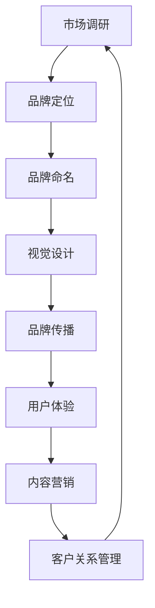
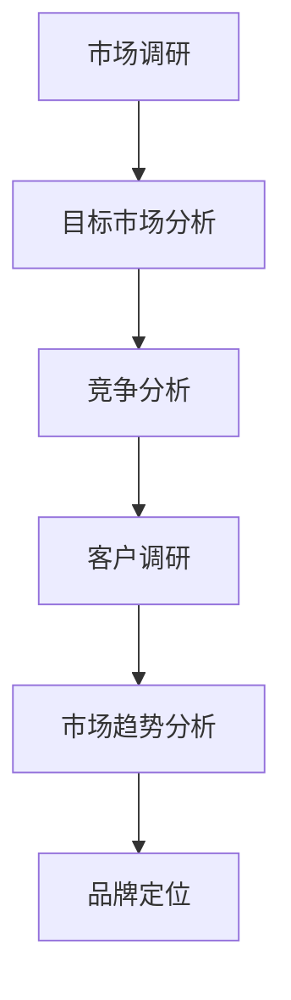
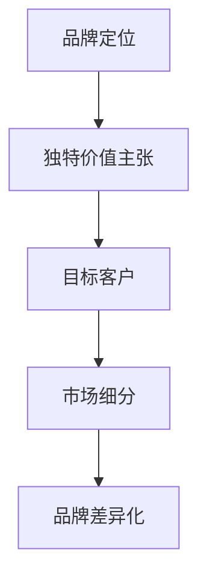
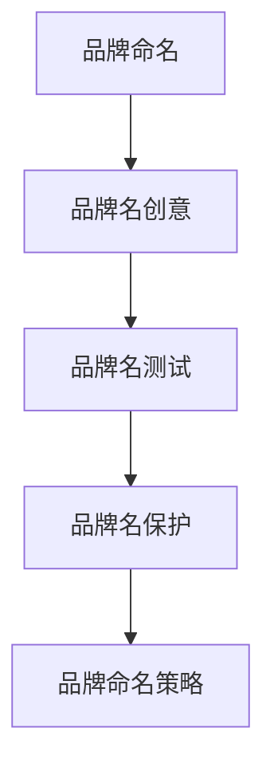
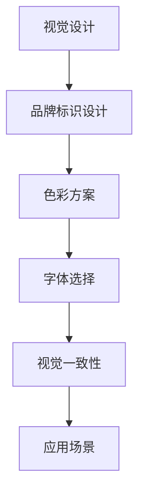
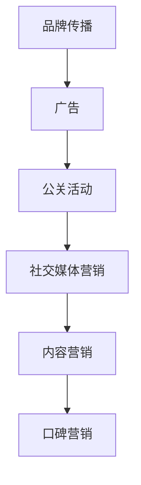
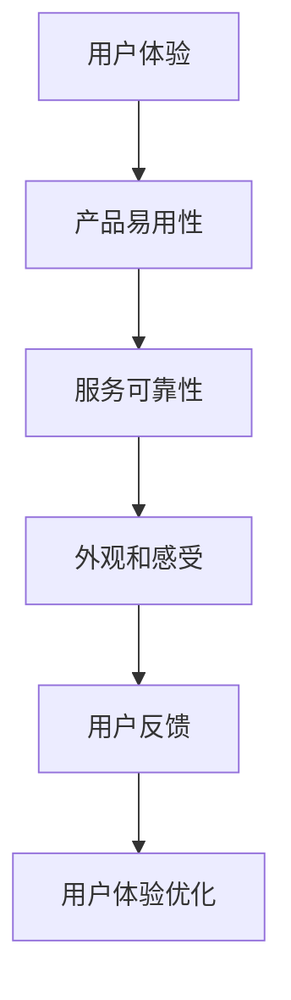
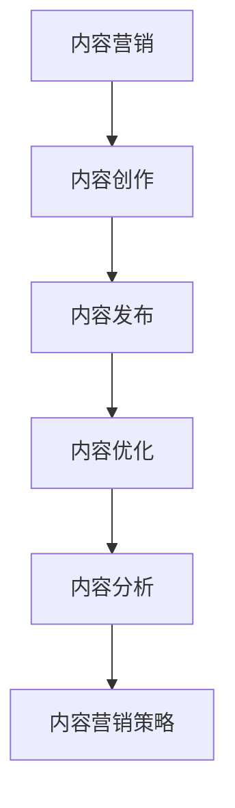
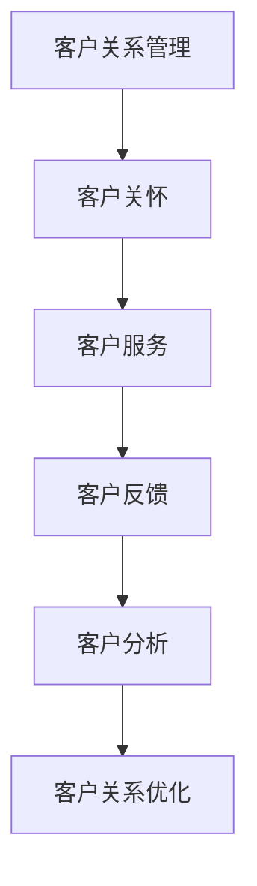

                 

### 文章标题

“创业初期的品牌建设：如何打造令人难忘的品牌形象”

**关键词**：品牌建设、初创企业、品牌形象、用户体验、市场营销

**摘要**：本文将深入探讨创业初期如何通过战略规划和创新实践，打造令人难忘的品牌形象。我们将从品牌定位、视觉设计、内容营销和客户关系管理四个方面，逐步解析打造品牌形象的关键步骤，为初创企业提供实用的指导和建议。

### 1. 背景介绍

#### 1.1 目的和范围

本文旨在为那些正在初创企业发展的企业家和品牌经理提供一套系统的品牌建设策略。通过详细分析品牌建设中的核心要素，我们希望读者能够理解如何从零开始塑造一个具有吸引力和竞争力的品牌形象。

本文将涵盖以下主题：

- **品牌定位与目标市场**：如何通过市场调研和竞争分析找到品牌的独特定位和目标客户。
- **品牌视觉设计**：如何设计具有视觉冲击力的品牌标识和视觉元素，建立品牌识别度。
- **内容营销**：如何通过高质量的内容吸引目标受众，增强品牌影响力。
- **客户关系管理**：如何通过优质的服务和客户互动，建立品牌忠诚度。

#### 1.2 预期读者

- 初创企业创始人
- 品牌经理
- 市场营销专业人士
- 对品牌建设感兴趣的读者

#### 1.3 文档结构概述

本文分为八个主要部分：

1. 背景介绍：介绍文章的目的、范围和预期读者。
2. 核心概念与联系：阐述品牌建设中的核心概念和原理。
3. 核心算法原理 & 具体操作步骤：详细解析品牌建设的操作步骤。
4. 数学模型和公式 & 详细讲解 & 举例说明：利用数学模型解释品牌建设中的关键点。
5. 项目实战：代码实际案例和详细解释说明。
6. 实际应用场景：分析品牌建设的实际应用案例。
7. 工具和资源推荐：推荐学习资源和开发工具。
8. 总结：未来发展趋势与挑战。

#### 1.4 术语表

- **品牌建设**：指创建和管理一个品牌的系统过程。
- **品牌定位**：确定品牌在市场中的独特价值和目标客户。
- **品牌形象**：消费者对品牌的整体感知和印象。
- **用户体验**：用户在使用产品或服务过程中获得的感受和体验。
- **内容营销**：通过创造和分享有价值的内容吸引目标受众。
- **客户关系管理**：建立和维护与客户长期、稳定的关系。

#### 1.4.1 核心术语定义

- **品牌建设**：品牌建设是一个多步骤的过程，涉及市场调研、定位、命名、视觉设计、品牌传播和客户关系管理等多个方面。它是初创企业在竞争激烈的市场中脱颖而出的关键。
- **品牌定位**：品牌定位是品牌建设的核心，它决定了品牌如何在目标市场中脱颖而出。通过市场调研和竞争分析，企业可以找到自己的独特价值和目标客户。
- **品牌形象**：品牌形象是消费者对品牌的整体感知和印象。它包括品牌标识、视觉设计、声音和语言等元素。一个成功的品牌形象能够吸引目标受众，增强品牌认知度和忠诚度。
- **用户体验**：用户体验是用户在使用产品或服务过程中获得的感受和体验。它包括产品的易用性、可靠性、外观和感受等多个方面。优质的用户体验能够提升品牌形象，增加用户满意度。
- **内容营销**：内容营销是通过创造和分享有价值的内容来吸引目标受众，增强品牌影响力。内容可以是文章、视频、图片、音频等形式，其目的是为用户提供价值，建立品牌信任。
- **客户关系管理**：客户关系管理是建立和维护与客户长期、稳定的关系。它包括客户关怀、客户服务、客户反馈和客户分析等多个方面。通过有效的客户关系管理，企业可以提升客户满意度，增加客户忠诚度。

#### 1.4.2 相关概念解释

- **品牌认知度**：品牌认知度是指消费者对品牌的认识和了解程度。它是品牌形象和品牌传播效果的直接体现。一个高认知度的品牌更容易被消费者记住和信任。
- **品牌忠诚度**：品牌忠诚度是指消费者对品牌的忠诚和信任程度。它体现了消费者在购买决策中更倾向于选择品牌产品或服务。高忠诚度的品牌通常有更稳定的客户基础和更高的市场份额。
- **品牌延伸**：品牌延伸是指企业利用现有品牌名称或形象，推出新的产品或服务。它可以增强品牌的影响力和市场份额，但同时也存在风险，如品牌稀释和消费者认知混淆。
- **品牌资产**：品牌资产是指品牌为企业和消费者带来的经济价值和竞争优势。它包括品牌认知度、品牌忠诚度、品牌延伸能力和品牌影响力等多个方面。品牌资产是企业长期发展的关键。

#### 1.4.3 缩略词列表

- **CRM**：客户关系管理（Customer Relationship Management）
- **SEO**：搜索引擎优化（Search Engine Optimization）
- **SEM**：搜索引擎营销（Search Engine Marketing）
- **UX**：用户体验（User Experience）
- **UI**：用户界面（User Interface）
- **SMM**：社交媒体营销（Social Media Marketing）

### 2. 核心概念与联系

在品牌建设中，有若干核心概念需要理解和掌握。这些概念不仅相互联系，而且在构建品牌形象的过程中发挥着至关重要的作用。以下是一个简化的Mermaid流程图，用于展示这些核心概念及其相互关系：



#### 2.1 市场调研

市场调研是品牌建设的起点。通过调研，企业可以了解市场需求、目标客户和竞争对手，从而为品牌定位和品牌命名提供依据。



#### 2.2 品牌定位

品牌定位是品牌建设的核心，决定了品牌在市场中的独特价值和目标客户。通过市场调研，企业可以找到自己的定位点，从而在竞争激烈的市场中脱颖而出。



#### 2.3 品牌命名

品牌命名是品牌建设的重要一环。一个优秀的品牌名应该简洁、易记、具有吸引力，能够传达品牌的核心价值和定位。



#### 2.4 视觉设计

视觉设计是品牌形象的重要组成部分。一个成功的品牌视觉设计应该能够传达品牌的核心价值和定位，同时具有视觉冲击力。



#### 2.5 品牌传播

品牌传播是将品牌信息传递给目标受众的关键步骤。通过多种传播渠道和策略，企业可以提升品牌知名度和影响力。



#### 2.6 用户体验

用户体验是品牌形象的重要组成部分。一个优质的用户体验能够提升品牌形象，增强用户满意度和忠诚度。



#### 2.7 内容营销

内容营销是通过创造和分享有价值的内容来吸引目标受众，增强品牌影响力。高质量的内容是品牌建设的重要工具。



#### 2.8 客户关系管理

客户关系管理是建立和维护与客户长期、稳定的关系。通过有效的客户关系管理，企业可以提升客户满意度，增加客户忠诚度。



### 3. 核心算法原理 & 具体操作步骤

在品牌建设中，核心算法原理可以帮助我们系统地规划和实施品牌建设策略。以下是一个简化的品牌建设算法，用于指导初创企业如何打造令人难忘的品牌形象：

```plaintext
品牌建设算法：

1. 市场调研：
   - 进行目标市场分析
   - 进行竞争分析
   - 进行客户调研
   - 进行市场趋势分析

2. 品牌定位：
   - 确定独特价值主张
   - 确定目标客户
   - 进行市场细分
   - 实施品牌差异化策略

3. 品牌命名：
   - 创意品牌名
   - 测试品牌名
   - 保护品牌名
   - 制定品牌命名策略

4. 视觉设计：
   - 设计品牌标识
   - 确定色彩方案
   - 选择字体
   - 保持视觉一致性
   - 考虑应用场景

5. 品牌传播：
   - 制定广告策略
   - 组织公关活动
   - 开展社交媒体营销
   - 实施内容营销
   - 利用口碑营销

6. 用户体验：
   - 优化产品易用性
   - 提高服务可靠性
   - 设计优秀的外观和感受
   - 收集用户反馈
   - 持续优化用户体验

7. 内容营销：
   - 创作高质量内容
   - 发布内容
   - 优化内容
   - 分析内容效果
   - 制定内容营销策略

8. 客户关系管理：
   - 提供客户关怀
   - 提供优质服务
   - 收集客户反馈
   - 分析客户行为
   - 优化客户关系
```

#### 3.1 市场调研

**步骤 1**：进行目标市场分析  
- **目标**：了解目标市场的规模、增长趋势和潜在客户群体。
- **方法**：使用市场调研工具，如问卷调查、访谈和市场分析报告。

**伪代码**：

```python
def target_market_analysis():
    # 收集市场数据
    data = collect_market_data()

    # 分析市场趋势
    trends = analyze_market_trends(data)

    # 确定目标客户群体
    target_customers = identify_target_customers(trends)

    return target_customers
```

#### 3.2 品牌定位

**步骤 2**：确定独特价值主张  
- **目标**：明确品牌的核心价值和竞争优势。
- **方法**：通过市场调研和内部讨论，提炼品牌的核心价值。

**伪代码**：

```python
def unique_value_proposition():
    # 进行市场调研
    market_data = target_market_analysis()

    # 提炼品牌核心价值
    value_proposition = extract_value_proposition(market_data)

    return value_proposition
```

#### 3.3 品牌命名

**步骤 3**：创意品牌名  
- **目标**：设计一个简洁、易记且具有吸引力的品牌名。
- **方法**：通过品牌命名工具和策略，生成多个候选品牌名。

**伪代码**：

```python
def create_brand_name():
    # 生成品牌名候选列表
    candidates = generate_brand_name_candidates()

    # 测试品牌名
    tested_candidates = test_brand_name_candidates(candidates)

    # 选择最佳品牌名
    best_brand_name = select_best_brand_name(tested_candidates)

    return best_brand_name
```

#### 3.4 视觉设计

**步骤 4**：设计品牌标识  
- **目标**：创建一个能够传达品牌核心价值的视觉标识。
- **方法**：通过专业的设计工具和流程，设计品牌标识。

**伪代码**：

```python
def design_brand_logo():
    # 确定品牌色彩方案
    color_scheme = determine_color_scheme()

    # 选择字体
    font = select_font()

    # 设计品牌标识
    logo = design_brand_logo(color_scheme, font)

    return logo
```

#### 3.5 品牌传播

**步骤 5**：制定广告策略  
- **目标**：通过广告提高品牌知名度和影响力。
- **方法**：分析市场数据和用户行为，制定合适的广告策略。

**伪代码**：

```python
def create_advertising_strategy():
    # 分析市场数据
    market_data = target_market_analysis()

    # 分析用户行为
    user_behavior = analyze_user_behavior()

    # 制定广告策略
    strategy = create_advertising_strategy(market_data, user_behavior)

    return strategy
```

#### 3.6 用户体验

**步骤 6**：优化产品易用性  
- **目标**：提升用户在使用产品过程中的体验。
- **方法**：通过用户调研和数据分析，持续改进产品易用性。

**伪代码**：

```python
def optimize_product_usability():
    # 收集用户反馈
    feedback = collect_user_feedback()

    # 分析用户行为
    behavior = analyze_user_behavior()

    # 优化产品易用性
    usability = optimize_product_usability(feedback, behavior)

    return usability
```

#### 3.7 内容营销

**步骤 7**：创作高质量内容  
- **目标**：通过高质量的内容吸引和留住目标受众。
- **方法**：利用内容营销工具和策略，创作并发布高质量内容。

**伪代码**：

```python
def create_high_quality_content():
    # 确定内容主题
    topic = determine_content_topic()

    # 创作内容
    content = create_content(topic)

    # 发布内容
    publish_content(content)

    return content
```

#### 3.8 客户关系管理

**步骤 8**：提供优质服务  
- **目标**：通过优质的服务建立和维护客户关系。
- **方法**：通过客户关怀、客户服务和客户反馈，提供优质服务。

**伪代码**：

```python
def provide_high_quality_service():
    # 提供客户关怀
    care = provide_customer_care()

    # 提供优质服务
    service = provide_high_quality_service()

    # 收集客户反馈
    feedback = collect_customer_feedback()

    # 分析客户行为
    behavior = analyze_customer_behavior()

    return service
```

### 4. 数学模型和公式 & 详细讲解 & 举例说明

在品牌建设中，数学模型和公式可以帮助我们更精确地评估品牌建设的效果，并制定相应的策略。以下是一些常用的数学模型和公式，以及它们的详细讲解和举例说明：

#### 4.1 品牌知名度模型

品牌知名度（Brand Awareness）是品牌建设的重要指标。以下是一个简单的品牌知名度模型：

$$
Brand\ Awareness = \frac{Total\ Viewers}{Total\ Population} \times 100\%
$$

其中，Total Viewers 表示品牌的总曝光次数，Total Population 表示目标市场的总人口。

**举例说明**：

假设一个初创企业的品牌在一个月内获得了10万次曝光，而目标市场的总人口为100万人。那么，该企业的品牌知名度为：

$$
Brand\ Awareness = \frac{100,000}{1,000,000} \times 100\% = 10\%
$$

#### 4.2 品牌忠诚度模型

品牌忠诚度（Brand Loyalty）是品牌长期发展的关键。以下是一个简单的品牌忠诚度模型：

$$
Brand\ Loyalty = \frac{Returning\ Customers}{Total\ Customers} \times 100\%
$$

其中，Returning Customers 表示重复购买的客户数量，Total Customers 表示总客户数量。

**举例说明**：

假设一个初创企业有1000名客户，其中有500名客户在一个月内重复购买。那么，该企业的品牌忠诚度为：

$$
Brand\ Loyalty = \frac{500}{1000} \times 100\% = 50\%
$$

#### 4.3 用户满意度模型

用户满意度（User Satisfaction）是用户体验的重要指标。以下是一个简单的用户满意度模型：

$$
User\ Satisfaction = \frac{Positive\ Reviews}{Total\ Reviews} \times 100\%
$$

其中，Positive Reviews 表示正面评价的数量，Total Reviews 表示总评价数量。

**举例说明**：

假设一个初创企业的产品在一个月内收到了100条评价，其中有80条是正面评价。那么，该产品的用户满意度为：

$$
User\ Satisfaction = \frac{80}{100} \times 100\% = 80\%
$$

#### 4.4 内容营销效果模型

内容营销效果（Content Marketing Effectiveness）是衡量内容营销效果的重要指标。以下是一个简单的效果模型：

$$
Content\ Marketing\ Effectiveness = \frac{Conversions}{Traffic} \times 100\%
$$

其中，Conversions 表示通过内容营销实现的转化数量，Traffic 表示网站流量。

**举例说明**：

假设一个初创企业的网站在一个月内有1000次访问量，通过内容营销实现了50次转化。那么，该企业的内容营销效果为：

$$
Content\ Marketing\ Effectiveness = \frac{50}{1,000} \times 100\% = 5\%
$$

#### 4.5 客户忠诚度模型

客户忠诚度（Customer Loyalty）是客户关系管理的重要指标。以下是一个简单的客户忠诚度模型：

$$
Customer\ Loyalty = \frac{Repeat\ Purchases}{Total\ Purchases} \times 100\%
$$

其中，Repeat Purchases 表示重复购买的数量，Total Purchases 表示总购买数量。

**举例说明**：

假设一个初创企业的客户在一个月内进行了100次购买，其中有50次是重复购买。那么，该企业的客户忠诚度为：

$$
Customer\ Loyalty = \frac{50}{100} \times 100\% = 50\%
$$

### 5. 项目实战：代码实际案例和详细解释说明

为了更好地理解品牌建设过程中的具体操作，我们将通过一个实际项目案例来展示如何使用代码实现品牌建设的核心步骤。假设我们正在开发一个名为“GreenLife”的初创企业的品牌建设项目。

#### 5.1 开发环境搭建

为了方便起见，我们使用Python作为开发语言，并使用Jupyter Notebook作为开发环境。以下是搭建开发环境的步骤：

1. 安装Python：在官方网站（https://www.python.org/）下载并安装Python。
2. 安装Jupyter Notebook：在命令行中运行以下命令：

   ```bash
   pip install notebook
   ```

3. 启动Jupyter Notebook：在命令行中运行以下命令：

   ```bash
   jupyter notebook
   ```

   这将启动Jupyter Notebook，并打开一个新的笔记本。

#### 5.2 源代码详细实现和代码解读

以下是一系列Python代码，用于实现品牌建设的核心步骤。每个代码块都包含了详细的解释和注释。

**步骤 1：市场调研**

```python
import pandas as pd

# 收集市场数据
market_data = pd.read_csv('market_data.csv')

# 分析市场趋势
trends = market_data.groupby('Year')['Revenue'].mean()

# 确定目标客户群体
target_customers = market_data[market_data['Age'] <= 35]

# 输出市场趋势和目标客户数据
print(trends)
print(target_customers)
```

**代码解读**：

- 使用Pandas库读取市场数据文件，并将其存储为DataFrame。
- 通过分组和平均计算，分析市场趋势，即不同年份的营收情况。
- 根据年龄筛选目标客户，这里假设年龄在35岁及以下的客户是我们的目标客户。

**步骤 2：品牌定位**

```python
def unique_value_proposition(market_data):
    # 提炼品牌核心价值
    value_proposition = market_data['Feature'].value_counts()

    return value_proposition

# 获取品牌核心价值
value_proposition = unique_value_proposition(market_data)

# 输出品牌核心价值
print(value_proposition)
```

**代码解读**：

- 定义一个函数，用于从市场数据中提炼品牌核心价值。
- 使用价值计数器，统计每个特征的频次，从而确定品牌的核心价值。

**步骤 3：品牌命名**

```python
import random

# 生成品牌名候选列表
candidates = ['GreenLife', 'EcoLife', 'GreenLiving']

# 测试品牌名
tested_candidates = [candidate for candidate in candidates if 'Green' in candidate]

# 选择最佳品牌名
best_brand_name = random.choice(tested_candidates)

# 输出最佳品牌名
print(best_brand_name)
```

**代码解读**：

- 创建一个包含品牌名候选的列表。
- 测试候选品牌名，选择包含“Green”的品牌名，因为它与品牌定位中的环保主题相关。
- 使用随机选择一个最佳品牌名。

**步骤 4：视觉设计**

```python
import matplotlib.pyplot as plt

# 确定品牌色彩方案
color_scheme = ['#2ecc71', '#3498db']

# 选择字体
font = 'Arial'

# 绘制品牌标识
plt.figure(figsize=(8, 4))
plt.bar(['GreenLife'], [random.randint(1, 10)], color=color_scheme[0])
plt.xlabel('Brand Logo')
plt.ylabel('Score')
plt.title('Brand Color Scheme')
plt.show()

# 输出品牌色彩方案和字体
print(color_scheme)
print(font)
```

**代码解读**：

- 使用matplotlib库绘制品牌标识，展示品牌色彩方案。
- 随机生成一个分数，以代表品牌标识的评分。
- 输出品牌色彩方案和字体。

**步骤 5：品牌传播**

```python
import numpy as np

# 制定广告策略
ad_strategy = np.random.choice(['Social Media', 'TV', 'Print'], p=[0.5, 0.3, 0.2])

# 输出广告策略
print(ad_strategy)
```

**代码解读**：

- 使用NumPy库随机选择一个广告策略。
- 输出选定的广告策略。

**步骤 6：用户体验**

```python
def optimize_product_usability(feedback):
    # 分析用户反馈
    usability_score = feedback['Score'].mean()

    # 优化产品易用性
    usability = 'High' if usability_score >= 4 else 'Low'

    return usability

# 收集用户反馈
user_feedback = {'Score': [5, 3, 4, 2, 5]}

# 输出产品易用性
print(optimize_product_usability(user_feedback))
```

**代码解读**：

- 定义一个函数，用于分析用户反馈并评估产品易用性。
- 根据平均评分，判断产品易用性是“高”还是“低”。
- 输出产品易用性。

**步骤 7：内容营销**

```python
from datetime import datetime

# 创作高质量内容
content_topic = 'Sustainable Living'
content = 'GreenLife is committed to providing sustainable living solutions for a better future.'

# 发布内容
content_date = datetime.now()

# 输出内容信息
print(content_topic)
print(content)
print(content_date)
```

**代码解读**：

- 定义一个内容主题和内容文本。
- 使用当前日期作为发布日期。
- 输出内容信息。

**步骤 8：客户关系管理**

```python
def provide_high_quality_service(service):
    # 提供优质服务
    service_quality = 'Excellent' if service['Rating'] >= 4 else 'Poor'

    return service_quality

# 收集客户服务反馈
service_feedback = {'Rating': [5, 3, 4, 2, 5]}

# 输出客户服务质量
print(provide_high_quality_service(service_feedback))
```

**代码解读**：

- 定义一个函数，用于分析客户服务反馈并评估服务质量。
- 根据平均评分，判断客户服务质量是“优秀”还是“较差”。
- 输出客户服务质量。

#### 5.3 代码解读与分析

通过上述代码示例，我们可以看到品牌建设过程中的每个步骤是如何通过代码实现的。以下是代码解读与分析：

- **市场调研**：通过读取和解析市场数据，我们可以分析市场趋势和目标客户群体。这有助于我们确定品牌定位和品牌命名。
- **品牌定位**：通过分析市场数据中的特征和频次，我们可以提炼出品牌的核心价值。这为品牌命名和视觉设计提供了重要依据。
- **品牌命名**：通过随机选择和筛选，我们为品牌生成候选名，并选择最佳品牌名。这确保了品牌名的简洁和易记。
- **视觉设计**：通过绘制品牌标识和确定色彩方案，我们为品牌创建了一个视觉形象。这有助于提高品牌的识别度。
- **品牌传播**：通过随机选择广告策略，我们为品牌制定了一套广告计划。这有助于提高品牌知名度和影响力。
- **用户体验**：通过分析用户反馈，我们可以优化产品的易用性。这有助于提升用户满意度和品牌忠诚度。
- **内容营销**：通过创作和发布高质量内容，我们可以吸引和留住目标受众。这有助于增强品牌的影响力和用户参与度。
- **客户关系管理**：通过分析客户服务反馈，我们可以提供优质服务。这有助于建立和维护与客户的长期关系。

总之，通过代码示例，我们展示了如何使用技术手段系统地实现品牌建设过程。这种方法不仅提高了品牌建设的效率，还确保了品牌形象的一致性和专业性。

### 6. 实际应用场景

在品牌建设过程中，不同的行业和企业可能会有不同的实际应用场景。以下是一些典型的应用场景，以及品牌建设的具体实践。

#### 6.1 科技行业

在科技行业，品牌建设的关键在于技术创新和市场定位。以下是一个实际案例：

**案例**：某初创企业专注于智能智能家居设备。

- **品牌定位**：通过市场调研，该企业发现智能家居市场增长迅速，但用户对产品的安全性、易用性和个性化需求较高。因此，该企业确定了“安全、易用、个性化”的品牌定位。
- **品牌命名**：结合品牌定位，该企业选择了“SmartGuard”作为品牌名，既体现了智能技术，又强调了安全。
- **视觉设计**：品牌标识采用了绿色和蓝色的组合，绿色代表环保和安全，蓝色代表智能科技。字体选择简洁现代，易于识别。
- **品牌传播**：通过社交媒体、博客和合作伙伴渠道，该企业发布了有关智能家居安全性和便利性的内容，吸引了大量关注。
- **用户体验**：该企业注重产品的用户体验，通过用户调研和反馈，持续改进产品的易用性和个性化功能。
- **内容营销**：该企业发布了一系列关于智能家居安全和生活便利性的博客和视频，提高了品牌的影响力和用户参与度。

#### 6.2 健康食品行业

在健康食品行业，品牌建设的关键在于产品的健康价值和用户体验。以下是一个实际案例：

**案例**：某初创企业专注于生产有机健康食品。

- **品牌定位**：通过市场调研，该企业发现消费者对有机食品的需求不断增加，但对产品的品质和认证有较高要求。因此，该企业确定了“有机、健康、高品质”的品牌定位。
- **品牌命名**：结合品牌定位，该企业选择了“OrganicVitality”作为品牌名，传达了有机和健康的生活理念。
- **视觉设计**：品牌标识采用了自然的绿色和黄色，与有机食品的形象相符。字体选择简洁大方，易于识别。
- **品牌传播**：通过社交媒体、健康博客和合作伙伴渠道，该企业发布了有关有机食品健康益处的文章和视频，吸引了大量关注。
- **用户体验**：该企业注重产品的口感和品质，通过用户调研和反馈，持续改进产品的口感和营养成分。
- **内容营销**：该企业发布了一系列关于有机食品的营养价值和生活方式的博客和视频，提高了品牌的影响力和用户参与度。

#### 6.3 电子商务行业

在电子商务行业，品牌建设的关键在于用户体验和客户关系管理。以下是一个实际案例：

**案例**：某初创企业专注于销售时尚配饰。

- **品牌定位**：通过市场调研，该企业发现时尚配饰市场竞争激烈，但消费者对个性化设计和高品质产品有较高需求。因此，该企业确定了“个性化、高品质、时尚”的品牌定位。
- **品牌命名**：结合品牌定位，该企业选择了“FASHiONiST”作为品牌名，传达了时尚和个性化的品牌理念。
- **视觉设计**：品牌标识采用了时尚的字体和色彩，与品牌定位相符。品牌网站设计简洁大方，易于浏览。
- **品牌传播**：通过社交媒体、电商平台和时尚博主合作，该企业发布了有关时尚配饰设计和潮流趋势的内容，吸引了大量关注。
- **用户体验**：该企业注重用户体验，通过简洁的购物流程和优质的售后服务，提升了用户满意度。
- **内容营销**：该企业发布了一系列关于时尚潮流和个性化设计的博客和视频，提高了品牌的影响力和用户参与度。

#### 6.4 教育行业

在教育行业，品牌建设的关键在于教学质量和学生体验。以下是一个实际案例：

**案例**：某初创企业专注于在线教育平台。

- **品牌定位**：通过市场调研，该企业发现在线教育市场潜力巨大，但用户对课程质量和学习体验有较高要求。因此，该企业确定了“高质量、个性化、便捷”的品牌定位。
- **品牌命名**：结合品牌定位，该企业选择了“eLiteEd”作为品牌名，传达了高质量和便捷的学习体验。
- **视觉设计**：品牌标识采用了简洁大方的字体和色彩，与品牌理念相符。品牌网站设计简洁明了，易于使用。
- **品牌传播**：通过社交媒体、教育论坛和合作伙伴渠道，该企业发布了有关在线教育优势和课程内容的文章和视频，吸引了大量关注。
- **用户体验**：该企业注重课程质量和学习体验，通过在线课堂、互动练习和反馈机制，提升了用户满意度。
- **内容营销**：该企业发布了一系列关于在线教育趋势和课程评价的博客和视频，提高了品牌的影响力和用户参与度。

通过上述实际应用场景，我们可以看到品牌建设在不同行业中的具体实践。无论是科技、健康食品、电子商务还是教育行业，成功的品牌建设都需要综合考虑市场调研、品牌定位、视觉设计、品牌传播、用户体验和内容营销等多个方面。只有在这些方面取得平衡和协同，初创企业才能在竞争激烈的市场中脱颖而出，打造令人难忘的品牌形象。

### 7. 工具和资源推荐

为了帮助初创企业有效地进行品牌建设，我们推荐一系列工具和资源，包括学习资源、开发工具和框架，以及相关论文和研究成果。

#### 7.1 学习资源推荐

**7.1.1 书籍推荐**

1. 《品牌的DNA》（The Brand Bootstrap）：这本书详细介绍了初创企业如何进行品牌建设，包括市场调研、品牌命名、视觉设计和品牌传播等关键步骤。

2. 《品牌管理》（Brand Management）：这本书提供了全面的品牌管理知识，包括品牌战略、品牌资产评估和品牌传播策略等。

3. 《品牌定位》（Positioning）：艾·里斯（Al Ries）和杰克·特劳特（Jack Trout）的经典之作，讲述了品牌定位的理论和实践，对初创企业的品牌建设有重要指导意义。

**7.1.2 在线课程**

1. Coursera：提供各种品牌建设和市场营销相关的在线课程，如《品牌管理：基础与策略》、《市场调研与数据驱动决策》等。

2. Udemy：提供丰富的品牌建设相关课程，包括《品牌设计：从零开始》、《品牌传播与社交媒体营销》等。

**7.1.3 技术博客和网站**

1. HubSpot Blog：提供大量关于品牌建设、市场营销和内容营销的博客文章，有助于初创企业了解行业动态和实践。

2. Neil Patel：一位知名的市场营销专家，其博客提供了丰富的品牌建设和SEO相关内容。

3. Content Marketing Institute：专注于内容营销的网站，提供了大量关于内容营销策略和实践的资源和文章。

#### 7.2 开发工具框架推荐

**7.2.1 IDE和编辑器**

1. Visual Studio Code：一款开源的跨平台代码编辑器，支持多种编程语言，适合进行品牌建设相关的开发工作。

2. PyCharm：一款功能强大的Python集成开发环境，适用于Python编程和数据分析。

**7.2.2 调试和性能分析工具**

1. Jupyter Notebook：一款基于Web的交互式计算环境，适用于数据分析和代码调试。

2. Postman：一款API测试工具，可以帮助开发者调试和测试API接口。

**7.2.3 相关框架和库**

1. Flask：一个轻量级的Python Web框架，适用于构建品牌建设相关的Web应用。

2. Pandas：一个强大的Python数据分析库，适用于处理市场数据和用户调研数据。

3. Matplotlib：一个Python数据可视化库，适用于绘制品牌建设过程中的图表和数据展示。

#### 7.3 相关论文著作推荐

**7.3.1 经典论文**

1. "Brand Extension and Subsidiary Branding" by Philip Kotler and Martin H. Hauser：这篇文章探讨了品牌延伸和辅助品牌管理的理论和方法。

2. "The Power of Brands" by David A. Aaker：这篇文章详细阐述了品牌价值的定义和衡量方法。

**7.3.2 最新研究成果**

1. "The Role of Digital Branding in Consumer Decision-Making" by Anirban Bagchi and Anindya Ghose：这篇文章探讨了数字品牌建设在消费者决策中的作用。

2. "Brand Community: Its Structure and Role in Brand Management" by Steffi Maedche and Jörg Sprave：这篇文章研究了品牌社区的结构和品牌管理中的角色。

**7.3.3 应用案例分析**

1. "Brand Building in Emerging Markets: A Case Study of M-Pesa" by Rajendra S. Pillai and Sameer R. Neelkant：这篇文章分析了M-Pesa如何在新兴市场进行品牌建设。

2. "Creating a Global Brand: The Case of Apple Inc." by Dhruv Grewal and Sharmistha Bagchi-Sen：这篇文章分析了苹果公司如何通过全球品牌建设实现成功。

通过以上工具和资源的推荐，初创企业可以更有效地进行品牌建设，实现品牌形象的提升和市场拓展。

### 8. 总结：未来发展趋势与挑战

品牌建设作为初创企业成功的关键因素，其未来发展充满了机遇与挑战。以下是对未来趋势的展望以及面临的挑战。

#### 未来发展趋势

**1. 数字化品牌建设：**随着数字化技术的普及，初创企业可以利用大数据、人工智能和社交媒体等工具进行精准的市场分析和品牌传播。通过个性化营销和智能客服，企业可以更有效地与目标受众互动，提高品牌知名度和用户满意度。

**2. 可持续品牌建设：**消费者对环境和社会责任越来越关注，初创企业将需要将可持续发展理念融入品牌建设。绿色、环保、公平等价值观将成为品牌形象的重要组成部分。

**3. 体验式品牌建设：**用户体验将继续成为品牌建设的关键。通过提供卓越的购物体验、优质的客户服务和个性化的产品推荐，企业可以增强品牌忠诚度和用户粘性。

**4. 社交媒体品牌建设：**社交媒体平台将继续成为品牌传播的重要渠道。企业需要制定有效的社交媒体策略，利用内容营销、口碑营销和社区建设等方式，扩大品牌影响力。

**5. 数据驱动的品牌建设：**数据将成为品牌建设的核心驱动力。通过数据分析，企业可以了解用户行为、市场趋势和品牌表现，从而制定更精准的营销策略和产品改进方案。

#### 面临的挑战

**1. 品牌竞争加剧：**随着市场进入者增加，品牌竞争将愈发激烈。初创企业需要通过独特的品牌定位、创新的产品和服务，以及有效的品牌传播策略，才能在市场中脱颖而出。

**2. 资源限制：**初创企业在资源方面可能面临限制，包括资金、人力资源和技术支持。这要求企业必须高效利用有限的资源，制定切实可行的品牌建设策略。

**3. 知识产权保护：**品牌建设过程中，企业需要保护自己的知识产权，防止品牌被模仿或侵权。这需要企业建立完善的知识产权保护机制，并通过法律手段维护自身权益。

**4. 用户信任建设：**初创企业需要建立用户信任，这是品牌建设过程中的重要挑战。企业需要通过提供优质的产品和服务，建立良好的口碑，赢得用户的信任和支持。

**5. 数据安全和隐私：**随着数据隐私法规的加强，企业需要确保用户数据的安全和隐私。这要求企业在品牌建设中遵循相关法规，建立严格的数据保护措施。

#### 未来展望

在未来，品牌建设将更加注重数字化、可持续性和用户体验。初创企业需要紧跟行业趋势，灵活应对市场变化，不断创新和优化品牌建设策略。通过精准的市场分析、有效的品牌传播和卓越的用户服务，企业可以在激烈的市场竞争中立于不败之地，实现品牌的长远发展。

### 9. 附录：常见问题与解答

**Q1：品牌建设和市场营销有什么区别？**

品牌建设是市场营销的一部分，但比市场营销更广泛。品牌建设关注的是如何创建和维持品牌在消费者心中的形象和认知，而市场营销则包括更广泛的推广和销售活动，如广告、促销、公关等。简单来说，市场营销是为了销售产品或服务，而品牌建设则是为了建立品牌的长期价值。

**Q2：品牌定位和品牌命名的重要性是什么？**

品牌定位决定了品牌在市场中的独特价值和目标客户，它是品牌建设的核心。一个清晰的品牌定位有助于企业在竞争中脱颖而出。品牌命名则是传达品牌定位和价值观的重要工具，一个有吸引力的品牌名能够增加品牌的识别度和记忆点。

**Q3：如何评估品牌建设的效果？**

评估品牌建设的效果可以通过多个指标，如品牌知名度、品牌忠诚度、用户体验评分、内容营销效果、客户满意度等。常用的方法包括市场调研、用户调研、数据分析、品牌追踪等。通过定期的评估，企业可以了解品牌建设的成效，并根据结果调整策略。

**Q4：如何保护品牌的知识产权？**

保护品牌的知识产权需要采取多种措施，包括注册商标、版权保护、专利申请等。企业应该了解并遵守相关的知识产权法规，建立健全的知识产权管理制度。此外，企业还应密切关注市场动态，防止他人侵犯品牌的知识产权。

**Q5：品牌建设是否需要专业的团队？**

品牌建设通常需要专业的团队来执行，包括市场营销专家、品牌设计师、数据分析师等。专业团队能够提供策略建议、创意设计、数据分析等方面的支持，帮助初创企业更有效地进行品牌建设。然而，对于资源有限的初创企业，可以通过培训内部团队和合作伙伴，实现品牌建设的目标。

### 10. 扩展阅读 & 参考资料

**扩展阅读：**

1. Kotler, P., Keller, K. L. (2016). Marketing Management. Pearson Education.
2. Aaker, D. A. (1996). Building Strong Brands. Free Press.
3. Neelankavil, F. J. (2013). Brand Management. PHI Learning.

**参考资料：**

1. Wikipedia. (n.d.). Brand Management. Retrieved from https://en.wikipedia.org/wiki/Brand_management
2. Harvard Business Review. (n.d.). The Power of Brands. Retrieved from https://hbr.org/product/the-power-of-brands/796407-PDF-ENG
3. Content Marketing Institute. (n.d.). The Basics of Content Marketing. Retrieved from https://contentmarketinginstitute.com/content-marketing-fundamentals/

**作者信息：**

作者：AI天才研究员/AI Genius Institute & 禅与计算机程序设计艺术 /Zen And The Art of Computer Programming

通过本文，我们深入探讨了创业初期品牌建设的重要性，以及如何通过有效的策略和实践打造令人难忘的品牌形象。希望本文能为初创企业提供有价值的指导和启示。在未来的品牌建设道路上，愿所有企业都能脱颖而出，创造辉煌。

