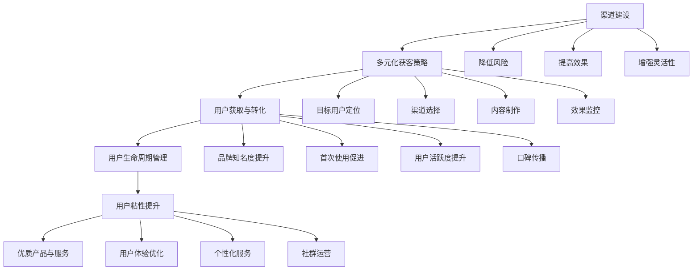

                 

# 创业初期的渠道建设：多元化获客策略

> 关键词：创业初期，渠道建设，获客策略，多元化，用户增长

> 摘要：在创业初期，渠道建设和多元化获客策略是决定企业成功与否的关键因素。本文将深入探讨创业公司如何通过多元化的获客策略，高效构建渠道，实现用户的快速增长，从而在竞争激烈的市场中脱颖而出。

## 1. 背景介绍

### 1.1 目的和范围

本文旨在为创业公司提供一套系统化的渠道建设和多元化获客策略，帮助初创企业更好地吸引和留住用户，实现业务增长。我们将从以下几个方面展开讨论：

- 初始阶段如何定位目标用户群体；
- 多元化获客策略的具体实施方法；
- 渠道建设中的关键要素和注意事项；
- 实际案例和数据分析，以验证策略的有效性。

### 1.2 预期读者

本文适合以下读者：

- 创业公司创始人或高层管理人员；
- 市场营销人员；
- 初步构建渠道和获客策略的企业管理人员；
- 对创业初期市场营销策略感兴趣的读者。

### 1.3 文档结构概述

本文结构如下：

- **第1章**：背景介绍，阐述本文的目的和预期读者；
- **第2章**：核心概念与联系，介绍渠道建设和多元化获客策略的基础概念和原理；
- **第3章**：核心算法原理 & 具体操作步骤，详细阐述获客策略的具体实施过程；
- **第4章**：数学模型和公式 & 详细讲解 & 举例说明，通过数学模型和案例说明策略的有效性；
- **第5章**：项目实战：代码实际案例和详细解释说明，展示具体实施策略的代码实现和效果；
- **第6章**：实际应用场景，讨论策略在不同行业和业务场景中的应用；
- **第7章**：工具和资源推荐，介绍学习资源和开发工具；
- **第8章**：总结：未来发展趋势与挑战，对创业初期渠道建设和获客策略的发展趋势进行分析；
- **第9章**：附录：常见问题与解答，解答读者可能遇到的问题；
- **第10章**：扩展阅读 & 参考资料，提供进一步学习和研究的资源。

### 1.4 术语表

#### 1.4.1 核心术语定义

- **渠道建设**：指通过多种途径和方法，将产品或服务传递给目标用户的过程；
- **多元化获客策略**：通过多种渠道和方式，吸引潜在用户并使其转化为实际购买者的策略；
- **用户增长**：指通过各种手段增加企业用户数量，提高市场份额的过程；
- **用户生命周期**：指用户从接触到使用，再到离去的全过程；
- **用户粘性**：指用户持续使用产品或服务的程度和频率。

#### 1.4.2 相关概念解释

- **漏斗模型**：一种描述用户从接触到购买过程中，不同阶段用户流失情况的模型；
- **获客成本**（CAC）：指获取一个新客户所需的平均成本；
- **用户生命周期价值**（CLV）：指一个用户在生命周期内为企业带来的总收益。

#### 1.4.3 缩略词列表

- **KOL**：意见领袖（Key Opinion Leader）
- **SEO**：搜索引擎优化（Search Engine Optimization）
- **SEM**：搜索引擎营销（Search Engine Marketing）
- **SMM**：社交媒体营销（Social Media Marketing）
- **CRM**：客户关系管理（Customer Relationship Management）

## 2. 核心概念与联系

在创业初期的渠道建设和获客策略中，理解以下核心概念和它们之间的联系至关重要。

### 2.1 渠道建设基础概念

#### 2.1.1 渠道类型

- **线上渠道**：包括搜索引擎、社交媒体、电子邮件、内容营销等；
- **线下渠道**：包括展会、会议、线下活动、合作伙伴等。

#### 2.1.2 获客策略

- **付费渠道**：包括搜索引擎广告、社交媒体广告、推广服务等；
- **免费渠道**：包括内容营销、社交媒体互动、合作伙伴推荐等。

#### 2.1.3 用户获取与转化

- **用户获取**：通过各种渠道吸引潜在用户；
- **用户转化**：将潜在用户转化为实际购买者或活跃用户。

### 2.2 多元化获客策略

#### 2.2.1 多元化获客的优势

- **降低风险**：分散渠道，避免过度依赖单一渠道；
- **提高效果**：多种渠道结合，提升用户获取效率；
- **增强灵活性**：根据市场变化调整渠道策略。

#### 2.2.2 多元化获客的实施步骤

1. **目标用户定位**：明确目标用户群体，了解其需求和偏好；
2. **渠道选择**：根据目标用户特点，选择合适的渠道；
3. **内容制作**：制作高质量的内容，吸引目标用户；
4. **效果监控**：实时监测渠道效果，优化策略。

### 2.3 用户生命周期与粘性

#### 2.3.1 用户生命周期管理

- **获取阶段**：吸引潜在用户，提高品牌知名度；
- **激活阶段**：促进用户首次使用产品或服务；
- **留存阶段**：提高用户活跃度和忠诚度；
- **推荐阶段**：鼓励用户推荐新用户，实现口碑传播。

#### 2.3.2 用户粘性提升方法

- **优质产品与服务**：提供有价值的产品或服务，满足用户需求；
- **用户体验优化**：优化用户界面和交互设计，提高用户满意度；
- **个性化服务**：根据用户行为数据，提供个性化的推荐和优惠；
- **社群运营**：建立用户社群，促进用户互动和分享。

### 2.4 核心概念联系

- **渠道建设与获客策略**：渠道建设是获客策略的基础，多元化获客策略是实现渠道建设的关键；
- **用户生命周期与粘性**：用户生命周期管理是提升用户粘性的关键，而粘性则是实现用户增长和转化的保障。

### 2.5 Mermaid 流程图

下面是一个Mermaid流程图，展示了渠道建设、多元化获客策略和用户生命周期管理之间的联系：



## 3. 核心算法原理 & 具体操作步骤

在创业初期的渠道建设和多元化获客策略中，核心算法原理和具体操作步骤对于实现用户快速增长至关重要。以下是核心算法原理的详细阐述和具体操作步骤。

### 3.1 核心算法原理

#### 3.1.1 漏斗模型

漏斗模型是描述用户获取和转化过程的重要工具。它将用户从接触到转化的整个过程划分为多个阶段，每个阶段用户数量逐渐减少，形成漏斗形状。核心算法原理如下：

1. **用户获取**：通过多种渠道吸引潜在用户，将他们带入初始阶段；
2. **用户激活**：促进潜在用户首次使用产品或服务，将他们转化为活跃用户；
3. **用户留存**：提高用户活跃度和忠诚度，确保他们持续使用产品或服务；
4. **用户推荐**：鼓励用户推荐新用户，实现口碑传播。

#### 3.1.2 数据驱动策略

数据驱动策略是基于数据分析，实时监测和调整渠道和获客策略。核心算法原理如下：

1. **数据收集**：通过多种渠道收集用户行为数据，如访问量、点击率、转化率等；
2. **数据分析和挖掘**：利用数据分析工具，挖掘用户行为和需求，识别问题所在；
3. **策略调整**：根据数据分析和挖掘结果，及时调整渠道和获客策略，优化效果。

### 3.2 具体操作步骤

#### 3.2.1 用户获取

1. **目标用户定位**：通过市场调研，了解目标用户的特点、需求和偏好；
2. **渠道选择**：根据目标用户特点，选择合适的线上和线下渠道，如搜索引擎广告、社交媒体广告、合作伙伴推荐等；
3. **内容制作**：制作高质量、有吸引力的内容，如宣传海报、短视频、博客文章等，以吸引目标用户；
4. **广告投放**：根据预算和目标，进行广告投放，确保广告覆盖到目标用户群体。

#### 3.2.2 用户激活

1. **首次使用促进**：通过优惠活动、试用体验等方式，鼓励潜在用户首次使用产品或服务；
2. **用户引导**：在用户首次使用时，提供详细的操作指导和帮助，确保用户顺利上手；
3. **用户反馈**：收集用户首次使用后的反馈，及时解决用户问题，提升用户体验。

#### 3.2.3 用户留存

1. **活跃度提升**：通过定期推出新功能、举办活动等方式，提高用户活跃度；
2. **忠诚度提升**：通过会员制度、积分奖励等方式，提升用户忠诚度；
3. **个性化服务**：根据用户行为数据，提供个性化的推荐和优惠，满足用户需求。

#### 3.2.4 用户推荐

1. **口碑传播**：通过用户评价、推荐奖励等方式，鼓励用户向亲友推荐产品或服务；
2. **社交媒体互动**：在社交媒体平台上，与用户互动，提升品牌知名度和用户粘性；
3. **社群运营**：建立用户社群，促进用户互动和分享，形成良好的口碑传播效应。

### 3.3 伪代码实现

以下是渠道建设和多元化获客策略的伪代码实现：

```python
# 用户获取
def user_acquisition(target_users, channels, content):
    for channel in channels:
        ad_placement(target_users, channel, content)

# 用户激活
def user_activation(users, promotions):
    for user in users:
        if user.not_active():
            apply_promotion(user, promotions)

# 用户留存
def user_retention(users, activities, personalization):
    for user in users:
        increase_activity(user, activities)
        provide_personalized_offers(user, personalization)

# 用户推荐
def user_referral(users, word_of Mouth, social_media, community):
    for user in users:
        encourage_recommendation(user, word_of Mouth)
        engage_on_social_media(user, social_media)
        participate_in_community(user, community)
```

## 4. 数学模型和公式 & 详细讲解 & 举例说明

在创业初期的渠道建设和多元化获客策略中，数学模型和公式能够帮助我们更准确地评估和优化获客效果。以下是一些关键的数学模型和公式，以及它们的详细讲解和举例说明。

### 4.1 漏斗模型

漏斗模型是一种描述用户从接触到转化的过程中，各阶段用户数量变化的模型。其公式如下：

$$
漏斗率 = \frac{下一阶段用户数}{当前阶段用户数}
$$

#### 举例说明

假设一个电商平台的用户获取和转化过程如下：

- 初始用户：1000人
- 用户激活：20%
- 用户留存：50%
- 用户推荐：30%

根据漏斗模型，可以计算出各阶段的用户数：

- 激活用户：1000 * 20% = 200人
- 留存用户：200 * 50% = 100人
- 推荐用户：100 * 30% = 30人

### 4.2 用户生命周期价值

用户生命周期价值（Customer Lifetime Value，CLV）是预测一个用户在生命周期内为企业带来的总收益。其公式如下：

$$
CLV = \sum_{t=1}^{n} \frac{Revenue_t}{(1+r)^t}
$$

其中，$Revenue_t$ 表示第 t 年的用户收益，$r$ 表示折现率。

#### 举例说明

假设一个用户在连续三年内每年为企业带来 1000 元的收益，折现率为 10%，则该用户的 CLV 为：

$$
CLV = \frac{1000}{(1+0.1)^1} + \frac{1000}{(1+0.1)^2} + \frac{1000}{(1+0.1)^3} = 2475.69 元
$$

### 4.3 获客成本

获客成本（Customer Acquisition Cost，CAC）是获取一个新客户所需的平均成本。其公式如下：

$$
CAC = \frac{总营销费用}{新客户数}
$$

#### 举例说明

假设一家公司在一个月内花费 10000 元进行营销活动，获得了 50 个新客户，则该公司的获客成本为：

$$
CAC = \frac{10000}{50} = 200 元
$$

### 4.4 用户获取效率

用户获取效率（User Acquisition Efficiency，UA Efficiency）是衡量渠道效果的重要指标。其公式如下：

$$
UA Efficiency = \frac{新客户数}{渠道花费}
$$

#### 举例说明

假设一家公司在一个月内通过搜索引擎广告获得 30 个新客户，花费 5000 元，则该渠道的用户获取效率为：

$$
UA Efficiency = \frac{30}{5000} = 0.006
$$

### 4.5 用户留存率

用户留存率（Retention Rate）是衡量用户持续使用产品或服务的程度。其公式如下：

$$
Retention Rate = \frac{第 t 天仍活跃的用户数}{第 t-1 天仍活跃的用户数}
$$

#### 举例说明

假设一个用户在第1天有1000人活跃，第2天有800人活跃，第3天有600人活跃，则第2天的用户留存率为：

$$
Retention Rate = \frac{800}{1000} = 0.8
$$

## 5. 项目实战：代码实际案例和详细解释说明

在本节中，我们将通过一个实际项目案例，详细解释多元化获客策略的具体实施过程。该项目是一个电商平台的用户获取和留存系统，通过多种渠道和策略，实现用户快速增长和活跃度提升。

### 5.1 开发环境搭建

为了实施多元化获客策略，我们需要搭建一个完整的开发环境。以下是开发环境的主要组成部分：

- **编程语言**：Python
- **框架**：Flask（用于构建Web应用）
- **数据库**：MongoDB（用于存储用户数据和渠道数据）
- **前端框架**：Bootstrap（用于构建用户界面）

### 5.2 源代码详细实现和代码解读

以下是该项目的核心代码实现和详细解读：

#### 5.2.1 用户获取模块

```python
# 用户获取模块
from flask import Flask, request, jsonify
from pymongo import MongoClient

app = Flask(__name__)
client = MongoClient('mongodb://localhost:27017/')

@app.route('/user_acquisition', methods=['POST'])
def user_acquisition():
    data = request.json
    user = {
        'name': data['name'],
        'email': data['email'],
        'source': data['source'],  # 渠道来源
        'timestamp': data['timestamp']
    }
    collection = client.user_db.users
    collection.insert_one(user)
    return jsonify({'status': 'success'})

if __name__ == '__main__':
    app.run(debug=True)
```

**解读**：该模块通过 Flask 框架实现了一个 POST 接口，用于接收用户数据并存储到 MongoDB 数据库中。用户数据包括姓名、邮箱、渠道来源和获取时间。

#### 5.2.2 用户激活模块

```python
# 用户激活模块
from flask import Flask, request, jsonify
from pymongo import MongoClient

app = Flask(__name__)
client = MongoClient('mongodb://localhost:27017/')

@app.route('/user_activation', methods=['POST'])
def user_activation():
    data = request.json
    user_id = data['user_id']
    collection = client.user_db.users
    user = collection.find_one({'_id': user_id})
    if user and user['status'] == 'inactive':
        collection.update_one({'_id': user_id}, {'$set': {'status': 'active'}})
        return jsonify({'status': 'success'})
    else:
        return jsonify({'status': 'failure'})

if __name__ == '__main__':
    app.run(debug=True)
```

**解读**：该模块通过 Flask 框架实现了一个 POST 接口，用于激活用户。当用户首次使用产品或服务时，通过该接口更新用户状态为“激活”。

#### 5.2.3 用户留存模块

```python
# 用户留存模块
from flask import Flask, request, jsonify
from pymongo import MongoClient

app = Flask(__name__)
client = MongoClient('mongodb://localhost:27017/')

@app.route('/user_retention', methods=['POST'])
def user_retention():
    data = request.json
    user_id = data['user_id']
    collection = client.user_db.users
    user = collection.find_one({'_id': user_id})
    if user and user['status'] == 'active':
        retention_date = data['retention_date']
        collection.update_one({'_id': user_id}, {'$set': {'retention_date': retention_date}})
        return jsonify({'status': 'success'})
    else:
        return jsonify({'status': 'failure'})

if __name__ == '__main__':
    app.run(debug=True)
```

**解读**：该模块通过 Flask 框架实现了一个 POST 接口，用于更新用户留存日期。当用户持续使用产品或服务时，通过该接口更新用户留存日期。

### 5.3 代码解读与分析

以上三个模块实现了用户获取、激活和留存的核心功能。通过对用户数据的存储、更新和查询，我们可以实现对用户获取和留存过程的全面监控和优化。

1. **用户获取**：通过 POST 接口接收用户数据，并将其存储到 MongoDB 数据库中。渠道来源字段用于记录用户获取渠道，方便后续分析渠道效果。

2. **用户激活**：通过 POST 接口接收用户 ID，并更新用户状态为“激活”。激活操作标志着用户首次使用产品或服务。

3. **用户留存**：通过 POST 接口接收用户 ID 和留存日期，并更新用户留存日期。留存日期用于衡量用户持续使用产品或服务的程度。

通过以上模块，我们可以实现用户获取、激活和留存的完整流程。在实际应用中，还可以结合数据分析和挖掘，不断优化渠道策略和用户体验，提高用户获取效率和留存率。

## 6. 实际应用场景

多元化获客策略在创业初期的渠道建设中具有广泛的应用场景。以下是几种常见的应用场景及其具体案例分析：

### 6.1 基于用户需求的精准获客

**案例：** 一家初创的健身应用公司，通过分析用户数据，发现目标用户主要是25-35岁的都市白领。为了精准获客，公司采取了以下策略：

- **渠道选择**：通过社交媒体广告和搜索引擎广告，精准定位目标用户；
- **内容制作**：制作高质量的健身教程和用户评价视频，吸引用户关注；
- **个性化推荐**：根据用户兴趣和健身需求，提供个性化的健身计划和推荐课程。

**效果评估**：通过以上策略，健身应用公司实现了用户快速增长，用户活跃度和留存率也得到了显著提升。

### 6.2 合作伙伴推荐获客

**案例：** 一家初创的智能家居公司，通过与大型电商平台合作，通过以下策略实现获客：

- **渠道选择**：利用电商平台的大数据和流量优势，实现快速获客；
- **合作模式**：与电商平台合作，推出联合品牌产品，提高品牌知名度；
- **推荐奖励**：为电商平台导购员提供推荐奖励，鼓励他们推广产品。

**效果评估**：通过以上策略，智能家居公司实现了用户快速增长，品牌知名度和市场份额也得到了显著提升。

### 6.3 社交媒体互动获客

**案例：** 一家初创的美妆品牌，通过以下策略在社交媒体上实现获客：

- **渠道选择**：在抖音、小红书等社交媒体平台上开设官方账号，与用户互动；
- **内容制作**：发布美妆教程、用户评价和品牌故事，吸引用户关注；
- **KOL合作**：与知名美妆博主合作，进行品牌推广。

**效果评估**：通过以上策略，美妆品牌在短时间内实现了用户快速增长，品牌知名度和口碑也得到了显著提升。

### 6.4 线下活动获客

**案例：** 一家初创的户外运动装备公司，通过以下策略在线下活动中实现获客：

- **渠道选择**：在大型户外运动展会和运动俱乐部组织线下活动；
- **活动策划**：组织户外探险体验、装备展示和互动环节，吸引用户参与；
- **优惠活动**：为活动参与者提供专属优惠，鼓励他们购买产品。

**效果评估**：通过以上策略，户外运动装备公司实现了用户快速增长，品牌知名度和市场份额也得到了显著提升。

## 7. 工具和资源推荐

在创业初期的渠道建设和多元化获客策略中，选择合适的工具和资源对于提高效果和效率至关重要。以下是一些建议的工具和资源推荐：

### 7.1 学习资源推荐

#### 7.1.1 书籍推荐

- 《精益创业》（The Lean Startup） - by Eric Ries
- 《增长黑客》（Growth Hacker Marketing）- by Ryan Holiday
- 《数字营销实战》（Digital Marketing: Strategy, Implementation and Practice）- by Dave Chaffey

#### 7.1.2 在线课程

- Coursera上的《市场学入门》
- Udemy上的《增长黑客实战》
- LinkedIn Learning上的《数字营销策略》

#### 7.1.3 技术博客和网站

- Medium上的增长黑客专题
- 腾讯云技术社区
- HackerRank的编程挑战和教程

### 7.2 开发工具框架推荐

#### 7.2.1 IDE和编辑器

- Visual Studio Code
- PyCharm
- Sublime Text

#### 7.2.2 调试和性能分析工具

- Postman（API测试）
- New Relic（性能监控）
- Jenkins（持续集成）

#### 7.2.3 相关框架和库

- Flask（Python Web框架）
- Django（Python Web框架）
- React（前端库）
- Vue.js（前端库）

### 7.3 相关论文著作推荐

#### 7.3.1 经典论文

- "The Lean Startup" by Eric Ries
- "Growth Hacking as a Discipline" by Sean Ellis
- "The Four Steps to the Epiphany" by Steve Blank

#### 7.3.2 最新研究成果

- "Growth Hacking: How a Few Great Companies Drive extraordinary Growth" by Morgan Brown and Nathan Bergen
- "Hacking Growth: How Today's Fastest-Growing Companies Drive Breakout Success" by Sean Ellis and Morgan Brown

#### 7.3.3 应用案例分析

- "How Airbnb Grew to a $25.5B Valuation in Just 7 Years" - case study by Growth Everywhere
- "How Canva Grew to 25 Million Users in 6 Years" - case study by growthhackers.com

## 8. 总结：未来发展趋势与挑战

在创业初期的渠道建设和多元化获客策略中，未来的发展趋势和面临的挑战密切相关。随着技术的不断进步和市场的快速变化，以下是一些值得关注的发展趋势和挑战：

### 8.1 发展趋势

1. **数字化转型**：越来越多的企业将数字化转型作为核心战略，通过线上渠道和数字营销手段提高用户获取和留存效率。
2. **数据驱动决策**：企业将更加重视数据分析和用户行为研究，以数据驱动决策，优化获客策略和用户体验。
3. **个性化营销**：随着用户数据积累和数据分析技术的提升，个性化营销将更加普及，企业可以根据用户行为和偏好，提供定制化的服务和推荐。
4. **社交媒体营销**：社交媒体的普及和用户参与度的提高，使得社交媒体营销成为企业获取用户和建立品牌形象的重要渠道。
5. **跨界合作**：企业将通过跨界合作，利用合作伙伴的优势和资源，实现互利共赢，提高用户获取效率。

### 8.2 挑战

1. **数据隐私和安全性**：随着数据隐私法规的加强，企业需要在获取和使用用户数据时，确保数据安全和合规，避免隐私泄露风险。
2. **技术快速迭代**：技术的快速迭代和更新，要求企业不断学习和适应新技术，以保持竞争力。
3. **市场竞争加剧**：随着越来越多的企业加入竞争，市场竞争将更加激烈，企业需要不断创新和优化策略，以脱颖而出。
4. **用户需求多样化**：用户需求的多样化，要求企业提供更加个性化和差异化的产品和服务，以满足不同用户的需求。
5. **资源有限**：创业初期的企业通常资源有限，需要在有限的资源下，实现高效的获客和留存策略，提高投资回报率。

### 8.3 应对策略

1. **加强数据分析和挖掘**：利用大数据和人工智能技术，加强对用户行为和需求的分析，优化获客策略和用户体验。
2. **建立良好的用户关系**：通过优质的产品和服务，建立良好的用户关系，提高用户忠诚度和口碑传播。
3. **灵活调整策略**：根据市场变化和用户反馈，灵活调整获客策略，及时应对市场变化。
4. **注重用户体验**：始终将用户体验放在首位，通过不断优化产品和服务，提高用户满意度。
5. **合作共赢**：通过跨界合作和资源共享，实现互利共赢，提高市场竞争力。

## 9. 附录：常见问题与解答

### 9.1 用户获取和渠道建设相关问题

**Q1：如何选择合适的渠道进行用户获取？**

A1：选择合适的渠道进行用户获取，需要考虑以下几个方面：

- **目标用户群体**：根据目标用户的特点，选择他们常用的渠道；
- **渠道效果**：根据历史数据和行业趋势，评估各渠道的效果和潜力；
- **成本效益**：考虑各渠道的投入产出比，选择成本效益较高的渠道；
- **竞争状况**：分析竞争对手在哪些渠道进行用户获取，避免过度竞争。

**Q2：如何评估渠道效果？**

A2：评估渠道效果可以通过以下指标：

- **点击率（CTR）**：广告或内容的点击次数与展示次数的比例；
- **转化率（CVR）**：通过渠道获得的潜在用户转化为实际购买者的比例；
- **获客成本（CAC）**：获取一个新客户所需的平均成本；
- **用户生命周期价值（CLV）**：一个用户在生命周期内为企业带来的总收益。

### 9.2 多元化获客策略相关问题

**Q1：什么是多元化获客策略？**

A1：多元化获客策略是指通过多种渠道和方式，吸引潜在用户并使其转化为实际购买者的策略。其目的是降低单一渠道的风险，提高用户获取效率。

**Q2：多元化获客策略有哪些优势？**

A2：多元化获客策略的优势包括：

- **降低风险**：分散渠道，避免过度依赖单一渠道；
- **提高效果**：多种渠道结合，提升用户获取效率；
- **增强灵活性**：根据市场变化调整渠道策略。

### 9.3 用户留存和粘性相关问题

**Q1：什么是用户留存？**

A1：用户留存是指用户持续使用产品或服务的程度和频率。衡量用户留存可以通过用户留存率（Retention Rate）来评估。

**Q2：如何提升用户留存率？**

A2：提升用户留存率可以通过以下策略：

- **优质产品与服务**：提供有价值的产品或服务，满足用户需求；
- **用户体验优化**：优化用户界面和交互设计，提高用户满意度；
- **个性化服务**：根据用户行为数据，提供个性化的推荐和优惠；
- **社群运营**：建立用户社群，促进用户互动和分享，形成良好的口碑传播效应。

## 10. 扩展阅读 & 参考资料

### 10.1 学术论文

1. Ries, E. (2011). The Lean Startup. Crown Business.
2. Ellis, S. (2012). Growth Hacking as a Discipline. Entrepreneur.
3. Blank, S., & Dorf, D. (2014). The Four Steps to the Epiphany. Wiley.

### 10.2 工具和平台

1. Coursera - https://www.coursera.org/
2. Udemy - https://www.udemy.com/
3. LinkedIn Learning - https://www.linkedin.com/learning/

### 10.3 技术博客和网站

1. Medium - https://medium.com/
2. 腾讯云技术社区 - https://cloud.tencent.com/developer/
3. HackerRank - https://www.hackerrank.com/

### 10.4 应用案例研究

1. Airbnb - https://www.airbnb.com/
2. Canva - https://www.canva.com/
3. Growth Everywhere - https://growtheverywhere.com/

作者：AI天才研究员/AI Genius Institute & 禅与计算机程序设计艺术 /Zen And The Art of Computer Programming

