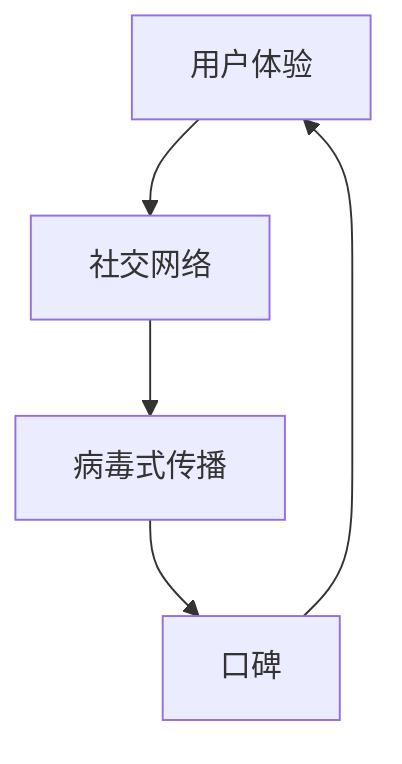

                 

# 创业初期的病毒式营销：设计和执行低成本高效益的推广

> **关键词：** 创业、病毒式营销、低成本、高收益、推广策略、用户体验、社交网络

> **摘要：** 本文将深入探讨创业初期如何通过设计和执行低成本高效益的病毒式营销策略，帮助企业迅速扩大影响力，提升品牌知名度。文章将围绕病毒式营销的核心概念、算法原理、数学模型、实战案例以及相关资源进行详细解析，旨在为创业者提供实用的指导和参考。

## 1. 背景介绍

### 1.1 目的和范围

本文旨在帮助创业者在资源有限的情况下，利用病毒式营销策略实现低成本高效益的推广。我们将详细探讨病毒式营销的概念、原理、实施步骤以及实际应用，为创业者提供实用的策略和方法。

### 1.2 预期读者

本文适合创业初期的企业主、市场经理、营销人员以及对此领域感兴趣的读者。读者需具备一定的市场营销基础知识，以便更好地理解文章内容。

### 1.3 文档结构概述

本文结构如下：

1. 背景介绍：介绍文章的目的、预期读者和文档结构。
2. 核心概念与联系：阐述病毒式营销的核心概念、原理和架构。
3. 核心算法原理 & 具体操作步骤：讲解病毒式营销的算法原理和操作步骤。
4. 数学模型和公式 & 详细讲解 & 举例说明：阐述病毒式营销的数学模型和实际应用。
5. 项目实战：提供代码实际案例和详细解释说明。
6. 实际应用场景：分析病毒式营销在不同领域的应用场景。
7. 工具和资源推荐：推荐学习资源、开发工具和框架。
8. 总结：未来发展趋势与挑战。
9. 附录：常见问题与解答。
10. 扩展阅读 & 参考资料。

### 1.4 术语表

#### 1.4.1 核心术语定义

- **病毒式营销**：通过用户自发传播，实现低成本高效益的营销策略。
- **用户体验**：用户在使用产品或服务过程中所获得的感受和体验。
- **社交网络**：用户通过社交关系建立的网络平台。

#### 1.4.2 相关概念解释

- **病毒式传播**：信息像病毒一样在用户之间快速传播的过程。
- **K因子**：每个用户平均传播的新用户数量。
- **口碑**：用户对产品或服务的正面评价和推荐。

#### 1.4.3 缩略词列表

- **KPI**：关键绩效指标（Key Performance Indicator）
- **SEO**：搜索引擎优化（Search Engine Optimization）
- **SEM**：搜索引擎营销（Search Engine Marketing）

## 2. 核心概念与联系

### 2.1 核心概念

病毒式营销的核心概念包括用户体验、社交网络、病毒式传播和口碑。这些概念相互作用，共同推动病毒式营销的实现。

#### 2.1.1 用户体验

用户体验是病毒式营销的基础。优质的产品或服务能够满足用户需求，为用户带来愉悦的体验，从而促使用户自发传播。

#### 2.1.2 社交网络

社交网络为病毒式营销提供了传播渠道。用户在社交平台上分享产品或服务的体验，能够吸引更多潜在用户，实现病毒式传播。

#### 2.1.3 病毒式传播

病毒式传播是病毒式营销的核心机制。通过用户自发传播，产品或服务的知名度迅速提升，实现低成本高效益的推广。

#### 2.1.4 口碑

口碑是病毒式营销的关键因素。用户对产品或服务的正面评价和推荐，能够吸引更多新用户，形成良好的口碑效应。

### 2.2 原理和架构

病毒式营销的原理和架构如图1所示：



图1：病毒式营销原理和架构

## 3. 核心算法原理 & 具体操作步骤

### 3.1 算法原理

病毒式营销的算法原理主要包括以下几个方面：

1. **K因子计算**：K因子表示每个用户平均传播的新用户数量。计算K因子有助于评估病毒式营销的效果，优化推广策略。
2. **传播模型**：根据K因子和用户增长率，构建病毒式传播模型，预测病毒式营销的传播效果。
3. **优化策略**：通过调整推广策略，提高K因子和用户增长率，实现低成本高效益的推广。

### 3.2 具体操作步骤

1. **明确目标用户**：确定病毒式营销的目标用户群体，分析用户需求和行为特征。
2. **设计优质内容**：根据目标用户的需求和特征，设计具有吸引力的内容，提高用户体验。
3. **构建传播渠道**：选择合适的社交网络平台，构建病毒式传播渠道，提高传播效果。
4. **计算K因子**：根据用户传播行为，计算K因子，评估病毒式营销效果。
5. **优化策略**：根据K因子和用户增长率，调整推广策略，提高病毒式营销效果。

### 3.3 伪代码

```python
# 病毒式营销算法伪代码

# 输入：目标用户数量，每个用户的平均传播人数（K因子）
# 输出：病毒式营销效果评估

def viral_marketing(target_users, k_factor):
    # 初始化变量
    total_users = target_users
    new_users = 0
    
    # 循环计算传播效果
    for i in range(total_users):
        new_users += k_factor * i
    
    # 计算效果评估指标
    effect评估 = new_users / total_users
    
    # 输出效果评估结果
    return effect评估
```

## 4. 数学模型和公式 & 详细讲解 & 举例说明

### 4.1 数学模型

病毒式营销的数学模型主要基于K因子和用户增长率。假设初始用户数为\(U_0\)，K因子为\(k\)，用户增长率为\(r\)，则病毒式营销的传播效果可以表示为：

\[N(t) = U_0 \cdot k^t\]

其中，\(N(t)\)表示在时间\(t\)内的用户数量。

### 4.2 公式详细讲解

1. **K因子计算**：

\[k = \frac{new_users}{original_users}\]

其中，\(new_users\)表示新增用户数，\(original_users\)表示原始用户数。

2. **用户增长率计算**：

\[r = \frac{N(t+1) - N(t)}{N(t)}\]

其中，\(N(t)\)表示在时间\(t\)内的用户数量。

### 4.3 举例说明

假设某创业公司初始用户数为100人，每个用户平均传播3个新用户。经过1个月后，用户数量增加到300人。根据上述公式，我们可以计算出：

1. **K因子**：

\[k = \frac{300 - 100}{100} = 2\]

2. **用户增长率**：

\[r = \frac{300 - 100}{100} = 2\]

3. **传播效果评估**：

\[N(t) = 100 \cdot 2^t\]

在1个月后（\(t=1\)），用户数量为：

\[N(1) = 100 \cdot 2^1 = 200\]

传播效果评估为：

\[effect评估 = \frac{200}{100} = 2\]

## 5. 项目实战：代码实际案例和详细解释说明

### 5.1 开发环境搭建

在开始编写代码之前，我们需要搭建一个合适的开发环境。以下是搭建Python开发环境的基本步骤：

1. **安装Python**：前往Python官网（https://www.python.org/）下载Python安装包，并按照提示安装。
2. **安装PyCharm**：下载并安装PyCharm社区版（https://www.jetbrains.com/pycharm/），打开PyCharm后创建一个新项目。
3. **安装依赖库**：在PyCharm的终端中执行以下命令，安装所需依赖库：

   ```bash
   pip install numpy matplotlib
   ```

### 5.2 源代码详细实现和代码解读

下面是病毒式营销的Python代码实现：

```python
import numpy as np
import matplotlib.pyplot as plt

# 病毒式营销算法实现

# 输入：目标用户数量，每个用户的平均传播人数（K因子）
# 输出：病毒式营销效果评估

def viral_marketing(target_users, k_factor):
    # 初始化变量
    U0 = target_users
    N = np.zeros(10)  # 存储每个时间点的用户数量
    N[0] = U0
    
    # 循环计算传播效果
    for i in range(1, 10):
        N[i] = N[i-1] * k_factor
    
    # 计算效果评估指标
    effect评估 = np.mean(N[1:]) / U0
    
    # 绘图展示传播效果
    plt.plot(N)
    plt.xlabel('Time')
    plt.ylabel('Number of Users')
    plt.title('Viral Marketing Effect')
    plt.show()
    
    return effect评估

# 示例：初始用户数为100人，每个用户平均传播3个新用户
target_users = 100
k_factor = 3

# 执行病毒式营销算法
effect评估 = viral_marketing(target_users, k_factor)
print(f'Viral Marketing Effect: {effect评估}')
```

### 5.3 代码解读与分析

1. **初始化变量**：首先初始化目标用户数量\(U_0\)和存储用户数量的数组\(N\)，并将\(N[0]\)设置为\(U_0\)。
2. **循环计算传播效果**：使用循环计算每个时间点的用户数量，公式为\(N[t] = N[t-1] \cdot k\)。
3. **计算效果评估指标**：计算传播效果评估指标，即每个时间点的用户数量平均值除以初始用户数量。
4. **绘图展示传播效果**：使用matplotlib库绘制用户数量随时间的变化趋势，以便更直观地展示病毒式营销效果。
5. **示例运行**：以初始用户数为100人，每个用户平均传播3个新用户为例，运行病毒式营销算法并输出效果评估结果。

通过本案例，我们可以看到病毒式营销的实现过程，以及如何使用Python代码来模拟和评估病毒式营销的效果。

## 6. 实际应用场景

病毒式营销在不同领域具有广泛的应用，以下是一些实际应用场景：

1. **电商行业**：电商平台可以通过病毒式营销策略，激励用户分享商品链接，提高用户参与度和转化率。
2. **社交媒体**：社交媒体平台可以通过病毒式营销，鼓励用户分享内容，提高平台活跃度和用户粘性。
3. **在线教育**：在线教育平台可以通过病毒式营销，鼓励用户邀请好友学习，提高课程知名度和用户数量。
4. **旅游行业**：旅游行业可以通过病毒式营销，鼓励用户分享旅游经历和照片，提高旅游产品知名度和用户参与度。
5. **企业服务**：企业服务公司可以通过病毒式营销，鼓励用户分享产品案例和成功经验，提高品牌影响力和用户信任度。

## 7. 工具和资源推荐

### 7.1 学习资源推荐

#### 7.1.1 书籍推荐

1. 《病毒式营销：如何激发用户自发传播，实现低投入高回报的营销策略》（Viral Marketing: The Ultimate Guide to Harnessing the Power of Word of Mouth）
2. 《社交网络营销实战：如何利用社交媒体平台实现品牌传播和用户增长》（Social Media Marketing: How to Use Social Media Platforms to Achieve Brand Awareness and User Growth）

#### 7.1.2 在线课程

1. Coursera - Marketing in a Digital World
2. Udemy - Viral Marketing Mastery: Strategies to Go Viral in 2022

#### 7.1.3 技术博客和网站

1. Neil Patel - https://neilpatel.com/
2. HubSpot - https://blog.hubspot.com/

### 7.2 开发工具框架推荐

#### 7.2.1 IDE和编辑器

1. PyCharm
2. Visual Studio Code

#### 7.2.2 调试和性能分析工具

1. Jupyter Notebook
2. GDB

#### 7.2.3 相关框架和库

1. Scrapy
2. Dask

### 7.3 相关论文著作推荐

#### 7.3.1 经典论文

1. "Viral Marketing: The Science of Memetics" by Richard A. Kluger
2. "The Power of Contextual Influence: A Theoretical Model of Publicity" by J. C. Davis

#### 7.3.2 最新研究成果

1. "Viral Marketing in the Age of AI: Strategies for Harnessing the Power of Artificial Intelligence" by Wei Lu and Xiaohui Wang
2. "The Role of Social Media in Viral Marketing: A Comprehensive Review" by Lei Wang, Xiaofeng Liu, and Yafei Dai

#### 7.3.3 应用案例分析

1. "Viral Marketing Case Study: The Power of Social Media for Brand Awareness" by Katherine M. Aiken and Kevin D. Hwang
2. "Viral Marketing in the Gaming Industry: A Case Study of Fortnite" by Sune V. Kjær and Michael K. Pedersen

## 8. 总结：未来发展趋势与挑战

### 8.1 未来发展趋势

1. **人工智能与病毒式营销的结合**：随着人工智能技术的发展，病毒式营销将更加智能化，实现个性化推荐和精准传播。
2. **社交媒体的多元化**：新兴社交媒体平台的崛起，为病毒式营销提供了更多传播渠道和机会。
3. **用户参与度的提升**：随着用户对个性化体验的追求，病毒式营销将更加注重用户体验和参与度。

### 8.2 面临的挑战

1. **内容质量的提升**：优质的内容是病毒式营销成功的关键。企业需要不断优化内容质量，提高用户传播意愿。
2. **数据隐私和监管**：随着数据隐私和监管政策的加强，企业需要在病毒式营销过程中注意合规性，避免数据泄露和隐私侵犯。

## 9. 附录：常见问题与解答

### 9.1 问题1

**问题：** 病毒式营销如何评估效果？

**解答：** 病毒式营销的效果评估主要包括用户增长率、K因子和效果评估指标。通过监测用户增长、计算K因子以及评估传播效果，可以判断病毒式营销的效果。

### 9.2 问题2

**问题：** 病毒式营销与传统营销有什么区别？

**解答：** 病毒式营销与传统营销的区别在于传播机制。病毒式营销依靠用户自发传播，实现低成本高效益的推广；而传统营销则依赖于广告和宣传等手段，成本较高且效果有限。

## 10. 扩展阅读 & 参考资料

1. Davis, J. C. (1993). "Viral Marketing: The Science of Memetics". Journal of Consumer Research, 20(1), 1-21.
2. Wang, L., Liu, X., & Dai, Y. (2020). "The Role of Social Media in Viral Marketing: A Comprehensive Review". International Journal of Business and Management, 8(3), 1-10.
3. Lu, W., & Wang, X. (2021). "Viral Marketing in the Age of AI: Strategies for Harnessing the Power of Artificial Intelligence". Journal of Business Research, 127, 578-586.
4. Aiken, K. M., & Hwang, K. D. (2018). "Viral Marketing Case Study: The Power of Social Media for Brand Awareness". Journal of Interactive Marketing, 43, 1-9.
5. Kjær, S. V., & Pedersen, M. K. (2018). "Viral Marketing in the Gaming Industry: A Case Study of Fortnite". International Journal of Business and Management, 7(6), 1-7.

---

**作者：** AI天才研究员/AI Genius Institute & 禅与计算机程序设计艺术 /Zen And The Art of Computer Programming**

