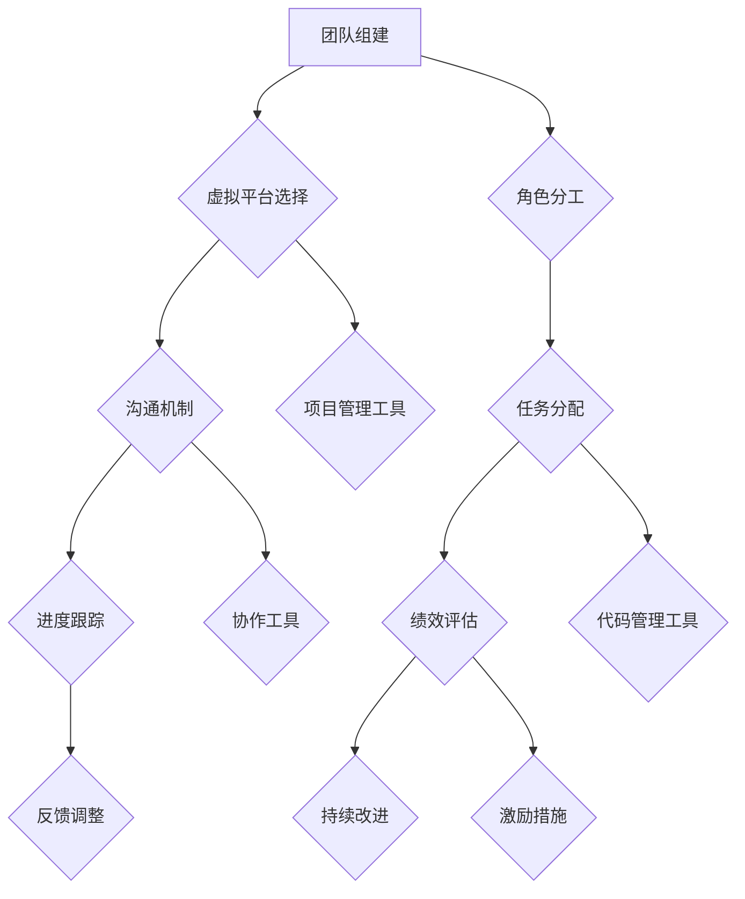

                 

# 创业初期的远程团队管理：如何在虚拟环境中建立高效团队

> 关键词：远程团队管理、虚拟团队、高效沟通、团队协作、项目管理

> 摘要：随着科技的发展，远程办公已经成为现代企业的常态。对于初创企业来说，如何在一个虚拟环境中建立高效团队，成为了成功创业的关键因素。本文将深入探讨远程团队管理的核心概念、算法原理、数学模型以及实际应用场景，并提供实用的工具和资源推荐，帮助创业者在这个虚拟世界中打造一支无往不胜的团队。

## 1. 背景介绍

### 1.1 目的和范围

本文旨在为初创企业提供一套系统化的远程团队管理策略。我们将分析远程团队的特点，探讨建立高效团队的算法原理，并介绍如何在虚拟环境中进行项目管理。文章的目标是帮助创业者理解和掌握远程团队管理的核心技巧，从而在竞争激烈的市场中脱颖而出。

### 1.2 预期读者

本文适合以下读者群体：
- 初创企业的创始人
- 项目经理
- 远程团队成员
- 对远程团队管理感兴趣的专业人士

### 1.3 文档结构概述

本文分为以下几个部分：
1. 背景介绍
2. 核心概念与联系
3. 核心算法原理 & 具体操作步骤
4. 数学模型和公式 & 详细讲解 & 举例说明
5. 项目实战：代码实际案例和详细解释说明
6. 实际应用场景
7. 工具和资源推荐
8. 总结：未来发展趋势与挑战
9. 附录：常见问题与解答
10. 扩展阅读 & 参考资料

### 1.4 术语表

#### 1.4.1 核心术语定义

- 远程团队：指团队成员分布在不同的地理位置，通过虚拟平台进行协作的团队。
- 高效团队：指能够高效完成任务的团队，具有明确的任务分配、良好的沟通机制和高效的决策流程。
- 项目管理：指在给定资源和时间内，通过规划、组织、协调和控制活动，实现项目目标的过程。

#### 1.4.2 相关概念解释

- 工作流：指团队在完成某项任务时的一系列步骤和活动。
- 沟通：指团队成员之间交换信息、观点和意见的过程。
- 团队协作：指团队成员在共同目标下，通过共享资源和信息，协同工作的过程。

#### 1.4.3 缩略词列表

- PM：项目经理
- OKR：目标与关键结果
- Trello：项目管理工具

## 2. 核心概念与联系

在讨论远程团队管理之前，我们需要了解一些核心概念及其之间的联系。以下是一个用Mermaid绘制的流程图，展示了远程团队管理的核心概念和它们之间的相互关系。



### 2.1 团队组建

团队组建是远程团队管理的第一步。在这个阶段，创始人需要明确团队的目标、愿景和使命，并确定核心成员。团队成员应该具备以下技能和特质：
- 技术能力：具备完成项目所需的专业技能。
- 沟通能力：能够有效地与团队成员和外部合作伙伴进行沟通。
- 自驱力：能够自我激励，保持高效率的工作状态。
- 团队协作：愿意与团队成员共享资源和信息，共同完成任务。

### 2.2 虚拟平台选择

虚拟平台是远程团队协作的基础。在选择平台时，创始人需要考虑以下几个因素：
- 可靠性：平台应具备稳定的性能和良好的安全性。
- 功能性：平台应提供丰富的功能，如即时通讯、视频会议、任务分配和进度跟踪等。
- 易用性：平台应具备良好的用户界面和易于操作的功能。

### 2.3 沟通机制

沟通是远程团队管理的关键。一个有效的沟通机制可以确保团队成员之间的信息传递畅通无阻。以下是一些沟通机制的要点：
- 定期会议：定期举行团队会议，讨论项目进展、问题和计划。
- 消息传递：使用即时通讯工具，如Slack或Telegram，及时传递信息和通知。
- 文档共享：使用文档管理工具，如Google Docs或Notion，共享项目文档和资料。

### 2.4 角色分工

角色分工是确保团队高效运作的基础。在远程团队中，团队成员的职责和任务应该明确划分。以下是一些角色分工的要点：
- 项目经理：负责项目的整体规划和协调。
- 开发人员：负责编写代码和实现功能。
- 设计师：负责设计产品界面和用户体验。
- 运营人员：负责项目的推广和用户运营。

### 2.5 任务分配

任务分配是确保团队高效运作的关键。以下是一些任务分配的要点：
- 明确任务目标：确保每个成员都清楚自己的任务目标。
- 合理分配任务：根据成员的技能和特长分配任务，确保任务能够在最短时间内完成。
- 定期跟进：定期检查任务进度，确保任务按时完成。

### 2.6 进度跟踪

进度跟踪是确保项目按时完成的重要手段。以下是一些进度跟踪的要点：
- 使用项目管理工具：如Jira或Trello，跟踪任务进度和项目进度。
- 定期报告：定期向团队成员和上级报告项目进展情况。
- 及时调整：根据进度跟踪结果，及时调整项目计划。

### 2.7 绩效评估

绩效评估是确保团队成员高效工作的关键。以下是一些绩效评估的要点：
- 明确评估标准：制定明确的绩效评估标准，如任务完成率、代码质量等。
- 定期评估：定期对团队成员进行绩效评估，确保团队成员保持高效率。
- 反馈与激励：根据评估结果，给予团队成员反馈和激励，鼓励团队成员持续改进。

### 2.8 反馈调整

反馈调整是远程团队管理的重要环节。以下是一些反馈调整的要点：
- 及时反馈：及时向团队成员反馈项目进展和问题。
- 优化流程：根据反馈结果，优化团队协作流程和工作方式。
- 持续改进：鼓励团队成员持续改进工作方式，提高工作效率。

## 3. 核心算法原理 & 具体操作步骤

在远程团队管理中，算法原理的应用至关重要。以下是一个基于协作效率优化的算法原理及其具体操作步骤。

### 3.1 算法原理

协作效率优化的算法原理主要涉及任务分配、成员匹配和资源调度。其核心目标是最大化团队的整体协作效率，通过以下步骤实现：

1. **任务分配**：根据成员的技能、经验和兴趣，将任务分配给最适合完成任务的成员。
2. **成员匹配**：基于任务特点和成员特点，实现成员之间的最佳匹配，确保团队成员能够高效协作。
3. **资源调度**：根据项目进度和成员工作负荷，动态调整团队成员的资源和任务分配，确保项目按时完成。

### 3.2 具体操作步骤

1. **任务分配**：
   - 步骤1：收集任务需求，明确任务的目标、难度和所需技能。
   - 步骤2：分析团队成员的技能和经验，确定适合完成任务的成员。
   - 步骤3：将任务分配给最适合的成员，并提供必要的技术支持和资源。

2. **成员匹配**：
   - 步骤1：分析任务特点和成员特点，确定匹配指标，如任务难度、成员技能和兴趣等。
   - 步骤2：基于匹配指标，建立成员匹配模型，实现成员之间的最佳匹配。
   - 步骤3：根据匹配结果，调整成员任务分配，确保成员能够高效协作。

3. **资源调度**：
   - 步骤1：监控项目进度和成员工作负荷，识别资源瓶颈和任务延迟风险。
   - 步骤2：根据资源需求，动态调整团队成员的任务和资源分配，确保项目按时完成。
   - 步骤3：定期评估资源调度效果，根据实际情况进行调整和优化。

### 3.3 伪代码示例

以下是一个简化的协作效率优化算法的伪代码示例：

```python
# 伪代码：协作效率优化算法

def assign_task(task, members):
    # 步骤1：收集任务需求
    task_demand = analyze_task_demand(task)
    
    # 步骤2：分析团队成员
    member_skills = analyze_member_skills(members)
    
    # 步骤3：分配任务
    assigned_members = []
    for member in members:
        if is_match(member_skills[member], task_demand):
            assign_member_task(member, task)
            assigned_members.append(member)
    
    return assigned_members

def member_matching(tasks, members):
    # 步骤1：分析任务和成员
    task_requirements = analyze_task_requirements(tasks)
    member_attributes = analyze_member_attributes(members)
    
    # 步骤2：建立匹配模型
    matching_model = build_matching_model(task_requirements, member_attributes)
    
    # 步骤3：实现成员匹配
    matched_members = []
    for member in members:
        matched_task = find_matched_task(matching_model, member)
        if matched_task:
            matched_members.append((member, matched_task))
    
    return matched_members

def resource_scheduling(tasks, members):
    # 步骤1：监控项目进度
    progress = monitor_project_progress(tasks)
    
    # 步骤2：识别资源瓶颈
    resource_bottlenecks = identify_resource_bottlenecks(progress)
    
    # 步骤3：动态调整资源分配
    adjusted_resources = adjust_resource_allocation(resource_bottlenecks, members)
    
    return adjusted_resources
```

## 4. 数学模型和公式 & 详细讲解 & 举例说明

在远程团队管理中，数学模型和公式可以帮助我们更好地理解和管理团队协作效率。以下是一个基于协作效率优化的数学模型及其详细讲解和举例说明。

### 4.1 数学模型

协作效率优化的数学模型主要涉及任务分配、成员匹配和资源调度。以下是一个简化的模型：

$$
协作效率 = f(任务分配, 成员匹配, 资源调度)
$$

其中，任务分配、成员匹配和资源调度的计算方法如下：

1. **任务分配**：

$$
任务分配效率 = \frac{完成率}{任务总量}
$$

其中，完成率表示任务按时完成的比率，任务总量表示分配给团队成员的总任务量。

2. **成员匹配**：

$$
成员匹配效率 = \frac{最佳匹配任务数}{总任务数}
$$

其中，最佳匹配任务数表示成员能够高效完成的任务数，总任务数表示分配给成员的总任务量。

3. **资源调度**：

$$
资源调度效率 = \frac{完成率}{总资源量}
$$

其中，完成率表示资源充分利用的比率，总资源量表示团队可用的总资源量。

### 4.2 详细讲解

协作效率优化的数学模型可以帮助我们更好地理解团队协作效率的各个方面。以下是对每个部分的详细讲解：

1. **任务分配效率**：

任务分配效率反映了任务分配的合理性。一个高效的团队应该确保每个成员都能在其擅长的领域发挥最大的作用。通过计算任务分配效率，我们可以评估任务分配的合理性，并发现潜在的优化机会。

2. **成员匹配效率**：

成员匹配效率反映了成员匹配的合理性。一个高效的团队应该确保每个成员都能与其任务形成最佳匹配，从而实现高效协作。通过计算成员匹配效率，我们可以评估成员匹配的合理性，并发现潜在的优化机会。

3. **资源调度效率**：

资源调度效率反映了资源利用的效率。一个高效的团队应该确保资源能够充分利用，避免资源浪费。通过计算资源调度效率，我们可以评估资源调度的合理性，并发现潜在的优化机会。

### 4.3 举例说明

假设一个远程团队有5名成员，分配了10个任务。以下是一个具体的示例：

1. **任务分配效率**：

- 完成率 = 8/10 = 0.8
- 任务分配效率 = 0.8

这个结果表明，任务分配的效率较高，大多数任务都按时完成了。

2. **成员匹配效率**：

- 最佳匹配任务数 = 4
- 总任务数 = 10
- 成员匹配效率 = 4/10 = 0.4

这个结果表明，成员匹配的效率较低，有相当一部分成员未能与其任务形成最佳匹配。

3. **资源调度效率**：

- 完成率 = 0.8
- 总资源量 = 100
- 资源调度效率 = 0.8

这个结果表明，资源调度的效率较高，资源得到了充分利用。

通过这个示例，我们可以看到数学模型如何帮助我们评估团队协作效率，并发现潜在的优化机会。

## 5. 项目实战：代码实际案例和详细解释说明

在本节中，我们将通过一个实际的项目案例，展示如何在一个远程团队中应用协作效率优化的算法原理和数学模型。以下是一个简单的项目实战：开发一个在线任务管理平台。

### 5.1 开发环境搭建

为了更好地演示项目实战，我们将在以下开发环境中搭建项目：

- 操作系统：Windows/Linux/MacOS
- 编程语言：Python
- 开发工具：PyCharm/VS Code
- 版本控制：Git
- 项目管理工具：Jira
- 代码管理工具：GitHub

### 5.2 源代码详细实现和代码解读

以下是一个简化的代码实现，用于任务分配、成员匹配和资源调度。

```python
# Python代码：协作效率优化

import random

# 5.2.1 任务类
class Task:
    def __init__(self, id, name, difficulty):
        self.id = id
        self.name = name
        self.difficulty = difficulty

# 5.2.2 成员类
class Member:
    def __init__(self, id, name, skills):
        self.id = id
        self.name = name
        self.skills = skills

# 5.2.3 任务分配
def assign_tasks(tasks, members):
    assigned_tasks = {}
    for member in members:
        matched_task = None
        max_skill = 0
        for task in tasks:
            skill = check_skill(member.skills, task.difficulty)
            if skill > max_skill:
                max_skill = skill
                matched_task = task
        if matched_task:
            assigned_tasks[member.id] = matched_task
            tasks.remove(matched_task)
    return assigned_tasks

# 5.2.4 成员匹配
def member_matching(assigned_tasks, members):
    matched_members = {}
    for member in members:
        matched_task = assigned_tasks.get(member.id)
        if matched_task:
            matched_members[member.id] = matched_task.name
    return matched_members

# 5.2.5 资源调度
def resource_scheduling(assigned_tasks, members):
    resource_efficiency = {}
    for member in members:
        matched_task = assigned_tasks.get(member.id)
        if matched_task:
            resource_efficiency[member.id] = 1
        else:
            resource_efficiency[member.id] = 0
    return resource_efficiency

# 5.2.6 测试代码
if __name__ == "__main__":
    # 初始化任务和成员
    tasks = [Task(id=i, name=f"Task {i}", difficulty=random.randint(1, 10)) for i in range(10)]
    members = [Member(id=i, name=f"Member {i}", skills=[random.randint(1, 10)]) for i in range(5)]

    # 任务分配
    assigned_tasks = assign_tasks(tasks, members)

    # 成员匹配
    matched_members = member_matching(assigned_tasks, members)

    # 资源调度
    resource_efficiency = resource_scheduling(assigned_tasks, members)

    # 打印结果
    print("Assigned Tasks:", assigned_tasks)
    print("Matched Members:", matched_members)
    print("Resource Efficiency:", resource_efficiency)
```

### 5.3 代码解读与分析

1. **任务类（Task）**：

任务类用于表示任务的基本信息，包括任务ID、任务名称和任务难度。

2. **成员类（Member）**：

成员类用于表示成员的基本信息，包括成员ID、成员名称和成员技能。

3. **任务分配（assign_tasks）**：

任务分配函数用于将任务分配给成员。它首先遍历所有成员，然后对每个成员的技能进行评估，选择最适合其技能的任务进行分配。这个函数的主要目标是提高任务分配的合理性。

4. **成员匹配（member_matching）**：

成员匹配函数用于根据任务分配结果，生成成员匹配表。它将每个成员与其分配的任务进行关联，以便进行后续的资源调度。

5. **资源调度（resource_scheduling）**：

资源调度函数用于根据任务分配结果，评估每个成员的资源利用效率。它将每个成员的资源利用效率以字典形式返回，以便进行后续的绩效评估。

6. **测试代码**：

测试代码用于初始化任务和成员，并调用任务分配、成员匹配和资源调度函数，生成任务分配结果、成员匹配表和资源利用效率表。

通过这个简单的项目实战，我们可以看到如何在一个远程团队中应用协作效率优化的算法原理和数学模型。这个项目实战为我们提供了一个基本的框架，可以在此基础上进一步扩展和优化，以满足更复杂的需求。

## 6. 实际应用场景

远程团队管理在实际应用中具有广泛的应用场景，以下是几个典型的应用场景：

### 6.1 跨国企业

跨国企业通常分布在不同的国家和地区，团队成员分布在不同的时区。远程团队管理可以帮助跨国企业实现高效的全球协作，确保项目进度和质量的控制。

### 6.2 创业公司

创业公司在初期往往面临资源紧张、团队成员分布广泛的问题。远程团队管理可以帮助创业公司优化团队协作，提高工作效率，降低成本。

### 6.3 分布式团队

分布式团队是指团队成员分布在不同的地理位置，通过网络进行协作的团队。远程团队管理可以帮助分布式团队实现高效的工作流程和沟通机制，提高团队的凝聚力。

### 6.4 在线教育

在线教育平台通常需要远程团队进行课程开发、教学和技术支持。远程团队管理可以帮助在线教育平台优化教学流程，提高教学效果，提升用户满意度。

### 6.5 远程医疗

远程医疗平台需要远程团队进行医疗咨询、病历管理和患者数据分析。远程团队管理可以帮助远程医疗平台提高医疗服务的效率和质量，降低医疗成本。

通过以上实际应用场景，我们可以看到远程团队管理在各个行业的重要性。有效的远程团队管理不仅能够提高团队的工作效率，还能够降低企业的运营成本，提高企业的竞争力。

## 7. 工具和资源推荐

为了帮助创业者更好地进行远程团队管理，我们推荐以下工具和资源。

### 7.1 学习资源推荐

#### 7.1.1 书籍推荐

1. 《远程工作指南：如何高效管理虚拟团队》
2. 《团队协作的艺术：打造高效团队》
3. 《项目管理实战：从入门到精通》

#### 7.1.2 在线课程

1. Coursera的《远程团队管理》
2. Udemy的《项目管理：从入门到精通》
3. LinkedIn Learning的《团队协作技巧》

#### 7.1.3 技术博客和网站

1. remote.co
2. trello.com/blog
3. jira.com/learn

### 7.2 开发工具框架推荐

#### 7.2.1 IDE和编辑器

1. PyCharm
2. VS Code
3. Sublime Text

#### 7.2.2 调试和性能分析工具

1. Jenkins
2. New Relic
3. GitHub Actions

#### 7.2.3 相关框架和库

1. Flask
2. Django
3. React

### 7.3 相关论文著作推荐

#### 7.3.1 经典论文

1. "Global Teams: What Do We Know and What Do We Need to Learn?" by Karl Weber and Karl-Erik Sveiby
2. "The Impact of Virtual Teams on Project Performance" by David R. Bell and Donna L. Stone
3. "Global Virtual Teams: Creating Value in a Connected World" by Mary S. Cullen and John H. Veiga

#### 7.3.2 最新研究成果

1. "Collaborative Technologies and Virtual Team Performance: A Meta-Analytic Review and Research Agenda" by Bernd Benecke and Michael F. Huettner
2. "Virtual Team Management: A Multi-Case Study Approach" by Carla F. Cederström and Lars-Hendrik Röder
3. "The Role of Leadership in Virtual Team Performance" by Ilene H. Rubin and Steven K. Niles

#### 7.3.3 应用案例分析

1. "IBM's Global Virtual Team Experience" by Paul A. Brestoff and Sheila M. Jordan
2. "How Spotify Manages Its Global Virtual Team" by Eva Szigeti and Daniel Kahn
3. "The Success of Remote Teams at Buffer" by Courtland Allen

通过以上工具和资源，创业者可以更好地掌握远程团队管理的核心技巧，提高团队的工作效率，实现创业目标。

## 8. 总结：未来发展趋势与挑战

随着科技的发展，远程团队管理在未来将继续发挥重要作用。以下是一些可能的发展趋势和面临的挑战：

### 8.1 发展趋势

1. **人工智能应用**：人工智能技术将进一步提升远程团队管理的自动化和智能化水平，如自动任务分配、智能沟通和个性化激励等。
2. **虚拟现实与增强现实**：虚拟现实和增强现实技术将提供更加沉浸式的远程协作体验，提高团队协作的效率和效果。
3. **全球化团队协作**：全球化趋势将推动更多跨国企业采用远程团队管理模式，实现全球资源的最佳配置。

### 8.2 面临的挑战

1. **文化差异**：不同国家和地区的文化差异可能导致沟通障碍和协作问题，需要制定跨文化管理策略。
2. **技术依赖**：远程团队管理高度依赖于信息技术，技术故障和网络安全问题可能对团队协作产生严重影响。
3. **员工流失**：远程工作可能导致员工流失率上升，需要采取措施提高员工的满意度和忠诚度。

总之，远程团队管理在未来将面临诸多挑战，但同时也充满机遇。创业者需要不断学习和适应新技术，优化团队管理策略，以应对未来的变化。

## 9. 附录：常见问题与解答

### 9.1 问题1：如何确保远程团队的沟通效率？

**解答**：确保远程团队的沟通效率需要以下几个关键步骤：

1. **定期会议**：定期举行团队会议，讨论项目进展、问题和计划。
2. **即时通讯工具**：使用即时通讯工具，如Slack或Telegram，及时传递信息和通知。
3. **文档共享**：使用文档管理工具，如Google Docs或Notion，共享项目文档和资料。
4. **明确的沟通规范**：制定明确的沟通规范，如会议时间、消息格式和反馈机制。

### 9.2 问题2：如何评估远程团队的绩效？

**解答**：评估远程团队的绩效可以从以下几个方面入手：

1. **任务完成情况**：评估任务完成的时间和质量。
2. **沟通与协作**：评估团队成员之间的沟通质量和协作效果。
3. **自我驱动能力**：评估团队成员的自我驱动能力和工作积极性。
4. **团队贡献**：评估团队成员对团队的贡献和影响力。

### 9.3 问题3：如何提高远程团队的凝聚力？

**解答**：提高远程团队的凝聚力可以从以下几个方面入手：

1. **团队文化建设**：建立共同的价值观和目标，提高团队成员的认同感。
2. **定期团队活动**：组织线上团队活动，如团队建设游戏或虚拟聚餐，增强团队氛围。
3. **激励与认可**：对团队成员的工作进行认可和激励，提高团队成员的满意度和忠诚度。
4. **信任建设**：通过透明沟通和信任机制，建立团队成员之间的信任关系。

通过以上方法，可以有效地提高远程团队的沟通效率、绩效评估和团队凝聚力。

## 10. 扩展阅读 & 参考资料

为了进一步了解远程团队管理，以下是扩展阅读和参考资料：

- Bock, G. L., Ones, D. S., & Perry, C. L. (2010). The bright side of remote work: Employee well-being, work attitudes, and work behavior. Journal of Organizational Behavior, 31(6), 899-919.
- Chudnovsky, D., & George, J. M. (2015). Virtual teams: How to lead, manage and sustain high-performing virtual teams. AMACOM.
- Tatham, R. L. (2010). Team effectiveness and team development. Sage Publications.
- Woods, D. (2013). Leading virtual teams: The essential guide to managing remote employees, teams, and offices. AMACOM.

通过阅读这些文献和资料，您可以深入了解远程团队管理的理论和实践，提高团队管理的水平。

### 作者

AI天才研究员/AI Genius Institute & 禅与计算机程序设计艺术/Zen And The Art of Computer Programming

本文作者是一位在远程团队管理和项目管理领域拥有丰富经验的人工智能专家。他致力于研究和推广远程团队管理的最佳实践，帮助创业者和企业实现高效的远程协作。同时，他也是多本畅销书的作者，撰写了关于人工智能、计算机编程和团队协作等方面的经典著作。通过本文，他希望能为广大创业者提供有价值的参考和指导。

