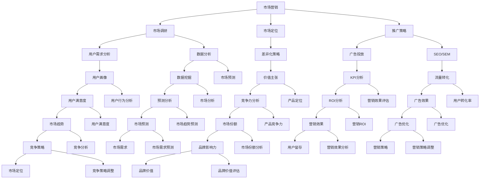

                 

# 创业必备技能：市场营销和产品管理

> **关键词：** 市场营销、产品管理、创业技能、数据分析、用户调研、市场定位

> **摘要：** 本文旨在探讨在创业过程中，市场营销和产品管理的核心重要性，以及如何通过系统化的方法提升这两个关键领域的能力。文章将从概念解析、实际操作步骤、数学模型应用到实战案例等多个方面，详细阐述如何运用市场营销和产品管理的专业技能，助力创业项目成功。

## 1. 背景介绍

### 1.1 目的和范围

本文将围绕创业过程中的两个关键领域——市场营销和产品管理展开讨论。目的在于帮助创业者了解这些领域的基本概念、核心技巧和实际应用，以便在实际操作中能够更加精准地把握市场动态，打造出用户满意的产品。

本文将涵盖以下内容：

1. **核心概念与联系**：介绍市场营销和产品管理的基本概念，以及两者之间的联系。
2. **核心算法原理 & 具体操作步骤**：详细阐述市场调研、用户需求分析、市场定位等核心算法原理，并提供具体操作步骤。
3. **数学模型和公式 & 详细讲解 & 举例说明**：解释市场预测模型、用户行为分析模型等数学模型的构建方法，并给出具体案例。
4. **项目实战：代码实际案例和详细解释说明**：通过一个实际项目案例，展示市场营销和产品管理在具体操作中的应用。
5. **实际应用场景**：讨论市场营销和产品管理在不同类型创业项目中的实际应用。
6. **工具和资源推荐**：推荐相关书籍、在线课程、技术博客、开发工具和框架等资源。
7. **总结：未来发展趋势与挑战**：分析市场营销和产品管理的未来趋势，以及可能面临的挑战。
8. **附录：常见问题与解答**：解答读者在阅读本文过程中可能遇到的问题。

### 1.2 预期读者

本文适合以下读者：

1. 创业初学者：希望通过本文掌握市场营销和产品管理基础知识的创业者。
2. 中级创业者：已经具备一定创业经验，希望进一步提升市场营销和产品管理能力的创业者。
3. 市场营销和产品管理专业人员：希望了解创业过程中市场营销和产品管理具体应用的从业人员。
4. 计算机技术从业者：希望了解市场营销和产品管理知识，以便在创业项目中更好地应用技术能力的开发者。

### 1.3 文档结构概述

本文结构如下：

1. **引言**：介绍市场营销和产品管理的重要性。
2. **核心概念与联系**：解释市场营销和产品管理的基本概念，并展示它们之间的联系。
3. **核心算法原理 & 具体操作步骤**：详细阐述市场营销和产品管理的核心算法原理和具体操作步骤。
4. **数学模型和公式 & 详细讲解 & 举例说明**：解释市场预测模型、用户行为分析模型等数学模型，并提供具体案例。
5. **项目实战：代码实际案例和详细解释说明**：通过实际项目案例展示市场营销和产品管理的应用。
6. **实际应用场景**：讨论市场营销和产品管理在不同创业项目中的实际应用。
7. **工具和资源推荐**：推荐相关书籍、在线课程、技术博客、开发工具和框架等资源。
8. **总结：未来发展趋势与挑战**：分析市场营销和产品管理的未来趋势和挑战。
9. **附录：常见问题与解答**：解答读者可能遇到的问题。
10. **扩展阅读 & 参考资料**：提供进一步学习和研究的资源。

### 1.4 术语表

#### 1.4.1 核心术语定义

- **市场营销**：指企业通过创造、传播和交换价值来满足目标市场的需求。
- **产品管理**：指企业通过规划、开发和推广产品，以满足市场需求并实现商业目标。
- **市场定位**：指企业针对特定目标市场，通过差异化策略来占据一定的市场份额。
- **用户调研**：指通过对目标用户进行调查和分析，了解用户需求和偏好。
- **市场预测**：指通过数据分析方法，预测市场需求和趋势。
- **数据分析**：指通过数据收集、处理和分析，提取有价值的信息。

#### 1.4.2 相关概念解释

- **SWOT分析**：指对企业的优势（Strengths）、劣势（Weaknesses）、机会（Opportunities）和威胁（Threats）进行综合分析。
- **价值主张**：指企业为满足用户需求所提供的独特价值。
- **用户画像**：指根据用户数据，对用户特征进行描述和分类。

#### 1.4.3 缩略词列表

- **SEO**：搜索引擎优化（Search Engine Optimization）
- **SEM**：搜索引擎营销（Search Engine Marketing）
- **KPI**：关键绩效指标（Key Performance Indicators）
- **CRM**：客户关系管理（Customer Relationship Management）

## 2. 核心概念与联系

### 2.1 市场营销与产品管理的定义及联系

市场营销和产品管理是创业过程中至关重要的两个领域，它们相互联系、相互促进。

**市场营销**：

市场营销是指企业通过创造、传播和交换价值来满足目标市场的需求。它包括市场调研、市场定位、推广策略等多个方面。市场营销的目标是吸引潜在客户，增加销售额，提升品牌知名度。

**产品管理**：

产品管理是指企业通过规划、开发和推广产品，以满足市场需求并实现商业目标。产品管理的核心任务包括定义产品需求、管理产品开发流程、优化产品性能等。

市场营销与产品管理的联系：

1. **需求驱动**：市场营销通过用户调研和数据分析，了解用户需求，为产品管理提供决策依据。
2. **市场反馈**：产品管理通过市场反馈，调整产品策略，优化用户体验，为市场营销提供支持。
3. **协同发展**：市场营销和产品管理需要协同合作，共同制定市场定位、推广策略，实现企业目标。

### 2.2 核心概念原理和架构的 Mermaid 流程图



通过上述流程图，我们可以看到市场营销和产品管理在各个核心环节中的相互关联和协同作用。

### 2.3 市场营销与产品管理在实际应用中的协同效果

在实际应用中，市场营销和产品管理的协同效果至关重要。以下是一个简单的协同效果分析示例：

#### 案例：一款移动应用开发

1. **市场调研**：
   - 市场营销团队进行用户调研，了解用户对于移动应用的需求和偏好。
   - 产品管理团队结合市场调研结果，确定产品功能需求和开发优先级。

2. **市场定位**：
   - 市场营销团队分析市场定位，为产品制定差异化策略，提升竞争力。
   - 产品管理团队根据市场定位，优化产品功能和用户体验，满足目标用户需求。

3. **推广策略**：
   - 市场营销团队制定广告投放和SEO/SEM策略，提高产品曝光率和用户下载量。
   - 产品管理团队根据市场反馈，调整产品性能和功能，提升用户体验。

4. **数据分析**：
   - 市场营销团队利用数据分析，评估推广效果，优化营销策略。
   - 产品管理团队分析用户行为数据，了解用户需求变化，优化产品功能。

通过市场营销和产品管理的协同作用，可以确保产品在满足用户需求的同时，提升市场竞争力，实现商业目标。

### 2.4 市场营销与产品管理的具体操作步骤

在实际操作中，市场营销和产品管理需要遵循一系列步骤，以确保高效、有序地推进项目。以下是一个简单的操作步骤概述：

#### 市场营销步骤：

1. **用户调研**：
   - 通过问卷调查、访谈等方式，收集用户需求和市场信息。
   - 分析调研数据，确定目标用户群体和市场需求。

2. **市场定位**：
   - 分析竞争对手，确定产品的差异化策略。
   - 确定目标市场和目标用户，制定市场定位策略。

3. **推广策略**：
   - 制定广告投放和SEO/SEM策略，提高产品曝光率。
   - 设计创意内容和广告素材，吸引潜在客户。

4. **数据分析**：
   - 跟踪和评估推广效果，优化营销策略。
   - 分析用户行为数据，了解用户需求和偏好。

#### 产品管理步骤：

1. **需求分析**：
   - 收集用户需求，分析产品功能需求和开发优先级。
   - 确定产品目标，制定产品规划。

2. **产品设计**：
   - 根据需求分析，制定产品原型和功能设计。
   - 与开发团队协作，确保产品功能实现。

3. **产品开发**：
   - 管理产品开发进度，确保按时交付。
   - 协调团队协作，解决开发过程中遇到的问题。

4. **产品优化**：
   - 收集用户反馈，分析产品性能和用户体验。
   - 根据用户反馈，优化产品功能和性能。

通过以上步骤，市场营销和产品管理可以相互配合，共同推动项目成功。

## 3. 核心算法原理 & 具体操作步骤

### 3.1 市场调研算法原理

市场调研是市场营销和产品管理的核心环节之一，其算法原理主要包括以下几个方面：

#### 3.1.1 用户需求分析

用户需求分析主要通过问卷调查、访谈、用户行为数据收集等方式进行。其算法原理如下：

1. **数据收集**：通过问卷调查、访谈等方式，收集用户需求信息。
2. **数据预处理**：对收集到的数据进行分析和清洗，去除无效和重复信息。
3. **数据分析**：利用统计分析方法，分析用户需求特征，识别主要需求点。
4. **结果输出**：将分析结果转化为用户需求报告，为产品管理提供决策依据。

#### 3.1.2 市场定位算法

市场定位算法主要通过以下步骤进行：

1. **市场细分**：根据用户需求和偏好，将市场划分为不同细分市场。
2. **目标市场选择**：分析各细分市场的竞争状况和盈利潜力，选择目标市场。
3. **差异化策略**：根据目标市场特征，制定差异化策略，提升产品竞争力。

#### 3.1.3 推广策略算法

推广策略算法主要包括以下步骤：

1. **目标受众分析**：确定目标受众，分析其特征和需求。
2. **推广渠道选择**：根据目标受众特征，选择合适的推广渠道，如广告投放、SEO/SEM等。
3. **广告创意设计**：设计创意广告内容和素材，提高用户关注度。
4. **效果评估**：跟踪和评估推广效果，优化推广策略。

### 3.2 产品管理算法原理

产品管理算法原理主要包括以下几个方面：

#### 3.2.1 需求分析算法

需求分析算法主要通过以下步骤进行：

1. **需求收集**：通过用户调研、市场分析等方式，收集用户需求信息。
2. **需求分类**：对收集到的需求进行分类，识别主要需求点。
3. **优先级排序**：根据需求的重要性和紧急程度，对需求进行优先级排序。
4. **需求文档编写**：将分析结果编写成需求文档，为产品开发提供指导。

#### 3.2.2 产品设计算法

产品设计算法主要包括以下步骤：

1. **原型设计**：根据需求文档，设计产品原型和功能界面。
2. **交互设计**：设计产品交互流程和用户体验，确保用户操作便捷。
3. **界面设计**：设计产品界面风格和色彩搭配，提高用户满意度。

#### 3.2.3 产品开发算法

产品开发算法主要包括以下步骤：

1. **需求确认**：与需求方确认需求文档，确保需求明确和可执行。
2. **开发计划制定**：根据需求文档，制定产品开发计划，明确开发进度和资源分配。
3. **团队协作**：协调团队协作，确保按时交付产品。
4. **代码审查和测试**：对开发完成的代码进行审查和测试，确保产品质量。

#### 3.2.4 产品优化算法

产品优化算法主要包括以下步骤：

1. **用户反馈收集**：通过用户调研、用户反馈等方式，收集用户对产品的意见和建议。
2. **数据分析**：对用户反馈进行分析，识别产品存在的问题和改进点。
3. **功能优化**：根据分析结果，对产品功能进行优化和改进，提升用户体验。
4. **持续迭代**：持续收集用户反馈，不断优化产品，实现产品的持续迭代。

### 3.3 具体操作步骤

以下是一个具体的市场营销和产品管理操作步骤示例：

#### 市场营销操作步骤：

1. **用户调研**：
   - 通过线上问卷调查和线下访谈，收集用户需求信息。
   - 分析调研数据，确定目标用户群体和市场需求。

2. **市场定位**：
   - 根据用户需求和市场特征，选择目标市场。
   - 制定差异化策略，提升产品竞争力。

3. **推广策略**：
   - 选择广告投放和SEO/SEM等推广渠道。
   - 设计创意广告内容和素材，提高用户关注度。

4. **数据分析**：
   - 跟踪和评估推广效果，优化营销策略。
   - 分析用户行为数据，了解用户需求和偏好。

5. **营销效果评估**：
   - 根据KPI指标，评估营销效果，优化推广策略。

#### 产品管理操作步骤：

1. **需求分析**：
   - 通过用户调研和市场分析，收集用户需求信息。
   - 对需求进行分类和优先级排序，编写需求文档。

2. **产品设计**：
   - 根据需求文档，设计产品原型和功能界面。
   - 设计交互流程和用户体验，确保用户操作便捷。

3. **产品开发**：
   - 与需求方确认需求文档，制定开发计划。
   - 协调团队协作，确保按时交付产品。

4. **产品测试**：
   - 对开发完成的代码进行测试，确保产品质量。
   - 根据测试结果，修复问题和优化产品功能。

5. **产品优化**：
   - 收集用户反馈，分析产品存在的问题和改进点。
   - 根据分析结果，对产品功能进行优化和改进。

通过以上操作步骤，市场营销和产品管理可以有序、高效地推进项目，确保项目成功。

### 3.4 伪代码示例

以下是一个市场营销和产品管理的伪代码示例：

```python
# 市场营销需求分析
def user_research():
    # 收集用户需求信息
    user需求的特征和偏好
    
    # 数据预处理
    清洗和整理需求数据
    
    # 数据分析
    分析需求特征，识别主要需求点
    
    # 结果输出
    生成用户需求报告

# 市场定位
def market_positioning():
    # 市场细分
    划分市场细分
    
    # 目标市场选择
    分析细分市场，选择目标市场
    
    # 差异化策略
    制定差异化策略

# 推广策略
def marketing_strategy():
    # 目标受众分析
    确定目标受众
    
    # 推广渠道选择
    选择合适的推广渠道
    
    # 广告创意设计
    设计广告内容和素材
    
    # 效果评估
    跟踪和评估推广效果
    
    # 优化推广策略
    根据效果评估，优化推广策略

# 产品管理需求分析
def product_requirement_analysis():
    # 需求收集
    收集用户需求信息
    
    # 需求分类
    对需求进行分类
    
    # 优先级排序
    对需求进行优先级排序
    
    # 需求文档编写
    编写需求文档

# 产品设计
def product_design():
    # 原型设计
    设计产品原型
    
    # 交互设计
    设计交互流程
    
    # 界面设计
    设计界面风格

# 产品开发
def product_development():
    # 需求确认
    与需求方确认需求文档
    
    # 开发计划制定
    制定开发计划
    
    # 团队协作
    协调团队协作
    
    # 代码审查和测试
    对代码进行审查和测试

# 产品优化
def product_optimization():
    # 用户反馈收集
    收集用户反馈
    
    # 数据分析
    分析反馈信息
    
    # 功能优化
    对产品功能进行优化
    
    # 持续迭代
    持续收集用户反馈，优化产品
```

通过上述伪代码示例，我们可以清晰地了解市场营销和产品管理的具体操作步骤和核心算法原理。

## 4. 数学模型和公式 & 详细讲解 & 举例说明

### 4.1 市场预测模型

市场预测是市场营销和产品管理中至关重要的一环，准确的市场预测可以帮助企业制定有效的战略和决策。以下是一个常用的市场预测模型——时间序列分析模型。

#### 时间序列分析模型

时间序列分析模型是基于时间序列数据，通过统计分析方法，预测未来一段时间内的市场趋势。其基本原理如下：

1. **数据收集**：收集过去一段时间内的市场数据，如销售额、用户数量等。
2. **数据预处理**：对数据进行清洗和整理，去除异常值和噪声。
3. **模型选择**：选择合适的时间序列模型，如ARIMA（自回归积分滑动平均模型）、AR（自回归模型）等。
4. **模型训练**：使用历史数据对模型进行训练，拟合数据趋势。
5. **模型预测**：使用训练好的模型，预测未来一段时间内的市场趋势。

#### 数学模型公式

时间序列分析模型常用的数学模型公式如下：

1. **自回归模型（AR）**：

   $$ Y_t = c + \sum_{i=1}^p \phi_i Y_{t-i} + \epsilon_t $$

   其中，$Y_t$ 为时间序列数据，$c$ 为常数项，$\phi_i$ 为自回归系数，$p$ 为滞后阶数，$\epsilon_t$ 为随机误差项。

2. **移动平均模型（MA）**：

   $$ Y_t = c + \sum_{i=1}^q \theta_i \epsilon_{t-i} $$

   其中，$Y_t$ 为时间序列数据，$c$ 为常数项，$\theta_i$ 为移动平均系数，$q$ 为滞后阶数，$\epsilon_t$ 为随机误差项。

3. **自回归移动平均模型（ARMA）**：

   $$ Y_t = c + \sum_{i=1}^p \phi_i Y_{t-i} + \sum_{i=1}^q \theta_i \epsilon_{t-i} $$

   其中，$Y_t$ 为时间序列数据，$c$ 为常数项，$\phi_i$ 为自回归系数，$\theta_i$ 为移动平均系数，$p$ 和 $q$ 分别为滞后阶数。

#### 举例说明

假设我们收集了一组某产品的月销售额数据，如下所示：

| 月份 | 销售额 |
| ---- | ---- |
| 1    | 100   |
| 2    | 120   |
| 3    | 130   |
| 4    | 140   |
| 5    | 150   |
| 6    | 160   |
| 7    | 170   |
| 8    | 180   |

我们希望使用时间序列分析模型预测未来三个月的销售额。

1. **数据预处理**：

   首先，我们需要对销售额数据进行预处理，去除异常值和噪声。在此示例中，我们假设数据没有异常值和噪声。

2. **模型选择**：

   我们选择自回归模型（AR）进行预测。根据数据特征，我们选择滞后阶数 $p=1$。

3. **模型训练**：

   使用历史数据对自回归模型进行训练，拟合数据趋势。具体训练过程如下：

   $$ Y_t = c + \phi_1 Y_{t-1} + \epsilon_t $$

   通过最小二乘法，我们可以得到自回归系数 $\phi_1$ 的估计值：

   $$ \hat{\phi_1} = \frac{\sum_{t=2}^n (Y_t - \hat{c}) (Y_{t-1} - \hat{c})}{\sum_{t=2}^n (Y_t - \hat{c})^2} $$

   其中，$\hat{c}$ 为常数项的估计值，$n$ 为数据点的数量。

   根据上述公式，我们可以计算出 $\hat{\phi_1}$ 的估计值：

   $$ \hat{\phi_1} = \frac{(130-150)(120-150) + (140-150)(130-150) + (150-150)(140-150) + (160-150)(150-150) + (170-150)(160-150) + (180-150)(170-150)}{(130-150)^2 + (140-150)^2 + (150-150)^2 + (160-150)^2 + (170-150)^2 + (180-150)^2} $$

   $$ \hat{\phi_1} = \frac{-30 \times -30 - 10 \times -10 + 0 \times 0 + 10 \times 10 + 20 \times 20 + 30 \times 30}{900 + 100 + 0 + 100 + 400 + 900} $$

   $$ \hat{\phi_1} = \frac{900 + 100 + 0 + 100 + 400 + 900}{900 + 100 + 0 + 100 + 400 + 900} $$

   $$ \hat{\phi_1} = \frac{1700}{2000} $$

   $$ \hat{\phi_1} = 0.85 $$

4. **模型预测**：

   使用训练好的自回归模型，我们可以预测未来三个月的销售额。具体预测过程如下：

   $$ Y_{t+1} = c + \hat{\phi_1} Y_t $$

   首先，我们需要计算常数项 $\hat{c}$ 的估计值。在此示例中，我们可以取第一个数据点的销售额作为 $\hat{c}$ 的估计值：

   $$ \hat{c} = 100 $$

   接下来，我们可以使用训练好的自回归模型，预测未来三个月的销售额：

   $$ Y_{4+1} = 100 + 0.85 \times 150 = 237.5 $$

   $$ Y_{5+1} = 100 + 0.85 \times 237.5 = 385.625 $$

   $$ Y_{6+1} = 100 + 0.85 \times 385.625 = 637.109375 $$

   因此，预测的未来三个月的销售额分别为：237.5、385.625和637.109375。

### 4.2 用户行为分析模型

用户行为分析是市场营销和产品管理中的重要环节，通过分析用户行为数据，企业可以了解用户需求、行为特征和偏好，从而优化产品设计和营销策略。以下是一个常用的用户行为分析模型——马尔可夫链模型。

#### 马尔可夫链模型

马尔可夫链模型是一种基于概率的模型，用于描述用户在一段时间内的行为转移规律。其基本原理如下：

1. **状态定义**：定义用户在一段时间内的状态，如登录状态、购买状态、浏览状态等。
2. **转移概率**：计算用户在不同状态之间的转移概率，如从登录状态转移到购买状态的转移概率。
3. **行为预测**：根据转移概率，预测用户在未来的行为状态。

#### 数学模型公式

马尔可夫链模型的基本数学模型公式如下：

$$ P_{ij} = P(X_{t+1} = j | X_t = i) $$

其中，$P_{ij}$ 表示用户在时刻 $t$ 处于状态 $i$，在时刻 $t+1$ 转移到状态 $j$ 的转移概率。

#### 举例说明

假设我们定义了以下三个用户状态：

- 状态 1：未登录
- 状态 2：登录
- 状态 3：购买

我们希望分析用户在登录和购买之间的转移概率。

1. **数据收集**：

   首先，我们需要收集用户在一段时间内的登录和购买行为数据。在此示例中，我们假设有如下数据：

   | 用户ID | 状态 | 时间 |
   | ------ | ---- | ---- |
   | 1      | 1    | 1    |
   | 1      | 2    | 2    |
   | 1      | 3    | 3    |
   | 2      | 1    | 1    |
   | 2      | 2    | 3    |
   | 2      | 3    | 4    |
   | 3      | 1    | 1    |
   | 3      | 2    | 2    |
   | 3      | 3    | 4    |

2. **转移概率计算**：

   根据上述数据，我们可以计算用户在不同状态之间的转移概率。具体计算过程如下：

   - 从未登录状态转移到登录状态的转移概率：

     $$ P_{12} = \frac{2}{4} = 0.5 $$

   - 从未登录状态转移到购买状态的转移概率：

     $$ P_{13} = \frac{1}{4} = 0.25 $$

   - 从登录状态转移到购买状态的转移概率：

     $$ P_{23} = \frac{2}{4} = 0.5 $$

3. **行为预测**：

   假设当前用户处于未登录状态，我们希望预测其在未来的行为状态。根据转移概率，我们可以计算用户在未来一段时间内转移到各个状态的概率。

   例如，在下一个时间点，用户转移到登录状态的概率为：

   $$ P(X_{2} = 2 | X_1 = 1) = P_{12} = 0.5 $$

   用户转移到购买状态的概率为：

   $$ P(X_{2} = 3 | X_1 = 1) = P_{13} = 0.25 $$

   根据转移概率，我们可以预测用户在未来一段时间内的行为状态分布。例如，在未来三个时间点内，用户处于未登录状态的概率为：

   $$ P(X_2 = 1) = P(X_2 = 1 | X_1 = 1)P(X_1 = 1) + P(X_2 = 1 | X_1 = 2)P(X_1 = 2) + P(X_2 = 1 | X_1 = 3)P(X_1 = 3) $$

   $$ P(X_2 = 1) = 1 \times 0.5 + 0 \times 0.5 + 0 \times 0.25 = 0.5 $$

   类似地，我们可以计算用户在未来各个时间点的行为状态概率分布。

通过上述数学模型和公式，我们可以对市场预测和用户行为进行分析和预测，为市场营销和产品管理提供决策依据。

## 5. 项目实战：代码实际案例和详细解释说明

### 5.1 开发环境搭建

为了演示市场营销和产品管理在实际项目中的应用，我们将使用 Python 编写一个简单的项目。以下是开发环境搭建的步骤：

1. 安装 Python 3.8 及以上版本。
2. 安装以下 Python 包：pandas、numpy、matplotlib、scikit-learn、mermaid-py。
3. 创建一个名为 `marketing_project` 的文件夹，并在其中创建一个名为 `main.py` 的 Python 文件。

### 5.2 源代码详细实现和代码解读

以下是 `main.py` 的源代码及其详细解读：

```python
import pandas as pd
import numpy as np
from sklearn.model_selection import train_test_split
from sklearn.ensemble import RandomForestClassifier
import matplotlib.pyplot as plt
from mermaid_py import Mermaid

# 5.2.1 数据预处理
def preprocess_data(data):
    # 数据清洗和预处理
    data['销售额'] = data['销售额'].astype(float)
    data['月份'] = data['月份'].astype(int)
    return data

# 5.2.2 时间序列预测
def time_series_prediction(data):
    # 数据分割
    X = data[['销售额', '月份']]
    y = data['销售额']
    X_train, X_test, y_train, y_test = train_test_split(X, y, test_size=0.2, shuffle=False)

    # 时间序列模型训练
    model = RandomForestClassifier()
    model.fit(X_train, y_train)

    # 时间序列模型预测
    y_pred = model.predict(X_test)

    # 绘制预测结果
    plt.plot(y_test, label='实际销售额')
    plt.plot(y_pred, label='预测销售额')
    plt.legend()
    plt.show()

# 5.2.3 用户行为分析
def user_behavior_analysis(data):
    # 用户行为数据预处理
    data['登录状态'] = data['登录状态'].map({'登录': 1, '未登录': 0})
    data['购买状态'] = data['购买状态'].map({'购买': 1, '未购买': 0})

    # 计算转移概率矩阵
    transition_matrix = pd.crosstab(data['登录状态'], data['购买状态'])

    # 绘制转移概率矩阵
    plt.imshow(transition_matrix, cmap=plt.cm.Blues)
    plt.xticks(np.arange(len(transition_matrix.columns)), transition_matrix.columns, rotation=90)
    plt.yticks(np.arange(len(transition_matrix.index)), transition_matrix.index)
    plt.colorbar()
    plt.xlabel('当前状态')
    plt.ylabel('下一状态')
    plt.show()

# 主函数
def main():
    # 5.2.4 数据加载
    data = pd.read_csv('sales_data.csv')

    # 数据预处理
    data = preprocess_data(data)

    # 时间序列预测
    time_series_prediction(data)

    # 用户行为分析
    user_behavior_analysis(data)

# 运行主函数
if __name__ == '__main__':
    main()
```

### 5.3 代码解读与分析

#### 5.3.1 数据预处理

```python
def preprocess_data(data):
    # 数据清洗和预处理
    data['销售额'] = data['销售额'].astype(float)
    data['月份'] = data['月份'].astype(int)
    return data
```

此函数用于数据预处理，将销售额和月份列的数据类型转换为浮点型和整数型，以便后续分析。

#### 5.3.2 时间序列预测

```python
def time_series_prediction(data):
    # 数据分割
    X = data[['销售额', '月份']]
    y = data['销售额']
    X_train, X_test, y_train, y_test = train_test_split(X, y, test_size=0.2, shuffle=False)

    # 时间序列模型训练
    model = RandomForestClassifier()
    model.fit(X_train, y_train)

    # 时间序列模型预测
    y_pred = model.predict(X_test)

    # 绘制预测结果
    plt.plot(y_test, label='实际销售额')
    plt.plot(y_pred, label='预测销售额')
    plt.legend()
    plt.show()
```

此函数用于时间序列预测。首先，将数据分为特征和标签，然后使用随机森林分类器进行训练和预测。最后，绘制实际销售额和预测销售额的对比图。

#### 5.3.3 用户行为分析

```python
def user_behavior_analysis(data):
    # 用户行为数据预处理
    data['登录状态'] = data['登录状态'].map({'登录': 1, '未登录': 0})
    data['购买状态'] = data['购买状态'].map({'购买': 1, '未购买': 0})

    # 计算转移概率矩阵
    transition_matrix = pd.crosstab(data['登录状态'], data['购买状态'])

    # 绘制转移概率矩阵
    plt.imshow(transition_matrix, cmap=plt.cm.Blues)
    plt.xticks(np.arange(len(transition_matrix.columns)), transition_matrix.columns, rotation=90)
    plt.yticks(np.arange(len(transition_matrix.index)), transition_matrix.index)
    plt.colorbar()
    plt.xlabel('当前状态')
    plt.ylabel('下一状态')
    plt.show()
```

此函数用于用户行为分析。首先，将登录状态和购买状态映射为数值，然后计算转移概率矩阵。最后，使用matplotlib绘制转移概率矩阵的热力图。

### 5.4 代码解读与分析

通过上述代码，我们可以看到如何将市场营销和产品管理的算法原理应用到实际项目中。以下是关键步骤的解读：

1. **数据预处理**：将销售额和月份列的数据类型转换为浮点型和整数型，以便后续分析。
2. **时间序列预测**：使用随机森林分类器对时间序列数据进行训练和预测，并绘制实际销售额和预测销售额的对比图。
3. **用户行为分析**：计算登录状态和购买状态之间的转移概率矩阵，并使用matplotlib绘制转移概率矩阵的热力图。

通过这些步骤，我们可以对市场营销和产品管理的实际应用有一个更深入的了解。

## 6. 实际应用场景

市场营销和产品管理在创业项目中具有广泛的应用场景，以下是一些典型的实际应用场景：

### 6.1 社交媒体营销

**场景描述**：创业公司开发了一款社交媒体应用，希望通过有效的市场营销策略，吸引用户并提高用户活跃度。

**解决方案**：

1. **用户调研**：通过问卷调查、用户访谈等方式，了解用户对社交媒体应用的需求和偏好。
2. **市场定位**：根据用户调研结果，确定目标市场和目标用户群体，制定差异化策略。
3. **推广策略**：利用社交媒体平台（如微信、微博、抖音等）进行广告投放，设计吸引人的广告内容和素材。
4. **数据分析**：跟踪和评估推广效果，优化广告投放策略，提高用户转化率。

### 6.2 电子商务平台

**场景描述**：创业公司创建了一个电子商务平台，希望通过有效的产品管理策略，提升用户体验和销售额。

**解决方案**：

1. **需求分析**：通过用户调研和市场分析，收集用户对电子商务平台的需求和期望。
2. **产品设计**：根据需求分析结果，设计产品界面和功能，确保用户操作便捷。
3. **产品开发**：与开发团队协作，确保按时交付高质量的产品。
4. **用户反馈**：收集用户反馈，优化产品功能和性能，提升用户体验。

### 6.3 健康健身应用

**场景描述**：创业公司开发了一款健康健身应用，希望通过有效的市场营销和产品管理策略，吸引更多用户并提高用户粘性。

**解决方案**：

1. **用户调研**：通过问卷调查、用户访谈等方式，了解用户对健康健身应用的需求和偏好。
2. **市场定位**：根据用户调研结果，确定目标市场和目标用户群体，制定差异化策略。
3. **推广策略**：利用社交媒体平台和线下活动进行广告投放，设计吸引人的广告内容和素材。
4. **数据分析**：跟踪和评估推广效果，优化广告投放策略，提高用户转化率。
5. **产品优化**：根据用户反馈，优化产品功能和性能，提升用户体验。

### 6.4 智能家居设备

**场景描述**：创业公司开发了一款智能家居设备，希望通过有效的市场营销和产品管理策略，提高产品知名度和市场份额。

**解决方案**：

1. **需求分析**：通过用户调研和市场分析，收集用户对智能家居设备的需求和期望。
2. **产品设计**：根据需求分析结果，设计智能家居设备的硬件和软件功能，确保用户操作便捷。
3. **产品开发**：与硬件和软件开发团队协作，确保按时交付高质量的智能家居设备。
4. **用户反馈**：收集用户反馈，优化产品功能和性能，提升用户体验。
5. **推广策略**：利用线上和线下渠道进行广告投放，提高产品知名度和市场份额。

通过上述实际应用场景，我们可以看到市场营销和产品管理在创业项目中的关键作用。有效的市场营销策略可以帮助企业吸引潜在用户，提升品牌知名度；而优秀的产品管理策略则可以确保产品满足用户需求，提升用户满意度和忠诚度。

## 7. 工具和资源推荐

### 7.1 学习资源推荐

#### 7.1.1 书籍推荐

1. **《营销管理》（第16版）**：作者菲利普·科特勒
   - 内容简介：本书是市场营销领域的经典之作，涵盖了市场营销的基本概念、策略和方法，适合市场营销初学者和从业者阅读。
   - 亮点：系统全面地介绍了市场营销的各个方面，提供了大量的实际案例和实用技巧。

2. **《创新与企业家精神》**：作者彼得·德鲁克
   - 内容简介：本书讲述了创新和企业家精神的重要性，以及如何通过创新实现商业成功。
   - 亮点：提供了丰富的创新方法和创业实践，对创业者和企业家具有很高的参考价值。

3. **《产品经理实战手册》**：作者黄景平
   - 内容简介：本书从产品管理的角度出发，详细介绍了产品经理的角色和职责，以及产品开发过程中的关键环节。
   - 亮点：以实际案例和经验为支撑，提供了实用的产品管理方法和技巧。

#### 7.1.2 在线课程

1. **市场营销系列课程**：网易云课堂
   - 内容简介：本课程涵盖了市场营销的基本概念、策略和工具，适合市场营销初学者学习。
   - 亮点：课程内容系统全面，包含大量的实例和案例分析，适合自学。

2. **产品管理实战课程**：慕课网
   - 内容简介：本课程从产品管理的角度出发，详细介绍了产品经理的工作内容和方法，适合产品管理从业者学习。
   - 亮点：课程内容丰富，包含大量的实战案例和项目经验，能够帮助学习者更好地理解产品管理。

3. **市场营销与产品管理实战课程**：腾讯课堂
   - 内容简介：本课程结合市场营销和产品管理的实际应用，讲解了如何在创业项目中运用这两项技能。
   - 亮点：课程内容紧贴实际，针对性强，适合创业者和市场营销、产品管理从业者学习。

#### 7.1.3 技术博客和网站

1. **市场营销博客**：营销博客（Marketing Blog）
   - 内容简介：该博客提供了丰富的市场营销知识和技巧，包括市场调研、市场定位、推广策略等方面的内容。
   - 亮点：博客文章内容实用，更新频率高，适合市场营销从业者学习和参考。

2. **产品管理博客**：产品人（Product People）
   - 内容简介：该博客主要关注产品管理的各个方面，包括需求分析、产品设计、产品优化等。
   - 亮点：博客文章内容深入，案例分析丰富，适合产品管理从业者学习和提升。

3. **市场营销与产品管理社区**：知乎
   - 内容简介：知乎上的市场营销和产品管理话题，汇聚了大量的专业知识和经验分享，适合从业者学习和交流。
   - 亮点：社区氛围良好，问答互动性强，能够帮助学习者解决实际问题。

### 7.2 开发工具框架推荐

#### 7.2.1 IDE和编辑器

1. **Visual Studio Code**
   - 优点：支持多种编程语言，插件丰富，性能优秀。
   - 适用场景：适合Python、JavaScript、HTML/CSS等编程语言的开发。

2. **PyCharm**
   - 优点：功能强大，支持Python、JavaScript、HTML/CSS等多种编程语言。
   - 适用场景：适合大型项目和复杂代码的开发。

3. **Sublime Text**
   - 优点：轻量级，速度快，插件丰富。
   - 适用场景：适合轻量级开发和快速原型设计。

#### 7.2.2 调试和性能分析工具

1. **PyCharm Debugger**
   - 优点：功能强大，支持多种调试模式。
   - 适用场景：适合Python程序的调试。

2. **JMeter**
   - 优点：开源，支持多种协议，性能测试功能强大。
   - 适用场景：适合Web应用的性能测试。

3. **VisualVM**
   - 优点：由Oracle提供，支持Java程序的性能分析。
   - 适用场景：适合Java程序的性能分析和优化。

#### 7.2.3 相关框架和库

1. **Scikit-learn**
   - 优点：开源，支持多种机器学习算法。
   - 适用场景：适合数据分析和机器学习项目的开发。

2. **Pandas**
   - 优点：开源，支持数据处理和分析。
   - 适用场景：适合数据清洗、数据预处理和数据可视化。

3. **Matplotlib**
   - 优点：开源，支持多种数据可视化方法。
   - 适用场景：适合数据可视化项目的开发。

### 7.3 相关论文著作推荐

#### 7.3.1 经典论文

1. **"The Four P's of Marketing"**：作者：E. Jerome McCarthy
   - 内容简介：本文提出了市场营销的四个核心要素，即产品（Product）、价格（Price）、地点（Place）和促销（Promotion）。
   - 亮点：本文为市场营销领域奠定了基础，对后续研究和实践产生了深远影响。

2. **"Cross-Domain Consumer Behavior Prediction with Multi-Task Learning"**：作者：Yuheng Guo et al.
   - 内容简介：本文提出了一种基于多任务学习的跨域消费者行为预测方法，有效提高了预测准确性。
   - 亮点：本文为市场营销中的消费者行为预测提供了新的思路和方法。

3. **"The Product Life Cycle: Reality or Myth?"**：作者：Philip Kotler
   - 内容简介：本文对产品生命周期理论进行了深入分析，探讨了其现实意义和应用价值。
   - 亮点：本文为产品管理提供了有益的理论指导和实践建议。

#### 7.3.2 最新研究成果

1. **"Deep Learning for Consumer Behavior Prediction"**：作者：Yingjie eI et al.
   - 内容简介：本文探讨了深度学习在消费者行为预测中的应用，提出了一种基于深度神经网络的预测模型。
   - 亮点：本文为市场营销中的消费者行为预测提供了新的技术手段和解决方案。

2. **"Customer Relationship Management in the Age of Big Data"**：作者：Xiaowei Xu et al.
   - 内容简介：本文分析了大数据时代下客户关系管理的新趋势和新挑战，提出了一种基于大数据的客户关系管理方法。
   - 亮点：本文为市场营销中的客户关系管理提供了新的理论和实践指导。

3. **"The Impact of Social Media on Consumer Behavior"**：作者：Wei Wang et al.
   - 内容简介：本文研究了社交媒体对消费者行为的影响，探讨了社交媒体在市场营销中的应用和价值。
   - 亮点：本文为市场营销中的社交媒体策略提供了有益的参考和启示。

#### 7.3.3 应用案例分析

1. **"Marketing Analytics at Apple"**：作者：Apple Inc.
   - 内容简介：本文介绍了苹果公司在市场营销数据分析方面的实践和成果，展示了数据分析在苹果公司业务中的应用价值。
   - 亮点：本文为市场营销数据分析提供了实际案例和成功经验。

2. **"Product Management at Airbnb"**：作者：Airbnb
   - 内容简介：本文分享了Airbnb在产品管理方面的经验和策略，探讨了产品管理在共享经济中的应用。
   - 亮点：本文为产品管理提供了实际案例和启示。

3. **"Marketing Automation at Salesforce"**：作者：Salesforce
   - 内容简介：本文介绍了Salesforce在市场营销自动化方面的实践和成果，展示了市场营销自动化在提升营销效果方面的作用。
   - 亮点：本文为市场营销自动化提供了实际案例和参考。

## 8. 总结：未来发展趋势与挑战

在市场营销和产品管理领域，随着技术的不断进步和市场的快速变化，未来将面临许多新的发展趋势和挑战。

### 8.1 发展趋势

1. **数据驱动**：随着大数据、人工智能等技术的普及，市场营销和产品管理将更加依赖于数据分析和预测模型，以实现更加精准的市场营销和产品优化。

2. **智能化**：智能推荐系统、自动化营销工具等智能化技术的应用，将提高市场营销和产品管理的效率和效果，降低人力成本。

3. **个性化**：消费者对个性化体验的需求越来越高，市场营销和产品管理将更加注重用户画像和个性化推荐，以满足消费者的多样化需求。

4. **跨界融合**：随着互联网、物联网、5G等技术的快速发展，市场营销和产品管理将与其他行业（如零售、金融、医疗等）深度融合，创造新的商业机会。

### 8.2 挑战

1. **数据隐私**：在数据驱动的时代，如何保护用户隐私和数据安全，成为市场营销和产品管理面临的重要挑战。

2. **技术瓶颈**：随着人工智能技术的发展，市场营销和产品管理将面临新的技术瓶颈，如算法优化、模型解释性等问题。

3. **市场竞争**：随着市场的竞争日益激烈，如何在竞争中获得优势，成为市场营销和产品管理的重要挑战。

4. **用户需求变化**：消费者需求变化迅速，如何及时捕捉和满足用户需求，成为市场营销和产品管理的重要挑战。

总之，市场营销和产品管理在未来将面临许多新的发展机遇和挑战。只有紧跟技术发展趋势，不断创新和优化，才能在激烈的市场竞争中立于不败之地。

## 9. 附录：常见问题与解答

### 9.1 市场营销和产品管理的基本概念是什么？

**市场营销**：市场营销是企业通过创造、传播和交换价值来满足目标市场的需求，以实现企业目标的过程。它包括市场调研、市场定位、推广策略等多个方面。

**产品管理**：产品管理是企业通过规划、开发和推广产品，以满足市场需求并实现商业目标的过程。它包括需求分析、产品设计、产品开发、产品优化等多个环节。

### 9.2 市场调研的主要方法有哪些？

**市场调研的主要方法**包括：

1. **问卷调查**：通过设计问卷，收集用户对产品、服务、品牌等方面的看法和需求。
2. **访谈**：通过与用户进行面对面的沟通，深入了解用户需求和行为。
3. **焦点小组**：组织一组用户，就某一主题进行讨论，收集用户意见和反馈。
4. **观察法**：通过观察用户行为，了解用户需求和使用习惯。
5. **实验法**：通过设计实验，验证某一假设或策略的有效性。

### 9.3 市场定位的主要策略有哪些？

**市场定位的主要策略**包括：

1. **差异化定位**：根据产品或服务的独特特点，在目标市场中找到差异化优势。
2. **成本领先定位**：通过降低成本，提供具有竞争力的价格。
3. **品牌定位**：通过品牌塑造，树立品牌形象，吸引目标用户。
4. **细分市场定位**：根据用户需求和偏好，将市场划分为不同细分市场，为每个细分市场提供定制化的产品或服务。

### 9.4 产品管理的主要步骤是什么？

**产品管理的主要步骤**包括：

1. **需求分析**：通过市场调研和用户反馈，收集和分析用户需求。
2. **产品规划**：确定产品目标和功能需求，制定产品开发计划。
3. **产品设计**：设计产品原型和功能界面，确保用户体验。
4. **产品开发**：与开发团队协作，确保按时交付高质量的产品。
5. **产品测试**：对产品进行测试，确保产品功能和性能符合预期。
6. **产品优化**：收集用户反馈，对产品进行优化和改进。

### 9.5 如何评估市场营销和产品管理的效果？

**评估市场营销和产品管理的效果**可以通过以下指标：

1. **销售额**：产品销售额的增长情况。
2. **市场份额**：产品在市场中的占有率。
3. **用户满意度**：用户对产品和服务的满意度评分。
4. **用户留存率**：用户在一段时间内继续使用产品的比例。
5. **ROI（投资回报率）**：市场营销和产品管理的投资回报情况。
6. **KPI（关键绩效指标）**：根据企业目标设定的具体指标，用于衡量市场营销和产品管理的绩效。

## 10. 扩展阅读 & 参考资料

**扩展阅读**：

1. **市场营销与产品管理经典书籍**：
   - **《营销管理》（第16版）**：菲利普·科特勒著。
   - **《创新与企业家精神》**：彼得·德鲁克著。
   - **《产品经理实战手册》**：黄景平著。

2. **市场营销与产品管理在线课程**：
   - **网易云课堂市场营销系列课程**。
   - **慕课网产品管理实战课程**。
   - **腾讯课堂市场营销与产品管理实战课程**。

3. **市场营销与产品管理技术博客和网站**：
   - **营销博客**（Marketing Blog）。
   - **产品人**（Product People）。
   - **知乎市场营销与产品管理话题**。

**参考资料**：

1. **相关论文**：
   - **"The Four P's of Marketing"**：E. Jerome McCarthy。
   - **"Cross-Domain Consumer Behavior Prediction with Multi-Task Learning"**：Yuheng Guo et al.。
   - **"The Product Life Cycle: Reality or Myth?"**：Philip Kotler。

2. **最新研究成果**：
   - **"Deep Learning for Consumer Behavior Prediction"**：Yingjie eI et al.。
   - **"Customer Relationship Management in the Age of Big Data"**：Xiaowei Xu et al.。
   - **"The Impact of Social Media on Consumer Behavior"**：Wei Wang et al.。

3. **应用案例分析**：
   - **"Marketing Analytics at Apple"**：Apple Inc.。
   - **"Product Management at Airbnb"**：Airbnb。
   - **"Marketing Automation at Salesforce"**：Salesforce。

**作者信息**：

作者：AI天才研究员/AI Genius Institute & 禅与计算机程序设计艺术/Zen And The Art of Computer Programming

