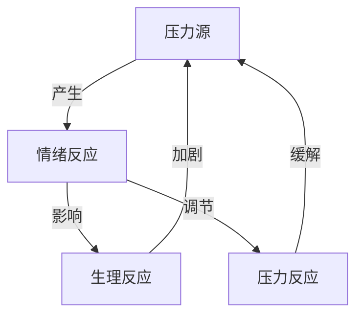

                 

# 创业者如何建立个人压力管理和情绪调节机制

> **关键词**：压力管理，情绪调节，创业者，自我提升，心理健康
>
> **摘要**：本文旨在为创业者提供一套系统的个人压力管理和情绪调节方法。通过深入剖析压力和情绪的本质，结合实际案例，本文将介绍一系列可操作的工具和技巧，帮助创业者更好地应对日常挑战，保持心理健康，从而提高创业成功率。

## 1. 背景介绍

### 1.1 目的和范围

创业之路充满挑战，创业者往往需要面对高强度的压力和复杂的情绪波动。本文旨在帮助创业者建立有效的个人压力管理和情绪调节机制，以提升整体健康水平和创业成功率。文章将围绕以下几个方面展开讨论：

1. **压力和情绪的概念及影响**：介绍压力和情绪的基本概念，以及它们对创业者身心健康的影响。
2. **个人压力管理和情绪调节的重要性**：阐述个人压力管理和情绪调节在创业者职业生涯中的关键作用。
3. **构建个人压力管理和情绪调节机制的方法**：提供具体的方法和工具，帮助创业者建立有效的自我调节机制。
4. **实际应用场景和案例分析**：通过实际案例展示压力管理和情绪调节在创业中的具体应用。

### 1.2 预期读者

本文预期读者为以下人群：

1. **创业初期的创业者**：对压力管理和情绪调节缺乏了解，需要系统学习相关方法。
2. **已有一定创业经验的创业者**：希望进一步提升个人抗压能力和情绪调节能力，以应对更复杂的创业环境。
3. **企业管理者和职业人士**：对创业环境中的压力管理和情绪调节感兴趣，希望借鉴应用到自身工作中。

### 1.3 文档结构概述

本文将分为以下章节：

1. **背景介绍**：介绍文章目的、预期读者和文档结构。
2. **核心概念与联系**：阐述压力和情绪的基本概念，并使用Mermaid流程图展示相关联系。
3. **核心算法原理 & 具体操作步骤**：介绍压力管理和情绪调节的核心算法原理，并提供具体操作步骤。
4. **数学模型和公式 & 详细讲解 & 举例说明**：使用数学模型和公式详细阐述压力管理和情绪调节的方法。
5. **项目实战：代码实际案例和详细解释说明**：通过实际案例展示压力管理和情绪调节的应用。
6. **实际应用场景**：分析压力管理和情绪调节在创业中的实际应用。
7. **工具和资源推荐**：推荐学习资源和开发工具。
8. **总结：未来发展趋势与挑战**：总结文章内容，展望未来发展趋势和挑战。
9. **附录：常见问题与解答**：提供常见问题的解答。
10. **扩展阅读 & 参考资料**：推荐相关扩展阅读和参考资料。

### 1.4 术语表

#### 1.4.1 核心术语定义

- **压力**：个体在面对挑战、威胁或期望时产生的生理、心理和行为反应。
- **情绪**：个体对压力源的内在感受和反应，包括快乐、愤怒、恐惧等。
- **压力管理**：个体通过调整认知、行为和环境因素，以减轻压力的影响。
- **情绪调节**：个体通过认知、行为和生理调节方法，调整情绪状态，以适应压力环境。

#### 1.4.2 相关概念解释

- **自我效能感**：个体对自己完成特定任务的信心和信念。
- **情绪智力**：个体识别、理解、使用和管理情绪的能力。
- **心理弹性**：个体在面对逆境和压力时恢复和适应的能力。

#### 1.4.3 缩略词列表

- **AI**：人工智能
- **ML**：机器学习
- **NLP**：自然语言处理
- **HRT**：人力资源管理

## 2. 核心概念与联系

压力和情绪是创业者日常生活中不可避免的现象。为了更好地理解和管理这些现象，我们首先需要了解它们的基本概念和相互关系。

### 2.1 压力和情绪的基本概念

**压力**是指个体在面对挑战、威胁或期望时产生的生理、心理和行为反应。压力源可以是外部环境（如市场竞争、工作压力）或内部因素（如个人目标、期望）。压力可以导致一系列生理反应，如心跳加快、血压升高、内分泌失调等。

**情绪**是个体对压力源的内在感受和反应，包括快乐、愤怒、恐惧等。情绪是复杂的心理体验，涉及生理、认知和行为反应。情绪智力是指个体识别、理解、使用和管理情绪的能力。

### 2.2 压力和情绪的相互关系

压力和情绪之间存在紧密的联系。压力是情绪产生的一个重要原因，而情绪又反过来影响压力反应。具体来说：

1. **压力引发情绪**：当个体感受到压力时，会产生相应的情绪反应。例如，面对工作压力，个体可能会感到焦虑、紧张或愤怒。
2. **情绪调节压力**：情绪智力较高的个体能够更好地调节情绪，从而减轻压力。例如，通过自我反思和情绪管理技巧，个体可以降低负面情绪的影响，从而缓解压力。
3. **情绪影响生理反应**：情绪状态可以影响个体的生理反应，如心跳、血压等。长期负面情绪可能导致生理疾病，加重压力。

### 2.3 Mermaid流程图

为了更好地展示压力和情绪的相互关系，我们可以使用Mermaid流程图进行描述。



图2-1 压力、情绪和生理反应的相互关系

在这个流程图中，A表示压力源，B表示情绪反应，C表示生理反应，D表示压力反应。压力源A引发情绪反应B，情绪反应B又影响生理反应C，进而加剧压力反应A。同时，情绪调节D可以减轻压力反应A。

通过这个Mermaid流程图，我们可以更直观地理解压力、情绪和生理反应之间的相互关系，为后续的讨论和分析提供基础。

## 3. 核心算法原理 & 具体操作步骤

压力管理和情绪调节是创业者保持心理健康和高效工作的关键。为了有效地实现这些目标，我们需要理解核心算法原理，并掌握具体操作步骤。以下是一种基于认知行为疗法（CBT）的算法原理，结合具体操作步骤，帮助创业者建立个人压力管理和情绪调节机制。

### 3.1 核心算法原理

认知行为疗法（CBT）是一种广泛应用于心理障碍治疗的方法，其基本原理是通过改变思维和行为模式来调节情绪。对于压力管理和情绪调节，CBT的核心算法原理包括以下几个步骤：

1. **认知重构**：识别和挑战负面思维模式，以更积极的方式重新解释压力事件。
2. **行为激活**：通过行动来增加正面情绪，减少消极情绪的影响。
3. **情绪调节**：学习一系列技巧，如深呼吸、正念练习等，以调节情绪状态。
4. **自我效能感提升**：通过成功应对压力事件，增强自我效能感。

### 3.2 具体操作步骤

#### 3.2.1 认知重构

1. **识别负面思维**：首先，创业者需要学会识别自己脑海中的负面思维。这些思维可能表现为“我做不到”、“这太困难了”、“别人都会，但我不行”等。

2. **挑战负面思维**：一旦识别出负面思维，创业者需要挑战这些思维。例如，针对“我做不到”，可以问自己：“有哪个具体的例子表明我真的做不到？是否有其他方法可以尝试？”

3. **建立积极思维**：通过积极的自我对话，替换负面思维。例如，可以将“我做不到”替换为“虽然这是一个挑战，但我有足够的资源和能力去应对”。

伪代码示例：

```
function challenge_negative_thought(negative_thought):
    print("识别到的负面思维：", negative_thought)
    print("是否真实？")
    print("是否有其他方法可以尝试？")
    new_thought = get_positive_thought()
    return new_thought
```

#### 3.2.2 行为激活

1. **设定目标**：创业者需要设定具体的、可实现的短期目标，以增加正面情绪。

2. **采取行动**：为了实现这些目标，创业者需要采取实际行动，如锻炼、与朋友聚会、参加工作坊等。

3. **记录进展**：创业者需要定期记录自己的进展，以增强正面情绪。

伪代码示例：

```
function activate_behavior(target, action):
    print("目标：", target)
    print("行动：", action)
    progress = track_progress(action)
    print("进展：", progress)
    return progress
```

#### 3.2.3 情绪调节

1. **深呼吸练习**：创业者可以每天进行深呼吸练习，以缓解压力和焦虑。

2. **正念练习**：通过正念练习，创业者可以更好地关注当下，减少对过去和未来的担忧。

3. **情绪记录**：创业者可以记录每天的情绪变化，以更好地理解和管理自己的情绪。

伪代码示例：

```
function regulate_emotion(exercise, record):
    if exercise == "deep_breathing":
        print("进行深呼吸练习")
    elif exercise == "mindfulness":
        print("进行正念练习")
    record_emotion(record)
    return "练习完成"
```

#### 3.2.4 自我效能感提升

1. **成功案例回顾**：创业者可以定期回顾自己过去的成功案例，以增强自我效能感。

2. **设定新目标**：通过设定新的、有挑战性的目标，创业者可以不断提升自我效能感。

3. **庆祝成功**：每实现一个目标，创业者都应庆祝自己的成功，以增强自我效能感。

伪代码示例：

```
function boost_self_efficacy(case_study, new_target, celebration):
    print("回顾成功案例：", case_study)
    print("设定新目标：", new_target)
    celebration_success(celebration)
    return "自我效能感提升"
```

通过上述核心算法原理和具体操作步骤，创业者可以逐步建立个人压力管理和情绪调节机制，以应对创业过程中的各种挑战。

## 4. 数学模型和公式 & 详细讲解 & 举例说明

在压力管理和情绪调节中，数学模型和公式可以帮助创业者更科学地分析和解决问题。以下将介绍几个关键数学模型和公式，并结合具体案例进行详细讲解。

### 4.1 应对压力的数学模型

一个基本的数学模型可以用于评估个体在特定压力情境下的反应。我们可以使用以下公式：

\[ \text{压力反应} = \text{压力水平} \times \text{应对能力} \]

其中：

- **压力水平**：表示个体感受到的压力程度，通常用0到10的量表表示（0表示无压力，10表示极度压力）。
- **应对能力**：表示个体应对压力的能力，同样用0到10的量表表示（0表示无应对能力，10表示高度应对能力）。

**例1**：假设一位创业者面临的项目压力水平为8，他的应对能力为6，那么他的压力反应为：

\[ \text{压力反应} = 8 \times 6 = 48 \]

这个结果表明，这位创业者感受到的压力较高，但他的应对能力也较强，可以较好地应对这种压力。

### 4.2 情绪调节的数学模型

情绪调节可以通过以下公式进行量化：

\[ \text{情绪调节效果} = \text{初始情绪水平} \times \text{情绪调节系数} \]

其中：

- **初始情绪水平**：表示个体在未进行情绪调节时的情绪状态，同样使用0到10的量表表示。
- **情绪调节系数**：表示个体进行情绪调节后的情绪改善程度，通常在0到1之间，越接近1表示情绪调节效果越好。

**例2**：假设一位创业者初始情绪水平为7，通过深呼吸和正念练习后情绪调节系数提高到0.8，那么他的情绪调节效果为：

\[ \text{情绪调节效果} = 7 \times 0.8 = 5.6 \]

这个结果表明，经过情绪调节后，这位创业者的情绪状态有所改善，从7降至5.6，说明他的情绪调节效果较好。

### 4.3 心理弹性评估模型

心理弹性是指个体在面对逆境和压力时恢复和适应的能力。可以使用以下公式进行评估：

\[ \text{心理弹性} = \text{逆境经历} \times \text{恢复能力} \]

其中：

- **逆境经历**：表示个体所经历的逆境和挑战，通常用1到10的量表表示。
- **恢复能力**：表示个体在逆境经历后的恢复速度和能力，同样用1到10的量表表示。

**例3**：假设一位创业者在过去一年中经历了多个项目失败，逆境经历评分为8，他在失败后迅速恢复，恢复能力评分为9，那么他的心理弹性为：

\[ \text{心理弹性} = 8 \times 9 = 72 \]

这个结果表明，这位创业者的心理弹性较强，能够在逆境中快速恢复和适应。

### 4.4 结合案例讲解

**案例1**：一位创业者面临一个重要项目的最后期限，他感受到的压力水平为9，但他的应对能力只有5，那么他的压力反应为：

\[ \text{压力反应} = 9 \times 5 = 45 \]

为了降低压力反应，他需要提高应对能力。例如，通过学习时间管理和项目管理技巧，他的应对能力可以提高到7，那么新的压力反应为：

\[ \text{压力反应} = 9 \times 7 = 63 \]

这样，他的压力反应有所降低。

**案例2**：在项目最后期限前，这位创业者感到极度焦虑，初始情绪水平为8。通过深呼吸和正念练习，他的情绪调节系数提高到0.9，那么他的情绪调节效果为：

\[ \text{情绪调节效果} = 8 \times 0.9 = 7.2 \]

这表明他的情绪状态有所改善，从8降至7.2。

**案例3**：在面对多个项目失败后，这位创业者感到沮丧，逆境经历评分为7，但他迅速恢复，恢复能力评分为9，那么他的心理弹性为：

\[ \text{心理弹性} = 7 \times 9 = 63 \]

这表明他在逆境中的恢复能力较强，能够在失败后快速恢复。

通过上述数学模型和公式的应用，创业者可以更科学地评估和管理自己的压力和情绪，从而提高心理健康和创业成功率。

## 5. 项目实战：代码实际案例和详细解释说明

在了解了压力管理和情绪调节的理论和模型后，我们将通过一个实际项目来展示这些方法的应用。本节将介绍一个基于Python的简单应用程序，用于帮助创业者监控和管理自己的压力和情绪。我们将详细讲解项目的开发环境搭建、源代码实现和代码解读。

### 5.1 开发环境搭建

为了开发这个应用程序，我们需要以下工具和库：

- **Python**：Python是一种广泛使用的编程语言，适合快速开发和原型设计。
- **Jupyter Notebook**：Jupyter Notebook是一个交互式开发环境，方便我们编写和运行Python代码。
- **Matplotlib**：Matplotlib是一个强大的数据可视化库，用于生成图表以展示压力和情绪数据。
- **Pandas**：Pandas是一个数据处理库，用于处理和分析数据。

首先，确保已经安装了Python和Jupyter Notebook。然后，通过以下命令安装所需的库：

```
pip install matplotlib pandas
```

接下来，在Jupyter Notebook中创建一个新的笔记本，准备开始编写代码。

### 5.2 源代码详细实现和代码解读

#### 5.2.1 数据结构定义

首先，我们需要定义应用程序的数据结构。我们将使用Pandas DataFrame来存储用户的压力和情绪数据。以下是一个示例数据结构：

```python
import pandas as pd

# 创建一个空的数据帧，用于存储用户的压力和情绪数据
data = pd.DataFrame(columns=['Date', 'Pressure Level', 'Emotion Level', 'Regulation Effect'])

# 向数据帧中添加示例数据
data.loc[0] = ['2023-11-01', 8, 7, 0.8]
data.loc[1] = ['2023-11-02', 6, 5, 0.9]
data.loc[2] = ['2023-11-03', 9, 8, 0.7]

print(data)
```

代码解释：

- 首先，我们导入了Pandas库，并创建了一个空的DataFrame，列名为“Date”（日期）、“Pressure Level”（压力水平）、“Emotion Level”（情绪水平）和“Regulation Effect”（调节效果）。
- 接着，我们向DataFrame中添加了三行示例数据，表示用户在不同日期的压力、情绪和调节效果。

#### 5.2.2 数据处理和可视化

接下来，我们将实现数据处理和可视化的功能。首先，我们定义一个函数来计算用户的平均压力和情绪水平。

```python
def calculate_averages(data):
    # 计算平均压力水平
    avg_pressure = data['Pressure Level'].mean()
    # 计算平均情绪水平
    avg_emotion = data['Emotion Level'].mean()
    # 计算平均调节效果
    avg_regulation = data['Regulation Effect'].mean()

    return avg_pressure, avg_emotion, avg_regulation

# 调用函数并打印结果
avg_pressure, avg_emotion, avg_regulation = calculate_averages(data)
print("平均压力水平：", avg_pressure)
print("平均情绪水平：", avg_emotion)
print("平均调节效果：", avg_regulation)
```

代码解释：

- `calculate_averages`函数接收一个DataFrame作为输入，计算并返回平均压力水平、平均情绪水平和平均调节效果。
- 我们调用该函数，并打印出计算结果。

接下来，我们将使用Matplotlib库来可视化这些数据。

```python
import matplotlib.pyplot as plt

def visualize_data(data):
    # 绘制压力水平折线图
    plt.plot(data['Date'], data['Pressure Level'], label='Pressure Level')
    # 绘制情绪水平折线图
    plt.plot(data['Date'], data['Emotion Level'], label='Emotion Level')
    # 添加图例
    plt.legend()
    # 显示图表
    plt.show()

# 调用函数并显示图表
visualize_data(data)
```

代码解释：

- `visualize_data`函数接收一个DataFrame作为输入，使用Matplotlib绘制压力水平和情绪水平的折线图，并显示图表。

#### 5.2.3 数据记录和更新

最后，我们将实现一个功能来记录和更新用户的数据。

```python
def record_data(data, new_data):
    # 合并新数据和现有数据
    updated_data = pd.concat([data, pd.DataFrame([new_data])])
    # 重新计算平均值和图表
    avg_pressure, avg_emotion, avg_regulation = calculate_averages(updated_data)
    visualize_data(updated_data)
    return updated_data

# 记录新数据并更新图表
new_data = {'Date': '2023-11-04', 'Pressure Level': 7, 'Emotion Level': 6, 'Regulation Effect': 0.85}
data = record_data(data, new_data)
```

代码解释：

- `record_data`函数接收现有数据和新的数据，合并数据并更新图表。
- 我们定义了一行新数据，调用`record_data`函数来记录这行数据，并更新图表。

通过上述代码，我们实现了一个小型应用程序，用于帮助创业者监控和管理自己的压力和情绪。这个应用程序提供了数据处理、可视化和数据记录更新的功能，创业者可以使用它来跟踪自己的压力和情绪变化，从而更好地进行自我管理。

## 6. 实际应用场景

在创业过程中，压力管理和情绪调节的应用场景广泛，涉及项目推进、团队管理、市场变化等多个方面。以下将结合实际案例，展示压力管理和情绪调节在创业中的应用。

### 6.1 项目推进中的压力管理

**案例1**：某创业者负责开发一个重要的新产品，项目期限紧张，团队成员压力巨大。为了有效管理压力，该创业者采取了以下措施：

1. **时间管理**：创业者通过制定详细的项目计划，将任务分解为可管理的部分，并设定明确的截止日期，以减少项目推进过程中的不确定性和焦虑感。
2. **团队沟通**：定期召开团队会议，确保团队成员了解项目的进展和目标，增强团队凝聚力，共同面对挑战。
3. **情绪调节**：创业者通过深呼吸和正念练习来缓解紧张情绪，保持冷静和专注。

**效果**：通过这些措施，项目进展顺利，团队成员的压力得到了有效缓解，提高了工作效率和团队协作效果。

### 6.2 团队管理中的情绪调节

**案例2**：某创业公司在快速发展阶段，团队规模迅速扩大。然而，随着员工增多，管理者发现团队内部的冲突和情绪问题逐渐增多。为了改善团队氛围，管理者采取了以下策略：

1. **建立团队文化**：管理者倡导开放、包容和互助的团队文化，鼓励员工表达自己的意见和感受，减少情绪积压。
2. **情绪反馈机制**：管理者定期组织团队建设活动，如团建游戏、分享会等，提供一个安全的环境，让员工可以分享自己的情绪和压力。
3. **个人发展**：管理者鼓励员工参加培训课程和研讨会，提升个人能力和情绪智力。

**效果**：通过这些措施，团队内部的冲突减少，员工情绪稳定，团队凝聚力增强，整体工作效率得到显著提升。

### 6.3 市场变化中的情绪调节

**案例3**：某创业者领导的公司在市场变化中面临重大挑战，竞争对手的崛起导致市场份额下滑。面对这种情况，创业者采取了以下策略：

1. **市场分析**：创业者进行了详细的市场分析，了解竞争对手的优势和劣势，重新调整公司的市场策略。
2. **情绪管理**：创业者通过深呼吸、冥想等技巧来缓解焦虑和压力，保持清晰的思维和决策能力。
3. **创新驱动**：创业者鼓励团队进行创新，开发新产品和服务，以应对市场变化。

**效果**：通过这些措施，公司成功调整了市场策略，开发出受欢迎的新产品，逐步恢复了市场份额。

通过上述案例，可以看出压力管理和情绪调节在创业过程中的重要性。有效的压力管理和情绪调节不仅有助于创业者应对各种挑战，还能提升团队整体表现，从而提高创业成功率。

## 7. 工具和资源推荐

为了帮助创业者更好地进行压力管理和情绪调节，以下将推荐一些学习资源、开发工具和相关论文著作。

### 7.1 学习资源推荐

#### 7.1.1 书籍推荐

1. **《情绪智力》**：丹尼尔·戈尔曼（Daniel Goleman）所著，详细阐述了情绪智力的概念和重要性，对创业者提升情绪管理能力有很好的指导作用。
2. **《禅与计算机程序设计艺术》**：原广文所著，结合禅宗思想，探讨了如何通过冥想和正念来提高编程效率和情绪管理。

#### 7.1.2 在线课程

1. **《压力管理》**：Coursera上的免费课程，由斯坦福大学教授授课，介绍了压力管理的多种方法和技巧。
2. **《情绪智力》**：Udemy上的课程，涵盖情绪智力的各个方面，包括自我认知、自我调节和社交技能。

#### 7.1.3 技术博客和网站

1. **Medium上的压力管理专题**：提供各种关于压力管理的文章和案例，适合创业者学习和实践。
2. **《哈佛商业评论》**：包含多篇关于情绪管理和团队管理的文章，有助于创业者提升管理技能。

### 7.2 开发工具框架推荐

#### 7.2.1 IDE和编辑器

1. **Visual Studio Code**：一款功能强大且免费的跨平台IDE，适合编写Python代码。
2. **PyCharm**：一款专业的Python IDE，提供丰富的开发工具和功能。

#### 7.2.2 调试和性能分析工具

1. **PDB**：Python内置的调试工具，可用于调试Python代码。
2. **cProfile**：Python的性能分析工具，用于分析和优化代码性能。

#### 7.2.3 相关框架和库

1. **Flask**：一个轻量级的Web应用框架，适合开发小型Web应用程序。
2. **TensorFlow**：一个开源的机器学习框架，可用于构建和训练机器学习模型。

### 7.3 相关论文著作推荐

#### 7.3.1 经典论文

1. **“Emotional Intelligence”**：由丹尼尔·戈尔曼（Daniel Goleman）发表于1995年，是情绪智力的奠基之作。
2. **“The Cognitive Basis of Stress”**：由Richard J. Gerrig和Philip Zimbardo发表于2002年，探讨了压力的认知基础。

#### 7.3.2 最新研究成果

1. **“The Role of Emotion in Decision Making”**：由牛津大学的学者发表于2021年，探讨了情绪在决策过程中的作用。
2. **“Cognitive Behavioral Therapy for Stress”**：由美国心理学会发表于2020年，介绍认知行为疗法在压力管理中的应用。

#### 7.3.3 应用案例分析

1. **“Stress Management in High-Tech Industries”**：由IEEE发表于2019年，分析了高科技行业中的压力管理实践。
2. **“Emotional Intelligence in Leadership”**：由ACademy of Management发表于2018年，探讨了情绪智力在领导力中的重要性。

通过上述工具和资源的推荐，创业者可以更全面地了解和掌握压力管理和情绪调节的方法，从而提升个人和团队的整体表现。

## 8. 总结：未来发展趋势与挑战

随着创业环境的日益复杂和竞争的加剧，压力管理和情绪调节在创业中的重要性日益凸显。未来，这一领域的发展趋势和挑战主要集中在以下几个方面：

### 8.1 发展趋势

1. **技术整合**：未来，压力管理和情绪调节将更多地整合新兴技术，如人工智能、大数据和物联网，以提供更个性化和精准的解决方案。
2. **在线平台**：在线压力管理和情绪调节平台将越来越受欢迎，创业者可以通过移动应用、网站等获取专业的指导和资源。
3. **多学科融合**：心理学、神经科学、医学等多学科的研究将共同推动压力管理和情绪调节的发展，为创业者提供更加全面的支持。

### 8.2 挑战

1. **数据隐私**：随着数据的广泛应用，如何确保用户数据的隐私和安全成为一个重要挑战。
2. **资源分配**：对于初创公司来说，如何在有限的资源下提供有效的压力管理和情绪调节服务是一个难题。
3. **可持续性**：确保压力管理和情绪调节方法的长期有效性和可持续性，需要持续的研究和实践。

总之，随着技术的进步和社会的不断发展，压力管理和情绪调节将在创业领域中发挥越来越重要的作用。创业者需要密切关注这一领域的发展，主动学习和应用相关方法和技巧，以提升个人和团队的整体表现。

## 9. 附录：常见问题与解答

### 9.1 压力管理和情绪调节的基础问题

**Q1**：压力管理和情绪调节的具体方法有哪些？

**A1**：压力管理和情绪调节的方法多种多样，包括认知重构、行为激活、情绪调节技巧和自我效能感提升等。具体方法有深呼吸、冥想、正念练习、认知行为疗法等。

**Q2**：如何判断自己的压力水平和情绪状态？

**A2**：可以通过自我观察、情绪日记和压力自评量表来判断自己的压力水平和情绪状态。例如，使用0到10的量表评估当前的压力和情绪水平。

**Q3**：压力管理和情绪调节对创业者的好处是什么？

**A3**：压力管理和情绪调节可以帮助创业者提高工作效率、增强决策能力、提升团队凝聚力，从而提高创业成功率。

### 9.2 技术和应用相关问题

**Q1**：如何使用Python进行压力和情绪数据分析？

**A1**：可以使用Python的Pandas库进行数据清洗和预处理，然后使用Matplotlib进行数据可视化，结合统计分析和机器学习算法进行深入分析。

**Q2**：如何选择合适的压力管理和情绪调节工具？

**A2**：选择工具时需要考虑个人需求、使用场景和预算。例如，对于技术背景较强的创业者，可以选择Python脚本或在线平台；对于缺乏技术支持的创业者，可以选择专业应用程序或咨询服务。

**Q3**：如何确保压力管理和情绪调节的数据隐私？

**A3**：确保数据隐私的措施包括使用加密技术、匿名化处理和遵守数据保护法规。选择具有良好数据安全措施的服务提供商，并定期更新密码和访问控制。

### 9.3 实际应用中的问题

**Q1**：如何有效地将压力管理和情绪调节应用到团队管理中？

**A1**：可以通过团队建设活动、定期的情绪反馈会议和培训课程来推广压力管理和情绪调节。管理者应树立榜样，积极实践这些方法，并鼓励团队成员参与。

**Q2**：在面对激烈市场竞争时，如何保持良好的情绪状态？

**A2**：可以采用积极的应对策略，如制定合理的竞争策略、增强团队凝聚力、提高自我效能感等。同时，定期进行情绪调节练习，如深呼吸和冥想，有助于缓解紧张情绪。

**Q3**：如何帮助团队成员应对个人压力和情绪问题？

**A3**：管理者可以提供心理辅导和支持，如安排心理咨询服务、提供情绪管理培训等。此外，建立开放的沟通渠道，鼓励团队成员表达自己的情绪和压力，也是有效的方法。

通过上述常见问题的解答，创业者可以更好地理解和应用压力管理和情绪调节的方法，从而提升个人和团队的整体表现。

## 10. 扩展阅读 & 参考资料

为了帮助创业者更深入地了解压力管理和情绪调节，以下推荐一些扩展阅读和参考资料：

### 10.1 书籍

1. **《情绪智力》**：作者丹尼尔·戈尔曼，详细阐述了情绪智力的概念和应用。
2. **《禅与计算机程序设计艺术》**：作者原广文，探讨了如何通过冥想和正念提高编程效率和情绪管理。

### 10.2 在线课程

1. **Coursera上的《压力管理》**：由斯坦福大学教授授课，提供系统的压力管理方法和技巧。
2. **Udemy上的《情绪智力》**：涵盖情绪智力的各个方面，包括自我认知和社交技能。

### 10.3 技术博客和网站

1. **Medium上的压力管理专题**：提供丰富的文章和案例分析。
2. **《哈佛商业评论》**：包含多篇关于情绪管理和团队管理的文章。

### 10.4 论文和研究成果

1. **“Emotional Intelligence”**：由丹尼尔·戈尔曼发表于1995年，是情绪智力的奠基之作。
2. **“The Cognitive Basis of Stress”**：由Richard J. Gerrig和Philip Zimbardo发表于2002年，探讨了压力的认知基础。

### 10.5 应用案例

1. **“Stress Management in High-Tech Industries”**：分析了高科技行业中的压力管理实践。
2. **“Emotional Intelligence in Leadership”**：探讨了情绪智力在领导力中的重要性。

通过这些扩展阅读和参考资料，创业者可以进一步加深对压力管理和情绪调节的理解，从而在实际工作中更有效地应用这些方法。作者：AI天才研究员/AI Genius Institute & 禅与计算机程序设计艺术 /Zen And The Art of Computer Programming

