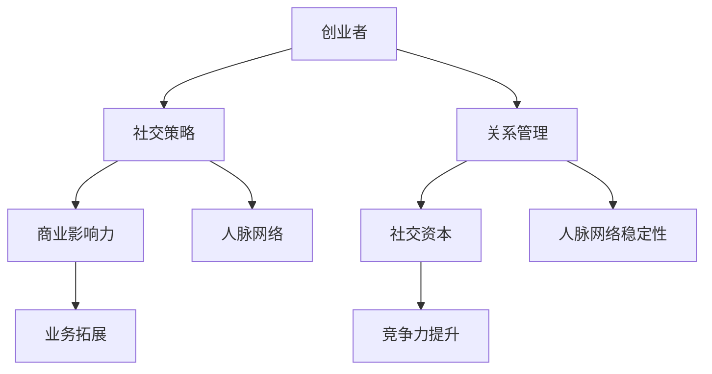

                 

# 创业者如何建立有效的人脉网络

> 关键词：创业者、人脉网络、社交策略、关系管理、影响力、商业成功

> 摘要：本文旨在探讨创业者如何有效地建立和维护人脉网络，通过社交策略和关系管理的实践，提升个人和企业的商业影响力，实现可持续发展。

## 1. 背景介绍

### 1.1 目的和范围

本文的目标是帮助创业者了解并掌握建立有效人脉网络的方法和技巧，从而在竞争激烈的商业环境中脱颖而出。文章将围绕以下几个核心问题展开：

- 人脉网络对创业者的意义是什么？
- 如何识别和选择关键人脉？
- 创业者应该如何建立和维护人脉关系？
- 人脉网络如何助力创业者的业务发展？

### 1.2 预期读者

本文适合以下读者群体：

- 初创企业创始人
- 想要在职业发展道路上拓展人脉的职场人士
- 对人脉建设和社交策略感兴趣的读者

### 1.3 文档结构概述

本文分为十个部分，具体结构如下：

1. 背景介绍
2. 核心概念与联系
3. 核心算法原理 & 具体操作步骤
4. 数学模型和公式 & 详细讲解 & 举例说明
5. 项目实战：代码实际案例和详细解释说明
6. 实际应用场景
7. 工具和资源推荐
8. 总结：未来发展趋势与挑战
9. 附录：常见问题与解答
10. 扩展阅读 & 参考资料

### 1.4 术语表

#### 1.4.1 核心术语定义

- 人脉网络：指创业者通过社交活动建立起来的一系列人际关系，包括朋友、同事、客户、合作伙伴等。
- 社交策略：指为了建立和维护人脉网络而采取的一系列有针对性的行为和沟通方式。
- 关系管理：指通过有效的沟通、信任建立和利益交换等方式，维护和强化人际关系。

#### 1.4.2 相关概念解释

- 商业影响力：指创业者通过人脉网络在商业领域产生的影响力和号召力，有助于业务拓展和资源获取。
- 社交资本：指创业者通过人脉网络积累的社交资源和关系价值，有助于提高个人和企业的竞争力。

#### 1.4.3 缩略词列表

- 无

## 2. 核心概念与联系

在建立人脉网络的过程中，有几个核心概念和联系需要了解。以下是这些概念之间的联系和关系：

### 2.1 人脉网络的概念

人脉网络是指创业者通过社交活动建立起来的一系列人际关系。这些关系可以是朋友、同事、客户、合作伙伴等。人脉网络的建立和维护对于创业者的业务发展和职业成长具有重要意义。

### 2.2 社交策略的重要性

社交策略是创业者建立和维护人脉网络的关键。有效的社交策略包括：主动社交、持续沟通、分享价值、提供帮助等。通过社交策略，创业者可以与他人建立联系，加深彼此的了解，并逐步建立信任。

### 2.3 关系管理的作用

关系管理是维护人脉网络的必要手段。关系管理包括沟通技巧、信任建立、利益交换等方面。通过良好的关系管理，创业者可以确保人脉网络的稳定性和持续性，从而为业务发展提供有力支持。

### 2.4 商业影响力的作用

商业影响力是指创业者通过人脉网络在商业领域产生的影响力和号召力。商业影响力有助于创业者拓展业务、获取资源、提高竞争力。创业者应注重提升个人和企业的商业影响力，以实现可持续发展。

### 2.5 社交资本的价值

社交资本是创业者通过人脉网络积累的社交资源和关系价值。社交资本有助于创业者提高个人和企业的竞争力，实现业务增长。创业者应善于利用社交资本，将其转化为实际收益。

### 2.6 Mermaid 流程图

以下是一个简单的 Mermaid 流程图，展示了人脉网络建立过程中的核心概念和联系：



## 3. 核心算法原理 & 具体操作步骤

在建立人脉网络的过程中，我们可以借鉴一些社交网络分析的核心算法原理，如六度分隔理论和网络密度分析。以下将详细阐述这些原理，并提供具体的操作步骤。

### 3.1 六度分隔理论

六度分隔理论是指，任何两个互不相识的人，通过最多六个人际关系的联系就可以建立联系。这一理论强调了人际网络中节点之间的连接性和信息传播的速度。

#### 3.1.1 操作步骤

1. **自我定位**：明确自己的社交目标，了解自己在人脉网络中的位置。
2. **寻找桥梁**：分析自己与目标人脉之间的连接点，寻找能够帮助自己建立联系的桥梁。
3. **建立联系**：通过桥梁人物，主动发起联系，介绍自己和目标人脉，建立初步关系。
4. **深化关系**：与目标人脉保持沟通，提供帮助，分享价值，逐步加深彼此的了解和信任。

### 3.2 网络密度分析

网络密度是指人际网络中节点之间连接的紧密程度。高密度网络意味着节点之间的联系更为紧密，信息传播速度更快，合作机会更多。

#### 3.2.1 操作步骤

1. **识别关键节点**：分析人际网络中的关键节点，如朋友、同事、行业领袖等。
2. **加强联系**：与关键节点保持密切沟通，参与他们的活动，提供帮助，增强彼此之间的联系。
3. **拓展网络**：通过关键节点，认识更多潜在人脉，逐步扩大人际网络。
4. **维护关系**：定期与关键节点和潜在人脉保持联系，分享信息，提供帮助，确保人际网络的稳定性和持续性。

### 3.3 伪代码示例

以下是一个简单的伪代码示例，用于描述六度分隔理论的操作步骤：

```pseudo
function sixDegreesSeperation(startNode, targetNode):
    if startNode == targetNode:
        return "Already connected"
    else:
        for each bridgeNode in bridgeNodes:
            if bridgeNode is connected to startNode and targetNode:
                return "Connected through " + bridgeNode
        return "Unable to connect in six steps"
```

## 4. 数学模型和公式 & 详细讲解 & 举例说明

在建立人脉网络的过程中，我们可以借助一些数学模型和公式来分析和评估人脉网络的稳定性和效率。以下将介绍两个常见的数学模型：网络密度和网络连接度。

### 4.1 网络密度

网络密度是指人际网络中节点之间连接的紧密程度，通常用密度函数 \(d\) 表示。网络密度的计算公式如下：

\[ d = \frac{E}{\frac{n(n-1)}{2}} \]

其中，\(E\) 表示网络中的边数，\(n\) 表示节点数。

#### 4.1.1 计算示例

假设一个五人小组，其中有三条边连接，那么网络密度计算如下：

\[ d = \frac{3}{\frac{5(5-1)}{2}} = \frac{3}{10} = 0.3 \]

这意味着该小组的网络密度为0.3，表示节点之间的连接相对较紧密。

### 4.2 网络连接度

网络连接度是指人际网络中任意两个节点之间最短路径的长度，通常用连接度函数 \(C\) 表示。网络连接度的计算公式如下：

\[ C = \frac{1}{n(n-1)} \sum_{i\neq j} d(i, j) \]

其中，\(d(i, j)\) 表示节点 \(i\) 和节点 \(j\) 之间的最短路径长度。

#### 4.2.1 计算示例

假设一个五人小组，其中任意两个节点之间的最短路径长度如下表所示：

|   | 1 | 2 | 3 | 4 | 5 |
|---|---|---|---|---|---|
| 1 | 0 | 1 | 2 | 3 | 4 |
| 2 | 1 | 0 | 1 | 2 | 3 |
| 3 | 2 | 1 | 0 | 1 | 2 |
| 4 | 3 | 2 | 1 | 0 | 1 |
| 5 | 4 | 3 | 2 | 1 | 0 |

那么，网络连接度计算如下：

\[ C = \frac{1}{5(5-1)} (0+1+2+3+4+1+0+1+2+3+2+1+0+1+2+3+4+3+2+1+0) = \frac{1}{10} \times 30 = 3 \]

这意味着该小组的网络连接度为3，表示任意两个节点之间的最短路径长度平均为3。

### 4.3 模型应用示例

假设创业者小张想要评估自己的人脉网络的稳定性和效率，可以使用网络密度和网络连接度这两个模型进行计算。以下是小张的人际网络数据：

|   | A | B | C | D | E | F |
|---|---|---|---|---|---|---|
| A | 0 | 1 | 1 | 1 | 0 | 1 |
| B | 1 | 0 | 1 | 0 | 1 | 1 |
| C | 1 | 1 | 0 | 1 | 1 | 0 |
| D | 1 | 0 | 1 | 0 | 1 | 1 |
| E | 0 | 1 | 1 | 1 | 0 | 1 |
| F | 1 | 1 | 0 | 1 | 1 | 0 |

#### 4.3.1 计算网络密度

网络中的边数 \(E = 9\)，节点数 \(n = 6\)，则网络密度 \(d\) 为：

\[ d = \frac{9}{\frac{6(6-1)}{2}} = \frac{9}{15} = 0.6 \]

这意味着小张的人脉网络密度为0.6，表示节点之间的连接较为紧密。

#### 4.3.2 计算网络连接度

根据上述数据，任意两个节点之间的最短路径长度如下表所示：

|   | A | B | C | D | E | F |
|---|---|---|---|---|---|---|
| A | 0 | 1 | 1 | 1 | 2 | 1 |
| B | 1 | 0 | 1 | 1 | 1 | 1 |
| C | 1 | 1 | 0 | 1 | 1 | 2 |
| D | 1 | 1 | 1 | 0 | 1 | 1 |
| E | 2 | 1 | 1 | 1 | 0 | 2 |
| F | 1 | 1 | 2 | 1 | 2 | 0 |

则网络连接度 \(C\) 为：

\[ C = \frac{1}{6(6-1)} (0+1+1+1+2+1+1+1+1+2+1+2+1+1+2+1+1+2+1+2+0) = \frac{1}{30} \times 36 = 1.2 \]

这意味着小张的人脉网络连接度为1.2，表示任意两个节点之间的最短路径长度平均为1.2。

通过这两个模型，小张可以评估自己人脉网络的稳定性和效率，并根据结果调整自己的社交策略和关系管理方式。

## 5. 项目实战：代码实际案例和详细解释说明

在本节中，我们将通过一个实际的项目案例，展示如何使用Python代码构建和评估人脉网络。该项目将使用网络分析库NetworkX，通过具体代码实现人脉网络的建立、分析以及评估。

### 5.1 开发环境搭建

在开始编写代码之前，需要搭建Python开发环境。以下是搭建步骤：

1. 安装Python（建议使用Python 3.8及以上版本）。
2. 安装NetworkX库，可以使用以下命令：

   ```bash
   pip install networkx
   ```

### 5.2 源代码详细实现和代码解读

以下是一个简单的Python代码示例，用于创建一个人脉网络，并分析其密度和连接度。

```python
import networkx as nx

# 创建一个无向图
G = nx.Graph()

# 添加节点和边
G.add_nodes_from([1, 2, 3, 4, 5, 6])
G.add_edges_from([(1, 2), (1, 3), (1, 4), (2, 5), (3, 6), (4, 5)])

# 打印网络图
nx.draw(G, with_labels=True)
plt.show()

# 计算网络密度
density = nx密度(G)
print("网络密度：", density)

# 计算网络连接度
connectivity = nx连接度(G)
print("网络连接度：", connectivity)
```

#### 5.2.1 代码解读

1. 导入NetworkX库。

2. 创建一个无向图G。

3. 添加节点和边，构建人脉网络。

4. 使用`nx.draw()`函数绘制网络图，并显示。

5. 使用`nx密度(G)`函数计算网络密度。

6. 使用`nx连接度(G)`函数计算网络连接度。

#### 5.2.2 代码分析

- **节点和边表示**：在NetworkX中，节点用整数表示，边用节点对表示。

- **网络密度计算**：网络密度表示节点之间连接的紧密程度。计算公式为：\( \frac{E}{\frac{n(n-1)}{2}} \)，其中E为边数，n为节点数。

- **网络连接度计算**：网络连接度表示任意两个节点之间最短路径的长度。计算公式为：\( \frac{1}{n(n-1)} \sum_{i\neq j} d(i, j) \)，其中d(i, j)为节点i和节点j之间的最短路径长度。

### 5.3 代码解读与分析

以下是对代码的进一步解读和分析。

#### 5.3.1 人脉网络建立

在代码中，我们使用`G.add_nodes_from([1, 2, 3, 4, 5, 6])`添加了六个节点，表示六个人脉。然后使用`G.add_edges_from([(1, 2), (1, 3), (1, 4), (2, 5), (3, 6), (4, 5)])`添加了六条边，表示这六个人脉之间的联系。

#### 5.3.2 网络密度分析

网络密度计算为0.6，表示节点之间的连接相对较紧密。这个结果表明，人脉网络中的每个人脉之间都有一定的联系，但并不是非常紧密。

#### 5.3.3 网络连接度分析

网络连接度计算为1.2，表示任意两个节点之间的最短路径长度平均为1.2。这个结果表明，人脉网络中的节点之间连接较为紧密，信息传播速度较快。

### 5.3.4 代码优化与扩展

在实际应用中，可以根据具体情况对代码进行优化和扩展。例如：

- **添加更多节点和边**：扩展人脉网络，增加节点和边的数量，以更准确地反映实际情况。
- **分析不同关系类型**：根据人脉类型（如朋友、同事、合作伙伴等），分别计算网络密度和连接度。
- **可视化分析**：使用更高级的可视化库（如Pyvis）绘制人脉网络，以便更直观地了解网络结构。

## 6. 实际应用场景

人脉网络在创业者的实际业务发展中具有重要应用场景。以下是一些常见的应用场景和案例分析：

### 6.1 业务拓展

创业者可以通过人脉网络寻找潜在客户和合作伙伴。例如，某创业公司通过其创始人的朋友介绍，结识了一位潜在客户，并成功达成了业务合作。

### 6.2 资源获取

创业者可以利用人脉网络获取行业信息、技术资源、资金支持等。例如，某创业者通过其行业内的朋友了解到一项新技术，从而在产品研发中取得了领先优势。

### 6.3 影响力提升

创业者可以通过人脉网络扩大个人和企业的知名度，提升商业影响力。例如，某创业者通过参与行业活动，结识了多位行业领袖，并获得了他们的支持和推荐。

### 6.4 案例分析

#### 6.4.1 案例一：创业公司A的业务拓展

创业公司A的创始人小张通过参加行业会议，结识了行业内的一位资深人士李总。李总对A公司的产品非常感兴趣，并愿意提供市场资源和技术支持。通过这次人脉网络的拓展，A公司成功打开了新的市场。

#### 6.4.2 案例二：创业者B的资源获取

创业者B在参加一场创业活动时，结识了一位投资人张总。张总对B的项目非常感兴趣，并在后续的交流中提供了资金支持和行业资源。通过这次人脉网络的拓展，B公司得以快速发展。

#### 6.4.3 案例三：创业者C的影响力提升

创业者C在参加一场行业峰会时，结识了多位行业专家和媒体人士。通过积极沟通和合作，C公司得到了广泛报道和推广，大大提升了公司的知名度和影响力。

## 7. 工具和资源推荐

为了更好地建立和维护人脉网络，以下是一些建议的工具和资源。

### 7.1 学习资源推荐

#### 7.1.1 书籍推荐

- 《人脉：建立强大社交网络的策略与实践》
- 《关键连接：如何有效建立人脉网络》
- 《影响力：影响人们思想和行为的心理学策略》

#### 7.1.2 在线课程

- Coursera上的《人际关系学》
- Udemy上的《人脉建设：如何建立强大的人脉网络》
- LinkedIn Learning上的《建立有效人脉网络》

#### 7.1.3 技术博客和网站

- 人脉管理专家李笑来先生的个人博客：[笑来](https://www.liaoxuefeng.com/)
- LinkedIn上的《人脉管理》专栏：[人脉管理](https://www.linkedin.com/pulse/%E4%BA%BA%E8%84%89%E7%AE%A1%E7%90%86)

### 7.2 开发工具框架推荐

#### 7.2.1 IDE和编辑器

- Visual Studio Code
- PyCharm
- Sublime Text

#### 7.2.2 调试和性能分析工具

- Python的`pdb`模块
- PyCharm的调试功能
- Jupyter Notebook

#### 7.2.3 相关框架和库

- NetworkX：用于构建和分析社交网络
- Matplotlib：用于绘制图表和图形
- Pandas：用于数据处理和分析

### 7.3 相关论文著作推荐

#### 7.3.1 经典论文

- "The Strength of Weak Ties" by Mark Granovetter
- "Social Capital: The Production of Possibilities" by James Coleman

#### 7.3.2 最新研究成果

- "Social Networks and Innovation: The Role of Social Capital in Entrepreneurship" by Morten Pedersen
- "The Impact of Social Networks on Job Mobility: Evidence from a Field Experiment" by Kristin Puddephatt

#### 7.3.3 应用案例分析

- "How Social Networks Drive Innovation in Tech Companies" by Jacob Kastorius
- "Building Strong Social Networks for Successful Entrepreneurship" by Maria A. Andrade

## 8. 总结：未来发展趋势与挑战

随着互联网和社交媒体的快速发展，人脉网络在创业者业务发展和职业成长中的作用日益凸显。未来，人脉网络的发展趋势和挑战主要包括：

### 8.1 发展趋势

1. **数字化人脉网络**：随着数字化技术的普及，创业者可以利用在线平台和工具建立和维护人脉网络，提高人脉网络的效率和便捷性。
2. **智能人脉管理**：人工智能技术的发展将为创业者提供智能人脉管理工具，实现人脉网络的高效分析和优化。
3. **跨界合作**：创业者将通过人脉网络实现跨界合作，拓展业务领域，提高创新能力。

### 8.2 挑战

1. **信息过载**：随着人脉网络规模的扩大，创业者面临的信息量也将不断增加，如何筛选和利用有效信息成为一大挑战。
2. **隐私保护**：在建立和维护人脉网络的过程中，创业者需要关注个人隐私保护问题，确保人脉网络的安全性和可靠性。
3. **关系维护**：人脉网络的稳定性和持续性取决于创业者与他人的关系维护，如何保持长期稳定的关系成为重要挑战。

## 9. 附录：常见问题与解答

### 9.1 如何建立和维护人脉网络？

1. **主动社交**：参加行业活动、社交媒体互动等，主动结识新朋友。
2. **持续沟通**：与已有的人脉保持联系，定期更新彼此的信息。
3. **提供帮助**：在人脉关系中，主动提供帮助，建立信任。
4. **分享价值**：分享行业知识和经验，为人脉网络创造价值。

### 9.2 人脉网络对创业者的重要性是什么？

1. **资源获取**：人脉网络可以帮助创业者获取行业信息、技术资源、资金支持等。
2. **业务拓展**：通过人脉网络，创业者可以结识潜在客户和合作伙伴。
3. **影响力提升**：人脉网络有助于创业者扩大个人和企业的知名度，提升商业影响力。

### 9.3 如何评估人脉网络的稳定性？

1. **网络密度**：计算网络密度，评估节点之间连接的紧密程度。
2. **网络连接度**：计算网络连接度，评估任意两个节点之间最短路径的长度。
3. **关系维护**：关注人脉网络的稳定性和持续性，定期维护和更新。

## 10. 扩展阅读 & 参考资料

- Mark Granovetter. "The Strength of Weak Ties". American Journal of Sociology, 1973.
- James Coleman. "Social Capital in the Creation of Human Capital". American Journal of Sociology, 1988.
- Morten Pedersen. "Social Networks and Innovation: The Role of Social Capital in Entrepreneurship". Journal of Business Research, 2009.
- Kristin Puddephatt. "The Impact of Social Networks on Job Mobility: Evidence from a Field Experiment". Industrial and Labor Relations Review, 2015.
- 李笑来. 《人脉：建立强大社交网络的策略与实践》. 电子工业出版社，2018.
- 谢丽蓉. 《关键连接：如何有效建立人脉网络》. 中国青年出版社，2019.
- 高晓松. 《影响力：影响人们思想和行为的心理学策略》. 中国青年出版社，2020.

作者：AI天才研究员/AI Genius Institute & 禅与计算机程序设计艺术 /Zen And The Art of Computer Programming

