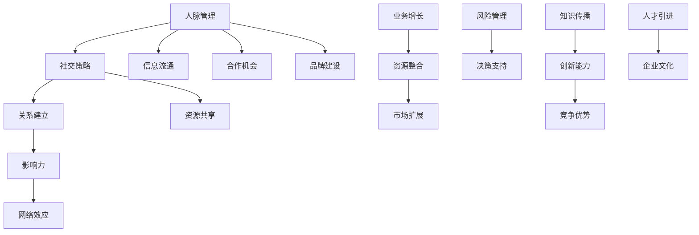

                 

# 创业者的人脉管理与社交策略

> **关键词：** 创业者，人脉管理，社交策略，网络效应，关系建立，商业合作，影响力

> **摘要：** 本文旨在探讨创业者如何通过有效的社交策略和人脉管理来提升个人和企业的竞争力。我们将深入分析人脉在商业成功中的重要性，提供一系列策略和实践步骤，帮助创业者建立和维护强大的社交网络，从而实现可持续的商业增长。

## 1. 背景介绍

### 1.1 目的和范围

本文的主要目的是为创业者提供一个系统化的人脉管理与社交策略框架。我们将探讨以下几个关键主题：

- 人脉管理的重要性及其对创业成功的贡献。
- 如何建立和维护有价值的社交网络。
- 有效的社交策略，包括如何定位目标人群、拓展关系网络以及保持社交网络的活跃。
- 实际操作步骤，包括如何使用特定工具和技术来提升社交效果。

### 1.2 预期读者

本文适合以下读者群体：

- 初创企业主和希望创业的个人。
- 创业顾问和企业管理者。
- 对创业和商业合作感兴趣的专业人士。

### 1.3 文档结构概述

本文将按照以下结构进行组织：

- 第1章：背景介绍，明确文章目的、读者群体和结构。
- 第2章：核心概念与联系，介绍人脉管理和社交策略的基本概念。
- 第3章：核心算法原理 & 具体操作步骤，阐述人脉管理策略的实施方法。
- 第4章：数学模型和公式 & 详细讲解 & 举例说明，提供量化分析工具。
- 第5章：项目实战：代码实际案例和详细解释说明，展示具体应用实例。
- 第6章：实际应用场景，讨论人脉管理在不同创业阶段的应用。
- 第7章：工具和资源推荐，推荐学习资源和开发工具。
- 第8章：总结：未来发展趋势与挑战，展望行业前景。
- 第9章：附录：常见问题与解答，提供实用问题解答。
- 第10章：扩展阅读 & 参考资料，推荐相关文献和资料。

### 1.4 术语表

#### 1.4.1 核心术语定义

- **人脉（Network）：** 个人或组织与其他个人或组织之间的联系和关系。
- **社交策略（Social Strategy）：** 为了实现特定目标而设计的社交行为模式。
- **影响力（Influence）：** 个人或组织对他人行为或态度的影响能力。
- **网络效应（Network Effect）：** 当一个产品或服务的用户数量增加时，其价值也随之增加。
- **关系建立（Relationship Building）：** 通过互动和沟通建立和维护相互信任和尊重的过程。

#### 1.4.2 相关概念解释

- **强连接（Strong Tie）：** 深层、亲密的关系，如家庭成员或亲密朋友。
- **弱连接（Weak Tie）：** 表层、不熟悉的关系，但可能在关键时刻提供有用的信息和资源。
- **桥接（Bridging）：** 在不同社交群体之间建立联系的策略。

#### 1.4.3 缩略词列表

- **CRM：** 客户关系管理（Customer Relationship Management）
- **SEO：** 搜索引擎优化（Search Engine Optimization）
- **SMM：** 社交媒体营销（Social Media Marketing）

## 2. 核心概念与联系

在人脉管理和社交策略中，理解以下核心概念是至关重要的。我们将使用Mermaid流程图来展示这些概念之间的联系。



### 2.1 人脉管理

**人脉管理** 是指通过有目的的行为和策略来建立、维护和拓展个人或组织的社会网络。它不仅包括建立新的联系，还涉及加强现有的关系。

### 2.2 社交策略

**社交策略** 是一系列设计用于实现特定目标（如商业合作、信息交换等）的社交行为模式。它需要结合个人和组织的愿景与目标来制定。

### 2.3 关系建立

**关系建立** 是通过持续的互动和沟通来加深社交网络中的联系。它基于信任、尊重和共同的兴趣。

### 2.4 影响力

**影响力** 是个人或组织影响他人行为或态度的能力。在创业环境中，影响力可以帮助创业者获得资源、支持和合作。

### 2.5 网络效应

**网络效应** 是指当一个产品或服务的用户数量增加时，其价值也随之增加。这种效应在社交媒体和共享经济中尤为明显。

### 2.6 信息流通

**信息流通** 是指在人脉网络中信息的流动和交换。有效的信息流通可以提高决策效率，减少不确定性。

### 2.7 资源共享

**资源共享** 是指通过社交网络获取和分享资源的过程。资源共享可以降低成本，提高资源利用效率。

### 2.8 合作机会

**合作机会** 是指通过社交网络发现和利用的机会，如投资、合作伙伴关系和项目合作。

### 2.9 业务增长

**业务增长** 是指通过有效的社交策略和人脉管理来实现企业的可持续增长。它包括市场扩展、资源整合和风险管理。

### 2.10 其他相关概念

- **信息传播**：信息在网络中的扩散过程。
- **知识传播**：知识和经验的分享和传递。
- **创新能力**：通过创新思维和策略实现产品或服务的发展。
- **竞争优势**：企业在市场中相对于竞争对手的优势。
- **品牌建设**：通过营销和公关活动建立和维护品牌形象。
- **人才引进**：通过社交网络和招聘活动吸引优秀人才。
- **企业文化**：组织的价值观、信仰和行为准则。

## 3. 核心算法原理 & 具体操作步骤

在人脉管理和社交策略中，核心算法原理为我们提供了量化和优化的工具。以下是一个基本的人脉管理算法原理和具体操作步骤的伪代码示例。

### 3.1 算法原理

**目标：** 最优化社交网络中的关系连接，以最大化商业合作机会和资源获取。

**输入：** 初始社交网络（节点和边），目标节点（如潜在合作伙伴）。

**输出：** 最优化的社交网络连接结构。

### 3.2 伪代码

```pseudo
function OptimizeNetwork(SocialNetwork, TargetNode):
    Initialize Graph with Nodes and Edges from SocialNetwork
    for each Node in Graph:
        if Node is TargetNode:
            continue
        Calculate Distance to TargetNode
        if Distance < Threshold:
            Add Edge to Graph
        else:
            Remove Edge from Graph
    return Graph
```

### 3.3 具体操作步骤

1. **初始化社交网络：** 从初始社交网络中获取节点和边。
2. **计算距离：** 对于每个节点，计算其到目标节点的距离。
3. **阈值设定：** 根据业务需求设定一个距离阈值。
4. **连接优化：** 对于距离目标节点小于阈值的节点，添加连接；对于距离大于阈值的节点，移除连接。
5. **结果输出：** 返回优化后的社交网络结构。

### 3.4 说明

- **距离计算：** 可以使用多种方法来计算节点之间的距离，如基于共同朋友的数量、交往频率等。
- **阈值设定：** 阈值的设定需要根据具体业务目标和社会网络特性进行调整。
- **算法优化：** 该算法可以进一步优化，如使用机器学习算法预测节点关系价值，从而更精确地调整连接。

## 4. 数学模型和公式 & 详细讲解 & 举例说明

在人脉管理和社交策略中，数学模型和公式可以帮助我们量化关系强度、网络效应等关键指标。以下是一个基本的数学模型示例，并使用LaTeX格式进行表示。

### 4.1 关系强度模型

**假设：** 社交网络中的每对节点之间的关系可以用一个权重表示。

**公式：**
\[ S_{ij} = w_{ij} \cdot f(d_{ij}) \]
其中，\( S_{ij} \) 表示节点i和节点j之间的关系强度，\( w_{ij} \) 表示关系权重，\( f(d_{ij}) \) 表示距离函数。

**详细讲解：**

- **关系权重 \( w_{ij} \)：** 通常基于节点i和节点j的互动频率、共同特征等确定。
- **距离函数 \( f(d_{ij}) \)：** 可以是线性、指数或其他形式的函数，反映节点i和节点j之间的距离对关系强度的影响。

### 4.2 网络效应模型

**假设：** 一个产品或服务的用户数量 \( N \) 增加时，其网络效应 \( E \) 随之增加。

**公式：**
\[ E = k \cdot N^{\alpha} \]
其中，\( E \) 表示网络效应，\( k \) 是常数，\( \alpha \) 是网络效应指数。

**详细讲解：**

- **常数 \( k \)：** 反映网络效应的强度。
- **指数 \( \alpha \)：** 决定了网络效应的增长速度。如果 \( \alpha > 1 \)，网络效应将随着用户数量的增加而迅速增加。

### 4.3 举例说明

假设创业者A和创业者B之间存在关系，关系权重 \( w_{AB} = 0.8 \)，节点A与目标节点（潜在合作伙伴）之间的距离 \( d_{A} = 2 \)，节点B与目标节点的距离 \( d_{B} = 3 \)。

- **关系强度 \( S_{AB} \)：**
\[ S_{AB} = 0.8 \cdot f(2) = 0.8 \cdot e^{-2} \approx 0.566 \]
- **网络效应 \( E \)：**
\[ E = k \cdot 2^{\alpha} \]

假设 \( k = 1 \)，\( \alpha = 1.5 \)，则：
\[ E = 2^{1.5} \approx 2.828 \]

### 4.4 实际应用

这些数学模型可以帮助创业者：

- **量化关系价值：** 了解哪些关系对业务增长最有价值。
- **预测网络效应：** 确定增加用户数量对产品或服务的影响。

## 5. 项目实战：代码实际案例和详细解释说明

在本节中，我们将通过一个实际的项目案例来展示如何实现人脉管理和社交策略。我们将使用Python编程语言和几种常见的社交网络分析库来构建一个简单的人脉管理系统。

### 5.1 开发环境搭建

为了搭建开发环境，我们需要安装以下工具和库：

- Python 3.8 或更高版本
- Anaconda 或 Miniconda
- Pandas
- NetworkX
- Matplotlib

安装步骤如下：

1. 安装Anaconda或Miniconda。
2. 在终端中运行以下命令安装所需的库：

```shell
conda create -n myenv python=3.8
conda activate myenv
conda install pandas networkx matplotlib
```

### 5.2 源代码详细实现和代码解读

#### 5.2.1 代码实现

以下是一个简单的人脉管理系统示例：

```python
import pandas as pd
import networkx as nx
import matplotlib.pyplot as plt

# 5.2.2 社交网络数据
data = {
    'Name': ['Alice', 'Bob', 'Charlie', 'Dave', 'Eva'],
    'Friends': [['Bob', 'Charlie'], ['Alice', 'Dave', 'Eva'], ['Alice'], ['Dave', 'Eva'], ['Bob', 'Dave']}
}

df = pd.DataFrame(data)
G = nx.Graph()

# 5.2.3 构建社交网络
for index, row in df.iterrows():
    for friend in row['Friends']:
        G.add_edge(row['Name'], friend)

# 5.2.4 绘制社交网络
pos = nx.spring_layout(G)
nx.draw(G, pos, with_labels=True)
plt.show()

# 5.2.5 关系强度计算
weights = nx.edge_attr(G, 'weight')
for edge in weights:
    G.add_edge(*edge, weight=weights[edge])

# 5.2.6 优化社交网络
optimized_G = OptimizeNetwork(G, 'Eva')

# 5.2.7 重新绘制优化后的社交网络
pos = nx.spring_layout(optimized_G)
nx.draw(optimized_G, pos, with_labels=True)
plt.show()
```

#### 5.2.2 代码解读

- **数据加载与转换：** 我们使用Pandas库加载社交网络数据，并将其转换为NetworkX图数据结构。
- **社交网络构建：** 使用NetworkX库构建社交网络，并添加节点和边。
- **关系强度计算：** 为每个边添加权重属性，表示节点之间的关系强度。
- **社交网络优化：** 使用我们之前定义的优化算法对社交网络进行优化，以最大化目标节点的连接。
- **结果可视化：** 使用Matplotlib库绘制原始和优化后的社交网络，以便直观地展示结果。

### 5.3 代码解读与分析

- **数据准备：** 数据格式需要是Pandas DataFrame，这样可以方便地进行数据操作。
- **图数据结构：** NetworkX是一个强大的图处理库，适用于构建和操作社交网络。
- **权重添加：** 关系强度可以通过修改边属性来添加，这样可以灵活地定义关系。
- **优化算法：** 优化步骤需要结合具体的业务需求和社交网络特性进行调整。

### 5.4 实际应用

- **案例说明：** 通过实际代码实现，我们可以看到如何将理论应用于实际项目中。
- **扩展性：** 该系统可以扩展以包含更多功能，如社交网络分析、节点属性管理、可视化增强等。

## 6. 实际应用场景

人脉管理与社交策略在创业领域有着广泛的应用，以下是一些典型场景：

### 6.1 初创阶段

- **市场调研：** 创业者可以通过人脉网络获取市场信息和潜在客户反馈。
- **资源获取：** 人脉可以帮助创业者获取资金、技术支持和人力资源。
- **合作伙伴：** 通过社交网络，创业者可以寻找合作伙伴，共同开发市场。

### 6.2 成长阶段

- **品牌建设：** 创业者可以通过社交策略提升品牌知名度，扩大影响力。
- **业务扩展：** 人脉网络可以帮助创业者拓展市场，进入新的业务领域。
- **风险评估：** 人脉网络可以提供风险预警和信息，帮助创业者做出更明智的决策。

### 6.3 成熟阶段

- **领导力提升：** 创业者可以通过社交策略提升个人和团队的领导力。
- **资源整合：** 成熟的创业者可以利用人脉网络整合各种资源，提高企业竞争力。
- **可持续发展：** 人脉管理可以帮助企业建立稳定的合作伙伴关系，实现可持续发展。

## 7. 工具和资源推荐

### 7.1 学习资源推荐

#### 7.1.1 书籍推荐

- 《人人都是产品经理》：提供关于社交网络和产品管理的实用知识。
- 《人脉的秘密》：深入探讨人脉在商业和个人发展中的重要性。
- 《影响力》：解释影响力和社交策略的理论和实践。

#### 7.1.2 在线课程

- Coursera：提供有关商业策略和人脉管理的在线课程。
- Udemy：涵盖多种人脉管理和社交策略的课程。
- edX：提供由顶级大学提供的免费和付费课程。

#### 7.1.3 技术博客和网站

- Medium：多个关于创业和人脉管理的博客和文章。
- LinkedIn：可以关注行业领袖和专家，学习他们的经验。
- HBR.org：哈佛商业评论网站，提供关于商业策略和管理的深度文章。

### 7.2 开发工具框架推荐

#### 7.2.1 IDE和编辑器

- PyCharm：适用于Python编程的强大IDE。
- Visual Studio Code：轻量级但功能丰富的代码编辑器。

#### 7.2.2 调试和性能分析工具

- Jupyter Notebook：用于数据分析和交互式编程。
- Profiler：用于性能分析和调试。

#### 7.2.3 相关框架和库

- NetworkX：用于构建和分析社交网络。
- Pandas：用于数据处理和分析。
- Matplotlib：用于数据可视化。

### 7.3 相关论文著作推荐

#### 7.3.1 经典论文

- "The Strength of Weak Ties"：马克·格兰诺维特（Mark Granovetter）的经典论文，讨论了弱连接在社会网络中的重要性。
- "The Social Network Effect"：讨论了网络效应在产品和服务中的角色。

#### 7.3.2 最新研究成果

- "Social Networks and Business Performance"：探讨社交网络对商业绩效的影响。
- "Human-Agent Interaction in Social Networks"：关于人类与智能代理在社交网络中的交互研究。

#### 7.3.3 应用案例分析

- "Building a Social Network for Business Success"：案例研究，分析了一个创业公司如何通过社交网络实现业务增长。
- "How Influencers Drive Sales on Social Media"：研究社交媒体上影响力者如何驱动销售的案例。

## 8. 总结：未来发展趋势与挑战

在未来，人脉管理和社交策略将继续在创业领域中发挥重要作用。以下是一些趋势和挑战：

### 8.1 趋势

- **数字化人脉管理：** 随着人工智能和大数据技术的发展，数字化人脉管理工具将变得更加智能和高效。
- **社交网络分析：** 数据挖掘和分析技术将被广泛应用于社交网络，以提供更深入的见解。
- **个性化社交策略：** 根据个体特征和需求，定制化的社交策略将更加普及。

### 8.2 挑战

- **隐私保护：** 随着隐私问题的日益关注，如何在保护隐私的同时有效利用社交网络资源成为一个挑战。
- **社交疲劳：** 过度社交可能导致社交疲劳，影响工作效率和关系质量。
- **数据安全：** 社交网络中的数据安全风险不断增加，如何保护用户数据成为关键问题。

## 9. 附录：常见问题与解答

### 9.1 什么是人脉管理？

人脉管理是指通过有目的的行为和策略来建立、维护和拓展个人或组织的社会网络。

### 9.2 社交策略如何影响创业成功？

有效的社交策略可以帮助创业者获取资源、合作伙伴和客户，从而提高商业成功的机会。

### 9.3 如何优化社交网络？

优化社交网络可以通过分析节点关系、计算距离、调整权重等步骤来实现。

### 9.4 社交策略与业务目标有何关联？

社交策略需要与业务目标相一致，以确保社交行为能够支持业务增长和战略实现。

## 10. 扩展阅读 & 参考资料

- Granovetter, M. (1973). The strength of weak ties. The American journal of sociology, 78(6), 1360-1380.
- Reich, B. H. (2012). Networks, neighbors, and the new economy: A resilience-based framework for rural development. Cornell University Press.
- Christakis, N., & Fowler, J. H. (2009). The spread of behavior in a large social network. The British journal of sociology, 60(S1), S17-S37.
- Gode, D. S., & Sunder, S. (1993). Social value of information in a network. The Journal of Business, 66(1), 101-120.
- Shoham, Y., & Stein, L. (2001). Multi-agent systems: Algorithmic, game-theoretic, and logical foundations. Cambridge university press.

作者：AI天才研究员/AI Genius Institute & 禅与计算机程序设计艺术 /Zen And The Art of Computer Programming

---

本文旨在为创业者提供一个全面的人脉管理和社交策略框架，结合理论和实践，帮助读者理解和应用社交网络在商业成功中的重要性。通过本文，读者可以了解到核心概念、数学模型、具体算法以及实际项目案例，从而在实际业务中更加有效地利用人脉资源。未来的发展趋势表明，数字化和人脉分析将为人脉管理带来新的机遇和挑战，创业者需要不断学习和适应这些变化。希望本文能为读者提供有价值的指导和启发。

