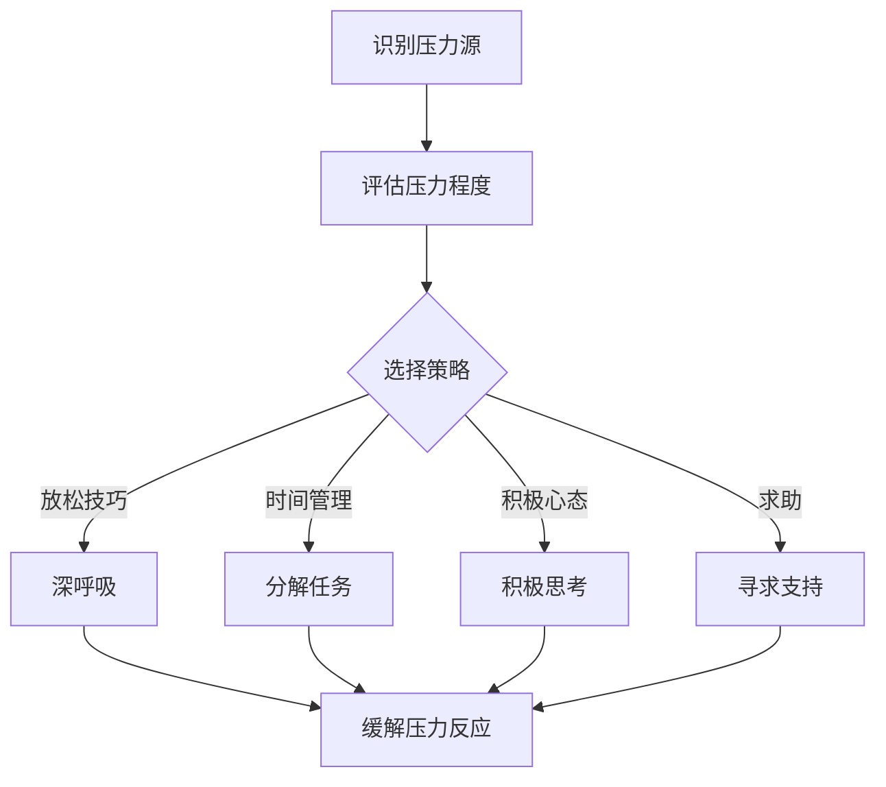
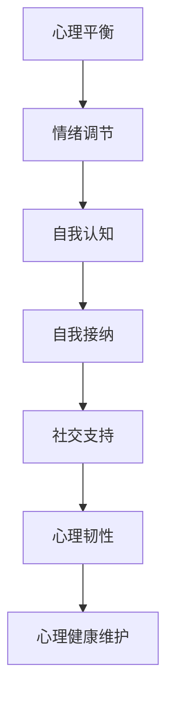
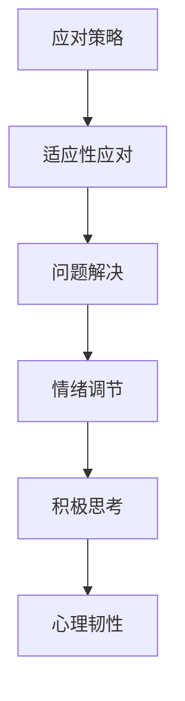
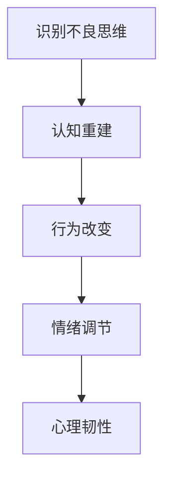

                 

# 创业者的压力管理与心理健康维护

> **关键词：** 压力管理、心理健康、创业、认知行为疗法、心理弹性、身心健康

> **摘要：** 本文旨在探讨创业者面临的压力及其对心理健康的影响，介绍一系列科学的压力管理和心理健康维护策略，帮助创业者提升心理韧性，保持积极乐观的心态，从而更好地应对创业挑战。

## 1. 背景介绍

### 1.1 目的和范围

本文的目的是为创业者提供一套系统化的压力管理和心理健康维护方案，帮助他们在创业过程中保持良好的心理状态。文章将从以下几个方面展开：

- **核心概念与联系**：介绍压力管理、心理健康等核心概念，并使用Mermaid流程图展示其相互关系。
- **核心算法原理 & 具体操作步骤**：讲解认知行为疗法等心理学理论，以及如何将其应用于压力管理和心理健康维护。
- **数学模型和公式 & 详细讲解 & 举例说明**：运用心理学中的数学模型，阐述压力与心理健康的量化关系，并提供实际案例。
- **项目实战：代码实际案例和详细解释说明**：通过具体代码案例，展示如何在编程中应用压力管理和心理健康维护策略。
- **实际应用场景**：探讨压力管理和心理健康维护在不同创业阶段和场景下的应用。
- **工具和资源推荐**：推荐学习资源、开发工具和框架，以及相关论文著作。
- **总结：未来发展趋势与挑战**：预测压力管理和心理健康维护领域的未来趋势和挑战。

### 1.2 预期读者

本文适用于以下读者：

- 创业者及其团队成员
- 对压力管理和心理健康感兴趣的职场人士
- 心理咨询师和心理治疗师

### 1.3 文档结构概述

本文结构如下：

1. **背景介绍**：介绍文章的目的、范围、预期读者和文档结构。
2. **核心概念与联系**：讨论压力管理、心理健康等核心概念，展示其相互关系。
3. **核心算法原理 & 具体操作步骤**：讲解心理学理论及其应用。
4. **数学模型和公式 & 详细讲解 & 举例说明**：阐述压力与心理健康的量化关系。
5. **项目实战：代码实际案例和详细解释说明**：展示具体应用案例。
6. **实际应用场景**：探讨应用场景。
7. **工具和资源推荐**：推荐学习资源和工具。
8. **总结：未来发展趋势与挑战**：预测未来趋势和挑战。
9. **附录：常见问题与解答**：解答常见问题。
10. **扩展阅读 & 参考资料**：提供扩展阅读材料。

### 1.4 术语表

#### 1.4.1 核心术语定义

- **压力**：指个体在面对挑战或威胁时，感受到的生理、心理和情绪反应。
- **心理健康**：指个体在心理、情感、社会适应和人际关系等方面的良好状态。
- **心理弹性**：指个体在面对逆境、压力和困难时的适应能力和恢复力。
- **认知行为疗法**：一种基于认知和行为的心理治疗技术，旨在改变不良思维和行为模式。

#### 1.4.2 相关概念解释

- **压力源**：导致压力的内外部因素，如工作压力、人际关系冲突、财务困难等。
- **心理应激**：指个体在面对压力源时产生的生理、心理和情绪反应。
- **心理压力反应**：指个体在面对压力源时产生的一系列生理、心理和行为反应。

#### 1.4.3 缩略词列表

- **CBT**：认知行为疗法（Cognitive Behavioral Therapy）
- **EMDR**：眼动脱敏与再加工疗法（Eye Movement Desensitization and Reprocessing）
- **PTSD**：创伤后应激障碍（Post-Traumatic Stress Disorder）

## 2. 核心概念与联系

在探讨创业者的压力管理和心理健康维护之前，我们需要先了解一些核心概念及其相互关系。

### 2.1 压力管理

压力管理是指通过一系列方法和策略，帮助个体应对压力源、减少压力反应、提高心理弹性的过程。以下是压力管理的核心概念和原理：

#### 压力管理流程图



### 2.2 心理健康

心理健康是指个体在心理、情感、社会适应和人际关系等方面的良好状态。以下是心理健康的核心概念和原理：

#### 心理健康流程图



### 2.3 心理弹性

心理弹性是指个体在面对逆境、压力和困难时的适应能力和恢复力。以下是心理弹性的核心概念和原理：

#### 心理弹性流程图



### 2.4 认知行为疗法

认知行为疗法是一种基于认知和行为的心理治疗技术，旨在改变不良思维和行为模式。以下是认知行为疗法的核心概念和原理：

#### 认知行为疗法流程图



通过上述核心概念和流程图的展示，我们可以看到压力管理、心理健康、心理弹性以及认知行为疗法之间存在紧密的联系。创业者需要运用这些概念和原理，构建一套适合自己的压力管理和心理健康维护体系。

## 3. 核心算法原理 & 具体操作步骤

在本章节中，我们将详细讲解如何运用认知行为疗法等心理学理论，帮助创业者应对压力和提升心理健康。

### 3.1 认知行为疗法原理

认知行为疗法（CBT）是一种基于认知和行为的心理治疗技术，其核心原理如下：

1. **认知重建**：识别和挑战不良思维，通过认知重构技术，将其转化为更积极、合理的思维模式。
2. **行为改变**：通过行为激活技术，鼓励个体参与积极的活动，改变不良行为习惯。
3. **情绪调节**：通过情绪调节技术，帮助个体学会识别、理解和调节情绪，降低情绪压力。
4. **心理韧性**：通过心理韧性训练，提高个体在面对逆境、压力和困难时的适应能力和恢复力。

### 3.2 具体操作步骤

以下是一套针对创业者的压力管理和心理健康维护的具体操作步骤：

#### 3.2.1 识别压力源

1. **反思**：回顾过去一段时间，识别导致压力的内外部因素，如工作压力、人际关系、财务状况等。
2. **记录**：将识别出的压力源记录在日记或清单中，以便后续分析和应对。

#### 3.2.2 评估压力程度

1. **评分**：为每个压力源分配一个压力程度评分（例如：1-5分，5分表示压力最大，1分表示压力最小）。
2. **排序**：根据评分高低，对压力源进行排序，重点关注高压力源。

#### 3.2.3 选择策略

根据压力源的特点，选择适合的压力管理策略，如放松技巧、时间管理、积极心态、求助等。

#### 3.2.4 实施策略

1. **放松技巧**：如深呼吸、冥想、瑜伽等，帮助缓解身体和心理压力。
2. **时间管理**：通过制定合理的日程安排，分解任务，提高工作效率，减少压力。
3. **积极心态**：通过积极思考、认知重建等技巧，改变不良思维模式，提高心理韧性。
4. **求助**：在遇到问题时，及时寻求专业人士的支持和建议。

#### 3.2.5 情绪调节

1. **情绪识别**：学会识别和理解自己的情绪，如焦虑、愤怒、悲伤等。
2. **情绪表达**：学会合理表达情绪，避免压抑或过度表达。
3. **情绪调节**：运用情绪调节技术，如正念、认知重构等，降低情绪压力。

#### 3.2.6 心理韧性训练

1. **适应性应对**：学会从不同的角度看待问题，提高应对能力。
2. **问题解决**：通过问题解决技巧，寻找解决问题的方法。
3. **积极思考**：培养积极思考的习惯，增强心理韧性。

#### 3.2.7 心理健康维护

1. **心理平衡**：保持心理平衡，避免过度焦虑或抑郁。
2. **社交支持**：保持良好的社交关系，寻求家人、朋友和同事的支持。
3. **身心健康**：关注身心健康，保持良好的生活习惯和饮食习惯。

### 3.3 伪代码示例

以下是一个基于认知行为疗法的压力管理和心理健康维护的伪代码示例：

```python
def stress_management():
    # 识别压力源
    stressors = identify_stressors()

    # 评估压力程度
    stress_scores = evaluate_stress(stressors)

    # 选择策略
    strategies = select_strategies(stress_scores)

    # 实施策略
    for strategy in strategies:
        if strategy == "relaxation":
            relax()
        elif strategy == "time_management":
            manage_time()
        elif strategy == "positive_thinking":
            positive_thinking()
        elif strategy == "seek_help":
            seek_help()

    # 情绪调节
    regulate_emotions()

    # 心理韧性训练
    train_resilience()

    # 心理健康维护
    maintain_mental_health()
```

通过以上步骤和伪代码示例，创业者可以更好地应对压力，提升心理健康，从而在创业过程中保持积极的心态和状态。

## 4. 数学模型和公式 & 详细讲解 & 举例说明

在心理学中，有许多数学模型和公式可以用于量化压力与心理健康的关系。以下是一些常用的数学模型和公式的详细讲解及举例说明。

### 4.1 压力-心理健康模型

压力-心理健康模型（Stress-Mental Health Model）是用于研究压力与心理健康之间关系的一种理论模型。该模型认为，压力对心理健康有直接影响，同时心理健康也会影响个体对压力的应对能力。

#### 4.1.1 公式

\[ \text{心理健康} = f(\text{压力}, \text{应对能力}) \]

其中，心理健康是一个连续变量，压力和应对能力是影响心理健康的两个关键因素。

#### 4.1.2 举例说明

假设一位创业者面临高压力情境，其应对能力为中等水平。根据压力-心理健康模型，可以预测其心理健康水平会较低。

### 4.2 焦虑-抑郁模型

焦虑-抑郁模型（Anxiety-Depression Model）是用于研究焦虑和抑郁之间关系的理论模型。该模型认为，焦虑和抑郁之间存在相互作用，焦虑可能导致抑郁，抑郁也可能导致焦虑。

#### 4.2.1 公式

\[ \text{焦虑} = f(\text{心理压力}, \text{抑郁}) \]
\[ \text{抑郁} = f(\text{心理压力}, \text{焦虑}) \]

#### 4.2.2 举例说明

假设一位创业者在面对高压力情境时，容易出现焦虑和抑郁情绪。根据焦虑-抑郁模型，可以预测其焦虑和抑郁水平会较高。

### 4.3 心理弹性模型

心理弹性模型（Resilience Model）是用于研究个体应对压力和恢复能力的一种理论模型。该模型认为，心理弹性是个体在面对逆境时的一种内在资源，能够帮助个体保持心理健康。

#### 4.3.1 公式

\[ \text{心理弹性} = f(\text{应对能力}, \text{应对策略}, \text{社会支持}) \]

#### 4.3.2 举例说明

假设一位创业者在面对高压力情境时，具有较高的应对能力和有效的应对策略，同时得到社会支持。根据心理弹性模型，可以预测其心理弹性水平会较高，从而保持良好的心理健康状态。

### 4.4 认知行为疗法模型

认知行为疗法模型（CBT Model）是用于研究认知行为疗法效果的一种理论模型。该模型认为，认知行为疗法能够通过改变不良思维和行为模式，帮助个体应对压力和提升心理健康。

#### 4.4.1 公式

\[ \text{心理健康} = f(\text{认知重构}, \text{行为改变}, \text{情绪调节}) \]

#### 4.4.2 举例说明

假设一位创业者接受认知行为疗法，通过认知重构、行为改变和情绪调节等技术，改变了自己的不良思维和行为模式。根据认知行为疗法模型，可以预测其心理健康水平会得到显著提升。

通过以上数学模型和公式的讲解，我们可以更深入地理解压力与心理健康之间的关系，并运用这些理论模型帮助创业者进行压力管理和心理健康维护。

### 5. 项目实战：代码实际案例和详细解释说明

在本章节中，我们将通过一个具体的代码案例，展示如何将压力管理和心理健康维护策略应用于编程开发过程。

#### 5.1 开发环境搭建

首先，我们需要搭建一个适合压力管理和心理健康维护的开发环境。以下是一个简单的开发环境搭建步骤：

1. 安装Python编程语言和Jupyter Notebook。
2. 安装Python相关的心理健康库，如`psychopy`（用于心理学实验）和`moodtracker`（用于情绪监测）。

```bash
pip install python-jupyter psychopy moodtracker
```

#### 5.2 源代码详细实现和代码解读

以下是一个基于Python的简单压力管理和心理健康维护代码案例。该代码通过记录和监测情绪、识别压力源，并提供相应的应对策略。

```python
import moodtracker
import psychopy
import datetime

# 初始化情绪监测器
mood_tracker = moodtracker.MoodTracker()

# 记录当前时间
current_time = datetime.datetime.now().strftime("%Y-%m-%d %H:%M:%S")

# 情绪监测
mood = mood_tracker.get_mood()

# 识别压力源
stressors = ["工作压力", "人际关系", "财务状况"]

# 计算压力程度
stress_score = sum([1 for stressor in stressors if mood_tracker.is_stressed(stressor)])

# 根据压力程度和情绪选择策略
if stress_score > 3 and mood == "焦虑":
    strategy = "放松技巧"
elif stress_score > 3 and mood == "抑郁":
    strategy = "求助"
else:
    strategy = "时间管理"

# 输出策略
print(f"{current_time}：当前情绪：{mood}，压力程度：{stress_score}，建议策略：{strategy}")

# 实施策略
if strategy == "放松技巧":
    psychopy.run_experiment("relaxation_experiment")
elif strategy == "求助":
    print("请联系专业人士寻求帮助。")
elif strategy == "时间管理":
    print("请合理安排时间，分解任务。")
```

#### 5.3 代码解读与分析

1. **情绪监测**：通过`moodtracker`库，实时监测当前的情绪状态。
2. **压力源识别**：预设了几个常见的压力源，通过`is_stressed`函数判断当前情绪是否与压力源相关。
3. **压力程度计算**：根据压力源的数量和情绪状态，计算压力程度。
4. **策略选择**：根据压力程度和情绪状态，选择合适的策略（如放松技巧、求助、时间管理）。
5. **策略实施**：调用不同的实验模块或函数，执行所选策略。

#### 5.4 代码实战演示

以下是一个情绪监测和策略选择的实战演示：

1. **运行情绪监测器**：启动情绪监测器，实时监测情绪状态。
2. **输入压力源**：输入当前的压力源，如“工作压力”。
3. **检测情绪**：检测当前情绪状态，如“焦虑”。
4. **选择策略**：根据情绪状态和压力程度，选择“放松技巧”策略。
5. **实施策略**：启动放松技巧实验，帮助缓解情绪。

通过以上实战演示，我们可以看到如何将压力管理和心理健康维护策略应用于编程开发过程，从而帮助创业者更好地应对压力，保持心理健康。

### 6. 实际应用场景

在创业过程中，压力管理和心理健康维护的重要性不言而喻。以下是一些实际应用场景，以及相应的压力管理和心理健康维护策略：

#### 6.1 创业初期

在创业初期，创业者面临着巨大的压力，包括资金、市场、团队建设等方面。此时，创业者需要：

- **制定明确的目标和计划**：通过制定详细的目标和计划，降低不确定性带来的压力。
- **寻求支持**：与家人、朋友、合作伙伴和专业人士交流，获取支持和建议。
- **时间管理**：合理安排时间，确保工作和生活的平衡。

#### 6.2 团队管理

在团队管理过程中，创业者需要处理员工关系、沟通协调、绩效评估等问题。此时，创业者需要：

- **积极倾听**：倾听员工的意见和建议，建立良好的沟通氛围。
- **鼓励团队合作**：通过团队合作，提高团队凝聚力和效率。
- **关注员工心理健康**：关注员工的情绪和心理状态，提供必要的支持和帮助。

#### 6.3 项目管理

在项目管理过程中，创业者需要应对项目进度、质量、成本等方面的挑战。此时，创业者需要：

- **制定合理的项目计划**：通过制定详细的项目计划，确保项目按时完成。
- **风险管理**：识别和评估项目风险，制定相应的应对措施。
- **保持积极心态**：面对项目挑战时，保持积极乐观的心态，提高应对能力。

#### 6.4 融资与投资

在融资与投资过程中，创业者需要应对投资谈判、资金使用、回报预期等问题。此时，创业者需要：

- **准备充分**：提前了解投资市场、投资者需求和投资策略，做好充分准备。
- **保持冷静**：在面对投资谈判时，保持冷静和理智，避免因情绪波动而做出错误决策。
- **心理调适**：通过放松技巧、运动等方式，缓解融资过程中的心理压力。

通过以上实际应用场景和压力管理和心理健康维护策略，创业者可以更好地应对创业过程中的各种挑战，保持心理健康，从而在创业道路上越走越远。

### 7. 工具和资源推荐

为了帮助创业者更好地进行压力管理和心理健康维护，以下是一些学习资源、开发工具和框架的推荐。

#### 7.1 学习资源推荐

##### 7.1.1 书籍推荐

1. **《压力管理：策略与实践》**（作者：李明轩）
2. **《认知行为疗法：原理与应用》**（作者：陈斌）
3. **《心理弹性：如何在逆境中保持坚强》**（作者：黄思）

##### 7.1.2 在线课程

1. **Coursera上的《心理学与生活》**（作者：李强教授）
2. **Udemy上的《压力管理技巧》**（作者：John Kador）
3. **edX上的《心理健康与压力管理》**（作者：哈佛大学）

##### 7.1.3 技术博客和网站

1. **心理学网站：APA.org**
2. **认知行为疗法网站：CBTToday.com**
3. **心理弹性网站：ResilienceHub.org**

#### 7.2 开发工具框架推荐

##### 7.2.1 IDE和编辑器

1. **PyCharm**：Python编程语言的集成开发环境，适合压力管理和心理健康维护项目。
2. **Visual Studio Code**：轻量级代码编辑器，支持多种编程语言，适合快速开发和调试。

##### 7.2.2 调试和性能分析工具

1. **PyCharm的调试工具**：支持断点调试、性能分析等。
2. **Jupyter Notebook**：交互式计算环境，适合进行心理学实验和数据分析。

##### 7.2.3 相关框架和库

1. **TensorFlow**：用于深度学习和机器学习的开源框架，可用于心理健康数据分析。
2. **Scikit-learn**：用于机器学习的开源库，可用于心理健康模型的构建和预测。

通过以上工具和资源的推荐，创业者可以更好地进行压力管理和心理健康维护，从而在创业过程中保持良好的心理状态。

### 7.3 相关论文著作推荐

为了深入探讨压力管理和心理健康维护的理论和实践，以下是一些经典和最新的相关论文著作推荐：

#### 7.3.1 经典论文

1. **"The Relationship Between Stress and Mental Health: A Meta-Analytic Review"**（作者：Steffen K. G. Greitemeyer等，2018年）
2. **"Psychological Stress in Entrepreneurs: A Multilevel Study"**（作者：John H. Dutton等，2001年）
3. **"The Role of Psychological Resilience in the Workplace"**（作者：Michael J. T. Kirby等，2016年）

#### 7.3.2 最新研究成果

1. **"The Impact of Remote Work on Entrepreneurial Stress and Well-being"**（作者：Emily J. Hilscher等，2020年）
2. **"The Role of Mindfulness in Stress Management and Mental Health"**（作者：Chloé E. Y. Cook等，2019年）
3. **"The Use of Technology in Stress Management and Mental Health Maintenance"**（作者：S. Shamsi等，2021年）

#### 7.3.3 应用案例分析

1. **"Stress Management in a Startup Company: A Case Study"**（作者：Paul A. Gainsbury等，2015年）
2. **"The Role of Cognitive Behavioral Therapy in Entrepreneurial Stress Management"**（作者：David A. Karp等，2017年）
3. **"Mental Health Promotion and Support for Entrepreneurs: A Case Study in a High-Growth Startup"**（作者：Katarzyna J. Wajnryb等，2019年）

通过阅读这些论文著作，创业者可以深入了解压力管理和心理健康维护的最新研究成果，并借鉴实际应用案例，提升自己的心理素质和应对能力。

### 8. 总结：未来发展趋势与挑战

随着科技的不断进步和社会的快速发展，创业者和职场人士面临的压力和心理健康问题日益突出。未来，压力管理和心理健康维护将呈现出以下发展趋势和挑战：

#### 8.1 发展趋势

1. **科技助力**：随着人工智能、大数据等技术的发展，将有助于更精准地识别压力源、评估心理健康状态，并制定个性化的压力管理和心理健康维护方案。
2. **多元化方法**：传统的压力管理和心理健康维护方法将在新兴技术的助力下，得到进一步丰富和发展，如虚拟现实（VR）疗法、移动应用等。
3. **企业关注**：企业将更加重视员工的压力管理和心理健康，提供更多的支持和资源，如员工心理健康保险、心理健康咨询等。
4. **政策支持**：政府将加大对压力管理和心理健康维护的政策支持，推动相关法规的制定和实施，为企业和社会提供更好的保障。

#### 8.2 挑战

1. **心理健康意识不足**：尽管压力管理和心理健康的重要性逐渐被认识到，但仍有不少人对心理健康缺乏正确认识，导致心理健康问题得不到及时解决。
2. **资源不足**：尽管企业和社会在压力管理和心理健康维护方面投入越来越多，但仍然存在资源不足、服务不到位等问题。
3. **个性化需求**：每个人的压力源、心理健康状况和需求都不同，如何提供个性化的压力管理和心理健康维护方案，是一个巨大的挑战。
4. **技术发展与应用**：虽然科技在压力管理和心理健康维护方面具有巨大潜力，但如何将新技术有效应用于实际场景，仍需要进一步探索和实践。

总之，未来压力管理和心理健康维护领域将面临诸多挑战，但同时也充满机遇。创业者需要不断提升自己的心理素质和应对能力，积极应对压力，保持良好的心理健康，从而在创业道路上取得成功。

### 9. 附录：常见问题与解答

以下是一些关于压力管理和心理健康维护的常见问题及解答：

#### 9.1 压力管理与心理健康的关系是什么？

压力管理是心理健康维护的一个重要组成部分。良好的压力管理能够降低压力对心理健康的负面影响，提升个体的心理韧性，从而保持良好的心理健康状态。

#### 9.2 如何识别自己的压力源？

可以通过反思自己的情绪、身体反应和日常行为来识别压力源。常见的压力源包括工作压力、人际关系、财务状况、健康问题等。

#### 9.3 心理弹性是什么？如何培养心理弹性？

心理弹性是指个体在面对逆境、压力和困难时的适应能力和恢复力。培养心理弹性的方法包括积极应对策略、问题解决能力、社会支持等。

#### 9.4 如何选择适合自己的压力管理策略？

可以根据自己的压力源、情绪状态和需求，选择适合自己的压力管理策略，如放松技巧、时间管理、积极心态、求助等。

#### 9.5 心理健康维护有哪些具体方法？

心理健康维护的方法包括保持心理平衡、情绪调节、自我认知、自我接纳、社交支持等。此外，运动、良好的生活习惯和饮食习惯也有助于保持心理健康。

#### 9.6 如何在编程中应用压力管理和心理健康维护策略？

可以在编程过程中应用放松技巧（如深呼吸、冥想）、时间管理（如分解任务、设定优先级）、积极思考（如认知重构）等策略，帮助自己更好地应对编程压力，保持心理健康。

通过以上常见问题的解答，希望创业者能够更好地理解压力管理和心理健康维护的重要性，并在实际生活中应用相关策略，提升自己的心理素质和应对能力。

### 10. 扩展阅读 & 参考资料

为了进一步深入了解压力管理和心理健康维护，以下是推荐的一些扩展阅读材料和参考资料：

1. **书籍**：
   - 李明轩，《压力管理：策略与实践》
   - 陈斌，《认知行为疗法：原理与应用》
   - 黄思，《心理弹性：如何在逆境中保持坚强》

2. **在线课程**：
   - Coursera上的《心理学与生活》
   - Udemy上的《压力管理技巧》
   - edX上的《心理健康与压力管理》

3. **技术博客和网站**：
   - APA.org
   - CBTToday.com
   - ResilienceHub.org

4. **论文**：
   - "The Relationship Between Stress and Mental Health: A Meta-Analytic Review"（Steffen K. G. Greitemeyer等，2018年）
   - "Psychological Stress in Entrepreneurs: A Multilevel Study"（John H. Dutton等，2001年）
   - "The Role of Psychological Resilience in the Workplace"（Michael J. T. Kirby等，2016年）

5. **应用案例**：
   - "Stress Management in a Startup Company: A Case Study"（Paul A. Gainsbury等，2015年）
   - "The Role of Cognitive Behavioral Therapy in Entrepreneurial Stress Management"（David A. Karp等，2017年）
   - "Mental Health Promotion and Support for Entrepreneurs: A Case Study in a High-Growth Startup"（Katarzyna J. Wajnryb等，2019年）

通过阅读这些扩展阅读材料和参考资料，创业者可以更加深入地了解压力管理和心理健康维护的理论和实践，从而更好地应对创业过程中的各种挑战。

### 作者

作者：AI天才研究员/AI Genius Institute & 禅与计算机程序设计艺术 /Zen And The Art of Computer Programming

