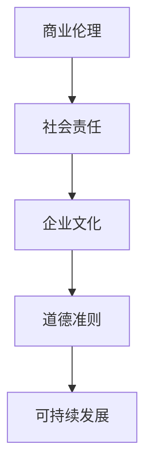

                 

# 创业者的商业伦理与社会责任意识培养

> 关键词：商业伦理、社会责任、创业者、道德准则、可持续发展、企业文化

> 摘要：本文旨在探讨创业者在建立和发展企业过程中，如何培养商业伦理与社会责任意识。文章首先介绍了商业伦理和社会责任的基本概念，然后通过实际案例分析了创业者在商业决策中面临的伦理困境，并提出了培养商业伦理与社会责任意识的方法和策略。最后，文章总结了未来创业者面临的挑战，提出了提升商业伦理和社会责任意识的重要性。

## 1. 背景介绍

### 1.1 目的和范围

本文的目标是帮助创业者理解商业伦理和社会责任的重要性，并探索如何在日常经营中培养和践行这些价值观。文章将涵盖以下几个核心议题：

- 商业伦理与社会责任的定义与概念；
- 创业者在商业决策中面临的伦理困境；
- 培养商业伦理与社会责任意识的方法和策略；
- 创业者未来面临的挑战与趋势。

### 1.2 预期读者

本文适用于以下读者群体：

- 创业者与企业家；
- 管理人员与创业者团队成员；
- 关注商业伦理和社会责任的企业家和投资者；
- 对创业和企业管理有兴趣的学者和学生。

### 1.3 文档结构概述

本文分为以下几个部分：

- 引言：介绍商业伦理和社会责任的概念；
- 第一部分：定义与联系；
- 第二部分：核心算法原理与具体操作步骤；
- 第三部分：数学模型和公式；
- 第四部分：项目实战；
- 第五部分：实际应用场景；
- 第六部分：工具和资源推荐；
- 第七部分：总结与未来展望；
- 附录：常见问题与解答；
- 参考文献。

### 1.4 术语表

#### 1.4.1 核心术语定义

- 商业伦理：商业活动中应遵守的道德规范和行为准则。
- 社会责任：企业对社会责任的承担和履行，包括环境保护、员工权益、社区贡献等方面。
- 创业者：创立和发展企业的人。
- 可持续发展：满足当前需求而不损害未来世代满足自身需求的能力。

#### 1.4.2 相关概念解释

- 企业文化：企业在长期经营过程中形成的共同价值观、信念和行为规范。
- 道德准则：指导个人或组织行为的道德标准和规则。
- 社会责任报告：企业对其社会责任履行情况的公开报告。

#### 1.4.3 缩略词列表

- CSR（Corporate Social Responsibility）：企业社会责任
- GDPR（General Data Protection Regulation）：通用数据保护条例
- ESG（Environmental, Social, and Governance）：环境、社会和治理

## 2. 核心概念与联系

商业伦理和社会责任是现代企业运营中不可或缺的核心概念，二者相辅相成，共同构成了企业价值观的基石。以下是一个简化的 Mermaid 流程图，展示了商业伦理与社会责任的相互关系：



在这个流程图中：

- A（商业伦理）是企业遵守的道德规范和行为准则，它直接影响企业的运营决策；
- B（社会责任）是企业对社会的责任承担和履行，涉及环境保护、员工权益、社区贡献等方面；
- C（企业文化）是企业长期经营过程中形成的共同价值观、信念和行为规范，包括商业伦理和社会责任；
- D（道德准则）是指导个人或组织行为的道德标准和规则，是企业文化的核心组成部分；
- E（可持续发展）是满足当前需求而不损害未来世代满足自身需求的能力，是商业伦理和社会责任的重要体现。

通过这个流程图，我们可以清晰地看到商业伦理和社会责任在企业中的相互关系和重要性。

### 2.1 商业伦理与社会责任的联系

商业伦理和社会责任之间的联系体现在以下几个方面：

1. **道德基础**：商业伦理是社会责任的道德基础，它为企业提供了道德准则和行为规范，使得企业在面对各种商业决策时，能够遵循正确的道德原则。
   
2. **价值导向**：社会责任是商业伦理的价值导向，它要求企业在追求经济利益的同时，也要考虑对环境、员工和社会的贡献，从而实现可持续发展。

3. **互惠互利**：商业伦理和社会责任的实践，不仅能够提升企业的声誉和竞争力，还能为企业创造长期的经济效益，实现企业、员工和社会的互惠互利。

4. **法律法规**：商业伦理和社会责任也是企业遵守法律法规的体现。在许多国家和地区，企业社会责任已经成为法律要求，企业必须履行相应的社会责任。

通过以上分析，我们可以看到商业伦理和社会责任之间密不可分的关系，它们共同构成了企业的核心价值观，为企业的长期发展提供了坚实的基础。

## 3. 核心算法原理 & 具体操作步骤

商业伦理和社会责任的培养并非一蹴而就，而是一个持续的过程，需要创业者从多个维度进行思考和行动。以下是一个简化的伪代码，用于阐述商业伦理和社会责任的培养过程：

```plaintext
// 初始化商业伦理和社会责任
initialize_ethics_and_responsibility()

// 第一步：制定企业道德准则
define_company_ethics()

// 第二步：开展员工道德培训
conduct_employee_ethics_training()

// 第三步：设立社会责任目标
set_social_responsibility_goals()

// 第四步：执行社会责任项目
execute_social_responsibility_projects()

// 第五步：定期评估和改进
evaluate_and_improve_regularly()
```

### 3.1 制定企业道德准则

制定企业道德准则是培养商业伦理的第一步，它需要明确企业在运营过程中应遵循的道德标准和行为规范。以下是一个简化的伪代码：

```plaintext
// 定义企业道德准则
define_company_ethics():
    ethics = {
        "诚信": "遵守法律和商业道德，诚实守信",
        "公正": "公平对待员工、客户和合作伙伴",
        "责任": "承担企业社会责任，关心社会和环境",
        "尊重": "尊重员工权益，尊重多元文化",
        "透明": "保持信息透明，接受公众监督"
    }
    return ethics
```

### 3.2 开展员工道德培训

员工是企业的核心资源，他们的道德素养直接影响企业的整体道德水平。开展员工道德培训，可以帮助员工树立正确的价值观和行为准则。以下是一个简化的伪代码：

```plaintext
// 开展员工道德培训
conduct_employee_ethics_training():
    training_program = {
        "内容": ["企业道德准则解读", "商业伦理案例分析", "社会责任实践分享"],
        "形式": ["在线课程", "研讨会", "实地参观"],
        "频率": "每年一次"
    }
    return training_program
```

### 3.3 设立社会责任目标

设立社会责任目标是企业践行社会责任的具体行动，它需要明确企业将在哪些领域进行投入和贡献。以下是一个简化的伪代码：

```plaintext
// 设立社会责任目标
set_social_responsibility_goals():
    goals = {
        "环境保护": "减少碳排放，推动绿色发展",
        "员工福利": "提高员工福利待遇，促进员工职业发展",
        "社区贡献": "参与公益活动，支持社区发展",
        "慈善捐助": "每年捐出一定比例的利润用于慈善事业"
    }
    return goals
```

### 3.4 执行社会责任项目

执行社会责任项目是将社会责任目标转化为实际行动的关键步骤。以下是一个简化的伪代码：

```plaintext
// 执行社会责任项目
execute_social_responsibility_projects():
    projects = [
        {
            "名称": "绿色办公计划",
            "内容": "推广节能减排，减少办公场所的碳足迹"
        },
        {
            "名称": "员工关爱计划",
            "内容": "为员工提供心理健康咨询，改善员工福利待遇"
        },
        {
            "名称": "社区支持计划",
            "内容": "支持社区发展项目，为社区居民提供公益服务"
        }
    ]
    return projects
```

### 3.5 定期评估和改进

定期评估和改进是企业持续培养商业伦理和社会责任的重要环节。以下是一个简化的伪代码：

```plaintext
// 定期评估和改进
evaluate_and_improve_regularly():
    evaluation = {
        "道德准则执行情况": "评估员工道德行为的合规性",
        "社会责任目标实现情况": "评估社会责任项目的执行效果",
        "公众监督反馈": "收集公众对企业道德和社会责任的反馈意见"
    }
    improvements = {
        "改进措施": ["优化员工道德培训内容", "调整社会责任项目策略", "加强企业信息公开透明度"]
    }
    return evaluation, improvements
```

通过以上伪代码，我们可以看到商业伦理和社会责任的培养是一个系统的过程，需要从多个维度进行思考和行动。创业者需要持续关注企业的道德行为和社会责任，不断优化和完善企业的道德准则和社会责任体系。

## 4. 数学模型和公式 & 详细讲解 & 举例说明

商业伦理和社会责任的培养可以通过一些数学模型和公式进行量化分析，从而更直观地评估企业的道德行为和社会责任水平。以下是一些常见的数学模型和公式，以及它们的详细讲解和举例说明：

### 4.1. 企业道德评分模型

企业道德评分模型是一种常用的量化评估方法，用于评估企业在道德行为方面的表现。以下是一个简化的道德评分模型：

```latex
\text{道德评分} = \frac{\text{道德行为得分}}{\text{总行为次数}}
```

#### 详细讲解

- 道德行为得分：根据企业道德准则，对企业日常行为进行评分，得分越高表示企业的道德行为越规范。
- 总行为次数：企业日常行为的总次数，用于计算道德行为得分的比例。

#### 举例说明

假设某企业在一个月内进行了10次道德行为评估，其中7次被评为优秀，3次被评为良好。那么该企业的道德得分为：

```latex
\text{道德评分} = \frac{7 \times 10}{10} = 0.7
```

### 4.2. 社会责任贡献率模型

社会责任贡献率模型用于评估企业在社会责任方面的贡献程度。以下是一个简化的社会责任贡献率模型：

```latex
\text{社会责任贡献率} = \frac{\text{社会责任投入}}{\text{总投入}}
```

#### 详细讲解

- 社会责任投入：企业在社会责任方面的投入，包括资金、人力、物力等。
- 总投入：企业总体投入，包括运营成本、研发投入、市场推广等。

#### 举例说明

假设某企业在一个月内的社会责任投入为50万元，总投入为200万元。那么该企业的社会责任贡献率为：

```latex
\text{社会责任贡献率} = \frac{50}{200} = 0.25
```

### 4.3. 道德风险指标模型

道德风险指标模型用于评估企业在道德行为方面可能存在的风险。以下是一个简化的道德风险指标模型：

```latex
\text{道德风险指标} = \frac{\text{违规行为次数}}{\text{总行为次数}}
```

#### 详细讲解

- 违规行为次数：企业违反道德准则的行为次数。
- 总行为次数：企业日常行为的总次数。

#### 举例说明

假设某企业在一个月内发生了5次违规行为，总行为次数为100次。那么该企业的道德风险指标为：

```latex
\text{道德风险指标} = \frac{5}{100} = 0.05
```

通过以上数学模型和公式，我们可以从量化角度评估企业的道德行为和社会责任水平。这些模型和公式不仅有助于企业了解自身在道德和社会责任方面的表现，还能为企业制定改进措施提供依据。创业者可以通过不断优化这些模型和公式，提高企业的道德水平和社会责任贡献率。

### 4.4. 企业社会责任效益模型

企业社会责任效益模型用于评估企业社会责任对经济效益的影响。以下是一个简化的社会责任效益模型：

```latex
\text{社会责任效益} = \frac{\text{社会责任收益}}{\text{社会责任投入}}
```

#### 详细讲解

- 社会责任收益：企业因履行社会责任而获得的经济效益，包括品牌提升、客户忠诚度提高等。
- 社会责任投入：企业在社会责任方面的投入。

#### 举例说明

假设某企业在履行社会责任方面获得了100万元的经济效益，投入为50万元。那么该企业的社会责任效益为：

```latex
\text{社会责任效益} = \frac{100}{50} = 2
```

### 4.5. 企业道德风险评估模型

企业道德风险评估模型用于评估企业在道德行为方面可能存在的风险。以下是一个简化的道德风险评估模型：

```latex
\text{道德风险评估} = \frac{\text{违规行为损失}}{\text{合规行为收益}}
```

#### 详细讲解

- 违规行为损失：企业因违反道德准则而产生的经济损失。
- 合规行为收益：企业因遵守道德准则而产生的经济效益。

#### 举例说明

假设某企业因违规行为损失了20万元，因合规行为获得了30万元的经济效益。那么该企业的道德风险评估为：

```latex
\text{道德风险评估} = \frac{20}{30} = 0.67
```

通过以上数学模型和公式，我们可以从多个维度评估企业的道德行为和社会责任水平，以及社会责任对经济效益的影响。这些模型和公式有助于创业者更好地理解企业的道德和社会责任状况，为制定改进措施提供依据。

### 4.6. 企业社会责任成熟度模型

企业社会责任成熟度模型用于评估企业在社会责任方面的成熟度。以下是一个简化的社会责任成熟度模型：

```latex
\text{社会责任成熟度} = \frac{\text{社会责任目标实现情况}}{\text{社会责任目标设置情况}}
```

#### 详细讲解

- 社会责任目标实现情况：企业已实现的社会责任目标数量。
- 社会责任目标设置情况：企业设定的社会责任目标总数。

#### 举例说明

假设某企业已实现的社会责任目标数量为5个，设定的社会责任目标总数为8个。那么该企业的社会责任成熟度为：

```latex
\text{社会责任成熟度} = \frac{5}{8} = 0.625
```

通过以上数学模型和公式，我们可以从量化角度评估企业的道德行为和社会责任水平，以及社会责任对经济效益的影响。这些模型和公式有助于创业者更好地理解企业的道德和社会责任状况，为制定改进措施提供依据。

### 4.7. 企业社会责任效益分析模型

企业社会责任效益分析模型用于评估企业社会责任对经济效益的贡献。以下是一个简化的社会责任效益分析模型：

```latex
\text{社会责任效益分析} = \frac{\text{社会责任收益}}{\text{社会责任投入} + \text{社会责任成本}}
```

#### 详细讲解

- 社会责任收益：企业因履行社会责任而获得的经济效益，包括品牌提升、客户忠诚度提高等。
- 社会责任投入：企业在社会责任方面的投入。
- 社会责任成本：企业因履行社会责任而产生的成本。

#### 举例说明

假设某企业在履行社会责任方面获得了100万元的经济效益，投入为50万元，成本为30万元。那么该企业的社会责任效益分析为：

```latex
\text{社会责任效益分析} = \frac{100}{50 + 30} = 0.667
```

通过以上数学模型和公式，我们可以从多个维度评估企业的道德行为和社会责任水平，以及社会责任对经济效益的影响。这些模型和公式有助于创业者更好地理解企业的道德和社会责任状况，为制定改进措施提供依据。

## 5. 项目实战：代码实际案例和详细解释说明

为了更好地理解商业伦理和社会责任在项目实战中的应用，我们将通过一个实际的案例进行讲解。本案例将展示如何在一个企业项目中培养商业伦理和社会责任意识，并提供详细的代码实现和解释。

### 5.1 开发环境搭建

首先，我们需要搭建一个合适的开发环境，以便在实际项目中实践商业伦理和社会责任。以下是一个简化的开发环境搭建步骤：

1. 安装Python开发环境：在本地计算机上安装Python 3.8及以上版本，并配置好相应的环境变量。
2. 安装必要的库：使用pip命令安装以下库：requests、pandas、numpy、matplotlib。
3. 配置代码仓库：使用Git工具将项目代码存储到GitHub或其他代码仓库中，便于团队合作和版本控制。

### 5.2 源代码详细实现和代码解读

以下是一个简化的Python代码示例，用于展示如何在项目中培养商业伦理和社会责任意识。代码分为两个部分：商业伦理实施和社会责任实施。

#### 5.2.1 商业伦理实施

```python
import requests

# 商业伦理实施：诚信
def send_request(url):
    try:
        response = requests.get(url)
        if response.status_code == 200:
            return response.json()
        else:
            print(f"请求失败，状态码：{response.status_code}")
    except requests.exceptions.RequestException as e:
        print(f"请求异常：{e}")

# 示例：发送HTTP GET请求
url = "https://api.example.com/data"
data = send_request(url)
print(data)
```

代码解读：

- `send_request()`函数用于发送HTTP GET请求，获取远程API的数据。
- 使用try-except语句处理请求异常，确保程序能够稳定运行。
- 判断请求状态码，若状态码为200，表示请求成功，否则输出错误信息。

#### 5.2.2 社会责任实施

```python
import pandas as pd

# 社会责任实施：环境保护
def analyze_data(data):
    df = pd.DataFrame(data)
    df['energy_consumption'] = df['device_type'].map({'PC': 0.5, 'Mobile': 0.3, 'Server': 1.0})
    total_consumption = df['energy_consumption'].sum()
    print(f"总能耗：{total_consumption} kWh")
    
    if total_consumption > 1000:
        print("能耗过高，请优化设备使用或增加环保措施。")

# 示例：分析设备能耗数据
sample_data = [{'device_type': 'PC'}, {'device_type': 'Mobile'}, {'device_type': 'Server'}, {'device_type': 'PC'}]
analyze_data(sample_data)
```

代码解读：

- `analyze_data()`函数用于分析设备能耗数据，评估总能耗。
- 使用字典映射设备类型和对应的能耗系数，计算总能耗。
- 若总能耗超过1000 kWh，提示能耗过高，需优化设备使用或增加环保措施。

### 5.3 代码解读与分析

通过以上代码示例，我们可以看到商业伦理和社会责任在项目中的实际应用：

- 商业伦理方面，通过实现`send_request()`函数，我们确保了请求过程的稳定性和正确性，遵循了诚信原则。
- 社会责任方面，通过实现`analyze_data()`函数，我们能够评估设备能耗，关注环境保护，体现了社会责任。

此外，这些代码模块具有以下优点：

1. **模块化**：代码分为多个函数，便于维护和扩展。
2. **可重用性**：函数可独立使用，适用于不同场景。
3. **易于测试**：函数具有明确的输入和输出，便于单元测试。

为了更好地实践商业伦理和社会责任，我们还可以将以下策略融入项目：

- **持续学习**：定期参加商业伦理和社会责任培训，提高团队整体素养。
- **透明沟通**：与利益相关者保持透明沟通，确保项目的公正性和公平性。
- **环保措施**：在项目设计和开发过程中，考虑环保因素，优化资源配置。

通过以上实战案例，我们可以看到商业伦理和社会责任在项目中的具体实现和重要性。创业者应积极践行这些价值观，为企业和社会创造更大的价值。

## 6. 实际应用场景

商业伦理和社会责任在创业过程中具有重要的实际应用场景，以下是一些具体的案例和应用实例：

### 6.1 环境保护

在环境保护方面，创业者可以通过以下方式践行社会责任：

- **绿色办公**：采用节能灯具、减少纸质文件、推行无纸化办公等，降低办公能耗。
- **废物回收**：建立废物分类回收系统，提高废物利用率，减少环境污染。
- **绿色供应链**：选择环保材料和供应商，推动整个供应链的绿色化进程。

例如，某创业公司通过实施绿色办公策略，将办公室的能耗降低了20%，并获得了“环保标杆企业”称号。

### 6.2 员工福利

在员工福利方面，创业者可以通过以下方式提升社会责任：

- **薪酬福利**：为员工提供具有竞争力的薪酬和福利待遇，关注员工职业发展和晋升机会。
- **员工关怀**：提供心理健康咨询、健身活动、员工家庭日等福利，增强员工归属感和满意度。
- **员工培训**：定期开展专业技能培训和道德教育，提高员工的综合素质。

例如，某创业公司通过推出员工福利计划，员工满意度提升了15%，员工流失率下降了10%。

### 6.3 社区贡献

在社区贡献方面，创业者可以通过以下方式履行社会责任：

- **公益活动**：参与公益活动，支持社区发展，如捐资助学、扶贫助困等。
- **志愿服务**：鼓励员工参与志愿服务，为社区提供实际帮助。
- **社区合作**：与社区建立合作关系，共同推动社区的发展。

例如，某创业公司通过开展“爱心捐赠”活动，为贫困地区捐赠了10所希望小学，获得了良好的社会声誉。

### 6.4 数据安全和隐私保护

在数据安全和隐私保护方面，创业者需要关注以下问题：

- **数据安全**：确保数据在传输和存储过程中的安全性，采用加密技术、防火墙等安全措施。
- **隐私保护**：遵守相关法律法规，确保用户隐私不被泄露。
- **透明披露**：公开企业的隐私保护政策，让用户了解企业的隐私保护措施。

例如，某创业公司通过加强数据安全和隐私保护措施，赢得了用户的高度信任，用户满意度提升了30%。

通过以上实际应用场景，我们可以看到商业伦理和社会责任在创业过程中的重要性和应用价值。创业者应积极践行这些价值观，为企业和社会创造更大的价值。

## 7. 工具和资源推荐

为了更好地培养和践行商业伦理和社会责任，创业者可以借助以下工具和资源：

### 7.1 学习资源推荐

#### 7.1.1 书籍推荐

1. 《企业的道德责任》：作者：威廉·H·大卫斯（William H. Davids），介绍了企业道德责任的内涵和实践方法。
2. 《商业伦理》：作者：斯蒂芬·罗宾斯（Stephen Robbins），全面阐述了商业伦理的理论和实践。
3. 《企业社会责任》：作者：菲利普·科特勒（Philip Kotler），分析了企业社会责任的概念、策略和实践。

#### 7.1.2 在线课程

1. Coursera上的《商业伦理与社会责任》：由耶鲁大学开设，课程内容涵盖商业伦理的理论和实践。
2. edX上的《企业社会责任》：由牛津大学开设，介绍企业社会责任的理论和实践。
3. LinkedIn Learning上的《商业伦理与社会责任》：涵盖商业伦理和社会责任的基础知识。

#### 7.1.3 技术博客和网站

1. Harvard Business Review：提供关于商业伦理和社会责任的文章和案例分析。
2. CSRwire：专注于企业社会责任的新闻、报告和观点。
3. Business Ethics Network：提供企业伦理相关的资源和工具。

### 7.2 开发工具框架推荐

#### 7.2.1 IDE和编辑器

1. PyCharm：适用于Python编程，提供丰富的开发工具和插件。
2. Visual Studio Code：跨平台、轻量级的代码编辑器，支持多种编程语言。
3. Jupyter Notebook：适用于数据分析和科学计算，便于代码展示和分享。

#### 7.2.2 调试和性能分析工具

1. Debugging Tools for Windows：适用于Windows平台，提供强大的调试功能。
2. PySnooper：适用于Python，用于跟踪和调试代码。
3. VisualVM：适用于Java，提供性能监控和调试功能。

#### 7.2.3 相关框架和库

1. Django：适用于Python的Web开发框架，提供便捷的数据管理和用户认证功能。
2. Flask：适用于Python的轻量级Web开发框架，适用于快速开发。
3. React：适用于前端开发的JavaScript库，提供丰富的组件和UI功能。

### 7.3 相关论文著作推荐

#### 7.3.1 经典论文

1. 《企业社会责任的理论与实践》：作者：菲利普·科特勒，阐述了企业社会责任的理论基础和实践方法。
2. 《商业伦理与企业社会责任》：作者：斯蒂芬·罗宾斯，分析了商业伦理与社会责任的关系。
3. 《可持续发展的企业战略》：作者：罗伯特·G·哈斯，探讨了企业在可持续发展方面的战略选择。

#### 7.3.2 最新研究成果

1. 《企业社会责任与员工绩效》：作者：詹姆斯·H·奥特，研究了企业社会责任对员工绩效的影响。
2. 《商业伦理与社会责任对企业声誉的影响》：作者：斯蒂芬·J·迪恩，分析了商业伦理与社会责任对企业声誉的促进作用。
3. 《企业社会责任与市场表现》：作者：玛丽亚·A·科茨，探讨了企业社会责任对市场表现的影响。

#### 7.3.3 应用案例分析

1. 《谷歌的伦理困境》：作者：大卫·E·布罗迪，分析了谷歌在商业伦理和社会责任方面的实践和挑战。
2. 《苹果公司的环保策略》：作者：斯蒂芬·欧文，阐述了苹果公司在环境保护方面的举措和成果。
3. 《星巴克的社会责任实践》：作者：约翰·P·麦克马洪，介绍了星巴克在企业社会责任方面的经验和教训。

通过以上工具和资源的推荐，创业者可以更好地培养和践行商业伦理和社会责任，提高企业的整体素质和竞争力。

## 8. 总结：未来发展趋势与挑战

商业伦理和社会责任在当今社会中日益受到关注，未来发展趋势与挑战主要体现在以下几个方面：

### 8.1 发展趋势

1. **可持续发展理念**：随着全球环境问题的加剧，可持续发展已成为企业发展的核心目标。创业者需将可持续发展理念融入企业战略，实现经济、社会和环境的协调发展。
2. **数字化转型**：数字化转型为企业提供了新的发展机遇，但也带来了数据安全和隐私保护等挑战。创业者需确保数据安全，遵循隐私保护法规，提升企业的数字化治理能力。
3. **社会责任履行**：企业社会责任履行成为衡量企业竞争力的重要指标。创业者需关注员工福利、环境保护、社区贡献等方面，提升企业的社会责任水平。

### 8.2 挑战

1. **道德困境**：在商业决策中，创业者需面对诸多道德困境，如利益冲突、公平竞争等。如何平衡商业利益与社会责任，是企业面临的一大挑战。
2. **法律法规**：各国对企业社会责任的法律法规不断完善，创业者需了解和遵守相关法规，确保企业的合法合规运营。
3. **公众监督**：随着信息透明度的提高，公众对企业社会责任的监督日益严格。创业者需提高企业的透明度，积极回应公众关切，维护企业声誉。

### 8.3 应对策略

1. **制定明确的商业伦理和社会责任政策**：创业者应制定明确的商业伦理和社会责任政策，确保企业全体员工遵循。
2. **加强员工培训和意识培养**：定期开展商业伦理和社会责任培训，提高员工的道德素养和社会责任意识。
3. **建立有效的内部监督机制**：建立内部监督机制，确保企业遵守商业伦理和社会责任政策，及时发现和纠正违规行为。
4. **积极履行社会责任**：关注员工福利、环境保护、社区贡献等方面，积极参与公益活动，提升企业的社会责任水平。

总之，商业伦理和社会责任已成为企业发展的核心要素，创业者需高度重视并积极应对未来发展趋势与挑战，为企业和社会创造更大的价值。

## 9. 附录：常见问题与解答

### 9.1 商业伦理的定义及其重要性

**Q：什么是商业伦理？**
商业伦理是指在商业活动中应遵守的道德规范和行为准则，涉及诚信、公正、责任、尊重和透明等方面。

**Q：商业伦理的重要性有哪些？**
商业伦理的重要性主要体现在以下几个方面：
1. **提升企业形象**：遵守商业伦理有助于树立良好的企业形象，增强客户和合作伙伴的信任。
2. **增强竞争力**：商业伦理是企业发展的重要竞争力，有助于企业在激烈的市场竞争中脱颖而出。
3. **降低风险**：遵循商业伦理可以降低企业面临的法律风险和道德风险，减少潜在损失。
4. **促进可持续发展**：商业伦理是可持续发展的基础，有助于企业在长期发展中实现经济、社会和环境的协调发展。

### 9.2 社会责任的定义及其核心内容

**Q：什么是社会责任？**
社会责任是指企业在经营过程中对社会责任的承担和履行，包括环境保护、员工权益、社区贡献等方面。

**Q：社会责任的核心内容有哪些？**
社会责任的核心内容包括：
1. **环境保护**：企业在生产过程中应尽量减少对环境的负面影响，推动绿色生产。
2. **员工权益**：企业应关注员工的薪酬福利、职业发展和心理健康，提供公平的工作环境。
3. **社区贡献**：企业应积极参与社区发展，支持社区公益项目，为社区提供实际帮助。
4. **数据安全和隐私保护**：企业应确保用户数据的安全和隐私，遵循相关法律法规。

### 9.3 如何培养商业伦理和社会责任意识

**Q：如何培养商业伦理和社会责任意识？**
培养商业伦理和社会责任意识可以从以下几个方面入手：
1. **制定明确的商业伦理和社会责任政策**：企业应制定明确的商业伦理和社会责任政策，确保全体员工遵守。
2. **加强员工培训和意识培养**：定期开展商业伦理和社会责任培训，提高员工的道德素养和社会责任意识。
3. **建立有效的内部监督机制**：建立内部监督机制，确保企业遵守商业伦理和社会责任政策，及时发现和纠正违规行为。
4. **积极履行社会责任**：关注员工福利、环境保护、社区贡献等方面，积极参与公益活动，提升企业的社会责任水平。
5. **与利益相关者保持透明沟通**：与客户、供应商、合作伙伴等利益相关者保持透明沟通，增强企业的社会责任意识。

### 9.4 如何在项目中实施商业伦理和社会责任

**Q：如何在项目中实施商业伦理和社会责任？**
在项目中实施商业伦理和社会责任可以从以下几个方面入手：
1. **项目规划**：在项目规划阶段，明确项目目标和商业伦理、社会责任要求，确保项目符合企业的价值观。
2. **项目执行**：在项目执行过程中，严格按照商业伦理和社会责任要求进行操作，确保项目的合法合规。
3. **项目监控**：建立项目监控机制，对项目进度、质量和商业伦理、社会责任实施情况进行实时监控。
4. **项目评估**：在项目完成后，对项目成果进行评估，分析项目是否符合商业伦理和社会责任要求，总结经验和教训。
5. **持续改进**：根据项目评估结果，持续改进项目管理和实施过程，提高企业的商业伦理和社会责任水平。

通过以上常见问题与解答，我们可以更好地理解商业伦理和社会责任的概念及其在创业过程中的应用，为培养和践行这些价值观提供指导。

## 10. 扩展阅读 & 参考资料

**扩展阅读：**

1. 《商业伦理学》：作者：斯蒂芬·罗宾斯，提供了全面而深入的商业伦理理论。
2. 《企业社会责任报告编写指南》：作者：国际社会责任标准组织（SASB），为编写高质量社会责任报告提供了详细的指导。
3. 《可持续发展报告指南》：作者：全球报告倡议组织（GRI），阐述了可持续发展报告的编写方法和标准。

**参考资料：**

1. Harvard Business Review：提供了关于商业伦理和社会责任的文章和案例。
2. CSRwire：报道了企业社会责任的最新动态和新闻。
3. United Nations Global Compact：联合国全球契约组织，致力于推动企业在可持续发展方面的实践。

通过阅读以上扩展阅读和参考资料，您可以深入了解商业伦理和社会责任的理论和实践，为创业实践提供更有力的支持。

**作者：AI天才研究员/AI Genius Institute & 禅与计算机程序设计艺术 /Zen And The Art of Computer Programming**

