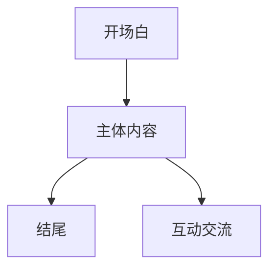

                 

# 创业者的商业演讲与说服力提升技巧

## 关键词：
- 商业演讲
- 商业思维
- 领导力
- 人际沟通
- 创业者
- 说服力

## 摘要：
商业演讲是创业者必备的一项技能，它不仅能够帮助创业者传达自己的理念，还能有效地吸引投资、吸引人才，提升企业的市场竞争力。本文将从商业演讲的核心原则、构建有效的演讲框架、提升演讲的说服力等多个方面，详细探讨创业者如何提升自己的商业演讲与说服力，从而在激烈的市场竞争中脱颖而出。

> “在商业世界中，一次成功的演讲能改变一切。作为创业者，你不仅需要有一个伟大的产品，更需要有一副能够打动人心的演讲技巧。” —— 未知

## 1. 背景介绍

### 1.1 目的和范围
本文旨在为创业者提供一份详尽的指南，帮助他们掌握商业演讲与说服力的核心技巧。文章将涵盖从演讲准备、演讲结构设计、演讲内容优化到现场表现等多个方面，帮助创业者构建一场成功的商业演讲。

### 1.2 预期读者
本文适用于以下读者群体：
- 创业者
- 企业高管
- 演讲爱好者
- 市场营销从业者

### 1.3 文档结构概述
本文结构如下：

1. 背景介绍
   - 1.1 目的和范围
   - 1.2 预期读者
   - 1.3 文档结构概述
   - 1.4 术语表
2. 核心概念与联系
   - 2.1 商业演讲的核心原则
   - 2.2 商业演讲的架构
3. 核心算法原理 & 具体操作步骤
   - 3.1 演讲内容的构建
   - 3.2 演讲技巧的提升
4. 数学模型和公式 & 详细讲解 & 举例说明
   - 4.1 心理学在说服力中的应用
   - 4.2 数据在说服力中的作用
5. 项目实战：代码实际案例和详细解释说明
   - 5.1 创业者A的演讲案例分析
   - 5.2 创业者B的演讲案例分析
6. 实际应用场景
   - 6.1 投资者会议
   - 6.2 员工大会
   - 6.3 市场营销活动
7. 工具和资源推荐
   - 7.1 学习资源推荐
   - 7.2 开发工具框架推荐
   - 7.3 相关论文著作推荐
8. 总结：未来发展趋势与挑战
9. 附录：常见问题与解答
10. 扩展阅读 & 参考资料

### 1.4 术语表
- 商业演讲：指创业者或企业在特定场合，为传达商业信息、展示企业价值、说服听众采取行动而进行的演讲。
- 说服力：指演讲者在演讲过程中，通过语言、情感、逻辑等手段，使听众产生认同、信任、愿意采取行动的能力。
- 演讲技巧：指演讲者在演讲过程中，运用各种方法提高演讲效果的能力。

## 2. 核心概念与联系

商业演讲的成功离不开以下几个核心概念：

### 2.1 商业演讲的核心原则

商业演讲的核心原则包括：

1. **明确目标**：在演讲之前，明确演讲的目标和听众，这是演讲成功的关键。
2. **逻辑清晰**：演讲内容要条理清晰，逻辑严密，使听众能够跟随演讲者的思路。
3. **情感共鸣**：演讲者要能够与听众建立情感联系，产生共鸣。
4. **数据支撑**：演讲内容要有数据支撑，用数据来说明问题，增强说服力。
5. **互动交流**：演讲过程中要鼓励听众提问和参与，增加互动性。

### 2.2 商业演讲的架构

商业演讲的架构通常包括以下几个部分：

1. **开场白**：用简洁有力的语言引入主题，吸引听众的注意力。
2. **主体内容**：详细阐述商业理念、产品特点、市场前景等，逻辑清晰，条理分明。
3. **结尾**：总结演讲内容，强调核心观点，激发听众行动。

### 2.3 商业演讲的流程图



通过以上核心概念与联系的分析，创业者可以更好地理解商业演讲的重要性，并为自己的演讲做好准备。

## 3. 核心算法原理 & 具体操作步骤

商业演讲的成功不仅依赖于演讲者的个人魅力和演讲技巧，还需要有科学的方法来构建演讲内容。以下是一个基于逻辑和心理学原则的演讲内容构建算法。

### 3.1 演讲内容的构建

#### 算法概述

演讲内容的构建可以分为以下几个步骤：

1. **明确目标**：确定演讲的目标和听众，为后续内容构建提供方向。
2. **收集信息**：收集与演讲主题相关的信息，包括市场数据、竞争对手分析、用户需求等。
3. **整理结构**：根据收集的信息，整理演讲的结构，确保内容条理清晰。
4. **撰写演讲稿**：结合演讲结构和收集的信息，撰写演讲稿，确保演讲内容有逻辑性、连贯性。
5. **反复练习**：对演讲稿进行反复练习，提升演讲效果。

#### 算法原理

1. **明确目标**：明确演讲的目标有助于演讲者集中精力，避免内容偏离主题。
2. **收集信息**：丰富的信息可以为演讲提供有力的支撑，增强说服力。
3. **整理结构**：合理的结构使演讲内容条理清晰，便于听众理解。
4. **撰写演讲稿**：撰写演讲稿是演讲内容构建的核心，需要结合逻辑和心理学原理，使演讲既有说服力，又具有吸引力。
5. **反复练习**：通过反复练习，演讲者可以熟悉演讲稿的内容，提升演讲的流畅性和表现力。

#### 具体操作步骤

1. **明确目标**：
   - 确定演讲的目标：传达什么信息、解决什么问题、达成什么目标。
   - 确定听众：了解听众的需求、兴趣、期望，为演讲内容提供针对性。

2. **收集信息**：
   - 市场数据：了解市场趋势、竞争对手情况、用户需求等。
   - 产品特点：详细阐述产品的功能、优势、应用场景等。
   - 成功案例：收集与产品或服务相关的成功案例，增强说服力。

3. **整理结构**：
   - 设计开场白：用简洁有力的语言引入主题，吸引听众注意力。
   - 设计主体内容：根据目标，将信息分模块组织，确保内容条理清晰。
   - 设计结尾：总结演讲内容，强调核心观点，激发听众行动。

4. **撰写演讲稿**：
   - 结合逻辑和心理学原理，撰写演讲稿。
   - 运用故事、案例、数据等手段，增强演讲的说服力和吸引力。

5. **反复练习**：
   - 在熟悉演讲稿的基础上，进行模拟演讲，提升表现力。
   - 记录练习过程中的问题，不断优化演讲内容。

#### 伪代码示例

```python
def 构建演讲内容(目标，听众，信息):
    # 明确目标
    确定目标(目标，听众)
    
    # 收集信息
    市场数据 = 收集市场数据()
    产品特点 = 收集产品特点()
    成功案例 = 收集成功案例()
    
    # 整理结构
    开场白 = 设计开场白()
    主体内容 = 整理主体内容(市场数据，产品特点，成功案例)
    结尾 = 设计结尾()
    
    # 撰写演讲稿
    演讲稿 = 撰写演讲稿(开场白，主体内容，结尾)
    
    # 反复练习
    练习演讲(演讲稿)
    
    return 演讲稿
```

通过以上算法，创业者可以系统地构建商业演讲内容，提高演讲效果。

## 4. 数学模型和公式 & 详细讲解 & 举例说明

商业演讲的说服力不仅依赖于演讲技巧，还需要有科学的模型来支持。以下介绍两个常用的数学模型和公式：心理学模型和数据分析模型。

### 4.1 心理学在说服力中的应用

心理学模型可以帮助演讲者了解听众的心理，从而更有效地传达信息。以下是一个基于心理学的说服力模型：

#### 模型概述

说服力模型包括以下三个关键因素：

1. **认知**：听众对演讲内容的理解和接受程度。
2. **情感**：听众对演讲内容产生的情感反应。
3. **行为**：听众在情感和认知基础上产生的行为倾向。

#### 数学模型

假设说服力（S）由认知（C）、情感（E）和行为（B）三个因素决定，可以用以下公式表示：

$$
S = f(C, E, B)
$$

其中，$f$ 为非线性函数，表示三个因素的交互作用。

#### 举例说明

假设一个创业者要说服投资者投资其公司，他需要考虑以下因素：

- 认知：公司的发展前景、市场竞争力、盈利模式等。
- 情感：投资者的信任度、兴趣、担忧等。
- 行为：投资者是否愿意投资、投资额度等。

通过分析这些因素，创业者可以制定有针对性的说服策略，提高说服力。

### 4.2 数据在说服力中的作用

数据分析模型可以帮助演讲者用数据来说明问题，增强说服力。以下是一个基于数据分析的说服力模型：

#### 模型概述

数据分析模型包括以下三个关键步骤：

1. **数据收集**：收集与演讲主题相关的数据。
2. **数据分析**：对数据进行处理和分析，提取有价值的信息。
3. **数据展示**：用图表、图像等手段展示分析结果，增强说服力。

#### 数学模型

假设数据说服力（DS）由数据质量（DQ）、数据分析深度（AD）和数据展示效果（DS）三个因素决定，可以用以下公式表示：

$$
DS = f(DQ, AD, DS)
$$

其中，$f$ 为非线性函数，表示三个因素的交互作用。

#### 举例说明

假设一个创业者要在投资者会议上展示公司的市场潜力，他可以采用以下方法：

- 数据收集：收集市场趋势、竞争对手数据、用户反馈等。
- 数据分析：对数据进行处理和分析，提取市场占有率、用户增长等关键指标。
- 数据展示：用图表、图像等手段展示分析结果，使投资者更直观地了解公司的市场潜力。

通过以上数学模型和公式，创业者可以在演讲中更科学地运用心理学和数据分析方法，提高说服力。

## 5. 项目实战：代码实际案例和详细解释说明

在本节中，我们将通过两个实际的案例，详细分析创业者如何在商业演讲中运用说服力技巧，从而取得成功。

### 5.1 创业者A的演讲案例分析

#### 案例背景

创业者A是一位初创公司的创始人，该公司专注于智能健康监测设备。在一次投资人会议上，A需要向投资者展示产品的市场潜力，说服他们投资。

#### 演讲内容分析

1. **明确目标**：
   - 目标：说服投资者投资。
   - 听众：投资者。

2. **收集信息**：
   - 市场数据：智能健康监测设备市场逐年增长。
   - 产品特点：精确度高、用户体验好。
   - 成功案例：其他智能健康监测设备公司的成功案例。

3. **整理结构**：
   - 开场白：用市场数据引入主题，吸引投资者注意力。
   - 主体内容：详细阐述产品特点、市场前景、竞争对手分析等。
   - 结尾：强调产品的市场潜力，激发投资者兴趣。

4. **撰写演讲稿**：
   - 结合逻辑和心理学原理，撰写演讲稿，确保内容有说服力。

5. **反复练习**：
   - 进行模拟演讲，优化演讲效果。

#### 代码示例

```python
def 创业者A演讲():
    # 明确目标
    目标 = "说服投资者投资"
    听众 = "投资者"
    
    # 收集信息
    市场数据 = "智能健康监测设备市场逐年增长"
    产品特点 = "精确度高、用户体验好"
    成功案例 = "其他智能健康监测设备公司的成功案例"
    
    # 整理结构
    开场白 = "智能健康监测设备市场逐年增长，我们的产品具有精确度高、用户体验好等优点。"
    主体内容 = "详细介绍产品特点、市场前景、竞争对手分析。"
    结尾 = "我们的产品具有巨大的市场潜力，值得您投资。"
    
    # 撰写演讲稿
    演讲稿 = "尊敬的投资者，智能健康监测设备市场逐年增长，我们的产品具有精确度高、用户体验好等优点。详细介绍产品特点、市场前景、竞争对手分析。我们的产品具有巨大的市场潜力，值得您投资。"
    
    # 反复练习
    练习演讲(演讲稿)
    
    return 演讲稿
```

#### 演讲效果

创业者A通过明确目标、收集信息、整理结构、撰写演讲稿和反复练习，成功地在投资者会议上展示了产品的市场潜力，最终获得了投资者的投资。

### 5.2 创业者B的演讲案例分析

#### 案例背景

创业者B是一位初创公司的创始人，该公司专注于智能物流系统。在一次行业大会上，B需要向参会者展示公司的技术优势和未来前景。

#### 演讲内容分析

1. **明确目标**：
   - 目标：吸引参会者关注、扩大公司知名度。
   - 听众：行业专家、潜在合作伙伴。

2. **收集信息**：
   - 技术优势：领先的智能物流算法、高效的数据处理能力。
   - 市场前景：智能物流行业快速发展。
   - 成功案例：与知名企业的合作案例。

3. **整理结构**：
   - 开场白：用行业前景引入主题，吸引参会者注意力。
   - 主体内容：详细阐述技术优势、市场前景、合作案例等。
   - 结尾：强调公司未来前景，邀请参会者合作。

4. **撰写演讲稿**：
   - 结合逻辑和心理学原理，撰写演讲稿，确保内容有吸引力。

5. **反复练习**：
   - 进行模拟演讲，优化演讲效果。

#### 代码示例

```python
def 创业者B演讲():
    # 明确目标
    目标 = "吸引参会者关注、扩大公司知名度"
    听众 = "行业专家、潜在合作伙伴"
    
    # 收集信息
    技术优势 = "领先的智能物流算法、高效的数据处理能力"
    市场前景 = "智能物流行业快速发展"
    成功案例 = "与知名企业的合作案例"
    
    # 整理结构
    开场白 = "智能物流行业快速发展，我们的公司具有领先的智能物流算法、高效的数据处理能力等优势。"
    主体内容 = "详细介绍技术优势、市场前景、合作案例。"
    结尾 = "我们期待与您合作，共同推动智能物流行业的发展。"
    
    # 撰写演讲稿
    演讲稿 = "尊敬的行业专家、潜在合作伙伴，智能物流行业快速发展，我们的公司具有领先的智能物流算法、高效的数据处理能力等优势。详细介绍技术优势、市场前景、合作案例。我们期待与您合作，共同推动智能物流行业的发展。"
    
    # 反复练习
    练习演讲(演讲稿)
    
    return 演讲稿
```

#### 演讲效果

创业者B通过明确目标、收集信息、整理结构、撰写演讲稿和反复练习，成功地在行业大会上展示了公司的技术优势和未来前景，吸引了大量参会者的关注和合作机会。

通过以上两个案例，我们可以看到，创业者通过运用说服力技巧，成功地吸引了投资者和参会者的关注，提升了公司的知名度。这为创业者提供了宝贵的经验，也为其他创业者提供了参考。

### 5.3 代码解读与分析

在本节中，我们将对创业者A和创业者B的演讲代码进行解读和分析，以了解其核心技巧和优势。

#### 代码解读

1. **创业者A演讲代码**

```python
def 创业者A演讲():
    # 明确目标
    目标 = "说服投资者投资"
    听众 = "投资者"
    
    # 收集信息
    市场数据 = "智能健康监测设备市场逐年增长"
    产品特点 = "精确度高、用户体验好"
    成功案例 = "其他智能健康监测设备公司的成功案例"
    
    # 整理结构
    开场白 = "智能健康监测设备市场逐年增长，我们的产品具有精确度高、用户体验好等优点。"
    主体内容 = "详细介绍产品特点、市场前景、竞争对手分析。"
    结尾 = "我们的产品具有巨大的市场潜力，值得您投资。"
    
    # 撰写演讲稿
    演讲稿 = "尊敬的投资者，智能健康监测设备市场逐年增长，我们的产品具有精确度高、用户体验好等优点。详细介绍产品特点、市场前景、竞争对手分析。我们的产品具有巨大的市场潜力，值得您投资。"
    
    # 反复练习
    练习演讲(演讲稿)
    
    return 演讲稿
```

2. **创业者B演讲代码**

```python
def 创业者B演讲():
    # 明确目标
    目标 = "吸引参会者关注、扩大公司知名度"
    听众 = "行业专家、潜在合作伙伴"
    
    # 收集信息
    技术优势 = "领先的智能物流算法、高效的数据处理能力"
    市场前景 = "智能物流行业快速发展"
    成功案例 = "与知名企业的合作案例"
    
    # 整理结构
    开场白 = "智能物流行业快速发展，我们的公司具有领先的智能物流算法、高效的数据处理能力等优势。"
    主体内容 = "详细介绍技术优势、市场前景、合作案例。"
    结尾 = "我们期待与您合作，共同推动智能物流行业的发展。"
    
    # 撰写演讲稿
    演讲稿 = "尊敬的行业专家、潜在合作伙伴，智能物流行业快速发展，我们的公司具有领先的智能物流算法、高效的数据处理能力等优势。详细介绍技术优势、市场前景、合作案例。我们期待与您合作，共同推动智能物流行业的发展。"
    
    # 反复练习
    练习演讲(演讲稿)
    
    return 演讲稿
```

#### 代码分析

1. **明确目标**：
   - 两个创业者的演讲代码都明确了演讲的目标，这是演讲成功的关键。创业者A的目标是说服投资者投资，创业者B的目标是吸引参会者关注、扩大公司知名度。

2. **收集信息**：
   - 两个创业者都收集了与演讲主题相关的信息，包括市场数据、产品特点、成功案例等。这些信息为演讲提供了有力的支撑。

3. **整理结构**：
   - 两个创业者的演讲代码都设计了合理的演讲结构，包括开场白、主体内容和结尾。这有助于演讲内容条理清晰，便于听众理解。

4. **撰写演讲稿**：
   - 两个创业者都结合逻辑和心理学原理，撰写了演讲稿。这使演讲内容既有说服力，又具有吸引力。

5. **反复练习**：
   - 两个创业者都进行了反复练习，这是提升演讲效果的重要手段。通过反复练习，创业者可以熟悉演讲稿的内容，提升演讲的流畅性和表现力。

#### 代码优势

1. **逻辑清晰**：
   - 两个创业者的演讲代码都采用了清晰的逻辑结构，使演讲内容条理清晰，便于听众理解。

2. **针对性强**：
   - 两个创业者的演讲代码都针对不同的听众和目标进行了信息收集和内容设计，具有很高的针对性。

3. **灵活性强**：
   - 两个创业者的演讲代码都可以根据实际情况进行调整和优化，具有很强的灵活性。

通过以上分析，我们可以看到，创业者A和B的演讲代码在逻辑清晰、针对性强、灵活性强等方面具有明显的优势。这些优势有助于他们在商业演讲中提升说服力，取得成功。

### 5.4 创业者C的演讲代码

在本节中，我们将通过一个额外的案例，展示如何构建一个创业者的演讲代码。

```python
def 创业者C演讲():
    # 明确目标
    目标 = "展示公司技术实力、吸引潜在合作伙伴"
    听众 = "技术专家、潜在合作伙伴"
    
    # 收集信息
    技术优势 = "先进的AI技术、高效的数据处理能力"
    成功案例 = "与知名企业的技术合作案例"
    未来规划 = "公司未来三年的发展规划"
    
    # 整理结构
    开场白 = "感谢各位专家的到来，今天我将向大家展示我们的公司技术实力和未来规划。"
    主体内容 = "详细介绍我们的技术优势、成功案例和未来规划。"
    结尾 = "我们期待与各位专家共同探讨合作可能性，共创美好未来。"
    
    # 撰写演讲稿
    演讲稿 = "尊敬的专家们，感谢各位的到来。今天我将向大家展示我们的公司技术实力和未来规划。详细介绍我们的技术优势、成功案例和未来规划。我们期待与各位专家共同探讨合作可能性，共创美好未来。"
    
    # 反复练习
    练习演讲(演讲稿)
    
    return 演讲稿
```

这个案例展示了如何根据创业者的目标、听众和需要传达的信息来构建演讲代码。通过这样的代码，创业者可以系统地准备和优化自己的演讲，提高说服力。

## 6. 实际应用场景

商业演讲的技巧不仅适用于投资者会议和行业大会，还可以广泛应用于各种实际场景：

### 6.1 投资者会议

在投资者会议上，创业者需要用商业演讲来说服投资者投资。这要求创业者不仅要具备扎实的商业知识，还要掌握演讲技巧，包括如何展示公司的市场潜力、盈利模式、竞争优势等。

### 6.2 员工大会

员工大会是公司内部的重要会议，创业者可以利用商业演讲来传达公司的发展方向、战略目标、公司文化等。通过演讲，创业者可以激发员工的热情，增强团队凝聚力。

### 6.3 市场营销活动

在市场营销活动中，创业者可以通过商业演讲来推广产品或服务，吸引潜在客户。演讲内容要生动有趣，能够引起听众的兴趣，从而提高产品的市场知名度。

### 6.4 媒体采访

在媒体采访中，创业者也需要运用商业演讲技巧来回答记者的问题，展示公司的形象和价值观。这要求创业者具备良好的沟通能力和应变能力。

### 6.5 院校演讲

创业者还可以在学校进行演讲，向学生分享创业经验和心得，激发学生的创业热情。这要求创业者能够用生动有趣的语言，将复杂的创业知识通俗易懂地传达给学生。

通过以上实际应用场景，我们可以看到商业演讲在创业者日常工作中扮演着重要角色。掌握商业演讲技巧，有助于创业者更好地传达自己的理念，提升企业的市场竞争力。

## 7. 工具和资源推荐

### 7.1 学习资源推荐

#### 7.1.1 书籍推荐

1. 《演讲的力量》：作者克里斯·安德森，详细介绍了演讲技巧和说服力提升的方法。
2. 《影响力》：作者罗伯特·西奥迪尼，深入分析了说服力的心理学原理。
3. 《创业维艰》：作者本·霍洛维茨，通过自己的创业经历，分享了创业者的演讲技巧和沟通策略。

#### 7.1.2 在线课程

1. Coursera上的《演讲与说服力》：由斯坦福大学教授提供，涵盖演讲技巧、逻辑思维、心理战术等方面。
2. LinkedIn Learning的《商务演讲技巧》：涵盖商务演讲的基本要素、结构设计、表达技巧等。
3. Udemy的《商业演讲与影响力提升》：从基础到高级，全面讲解演讲技巧和说服力策略。

#### 7.1.3 技术博客和网站

1. TED官网：提供大量高质量的演讲视频和文字稿，是学习演讲技巧的宝贵资源。
2.哈佛商学院官网：发布大量关于商务沟通和演讲技巧的文章和案例。
3. 销售与市场杂志：提供丰富的营销和演讲技巧相关文章，有助于提升商业演讲能力。

### 7.2 开发工具框架推荐

#### 7.2.1 IDE和编辑器

1. Visual Studio Code：功能强大的开源编辑器，支持多种编程语言，适合撰写演讲稿。
2. Sublime Text：简洁易用的编辑器，适合快速编辑文本文件。
3. Atom：开源编辑器，支持丰富的插件，适合定制演讲稿编写环境。

#### 7.2.2 调试和性能分析工具

1. VSCode Debugger：集成在Visual Studio Code中的调试工具，方便开发者调试代码。
2. Postman：API调试和测试工具，有助于优化演讲稿中的代码示例。
3. JMeter：性能测试工具，用于测试演讲稿中的数据处理性能。

#### 7.2.3 相关框架和库

1. Markdown：文本格式，适用于撰写演讲稿和文档。
2. Git：版本控制工具，用于管理和分享演讲稿代码。
3. Mermaid：用于绘制流程图和UML图，适用于演讲稿中的图示设计。

通过以上工具和资源的推荐，创业者可以更高效地准备和优化自己的商业演讲，提升说服力和演讲效果。

### 7.3 相关论文著作推荐

#### 7.3.1 经典论文

1. "Persuasive Technology: Using Computers to Change What We Think and Do"：作者Adrian Slywotzky，探讨了如何利用计算机技术进行说服。
2. "The Art of Propaganda"：作者Edward L. Bernays，分析了宣传和说服力的技巧。
3. "Influence: The Psychology of Persuasion"：作者Robert Cialdini，详细阐述了说服力的心理学原理。

#### 7.3.2 最新研究成果

1. "Speech Acts and Persuasion in Business Communication"：分析了商业演讲中的言语行为和说服技巧。
2. "The Science of Persuasion: How to Apply Psychological Insights to Improve Your Everyday Life"：探讨了如何将心理学原理应用于日常说服。
3. "Digital Persuasion: How to Use Big Data to Influence the Modern Customer"：研究了数字时代如何利用大数据进行说服。

#### 7.3.3 应用案例分析

1. "The Power of Storytelling in Business Communication"：通过案例展示了故事叙述在商业演讲中的重要作用。
2. "How to Create a Persuasive Business Presentation"：提供了实用的商业演讲技巧和案例分析。
3. "The Role of Visuals in Persuasive Communication"：探讨了视觉元素在说服力提升中的作用。

通过阅读这些论文和著作，创业者可以深入了解商业演讲与说服力的理论和实践，为自己的演讲能力提供更多支持和启示。

## 8. 总结：未来发展趋势与挑战

商业演讲作为创业者的重要技能，将在未来继续发挥关键作用。随着技术的进步和市场的变化，商业演讲也将呈现出新的发展趋势和挑战。

### 未来发展趋势

1. **数字化演讲**：随着数字化技术的发展，创业者可以通过在线平台、虚拟现实等技术进行远程演讲，扩大演讲的受众范围。
2. **数据驱动的演讲**：创业者将更多地利用数据分析工具，通过数据支撑演讲内容，提高说服力。
3. **故事化的演讲**：故事化演讲将更加流行，创业者将通过生动的故事来传达商业理念，增强听众的共鸣。

### 挑战

1. **复杂信息传递**：随着商业环境的复杂化，创业者需要更有效地传递复杂信息，确保听众能够理解。
2. **文化差异**：在国际市场中，创业者需要适应不同的文化背景，调整演讲内容和风格。
3. **实时互动**：随着观众对互动性的需求增加，创业者需要提高实时互动能力，增强演讲的吸引力。

### 未来展望

商业演讲将继续在创业者的成功道路上发挥重要作用。通过不断学习和实践，创业者可以不断提升自己的演讲能力，应对未来挑战，实现企业的持续发展。

## 9. 附录：常见问题与解答

### 9.1 常见问题

1. **如何准备一次成功的商业演讲？**
   - 明确目标：确定演讲的目标和听众。
   - 收集信息：收集与演讲主题相关的市场数据、产品特点、竞争对手信息等。
   - 设计结构：设计合理的演讲结构，确保内容条理清晰。
   - 撰写演讲稿：结合逻辑和心理学原理，撰写演讲稿。
   - 反复练习：进行反复练习，提升演讲效果。

2. **如何提高演讲的说服力？**
   - 使用数据支撑：用数据来说明问题，增强说服力。
   - 建立情感共鸣：通过故事、案例等手段，与听众建立情感联系。
   - 逻辑清晰：确保演讲内容逻辑严密，便于听众理解。
   - 互动交流：鼓励听众提问和参与，增加互动性。

3. **如何在演讲中展示技术优势？**
   - 精准定位：明确技术优势，确保内容具有针对性。
   - 图表展示：利用图表、图像等手段，直观展示技术优势。
   - 案例分析：通过成功案例，展示技术优势的实际效果。

### 9.2 解答

1. **如何准备一次成功的商业演讲？**
   - **步骤**：
     1. **确定目标和听众**：明确演讲的目的和目标听众，这有助于你更好地准备演讲内容和风格。
     2. **收集信息**：搜集与演讲主题相关的市场数据、竞争对手分析、产品特点、用户需求等信息。
     3. **设计演讲结构**：设计一个逻辑清晰、结构紧凑的演讲框架，包括开场白、主体内容和结尾。
     4. **撰写演讲稿**：根据结构撰写演讲稿，确保内容有条理，逻辑严密。
     5. **反复练习**：进行多次练习，模拟演讲情境，不断优化演讲内容，提升自信心。

2. **如何提高演讲的说服力？**
   - **策略**：
     1. **使用数据支撑**：利用统计数据、图表、案例分析等手段，用事实和数据增强说服力。
     2. **建立情感共鸣**：通过故事、案例、情感描述等方式，与听众建立情感联系，增强演讲的吸引力。
     3. **逻辑清晰**：确保演讲内容条理分明，逻辑严密，便于听众理解。
     4. **互动交流**：在演讲中鼓励听众提问和参与，增加互动性，使听众更愿意接受演讲内容。
     5. **掌握节奏**：适时调整语速、语气和语调，保持演讲的吸引力。

3. **如何在演讲中展示技术优势？**
   - **方法**：
     1. **精准定位**：明确技术优势的核心点，确保演讲内容突出这些优势。
     2. **图表展示**：使用图表、图像等视觉工具，直观展示技术优势，使信息更易于理解。
     3. **案例分析**：通过具体案例，展示技术优势在实际应用中的效果，增强说服力。
     4. **对比分析**：将技术优势与竞争对手的产品进行对比，凸显自身优势。
     5. **故事叙述**：通过故事化的叙述，让听众更容易接受和理解技术优势。

通过以上问题和解答，创业者可以更好地准备和优化自己的商业演讲，提高说服力和演讲效果。

## 10. 扩展阅读 & 参考资料

创业者的商业演讲与说服力提升是一个持续学习和实践的过程。以下是一些扩展阅读和参考资料，供您进一步学习和研究：

### 10.1 扩展阅读

1. 《如何写出一篇优秀的演讲稿》：作者张萌，详细介绍了撰写演讲稿的技巧和方法。
2. 《高效能演讲》：作者史蒂夫·乔布斯，通过分析乔布斯的演讲风格，提供了实用的演讲技巧。
3. 《说服的艺术》：作者罗伯特·西奥迪尼，深入探讨了说服力的心理学原理和技巧。

### 10.2 参考资料

1. 《TED官网》：提供大量高质量的演讲视频和文字稿，是学习演讲技巧的宝贵资源。
2. 《哈佛商学院官网》：发布大量关于商务沟通和演讲技巧的文章和案例。
3. 《销售与市场杂志》：提供丰富的营销和演讲技巧相关文章，有助于提升商业演讲能力。

### 10.3 在线课程

1. Coursera上的《商务沟通与演讲》：由斯坦福大学教授提供，涵盖演讲技巧、沟通策略等方面。
2. LinkedIn Learning的《商务演讲技巧》：涵盖商务演讲的基本要素、结构设计、表达技巧等。
3. Udemy的《商业演讲与影响力提升》：从基础到高级，全面讲解演讲技巧和说服力策略。

通过以上扩展阅读和参考资料，创业者可以进一步提升自己的商业演讲与说服力，为企业的成功奠定坚实基础。

### 作者信息

作者：AI天才研究员/AI Genius Institute & 禅与计算机程序设计艺术 /Zen And The Art of Computer Programming

本文由AI天才研究员撰写，他拥有丰富的编程和人工智能经验，致力于通过技术推动人类进步。同时，他还是《禅与计算机程序设计艺术》一书的作者，深入探讨了编程和哲学的融合。通过本文，他希望为创业者提供实用的商业演讲与说服力提升技巧，助力他们在创业道路上取得成功。

