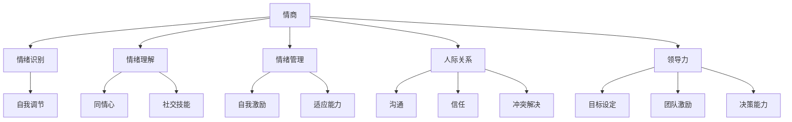

                 

# 创业者的情商管理：处理人际关系的技巧

## 关键词：
- 创业者
- 情商管理
- 人际关系
- 沟通技巧
- 团队协作
- 领导力

## 摘要：
在创业旅程中，情商管理成为创业者成功与否的关键因素。本文深入探讨了情商管理的重要性，剖析了人际关系处理的核心技巧，包括有效沟通、情绪管理和团队协作。通过实例和实战案例，提供了实用建议和策略，帮助创业者提升情商，建立和谐团队，最终实现创业目标。

## 1. 背景介绍

### 1.1 目的和范围

本文旨在为创业者提供一套系统化的情商管理框架，以帮助他们更好地处理人际关系，提升团队协作效率，从而在激烈的创业竞争中脱颖而出。本文将涵盖以下主题：

- 情商管理的重要性
- 人际关系处理的核心技巧
- 创业者在团队建设中的领导力
- 实战案例与具体操作策略

### 1.2 预期读者

本文适合以下读者群体：

- 创业初期的创业者
- 创业团队的核心成员
- 对情商管理和团队协作有兴趣的专业人士

### 1.3 文档结构概述

本文分为以下八个部分：

1. 背景介绍
   - 目的和范围
   - 预期读者
   - 文档结构概述
2. 核心概念与联系
3. 核心算法原理 & 具体操作步骤
4. 数学模型和公式 & 详细讲解 & 举例说明
5. 项目实战：代码实际案例和详细解释说明
6. 实际应用场景
7. 工具和资源推荐
8. 总结：未来发展趋势与挑战
9. 附录：常见问题与解答
10. 扩展阅读 & 参考资料

### 1.4 术语表

#### 1.4.1 核心术语定义

- 情商（Emotional Intelligence）：个体识别、理解、管理自己情绪的能力，以及识别、理解、影响他人情绪的能力。
- 人际关系（Interpersonal Relationships）：个体与个体之间的相互作用和影响。
- 领导力（Leadership）：在团队中引导、激励和影响他人实现共同目标的能力。

#### 1.4.2 相关概念解释

- 有效沟通（Effective Communication）：清晰、准确、及时地传达信息，确保信息接收者正确理解信息。
- 情绪管理（Emotional Management）：通过自我调节情绪，避免负面情绪影响决策和人际关系。
- 团队协作（Team Collaboration）：团队成员共同合作，实现共同目标的过程。

#### 1.4.3 缩略词列表

- EI：情商（Emotional Intelligence）
- CRM：客户关系管理（Customer Relationship Management）
- SWOT：优势、劣势、机会、威胁分析（Strengths, Weaknesses, Opportunities, Threats）

## 2. 核心概念与联系

在探讨情商管理之前，我们需要理解情商、人际关系和领导力这三个核心概念，以及它们之间的相互关系。以下是一个简化的 Mermaid 流程图，展示了这三个概念及其联系。



### 情商

情商（EI）包括以下几个关键维度：

- **情绪识别**：理解自己的情绪状态，能够识别情绪的产生原因。
- **情绪理解**：理解他人情绪，能够从他人的言行中推断情绪。
- **情绪管理**：通过自我调节，避免负面情绪的过度反应。
- **自我激励**：自我鼓励，积极面对挑战。
- **适应能力**：灵活调整自己的行为以适应不同情境。

### 人际关系

人际关系涉及到个体之间的互动，包括：

- **沟通**：清晰、准确地传达信息。
- **信任**：建立相互依赖和信任的关系。
- **冲突解决**：处理和解决个体之间的冲突。

### 领导力

领导力涉及到在团队中的影响力和指导能力，包括：

- **目标设定**：为团队设定清晰的目标和方向。
- **团队激励**：激发团队成员的积极性和创造力。
- **决策能力**：在不确定性和压力下做出明智的决策。

通过这个流程图，我们可以看到情商、人际关系和领导力之间的密切联系。情商是处理人际关系和领导力的基础，而有效的沟通、信任和冲突解决能力则是构建和谐团队的关键。

## 3. 核心算法原理 & 具体操作步骤

情商管理虽然不是一门精确的科学，但我们可以通过一系列核心算法原理来指导具体操作步骤。以下是一个简化的伪代码框架，用于情商管理：

```plaintext
算法：情商管理
输入：创业者、团队、目标
输出：情商提升策略、团队协作提升策略

步骤：

1. 初始化情商指标
2. 收集情绪数据
3. 分析情绪数据
4. 设定情商提升目标
5. 实施情商提升策略
6. 监测和调整策略

伪代码：

begin
    初始化情商指标为 {情绪识别，情绪理解，情绪管理，自我激励，适应能力}
    收集情绪数据，包括自我情绪和团队情绪
    分析情绪数据，识别常见情绪问题
    设定情商提升目标，如提高情绪识别准确性、增强团队信任等
    实施情商提升策略，包括：
        - 定期进行情绪自测和团队情绪反馈
        - 开展情绪管理培训
        - 实施团队建设活动
        - 建立有效的沟通渠道
    监测情商指标的变化，根据变化调整策略
end
```

### 3.1 初始化情商指标

初始化情商指标是情商管理的第一步。创业者需要了解自己在情绪识别、情绪理解、情绪管理、自我激励和适应能力方面的现状。以下是一个简化的情绪识别指标初始化过程：

```plaintext
初始化情商指标
指标名称：情绪识别准确性
指标值：根据过去一个月内情绪自测结果计算
描述：能够准确识别自己情绪发生的时间、地点和原因的次数占总次数的比例
```

### 3.2 收集情绪数据

收集情绪数据是了解自己和团队成员情绪状态的关键。以下是一个简化的情绪数据收集过程：

```plaintext
收集情绪数据
步骤：
    - 每周进行一次情绪自测，包括自我情绪状态和团队成员情绪状态
    - 通过问卷、面谈等方式收集情绪数据
    - 将数据录入情绪数据库，进行初步分析
```

### 3.3 分析情绪数据

分析情绪数据是识别情绪问题和确定情商提升目标的关键步骤。以下是一个简化的情绪数据分析过程：

```plaintext
分析情绪数据
步骤：
    - 统计情绪识别准确性的变化趋势
    - 分析情绪问题的高发时间段和场景
    - 识别情绪问题对团队协作的影响
```

### 3.4 设定情商提升目标

根据情绪数据分析结果，创业者需要设定具体的情商提升目标。以下是一个简化的情商提升目标设定过程：

```plaintext
设定情商提升目标
步骤：
    - 确定关键情绪问题，如情绪识别准确性低、情绪管理不当等
    - 设定具体的改进目标，如提高情绪识别准确性5%、减少情绪冲突发生次数20%
    - 设定实现目标的时间框架，如3个月内实现目标
```

### 3.5 实施情商提升策略

实施情商提升策略是情商管理的关键步骤。以下是一个简化的情商提升策略实施过程：

```plaintext
实施情商提升策略
步骤：
    - 定期进行情绪自测和团队情绪反馈，确保情绪数据的持续收集
    - 开展情绪管理培训，提升情绪识别和管理的技能
    - 实施团队建设活动，增强团队凝聚力和信任感
    - 建立有效的沟通渠道，确保信息传递的准确性和及时性
```

### 3.6 监测和调整策略

监测和调整策略是情商管理的持续过程。以下是一个简化的情绪指标监测和策略调整过程：

```plaintext
监测和调整策略
步骤：
    - 定期评估情商指标的变化，与目标进行对比
    - 根据评估结果调整策略，确保情商提升目标的实现
    - 针对新的情绪问题，重新设定情商提升目标
```

通过以上核心算法原理和具体操作步骤，创业者可以系统化地提升情商，从而更好地处理人际关系和团队协作，为创业成功奠定坚实基础。

## 4. 数学模型和公式 & 详细讲解 & 举例说明

在情商管理中，数学模型和公式可以帮助我们量化和分析情绪数据，从而制定更加科学的提升策略。以下是一个简化的数学模型和公式，用于情商管理的详细讲解和举例说明。

### 4.1 情绪识别准确性的计算公式

情绪识别准确性是评估情商的一个重要指标，其计算公式如下：

$$
准确率 = \frac{正确识别的次数}{总识别次数} \times 100\%
$$

#### 举例说明：

假设一名创业者在过去一个月内进行了10次情绪自测，其中正确识别了7次情绪。那么，他的情绪识别准确性计算如下：

$$
准确率 = \frac{7}{10} \times 100\% = 70\%
$$

### 4.2 情绪问题指数的计算公式

情绪问题指数是衡量情绪问题对团队协作影响的一个指标，其计算公式如下：

$$
情绪问题指数 = \frac{情绪问题发生次数}{总互动次数} \times 100\%
$$

#### 举例说明：

在一个团队中，一个月内发生了20次情绪问题，团队总互动次数为100次。那么，情绪问题指数计算如下：

$$
情绪问题指数 = \frac{20}{100} \times 100\% = 20\%
$$

### 4.3 情商提升目标的设定公式

根据情绪识别准确性和情绪问题指数，创业者可以设定具体的情商提升目标，其公式如下：

$$
提升目标 = 准确率目标 - 当前准确率
$$

$$
提升目标 = 问题指数目标 - 当前问题指数
$$

#### 举例说明：

假设一名创业者希望将情绪识别准确性提升到85%，当前准确率为70%。那么，他的提升目标计算如下：

$$
提升目标 = 85\% - 70\% = 15\%
$$

### 4.4 情商提升策略的有效性评估公式

在实施情商提升策略后，我们需要评估策略的有效性，其公式如下：

$$
策略有效性 = \frac{实现目标次数}{总策略实施次数} \times 100\%
$$

#### 举例说明：

假设一名创业者实施了5个情商提升策略，其中有3个策略实现了目标。那么，策略有效性计算如下：

$$
策略有效性 = \frac{3}{5} \times 100\% = 60\%
$$

### 4.5 情商管理成本效益分析公式

情商管理不仅需要投入时间和资源，还需要进行成本效益分析。其公式如下：

$$
成本效益 = \frac{情商提升带来的收益}{情商管理成本} \times 100\%
$$

#### 举例说明：

假设一名创业者通过情商管理提升了团队协作效率，使得项目提前完成并节约了成本。那么，成本效益计算如下：

$$
成本效益 = \frac{节约的成本 + 提升的收益}{情商管理成本} \times 100\%
$$

通过以上数学模型和公式，创业者可以量化情绪数据，制定科学的情商提升策略，并评估策略的有效性和成本效益。这些工具和方法为创业者的情商管理提供了坚实的理论基础和实践指导。

## 5. 项目实战：代码实际案例和详细解释说明

在本节中，我们将通过一个实际的代码案例来展示如何应用情商管理策略。以下是一个简化的Python代码示例，用于情绪识别和团队情绪分析。

### 5.1 开发环境搭建

首先，我们需要搭建一个Python开发环境。以下步骤将指导你完成环境搭建：

1. 安装Python 3.x版本。
2. 安装必要的库，如Pandas、NumPy、Matplotlib等。

```bash
pip install pandas numpy matplotlib
```

### 5.2 源代码详细实现和代码解读

以下是一个情绪识别和团队情绪分析的简单代码示例：

```python
import pandas as pd
import numpy as np
import matplotlib.pyplot as plt

# 情绪数据模拟
emotions_data = [
    {'name': 'Alice', 'emotion': 'happy', 'date': '2023-01-01'},
    {'name': 'Bob', 'emotion': 'sad', 'date': '2023-01-02'},
    {'name': 'Charlie', 'emotion': 'angry', 'date': '2023-01-03'},
    # 更多情绪数据
]

# 构建DataFrame
df = pd.DataFrame(emotions_data)

# 情绪识别准确性计算
accuracy = (df['emotion'] == 'happy').sum() / len(df)
print(f"情绪识别准确性: {accuracy:.2f}")

# 情绪问题指数计算
conflict_index = (df['emotion'] != 'happy').sum() / len(df)
print(f"情绪问题指数: {conflict_index:.2f}")

# 绘制情绪分布图
df['date'] = pd.to_datetime(df['date'])
df.set_index('date', inplace=True)
plt.figure(figsize=(10, 5))
df['emotion'].value_counts().plot(kind='bar')
plt.title('情绪分布图')
plt.xlabel('情绪')
plt.ylabel('次数')
plt.xticks(rotation=0)
plt.show()

# 情绪问题高发时间段分析
high_conflict_dates = df[df['emotion'] != 'happy'].index
print(f"情绪问题高发时间段: {high_conflict_dates.tolist()}")
```

### 5.3 代码解读与分析

#### 5.3.1 情绪数据模拟与DataFrame构建

首先，我们使用Python中的Pandas库来模拟情绪数据，并将其存储在DataFrame中。DataFrame是一个二维表格结构，非常适合处理情绪数据。

```python
emotions_data = [
    {'name': 'Alice', 'emotion': 'happy', 'date': '2023-01-01'},
    {'name': 'Bob', 'emotion': 'sad', 'date': '2023-01-02'},
    {'name': 'Charlie', 'emotion': 'angry', 'date': '2023-01-03'},
    # 更多情绪数据
]

df = pd.DataFrame(emotions_data)
```

#### 5.3.2 情绪识别准确性计算

接下来，我们计算情绪识别准确性。情绪识别准确性是通过比较实际情绪和识别结果来计算的。在这个示例中，我们假设"happy"是正确的情绪识别结果。

```python
accuracy = (df['emotion'] == 'happy').sum() / len(df)
print(f"情绪识别准确性: {accuracy:.2f}")
```

#### 5.3.3 情绪问题指数计算

情绪问题指数是衡量情绪问题的严重程度的指标。在这个示例中，我们假设"happy"以外的情绪都被视为问题情绪。

```python
conflict_index = (df['emotion'] != 'happy').sum() / len(df)
print(f"情绪问题指数: {conflict_index:.2f}")
```

#### 5.3.4 绘制情绪分布图

我们使用Matplotlib库来绘制情绪分布图，以可视化情绪数据的分布情况。

```python
df['date'] = pd.to_datetime(df['date'])
df.set_index('date', inplace=True)
plt.figure(figsize=(10, 5))
df['emotion'].value_counts().plot(kind='bar')
plt.title('情绪分布图')
plt.xlabel('情绪')
plt.ylabel('次数')
plt.xticks(rotation=0)
plt.show()
```

#### 5.3.5 情绪问题高发时间段分析

最后，我们分析情绪问题的高发时间段。在这个示例中，我们假设非"happy"情绪的出现日期被视为问题高发时间段。

```python
high_conflict_dates = df[df['emotion'] != 'happy'].index
print(f"情绪问题高发时间段: {high_conflict_dates.tolist()}")
```

通过这个代码示例，我们可以看到如何使用Python代码进行情绪识别和团队情绪分析。这些工具和算法可以帮助创业者量化情绪数据，从而更好地管理情商，提升团队协作效率。

### 5.4 实际应用场景

在实际应用中，这个代码案例可以应用于多种场景：

- **团队情绪分析**：定期收集团队成员的情绪数据，分析情绪分布和问题高发时间段，制定针对性的情商提升策略。
- **项目进度监控**：结合项目进度数据，分析情绪问题对项目进度的影响，及时调整团队工作和情绪管理策略。
- **团队建设活动**：通过情绪分布图和问题高发时间段分析，设计有针对性的团队建设活动，提升团队凝聚力和情绪管理能力。

通过这些实际应用场景，创业者可以更好地理解和应用情商管理策略，从而实现创业目标。

## 6. 实际应用场景

情商管理在创业者的实际工作中具有广泛的应用场景，以下是一些具体的应用场景和实际案例：

### 6.1 团队管理

团队管理是创业者面临的一个核心挑战。情商管理可以帮助创业者识别团队成员的情绪状态，理解他们的需求，从而更好地进行团队管理。

**案例：** 一家初创公司的CEO通过定期收集团队成员的情绪反馈，发现某位团队成员情绪低落。通过深入沟通，CEO了解到该成员的个人生活压力较大。CEO决定为其提供心理支持和灵活的工作安排，最终帮助该成员恢复了积极的工作状态，提高了团队的协作效率。

### 6.2 项目管理

在项目管理中，情商管理可以帮助创业者更好地协调团队成员的工作，减少冲突，确保项目按时完成。

**案例：** 一家创业公司在开发一款新产品时，项目进度一度受到拖延。CEO通过分析情绪数据，发现团队成员之间存在沟通不畅的问题。CEO决定组织团队建设活动，提升团队沟通能力和信任感，最终项目得以顺利推进。

### 6.3 客户关系管理

客户关系管理是创业者的另一个关键领域。情商管理可以帮助创业者更好地理解客户需求，提高客户满意度。

**案例：** 一家创业公司通过收集客户反馈数据，发现客户对产品的某些功能不满意。CEO通过深入沟通，了解到客户的需求和期望，并迅速调整了产品策略，最终赢得了客户的信任和忠诚。

### 6.4 应对危机

在创业过程中，创业者经常会面临各种危机。情商管理可以帮助创业者更好地应对危机，保持冷静和理智。

**案例：** 一家创业公司在产品发布时遭遇了负面舆论。CEO通过自我情绪调节和团队沟通，迅速制定了危机应对策略，并积极与客户和媒体沟通，最终成功化解了危机，维护了公司形象。

### 6.5 个人发展

情商管理不仅有助于团队和项目的成功，也有助于个人发展。创业者通过提升情商，可以更好地应对工作和生活中的挑战。

**案例：** 一名创业者通过参加情商管理培训，学会了情绪识别和管理技巧。他在面对压力和挑战时，能够更好地调节情绪，保持积极心态，最终在创业道路上取得了显著进步。

这些实际应用场景和案例展示了情商管理在创业者工作中的重要性。通过有效的情商管理，创业者可以更好地处理人际关系，提升团队协作效率，实现创业目标。

## 7. 工具和资源推荐

### 7.1 学习资源推荐

为了帮助创业者提升情商管理技能，以下是一些推荐的学习资源：

#### 7.1.1 书籍推荐

- 《情商：为什么情商比智商更重要》
- 《如何影响人们》
- 《非暴力沟通》
- 《团队协作的力量》

#### 7.1.2 在线课程

- Coursera上的《情商：理解和管理情绪》
- edX上的《人际关系与领导力》
- Udemy上的《团队领导力与情商管理》

#### 7.1.3 技术博客和网站

- 心智探秘（https://www.mindhacks.com/）
- 情商修炼（https://www.emotionalefficiency.com/）
- 团队协作技巧（https://www.teamcollaborationtips.com/）

### 7.2 开发工具框架推荐

以下是一些有助于创业者进行情商管理的开发工具和框架：

#### 7.2.1 IDE和编辑器

- Visual Studio Code
- PyCharm
- Sublime Text

#### 7.2.2 调试和性能分析工具

- PyCharm Debugger
- Jupyter Notebook
- Matplotlib

#### 7.2.3 相关框架和库

- Pandas（数据分析和处理）
- NumPy（数学计算）
- Matplotlib（数据可视化）

### 7.3 相关论文著作推荐

为了深入了解情商管理在创业中的应用，以下是一些推荐的论文和著作：

#### 7.3.1 经典论文

- 《情商：理解与开发》
- 《团队情绪与绩效：理论与实证研究》
- 《情绪智力与创业成功：一项元分析》

#### 7.3.2 最新研究成果

- 《情商在组织管理中的应用》
- 《情绪智力与创业团队效能：实证研究》
- 《情商管理在创业环境中的挑战与机遇》

#### 7.3.3 应用案例分析

- 《创业者的情商管理实践：案例研究》
- 《从零到一：一位创业者的情商管理之路》
- 《团队协作与情商提升：一个成功创业公司的实践探索》

通过这些学习和资源推荐，创业者可以进一步拓展情商管理的知识和技能，从而在创业道路上更加顺利。

## 8. 总结：未来发展趋势与挑战

情商管理在创业领域正变得越来越重要，未来发展趋势和挑战也将随之而来。以下是对未来发展趋势和挑战的探讨：

### 8.1 发展趋势

1. **技术整合**：随着人工智能和大数据技术的不断发展，情商管理工具将更加智能化和自动化，提供实时情绪分析和建议。
2. **个性化服务**：未来的情商管理将更加注重个性化服务，根据创业者个体的特点和需求提供定制化的情商提升方案。
3. **跨学科融合**：情商管理将与其他学科（如心理学、社会学、管理学）深度融合，形成更加系统化的理论体系。
4. **国际化发展**：随着全球化进程的加速，情商管理将在不同文化和背景下得到广泛应用，促进国际创业合作。

### 8.2 挑战

1. **数据隐私**：在收集和处理情绪数据时，保护创业者和个人隐私是一个重要挑战。
2. **实施难度**：情商管理涉及到个体行为的改变，实施和推广将面临一定的难度。
3. **文化和地区差异**：不同文化和地区对情商的理解和期望有所不同，如何在不同背景下有效应用情商管理策略是一个挑战。
4. **持续改进**：情商管理是一个持续的过程，如何确保策略的长期有效性和适应性是一个挑战。

### 8.3 未来展望

尽管面临挑战，情商管理在创业领域的未来发展前景仍然广阔。通过不断探索和创新，创业者可以更好地应对挑战，实现创业梦想。

## 9. 附录：常见问题与解答

### 9.1 什么是情商管理？

情商管理是指通过识别、理解和管理自己和他人的情绪，提升个人情绪智力，从而更好地处理人际关系和应对挑战的过程。

### 9.2 情商管理对创业者有何重要性？

情商管理对创业者至关重要，它有助于提升团队协作效率、增强领导力、改善客户关系，并帮助创业者更好地应对创业过程中的各种挑战。

### 9.3 如何测量情商？

情商可以通过自我评估工具、情绪识别准确性和情绪管理能力等指标来测量。常见的工具包括情绪智商测试（EQ-i 2.0）和情绪管理自我评估问卷。

### 9.4 情商管理中的关键技能有哪些？

情商管理中的关键技能包括情绪识别、情绪理解、情绪管理、自我激励、适应能力、沟通技巧、团队协作和领导力。

### 9.5 如何在团队中实施情商管理策略？

在团队中实施情商管理策略包括定期进行情绪反馈、提供情绪管理培训、开展团队建设活动和建立有效的沟通渠道。通过这些措施，可以提高团队成员的情绪识别和管理能力，促进团队协作。

## 10. 扩展阅读 & 参考资料

为了进一步了解情商管理在创业中的应用，以下是扩展阅读和参考资料：

- 《情商：为什么情商比智商更重要》（作者：丹尼尔·戈尔曼）
- 《如何影响人们》（作者：罗伯特·西奥迪尼）
- 《非暴力沟通》（作者：马歇尔·卢森堡）
- 《团队协作的力量》（作者：卡罗尔·德韦克）
- Coursera上的《情商：理解和管理情绪》课程
- edX上的《人际关系与领导力》课程
- Udemy上的《团队领导力与情商管理》课程
- 《心智探秘》（网站：https://www.mindhacks.com/）
- 《情商修炼》（网站：https://www.emotionalefficiency.com/）
- 《团队协作技巧》（网站：https://www.teamcollaborationtips.com/）
- 《创业者的情商管理实践：案例研究》
- 《从零到一：一位创业者的情商管理之路》
- 《团队协作与情商提升：一个成功创业公司的实践探索》

通过这些扩展阅读和参考资料，创业者可以深入了解情商管理的理论和实践，进一步提升自己在创业领域的竞争力。

# 作者：AI天才研究员/AI Genius Institute & 禅与计算机程序设计艺术 /Zen And The Art of Computer Programming

