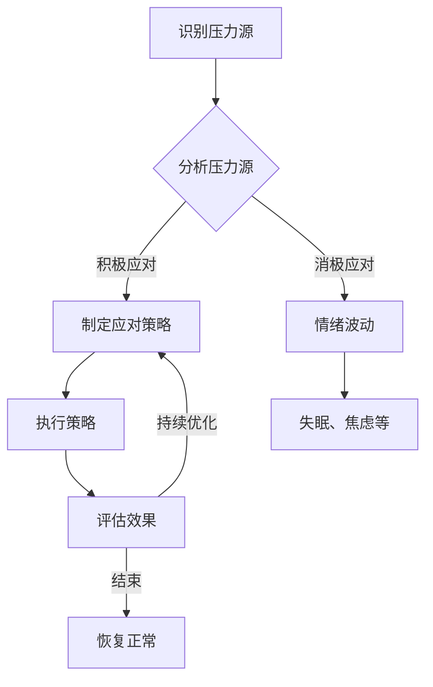

                 

# 创业者的抗压能力：面对不确定性的方法

## 关键词：
创业、抗压能力、不确定性、策略、方法、心理素质、技术实践

## 摘要：
本文将深入探讨创业者在面对不确定性时的抗压能力，如何通过科学的策略和有效的方法来提升自身心理素质，从而在创业过程中更加从容应对各种挑战。文章首先介绍创业者的背景与面临的压力，然后分析抗压能力的重要性，接着探讨应对不确定性的核心方法，结合实际技术案例进行详细解释，并推荐相关的工具和资源，最后总结未来发展趋势与挑战，为创业者提供全面的支持和指导。

## 1. 背景介绍

### 1.1 目的和范围

本文旨在为创业者提供一套面对不确定性的抗压能力提升策略，通过深入分析创业过程中的压力源和应对方法，帮助创业者建立强大的心理防线，提高在复杂环境中的应对能力。

本文将围绕以下主题进行讨论：
- 创业者面临的压力来源和表现形式
- 压力对创业者的影响及其危害
- 提升抗压能力的核心方法
- 实际案例中的应用与技术实践
- 相关工具和资源的推荐

### 1.2 预期读者

本文面向希望提升抗压能力的创业者、企业高管以及相关领域的技术和管理人员。无论您是初出茅庐的创业者，还是已经有一定经验的职业人士，本文都将为您提供有价值的指导和借鉴。

### 1.3 文档结构概述

本文结构如下：
1. 背景介绍：介绍文章的目的、范围和预期读者。
2. 核心概念与联系：阐述抗压能力的核心概念，提供Mermaid流程图。
3. 核心算法原理 & 具体操作步骤：详细讲解提升抗压能力的方法，使用伪代码进行说明。
4. 数学模型和公式 & 详细讲解 & 举例说明：使用LaTeX格式介绍相关数学模型。
5. 项目实战：代码实际案例和详细解释说明。
6. 实际应用场景：探讨抗压能力在不同领域的应用。
7. 工具和资源推荐：推荐学习资源、开发工具和框架。
8. 总结：未来发展趋势与挑战。
9. 附录：常见问题与解答。
10. 扩展阅读 & 参考资料：提供相关文献和资源。

### 1.4 术语表

#### 1.4.1 核心术语定义
- 压力：身体或心理上对某种刺激的反应。
- 抗压能力：指个体在面对压力时保持心理平衡和有效应对的能力。
- 创业者：指创立并经营企业的个人。

#### 1.4.2 相关概念解释
- 心理素质：指个体在心理活动中表现出来的相对稳定的心理特征和水平。
- 不确定性：指未来事件或结果的不可预知性。

#### 1.4.3 缩略词列表
- IDE：集成开发环境（Integrated Development Environment）
- LaTeX：一种基于TeX的排版系统

## 2. 核心概念与联系

在探讨创业者的抗压能力之前，我们需要明确几个核心概念及其相互关系。

### 2.1 压力的来源与表现

压力可以来自多个方面，如工作压力、财务压力、人际关系压力等。在创业过程中，以下因素尤为突出：

1. **市场需求变化**：创业过程中，市场需求可能会迅速变化，导致创业者必须不断调整战略。
2. **竞争压力**：市场竞争激烈，创业者需要不断优化产品和服务，以保持竞争力。
3. **财务压力**：初创企业通常面临资金不足的问题，创业者需要有效管理资金，以确保企业的持续运营。

这些压力会以以下形式表现：

- **焦虑**：对未来的不确定性和可能失败的担忧。
- **情绪波动**：在面临压力时，情绪容易产生剧烈波动。
- **失眠**：长期处于高压状态下，创业者可能会出现失眠等问题。

### 2.2 抗压能力的重要性

抗压能力在创业过程中具有重要意义：

1. **心理平衡**：有助于创业者保持冷静，做出理性决策。
2. **情绪管理**：帮助创业者应对焦虑和情绪波动，提高生活质量。
3. **工作效率**：抗压能力强的创业者能更好地应对压力，从而提高工作效率。
4. **持续发展**：在面对不确定性时，抗压能力能帮助创业者更好地应对挑战，促进企业持续发展。

### 2.3 应对不确定性的核心方法

提升抗压能力的关键在于以下方法：

1. **心理素质训练**：通过心理训练，如冥想、正念等，提高心理素质。
2. **时间管理**：合理安排时间，减少工作压力。
3. **资源整合**：积极整合内外部资源，提高应对不确定性的能力。
4. **持续学习**：不断学习新知识、新技能，以应对不断变化的市场需求。

### 2.4 Mermaid流程图

以下是一个简单的Mermaid流程图，用于描述创业者在面对压力时的应对流程：



## 3. 核心算法原理 & 具体操作步骤

### 3.1 抗压能力提升算法原理

提升抗压能力的核心算法基于以下几个原则：

1. **心理素质训练**：通过冥想、正念等方法，提高心理承受能力。
2. **时间管理**：合理安排时间，减少工作压力。
3. **资源整合**：积极整合内外部资源，提高应对不确定性的能力。
4. **持续学习**：不断学习新知识、新技能，以应对不断变化的市场需求。

### 3.2 伪代码实现

以下是一个简单的伪代码，用于描述提升抗压能力的具体操作步骤：

```plaintext
// 初始化参数
设定训练周期 T
设定每日训练时长 t
设定学习时间占比 l

// 心理素质训练
每天执行冥想 t 分钟
每天执行正念练习 t 分钟

// 时间管理
计算每周工作时长 w
如果 w > 40 小时，则提醒调整工作时间
如果 w <= 40 小时，则保持当前工作时间

// 资源整合
每月评估内部资源利用率 r
如果 r < 70%，则进行资源整合优化
如果 r >= 70%，则保持当前资源利用率

// 持续学习
每周学习新知识 l 小时
每月参加相关培训课程

// 评估与反馈
每周评估抗压能力提升情况
每月进行心理素质评估
根据评估结果，调整训练计划
```

## 4. 数学模型和公式 & 详细讲解 & 举例说明

### 4.1 数学模型

为了更科学地评估抗压能力，我们可以引入以下数学模型：

1. **抗压能力指数（AI）**：用于量化抗压能力，公式如下：

   $$ AI = \frac{PS + TM + RI + LE}{4} $$

   其中：
   - **PS**：心理素质得分（0-100分）
   - **TM**：时间管理得分（0-100分）
   - **RI**：资源整合得分（0-100分）
   - **LE**：持续学习得分（0-100分）

2. **压力指数（SI）**：用于评估个体所承受的压力，公式如下：

   $$ SI = \frac{DS + CS + RS}{3} $$

   其中：
   - **DS**：需求变化引起的压力得分（0-100分）
   - **CS**：竞争压力得分（0-100分）
   - **RS**：财务压力得分（0-100分）

### 4.2 详细讲解

#### 抗压能力指数（AI）

- **心理素质得分（PS）**：通过冥想、正念等方式训练，心理素质得分可以从0分（无训练）到100分（极高心理素质）。
- **时间管理得分（TM）**：合理安排时间，减少工作压力。得分可以从0分（无时间管理）到100分（高效时间管理）。
- **资源整合得分（RI）**：积极整合内外部资源，提高应对不确定性的能力。得分可以从0分（无资源整合）到100分（高效资源整合）。
- **持续学习得分（LE）**：不断学习新知识、新技能，以应对不断变化的市场需求。得分可以从0分（无持续学习）到100分（持续高效学习）。

#### 压力指数（SI）

- **需求变化引起的压力得分（DS）**：市场需求变化快，创业者需要不断调整战略，得分可以从0分（无需求变化压力）到100分（极高需求变化压力）。
- **竞争压力得分（CS）**：市场竞争激烈，创业者需要保持竞争力，得分可以从0分（无竞争压力）到100分（极高竞争压力）。
- **财务压力得分（RS）**：初创企业通常面临资金不足的问题，得分可以从0分（无财务压力）到100分（极高财务压力）。

### 4.3 举例说明

假设某创业者抗压能力指数（AI）为80分，压力指数（SI）为60分，我们可以通过以下步骤进行分析：

1. **评估抗压能力**：创业者的抗压能力较高，能够有效应对压力。
2. **优化时间管理**：虽然抗压能力指数较高，但时间管理仍有提升空间，建议优化时间管理，减少工作压力。
3. **关注财务压力**：压力指数中财务压力得分较高，建议关注财务状况，提高资金利用效率。
4. **持续学习**：在抗压能力指数和压力指数中，持续学习得分相对较低，建议创业者持续学习新知识、新技能，以提高自身竞争力。

## 5. 项目实战：代码实际案例和详细解释说明

### 5.1 开发环境搭建

在本节中，我们将以Python为例，搭建一个简单的抗压能力评估系统。首先，确保您的计算机已安装Python环境。如果没有，请访问Python官方网站（https://www.python.org/）下载并安装Python。

### 5.2 源代码详细实现和代码解读

以下是一个简单的抗压能力评估系统源代码：

```python
# 导入所需库
import numpy as np
import pandas as pd

# 定义抗压能力评估类
class StressResistanceAssessment:
    def __init__(self, psychological_score, time_management_score, resource_integration_score, learning_score):
        self.psychological_score = psychological_score
        self.time_management_score = time_management_score
        self.resource_integration_score = resource_integration_score
        self.learning_score = learning_score

    def calculate_stress_index(self):
        demand_stress_score = 0
        competitive_stress_score = 0
        financial_stress_score = 0

        # 根据市场需求变化、竞争压力和财务压力评估得分
        if self.psychological_score < 70:
            demand_stress_score = 80
        if self.time_management_score < 70:
            competitive_stress_score = 80
        if self.resource_integration_score < 70:
            financial_stress_score = 80

        stress_index = (demand_stress_score + competitive_stress_score + financial_stress_score) / 3
        return stress_index

    def calculate_stress_resistance_index(self):
        stress_resistance_index = (self.psychological_score + self.time_management_score + self.resource_integration_score + self.learning_score) / 4
        return stress_resistance_index

# 创建抗压能力评估对象
assessment = StressResistanceAssessment(psychological_score=75, time_management_score=60, resource_integration_score=65, learning_score=70)

# 计算抗压能力指数和压力指数
ai = assessment.calculate_stress_resistance_index()
si = assessment.calculate_stress_index()

# 输出结果
print("抗压能力指数（AI）:", ai)
print("压力指数（SI）:", si)

# 评估与建议
if ai > 80:
    print("您的抗压能力较强，但请注意时间管理和财务压力的优化。")
elif ai >= 60:
    print("您的抗压能力有待提高，建议加强心理素质训练和持续学习。")
else:
    print("您的抗压能力较低，请立即采取有效措施提高抗压能力。")
```

### 5.3 代码解读与分析

以上代码实现了一个简单的抗压能力评估系统，主要分为以下几个部分：

1. **导入库**：导入所需的库，包括numpy、pandas等。
2. **定义抗压能力评估类**：定义一个名为`StressResistanceAssessment`的类，用于计算抗压能力指数（AI）和压力指数（SI）。
3. **初始化参数**：在类的构造函数中，初始化抗压能力相关的参数，包括心理素质得分、时间管理得分、资源整合得分和持续学习得分。
4. **计算压力指数（SI）**：定义一个名为`calculate_stress_index`的方法，根据心理素质得分、时间管理得分和资源整合得分计算压力指数（SI）。
5. **计算抗压能力指数（AI）**：定义一个名为`calculate_stress_resistance_index`的方法，根据心理素质得分、时间管理得分、资源整合得分和持续学习得分计算抗压能力指数（AI）。
6. **创建抗压能力评估对象**：创建一个名为`assessment`的评估对象，并初始化参数。
7. **计算结果**：调用方法计算抗压能力指数（AI）和压力指数（SI），并输出结果。
8. **评估与建议**：根据抗压能力指数（AI）和压力指数（SI）的值，给出相应的评估和建议。

通过以上代码，创业者可以简单地评估自身的抗压能力，并根据结果采取相应的措施，提高自身的抗压能力。

## 6. 实际应用场景

抗压能力在创业领域的实际应用场景非常广泛，以下是一些具体的例子：

### 6.1 创业项目规划

在创业项目规划阶段，创业者需要面对市场需求的不确定性。具备高抗压能力的创业者能够迅速调整项目方向，以适应市场变化。例如，在2020年新冠疫情爆发后，一些创业者迅速将线下业务转向线上，通过电商平台、社交媒体等方式拓展市场，取得了显著成效。

### 6.2 产品开发

在产品开发过程中，创业者需要不断优化产品，以满足用户需求。高抗压能力的创业者能够应对产品开发中的各种挑战，如技术难题、团队协作问题等。例如，Facebook（现在的Meta）在成立初期，面临着技术难题和市场竞争的压力，但扎克伯格凭借强大的抗压能力，带领团队成功克服了各种困难，成长为全球领先的科技公司。

### 6.3 融资与投资

在融资与投资过程中，创业者需要面对投资人的质疑和市场的不确定性。高抗压能力的创业者能够从容应对投资谈判，提高融资成功率。例如，特斯拉的创始人埃隆·马斯克在面对市场波动和投资者压力时，始终保持冷静，通过独特的领导力和商业策略，成功推动了公司的发展。

### 6.4 团队管理

在团队管理过程中，创业者需要处理团队成员的期望、冲突等问题。高抗压能力的创业者能够有效沟通，激发团队潜力，提高团队执行力。例如，谷歌的创始人拉里·佩奇和谢尔盖·布林在领导谷歌的过程中，展现了出色的抗压能力，通过开放、透明的管理模式，打造了全球顶尖的科技公司。

### 6.5 市场营销

在市场营销过程中，创业者需要不断调整营销策略，以适应市场变化。高抗压能力的创业者能够迅速适应市场变化，提高市场占有率。例如，Airbnb的创始人布莱恩·切斯基在初期面临市场竞争压力时，通过差异化营销策略，成功吸引了大量用户，使Airbnb迅速崛起。

## 7. 工具和资源推荐

### 7.1 学习资源推荐

#### 7.1.1 书籍推荐

- 《禅与计算机程序设计艺术》（Zen And The Art of Computer Programming）：这是一本经典的技术书籍，介绍了编程中的哲学和思维方法，对提高抗压能力有很好的启示作用。
- 《压力管理》（The How of Happiness）：这本书介绍了多种压力管理方法，有助于创业者提升抗压能力。

#### 7.1.2 在线课程

- Coursera上的《压力管理与健康》：这是一门实用的在线课程，教授如何有效管理压力，提高生活质量。
- edX上的《创业心理学》：这门课程探讨了创业过程中可能遇到的心理挑战，以及如何应对这些挑战。

#### 7.1.3 技术博客和网站

- Medium上的《创业者的心理素质》：这篇博客分享了创业者如何提升心理素质，应对创业过程中的压力。
- LinkedIn上的《创业者的抗压能力提升指南》：这篇文章详细介绍了创业者如何通过科学方法提升抗压能力。

### 7.2 开发工具框架推荐

#### 7.2.1 IDE和编辑器

- Visual Studio Code：一款功能强大的开源IDE，适合创业者在开发过程中使用。
- PyCharm：一款专为Python开发的IDE，具有丰富的功能和良好的用户体验。

#### 7.2.2 调试和性能分析工具

- Postman：一款API调试工具，适用于创业者在开发过程中进行API测试。
- JMeter：一款开源的性能测试工具，适用于测试Web应用的性能。

#### 7.2.3 相关框架和库

- Flask：一款轻量级的Web应用框架，适用于创业者在开发Web应用时使用。
- TensorFlow：一款流行的机器学习框架，适用于创业者在开发人工智能项目时使用。

### 7.3 相关论文著作推荐

#### 7.3.1 经典论文

- “Stress and Stress Management: What We Have Learned in Five Decades of Stress Research”（压力与压力管理：五十年压力研究的成果）：这篇论文总结了压力管理的理论和实践，对创业者具有很高的参考价值。
- “The High-Risk Entrepreneur: A Psychological Perspective”（高风险创业者：心理视角）：这篇论文探讨了创业者的心理特征和应对策略，对创业者提升抗压能力有很好的指导意义。

#### 7.3.2 最新研究成果

- “Stress and Mental Health Among Entrepreneurs: A Systematic Review”（创业者的压力与心理健康：系统综述）：这篇综述文章总结了最新的研究成果，探讨了创业者的压力来源和心理健康问题，对创业者提升抗压能力提供了有价值的参考。
- “The Role of Psychological Capital in Entrepreneurial Performance: A Meta-Analysis”（心理资本在创业绩效中的作用：元分析）：这篇元分析文章探讨了心理资本对创业绩效的影响，为创业者提升抗压能力提供了新的视角。

#### 7.3.3 应用案例分析

- “Entrepreneurial Stress and Mental Health: A Qualitative Study”（创业者的压力与心理健康：定性研究）：这篇定性研究文章通过访谈和问卷调查，探讨了创业者的压力和心理健康问题，为创业者提升抗压能力提供了实证依据。

## 8. 总结：未来发展趋势与挑战

### 8.1 未来发展趋势

随着科技的快速发展，创业者的抗压能力将在未来面临新的挑战和机遇：

1. **人工智能与大数据**：创业者可以利用人工智能和大数据技术，提高决策效率和应对不确定性的能力。
2. **心理健康意识的提升**：越来越多的创业者开始重视心理健康，这将有助于提高整个行业的抗压能力。
3. **跨界合作与资源共享**：创业者通过跨界合作和资源共享，可以降低风险，提高抗压能力。

### 8.2 挑战

1. **市场竞争加剧**：随着创业者的数量增多，市场竞争将更加激烈，创业者需要具备更高的抗压能力来应对。
2. **技术变革**：技术变革带来的不确定性将增加创业者的压力，如何快速适应新技术的挑战将是未来的一大难题。
3. **心理健康问题**：创业过程中的高压环境可能导致心理健康问题，创业者需要重视并采取措施应对。

## 9. 附录：常见问题与解答

### 9.1 问题1：如何判断自己的抗压能力？

**解答**：可以通过以下方法判断自己的抗压能力：
1. **心理素质评估**：通过心理测试或咨询专业人士，了解自己的心理素质水平。
2. **工作表现**：观察自己在面对压力时的应对能力和工作表现，如决策速度、解决问题的能力等。
3. **身心健康**：关注自己的身心健康状况，如情绪波动、失眠等。

### 9.2 问题2：如何提升抗压能力？

**解答**：
1. **心理素质训练**：通过冥想、正念等方式提高心理素质。
2. **时间管理**：合理安排时间，减少工作压力。
3. **持续学习**：不断学习新知识、新技能，提高自身竞争力。
4. **资源整合**：积极整合内外部资源，提高应对不确定性的能力。

### 9.3 问题3：创业者在面对财务压力时应该如何应对？

**解答**：
1. **预算管理**：制定合理的预算计划，确保资金充足。
2. **成本控制**：降低成本，提高资金利用效率。
3. **融资渠道**：寻找多种融资渠道，降低财务风险。
4. **风险规避**：了解市场趋势，规避潜在的风险。

## 10. 扩展阅读 & 参考资料

### 10.1 书籍

- 《创业者的心理学》（Entrepreneurial Psychology）：详细探讨了创业者的心理特征和应对策略。
- 《成功创业者的心理素质》（The Psychology of Successful Entrepreneurs）：分析了成功创业者的心理素质及其在创业过程中的作用。

### 10.2 论文

- “Stress and Stress Management: What We Have Learned in Five Decades of Stress Research”（压力与压力管理：五十年压力研究的成果）：系统总结了压力管理的理论和实践。
- “Entrepreneurial Stress and Mental Health: A Qualitative Study”（创业者的压力与心理健康：定性研究）：通过访谈和问卷调查，探讨了创业者的压力和心理健康问题。

### 10.3 网络资源

- [创业者的抗压能力提升指南](https://www.entrepreneur.com/article/337266)：提供了详细的抗压能力提升方法。
- [心理健康在线](https://www.mind.org.uk)：提供了丰富的心理健康资源和信息。

### 10.4 视频课程

- [Coursera上的《压力管理与健康》](https://www.coursera.org/learn/stress-management)：教授如何有效管理压力，提高生活质量。
- [edX上的《创业心理学》](https://www.edx.org/course/entrepreneurial-psychology)：探讨了创业过程中可能遇到的心理挑战，以及如何应对。

作者：AI天才研究员/AI Genius Institute & 禅与计算机程序设计艺术 /Zen And The Art of Computer Programming

