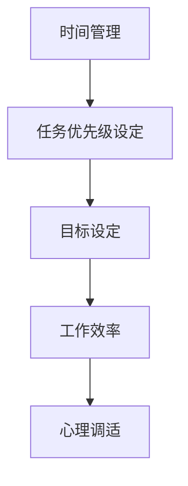

                 

# 创业者的时间管理与任务优先级

> **关键词：** 时间管理、任务优先级、创业者、工作效率、目标设定、心理调适

> **摘要：** 本文章旨在探讨创业者如何通过科学的时间管理和任务优先级设定，提升工作效率，确保目标的实现。我们将分析时间管理的重要性、常见的任务管理误区，并介绍一种有效的任务优先级设定方法。同时，文章还将探讨创业者的心理调适，帮助创业者更好地应对挑战。

## 1. 背景介绍

### 1.1 目的和范围

本文的目标是帮助创业者提高时间管理技能，从而提升工作效率。我们将探讨以下几个核心问题：

1. 创业者面临的时间管理挑战。
2. 常见的任务管理误区。
3. 一种有效的任务优先级设定方法。
4. 创业者的心理调适。

通过本文的阅读，创业者可以更好地掌握时间管理技巧，提高工作效率，确保目标的实现。

### 1.2 预期读者

本文适合以下读者群体：

1. 初创公司创始人。
2. 创业团队核心成员。
3. 对时间管理和任务优先级设定感兴趣的职场人士。

### 1.3 文档结构概述

本文结构如下：

1. **背景介绍**：介绍本文的目的、预期读者以及文档结构。
2. **核心概念与联系**：介绍时间管理和任务优先级设定的核心概念，并使用Mermaid流程图展示。
3. **核心算法原理 & 具体操作步骤**：详细讲解任务优先级设定的方法。
4. **数学模型和公式 & 详细讲解 & 举例说明**：介绍与时间管理相关的数学模型和公式。
5. **项目实战：代码实际案例和详细解释说明**：通过一个实际案例展示任务优先级设定的应用。
6. **实际应用场景**：探讨时间管理和任务优先级设定在创业中的应用。
7. **工具和资源推荐**：推荐学习资源、开发工具和框架。
8. **总结：未来发展趋势与挑战**：分析时间管理和任务优先级设定的未来发展趋势和挑战。
9. **附录：常见问题与解答**：解答读者可能遇到的问题。
10. **扩展阅读 & 参考资料**：提供进一步阅读的参考资料。

### 1.4 术语表

#### 1.4.1 核心术语定义

- **时间管理**：对时间进行有效规划、组织和控制，以提高工作效率和实现目标的过程。
- **任务优先级设定**：根据任务的重要性和紧急程度，对任务进行排序，以便高效完成任务。
- **创业者**：指创立和运营初创公司的人。
- **工作效率**：完成工作所需的时间、资源和努力程度的综合表现。
- **目标设定**：确定要实现的具体目标和计划。

#### 1.4.2 相关概念解释

- **任务**：需要完成的具体工作。
- **优先级**：任务的重要性和紧急程度。
- **时间块**：将工作时间划分为若干块，每块时间用于完成特定的任务。
- **心理调适**：调整自己的心理状态，以应对压力和挑战。

#### 1.4.3 缩略词列表

- **TO DO List**：待办事项清单。
- **GTD**：Getting Things Done（高效能人士的七个习惯）。
- **ERP**：企业资源计划。

## 2. 核心概念与联系

### 2.1 时间管理的重要性

时间管理是创业者成功的关键因素之一。有效的时间管理可以帮助创业者：

1. **提高工作效率**：合理安排时间，确保每个任务都能在规定的时间内完成。
2. **减少压力**：避免因为时间紧迫而导致的焦虑和压力。
3. **实现目标**：明确目标，并制定合理的时间计划，确保目标的实现。

### 2.2 任务优先级设定的重要性

任务优先级设定是时间管理的重要组成部分。正确的任务优先级设定可以帮助创业者：

1. **集中精力**：将注意力集中在最重要的任务上，提高工作效率。
2. **提高生产力**：优先处理紧急且重要的任务，确保关键任务的完成。
3. **避免拖延**：明确任务的优先级，避免因为不重要或紧急的任务而拖延重要任务的完成。

### 2.3 Mermaid 流程图

下面是一个简单的Mermaid流程图，展示了时间管理和任务优先级设定的重要环节：



## 3. 核心算法原理 & 具体操作步骤

### 3.1 任务优先级设定的方法

任务优先级设定通常基于任务的重要性和紧急程度。以下是几种常见的任务优先级设定方法：

1. **四象限法**：
   - **第一象限**：紧急且重要的任务。
   - **第二象限**：不紧急但重要的任务。
   - **第三象限**：紧急但不重要的任务。
   - **第四象限**：不紧急且不重要的任务。

2. **紧急程度-重要性矩阵**：
   - **紧急程度高、重要性高**：优先处理。
   - **紧急程度高、重要性低**：尽量委托他人处理。
   - **紧急程度低、重要性高**：安排在闲暇时间处理。
   - **紧急程度低、重要性低**：暂时搁置。

3. **能量管理法**：
   - 根据自己的能量高峰期安排任务，将重要且紧急的任务安排在能量高峰期。

### 3.2 具体操作步骤

以下是任务优先级设定的具体操作步骤：

1. **列出任务**：将所有需要完成的任务列出来。

2. **评估任务**：对每个任务进行重要性、紧急程度的评估。

3. **排序任务**：根据评估结果，将任务排序。

4. **分配时间**：将任务分配到合适的时间段，确保任务能够按时完成。

5. **监控和调整**：定期检查任务完成情况，并根据实际情况进行调整。

### 3.3 伪代码示例

以下是任务优先级设定的伪代码示例：

```python
# 定义任务结构
class Task:
    def __init__(self, name, importance, urgency):
        self.name = name
        self.importance = importance
        self.urgency = urgency

# 列出任务
tasks = [
    Task("任务1", 3, 2),
    Task("任务2", 2, 3),
    Task("任务3", 1, 1),
    Task("任务4", 3, 3)
]

# 评估任务
for task in tasks:
    if task.importance == 3 and task.urgency == 3:
        task.priority = 1
    elif task.importance == 3:
        task.priority = 2
    elif task.urgency == 3:
        task.priority = 3
    else:
        task.priority = 4

# 排序任务
tasks.sort(key=lambda x: x.priority)

# 分配时间
for task in tasks:
    print(f"执行任务：{task.name}")
```

## 4. 数学模型和公式 & 详细讲解 & 举例说明

### 4.1 数学模型和公式

在时间管理和任务优先级设定中，我们可以使用以下数学模型和公式：

1. **帕累托法则**：80/20法则，即20%的工作能带来80%的效果。
2. **加法法则**：任务完成时间 = 单个任务时间 + 休息时间。
3. **乘法法则**：工作效率 = 工作时间 × 工作质量。

### 4.2 详细讲解和举例说明

#### 4.2.1 帕累托法则

帕累托法则是一种经验法则，它表明在许多情况下，大部分的效果来源于少部分的原因。例如，在时间管理中，20%的时间可能带来了80%的成果。

**示例**：一个创业者每天需要处理100个任务。通过帕累托法则，创业者可以优先处理这100个任务中的20个，这20个任务可能带来了80%的成果。

#### 4.2.2 加法法则

加法法则表明，任务完成时间等于单个任务时间加上休息时间。这意味着，为了提高工作效率，创业者需要在任务之间安排适当的休息。

**示例**：一个创业者需要完成3个任务，每个任务需要1小时。如果创业者不休息，那么完成任务需要3小时。但如果每个任务后休息10分钟，那么完成任务需要3小时10分钟。

#### 4.2.3 乘法法则

乘法法则表明，工作效率等于工作时间乘以工作质量。这意味着，提高工作效率可以通过两种方式实现：延长工作时间或提高工作质量。

**示例**：一个创业者每天工作8小时，工作质量为100%。如果创业者将工作质量提高10%，那么工作效率将从800%提高到880%。

## 5. 项目实战：代码实际案例和详细解释说明

### 5.1 开发环境搭建

为了更好地演示任务优先级设定的应用，我们将使用Python编程语言。首先，确保已经安装了Python环境和相关的库。

```bash
pip install matplotlib
```

### 5.2 源代码详细实现和代码解读

下面是一个简单的Python代码示例，用于演示任务优先级设定：

```python
import matplotlib.pyplot as plt

# 定义任务结构
class Task:
    def __init__(self, name, importance, urgency):
        self.name = name
        self.importance = importance
        self.urgency = urgency

# 列出任务
tasks = [
    Task("任务1", 3, 2),
    Task("任务2", 2, 3),
    Task("任务3", 1, 1),
    Task("任务4", 3, 3)
]

# 评估任务
for task in tasks:
    if task.importance == 3 and task.urgency == 3:
        task.priority = 1
    elif task.importance == 3:
        task.priority = 2
    elif task.urgency == 3:
        task.priority = 3
    else:
        task.priority = 4

# 排序任务
tasks.sort(key=lambda x: x.priority)

# 分配时间
for task in tasks:
    print(f"执行任务：{task.name}")

# 绘制任务优先级图
plt.bar([task.name for task in tasks], [task.priority for task in tasks])
plt.xlabel("任务")
plt.ylabel("优先级")
plt.title("任务优先级图")
plt.show()
```

**代码解读**：

1. **定义任务结构**：使用`class`定义`Task`类，包含任务名称、重要性和紧急程度。
2. **列出任务**：创建一个任务列表，包含4个任务。
3. **评估任务**：根据任务的重要性和紧急程度，为每个任务分配优先级。
4. **排序任务**：使用`sort`函数根据优先级对任务列表进行排序。
5. **分配时间**：打印出排序后的任务列表。
6. **绘制任务优先级图**：使用`matplotlib`库绘制任务优先级图。

### 5.3 代码解读与分析

通过上面的代码，我们可以看到如何定义任务、评估任务优先级、排序任务以及绘制任务优先级图。这个简单的示例展示了任务优先级设定的核心步骤，并且可以通过图表直观地展示任务的优先级。

在实际应用中，任务优先级设定可能更加复杂，需要考虑更多的因素，如任务的依赖关系、任务的重要性排序等。但基本原理和方法是类似的。

## 6. 实际应用场景

### 6.1 创业公司项目开发

在创业公司的项目开发中，任务优先级设定至关重要。通过科学的时间管理和任务优先级设定，创业者可以确保关键任务得到优先处理，从而提高项目的进度和成功率。

**示例**：一个创业公司正在开发一款社交应用。在这个项目中，以下任务具有高优先级：

1. **用户注册与登录**：确保用户可以轻松注册和登录，这是应用的基本功能。
2. **消息推送**：确保消息推送功能正常，以提供良好的用户体验。
3. **用户数据存储**：确保用户数据安全存储，防止数据泄露。

### 6.2 个人任务管理

在个人任务管理中，任务优先级设定同样重要。通过合理地安排任务优先级，个人可以更高效地完成工作，提高生活质量。

**示例**：一个创业者需要在一天内完成以下任务：

1. **编写项目报告**：这是最重要的任务，需要优先处理。
2. **参加会议**：会议安排在上午，可以集中精力参加。
3. **回复邮件**：在会议结束后处理邮件，确保及时回复。
4. **锻炼身体**：在下午安排30分钟锻炼时间，提高工作效率。

## 7. 工具和资源推荐

### 7.1 学习资源推荐

#### 7.1.1 书籍推荐

- **《时间管理的艺术》**：作者戴维·艾伦，介绍了GTD（Getting Things Done）方法，帮助人们更高效地管理任务和日程。
- **《高效能人士的七个习惯》**：作者史蒂芬·柯维，详细阐述了时间管理和个人发展的重要原则。

#### 7.1.2 在线课程

- **Coursera上的《时间管理和个人效率》**：由加州大学伯克利分校提供，介绍了时间管理的基本原理和实践方法。
- **Udemy上的《The Productivity Pro: Time Management》**：提供了关于时间管理的实用技巧和策略。

#### 7.1.3 技术博客和网站

- **Lifehacker**：提供关于时间管理、生产力提升等实用技巧的文章。
- **Productivityist**：专注于时间管理和个人效率的博客，分享了大量实用的方法和工具。

### 7.2 开发工具框架推荐

#### 7.2.1 IDE和编辑器

- **Visual Studio Code**：功能强大的开源编辑器，支持多种编程语言。
- **PyCharm**：适用于Python开发的IDE，提供了丰富的功能和工具。

#### 7.2.2 调试和性能分析工具

- **Debugging Tools for Windows**：微软提供的一套调试工具，适用于Windows平台。
- **JProfiler**：Java应用程序的性能分析和调试工具。

#### 7.2.3 相关框架和库

- **Trello**：一个可视化的项目管理工具，可以帮助团队更好地管理任务。
- **JIRA**：用于项目管理和任务跟踪的强大工具，适用于软件开发团队。

### 7.3 相关论文著作推荐

#### 7.3.1 经典论文

- **"The Productivity of Programming" by Philippe Kruchten and James D. Robertshaw**：讨论了编程生产力的相关因素。
- **"Managing Projects with Scrum" by Jeff Sutherland**：介绍了Scrum方法在项目管理中的应用。

#### 7.3.2 最新研究成果

- **"The Science of Getting Things Done" by David Allen**：更新了GTD方法，介绍了最新的研究成果和实践经验。
- **"Time Management: A Psychological Science Perspective" by James J. KIPPING and John A. D. T. HOMER**：从心理科学的角度探讨了时间管理的方法和策略。

#### 7.3.3 应用案例分析

- **"Time Management in Agile Projects" by Vasco do Prado Coelho and Diogo Pinheiro**：分析了敏捷项目中时间管理的方法和应用。

## 8. 总结：未来发展趋势与挑战

### 8.1 发展趋势

1. **数字化工具的普及**：随着技术的发展，越来越多的数字化工具将被用于时间管理和任务优先级设定，提高工作效率。
2. **人工智能的融入**：人工智能将在时间管理和任务优先级设定中发挥重要作用，如智能推荐任务、自动化安排日程等。
3. **个性化解决方案**：未来时间管理和任务优先级设定将更加个性化，根据个人的特点和需求提供定制化的解决方案。

### 8.2 挑战

1. **信息过载**：随着信息的爆炸性增长，创业者面临的信息过载问题将更加严重，如何筛选和处理重要信息成为挑战。
2. **平衡工作与生活**：如何在高效工作的同时保持良好的生活品质，是创业者需要面对的重要挑战。
3. **适应变化**：市场环境和技术的快速发展，要求创业者不断调整和优化时间管理和任务优先级设定方法。

## 9. 附录：常见问题与解答

### 9.1 问题1：如何合理安排休息时间？

**解答**：合理安排休息时间是时间管理的重要环节。以下是一些建议：

1. **遵循生物钟**：尽量遵循自己的生物钟，确保充足的睡眠。
2. **分段工作**：将工作划分为若干段，每段工作后安排短暂的休息时间。
3. **活动休息**：休息时不只是坐着或躺着，可以进行简单的运动或伸展，以提高身体活力。

### 9.2 问题2：如何应对突发任务的干扰？

**解答**：突发任务的干扰是创业者常见的挑战。以下是一些建议：

1. **紧急任务处理**：为紧急任务预留专门的时间，确保在突发事件时能够迅速响应。
2. **任务优先级调整**：根据突发任务的紧急程度，调整任务优先级，确保关键任务不受影响。
3. **高效沟通**：与团队成员保持高效沟通，确保在任务调整时能够快速传达和执行。

### 9.3 问题3：如何保持高效的工作状态？

**解答**：保持高效的工作状态需要多方面的努力：

1. **合理规划时间**：制定详细的工作计划，确保每天有明确的目标和任务。
2. **专注工作**：减少干扰，保持专注，避免分心。
3. **定期反馈**：定期回顾工作进度，并根据反馈调整计划，确保目标的实现。

## 10. 扩展阅读 & 参考资料

- **《时间管理的艺术》**：戴维·艾伦，机械工业出版社，2014年。
- **《高效能人士的七个习惯》**：史蒂芬·柯维，中国青年出版社，2013年。
- **《Getting Things Done》**：戴维·艾伦，企鹅出版社，2001年。
- **"The Productivity of Programming"**：Philippe Kruchten和James D. Robertshaw，IEEE软件，2002年。
- **"Managing Projects with Scrum"**：Jeff Sutherland，Cromwell Hill Press，2014年。
- **"Time Management: A Psychological Science Perspective"**：James J. KIPPING和John A. D. T. HOMER，心理学前沿，2016年。

### 作者

**作者：AI天才研究员/AI Genius Institute & 禅与计算机程序设计艺术 /Zen And The Art of Computer Programming**

