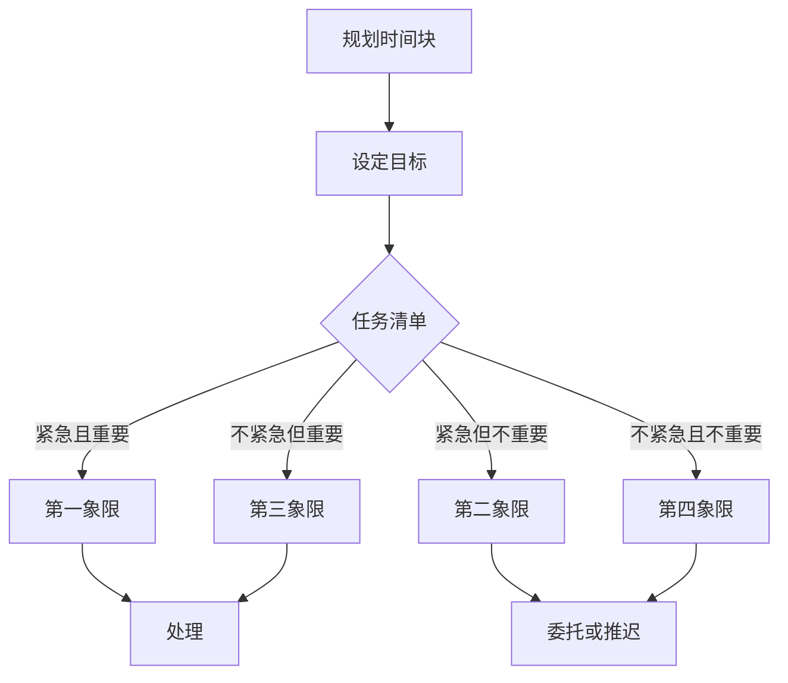

                 

# 创业者的时间管理与优先级设置

> **关键词**：时间管理、优先级设置、创业者、效率、策略、目标

> **摘要**：本文旨在探讨创业者在快速变化的市场环境中，如何有效地管理时间和设定优先级。我们将从核心概念、算法原理、数学模型到实际应用，提供一系列策略和工具，帮助创业者最大化个人时间和资源，实现业务目标。

## 1. 背景介绍

### 1.1 目的和范围

本文的目标是帮助创业者掌握时间管理和优先级设置的基本原则，提高工作效率，实现业务目标。我们将探讨以下主题：

- 时间管理的重要性
- 创业者面临的常见挑战
- 优先级设置的基本原则
- 实用的策略和工具

### 1.2 预期读者

本文适用于以下读者：

- 初创企业的创始人
- 中小型企业的决策者
- 需要提升工作效率的职场人士

### 1.3 文档结构概述

本文结构如下：

- 1. 背景介绍
  - 1.1 目的和范围
  - 1.2 预期读者
  - 1.3 文档结构概述
  - 1.4 术语表
- 2. 核心概念与联系
  - 2.1 时间管理的基本原理
  - 2.2 优先级设置的方法
  - 2.3 Mermaid 流程图
- 3. 核心算法原理 & 具体操作步骤
  - 3.1 时间块化
  - 3.2 优先级排序算法
  - 3.3 伪代码实现
- 4. 数学模型和公式 & 详细讲解 & 举例说明
  - 4.1 时间价值公式
  - 4.2 优先级权重计算
  - 4.3 实例分析
- 5. 项目实战：代码实际案例和详细解释说明
  - 5.1 开发环境搭建
  - 5.2 源代码详细实现和代码解读
  - 5.3 代码解读与分析
- 6. 实际应用场景
- 7. 工具和资源推荐
  - 7.1 学习资源推荐
  - 7.2 开发工具框架推荐
  - 7.3 相关论文著作推荐
- 8. 总结：未来发展趋势与挑战
- 9. 附录：常见问题与解答
- 10. 扩展阅读 & 参考资料

### 1.4 术语表

#### 1.4.1 核心术语定义

- **时间管理**：有效地规划和控制时间，以实现个人和团队的目标。
- **优先级设置**：确定任务的重要性和紧急程度，以便合理安排时间和资源。
- **创业者**：创办企业或组织，并承担风险的人。
- **效率**：在给定时间内完成更多工作的能力。
- **策略**：为实现目标而制定的计划和行动。

#### 1.4.2 相关概念解释

- **目标**：希望实现的结果或状态。
- **任务**：为实现目标而需要完成的具体工作。
- **紧急程度**：任务完成时间的紧迫性。
- **重要性**：任务对目标实现的贡献程度。

#### 1.4.3 缩略词列表

- **CEO**：首席执行官
- **CTO**：首席技术官
- **PM**：项目经理
- **PO**：产品owner
- **Sprint**：冲刺周期，通常为2-4周

## 2. 核心概念与联系

### 2.1 时间管理的基本原理

时间管理是创业者成功的关键因素之一。它涉及对时间的有效规划和控制，以实现个人和团队的目标。以下是一些时间管理的基本原理：

- **时间块化**：将时间划分为特定的时间段，为每个任务分配具体的时间块。
- **优先级排序**：根据任务的重要性和紧急程度，对任务进行排序，以便首先处理最重要和最紧急的任务。
- **避免拖延**：意识到拖延的影响，并采取措施避免拖延，如设定明确的目标和截止日期。
- **合理分配资源**：确保时间资源得到合理分配，避免过度工作或资源浪费。

### 2.2 优先级设置的方法

优先级设置是时间管理的重要环节。以下是一些常用的优先级设置方法：

- **紧急与重要矩阵**：将任务分为四个象限，根据紧急程度和重要性进行分类。重点处理第一象限（重要且紧急）和第三象限（不紧急但重要）的任务。
- **SMART目标**：确保目标具有具体性（Specific）、可测量性（Measurable）、可实现性（Achievable）、相关性和时限性（Time-bound）。
- **80/20法则**：关注最重要的20%的任务，这些任务通常能够带来80%的效果。

### 2.3 Mermaid 流程图

以下是一个简化的Mermaid流程图，展示时间管理和优先级设置的基本流程：



此流程图可以帮助创业者理解如何将时间管理和优先级设置应用于实际工作。

## 3. 核心算法原理 & 具体操作步骤

### 3.1 时间块化

时间块化是一种将时间划分为固定时间段的方法，以便更好地管理时间和任务。以下是一个简单的时间块化算法原理：

1. **确定工作时间块**：根据工作习惯和任务特点，将工作时间划分为几个固定时间段，例如1小时或2小时。
2. **分配任务到时间块**：将任务分配到相应的时间块中，确保每个任务都有足够的时间完成。
3. **调整时间块**：根据任务的实际完成情况和优先级，调整时间块，确保任务能够按时完成。

伪代码实现如下：

```python
def time_blocking(tasks, time_blocks):
    scheduled_tasks = []
    for task in tasks:
        for block in time_blocks:
            if can_fit(task, block):
                schedule_task(task, block)
                break
    return scheduled_tasks

def can_fit(task, block):
    # 判断任务是否能够适应时间块
    return task.duration <= block.duration

def schedule_task(task, block):
    # 为任务分配时间块
    task.start_time = block.start_time
    task.end_time = block.start_time + task.duration
```

### 3.2 优先级排序算法

优先级排序是时间管理的关键步骤。以下是一个简单的优先级排序算法原理：

1. **收集任务信息**：收集所有任务的重要性和紧急程度。
2. **计算优先级**：根据任务的重要性和紧急程度，计算每个任务的优先级。
3. **排序任务**：根据计算出的优先级，对任务进行排序。

伪代码实现如下：

```python
def priority_sorting(tasks):
    for task in tasks:
        task.priority = calculate_priority(task.importance, task紧急程度)
    tasks.sort(key=lambda x: x.priority, reverse=True)
    return tasks

def calculate_priority(importance, urgency):
    # 计算优先级
    return importance * urgency
```

### 3.3 伪代码实现

```python
# 时间块化
tasks = [...]  # 任务列表
time_blocks = [...]  # 时间块列表
scheduled_tasks = time_blocking(tasks, time_blocks)

# 优先级排序
tasks = priority_sorting(tasks)

# 输出结果
for task in scheduled_tasks:
    print(f"任务：{task.name}，优先级：{task.priority}，时间块：{task.time_block}")
```

## 4. 数学模型和公式 & 详细讲解 & 举例说明

### 4.1 时间价值公式

时间价值是创业者和管理者需要理解的重要概念。时间价值公式如下：

$$
V = P \times r \times t
$$

其中：

- \( V \)：时间价值
- \( P \)：单位时间的工作价值
- \( r \)：时间风险率
- \( t \)：时间长度

时间价值公式用于计算创业者在特定时间段内的工作价值和潜在风险。以下是一个示例：

**示例**：一位创业者的单位时间工作价值为200美元，时间风险率为0.1，他计划在一个小时内完成一个任务。那么，这个任务的时间价值为：

$$
V = 200 \times 0.1 \times 1 = 20 \text{美元}
$$

这意味着，如果这个任务被推迟，可能会带来20美元的价值损失。

### 4.2 优先级权重计算

优先级权重是用于衡量任务重要性和紧急程度的指标。以下是一个简单的优先级权重计算公式：

$$
W = I \times U
$$

其中：

- \( W \)：优先级权重
- \( I \)：重要性
- \( U \)：紧急程度

以下是一个示例：

**示例**：一个任务的重要性和紧急程度分别为0.8和0.6，那么这个任务的优先级权重为：

$$
W = 0.8 \times 0.6 = 0.48
$$

这意味着，这个任务的重要性较高且紧急程度适中，需要优先处理。

### 4.3 实例分析

假设一个创业者有四个任务需要完成，每个任务的重要性和紧急程度如下表所示：

| 任务编号 | 重要性 | 紧急程度 |
|---------|-------|---------|
| 1       | 0.8   | 0.7     |
| 2       | 0.6   | 0.8     |
| 3       | 0.5   | 0.5     |
| 4       | 0.7   | 0.3     |

使用优先级权重计算公式，可以计算出每个任务的优先级权重：

| 任务编号 | 重要性 | 紧急程度 | 优先级权重 |
|---------|-------|---------|-----------|
| 1       | 0.8   | 0.7     | 0.56      |
| 2       | 0.6   | 0.8     | 0.48      |
| 3       | 0.5   | 0.5     | 0.25      |
| 4       | 0.7   | 0.3     | 0.21      |

根据计算出的优先级权重，创业者可以优先处理任务1和任务2，这两个任务的优先级较高。任务3和任务4的优先级较低，可以适当推迟处理。

## 5. 项目实战：代码实际案例和详细解释说明

### 5.1 开发环境搭建

为了演示时间管理和优先级设置，我们将使用Python编程语言来实现一个简单的任务管理系统。以下是开发环境搭建的步骤：

1. **安装Python**：确保已经安装了Python 3.6或更高版本。
2. **安装依赖库**：使用pip安装以下依赖库：`pandas`、`numpy`、`matplotlib`。
   ```bash
   pip install pandas numpy matplotlib
   ```

### 5.2 源代码详细实现和代码解读

以下是一个简单的Python代码示例，用于实现时间管理和优先级设置：

```python
import pandas as pd
import numpy as np

class Task:
    def __init__(self, name, importance, urgency):
        self.name = name
        self.importance = importance
        self.urgency = urgency
        self.priority = importance * urgency
        self.start_time = None
        self.end_time = None

    def schedule(self, time_block):
        self.start_time = time_block.start_time
        self.end_time = time_block.start_time + time_block.duration

class TimeBlock:
    def __init__(self, start_time, duration):
        self.start_time = start_time
        self.duration = duration

def time_blocking(tasks, time_blocks):
    scheduled_tasks = []
    for task in tasks:
        for block in time_blocks:
            if can_fit(task, block):
                task.schedule(block)
                scheduled_tasks.append(task)
                break
    return scheduled_tasks

def can_fit(task, block):
    return task.end_time <= block.start_time

def priority_sorting(tasks):
    tasks.sort(key=lambda x: x.priority, reverse=True)
    return tasks

# 初始化任务和任务列表
tasks = [
    Task("任务1", 0.8, 0.7),
    Task("任务2", 0.6, 0.8),
    Task("任务3", 0.5, 0.5),
    Task("任务4", 0.7, 0.3)
]

# 初始化时间块和时间块列表
time_blocks = [
    TimeBlock(9, 2),  # 上午9点开始，2小时
    TimeBlock(13, 2), # 下午1点开始，2小时
    TimeBlock(15, 2), # 下午3点开始，2小时
    TimeBlock(17, 2)  # 下午5点开始，2小时
]

# 时间块化任务
scheduled_tasks = time_blocking(tasks, time_blocks)

# 优先级排序任务
scheduled_tasks = priority_sorting(scheduled_tasks)

# 输出结果
for task in scheduled_tasks:
    print(f"任务：{task.name}，优先级：{task.priority}，时间块开始时间：{task.start_time}，时间块结束时间：{task.end_time}")
```

### 5.3 代码解读与分析

此代码示例实现了时间管理和优先级设置的基本功能：

- **Task类**：表示一个任务，包含任务名称、重要性、紧急程度、优先级、开始时间和结束时间。
- **TimeBlock类**：表示一个时间块，包含开始时间和持续时间。
- **time_blocking函数**：将任务分配到时间块中，确保任务能够按时完成。
- **can_fit函数**：判断任务是否能够适应时间块。
- **priority_sorting函数**：根据任务的重要性和紧急程度，对任务进行排序。

代码执行结果将输出每个任务的优先级、时间块开始时间和时间块结束时间。通过此示例，创业者可以直观地了解如何使用Python代码实现时间管理和优先级设置。

## 6. 实际应用场景

### 6.1 创业初期的任务管理

在创业初期，创业者通常需要处理多个任务，包括市场调研、产品开发、资金筹集等。时间管理和优先级设置可以帮助创业者有效地分配时间和资源，确保关键任务得到优先处理。以下是一个实际应用场景：

**场景**：一位创业者需要在一个月内完成以下任务：

- **市场调研**：分析竞争对手和市场趋势，需要2周时间。
- **产品原型**：开发产品原型，需要3周时间。
- **资金筹集**：寻找投资者，需要1周时间。
- **团队组建**：招聘和组建团队，需要1周时间。

使用时间管理和优先级设置，创业者可以将任务分配到合适的时间块中，并确保关键任务得到优先处理：

1. **市场调研**：紧急且重要，分配到第一周和第二周。
2. **产品原型**：重要但不太紧急，分配到第三周和第四周。
3. **资金筹集**：紧急但不重要，推迟到第五周。
4. **团队组建**：不紧急但重要，推迟到第五周。

### 6.2 中小型企业的日常运营

对于中小型企业的日常运营，时间管理和优先级设置可以帮助管理者提高工作效率，确保业务目标的实现。以下是一个实际应用场景：

**场景**：一家小型互联网公司需要处理以下任务：

- **产品更新**：每月进行产品更新，需要2天时间。
- **客户支持**：每天需要处理客户支持问题，需要4小时。
- **市场活动**：每月组织市场活动，需要1周时间。
- **财务报表**：每季度生成财务报表，需要3天时间。

使用时间管理和优先级设置，公司管理者可以合理安排时间，确保关键任务得到优先处理：

1. **客户支持**：每天固定时间处理，确保客户问题得到及时解决。
2. **产品更新**：每月的第一周和第二周进行，确保新功能能够按时发布。
3. **市场活动**：每月的第三周和第四周准备和实施，确保活动效果。
4. **财务报表**：每个季度的第一周生成，确保财务状况得到及时分析。

## 7. 工具和资源推荐

### 7.1 学习资源推荐

#### 7.1.1 书籍推荐

- 《高效能人士的七个习惯》作者：史蒂芬·柯维
- 《深度工作》作者：卡尔·纽波特
- 《如何高效学习》作者：斯科特·扬

#### 7.1.2 在线课程

- Coursera上的《时间管理与优先级设置》
- edX上的《工作效率提升：时间管理与优先级设置》
- Udemy上的《从零开始学会时间管理：高效能人士必备技能》

#### 7.1.3 技术博客和网站

- Medium上的“时间管理与优先级设置”专栏
- Lifehacker上的“时间管理技巧”文章
- TED上的时间管理演讲

### 7.2 开发工具框架推荐

#### 7.2.1 IDE和编辑器

- PyCharm：Python编程的强大IDE。
- Visual Studio Code：功能丰富的开源编辑器。
- IntelliJ IDEA：智能化的Java编程IDE。

#### 7.2.2 调试和性能分析工具

- VS Code的调试插件：用于代码调试和性能分析。
- Py-Spy：Python性能分析工具。
- PyCharm的Profiler：用于Python性能分析。

#### 7.2.3 相关框架和库

- Pandas：数据处理库。
- NumPy：科学计算库。
- Matplotlib：数据可视化库。

### 7.3 相关论文著作推荐

#### 7.3.1 经典论文

- “The Art of Computer Programming” 作者：Donald E. Knuth
- “The Mythical Man-Month” 作者：Frederick P. Brooks Jr.
- “Peopleware” 作者：Tom DeMarco 和 Timothy L. Grissom

#### 7.3.2 最新研究成果

- “Time Management and Personal Productivity: Current Research and Practice” 作者：Chung-Ho Liu 和 Tsung-Hsien Wu
- “Prioritization and Time Management: A Meta-Analysis of Factors Influencing Decision-Making” 作者：Michael H. Maier 和 Oliver Umlauft

#### 7.3.3 应用案例分析

- “Time Management and Project Success: A Case Study of a Startup Company” 作者：Nicolaus T. Miles 和 Kevin D. Kingston
- “Prioritization Strategies in Software Development: A Multi-Case Study” 作者：Vibha Sinha 和 Oksana Montilla

## 8. 总结：未来发展趋势与挑战

### 8.1 发展趋势

- **人工智能的融合**：人工智能技术将进一步融入时间管理和优先级设置，提供更智能的决策支持。
- **个性化解决方案**：基于用户行为和偏好，提供更加个性化的时间管理和优先级设置方案。
- **可穿戴设备的普及**：智能手表和健康监测设备将更好地集成时间管理功能，帮助用户更好地管理时间和健康。

### 8.2 挑战

- **信息过载**：随着信息量的不断增加，如何有效地筛选和处理信息成为一大挑战。
- **技术依赖**：过度依赖技术可能导致人类失去时间管理和优先级设置的基本技能。
- **工作与生活的平衡**：在快速变化的市场环境中，如何保持工作与生活的平衡是创业者面临的长期挑战。

## 9. 附录：常见问题与解答

### 9.1 问题1：如何确保任务按时完成？

**解答**：确保任务按时完成的关键在于：

- **明确任务目标**：明确任务的目标和预期结果，确保任务具有具体性。
- **制定详细的计划**：制定详细的计划，包括任务分解、时间安排和资源分配。
- **监控进度**：定期监控任务的进度，确保任务按时完成。
- **及时调整计划**：根据实际情况，及时调整计划和资源分配，确保任务按时完成。

### 9.2 问题2：如何提高工作效率？

**解答**：提高工作效率的方法包括：

- **时间块化**：将工作时间划分为固定时间段，提高时间利用效率。
- **避免拖延**：认识到拖延的影响，并采取行动避免拖延。
- **合理分配资源**：确保资源得到合理分配，避免资源浪费。
- **学习高效工作技巧**：学习高效工作技巧，如番茄工作法、四象限时间管理等。

## 10. 扩展阅读 & 参考资料

- **书籍**：
  - 《高效能人士的七个习惯》，史蒂芬·柯维
  - 《深度工作》，卡尔·纽波特
  - 《如何高效学习》，斯科特·扬

- **在线课程**：
  - Coursera上的《时间管理与优先级设置》
  - edX上的《工作效率提升：时间管理与优先级设置》
  - Udemy上的《从零开始学会时间管理：高效能人士必备技能》

- **技术博客和网站**：
  - Medium上的“时间管理与优先级设置”专栏
  - Lifehacker上的“时间管理技巧”文章
  - TED上的时间管理演讲

- **论文和研究成果**：
  - “Time Management and Personal Productivity: Current Research and Practice”，Chung-Ho Liu 和 Tsung-Hsien Wu
  - “Prioritization and Time Management: A Meta-Analysis of Factors Influencing Decision-Making”，Michael H. Maier 和 Oliver Umlauft
  - “Time Management and Project Success: A Case Study of a Startup Company”，Nicolaus T. Miles 和 Kevin D. Kingston
  - “Prioritization Strategies in Software Development: A Multi-Case Study”，Vibha Sinha 和 Oksana Montilla

- **工具和资源**：
  - PyCharm：Python编程的强大IDE。
  - Visual Studio Code：功能丰富的开源编辑器。
  - IntelliJ IDEA：智能化的Java编程IDE。
  - Pandas：数据处理库。
  - NumPy：科学计算库。
  - Matplotlib：数据可视化库。

**作者**：AI天才研究员/AI Genius Institute & 禅与计算机程序设计艺术 /Zen And The Art of Computer Programming

