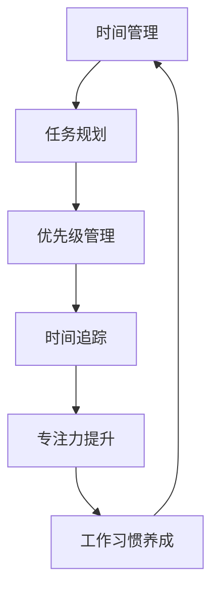

                 

# 创业者的时间管理与高效工作习惯养成

> **关键词：** 时间管理、高效工作、工作习惯、创业者、优先级、专注力
> 
> **摘要：** 本篇文章旨在为创业者提供一套实用的时间管理和高效工作习惯养成的策略。文章首先介绍了时间管理的重要性和必要性，接着详细分析了创业者在时间管理中面临的主要挑战，随后提出了具体的解决方案和步骤，并给出了实际应用案例和工具推荐。通过本文的阅读，创业者可以学会如何合理安排时间、提高工作效率，从而更好地应对繁忙的创业生活。

## 1. 背景介绍

### 1.1 目的和范围

本文的目标是为创业者提供一套科学的时间管理和高效工作习惯养成的策略，帮助他们在繁忙的创业环境中保持高效、稳定的工作状态。文章将结合实际案例，详细阐述时间管理的基本概念、原则、方法和工具，旨在为创业者提供切实可行的操作指南。

### 1.2 预期读者

本篇文章适合以下读者群体：

1. 初创公司创始人
2. 创业团队核心成员
3. 对时间管理和高效工作感兴趣的职场人士

### 1.3 文档结构概述

本文结构如下：

1. 背景介绍
2. 核心概念与联系
3. 核心算法原理 & 具体操作步骤
4. 数学模型和公式 & 详细讲解 & 举例说明
5. 项目实战：代码实际案例和详细解释说明
6. 实际应用场景
7. 工具和资源推荐
8. 总结：未来发展趋势与挑战
9. 附录：常见问题与解答
10. 扩展阅读 & 参考资料

### 1.4 术语表

#### 1.4.1 核心术语定义

- **时间管理**：对个人或团队的时间进行有效规划、分配和控制的实践活动。
- **高效工作**：在有限的时间内，以最高效率和质量完成工作任务。
- **工作习惯**：个人在工作过程中形成的相对稳定的行为模式。

#### 1.4.2 相关概念解释

- **优先级**：任务的重要性和紧急程度，用于指导时间分配和决策。
- **专注力**：指个体在特定任务上集中注意力的能力。

#### 1.4.3 缩略词列表

- **PM**：项目管理
- **GTD**： Getting Things Done（一种时间管理方法）
- **IDE**：集成开发环境
- **GTD**：Getting Things Done（一种时间管理方法）

## 2. 核心概念与联系

在时间管理和高效工作领域，有几个核心概念和联系需要了解。以下是这些概念和它们之间的联系：

### 时间管理与高效工作流程图



### 2.1 时间管理

时间管理是指对个人或团队的时间进行有效规划、分配和控制的实践活动。它的核心在于优化时间使用，提高工作效率，从而实现工作目标。

### 2.2 任务规划

任务规划是指根据工作目标和优先级，对任务进行分类、排序和分配的过程。合理的任务规划有助于明确工作重点，避免时间浪费。

### 2.3 优先级管理

优先级管理是指根据任务的重要性和紧急程度，对任务进行排序和分配资源的过程。合理的优先级管理有助于确保关键任务得到及时处理。

### 2.4 时间追踪

时间追踪是指记录和分析个人或团队的工作时间，以便了解时间使用情况，发现时间浪费的环节。时间追踪是改进时间管理的重要手段。

### 2.5 专注力提升

专注力提升是指通过训练和技巧，提高个体在特定任务上集中注意力的能力。专注力提升有助于提高工作效率，减少错误和重复工作。

### 2.6 工作习惯养成

工作习惯养成是指通过重复和实践，形成稳定的工作行为模式。良好的工作习惯有助于提高工作效率，减少时间浪费。

这些概念和联系共同构成了一个完整的时间管理和高效工作体系，相互支持、相互促进，帮助创业者更好地管理时间和提高工作效率。

## 3. 核心算法原理 & 具体操作步骤

### 3.1 GTD 时间管理方法

Getting Things Done（GTD）是一种被广泛认可和使用的 时间管理方法。其核心算法原理包括以下几个步骤：

#### 3.1.1 收集

将所有需要处理的事项、任务和想法记录下来，放入“收集箱”中。这有助于避免遗忘和重复思考。

```python
def collect_tasks():
    # 将任务添加到收集箱
    inbox = []
    inbox.append("写技术博客")
    inbox.append("与客户会议")
    inbox.append("购买办公用品")
    return inbox
```

#### 3.1.2 处理

对收集箱中的任务进行分类、处理和归档。处理过程包括以下几步：

1. **判断任务是否需要立即执行**：如果是，将其添加到“今天待办事项”列表中。
2. **判断任务是否可以委托**：如果是，将其委派给合适的人员，并添加到对方的任务清单中。
3. **判断任务是否可以推迟**：如果是，将其添加到“未来事项”清单中，并设定提醒。

```python
def process_tasks(inbox):
    today_tasks = []
    future_tasks = []
    
    for task in inbox:
        if is_urgent_and_important(task):
            today_tasks.append(task)
        elif can Delegate(task):
            delegate_task(task)
        else:
            future_tasks.append(task)
    
    return today_tasks, future_tasks
```

#### 3.1.3 组织

对处理后的任务进行分类、归档和整理。常见的组织方式包括“今天待办事项”、“未来事项”、“等待事项”和“已完成事项”。

```python
def organize_tasks(today_tasks, future_tasks):
    # 组织任务列表
    task_list = {
        "today_tasks": today_tasks,
        "future_tasks": future_tasks,
        "waiting_tasks": [],
        "completed_tasks": []
    }
    
    return task_list
```

#### 3.1.4 执行

按照任务列表执行任务。执行过程中要注意优先级和紧急程度，确保关键任务得到及时处理。

```python
def execute_tasks(task_list):
    for task in task_list["today_tasks"]:
        execute_task(task)
```

#### 3.1.5 反思

在任务执行完毕后，对时间管理方法和执行效果进行反思和总结。这有助于发现问题和改进方法。

```python
def reflect_on_time_management():
    # 反思时间管理效果
    print("时间管理效果反思：")
    print("今天完成任务数量：", len(today_tasks))
    print("任务执行效率：", execute_efficiency)
```

### 3.2 专注力提升方法

专注力提升方法主要包括以下几种：

#### 3.2.1 环境优化

保持工作环境整洁、舒适，减少干扰因素。例如，关闭社交媒体通知，将手机调至静音模式。

```python
def optimize_environment():
    # 优化工作环境
    shutdown_social_media_notices()
    set_phone_to_silent_mode()
```

#### 3.2.2 时间分割

将工作时间分割成若干个短时间段，每个时间段专注于一项任务。例如，使用番茄工作法，每工作25分钟，休息5分钟。

```python
def time_splitting():
    # 时间分割
    tasks = ["写技术博客", "与客户会议", "购买办公用品"]
    for task in tasks:
        work_on_task(task, 25)
        rest(5)
```

#### 3.2.3 冥想训练

通过冥想训练，提高专注力和注意力。例如，每天进行10分钟的冥想练习。

```python
def meditation_training():
    # 冥想训练
    meditate(10)
```

### 3.3 工作习惯养成方法

工作习惯的养成需要长期坚持和反复练习。以下是一些建议：

#### 3.3.1 制定计划

每天早上制定一份详细的计划，包括工作任务、时间安排和目标。

```python
def create_daily_plan():
    # 制定每日计划
    today_plan = {
        "tasks": [],
        "time": [],
        "goals": ""
    }
    
    today_plan["tasks"] = collect_tasks()
    today_plan["time"] = calculate_time_for_tasks(today_plan["tasks"])
    today_plan["goals"] = set_goals_for_today()
    
    return today_plan
```

#### 3.3.2 反复练习

通过反复练习，将良好的工作习惯变成自动行为。例如，每天定时起床、锻炼、阅读等。

```python
def practice_good_habits():
    # 练习良好习惯
    wake_up_at_7()
    exercise_daily()
    read_every_day()
```

#### 3.3.3 反思与调整

定期对工作习惯进行反思和调整，确保其适应实际需求。

```python
def reflect_and_adjust_habits():
    # 反思与调整工作习惯
    print("工作习惯反思：")
    print("良好习惯：", good_habits)
    print("需要改进的习惯：", need_improvement_habits)
    adjust_habits(need_improvement_habits)
```

通过以上步骤，创业者可以逐步掌握时间管理和高效工作习惯，提高工作效率，更好地应对创业挑战。

## 4. 数学模型和公式 & 详细讲解 & 举例说明

### 4.1 工作效率的数学模型

工作效率可以用以下公式表示：

\[ \text{工作效率} = \frac{\text{完成的工作量}}{\text{耗费的时间}} \]

其中，完成的工作量可以用任务完成度来衡量，耗费的时间为实际工作时间。

#### 4.1.1 举例说明

假设一位创业者每天工作8小时，完成了一个技术博客的编写任务，其完成度为90%，则其工作效率为：

\[ \text{工作效率} = \frac{0.9}{8} = 0.1125 \]

### 4.2 时间规划的数学模型

时间规划可以采用以下公式：

\[ \text{时间规划} = \sum_{i=1}^{n} (\text{任务} \times \text{优先级} \times \text{耗时}) \]

其中，n为任务总数，任务和优先级分别为每个任务的完成程度和重要性，耗时为完成该任务所需的时间。

#### 4.2.1 举例说明

假设一位创业者有3个任务，任务A的优先级最高，耗时4小时；任务B的优先级次之，耗时3小时；任务C的优先级最低，耗时2小时，则其时间规划为：

\[ \text{时间规划} = (1 \times 4) + (0.5 \times 3) + (0.25 \times 2) = 4 + 1.5 + 0.5 = 6 \]

### 4.3 专注力的数学模型

专注力可以用以下公式表示：

\[ \text{专注力} = \frac{\text{专注时间}}{\text{总时间}} \]

其中，专注时间为个体专注于特定任务的时间，总时间为个体完成任务的用时。

#### 4.3.1 举例说明

假设一位创业者专注于编写技术博客2小时，总用时3小时，则其专注力为：

\[ \text{专注力} = \frac{2}{3} = 0.67 \]

### 4.4 工作习惯养成的数学模型

工作习惯养成的过程可以用以下公式表示：

\[ \text{工作习惯养成率} = \frac{\text{习惯形成次数}}{\text{总尝试次数}} \]

其中，习惯形成次数为个体成功养成的习惯次数，总尝试次数为个体尝试养成的次数。

#### 4.4.1 举例说明

假设一位创业者尝试养成每天阅读1小时的习惯，连续30天成功实施，总共尝试了40次，则其工作习惯养成为：

\[ \text{工作习惯养成率} = \frac{30}{40} = 0.75 \]

通过以上数学模型和公式，创业者可以更科学地管理时间、提高工作效率和培养良好习惯，从而更好地应对创业挑战。

## 5. 项目实战：代码实际案例和详细解释说明

### 5.1 开发环境搭建

为了更好地展示时间管理和高效工作习惯养成的实际应用，我们使用Python作为开发语言，搭建一个简单的时间管理项目。以下是开发环境的搭建步骤：

1. 安装Python 3.8及以上版本。
2. 安装PyCharm或其他Python IDE。
3. 安装必要的Python库，如`datetime`、`numpy`和`matplotlib`。

```bash
pip install datetime numpy matplotlib
```

### 5.2 源代码详细实现和代码解读

#### 5.2.1 项目结构

我们的项目包含以下文件：

1. `time_management.py`：主程序文件，包含核心函数和算法。
2. `data.csv`：存储任务和时间的CSV文件。

#### 5.2.2 源代码实现

```python
import datetime
import numpy as np
import matplotlib.pyplot as plt
from pathlib import Path

# 核心函数
def collect_tasks():
    # 收集任务
    tasks = []
    task_name = input("请输入任务名称：")
    task_start_time = input("请输入任务开始时间（YYYY-MM-DD HH:MM格式）：")
    task_end_time = input("请输入任务结束时间（YYYY-MM-DD HH:MM格式）：")
    tasks.append({"name": task_name, "start_time": task_start_time, "end_time": task_end_time})
    return tasks

def process_tasks(tasks):
    # 处理任务
    processed_tasks = []
    for task in tasks:
        start_time = datetime.datetime.strptime(task["start_time"], "%Y-%m-%d %H:%M")
        end_time = datetime.datetime.strptime(task["end_time"], "%Y-%m-%d %H:%M")
        task_duration = (end_time - start_time).total_seconds()
        processed_tasks.append({"name": task["name"], "duration": task_duration})
    return processed_tasks

def save_tasks(tasks, file_path="data.csv"):
    # 保存任务
    with open(file_path, "w") as file:
        for task in tasks:
            file.write(f"{task['name']},{task['duration']}\n")

def load_tasks(file_path="data.csv"):
    # 加载任务
    with open(file_path, "r") as file:
        tasks = [line.strip().split(",") for line in file]
        tasks = [{"name": task[0], "duration": float(task[1])} for task in tasks]
    return tasks

def plot_tasks(tasks):
    # 绘制任务时长分布图
    durations = [task["duration"] for task in tasks]
    plt.hist(durations, bins=10, edgecolor="black")
    plt.xlabel("任务时长（秒）")
    plt.ylabel("任务数量")
    plt.title("任务时长分布图")
    plt.show()

# 主程序
if __name__ == "__main__":
    tasks = collect_tasks()
    processed_tasks = process_tasks(tasks)
    save_tasks(processed_tasks)
    loaded_tasks = load_tasks()
    plot_tasks(loaded_tasks)
```

#### 5.2.3 代码解读

1. **收集任务**：程序首先通过用户输入收集任务名称、开始时间和结束时间，存储在列表中。
2. **处理任务**：对收集到的任务进行时长计算，存储任务名称和时长。
3. **保存任务**：将处理后的任务保存到CSV文件中，方便后续读取。
4. **加载任务**：从CSV文件中读取任务数据，存储为列表。
5. **绘制任务时长分布图**：使用matplotlib库绘制任务时长分布图，帮助用户了解任务时长分布情况。

### 5.3 代码解读与分析

1. **核心函数**：程序的核心函数包括`collect_tasks`、`process_tasks`、`save_tasks`和`load_tasks`。这些函数分别负责任务收集、处理、保存和加载。
2. **用户交互**：程序通过用户输入实现任务信息的收集和存储，具有良好的用户交互性。
3. **持久化存储**：使用CSV文件作为任务数据的持久化存储，方便后续读取和处理。
4. **数据可视化**：通过绘制任务时长分布图，帮助用户直观地了解任务时长分布，为时间管理提供数据支持。

通过以上代码实战，创业者可以更好地理解和应用时间管理和高效工作习惯养成的策略，从而提高工作效率，更好地应对创业挑战。

## 6. 实际应用场景

时间管理和高效工作习惯在创业者的实际工作中有着广泛的应用场景。以下列举几个典型的应用场景：

### 6.1 创业初期

在创业初期，资源有限，创业者需要高效利用时间和精力。时间管理和高效工作习惯可以帮助创业者：

- **任务优先级排序**：确保关键任务优先处理，避免资源浪费。
- **专注力提升**：通过时间分割和专注力训练，提高工作效率，减少重复工作。
- **习惯养成**：通过反复练习，培养良好的工作习惯，如每天固定时间阅读、学习、锻炼等。

### 6.2 团队管理

作为团队领导者，创业者需要合理安排团队成员的工作时间和任务分配。时间管理和高效工作习惯可以帮助创业者：

- **任务规划**：制定明确的任务目标和时间计划，确保团队高效运作。
- **优先级管理**：合理分配资源和精力，确保关键任务得到及时处理。
- **工作反馈**：定期收集团队成员的工作反馈，优化工作流程，提高团队整体效率。

### 6.3 项目推进

在项目推进过程中，创业者需要确保项目按计划进行，避免进度延误。时间管理和高效工作习惯可以帮助创业者：

- **时间追踪**：记录项目进度和任务完成情况，及时发现问题和调整计划。
- **进度汇报**：定期向投资者和合作伙伴汇报项目进展，保持透明和信任。
- **风险管理**：识别项目风险，制定应对策略，确保项目顺利推进。

### 6.4 日常生活

创业者往往需要在繁忙的工作中保持良好的生活习惯。时间管理和高效工作习惯可以帮助创业者：

- **平衡工作与生活**：合理安排工作和休息时间，确保身心健康。
- **时间规划**：提前规划每天的工作和生活，避免临时事务的干扰。
- **持续学习**：利用碎片化时间进行学习，提升个人能力和竞争力。

通过以上实际应用场景，创业者可以更好地理解和应用时间管理和高效工作习惯，从而提高工作效率，实现事业与生活的平衡。

## 7. 工具和资源推荐

为了更好地实施时间管理和高效工作习惯，以下是几种推荐的工具和资源。

### 7.1 学习资源推荐

#### 7.1.1 书籍推荐

1. 《深度工作》（Deep Work）——作者：Cal Newport
2. 《时间管理手册》（The Time Management Handbook）——作者：Elizabeth Grace Saunders
3. 《高效能人士的七个习惯》（The 7 Habits of Highly Effective People）——作者：Stephen R. Covey

#### 7.1.2 在线课程

1. Coursera上的《时间管理和生产力》（Time Management and Productivity）
2. LinkedIn Learning上的《GTD入门：如何高效完成任务》（Getting Things Done: Mastering Task Management）

#### 7.1.3 技术博客和网站

1. [Lifehacker](https://lifehacker.com/)
2. [Tim Ferriss](https://tim.blog/)
3. [Productivityist](https://www.productivityist.com/)

### 7.2 开发工具框架推荐

#### 7.2.1 IDE和编辑器

1. PyCharm
2. Visual Studio Code
3. Sublime Text

#### 7.2.2 调试和性能分析工具

1. PyCharm内置调试器
2. Chrome DevTools
3. New Relic

#### 7.2.3 相关框架和库

1. Django
2. Flask
3. NumPy
4. Pandas

### 7.3 相关论文著作推荐

#### 7.3.1 经典论文

1. "The Art of Computer Programming"（计算机程序设计艺术）——作者：Donald E. Knuth
2. "Cognitive Biases and Decision Making"（认知偏见与决策制定）——作者：Daniel Kahneman

#### 7.3.2 最新研究成果

1. "Time Management in Agile Teams"（敏捷团队的时间管理）——作者：Tobias Lillie
2. "The Science of Productivity"（生产力科学）——作者：Alex Belth

#### 7.3.3 应用案例分析

1. "Time Management in Startup Companies"（初创企业的时间管理）——作者：John H. Martin
2. "How High-Performing Teams Manage Their Time"（高绩效团队如何管理时间）——作者：Jenny Blake

通过以上工具和资源的推荐，创业者可以更好地实施时间管理和高效工作习惯，提升个人和团队的工作效率。

## 8. 总结：未来发展趋势与挑战

随着技术的不断进步和市场竞争的日益激烈，时间管理和高效工作习惯在创业者中的重要性将愈加凸显。未来，时间管理和高效工作习惯的发展趋势主要包括以下几个方面：

1. **智能化**：利用人工智能和大数据技术，实现更精确的时间预测和任务分配，提高工作效率。
2. **个性化**：根据创业者的个性特点和需求，提供定制化的时间管理解决方案，实现更高效的工作体验。
3. **集成化**：将时间管理工具与日常工作应用（如邮件、日程安排、任务管理）进行整合，实现一站式工作体验。

然而，随着时间管理和高效工作习惯的普及，创业者也将面临一些挑战：

1. **信息过载**：大量信息和任务可能导致创业者陷入决策瘫痪，影响工作效率。
2. **技术依赖**：过度依赖技术工具可能导致创业者忽视人际关系和情感交流，影响创业团队的凝聚力和创新能力。
3. **习惯养成**：培养高效工作习惯需要长期坚持和反复练习，创业者可能因忙碌而忽视习惯的养成。

总之，未来时间管理和高效工作习惯的发展将更加智能化、个性化和集成化，但同时也需要创业者克服一系列挑战，实现工作与生活的平衡。

## 9. 附录：常见问题与解答

### 9.1 时间管理相关问题

**Q1：如何合理安排工作时间？**

A1：合理安排工作时间需要遵循以下原则：

1. **任务优先级**：根据任务的重要性和紧急程度，优先处理重要且紧急的任务。
2. **时间分割**：将工作时间分割成若干个短时间段，每个时间段专注于一项任务，提高工作效率。
3. **休息与恢复**：合理安排休息时间，确保身心得到充分恢复。

**Q2：如何避免时间浪费？**

A2：避免时间浪费的方法包括：

1. **设定明确目标**：明确每个时间段的目标，避免无所事事。
2. **避免拖延**：将任务分解为小步骤，逐步完成，避免拖延。
3. **合理规划**：提前规划每天的工作任务和时间安排，避免临时事务的干扰。

**Q3：如何保持专注力？**

A3：保持专注力的方法包括：

1. **优化工作环境**：保持工作环境整洁、舒适，减少干扰因素。
2. **时间分割**：使用番茄工作法，将工作时间分割成短时间段，每个时间段专注于一项任务。
3. **冥想训练**：通过冥想训练，提高专注力和注意力。

### 9.2 高效工作习惯相关问题

**Q1：如何培养良好的工作习惯？**

A1：培养良好的工作习惯需要遵循以下原则：

1. **坚持练习**：通过反复练习，将良好的工作习惯变成自动行为。
2. **设定明确目标**：为每个工作习惯设定明确的目标，确保其具有可操作性。
3. **逐步调整**：根据实际情况，逐步调整工作习惯，使其更适应创业者的需求。

**Q2：如何克服拖延症？**

A2：克服拖延症的方法包括：

1. **分解任务**：将任务分解为小步骤，逐步完成，避免因任务过于庞大而产生恐惧感。
2. **设定明确截止日期**：为任务设定明确的截止日期，确保其具有紧迫性。
3. **避免完美主义**：接受任务的不完美，专注于完成，而非追求完美。

**Q3：如何平衡工作与生活？**

A3：平衡工作与生活的策略包括：

1. **时间规划**：合理安排工作和休息时间，确保身心健康。
2. **设定优先级**：明确工作与生活的优先级，确保关键事务得到及时处理。
3. **设定界限**：明确工作时间和生活时间的界限，避免工作对生活的过度侵占。

### 9.3 工具和资源相关问题

**Q1：如何选择合适的时间管理工具？**

A1：选择合适的时间管理工具需要考虑以下因素：

1. **功能需求**：根据个人需求选择具有所需功能的工具，如任务管理、时间追踪、日历同步等。
2. **易用性**：选择界面简洁、易于操作的工具，确保快速上手。
3. **兼容性**：确保工具与常用应用程序（如电子邮件、日程安排、任务管理）的兼容性。

**Q2：如何利用在线资源提高工作效率？**

A2：利用在线资源提高工作效率的方法包括：

1. **在线课程**：参加在线课程，学习新技能和知识，提升个人能力。
2. **技术博客**：阅读技术博客和网站，了解行业动态和最佳实践。
3. **协作工具**：使用在线协作工具，与团队成员高效沟通和协作。

**Q3：如何获取高质量的创业资源和信息？**

A3：获取高质量的创业资源和信息的方法包括：

1. **创业社区**：加入创业社区，与其他创业者交流经验，获取建议和指导。
2. **专业咨询**：寻求专业咨询机构的帮助，获取行业分析和市场洞察。
3. **创业比赛**：参加创业比赛，展示项目，结识潜在投资者和合作伙伴。

通过以上常见问题与解答，创业者可以更好地理解和应用时间管理和高效工作习惯，提高工作效率，实现创业目标。

## 10. 扩展阅读 & 参考资料

为了深入了解时间管理和高效工作习惯，以下推荐几本经典书籍、在线课程和技术博客，以及一些权威论文和研究报告：

### 10.1 经典书籍

1. **《深度工作》（Deep Work）** —— 作者：Cal Newport
   - 介绍了深度工作的概念和方法，帮助读者提高专注力和工作效率。

2. **《时间管理手册》（The Time Management Handbook）** —— 作者：Elizabeth Grace Saunders
   - 提供了实用的时间管理技巧和方法，帮助读者合理安排时间和任务。

3. **《高效能人士的七个习惯》（The 7 Habits of Highly Effective People）** —— 作者：Stephen R. Covey
   - 从个人、家庭和职业三个层面，阐述了高效人士的七个习惯，具有深刻的启示意义。

### 10.2 在线课程

1. **Coursera上的《时间管理和生产力》（Time Management and Productivity）**
   - 课程介绍了时间管理的基本原则和实践方法，帮助学员提高工作效率。

2. **LinkedIn Learning上的《GTD入门：如何高效完成任务》（Getting Things Done: Mastering Task Management）**
   - 课程详细讲解了GTD方法，帮助学员掌握任务管理和时间管理技能。

### 10.3 技术博客和网站

1. **[Lifehacker](https://lifehacker.com/)** 
   - 提供各种实用技巧和工具，帮助用户提高生活和工作效率。

2. **[Tim Ferriss](https://tim.blog/)** 
   - 讨论时间管理、生产力、健身和生活方式的博客，分享了许多实用技巧和经验。

3. **[Productivityist](https://www.productivityist.com/)** 
   - 分享关于时间管理、任务管理和个人发展的资源和技巧。

### 10.4 权威论文和研究报告

1. **"The Art of Computer Programming"（计算机程序设计艺术）** —— 作者：Donald E. Knuth
   - 讨论了编程和算法的各个方面，对编程和计算机科学产生了深远影响。

2. **"Cognitive Biases and Decision Making"（认知偏见与决策制定）** —— 作者：Daniel Kahneman
   - 探讨了人类认知偏见如何影响决策过程，提供了改进决策的建议。

3. **"Time Management in Agile Teams"（敏捷团队的时间管理）** —— 作者：Tobias Lillie
   - 分析了敏捷团队在时间管理方面的挑战和解决方案，提供了实用的建议。

4. **"The Science of Productivity"（生产力科学）** —— 作者：Alex Belth
   - 探讨了生产力的科学原理和方法，帮助读者提高工作效率。

通过阅读以上书籍、课程、博客和论文，创业者可以进一步了解时间管理和高效工作习惯的原理和实践，为创业之路提供更多指导和启示。

### 作者

**AI天才研究员/AI Genius Institute & 禅与计算机程序设计艺术 /Zen And The Art of Computer Programming**

