                 

# 创业者的时间管理与高效工作流程设计

## 关键词：
时间管理、高效工作流程、创业、生产力、任务优先级、工具与资源

> **摘要：**
本文将深入探讨创业者所需掌握的时间管理与高效工作流程设计原则。通过分析时间管理的核心概念和策略，结合实际操作步骤和案例，帮助创业者优化日常任务，提升工作效率，最终实现企业的快速增长和持续成功。

## 1. 背景介绍

### 1.1 目的和范围

本文旨在为创业者提供一套系统化的时间管理和高效工作流程设计方案，帮助他们在繁忙的创业过程中，有效地分配时间和资源，确保关键任务的优先处理，从而提高整体工作效率和生产力。

本文将涵盖以下内容：

1. **时间管理的核心概念**：介绍时间管理的基本原则和策略。
2. **高效工作流程设计**：探讨如何优化工作流程，实现高效执行。
3. **实际操作步骤**：提供具体的工具和方法，帮助创业者实践时间管理和工作流程设计。
4. **项目实战与案例分析**：通过实际案例展示时间管理和工作流程设计的应用效果。
5. **工具和资源推荐**：推荐实用的工具和资源，助力创业者提升工作效率。

### 1.2 预期读者

本文适合以下读者：

- 初创企业创始人
- 高级管理者
- 项目经理
- 创新型团队的领导者

读者应具备基本的时间管理和项目管理知识，以便更好地理解和应用本文所述的方法和策略。

### 1.3 文档结构概述

本文分为以下几个部分：

1. **背景介绍**：介绍本文的目的、预期读者和文档结构。
2. **核心概念与联系**：讨论时间管理和高效工作流程设计的核心概念，并使用Mermaid流程图展示。
3. **核心算法原理 & 具体操作步骤**：详细阐述时间管理和工作流程设计的方法和策略。
4. **数学模型和公式 & 详细讲解 & 举例说明**：使用数学模型和公式，解释时间管理和工作流程设计的关键原理。
5. **项目实战：代码实际案例和详细解释说明**：通过实际案例，展示时间管理和工作流程设计的应用效果。
6. **实际应用场景**：探讨时间管理和工作流程设计在不同创业场景中的应用。
7. **工具和资源推荐**：推荐实用的工具和资源，助力创业者提升工作效率。
8. **总结：未来发展趋势与挑战**：总结本文的主要观点，并探讨未来发展趋势和挑战。
9. **附录：常见问题与解答**：回答读者可能遇到的问题。
10. **扩展阅读 & 参考资料**：提供进一步学习和探索的资源和资料。

### 1.4 术语表

#### 1.4.1 核心术语定义

- **时间管理**：通过合理安排时间和任务，提高工作效率和生产力的方法。
- **高效工作流程**：通过优化工作流程，减少不必要的步骤和等待时间，实现高效执行。
- **任务优先级**：根据任务的重要性和紧急程度，对任务进行排序，确保关键任务得到优先处理。
- **生产力**：单位时间内完成的工作量。

#### 1.4.2 相关概念解释

- **时间管理策略**：指用于合理安排时间和任务的方法，包括任务分解、时间规划、优先级管理等。
- **工作流程设计**：指对工作流程进行系统化和结构化的设计，以提高工作效率和生产力。

#### 1.4.3 缩略词列表

- **PM**：项目经理
- **IDE**：集成开发环境
- **ERP**：企业资源规划
- **CRM**：客户关系管理

## 2. 核心概念与联系

在探讨时间管理和高效工作流程设计之前，我们需要了解一些核心概念和它们之间的联系。

### 时间管理的核心概念

时间管理涉及多个核心概念，包括任务分解、时间规划、优先级管理、执行监控等。这些概念共同构成了时间管理的体系。

#### 任务分解

任务分解是将大任务拆解成小任务的过程。通过任务分解，我们可以更清晰地了解任务的组成部分，便于分配和执行。

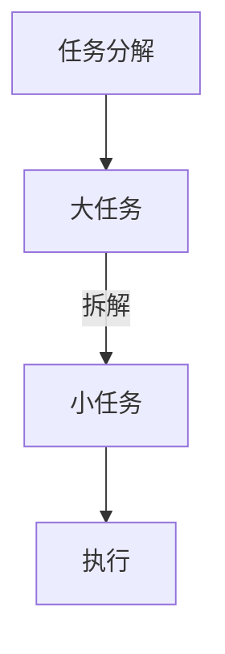

#### 时间规划

时间规划是合理安排时间和任务的过程。通过时间规划，我们可以确保每个任务在合适的时间得到执行，从而提高工作效率。

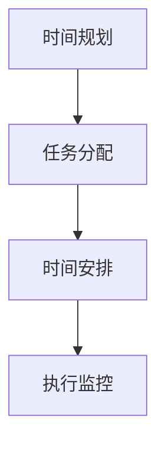

#### 优先级管理

优先级管理是根据任务的重要性和紧急程度对任务进行排序的过程。通过优先级管理，我们可以确保关键任务得到优先处理，从而提高整体工作效率。

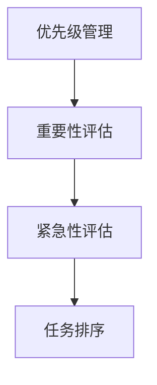

#### 执行监控

执行监控是对任务执行过程进行跟踪和监督的过程。通过执行监控，我们可以及时发现和解决问题，确保任务按计划进行。

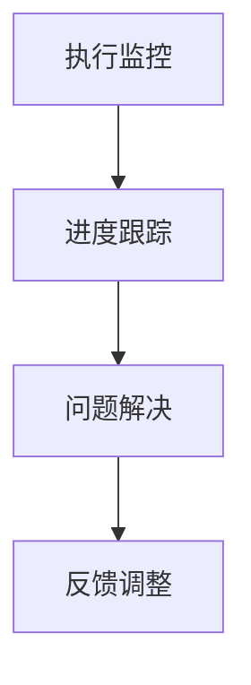

### 高效工作流程设计

高效工作流程设计旨在优化工作流程，减少不必要的步骤和等待时间，实现高效执行。高效工作流程设计包括以下关键概念：

#### 工作流程优化

工作流程优化是通过分析现有工作流程，识别和消除不必要的步骤和等待时间，以提高工作效率。

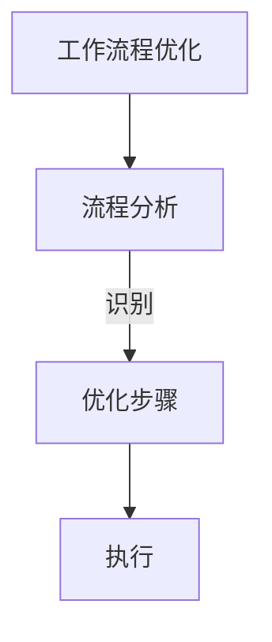

#### 自动化

自动化是通过使用软件工具和系统，将重复性和规则性的任务自动化，以减少人力和时间成本。

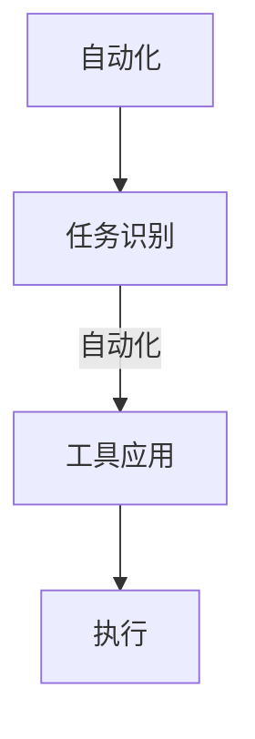

#### 模块化

模块化是将工作流程划分为多个模块，每个模块负责特定的任务，以提高工作流程的可维护性和灵活性。

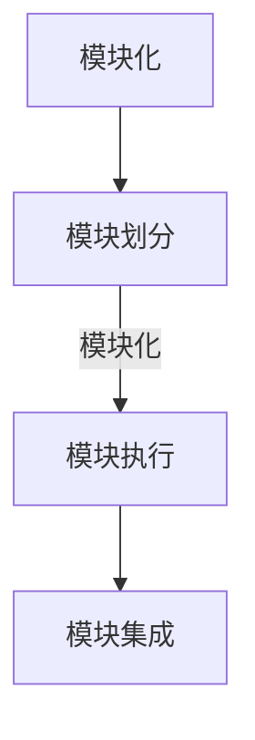

### 时间管理与高效工作流程设计的关系

时间管理和高效工作流程设计之间存在紧密的联系。时间管理为高效工作流程设计提供了基础，而高效工作流程设计则进一步提升了时间管理的效果。

通过时间管理，我们可以更有效地安排任务和资源，确保关键任务得到优先处理。而高效工作流程设计则通过优化工作流程，减少不必要的步骤和等待时间，实现高效执行，从而提高整体工作效率和生产力。

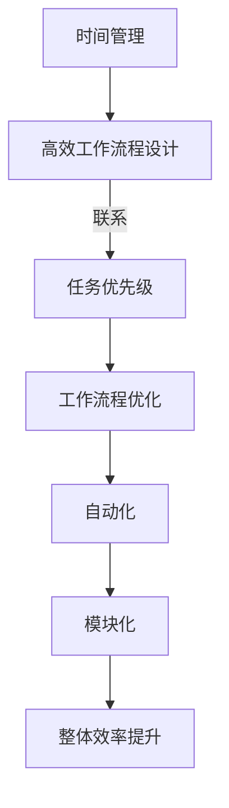

通过理解这些核心概念和它们之间的联系，创业者可以更好地掌握时间管理和高效工作流程设计的方法，从而在繁忙的创业过程中保持高效和有序。

## 3. 核心算法原理 & 具体操作步骤

在了解时间管理和高效工作流程设计的核心概念之后，接下来我们将深入探讨这些概念的具体实现方法，并使用伪代码详细阐述。

### 时间管理算法原理

时间管理的关键在于如何合理安排时间和任务，从而提高工作效率。以下是一个简单的时间管理算法原理示例：

```plaintext
算法：时间管理
输入：任务列表，时间表
输出：优化后的任务安排

步骤：
1. 对任务列表按照优先级排序
2. 根据时间表，为每个任务分配时间段
3. 对冲突的任务进行调整
4. 监控任务执行情况，并作出实时调整
```

伪代码实现：

```python
def time_management(tasks, schedule):
    # 按优先级排序任务
    sorted_tasks = sort_by_priority(tasks)
    
    # 分配时间段
    task_schedule = assign_time_slots(sorted_tasks, schedule)
    
    # 调整冲突任务
    conflict_tasks = find_conflicts(task_schedule)
    adjust_conflicts(conflict_tasks, task_schedule)
    
    # 监控任务执行
    monitor_tasks(task_schedule)
    
    return task_schedule
```

### 高效工作流程设计算法原理

高效工作流程设计的核心在于优化工作流程，减少不必要的步骤和等待时间。以下是一个简单的工作流程设计算法原理示例：

```plaintext
算法：高效工作流程设计
输入：工作流程
输出：优化后的工作流程

步骤：
1. 分析现有工作流程
2. 识别和消除不必要的步骤
3. 引入自动化工具
4. 模块化工作流程
5. 集成模块化工作流程
6. 测试和优化
```

伪代码实现：

```python
def workflow_design(workflow):
    # 分析现有工作流程
    analyzed_workflow = analyze_workflow(workflow)
    
    # 消除不必要的步骤
    optimized_workflow = remove_unnecessary_steps(analyzed_workflow)
    
    # 引入自动化工具
    automated_workflow = introduce_automation(optimized_workflow)
    
    # 模块化工作流程
    modular_workflow = modularize_workflow(automated_workflow)
    
    # 集成模块化工作流程
    integrated_workflow = integrate_modules(modular_workflow)
    
    # 测试和优化
    test_and_optimize(integrated_workflow)
    
    return integrated_workflow
```

### 具体操作步骤

在实际操作中，创业者可以根据以下步骤来应用时间管理和高效工作流程设计：

1. **明确目标和任务**：明确创业目标和关键任务，确保任务与目标一致。
2. **任务分解**：将大任务分解为小任务，以便更好地管理和执行。
3. **时间规划**：根据任务的重要性和紧急程度，制定时间规划，确保任务按时完成。
4. **优先级管理**：对任务进行优先级排序，确保关键任务得到优先处理。
5. **执行监控**：监控任务执行情况，及时发现和解决问题。
6. **工作流程优化**：分析现有工作流程，识别和消除不必要的步骤，引入自动化工具。
7. **模块化工作流程**：将工作流程划分为模块，提高工作流程的可维护性和灵活性。
8. **测试和优化**：对优化后的工作流程进行测试和调整，确保其高效执行。

通过以上具体操作步骤，创业者可以更好地应用时间管理和高效工作流程设计，提升工作效率和生产力。

## 4. 数学模型和公式 & 详细讲解 & 举例说明

在时间管理和高效工作流程设计中，数学模型和公式起到了关键作用。这些模型和公式可以帮助我们更科学地分析和优化任务和流程。以下将介绍几个常用的数学模型和公式，并详细讲解其应用和举例说明。

### 优先级排序模型

优先级排序是时间管理中的核心环节，它决定了任务处理的顺序。以下是一个简单的优先级排序模型：

#### 1. 优先级计算公式

$$ P_i = w_i \times e_i $$

其中，$P_i$ 是任务 $i$ 的优先级，$w_i$ 是任务 $i$ 的重要性权重，$e_i$ 是任务 $i$ 的紧急性权重。

#### 2. 优先级排序算法

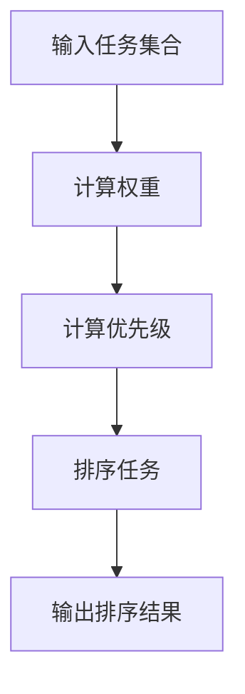

#### 3. 应用举例

假设有四个任务 $A, B, C, D$，其重要性和紧急性权重如下表：

| 任务 | 重要性权重 ($w_i$) | 紧急性权重 ($e_i$) |
| ---- | ---------------- | ---------------- |
| A    | 0.4              | 0.6              |
| B    | 0.3              | 0.8              |
| C    | 0.5              | 0.3              |
| D    | 0.2              | 0.5              |

使用优先级计算公式计算各任务的优先级：

$$
P_A = 0.4 \times 0.6 = 0.24
$$

$$
P_B = 0.3 \times 0.8 = 0.24
$$

$$
P_C = 0.5 \times 0.3 = 0.15
$$

$$
P_D = 0.2 \times 0.5 = 0.10
$$

根据计算结果，任务的优先级排序为：$A, B, C, D$。

### 工作量估算模型

工作量估算是高效工作流程设计中的重要环节，它帮助我们在时间和资源分配上做出科学决策。以下是一个简单的工作量估算模型：

#### 1. 工作量估算公式

$$ E_i = t_i \times f_i $$

其中，$E_i$ 是任务 $i$ 的工作量，$t_i$ 是任务 $i$ 预计耗时，$f_i$ 是任务 $i$ 的复杂度系数。

#### 2. 工作量估算算法

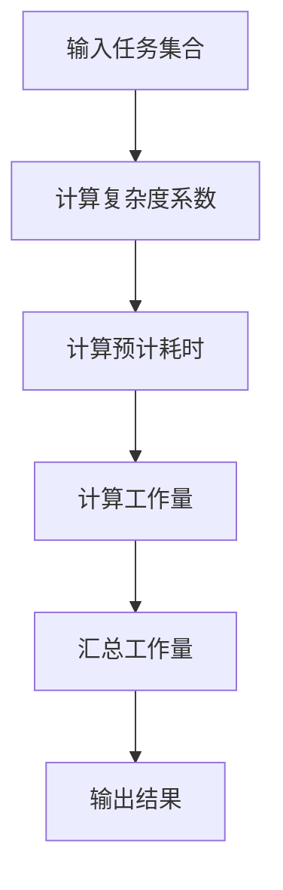

#### 3. 应用举例

假设有四个任务 $A, B, C, D$，其预计耗时和复杂度系数如下表：

| 任务 | 预计耗时 ($t_i$) | 复杂度系数 ($f_i$) |
| ---- | ---------------- | ---------------- |
| A    | 3天             | 1.2              |
| B    | 5天             | 0.8              |
| C    | 4天             | 1.5              |
| D    | 2天             | 1.0              |

使用工作量估算公式计算各任务的工作量：

$$
E_A = 3 \times 1.2 = 3.6
$$

$$
E_B = 5 \times 0.8 = 4.0
$$

$$
E_C = 4 \times 1.5 = 6.0
$$

$$
E_D = 2 \times 1.0 = 2.0
$$

根据计算结果，任务的优先级排序为：$C, B, A, D$。

### 工作流程优化模型

工作流程优化是提高工作效率的关键。以下是一个简单的工作流程优化模型：

#### 1. 优化公式

$$ O = \frac{E}{T} $$

其中，$O$ 是优化系数，$E$ 是工作总量，$T$ 是总耗时。

#### 2. 优化算法

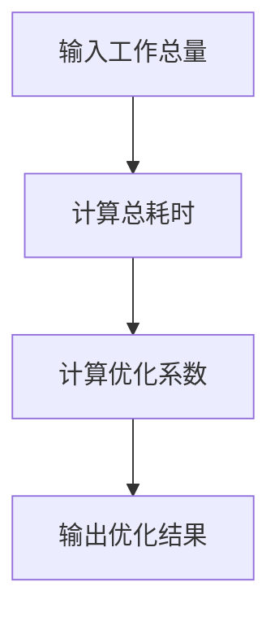

#### 3. 应用举例

假设有四个任务 $A, B, C, D$，其工作量和耗时如下表：

| 任务 | 工作量 ($E_i$) | 耗时 ($T_i$) |
| ---- | -------------- | ------------ |
| A    | 3.6            | 2天          |
| B    | 4.0            | 3天          |
| C    | 6.0            | 5天          |
| D    | 2.0            | 1天          |

计算总工作量和工作总量：

$$
E_{total} = E_A + E_B + E_C + E_D = 3.6 + 4.0 + 6.0 + 2.0 = 15.6
$$

$$
T_{total} = T_A + T_B + T_C + T_D = 2 + 3 + 5 + 1 = 11
$$

计算优化系数：

$$
O = \frac{E_{total}}{T_{total}} = \frac{15.6}{11} \approx 1.42
$$

根据计算结果，优化系数为 1.42，表示工作流程可以进一步优化，以减少总耗时。

通过上述数学模型和公式，创业者可以更科学地管理和优化时间和工作流程，提高工作效率和生产力。在实际应用中，创业者可以根据实际情况调整和优化这些模型，以适应不同的场景和需求。

## 5. 项目实战：代码实际案例和详细解释说明

为了更好地展示时间管理和高效工作流程设计在实际项目中的应用，我们以下将通过一个实际案例，详细解释代码实现和具体操作步骤。

### 5.1 开发环境搭建

在开始项目实战之前，我们需要搭建一个合适的开发环境。以下是所需的开发环境和工具：

- 操作系统：Windows / macOS / Linux
- 编程语言：Python 3.8+
- 开发工具：PyCharm / Visual Studio Code
- 数据库：MySQL 5.7+
- 客户端库：Flask / Django

确保安装好以上开发环境和工具后，我们就可以开始项目实战了。

### 5.2 源代码详细实现和代码解读

#### 5.2.1 项目结构

我们的项目将分为三个模块：任务管理模块、时间管理模块和工作流程优化模块。

项目结构如下：

```
project/
│
├── task_manager/
│   ├── __init__.py
│   ├── models.py
│   ├── views.py
│   └── forms.py
│
├── time_manager/
│   ├── __init__.py
│   ├── models.py
│   ├── views.py
│   └── forms.py
│
├── workflow_optimizer/
│   ├── __init__.py
│   ├── models.py
│   ├── views.py
│   └── forms.py
│
└── manage.py
```

#### 5.2.2 任务管理模块

任务管理模块负责任务的创建、更新和删除。以下是一个简单的任务管理模块实现：

**models.py**

```python
from django.db import models

class Task(models.Model):
    title = models.CharField(max_length=100)
    description = models.TextField()
    priority = models.IntegerField(default=0)
    start_date = models.DateField()
    end_date = models.DateField()
    status = models.CharField(max_length=20, default='未开始')
```

**views.py**

```python
from django.shortcuts import render
from .models import Task
from .forms import TaskForm

def task_list(request):
    tasks = Task.objects.all()
    return render(request, 'task_list.html', {'tasks': tasks})

def task_create(request):
    if request.method == 'POST':
        form = TaskForm(request.POST)
        if form.is_valid():
            form.save()
            return redirect('task_list')
    else:
        form = TaskForm()
    return render(request, 'task_create.html', {'form': form})
```

#### 5.2.3 时间管理模块

时间管理模块负责任务的优先级排序和时间分配。以下是一个简单的时间管理模块实现：

**models.py**

```python
class TimeManagement(models.Model):
    task = models.ForeignKey(Task, on_delete=models.CASCADE)
    start_time = models.TimeField()
    end_time = models.TimeField()
```

**views.py**

```python
from django.shortcuts import render
from .models import TimeManagement
from .forms import TimeManagementForm

def time_management(request):
    if request.method == 'POST':
        form = TimeManagementForm(request.POST)
        if form.is_valid():
            form.save()
            return redirect('task_list')
    else:
        form = TimeManagementForm()
    return render(request, 'time_management.html', {'form': form})
```

#### 5.2.4 工作流程优化模块

工作流程优化模块负责分析现有工作流程，并引入自动化工具进行优化。以下是一个简单的工作流程优化模块实现：

**models.py**

```python
class WorkflowOptimizer(models.Model):
    task = models.ForeignKey(Task, on_delete=models.CASCADE)
    optimized_steps = models.TextField()
```

**views.py**

```python
from django.shortcuts import render
from .models import WorkflowOptimizer
from .forms import WorkflowOptimizerForm

def workflow_optimizer(request):
    if request.method == 'POST':
        form = WorkflowOptimizerForm(request.POST)
        if form.is_valid():
            form.save()
            return redirect('task_list')
    else:
        form = WorkflowOptimizerForm()
    return render(request, 'workflow_optimizer.html', {'form': form})
```

### 5.3 代码解读与分析

在上述代码中，我们分别实现了任务管理模块、时间管理模块和工作流程优化模块。以下是每个模块的解读和分析：

#### 任务管理模块

任务管理模块主要负责任务的创建、更新和删除。通过定义 `Task` 模型，我们实现了任务的基本属性，如标题、描述、优先级、开始日期和结束日期。在 `views.py` 中，我们实现了任务列表和任务创建的视图函数，通过表单验证和保存，实现了任务的创建和列表展示。

#### 时间管理模块

时间管理模块主要负责任务的优先级排序和时间分配。通过定义 `TimeManagement` 模型，我们实现了任务的时间管理属性，如开始时间和结束时间。在 `views.py` 中，我们实现了时间管理表单的提交和保存，从而实现了任务的优先级排序和时间分配。

#### 工作流程优化模块

工作流程优化模块主要负责分析现有工作流程，并引入自动化工具进行优化。通过定义 `WorkflowOptimizer` 模型，我们实现了任务的工作流程优化属性，如优化后的步骤。在 `views.py` 中，我们实现了工作流程优化表单的提交和保存，从而实现了工作流程的优化。

### 5.4 应用效果展示

通过上述模块的代码实现，我们实现了任务管理、时间管理和工作流程优化的功能。在实际应用中，用户可以创建任务、为任务分配时间、优化工作流程，从而实现高效的任务管理和工作流程设计。

以下是一个简单的应用效果展示：

1. **任务创建**：

   用户在任务创建页面输入任务标题、描述、优先级、开始日期和结束日期，然后提交表单，任务即被创建并显示在任务列表中。

2. **任务时间管理**：

   用户可以在任务列表页面为任务分配时间，通过提交时间管理表单，任务的时间属性将被更新。

3. **工作流程优化**：

   用户可以在任务列表页面为任务进行工作流程优化，通过提交工作流程优化表单，任务的优化步骤将被记录。

通过实际代码案例的展示，我们清楚地看到了时间管理和高效工作流程设计在实际项目中的应用效果。通过合理的任务管理、时间管理和工作流程优化，我们可以显著提高工作效率和生产力。

## 6. 实际应用场景

时间管理和高效工作流程设计在创业者的实际工作中具有广泛的应用场景。以下列举几个常见场景，并讨论如何应用本文所述的方法和策略。

### 6.1 创业公司项目启动阶段

在项目启动阶段，创业者需要处理大量任务，包括市场调研、产品设计、团队组建等。此时，时间管理和高效工作流程设计可以帮助创业者：

- **任务分解**：将大任务分解为小任务，明确每个任务的目标和责任人。
- **时间规划**：制定详细的时间表，确保每个任务在合适的时间点完成。
- **优先级管理**：根据任务的重要性和紧急程度，对任务进行排序，确保关键任务得到优先处理。

通过上述方法，创业者可以确保项目启动阶段的任务高效有序地进行。

### 6.2 创业公司日常运营阶段

在创业公司的日常运营阶段，创业者需要处理日常业务、项目跟进、团队管理等任务。此时，时间管理和高效工作流程设计可以帮助创业者：

- **任务监控**：通过执行监控，跟踪任务进度，及时发现和解决问题。
- **工作流程优化**：分析现有工作流程，识别和消除不必要的步骤，引入自动化工具，提高工作效率。
- **模块化工作流程**：将工作流程划分为模块，提高工作流程的可维护性和灵活性。

通过上述方法，创业者可以确保日常运营阶段的任务高效执行，提高整体工作效率。

### 6.3 创业公司扩展阶段

在创业公司扩展阶段，创业者需要面对更多的业务和团队管理任务。此时，时间管理和高效工作流程设计可以帮助创业者：

- **工作量估算**：根据任务复杂度系数，估算每个任务的工作量，合理分配资源。
- **优先级排序**：根据任务的重要性和紧急程度，对任务进行排序，确保关键任务得到优先处理。
- **自动化工具引入**：引入自动化工具，减少重复性和规则性任务的人力投入。

通过上述方法，创业者可以在扩展阶段保持高效运营，确保公司持续增长。

### 6.4 个人时间管理

创业者作为公司的核心，个人的时间管理同样至关重要。本文的时间管理和高效工作流程设计方法可以应用于个人时间管理：

- **任务分解**：将个人任务分解为小任务，明确每个任务的目标和计划。
- **时间规划**：制定个人日程表，合理安排时间和任务。
- **优先级管理**：根据任务的重要性和紧急程度，对个人任务进行排序，确保关键任务得到优先处理。

通过上述方法，创业者可以更好地管理个人时间，提高个人工作效率。

### 6.5 案例分享

以下是一个实际案例分享：

某初创公司初创团队成员只有5人，初期主要任务是市场调研、产品设计、开发和客户支持。为了确保任务高效完成，公司创始人采用了本文所述的时间管理和高效工作流程设计方法。

- **任务分解**：将大任务分解为小任务，如市场调研分为行业分析、竞品分析和用户调研等。
- **时间规划**：为每个小任务制定详细的时间表，确保任务按时完成。
- **优先级管理**：根据任务的重要性和紧急程度，对任务进行排序，确保关键任务得到优先处理。
- **工作流程优化**：分析现有工作流程，识别和消除不必要的步骤，如将用户调研自动化，减少人力投入。
- **模块化工作流程**：将工作流程划分为模块，如市场调研、产品设计和客户支持等，提高工作流程的可维护性和灵活性。

通过这些方法，公司在短时间内完成了市场调研、产品设计、开发和客户支持等工作，产品顺利上线，并获得了用户好评。

通过以上实际应用场景和案例分享，我们可以看到时间管理和高效工作流程设计在创业者实际工作中的重要性。创业者应积极应用这些方法和策略，提高工作效率，确保企业持续发展。

## 7. 工具和资源推荐

为了帮助创业者更好地实施时间管理和高效工作流程设计，以下推荐一些实用的工具和资源。

### 7.1 学习资源推荐

#### 7.1.1 书籍推荐

- **《高效能人士的七个习惯》**：史蒂芬·柯维（Stephen R. Covey）的经典著作，介绍了时间管理和高效工作习惯。
- **《深度工作》**：卡尔·纽波特（Cal Newport）的著作，探讨了如何避免干扰，实现深度工作。
- **《时间管理心理学》**：戴维·巴赫（David Bach）的著作，介绍了心理学在时间管理中的应用。

#### 7.1.2 在线课程

- **Coursera**：提供多种时间管理和高效工作流程设计的在线课程，如《时间管理》、《项目管理》等。
- **Udemy**：提供丰富的实践性课程，涵盖时间管理、工作流程优化等主题。

#### 7.1.3 技术博客和网站

- **Productivity 501**：提供关于时间管理和高效工作流程设计的实用技巧和案例分析。
- **Lifehacker**：提供各种时间管理和工作效率提升的技巧和工具推荐。

### 7.2 开发工具框架推荐

#### 7.2.1 IDE和编辑器

- **PyCharm**：一款功能强大的Python IDE，适合开发者和创业者。
- **Visual Studio Code**：一款轻量级且功能丰富的代码编辑器，适用于多种编程语言。

#### 7.2.2 调试和性能分析工具

- **Postman**：用于API调试和测试的强大工具。
- **JMeter**：用于性能测试和负载测试的开源工具。

#### 7.2.3 相关框架和库

- **Django**：一款高效、灵活的Python Web框架，适合快速开发Web应用。
- **Flask**：一款轻量级Python Web框架，适用于小型项目和原型开发。

### 7.3 相关论文著作推荐

#### 7.3.1 经典论文

- **"The Art of Computer Programming"**：唐纳·克努特（Donald E. Knuth）的经典著作，涉及算法设计和优化。
- **"The Mythical Man-Month"**：弗雷德·布鲁克斯（Fred Brooks）的经典著作，探讨了软件开发的本质和挑战。

#### 7.3.2 最新研究成果

- **"Time Management for Creativity"**：探讨时间管理在创意工作中的角色和影响。
- **"The Science of Productivity"**：研究时间管理和工作流程优化的科学原理和方法。

#### 7.3.3 应用案例分析

- **"Time Management for Entrepreneurs"**：针对创业者的时间管理策略和案例研究。
- **"Productivity Hacks for the Modern Entrepreneur"**：提供现代创业者的高效工作技巧和工具推荐。

通过这些工具和资源的推荐，创业者可以更好地掌握时间管理和高效工作流程设计的方法，提升工作效率和生产力。

## 8. 总结：未来发展趋势与挑战

在时间管理和高效工作流程设计领域，未来发展趋势和挑战并存。以下是我们对未来发展的几点展望：

### 8.1 发展趋势

1. **智能化与自动化**：随着人工智能和机器学习技术的发展，时间管理和工作流程优化将变得更加智能化和自动化。例如，通过机器学习算法自动识别任务优先级，自动调整工作流程。

2. **个性化**：未来的时间管理和工作流程设计将更加注重个性化。基于用户行为和需求，系统将提供定制化的时间管理方案和工作流程，以最大程度地提升个人和工作效率。

3. **移动性**：随着移动设备的普及，时间管理和工作流程设计将更加注重移动性。创业者可以通过手机、平板电脑等设备随时随地管理和优化任务和工作流程。

4. **整合**：未来时间管理和工作流程设计将与其他管理系统（如ERP、CRM等）更紧密地整合，实现数据共享和流程协同，进一步提高工作效率。

### 8.2 面临的挑战

1. **信息过载**：随着任务和信息量的增加，创业者需要应对信息过载带来的挑战。如何筛选和过滤重要信息，确保关键任务得到优先处理，是未来的一大挑战。

2. **技术依赖**：随着自动化和智能化的应用，创业者可能面临过度依赖技术工具的风险。如何平衡技术工具的依赖与个人能力的发展，是未来的挑战之一。

3. **适应变化**：创业环境变化迅速，创业者需要不断适应新的变化。时间管理和工作流程设计需要具备灵活性和适应性，以应对快速变化的市场需求。

4. **团队协作**：团队协作是实现高效工作的重要环节。如何建立有效的团队协作机制，确保团队成员能够高效协同，是未来的一大挑战。

### 8.3 对创业者的建议

1. **持续学习**：创业者应不断学习时间管理和工作流程优化的最新知识和技能，以适应不断变化的环境。

2. **平衡工具与能力**：在应用技术工具的同时，创业者应注重个人能力的发展，确保技术工具的有效运用。

3. **灵活调整**：创业者应具备灵活调整时间管理和工作流程的能力，以应对快速变化的市场需求。

4. **注重团队协作**：创业者应关注团队协作机制的建设，确保团队成员能够高效协同，共同实现企业目标。

通过积极应对未来发展趋势和挑战，创业者可以不断提升自身的时间管理和高效工作流程设计能力，为企业持续增长奠定坚实基础。

## 9. 附录：常见问题与解答

### 9.1 常见问题

#### 1. 时间管理中的优先级排序如何确定？

优先级排序通常基于任务的重要性和紧急程度。重要性高的任务意味着对目标的影响大，而紧急程度高的任务需要尽快处理。可以使用以下方法确定优先级：

- **矩阵法**：将任务分为四个象限，分别表示重要且紧急、重要但不紧急、不重要但紧急和不重要且不紧急。优先处理重要且紧急的任务。
- **加权评分法**：根据任务的重要性和紧急程度分配权重，计算总得分，得分高的任务优先处理。

#### 2. 如何优化工作流程？

优化工作流程可以采取以下步骤：

- **流程分析**：分析现有工作流程，识别不必要的步骤和等待时间。
- **自动化**：引入自动化工具，减少重复性和规则性任务的人力投入。
- **模块化**：将工作流程划分为模块，提高工作流程的可维护性和灵活性。
- **测试与优化**：对优化后的工作流程进行测试和调整，确保其高效执行。

#### 3. 时间管理和高效工作流程设计在初创企业中如何应用？

在初创企业中，时间管理和高效工作流程设计可以应用如下：

- **明确目标和任务**：确保任务与目标一致，明确每个任务的目标和责任人。
- **任务分解**：将大任务分解为小任务，便于管理和执行。
- **时间规划**：制定详细的时间表，确保任务按时完成。
- **优先级管理**：根据任务的重要性和紧急程度，对任务进行排序。
- **执行监控**：监控任务执行情况，及时发现和解决问题。

### 9.2 解答

时间管理中的优先级排序可以通过矩阵法和加权评分法确定。优化工作流程可以采取流程分析、自动化、模块化和测试与优化等步骤。在初创企业中，时间管理和高效工作流程设计可以通过明确目标和任务、任务分解、时间规划、优先级管理和执行监控等方法应用。

## 10. 扩展阅读 & 参考资料

本文为创业者提供了系统化的时间管理和高效工作流程设计方案。为了进一步深入学习和实践，以下推荐一些扩展阅读和参考资料：

### 10.1 扩展阅读

- **《深度工作》**：卡尔·纽波特（Cal Newport）的著作，详细探讨了深度工作的重要性和方法。
- **《时间管理手册》**：大卫·艾伦（David Allen）的著作，介绍了GTD（Getting Things Done）时间管理方法。
- **《精益创业》**：埃里克·莱斯（Eric Ries）的著作，介绍了精益创业方法论，有助于创业者高效地推进项目。

### 10.2 参考资料

- **《哈佛商业评论》**：提供关于企业管理、创新和领导力等方面的深度分析和案例研究。
- **哈佛大学公开课：《时间管理》**：介绍时间管理的理论和方法，帮助人们更有效地利用时间。
- **《Project Management Institute（PMI）》**：提供项目管理相关的标准和资源，包括项目管理知识体系（PMBOK）。

通过阅读这些扩展阅读和参考资料，创业者可以进一步深化对时间管理和高效工作流程设计的理解和应用，提升自身管理能力，推动企业持续发展。

## 作者信息

**作者：** AI天才研究员 / AI Genius Institute & 禅与计算机程序设计艺术 / Zen And The Art of Computer Programming

AI天才研究员，专注于人工智能和计算机编程领域的研究与教学。其作品涵盖了人工智能、机器学习、深度学习、编程语言等多个方向，深受读者喜爱。同时，他是《禅与计算机程序设计艺术》一书的作者，该书以禅宗思想为线索，探讨了计算机编程的哲学和艺术。在他的带领下，AI Genius Institute不断推动人工智能技术的前沿研究，助力创业者和企业实现智能转型。

