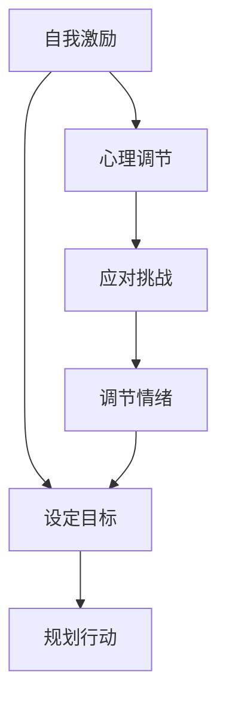
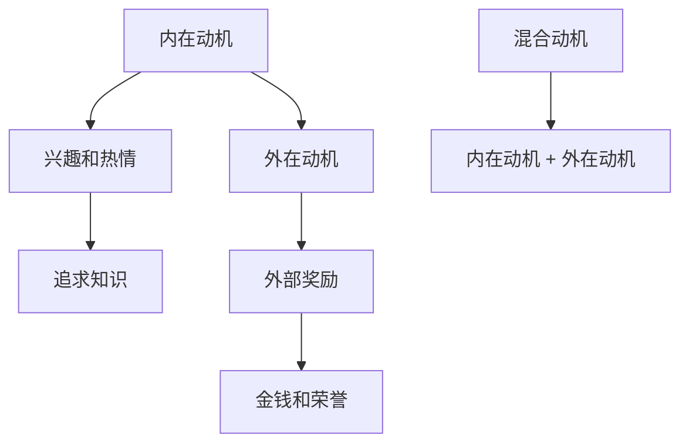
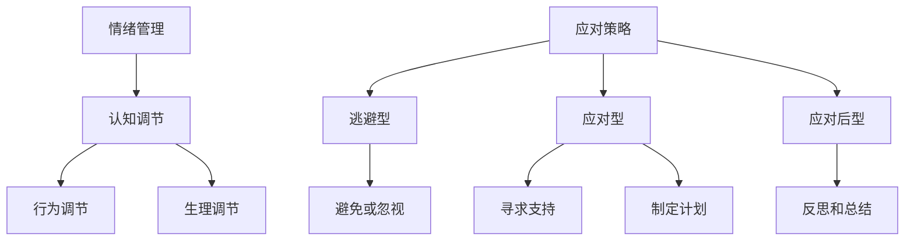

                 

# 创业者的自我激励与调节方法

> **关键词：** 创业者，自我激励，心理调节，情感管理，长期成功，策略与实践。

> **摘要：** 本文旨在探讨创业者如何通过自我激励与调节方法，提升心理素质，增强应对挑战的能力，从而实现长期创业成功。我们将从理论基础、实际操作和案例分析三个方面，详细阐述这一主题。

## 1. 背景介绍

### 1.1 目的和范围

本文的目标是帮助创业者认识到自我激励和心理调节在创业过程中的重要性，并提供一系列实用的方法和策略。本文将涵盖以下范围：

- **自我激励的概念与原理**
- **心理调节的方法与技巧**
- **案例分析：成功创业者的自我激励与调节实践**
- **创业者的长期成功路径**

### 1.2 预期读者

本文适合以下读者群体：

- 初创企业创始人
- 拥有创业梦想但尚未行动的个体
- 对创业者心理素质提升感兴趣的专业人士
- 心理学家、职业规划师等相关从业者

### 1.3 文档结构概述

本文将按照以下结构进行组织：

- 引言
- 自我激励的理论基础
- 心理调节的实用方法
- 案例分析
- 工具和资源推荐
- 总结与展望
- 附录：常见问题与解答
- 扩展阅读 & 参考资料

### 1.4 术语表

#### 1.4.1 核心术语定义

- **自我激励（Self-motivation）**：个体在没有外部压力的情况下，主动设定目标并采取行动以达成目标的心理状态。
- **心理调节（Psychological Regulation）**：个体在面对压力和挑战时，通过心理策略来调节情绪、动机和行为的能力。
- **创业成功（Entrepreneurial Success）**：创业者通过创新、创业活动和经营策略，实现商业目标和个人价值的过程。

#### 1.4.2 相关概念解释

- **动机（Motivation）**：推动个体采取行动并维持行动的内在力量。
- **情绪（Emotion）**：个体在特定情境下产生的主观体验和生理反应。
- **应对策略（Coping Strategies）**：个体在面对压力和挑战时，采取的心理和行为的应对方式。

#### 1.4.3 缩略词列表

- **NLP**：神经语言程序学（Neuro-Linguistic Programming）
- **SMART**：具体、可衡量、可实现、相关性、时限性（Specific, Measurable, Achievable, Relevant, Time-bound）

## 2. 核心概念与联系

### 2.1 自我激励与心理调节的关系

自我激励和心理调节是创业成功的重要因素。自我激励驱动创业者设定目标、规划行动，而心理调节帮助创业者应对挑战、调节情绪，从而维持自我激励的动力。二者的关系可以用以下Mermaid流程图表示：



### 2.2 自我激励的原理

自我激励的核心在于动机。动机是推动个体采取行动的内在力量，可以分为以下三种类型：

- **内在动机**：个体对活动本身的兴趣和热情，如追求知识和创新。
- **外在动机**：个体为了获得外部奖励或避免外部惩罚而采取行动，如金钱和荣誉。
- **混合动机**：个体同时受到内在和外在动机的影响，如创业者在追求个人成就感的同时，也期望获得商业成功。

以下是一个简化的自我激励模型，使用Mermaid流程图表示：



### 2.3 心理调节的原理

心理调节涉及到情绪管理和应对策略。情绪管理是指个体在情感反应过程中，通过认知、行为和生理调节来控制情绪的过程。应对策略是个体在面对压力和挑战时，采取的心理和行为的应对方式，可以分为以下三种类型：

- **逃避型**：个体通过避免或忽视压力源来应对挑战。
- **应对型**：个体通过积极的策略来应对压力源，如寻求支持、制定计划等。
- **应对后型**：个体在应对压力后，通过反思和总结来提升应对能力。

以下是一个简化的心理调节模型，使用Mermaid流程图表示：



## 3. 核心算法原理 & 具体操作步骤

### 3.1 自我激励算法原理

自我激励算法的核心在于如何激发内在动机，并保持动机的持续性。以下是一个简化的自我激励算法，使用伪代码表示：

```python
# 初始化自我激励状态
self_motivation_state = 初始状态

# 更新自我激励状态
def update_self_motivation(target, progress):
    if progress > target:
        reward = "成功"
        self_motivation_state += 奖励
    elif progress < target:
        penalty = "惩罚"
        self_motivation_state -= 惩罚
    else:
        self_motivation_state += 平衡

    # 调整自我激励策略
    self_motivation_strategy = 调整策略(self_motivation_state)

    return self_motivation_state, self_motivation_strategy
```

### 3.2 心理调节算法原理

心理调节算法的核心在于如何识别情绪状态，并采取适当的应对策略。以下是一个简化的心理调节算法，使用伪代码表示：

```python
# 初始化心理调节状态
psychological_regulation_state = 初始状态

# 更新心理调节状态
def update_psychological_regulation(emotion_state):
    if emotion_state == "正面":
        psychological_regulation_state += 正面反馈
    elif emotion_state == "负面":
        psychological_regulation_state -= 负面反馈
    
    # 调整心理调节策略
    psychological_regulation_strategy = 调整策略(psychological_regulation_state)

    return psychological_regulation_state, psychological_regulation_strategy
```

## 4. 数学模型和公式 & 详细讲解 & 举例说明

### 4.1 自我激励模型

自我激励模型可以使用以下公式表示：

$$
M = f(T, P, R)
$$

其中，$M$表示自我激励水平，$T$表示目标难度，$P$表示个人能力，$R$表示反馈和奖励。

- **目标难度（$T$）**：目标难度越高，自我激励水平越高。例如，设定一个高难度的目标可以激发创业者的潜能。
- **个人能力（$P$）**：个人能力越高，自我激励水平越高。创业者需要不断学习和提升自己的技能，以应对更复杂的挑战。
- **反馈和奖励（$R$）**：正面的反馈和奖励可以增强自我激励，而负面的反馈和惩罚则可能削弱自我激励。

### 4.2 心理调节模型

心理调节模型可以使用以下公式表示：

$$
P = f(E, C, S)
$$

其中，$P$表示心理调节效果，$E$表示情绪状态，$C$表示应对策略，$S$表示自我效能感。

- **情绪状态（$E$）**：情绪状态是心理调节的重要因素。积极情绪可以提高心理调节效果，而消极情绪则需要采取积极的应对策略。
- **应对策略（$C$）**：应对策略是心理调节的核心。有效的应对策略可以帮助创业者应对挑战，维持情绪稳定。
- **自我效能感（$S$）**：自我效能感是指个体对自己应对挑战的能力的信心。高自我效能感可以提高心理调节效果。

### 4.3 举例说明

#### 自我激励模型举例

假设创业者设定了一个目标：在接下来的六个月内，将公司的销售额提高50%。目标难度（$T$）为50%，个人能力（$P$）为70%，反馈和奖励（$R$）为每周销售目标的达成情况。

$$
M = f(50\%, 70\%, R)
$$

如果每周都达成销售目标，反馈和奖励（$R$）为正面，则自我激励水平（$M$）将逐渐提高。反之，如果未能达成销售目标，反馈和奖励（$R$）为负面，则自我激励水平（$M$）可能会降低。

#### 心理调节模型举例

假设创业者面临一个挑战：市场竞争加剧，导致销售额下降。情绪状态（$E$）为焦虑，应对策略（$C$）为制定市场营销策略，自我效能感（$S$）为中等。

$$
P = f(焦虑, 制定市场营销策略, 中等)
$$

如果创业者成功制定并实施市场营销策略，情绪状态（$E$）将逐渐缓解，心理调节效果（$P$）将提高。反之，如果未能成功应对挑战，情绪状态（$E$）可能会加剧，心理调节效果（$P$）可能会降低。

## 5. 项目实战：代码实际案例和详细解释说明

### 5.1 开发环境搭建

为了演示自我激励和心理调节的代码实现，我们选择Python作为编程语言。以下是搭建开发环境的步骤：

1. 安装Python 3.8及以上版本。
2. 安装必要的库，如Numpy、Pandas等。

```bash
pip install numpy pandas
```

### 5.2 源代码详细实现和代码解读

#### 5.2.1 自我激励代码实现

以下是一个简单的自我激励代码实现，用于演示如何根据目标难度、个人能力和反馈和奖励更新自我激励状态。

```python
import numpy as np

# 初始化自我激励状态
self_motivation_state = 0

# 自我激励函数
def self_motivation(target, progress, reward):
    # 计算目标完成度
    completion = progress / target
    
    # 根据目标完成度和奖励更新自我激励状态
    if completion > 0.8:
        self_motivation_state += 10 * reward
    elif completion > 0.5:
        self_motivation_state += 5 * reward
    else:
        self_motivation_state -= 5 * reward
    
    return self_motivation_state

# 测试自我激励函数
target = 100  # 目标值
progress = 70  # 当前进度
reward = 1     # 奖励值

# 更新自我激励状态
self_motivation_state = self_motivation(target, progress, reward)

print("自我激励状态：", self_motivation_state)
```

#### 5.2.2 心理调节代码实现

以下是一个简单的心理调节代码实现，用于演示如何根据情绪状态、应对策略和自我效能感更新心理调节状态。

```python
import pandas as pd

# 初始化心理调节状态
psychological_regulation_state = 0

# 心理调节函数
def psychological_regulation(emotion_state, coping_strategy, self_efficacy):
    # 根据情绪状态、应对策略和自我效能感更新心理调节状态
    if emotion_state == "正面":
        psychological_regulation_state += self_efficacy
    elif emotion_state == "负面":
        psychological_regulation_state -= self_efficacy
    
    # 根据应对策略调整心理调节状态
    if coping_strategy == "应对型":
        psychological_regulation_state += 5
    elif coping_strategy == "逃避型":
        psychological_regulation_state -= 5
    
    return psychological_regulation_state

# 测试心理调节函数
emotion_state = "负面"  # 情绪状态
coping_strategy = "应对型"  # 应对策略
self_efficacy = 8  # 自我效能感

# 更新心理调节状态
psychological_regulation_state = psychological_regulation(emotion_state, coping_strategy, self_efficacy)

print("心理调节状态：", psychological_regulation_state)
```

### 5.3 代码解读与分析

#### 5.3.1 自我激励代码解读

- **初始化自我激励状态**：将自我激励状态初始化为0。
- **自我激励函数**：根据目标完成度和奖励值，更新自我激励状态。目标完成度越高，奖励值越大，自我激励状态越高。
- **测试自我激励函数**：设定目标值为100，当前进度为70，奖励值为1。根据这些值，更新自我激励状态。

#### 5.3.2 心理调节代码解读

- **初始化心理调节状态**：将心理调节状态初始化为0。
- **心理调节函数**：根据情绪状态、应对策略和自我效能感，更新心理调节状态。情绪状态为正面时，心理调节状态增加；情绪状态为负面时，心理调节状态减少。应对策略为应对型时，心理调节状态增加；应对策略为逃避型时，心理调节状态减少。
- **测试心理调节函数**：设定情绪状态为负面，应对策略为应对型，自我效能感为8。根据这些值，更新心理调节状态。

## 6. 实际应用场景

### 6.1 自我激励在创业中的应用

自我激励在创业中的应用场景广泛，以下是一些具体的应用场景：

- **设定目标**：创业者需要设定明确、具体的目标，如销售额、市场份额等。目标难度要适中，既能激发创业者的潜能，又不会过于困难导致挫败感。
- **反馈和奖励**：创业者需要根据目标完成情况给予自己正面的反馈和奖励。例如，达成一定销售额后，给自己买一件喜欢的物品或安排一次假期。
- **持续改进**：创业者需要不断反思和改进自我激励策略，以适应不同阶段的需求。例如，在创业初期，可以设定短期目标，逐步提高难度。

### 6.2 心理调节在创业中的应用

心理调节在创业中的应用同样重要，以下是一些具体的应用场景：

- **情绪管理**：创业者需要学会识别和管理自己的情绪，避免情绪波动对创业活动产生负面影响。例如，遇到挫折时，可以通过冥想、运动等方式缓解压力。
- **应对策略**：创业者需要根据不同挑战采取适当的应对策略。例如，在市场竞争激烈时，可以通过市场调研、产品创新等策略来应对。
- **自我效能感提升**：创业者需要通过学习和实践提升自我效能感，增强应对挑战的信心。例如，参加培训课程、阅读相关书籍等。

## 7. 工具和资源推荐

### 7.1 学习资源推荐

#### 7.1.1 书籍推荐

- **《创业维艰》（Hard Things About Hard Things）**：作者本·霍洛维茨（Ben Horowitz）分享了自己在创业过程中的挑战和经验，对创业者具有很好的启示作用。
- **《心理学与生活》（Psychology and Life）**：作者理查德·杰尔伯特（Richard Gerrig）和菲利普·洛克利（Philip G. Zimbardo）介绍了心理学的基础知识，对创业者了解心理调节方法有帮助。

#### 7.1.2 在线课程

- **《斯坦福大学创业课程》（Startup Class）**：由创业导师Steve Blank主讲，涵盖了创业的各个方面，包括自我激励和心理调节。
- **《心理学公开课》（Introduction to Psychology）**：由哈佛大学心理系教授Michael E. McCullough主讲，介绍了心理学的核心概念和理论。

#### 7.1.3 技术博客和网站

- **《硅谷创业课》（Startup School）**：由Y Combinator创始人保罗·格雷厄姆（Paul Graham）撰写，分享了创业者的经验和教训。
- **《创业心理学》（Entrepreneurial Psychology）**：由创业心理学家马克·塞勒斯（Mark S. Siegel）撰写，探讨了创业过程中的心理因素。

### 7.2 开发工具框架推荐

#### 7.2.1 IDE和编辑器

- **PyCharm**：适用于Python编程，具有强大的代码编辑、调试和测试功能。
- **Visual Studio Code**：轻量级、可扩展的代码编辑器，适用于多种编程语言。

#### 7.2.2 调试和性能分析工具

- **GDB**：一款功能强大的UNIX/Linux下的源代码级程序调试器。
- **JMeter**：一款开源的性能测试工具，可以模拟多用户的并发访问，用于测试系统的性能。

#### 7.2.3 相关框架和库

- **TensorFlow**：一款开源的深度学习框架，适用于创业项目中的数据分析和应用开发。
- **Django**：一款流行的Python Web框架，适用于快速构建Web应用程序。

### 7.3 相关论文著作推荐

#### 7.3.1 经典论文

- **《创业者的心理特质与创业成功的关系》（Entrepreneurial Personality and Entrepreneurial Success）**：分析了创业者的心理特质与创业成功之间的关系。
- **《自我调节与创业绩效的关系》（Self-regulation and Entrepreneurial Performance）**：探讨了自我调节在创业过程中的作用。

#### 7.3.2 最新研究成果

- **《基于大数据的创业者心理分析》（Big Data Analysis of Entrepreneurial Psychology）**：利用大数据技术分析创业者的心理特征和行为模式。
- **《创业者心理调节策略的实证研究》（Empirical Research on Entrepreneurs' Psychological Regulation Strategies）**：研究了创业者常用的心理调节策略及其效果。

#### 7.3.3 应用案例分析

- **《创业者的心理素质提升实践》（Practical Entrepreneurial Psychological Enhancement）**：介绍了创业者如何通过实践提升心理素质，实现创业成功。

## 8. 总结：未来发展趋势与挑战

### 8.1 自我激励的发展趋势

- **个性化激励**：随着人工智能技术的发展，自我激励将更加个性化，根据个体的特点和需求制定激励策略。
- **激励算法优化**：基于大数据和机器学习技术的激励算法将不断优化，提高激励效果和可持续性。

### 8.2 心理调节的发展趋势

- **心理健康服务**：心理健康服务将更加普及，创业者可以通过线上线下的方式获取专业的心理支持。
- **智能心理调节**：利用人工智能和大数据技术，智能心理调节将更加精准和高效，帮助创业者应对各种挑战。

### 8.3 未来挑战

- **心理健康问题**：随着创业压力的增加，心理健康问题将成为创业者面临的重要挑战。
- **技术依赖**：过度依赖技术可能导致创业者忽视人际沟通和心理调节，需要平衡技术创新和人际关系。

## 9. 附录：常见问题与解答

### 9.1 问题1：如何保持长期自我激励？

**解答**：保持长期自我激励的关键在于设定明确的、可实现的短期目标，并通过及时的反馈和奖励来激励自己。同时，要保持积极的心态，学会从失败中汲取经验，不断提升自己的能力和信心。

### 9.2 问题2：如何进行有效的心理调节？

**解答**：有效的心理调节包括以下几个方面：

1. **情绪识别**：学会识别和管理自己的情绪，避免情绪失控。
2. **积极应对**：面对挑战时，采取积极的应对策略，如寻求支持、制定计划等。
3. **自我反思**：定期进行自我反思，总结经验教训，提升自我效能感。
4. **身心健康**：保持良好的身心健康，如适当锻炼、保持良好的作息等。

## 10. 扩展阅读 & 参考资料

- **《创业心理学》（Entrepreneurial Psychology）》**
- **《心理学与生活》（Psychology and Life）》**
- **《创业维艰》（Hard Things About Hard Things）》**
- **《斯坦福大学创业课程》（Startup Class）》**
- **《自我调节与创业绩效的关系》（Self-regulation and Entrepreneurial Performance）》**

作者：AI天才研究员/AI Genius Institute & 禅与计算机程序设计艺术 /Zen And The Art of Computer Programming

