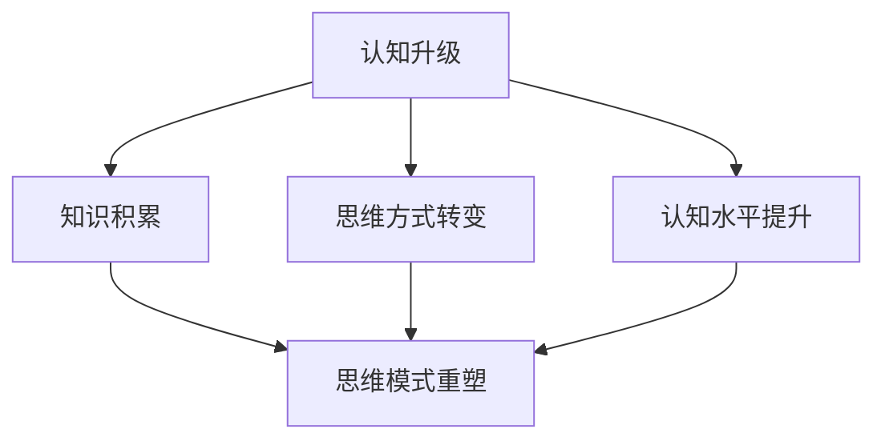

                 

# 创业者的认知升级与思维模式重塑

> 关键词：认知升级、思维模式、创业者、逻辑思维、决策优化、战略规划、创新思维
>
> 摘要：本文旨在探讨创业者在成长过程中如何通过认知升级与思维模式的重塑，实现从普通创业者到卓越领袖的蜕变。文章首先介绍了认知升级的重要性，随后深入分析了创业者在成长过程中需要掌握的核心思维模式，并通过实际案例和算法原理，展示了如何将这些思维模式应用于创业实践。文章最后对创业者的未来发展进行了展望，并提出了相关建议和资源推荐。

## 1. 背景介绍

### 1.1 目的和范围

本文的目标是帮助创业者理解并掌握认知升级与思维模式重塑的重要性，以及如何将其应用于创业实践。文章将涵盖以下主题：

1. 认知升级的内涵及其在创业中的作用。
2. 创业者需要培养的核心思维模式。
3. 如何将思维模式应用于创业决策和战略规划。
4. 实际案例和算法原理的解析。
5. 未来发展趋势与挑战。

通过本文的阅读，创业者将能够更深入地认识自我，明确发展方向，提升自身竞争力。

### 1.2 预期读者

本文适用于以下读者群体：

1. 初创企业的创始人或核心团队成员。
2. 拥有创业想法但尚未实际行动的人。
3. 对创业过程感兴趣的技术人员和管理者。
4. 希望提升自身认知和能力的企业家。

### 1.3 文档结构概述

本文结构如下：

1. 引言：介绍文章的主题和目的。
2. 背景介绍：阐述认知升级与思维模式重塑在创业中的重要性。
3. 核心概念与联系：介绍相关核心概念和架构。
4. 核心算法原理 & 具体操作步骤：讲解创业中常用的算法原理和操作步骤。
5. 数学模型和公式 & 详细讲解 & 举例说明：运用数学模型和公式解释创业中的复杂问题。
6. 项目实战：通过实际案例展示思维模式的应用。
7. 实际应用场景：分析思维模式在创业中的实际应用。
8. 工具和资源推荐：推荐相关学习资源和开发工具。
9. 总结：总结文章的核心观点和未来趋势。
10. 附录：常见问题与解答。
11. 扩展阅读 & 参考资料：提供进一步学习的途径。

### 1.4 术语表

#### 1.4.1 核心术语定义

- 认知升级：指通过不断学习和实践，提高个体对世界和自身的理解程度，从而提升思维水平和解决问题的能力。
- 创业者：指具有创业精神，愿意承担风险，致力于创建新企业或产品的人。
- 思维模式：指个体在思考问题和解决问题时采用的逻辑方法和习惯。

#### 1.4.2 相关概念解释

- 创新思维：指在思考过程中，通过突破传统思维模式，寻找新的解决方案和商业机会。
- 决策优化：指通过分析数据和信息，选择最优的决策方案，以实现预期的目标。

#### 1.4.3 缩略词列表

- CEX：认知升级
- CXO：首席认知官
- IDE：集成开发环境
- SaaS：软件即服务

## 2. 核心概念与联系

在创业过程中，认知升级和思维模式重塑是两个关键因素。为了更好地理解这两个概念，我们首先需要了解它们的基本原理和相互关系。

### 2.1 认知升级的原理

认知升级是指个体通过不断学习、实践和反思，提高对世界和自身的理解程度。这种升级不仅包括知识的积累，还包括思维方式的转变和认知水平的提升。

- **知识积累**：通过学习新的知识和技能，个体能够更好地理解业务、市场和竞争对手，从而为创业决策提供有力的支持。
- **思维方式转变**：通过不断反思和总结，个体能够摆脱固有思维模式的束缚，更加灵活地应对复杂多变的市场环境。
- **认知水平提升**：通过深入思考和洞察，个体能够更准确地预测市场趋势，制定更有效的战略规划。

### 2.2 思维模式重塑的原理

思维模式重塑是指通过不断练习和运用新的思维方式，改变个体在思考问题和解决问题时的逻辑方法和习惯。

- **逻辑思维**：通过逻辑思维，个体能够更清晰地分析问题，找到问题的本质和关键点，从而做出更准确的决策。
- **创新思维**：通过创新思维，个体能够突破传统思维模式的束缚，寻找新的解决方案和商业机会。
- **系统思维**：通过系统思维，个体能够从整体角度看待问题，分析各部分之间的相互作用和影响，从而做出更全面的决策。

### 2.3 认知升级与思维模式重塑的相互关系

认知升级和思维模式重塑是相互促进、相辅相成的。认知升级为思维模式重塑提供了基础和动力，而思维模式重塑则是认知升级的体现和应用。

- **认知升级推动思维模式重塑**：通过不断学习新的知识和技能，个体能够拓宽视野，提高思维能力，从而促使思维模式的转变。
- **思维模式重塑深化认知升级**：通过运用新的思维方式，个体能够更深入地理解问题和现象，从而进一步提高认知水平。

### 2.4 Mermaid 流程图

为了更直观地展示认知升级和思维模式重塑的过程，我们使用 Mermaid 流程图来表示。



在这个流程图中，A 表示认知升级，B、C、D 分别表示知识积累、思维方式转变和认知水平提升，它们共同推动思维模式重塑（E）。通过这个流程图，我们可以清晰地看到认知升级和思维模式重塑之间的相互关系。

## 3. 核心算法原理 & 具体操作步骤

在创业过程中，创业者需要运用一系列核心算法原理来辅助决策和战略规划。以下将介绍几个常用的算法原理，并详细讲解其具体操作步骤。

### 3.1 决策树算法原理

决策树是一种常用的机器学习算法，通过将数据集划分成多个子集，生成一棵树形结构，用于分类或回归问题。

**算法原理：**

1. **特征选择**：选择一个特征进行划分，通常使用信息增益、基尼系数等指标来评估特征的重要性。
2. **划分数据集**：根据选定的特征，将数据集划分成多个子集。
3. **递归划分**：对每个子集继续进行划分，直到满足停止条件（如最大深度、最小样本数等）。
4. **生成决策树**：将划分过程生成的树形结构表示为决策树。

**具体操作步骤：**

1. **初始化**：选择一个特征进行划分。
2. **划分数据集**：根据选定的特征，将数据集划分成多个子集。
3. **递归划分**：对每个子集继续进行划分，直到满足停止条件。
4. **生成决策树**：将划分过程生成的树形结构表示为决策树。

**伪代码：**

```python
def build_decision_tree(data_set):
    if 满足停止条件:
        return 叶子节点
    else:
        选择特征
        划分数据集
        递归划分每个子集
        生成决策树
        返回决策树
```

### 3.2 神经网络算法原理

神经网络是一种基于人脑神经元连接方式的计算机模型，用于解决分类、回归、生成等问题。

**算法原理：**

1. **输入层**：接收外部输入信息。
2. **隐藏层**：对输入信息进行变换和处理。
3. **输出层**：生成最终的输出结果。
4. **激活函数**：用于控制神经元的激活状态。

**具体操作步骤：**

1. **初始化网络参数**：设置输入层、隐藏层和输出层的权重和偏置。
2. **前向传播**：将输入信息传递到神经网络，逐层计算输出结果。
3. **反向传播**：根据输出结果和目标值，计算损失函数，并更新网络参数。
4. **迭代优化**：重复前向传播和反向传播，逐步优化网络参数。

**伪代码：**

```python
def train_neural_network(data_set, labels):
    初始化网络参数
    while 没有达到训练次数:
        前向传播
        计算损失函数
        反向传播
        更新网络参数
    返回训练完成的神经网络
```

### 3.3 遗传算法原理

遗传算法是一种基于生物进化的搜索算法，用于解决优化和搜索问题。

**算法原理：**

1. **初始化种群**：随机生成一组解。
2. **适应度评估**：计算每个解的适应度值。
3. **选择**：根据适应度值，选择适应度较高的个体进行交配。
4. **交配**：将选中的个体进行交叉和变异，生成新的后代。
5. **替代**：将新生成的后代替代原有种群中的个体。

**具体操作步骤：**

1. **初始化种群**：随机生成一组解。
2. **适应度评估**：计算每个解的适应度值。
3. **选择**：根据适应度值，选择适应度较高的个体进行交配。
4. **交配**：将选中的个体进行交叉和变异，生成新的后代。
5. **替代**：将新生成的后代替代原有种群中的个体。
6. **迭代优化**：重复选择、交配和替代过程，逐步优化解的质量。

**伪代码：**

```python
def train_genetic_algorithm(population, fitness_function):
    初始化种群
    while 没有达到迭代次数:
        适应度评估
        选择
        交配
        替代
    返回最优解
```

通过以上算法原理和具体操作步骤的介绍，创业者可以更好地理解如何在创业过程中运用这些算法，以提高决策效率和优化战略规划。

## 4. 数学模型和公式 & 详细讲解 & 举例说明

在创业过程中，数学模型和公式是理解和解决复杂问题的有力工具。以下将介绍几个常用的数学模型和公式，并详细讲解其应用和举例说明。

### 4.1 期望最大化（EM）算法

期望最大化（EM）算法是一种用于处理含有缺失数据的最大似然估计（MLE）问题。它通过迭代地优化期望（E）步骤和最大化（M）步骤来求解参数。

**公式：**

- 期望（E）步骤：
  $$ Q(\theta | \theta^{(t)}) = \frac{1}{Z} \prod_{i=1}^{n} \left[ \sum_{k=1}^{K} \pi_k \phi(\theta^{(t)}_k, z_i) \right] $$
  
- 最大（M）步骤：
  $$ \theta^{(t+1)} = \arg \max_{\theta} Q(\theta | \theta^{(t)}) $$

其中，$\theta$ 表示参数，$z_i$ 表示观测数据，$\phi(\theta^{(t)}_k, z_i)$ 表示第 $i$ 个观测数据属于第 $k$ 个类的概率，$\pi_k$ 表示第 $k$ 个类的先验概率，$Z$ 是规范化常数。

**应用：**

EM 算法常用于高斯混合模型（GMM）的参数估计。在创业过程中，可以使用 EM 算法来估计市场需求和消费者行为的参数，从而指导产品开发和市场策略。

**举例说明：**

假设一个创业公司正在开发一款新产品，他们收集了1000名消费者的购买行为数据，其中一部分数据包含缺失值。使用 EM 算法可以估计消费者对不同产品的偏好，从而优化产品组合。

### 4.2 逻辑回归

逻辑回归是一种用于分类问题的统计方法，它通过构建一个逻辑函数来预测类别概率。

**公式：**

$$ \hat{P}(y=1) = \frac{1}{1 + e^{-(\beta_0 + \sum_{i=1}^{n} \beta_i x_i)}} $$

其中，$y$ 表示类别变量，$x_i$ 表示特征变量，$\beta_0$ 和 $\beta_i$ 表示模型的参数。

**应用：**

逻辑回归常用于市场细分、用户行为预测等场景。在创业过程中，可以使用逻辑回归模型来预测潜在客户的需求和购买行为，从而制定更精准的市场推广策略。

**举例说明：**

一家电商平台希望预测客户是否会在下一次购物中购买某款商品。他们收集了客户的购买历史数据，使用逻辑回归模型来预测购买概率，并根据预测结果调整营销策略。

### 4.3 马尔可夫决策过程（MDP）

马尔可夫决策过程是一种用于决策优化的数学模型，它假设当前状态只与过去有限个状态有关，而与过去无限个状态无关。

**公式：**

$$ V^*(s) = \max_a \sum_{s'} p(s' | s, a) \cdot \mathbb{E}[R | s' = s'] $$

其中，$V^*(s)$ 表示状态 $s$ 的最优期望收益，$a$ 表示采取的动作，$s'$ 表示下一个状态，$p(s' | s, a)$ 表示从状态 $s$ 采取动作 $a$ 后转移到状态 $s'$ 的概率，$\mathbb{E}[R | s' = s']$ 表示在状态 $s'$ 下获得的期望收益。

**应用：**

马尔可夫决策过程可以应用于资源分配、库存管理、供应链优化等场景。在创业过程中，可以使用 MDP 模型来优化资源配置和决策，提高运营效率。

**举例说明：**

一家创业公司正在开发一款智能家居产品，他们需要决定如何分配有限的研发资源和市场推广预算。使用 MDP 模型可以帮助公司确定最佳的研发和市场策略，以最大化收益。

通过以上数学模型和公式的介绍，创业者可以更好地理解和应用这些工具，以解决创业过程中的复杂问题，提高决策效率和运营效益。

### 4.4 贝叶斯网络

贝叶斯网络是一种概率图模型，用于表示变量之间的概率依赖关系。它通过一组条件概率表（CP表）来描述变量之间的概率关系。

**公式：**

条件概率表：
$$ P(X_i | X_{i-1}, X_{i-2}, ..., X_1) = \prod_{j=1}^{n} P(X_i | X_{i-j+1}, X_{i-j+2}, ..., X_1) $$

其中，$X_1, X_2, ..., X_n$ 表示一组变量，$P(X_i | X_{i-j+1}, X_{i-j+2}, ..., X_1)$ 表示在已知前 $i-j+1$ 个变量的条件下，变量 $X_i$ 的概率。

**应用：**

贝叶斯网络在风险分析、决策支持、机器学习等领域有广泛应用。在创业过程中，可以使用贝叶斯网络来分析市场风险、评估项目成功率等。

**举例说明：**

一家创业公司计划推出一款新产品，他们使用贝叶斯网络来分析市场接受度、竞争对手反应等因素对产品成功的影响。通过计算不同因素的联合概率，公司可以制定更科学的市场推广策略。

### 4.5 马尔可夫链

马尔可夫链是一种离散时间随机过程，用于描述系统状态随时间变化的概率。它通过状态转移矩阵来描述状态之间的转移概率。

**公式：**

状态转移矩阵：
$$ P = \begin{bmatrix}
p_{11} & p_{12} & \cdots & p_{1n} \\
p_{21} & p_{22} & \cdots & p_{2n} \\
\vdots & \vdots & \ddots & \vdots \\
p_{m1} & p_{m2} & \cdots & p_{mn}
\end{bmatrix} $$

其中，$p_{ij}$ 表示从状态 $i$ 转移到状态 $j$ 的概率。

**应用：**

马尔可夫链可以用于预测股票价格、天气变化、用户行为等。在创业过程中，可以使用马尔可夫链来预测市场需求、用户流失等。

**举例说明：**

一家电商公司希望预测未来三个月的用户留存率。他们使用过去六个月的用户行为数据构建马尔可夫链模型，通过计算不同状态（如新用户、老用户）之间的转移概率，预测未来三个月的用户留存情况，从而调整运营策略。

通过以上数学模型和公式的详细讲解和举例说明，创业者可以更好地理解和应用这些工具，以解决创业过程中的复杂问题，提高决策效率和运营效益。

### 4.6 风险价值（VaR）模型

风险价值（VaR）模型是一种用于衡量金融投资风险的数学模型，表示在给定置信水平下，一段时间内可能遭受的最大损失。

**公式：**

$$ VaR = \alpha \times \text{资产价值} $$

其中，$\alpha$ 表示置信水平，通常取值如95%、99%等，资产价值表示投资组合的当前价值。

**应用：**

VaR模型广泛用于金融市场风险管理，帮助投资者评估投资组合的风险暴露。在创业过程中，可以使用VaR模型来评估项目风险，指导投资决策。

**举例说明：**

一家创业公司计划投资开发一款新产品，他们使用VaR模型来评估项目在不同置信水平下的潜在风险。通过计算不同情景下的VaR值，公司可以确定是否继续投资或调整策略，以降低风险。

### 4.7 敏感性分析

敏感性分析是一种用于评估模型结果对输入参数变化的敏感度的数学方法，帮助创业者了解关键参数对决策结果的影响。

**公式：**

敏感性分析主要涉及以下步骤：

1. **计算参数变化前的结果**：$$ R_0 = f(P_0) $$
2. **计算参数变化后的结果**：$$ R_1 = f(P_1) $$
3. **计算参数变化的百分比**：$$ \Delta P = \frac{P_1 - P_0}{P_0} $$
4. **计算结果变化的百分比**：$$ \Delta R = \frac{R_1 - R_0}{R_0} $$

**应用：**

敏感性分析可以用于项目评估、风险评估等。在创业过程中，使用敏感性分析可以帮助创业者识别项目中的关键参数，制定应对策略。

**举例说明：**

一家创业公司正在评估一个新市场的开发计划。通过敏感性分析，他们发现市场需求量是决定项目成功与否的关键因素。如果市场需求量下降10%，项目的预期收益将减少20%，这促使公司重新评估市场策略。

通过以上数学模型和公式的详细讲解和举例说明，创业者可以更好地理解和应用这些工具，以解决创业过程中的复杂问题，提高决策效率和运营效益。

## 5. 项目实战：代码实际案例和详细解释说明

在本节中，我们将通过一个实际的项目案例，详细解释如何将前面所学的认知升级和思维模式重塑应用于创业实践。该项目案例涉及一个基于机器学习的客户需求预测系统，旨在帮助创业公司优化产品开发和市场策略。

### 5.1 开发环境搭建

首先，我们需要搭建一个适合项目开发的编程环境。以下是在Python中搭建开发环境的基本步骤：

1. 安装Python：从Python官方网站下载并安装Python 3.8及以上版本。
2. 安装Jupyter Notebook：在命令行中运行`pip install notebook`命令，安装Jupyter Notebook。
3. 安装必要的库：安装用于数据分析和机器学习的库，如`pandas`、`numpy`、`scikit-learn`等。

### 5.2 源代码详细实现和代码解读

以下是客户需求预测系统的核心代码实现：

```python
import pandas as pd
from sklearn.model_selection import train_test_split
from sklearn.ensemble import RandomForestClassifier
from sklearn.metrics import accuracy_score

# 加载数据集
data = pd.read_csv('customer_data.csv')
X = data.drop('target', axis=1)
y = data['target']

# 数据预处理
X_train, X_test, y_train, y_test = train_test_split(X, y, test_size=0.2, random_state=42)

# 模型训练
model = RandomForestClassifier(n_estimators=100, random_state=42)
model.fit(X_train, y_train)

# 预测
predictions = model.predict(X_test)

# 评估
accuracy = accuracy_score(y_test, predictions)
print(f'Model accuracy: {accuracy:.2f}')

# 输出特征重要性
feature_importances = model.feature_importances_
print(f'Feature importances: {feature_importances}')
```

**代码解读：**

1. **数据加载**：使用`pandas`库加载数据集，将特征数据和目标变量分离。
2. **数据预处理**：使用`train_test_split`函数将数据集划分为训练集和测试集，以用于模型训练和评估。
3. **模型训练**：使用`RandomForestClassifier`构建随机森林模型，并使用训练集进行训练。
4. **预测**：使用训练好的模型对测试集进行预测。
5. **评估**：使用`accuracy_score`函数计算模型在测试集上的准确率。
6. **特征重要性**：输出各个特征的贡献度，帮助分析哪些特征对模型预测结果有重要影响。

### 5.3 代码解读与分析

上述代码展示了如何利用机器学习模型进行客户需求预测，以下是代码的关键部分和其解释：

1. **数据加载**：
   ```python
   data = pd.read_csv('customer_data.csv')
   X = data.drop('target', axis=1)
   y = data['target']
   ```
   这部分代码首先加载数据集，然后通过`drop`函数将目标变量从特征数据中分离出来。

2. **数据预处理**：
   ```python
   X_train, X_test, y_train, y_test = train_test_split(X, y, test_size=0.2, random_state=42)
   ```
   使用`train_test_split`函数将数据集划分为训练集和测试集。`test_size`参数设置测试集的比例，`random_state`用于确保结果的可重复性。

3. **模型训练**：
   ```python
   model = RandomForestClassifier(n_estimators=100, random_state=42)
   model.fit(X_train, y_train)
   ```
   这里我们使用`RandomForestClassifier`构建一个随机森林模型，`n_estimators`参数设置决策树的数量，`random_state`用于确保结果的可重复性。然后使用训练集数据进行训练。

4. **预测**：
   ```python
   predictions = model.predict(X_test)
   ```
   使用训练好的模型对测试集进行预测，得到预测结果。

5. **评估**：
   ```python
   accuracy = accuracy_score(y_test, predictions)
   print(f'Model accuracy: {accuracy:.2f}')
   ```
   计算模型在测试集上的准确率，并输出结果。

6. **特征重要性**：
   ```python
   feature_importances = model.feature_importances_
   print(f'Feature importances: {feature_importances}')
   ```
   输出各个特征的贡献度，这有助于我们了解哪些特征对模型预测结果影响最大。

通过上述步骤，我们能够利用机器学习模型对客户需求进行预测，进而为创业公司提供数据支持，帮助其优化产品开发和市场策略。

### 5.4 实际案例解析

假设一家电商公司希望通过客户需求预测来优化库存管理和产品推广策略。以下是实际案例的解析步骤：

1. **数据收集**：公司收集了过去一年的客户购买数据，包括客户ID、购买商品ID、购买时间、购买数量等信息。

2. **数据预处理**：对数据集进行清洗，去除无效数据和异常值，确保数据的准确性和一致性。

3. **特征工程**：根据业务需求和模型预测目标，选择合适的特征，如客户历史购买频率、购买金额、商品种类等。

4. **模型训练**：使用随机森林模型对清洗后的数据集进行训练，通过交叉验证选择最佳参数。

5. **预测与评估**：使用训练好的模型对测试集进行预测，评估模型准确性，并根据预测结果调整产品推广策略。

6. **持续优化**：根据实际业务情况和预测结果，不断调整模型参数和特征选择，以提高预测准确率和业务效果。

通过实际案例的解析，我们可以看到如何将认知升级和思维模式重塑应用于创业实践。公司通过不断学习和优化，能够更好地应对市场变化，提高业务竞争力。

## 6. 实际应用场景

认知升级和思维模式重塑在创业中的应用场景广泛，以下是几个具体的应用场景：

### 6.1 市场调研与竞争分析

**应用**：创业者通过认知升级，可以更深入地了解市场趋势和竞争环境，从而制定更有针对性的市场策略。

**步骤**：
1. **持续学习**：通过阅读行业报告、参加行业会议等方式，不断更新市场知识。
2. **数据分析**：运用数据挖掘和统计方法，分析市场数据和竞争对手的动态。
3. **思维重塑**：采用系统思维，从多个角度分析市场和竞争对手，寻找差异化竞争优势。

### 6.2 产品设计与创新

**应用**：创业者通过认知升级，可以更好地理解用户需求和市场趋势，设计出更符合用户需求的产品。

**步骤**：
1. **用户研究**：通过用户访谈、问卷调查等方式，深入了解用户需求。
2. **思维模式**：运用设计思维和创新思维，从用户角度出发，设计出创新性的产品。
3. **持续迭代**：根据用户反馈和市场反馈，不断优化产品，实现产品迭代。

### 6.3 团队管理与文化建设

**应用**：创业者通过认知升级，可以更好地理解团队管理和企业文化的重要性，提升团队凝聚力和执行力。

**步骤**：
1. **认知升级**：通过学习和实践，提升自身在团队管理和文化建设方面的认知水平。
2. **思维模式**：采用领导力思维和团队合作思维，培养团队成员的共同愿景和价值观。
3. **文化建设**：通过企业文化的塑造，建立积极向上的工作氛围，提升团队士气。

### 6.4 风险管理与决策优化

**应用**：创业者通过认知升级，可以更好地理解风险管理的重要性，提高决策的科学性和有效性。

**步骤**：
1. **风险评估**：通过数据分析和方法，识别潜在的风险和不确定性。
2. **决策优化**：采用优化算法和数学模型，评估不同决策方案的优缺点。
3. **持续监控**：建立风险监控机制，及时发现和应对潜在的风险。

### 6.5 市场推广与品牌建设

**应用**：创业者通过认知升级，可以更好地理解市场推广和品牌建设的方法，提升品牌知名度和市场竞争力。

**步骤**：
1. **市场定位**：通过认知升级，明确产品在市场中的定位和目标用户群体。
2. **推广策略**：采用多种推广渠道和手段，提高品牌曝光度和用户转化率。
3. **品牌建设**：通过企业文化、品牌故事等方式，提升品牌形象和市场认可度。

通过以上应用场景的介绍，我们可以看到认知升级和思维模式重塑在创业过程中的重要性和广泛应用。创业者通过不断提升自身的认知水平和思维方式，可以更好地应对市场挑战，实现企业的发展和壮大。

## 7. 工具和资源推荐

为了帮助创业者更好地进行认知升级和思维模式重塑，以下推荐了一些学习资源、开发工具和相关论文著作。

### 7.1 学习资源推荐

#### 7.1.1 书籍推荐

1. **《创新者的窘境》**：作者克里斯坦森，介绍了企业在面对市场变化时如何进行创新和转型。
2. **《创业维艰》**：作者本·霍洛维茨，分享了他作为创业者的亲身经历和心得，提供了宝贵的创业指导。
3. **《深度工作》**：作者卡尔·纽波特，介绍了如何通过深度工作提高工作效率和认知能力。

#### 7.1.2 在线课程

1. **Coursera上的《创业管理》**：由耶鲁大学开设，涵盖了创业的基本理论和方法。
2. **edX上的《人工智能基础》**：由麻省理工学院开设，介绍了人工智能的基本原理和应用。
3. **Udemy上的《数据分析与商业智能》**：提供了数据分析的基础知识和实际操作技能。

#### 7.1.3 技术博客和网站

1. **Product Hunt**：一个发现和分享新产品的社区，可以帮助创业者了解市场趋势和最新产品。
2. **HBR.org**：哈佛商业评论官方网站，提供了大量关于管理和创业的深度文章和案例分析。
3. **Medium**：一个内容创作平台，有许多优秀的创业者和管理者分享他们的经验和见解。

### 7.2 开发工具框架推荐

#### 7.2.1 IDE和编辑器

1. **Visual Studio Code**：一个轻量级但功能强大的代码编辑器，适用于多种编程语言。
2. **PyCharm**：一款由JetBrains开发的Python集成开发环境，提供了丰富的功能和调试工具。
3. **Xcode**：适用于iOS和macOS开发的集成开发环境，提供了强大的代码编辑和调试功能。

#### 7.2.2 调试和性能分析工具

1. **GDB**：一款流行的调试工具，适用于C/C++程序。
2. **Valgrind**：一款性能分析工具，可以检测内存泄漏和性能瓶颈。
3. **JProfiler**：一款适用于Java应用程序的性能分析工具，可以帮助识别和解决性能问题。

#### 7.2.3 相关框架和库

1. **TensorFlow**：一个由Google开源的机器学习框架，适用于深度学习和数据科学。
2. **Scikit-learn**：一个Python机器学习库，提供了丰富的算法和工具。
3. **Django**：一个流行的Python Web开发框架，适用于快速构建Web应用程序。

### 7.3 相关论文著作推荐

#### 7.3.1 经典论文

1. **“Innovator's Dilemma”**：克里斯坦森，1997，介绍了颠覆性技术的概念和应用。
2. **“The Lean Startup”**：彼得·德鲁克，2011，介绍了精益创业的方法和原则。
3. **“The Lean Analytics”**：阿什·马兹姆，2013，介绍了如何通过数据分析驱动创业公司的发展。

#### 7.3.2 最新研究成果

1. **“Artificial Intelligence and Its Applications in Business”**：Michael Lewis，2020，探讨了人工智能在商业领域的应用和影响。
2. **“The Age of AI: And Our Human Future”**：Aidan O’Driscoll，2021，分析了人工智能对社会和创业的影响。
3. **“Mindware: Critical Thinking for Life and Work”**：Thomas H. Davenport，2022，介绍了批判性思维的重要性和应用。

#### 7.3.3 应用案例分析

1. **“How Airbnb Disrupted the Hotel Industry”**：Ben Horowitz，2016，分析了Airbnb如何通过创新和颠覆传统酒店行业。
2. **“Uber and the Evolution of Urban Mobility”**：Nir Eyal，2017，探讨了Uber如何改变城市交通和出行方式。
3. **“The Story of Netflix”**：Tony Hsieh，2014，介绍了Netflix如何通过创新和用户导向策略成为行业领导者。

通过以上推荐，创业者可以获取丰富的知识资源，提升自身认知水平和思维能力，从而更好地应对创业过程中的挑战和机遇。

## 8. 总结：未来发展趋势与挑战

随着科技的不断进步和社会的快速发展，创业者的认知升级和思维模式重塑面临着新的机遇和挑战。未来，以下发展趋势和挑战值得创业者关注：

### 发展趋势

1. **数字化转型**：在数字化经济的背景下，创业者需要具备数字思维，通过数据分析和人工智能等工具优化业务流程和决策。
2. **全球化**：全球化趋势使得创业者有机会在全球范围内寻找市场和资源，但同时也需要应对跨文化管理和国际法规的挑战。
3. **可持续发展**：可持续发展成为全球共识，创业者需要在创新过程中考虑环境保护和社会责任，实现可持续发展。
4. **创新驱动**：创新成为企业竞争力的关键，创业者需要持续关注行业前沿技术，积极进行技术创新和商业模式创新。

### 挑战

1. **信息过载**：在信息爆炸的时代，创业者需要具备筛选和解读信息的能力，避免陷入信息过载的困境。
2. **竞争加剧**：随着市场的不断细分和竞争的加剧，创业者需要具备强大的市场洞察力和应对策略，以保持竞争优势。
3. **技术风险**：在技术创新的同时，创业者需要面对技术风险，包括技术的不确定性、专利纠纷和网络安全等问题。
4. **资源稀缺**：创业者通常面临资源稀缺的问题，需要善于利用有限资源，实现高效运营和快速发展。

### 应对策略

1. **终身学习**：保持终身学习的态度，不断更新知识和技能，适应快速变化的市场环境。
2. **创新思维**：培养创新思维，善于寻找新的商业机会和解决方案，应对市场挑战。
3. **团队协作**：建立高效的团队，发挥团队成员的专长和创造力，共同应对挑战。
4. **风险意识**：具备风险意识，制定风险管理和应对策略，降低创业失败的风险。

通过以上策略，创业者可以更好地应对未来发展趋势和挑战，实现持续成长和成功。

## 9. 附录：常见问题与解答

### 9.1 认知升级的具体方法

**Q：如何进行有效的认知升级？**

A：以下是一些有效的认知升级方法：

1. **广泛阅读**：阅读各种类型的书籍、文章和报告，扩大知识面。
2. **主动学习**：通过课程、讲座和研讨会等主动学习新知识和技能。
3. **实践应用**：将所学知识应用到实际工作中，通过实践检验和深化理解。
4. **反思总结**：定期进行自我反思和总结，分析学习效果和改进方向。
5. **跨界交流**：与不同领域的人进行交流，开阔视野，发现新的思维模式。

### 9.2 思维模式重塑的关键

**Q：如何重塑思维模式？**

A：以下是一些关键步骤：

1. **明确目标**：确定想要塑造的思维方式，并明确实现这一目标的具体步骤。
2. **培养习惯**：通过持续练习和运用新的思维方式，逐步替代旧有思维模式。
3. **借鉴榜样**：学习成功人士和行业专家的思维方式，模仿并加以改进。
4. **反思与调整**：定期反思自己的思维模式，识别和纠正错误，不断优化。
5. **接受挑战**：在面对复杂问题和挑战时，尝试使用新的思维方式，检验其有效性和适应性。

### 9.3 创业过程中如何应用算法原理

**Q：如何在创业过程中应用算法原理？**

A：以下是一些应用算法原理的建议：

1. **需求分析**：通过数据分析，了解用户需求和市场需求，为决策提供依据。
2. **风险评估**：运用算法进行风险评估，识别潜在的风险因素，制定应对策略。
3. **优化决策**：运用优化算法，如线性规划、决策树等，评估不同决策方案的优劣，选择最优方案。
4. **预测分析**：利用预测算法，如时间序列分析、回归分析等，预测市场趋势和用户行为，指导产品开发和市场策略。
5. **个性化推荐**：运用机器学习算法，如协同过滤、K-最近邻等，为用户提供个性化推荐，提高用户满意度和转化率。

通过以上方法和策略，创业者可以更好地应用算法原理，提高决策效率和业务效果。

## 10. 扩展阅读 & 参考资料

**书籍推荐：**

1. **《创业维艰》**：作者本·霍洛维茨，详细描述了创业过程中的挑战和困境，为创业者提供了实用的指导。
2. **《深度工作》**：作者卡尔·纽波特，介绍了如何在现代生活中实现深度工作，提高工作效率和认知能力。
3. **《创新者的窘境》**：作者克里斯坦森，探讨了企业在面对市场变化时的创新和转型策略。

**在线课程推荐：**

1. **《创业管理》**：Coursera上的耶鲁大学课程，涵盖创业的基本理论和方法。
2. **《人工智能基础》**：edX上的麻省理工学院课程，介绍了人工智能的基本原理和应用。
3. **《数据分析与商业智能》**：Udemy上的课程，提供了数据分析的基础知识和实际操作技能。

**技术博客和网站推荐：**

1. **Product Hunt**：一个发现和分享新产品的社区，可以帮助创业者了解市场趋势和最新产品。
2. **HBR.org**：哈佛商业评论官方网站，提供了大量关于管理和创业的深度文章和案例分析。
3. **Medium**：一个内容创作平台，有许多优秀的创业者和管理者分享他们的经验和见解。

**开发工具框架推荐：**

1. **Visual Studio Code**：一个轻量级但功能强大的代码编辑器，适用于多种编程语言。
2. **PyCharm**：一款由JetBrains开发的Python集成开发环境，提供了丰富的功能和调试工具。
3. **TensorFlow**：一个由Google开源的机器学习框架，适用于深度学习和数据科学。

**相关论文著作推荐：**

1. **“Innovator's Dilemma”**：克里斯坦森，1997，介绍了颠覆性技术的概念和应用。
2. **“The Lean Startup”**：彼得·德鲁克，2011，介绍了精益创业的方法和原则。
3. **“Artificial Intelligence and Its Applications in Business”**：Michael Lewis，2020，探讨了人工智能在商业领域的应用和影响。

通过以上扩展阅读和参考资料，创业者可以深入了解认知升级和思维模式重塑的相关理论和方法，进一步提高自身的认知水平和创业能力。

---

**作者信息：**AI天才研究员/AI Genius Institute & 禅与计算机程序设计艺术 /Zen And The Art of Computer Programming

