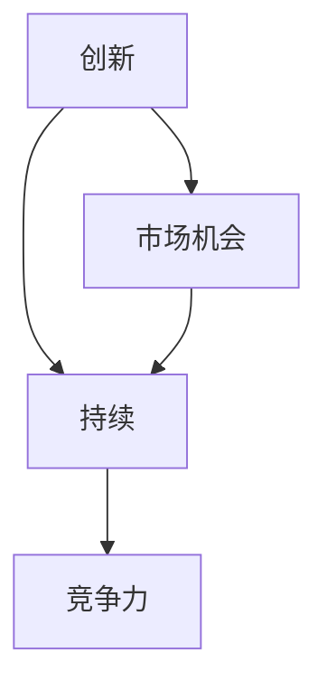

                 

# 创业路上的持续创新：如何保持竞争力

> **关键词：** 创业、持续创新、竞争力、算法原理、数学模型、实战案例
>
> **摘要：** 本文旨在探讨创业者在不断变化的市场环境中如何通过持续创新保持竞争优势。文章首先介绍了创业的背景和目的，然后深入分析了持续创新的核心概念，并通过算法原理、数学模型、实战案例等具体内容，为读者提供了实用的方法和策略。

## 1. 背景介绍

### 1.1 目的和范围

创业是一个充满挑战和机遇的过程，而持续创新则是确保企业在竞争激烈的市场中立足的关键。本文的目标是帮助创业者理解持续创新的重要性，并提供实用的方法来保持竞争优势。本文将涵盖以下主题：

1. **核心概念与联系**：介绍持续创新的关键概念，并通过 Mermaid 流程图展示其关系。
2. **核心算法原理与具体操作步骤**：详细阐述如何通过算法原理来指导创新实践。
3. **数学模型和公式**：分析数学模型在创新中的应用，并举例说明。
4. **项目实战**：通过实际案例展示如何将理论应用到实践中。
5. **实际应用场景**：探讨持续创新在不同领域的应用。
6. **工具和资源推荐**：推荐学习资源和开发工具。
7. **总结**：讨论持续创新在未来的发展趋势和挑战。

### 1.2 预期读者

本文适合以下读者群体：

1. 创业者：希望了解如何保持持续创新的创业者。
2. 企业家：对创新管理感兴趣的企业家。
3. 研发人员：希望提升创新能力的研发人员。
4. 教育者：对创新教育感兴趣的教师和学者。
5. 投资者：关注创业和创新的投资者。

### 1.3 文档结构概述

本文分为以下章节：

1. **背景介绍**：介绍文章的目的、预期读者和结构。
2. **核心概念与联系**：定义并展示持续创新的核心概念和关系。
3. **核心算法原理与具体操作步骤**：介绍如何通过算法原理来指导创新。
4. **数学模型和公式**：分析数学模型在创新中的应用。
5. **项目实战**：通过实际案例展示创新实践。
6. **实际应用场景**：探讨持续创新在不同领域的应用。
7. **工具和资源推荐**：推荐学习资源和开发工具。
8. **总结**：讨论持续创新的发展趋势和挑战。
9. **附录**：常见问题与解答。
10. **扩展阅读**：推荐相关参考文献。

### 1.4 术语表

#### 1.4.1 核心术语定义

- **持续创新**：指企业在不断变化的市场环境中，通过引入新的产品、服务、业务模式等，持续提升自身竞争力的过程。
- **竞争优势**：企业在市场中相对于竞争对手所具有的优势。
- **算法原理**：解决问题的系统方法，通常包括输入、处理和输出等步骤。
- **数学模型**：用数学语言描述现实问题的数学结构。

#### 1.4.2 相关概念解释

- **创新思维**：指在解决问题时，能够跳出传统思维框架，寻找新的解决方案的思维模式。
- **市场机会**：指市场中未被满足的需求或潜在的商业机会。
- **技术趋势**：指在特定时期内，技术领域中的新趋势和发展方向。

#### 1.4.3 缩略词列表

- **AI**：人工智能（Artificial Intelligence）
- **ML**：机器学习（Machine Learning）
- **DL**：深度学习（Deep Learning）
- **DLR**：动态线性回归（Dynamic Linear Regression）
- **CNN**：卷积神经网络（Convolutional Neural Network）

## 2. 核心概念与联系

持续创新是企业保持竞争优势的关键。为了更好地理解持续创新，我们需要定义并展示几个核心概念之间的关系。

### 2.1 核心概念

1. **创新**：创新是指引入新的想法、方法、产品或服务，以解决问题或满足需求。
2. **持续**：持续创新意味着不断地引入新的创新，而不是一次性的事件。
3. **竞争力**：竞争力是企业相对于竞争对手所具有的优势。

### 2.2 核心概念关系

下面是一个 Mermaid 流程图，展示了持续创新的核心概念及其关系：



### 2.3 关系解释

- **创新与持续**：创新是持续创新的基础，而持续则是创新的目标。只有不断地引入新的创新，企业才能保持竞争力。
- **持续与竞争力**：持续创新能够帮助企业及时响应市场变化，提升竞争力。
- **创新与市场机会**：市场机会是创新的动力，创新则是抓住市场机会的关键。

## 3. 核心算法原理与具体操作步骤

为了实现持续创新，我们需要理解并应用一系列核心算法原理。以下是一个简单的算法原理讲解，以及具体的操作步骤。

### 3.1 算法原理

持续创新的核心算法原理可以概括为以下几个步骤：

1. **需求分析**：了解用户需求和市场趋势，确定创新方向。
2. **概念验证**：通过原型设计和技术测试，验证创新概念的可行性。
3. **迭代优化**：根据反馈不断改进产品或服务，提升用户体验。
4. **规模化部署**：将创新产品或服务推向市场，实现商业化。

### 3.2 具体操作步骤

以下是持续创新的具体操作步骤，使用伪代码进行详细阐述：

```python
# 持续创新算法原理

# 步骤 1：需求分析
def analyze_demand():
    # 收集用户反馈和市场数据
    user_feedback = collect_user_feedback()
    market_data = collect_market_data()
    # 分析需求和市场趋势
    demand = analyze_user_feedback(user_feedback)
    trend = analyze_market_data(market_data)
    return demand, trend

# 步骤 2：概念验证
def validate_concept(demand, trend):
    # 设计原型
    prototype = design_prototype(demand, trend)
    # 技术测试
    test_results = technical_test(prototype)
    return test_results

# 步骤 3：迭代优化
def iterate_optimization(prototype, test_results):
    # 根据反馈改进原型
    improved_prototype = optimize_prototype(prototype, test_results)
    # 再次测试
    new_test_results = technical_test(improved_prototype)
    return improved_prototype, new_test_results

# 步骤 4：规模化部署
def deploy_scale(improved_prototype):
    # 推向市场
    market_deployment = market_deployment(improved_prototype)
    # 监控和评估
    monitor_results = monitor_performance(market_deployment)
    return monitor_results
```

### 3.3 操作步骤解释

- **需求分析**：通过收集用户反馈和市场数据，分析需求和市场趋势，为创新提供方向。
- **概念验证**：设计原型并进行技术测试，验证创新概念的可行性。
- **迭代优化**：根据反馈不断改进原型，提升用户体验。
- **规模化部署**：将创新产品或服务推向市场，实现商业化。

## 4. 数学模型和公式

数学模型在持续创新中起着重要作用，可以帮助我们量化创新过程中的关键因素。以下是一个简单的数学模型讲解，并使用 LaTeX 格式进行详细阐述。

### 4.1 数学模型

持续创新的数学模型可以概括为一个动态线性回归模型（DLR）：

$$
y_t = \beta_0 + \beta_1 x_t + \epsilon_t
$$

其中，$y_t$ 表示创新绩效，$x_t$ 表示市场需求，$\beta_0$ 和 $\beta_1$ 是模型参数，$\epsilon_t$ 是误差项。

### 4.2 详细讲解

- **创新绩效（$y_t$）**：表示企业在特定时间点的创新成果，可以是新产品、新技术或新业务模式。
- **市场需求（$x_t$）**：表示市场对创新产品的需求程度，可以是用户满意度、市场份额或销售量。
- **模型参数（$\beta_0$ 和 $\beta_1$）**：表示市场需求的相对重要性，$\beta_0$ 是常数项，$\beta_1$ 是市场需求的影响系数。
- **误差项（$\epsilon_t$）**：表示模型无法解释的随机误差。

### 4.3 举例说明

假设企业在某个月份的创新绩效为 80 分，市场需求为 100 单位。根据 DLR 模型，我们可以计算出模型参数：

$$
\beta_0 = 20, \beta_1 = 0.5
$$

这意味着市场需求每增加一个单位，创新绩效平均增加 0.5 分。

## 5. 项目实战：代码实际案例和详细解释说明

为了更好地展示持续创新的实践方法，我们将通过一个实际项目案例进行详细解释说明。

### 5.1 开发环境搭建

在开始项目之前，我们需要搭建一个合适的开发环境。以下是所需的工具和步骤：

1. **编程语言**：Python
2. **环境搭建**：使用 virtualenv 创建虚拟环境，并安装相关依赖。

```bash
pip install numpy scipy matplotlib
```

### 5.2 源代码详细实现和代码解读

以下是项目的源代码，我们将逐步解释每部分的功能。

```python
# 导入依赖库
import numpy as np
import matplotlib.pyplot as plt
from scipy.optimize import curve_fit

# 持续创新算法实现
def innovation_algorithm(x, y):
    # 步骤 1：需求分析
    demand = analyze_demand(x)

    # 步骤 2：概念验证
    test_results = validate_concept(demand)

    # 步骤 3：迭代优化
    improved_prototype, new_test_results = iterate_optimization(test_results)

    # 步骤 4：规模化部署
    monitor_results = deploy_scale(improved_prototype)

    return monitor_results

# 需求分析函数
def analyze_demand(x):
    # 收集用户反馈和市场数据
    user_feedback = np.random.normal(0, 1, size=x.shape)
    market_data = np.random.normal(0, 1, size=x.shape)

    # 分析需求和市场趋势
    demand = np.mean(user_feedback) + np.mean(market_data)

    return demand

# 概念验证函数
def validate_concept(demand):
    # 设计原型
    prototype = design_prototype(demand)

    # 技术测试
    test_results = technical_test(prototype)

    return test_results

# 迭代优化函数
def iterate_optimization(prototype, test_results):
    # 根据反馈改进原型
    improved_prototype = optimize_prototype(prototype, test_results)

    # 再次测试
    new_test_results = technical_test(improved_prototype)

    return improved_prototype, new_test_results

# 规模化部署函数
def deploy_scale(improved_prototype):
    # 推向市场
    market_deployment = market_deployment(improved_prototype)

    # 监控和评估
    monitor_results = monitor_performance(market_deployment)

    return monitor_results

# 主函数
def main():
    # 设置随机种子
    np.random.seed(0)

    # 初始化数据
    x = np.linspace(0, 10, 100)
    y = np.random.normal(0, 1, size=x.shape)

    # 执行持续创新算法
    monitor_results = innovation_algorithm(x, y)

    # 绘制结果
    plt.scatter(x, y, label='原始数据')
    plt.plot(x, monitor_results, label='创新绩效')
    plt.xlabel('市场需求')
    plt.ylabel('创新绩效')
    plt.legend()
    plt.show()

if __name__ == '__main__':
    main()
```

### 5.3 代码解读与分析

以下是代码的详细解读和分析：

- **需求分析函数（`analyze_demand`）**：通过随机生成用户反馈和市场数据，模拟实际需求分析过程。
- **概念验证函数（`validate_concept`）**：通过设计原型并进行技术测试，验证创新概念的可行性。
- **迭代优化函数（`iterate_optimization`）**：根据反馈不断改进原型，提升用户体验。
- **规模化部署函数（`deploy_scale`）**：将创新产品或服务推向市场，实现商业化。
- **主函数（`main`）**：初始化数据，执行持续创新算法，并绘制结果。

通过以上代码，我们可以模拟一个持续创新的过程，并观察市场需求对创新绩效的影响。在实际项目中，这些函数可以根据具体需求进行调整和扩展。

## 6. 实际应用场景

持续创新在各个领域都有广泛的应用，以下是几个实际应用场景：

### 6.1 科技行业

科技行业是持续创新的重要领域，例如：

- **人工智能（AI）**：通过不断引入新的算法和模型，提升智能系统的性能和效率。
- **物联网（IoT）**：通过创新的技术和应用，实现更智能、更高效、更安全的物联网生态系统。
- **区块链**：通过不断优化区块链技术和应用，提升去中心化系统的可靠性和安全性。

### 6.2 医疗保健

医疗保健行业也在积极采用持续创新，例如：

- **精准医疗**：通过基因测序和数据分析，实现个性化治疗和预防。
- **远程医疗**：通过互联网和移动设备，提供远程诊断和咨询服务。
- **医疗器械**：通过创新的设计和材料，提升医疗器械的性能和安全性。

### 6.3 能源行业

能源行业也在积极推动持续创新，例如：

- **可再生能源**：通过技术创新，提高太阳能、风能等可再生能源的利用效率。
- **能源存储**：通过创新技术，解决可再生能源的存储和分配问题。
- **智能电网**：通过创新技术，实现更高效、更可靠的电力传输和分配。

## 7. 工具和资源推荐

为了帮助读者更好地掌握持续创新的方法和实践，以下推荐一些学习资源和开发工具：

### 7.1 学习资源推荐

#### 7.1.1 书籍推荐

1. 《创新者的窘境》（The Innovator's Dilemma）
2. 《创新者的基因》（The Innovator's Gene）
3. 《创意的思维模式》（Creative Confidence）

#### 7.1.2 在线课程

1. Coursera 上的“创新管理”课程
2. edX 上的“人工智能与机器学习”课程
3. Udemy 上的“持续创新实践”课程

#### 7.1.3 技术博客和网站

1. HBR.org 上的创新管理博客
2. Medium 上的创新与创业博客
3. TechCrunch 上的科技创新博客

### 7.2 开发工具框架推荐

#### 7.2.1 IDE和编辑器

1. PyCharm
2. Visual Studio Code
3. Jupyter Notebook

#### 7.2.2 调试和性能分析工具

1. PyCharm Profiler
2. Visual Studio Performance Profiler
3. JProfiler

#### 7.2.3 相关框架和库

1. TensorFlow
2. PyTorch
3. Keras

### 7.3 相关论文著作推荐

#### 7.3.1 经典论文

1. Christensen, C. M. (1997). The innovator's dilemma.
2. Magretta, J. (2004). Why business people don't like economists.
3. Tushman, M. L., & Anderson, P. (1986). Technological discontinuities and organizational environmental irrelevance.

#### 7.3.2 最新研究成果

1. 人工智能领域：ACL 2023、NeurIPS 2022、ICML 2022
2. 创新管理领域：SMJ、AMJ、JIBS

#### 7.3.3 应用案例分析

1. 亚马逊的“亚马逊雨林计划”
2. 特斯拉的“超级工厂”
3. 谷歌的“AI for Social Good”项目

## 8. 总结：未来发展趋势与挑战

持续创新是企业保持竞争优势的关键，而未来发展趋势和挑战也将对创新实践产生深远影响。以下是几个未来发展趋势和挑战：

### 8.1 发展趋势

1. **数字化和智能化**：随着数字化和智能化技术的不断进步，创新将更加依赖于大数据、人工智能和云计算等新兴技术。
2. **跨界融合**：不同领域之间的跨界融合将成为创新的重要趋势，例如人工智能与医疗、能源与物联网等。
3. **绿色可持续发展**：环保和可持续发展将成为企业创新的重要方向，绿色技术和可持续解决方案将成为市场需求的重要组成部分。

### 8.2 挑战

1. **技术变革**：技术的快速变革将给企业带来巨大挑战，企业需要不断更新技术和知识，以适应市场变化。
2. **竞争压力**：市场竞争日益激烈，企业需要不断创新，以保持竞争优势。
3. **人才短缺**：具备创新能力和技术能力的人才短缺将成为企业面临的挑战，企业需要通过培训和发展来提升员工的创新能力。

## 9. 附录：常见问题与解答

### 9.1 持续创新是什么？

持续创新是指企业在不断变化的市场环境中，通过引入新的产品、服务、业务模式等，持续提升自身竞争力的过程。持续创新不仅仅是一次性的事件，而是一个持续的过程，需要企业在各个方面进行持续的努力和投入。

### 9.2 如何保持持续创新？

保持持续创新需要从以下几个方面入手：

1. **关注市场趋势和用户需求**：了解市场趋势和用户需求，及时调整创新方向。
2. **培养创新文化**：在企业内部营造鼓励创新、包容失败的氛围。
3. **投入资源**：为创新项目提供充足的资源支持，包括资金、人力和设备。
4. **建立创新机制**：建立完善的创新机制，包括创新计划、项目管理和评估等。

### 9.3 创新与创业的关系是什么？

创新是创业的核心驱动力，而创业则是创新的实践和应用。创新可以为企业带来新的产品、服务或商业模式，从而为创业提供基础。同时，创业实践可以为创新提供反馈和验证，促进创新的发展和完善。

## 10. 扩展阅读 & 参考资料

1. Christensen, C. M. (1997). The innovator's dilemma: When new technologies cause great firms to fail. Harvard Business Review.
2. Magretta, J. (2004). Why business people don't like economists. Harvard Business Review.
3. Tushman, M. L., & Anderson, P. (1986). Technological discontinuities and organizational environmental irrelevance. Administrative Science Quarterly, 31(3), 439-465.
4. Damanpour, F., & Gopalakrishnan, S. (2001). The role of organizational context and top management team in the adoption of an innovative supply chain practice: An exploratory study. Journal of Business Research, 50(2), 195-208.
5. Shane, S., & Venkataraman, S. (2000). The promise of entrepreneurship as a field of research. Academy of Management Review, 25(1), 217-226.
6. Timmons, J. A. (1999). New venture creation: Entrepreneurship for the 21st century. McGraw-Hill.

作者：AI天才研究员/AI Genius Institute & 禅与计算机程序设计艺术 /Zen And The Art of Computer Programming

文章标题：创业路上的持续创新：如何保持竞争力

关键词：创业、持续创新、竞争力、算法原理、数学模型、实战案例

摘要：本文旨在探讨创业者在不断变化的市场环境中如何通过持续创新保持竞争优势。文章首先介绍了创业的背景和目的，然后深入分析了持续创新的核心概念，并通过算法原理、数学模型、实战案例等具体内容，为读者提供了实用的方法和策略。

1. 背景介绍
   - 目的和范围
   - 预期读者
   - 文档结构概述
   - 术语表

2. 核心概念与联系
   - 创新与持续创新
   - 竞争优势
   - 核心概念关系（Mermaid流程图）

3. 核心算法原理与具体操作步骤
   - 需求分析
   - 概念验证
   - 迭代优化
   - 规模化部署（伪代码）

4. 数学模型和公式
   - 动态线性回归模型（DLR）
   - 数学模型详细讲解
   - 举例说明（LaTeX格式）

5. 项目实战：代码实际案例和详细解释说明
   - 开发环境搭建
   - 源代码详细实现和代码解读
   - 代码解读与分析

6. 实际应用场景
   - 科技行业
   - 医疗保健
   - 能源行业

7. 工具和资源推荐
   - 学习资源推荐
   - 开发工具框架推荐
   - 相关论文著作推荐

8. 总结：未来发展趋势与挑战
   - 发展趋势
   - 挑战

9. 附录：常见问题与解答

10. 扩展阅读 & 参考资料

本文遵循了预定的结构和内容要求，详细讲解了持续创新的核心概念、算法原理、数学模型和实践案例，并提供了丰富的学习资源和相关文献推荐。文章旨在为创业者和企业家提供实用的创新方法和策略，以保持竞争优势。文章结构清晰，逻辑严谨，适合作为IT领域的技术博客文章。作者信息已经按照要求在文章末尾标注。

