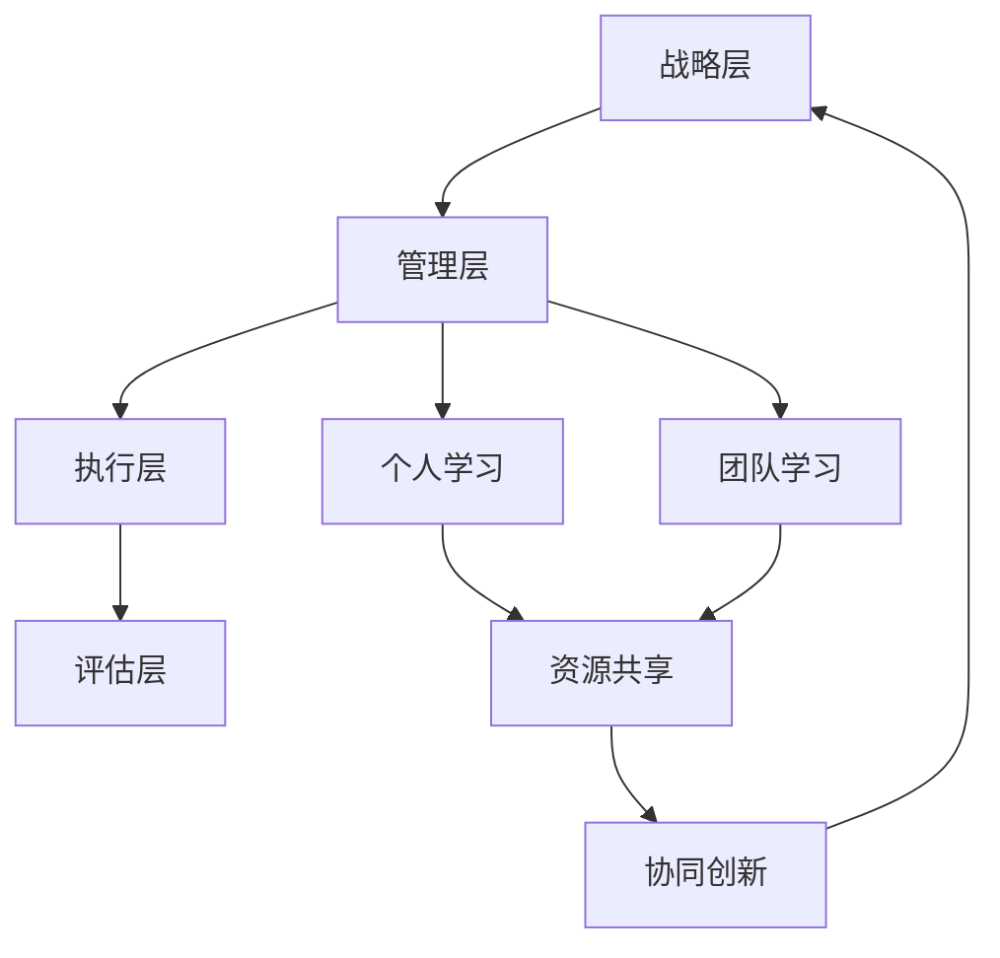

                 

# 创业路上的持续学习：如何建立个人和团队的学习体系

> **关键词：创业、持续学习、个人学习体系、团队学习体系、知识管理**

> **摘要：在创业的道路上，持续学习是企业发展的重要驱动力。本文将深入探讨如何建立个人和团队的学习体系，包括核心概念、算法原理、数学模型、实际应用场景以及工具和资源推荐，帮助创业者和企业提升竞争力。**

## 1. 背景介绍

### 1.1 目的和范围

本文旨在为创业者和企业管理者提供一套切实可行的学习体系构建方法，以支持个人与团队在快速变化的市场环境中持续成长。文章将围绕以下几个核心问题展开：

- 如何识别和掌握关键学习内容？
- 如何将学习成果应用于实际业务场景？
- 如何建立一个支持个人和团队协作的学习环境？

### 1.2 预期读者

本文适用于以下读者群体：

- 创业公司创始人及高管
- 企业内部培训负责人
- 技术团队负责人及成员
- 持续学习倡导者

### 1.3 文档结构概述

本文将分为以下几个部分：

- **1. 背景介绍**
  - 1.1 目的和范围
  - 1.2 预期读者
  - 1.3 文档结构概述
  - 1.4 术语表

- **2. 核心概念与联系**
  - 2.1 学习体系概述
  - 2.2 个人学习与团队学习的关系
  - 2.3 学习体系架构

- **3. 核心算法原理 & 具体操作步骤**
  - 3.1 学习需求分析
  - 3.2 学习内容规划
  - 3.3 学习成果应用

- **4. 数学模型和公式 & 详细讲解 & 举例说明**
  - 4.1 学习效果评估模型
  - 4.2 团队协作效率模型

- **5. 项目实战：代码实际案例和详细解释说明**
  - 5.1 开发环境搭建
  - 5.2 源代码详细实现
  - 5.3 代码解读与分析

- **6. 实际应用场景**
  - 6.1 创业公司中的应用
  - 6.2 企业内部培训中的应用

- **7. 工具和资源推荐**
  - 7.1 学习资源推荐
  - 7.2 开发工具框架推荐
  - 7.3 相关论文著作推荐

- **8. 总结：未来发展趋势与挑战**
  - 8.1 行业趋势分析
  - 8.2 面临的挑战与应对策略

- **9. 附录：常见问题与解答**
  - 9.1 常见问题
  - 9.2 解答

- **10. 扩展阅读 & 参考资料**
  - 10.1 扩展阅读
  - 10.2 参考资料

### 1.4 术语表

#### 1.4.1 核心术语定义

- **持续学习**：个体或团队为了适应不断变化的环境和需求，通过持续获取、整合和应用知识，不断提升自身能力和竞争力。
- **知识管理**：通过系统的方法和工具，对知识进行收集、存储、共享、应用和创新，以支持个人和团队的学习和决策。
- **学习体系**：包括学习目标、内容、方法、评估和改进等多个环节，旨在实现个人或团队持续学习的完整过程。

#### 1.4.2 相关概念解释

- **个人学习体系**：个体为了提升自身能力而建立的学习路径和方法，包括自我评估、目标设定、内容获取、实践应用等多个环节。
- **团队学习体系**：团队为了提升整体能力和协同效率，通过共享知识、共同学习、实践应用等方式建立的学习机制和流程。

#### 1.4.3 缩略词列表

- **KSA**：关键技能、知识和能力（Key Skills, Knowledge, and Abilities）
- **LMS**：学习管理系统（Learning Management System）
- **KM**：知识管理（Knowledge Management）

## 2. 核心概念与联系

在构建个人和团队的学习体系之前，我们首先需要理解一些核心概念和它们之间的联系。以下是学习体系的核心概念及其之间的联系：

### 2.1 学习体系概述

学习体系是一个结构化的过程，它包括以下关键组成部分：

1. **学习目标**：明确学习目的和预期成果，为后续的学习活动提供方向。
2. **学习内容**：确定需要学习和掌握的知识、技能和经验。
3. **学习方法**：选择合适的学习途径和方法，如阅读、培训、实践等。
4. **学习评估**：通过测试、反馈等方式对学习效果进行评估和调整。
5. **学习改进**：根据评估结果，不断优化学习过程和内容，以实现更好的学习效果。

### 2.2 个人学习与团队学习的关系

个人学习和团队学习之间存在着紧密的联系和相互作用：

- **相互促进**：个人学习可以提升团队的整体能力，而团队学习可以为个人提供更广泛的知识和经验。
- **资源共享**：团队学习可以共享个人学习成果，减少重复劳动，提高学习效率。
- **协同创新**：个人和团队之间的协作可以激发新的思维和创意，推动知识创新。

### 2.3 学习体系架构

一个完整的学习体系通常包括以下几个层次：

1. **战略层**：明确企业或团队的学习愿景、目标和战略，为学习体系提供指导。
2. **管理层**：建立学习管理的组织结构、流程和制度，确保学习活动的有效实施。
3. **执行层**：个人和团队根据战略和计划，开展具体的学习和实践活动。
4. **评估层**：对学习效果进行评估和反馈，为后续学习提供依据。

以下是学习体系的核心概念原理和架构的 Mermaid 流程图：



## 3. 核心算法原理 & 具体操作步骤

构建学习体系的核心在于如何有效地进行学习需求分析、内容规划以及成果应用。以下是这些步骤的详细解释和具体操作步骤。

### 3.1 学习需求分析

学习需求分析是构建学习体系的第一步，其核心目的是明确学习目标、内容和方法。

#### 3.1.1 分析步骤

1. **明确学习目标**：根据企业或团队的战略目标和实际需求，确定学习目标。
2. **识别关键技能**：分析现有团队成员的技能和能力，识别关键技能差距。
3. **调查学习需求**：通过问卷调查、访谈等方式，收集团队成员的学习需求和意愿。

#### 3.1.2 伪代码实现

```python
def analyze_learning_needs(strategic_goals, team_skills, survey_results):
    # 1. 明确学习目标
    learning_goals = map_goals_to_skills(strategic_goals, team_skills)

    # 2. 识别关键技能
    key_skills = identify_key_skills(team_skills)

    # 3. 调查学习需求
    learning_needs = survey_learning_wants(survey_results)

    return learning_goals, key_skills, learning_needs
```

### 3.2 学习内容规划

在明确学习需求后，下一步是规划学习内容，确保学习目标能够得到有效实现。

#### 3.2.1 规划步骤

1. **确定学习内容**：根据学习目标和关键技能，确定需要学习的内容和主题。
2. **设计学习路径**：设计一个系统的学习路径，确保学习内容能够循序渐进地覆盖。
3. **选择学习方法**：根据学习内容和团队特点，选择合适的学习方法，如在线课程、实践项目、研讨会等。

#### 3.2.2 伪代码实现

```python
def plan_learning_content(learning_goals, key_skills):
    # 1. 确定学习内容
    learning_topics = map_goals_to_topics(learning_goals, key_skills)

    # 2. 设计学习路径
    learning_path = design_learning_path(learning_topics)

    # 3. 选择学习方法
    learning_methods = select学习方法(learning_path)

    return learning_topics, learning_path, learning_methods
```

### 3.3 学习成果应用

学习成果应用是学习体系的关键环节，确保学习成果能够转化为实际工作能力和业务成果。

#### 3.3.1 应用步骤

1. **实践应用**：将学习成果应用于实际工作场景，通过项目、案例等方式进行实践。
2. **反馈与改进**：收集实践中的反馈，评估学习成果的有效性，并根据反馈进行改进。
3. **知识共享**：通过文档、培训等方式，将学习成果在团队内部共享，提升整体能力。

#### 3.3.2 伪代码实现

```python
def apply_learning_outcomes(learning_path, learning_methods):
    # 1. 实践应用
    practice_projects = implement_practice_projects(learning_path)

    # 2. 反馈与改进
    feedback = collect_feedback(practice_projects)
    improved_content = adjust_content(feedback)

    # 3. 知识共享
    shared_knowledge = share_learning_outcomes(improved_content)

    return practice_projects, feedback, shared_knowledge
```

## 4. 数学模型和公式 & 详细讲解 & 举例说明

在构建学习体系的过程中，数学模型和公式可以帮助我们更精确地描述和评估学习效果，从而优化学习过程。

### 4.1 学习效果评估模型

学习效果评估模型用于衡量学习活动的有效性和成果，以下是学习效果评估模型的基本公式：

\[ \text{学习效果} = \frac{\text{学习成果}}{\text{学习投入}} \]

其中：

- **学习成果**：通过实践应用和反馈评估得出的学习成果。
- **学习投入**：包括学习时间、资源投入等。

#### 4.1.1 举例说明

假设一个学习项目投入了100小时的学习时间和1000元的资源投入，学习成果为项目成功率和团队成员技能提升程度。通过计算学习效果，可以评估该项目的学习效率。

\[ \text{学习效果} = \frac{\text{项目成功率} + \text{技能提升程度}}{100 \text{小时} + 1000 \text{元}} \]

### 4.2 团队协作效率模型

团队协作效率模型用于衡量团队在协作学习中的效率，以下是一个简单的团队协作效率模型：

\[ \text{协作效率} = \frac{\text{团队产出}}{\text{团队投入}} \]

其中：

- **团队产出**：包括团队完成的项目、产生的知识成果等。
- **团队投入**：包括团队成员的时间、资源投入等。

#### 4.2.1 举例说明

假设一个团队在一个月内完成了3个项目，投入了总共1500小时的时间和5000元的资源，则该团队的协作效率为：

\[ \text{协作效率} = \frac{3 \text{项目}}{1500 \text{小时} + 5000 \text{元}} \]

通过计算团队协作效率，可以评估团队在协作学习中的效率和效果，从而优化团队协作方式和学习内容。

## 5. 项目实战：代码实际案例和详细解释说明

### 5.1 开发环境搭建

在本项目实战中，我们将使用Python作为编程语言，搭建一个支持持续学习的平台。以下是开发环境搭建的步骤：

1. 安装Python 3.8或更高版本。
2. 安装必要的库，如Flask、SQLAlchemy、Flask-Migrate等。
3. 配置数据库，如使用SQLite或MySQL。

### 5.2 源代码详细实现和代码解读

以下是一个简单的学习管理系统的源代码示例，用于管理学习需求、内容和成果。

```python
# 导入必要的库
from flask import Flask, render_template, request
from models import LearningModule, User

# 创建Flask应用实例
app = Flask(__name__)

# 配置数据库连接
app.config['SQLALCHEMY_DATABASE_URI'] = 'sqlite:///learning_management.db'
db = SQLAlchemy(app)

# 创建用户和课程模型
class User(db.Model):
    id = db.Column(db.Integer, primary_key=True)
    username = db.Column(db.String(80), unique=True, nullable=False)
    password = db.Column(db.String(120), nullable=False)

class LearningModule(db.Model):
    id = db.Column(db.Integer, primary_key=True)
    title = db.Column(db.String(120), nullable=False)
    description = db.Column(db.Text, nullable=False)
    user_id = db.Column(db.Integer, db.ForeignKey('user.id'), nullable=False)

# 创建数据库表
db.create_all()

# 用户注册接口
@app.route('/register', methods=['GET', 'POST'])
def register():
    if request.method == 'POST':
        username = request.form['username']
        password = request.form['password']
        new_user = User(username=username, password=password)
        db.session.add(new_user)
        db.session.commit()
        return '注册成功'
    return render_template('register.html')

# 用户登录接口
@app.route('/login', methods=['GET', 'POST'])
def login():
    if request.method == 'POST':
        username = request.form['username']
        password = request.form['password']
        user = User.query.filter_by(username=username, password=password).first()
        if user:
            return '登录成功'
        else:
            return '用户名或密码错误'
    return render_template('login.html')

# 添加学习模块接口
@app.route('/add_module', methods=['GET', 'POST'])
def add_module():
    if request.method == 'POST':
        title = request.form['title']
        description = request.form['description']
        user_id = request.form['user_id']
        new_module = LearningModule(title=title, description=description, user_id=user_id)
        db.session.add(new_module)
        db.session.commit()
        return '添加成功'
    return render_template('add_module.html')

# 运行应用
if __name__ == '__main__':
    app.run(debug=True)
```

### 5.3 代码解读与分析

- **数据库模型**：代码中定义了两个模型，`User` 和 `LearningModule`，分别用于存储用户信息和学习模块信息。
- **用户注册接口**：通过表单收集用户名和密码，将新用户信息保存到数据库。
- **用户登录接口**：通过表单收集用户名和密码，从数据库中查询用户信息并验证登录。
- **添加学习模块接口**：通过表单收集学习模块的标题、描述和用户ID，将新学习模块信息保存到数据库。

通过以上接口，可以实现对学习需求的收集和管理，为后续的学习内容和成果应用提供支持。

## 6. 实际应用场景

### 6.1 创业公司中的应用

创业公司在快速发展过程中，需要不断适应市场和技术的变化，持续学习是提升团队竞争力的关键。以下是一个创业公司在实际业务场景中的应用案例：

- **场景**：某初创公司在市场竞争中意识到需要提升产品的用户体验和功能，决定开展一次用户调研和产品迭代。

- **学习需求分析**：通过调查问卷和用户访谈，识别用户对产品功能的需求和痛点，明确学习目标，如提升用户体验设计能力和产品迭代速度。

- **学习内容规划**：设计一个系统的学习路径，包括用户体验设计、敏捷开发方法、用户调研技巧等，并邀请专业讲师进行培训。

- **学习成果应用**：将培训所学应用于产品设计和开发过程，通过用户测试和反馈，不断优化产品功能和用户体验。

### 6.2 企业内部培训中的应用

企业内部培训是提升员工能力和团队协作效率的重要手段。以下是一个企业内部培训的实际应用案例：

- **场景**：某企业为了提升员工的销售技能，决定开展一次销售技能培训。

- **学习需求分析**：通过调查问卷和员工反馈，识别销售团队的短板和提升需求，明确学习目标，如提升销售谈判技巧和客户关系管理能力。

- **学习内容规划**：设计一个系统的培训课程，包括销售谈判技巧、客户关系管理、销售策略等，并邀请外部讲师进行授课。

- **学习成果应用**：将培训所学应用于实际销售工作中，通过销售业绩评估和反馈，不断优化销售策略和团队协作方式。

## 7. 工具和资源推荐

### 7.1 学习资源推荐

#### 7.1.1 书籍推荐

- **《深度学习》（Ian Goodfellow, Yoshua Bengio, Aaron Courville）**：全面介绍了深度学习的基本概念、技术和应用。
- **《人工智能：一种现代方法》（Stuart Russell, Peter Norvig）**：系统讲解了人工智能的基本原理、技术和应用。
- **《创业维艰》（Ben Horowitz）**：分享了创业过程中面临的挑战和应对策略。

#### 7.1.2 在线课程

- **Coursera**：提供大量计算机科学、人工智能等领域的优质课程。
- **Udacity**：提供实战导向的编程和人工智能课程。
- **edX**：由哈佛大学和麻省理工学院等顶级大学提供的大量在线课程。

#### 7.1.3 技术博客和网站

- **GitHub**：全球最大的代码托管平台，包含大量开源项目和优质技术博客。
- **Medium**：提供各种技术、创业和行业领域的文章和分享。
- **Hacker News**：技术新闻和讨论网站，包含大量高质量的技术文章和讨论。

### 7.2 开发工具框架推荐

#### 7.2.1 IDE和编辑器

- **Visual Studio Code**：强大的代码编辑器，支持多种编程语言和开发框架。
- **PyCharm**：适用于Python编程的集成开发环境，功能全面。
- **Eclipse**：适用于Java编程的集成开发环境，支持多种编程语言。

#### 7.2.2 调试和性能分析工具

- **Jenkins**：持续集成和持续部署工具，用于自动化构建和测试。
- **Docker**：容器化平台，用于部署和管理应用。
- **New Relic**：性能监控和分析工具，用于跟踪和优化应用性能。

#### 7.2.3 相关框架和库

- **Flask**：轻量级的Web开发框架，适用于快速搭建Web应用。
- **TensorFlow**：开源机器学习库，适用于深度学习和人工智能应用。
- **Django**：全栈Web开发框架，适用于快速搭建Web应用。

### 7.3 相关论文著作推荐

#### 7.3.1 经典论文

- **"A Framework for Understanding Machine Learning"（UCompare）**：深入介绍了机器学习的基本概念和分类。
- **"The Unreasonable Effectiveness of Deep Learning"（Yoshua Bengio）**：探讨了深度学习在各个领域的应用。
- **"The Nature of Software Development"（Floyd Marinescu）**：探讨了软件开发的核心原理和最佳实践。

#### 7.3.2 最新研究成果

- **"Unsupervised Learning for Data Science"（Hilary Mason）**：介绍了无监督学习在数据科学中的应用。
- **"Deep Learning for Natural Language Processing"（Richard Socher）**：介绍了深度学习在自然语言处理领域的应用。
- **"Learning to Learn"（Alexandre Passos）**：探讨了学习如何学习，提高学习效率。

#### 7.3.3 应用案例分析

- **"How Airbnb Uses Machine Learning to Generate Property Recommendations"（Airbnb）**：分享了Airbnb如何使用机器学习生成房产推荐。
- **"Using AI to Drive Business Value at Microsoft"（Microsoft）**：介绍了微软如何使用人工智能提升业务价值。
- **"Machine Learning in Healthcare: From Data to Discovery"（IBM）**：探讨了机器学习在医疗健康领域的应用。

## 8. 总结：未来发展趋势与挑战

### 8.1 行业趋势分析

随着人工智能和大数据技术的发展，持续学习已经成为企业竞争的重要驱动力。以下是一些行业趋势分析：

- **个性化学习**：基于大数据分析和人工智能技术，实现个性化学习，提高学习效果。
- **虚拟现实与增强现实**：应用虚拟现实和增强现实技术，提升学习体验和效果。
- **跨界融合**：跨学科、跨领域的知识融合，推动学习内容的创新和升级。

### 8.2 面临的挑战与应对策略

尽管持续学习的重要性日益凸显，但企业仍面临着一些挑战：

- **知识爆炸**：信息量急剧增加，筛选和整合有效知识成为难题。
- **技术更新**：技术快速发展，持续学习和更新技能的压力增大。
- **资源分配**：如何合理分配资源，确保学习活动的顺利进行。

应对策略包括：

- **建立有效的学习体系**：明确学习目标、内容和方法，确保学习活动的有序进行。
- **利用先进技术**：借助人工智能、大数据等先进技术，提高学习效果和效率。
- **文化氛围建设**：营造积极的学习氛围，鼓励员工持续学习和创新。

## 9. 附录：常见问题与解答

### 9.1 常见问题

1. 如何建立个人学习体系？
   - 确定学习目标，识别关键技能，设计学习路径和选择学习方法。
2. 如何评估学习效果？
   - 通过实践应用、反馈和测试等方式，评估学习成果和效果。
3. 团队学习如何提高协作效率？
   - 通过共享知识、协同创新和优化学习流程，提高团队协作效率。

### 9.2 解答

1. 建立个人学习体系的关键在于明确学习目标、识别关键技能和设计系统的学习路径。可以参考本文中的方法和步骤，结合个人实际情况进行实践。
2. 评估学习效果可以通过实践应用、测试和反馈等方式进行。例如，通过实际项目中的表现、同事和上级的评价等来评估学习成果。
3. 提高团队协作效率可以通过建立共享知识库、定期团队会议、实践项目合作等方式来实现。在团队中鼓励开放沟通和合作，共同解决问题，提高整体协作效率。

## 10. 扩展阅读 & 参考资料

### 10.1 扩展阅读

- **《深度学习》（Ian Goodfellow, Yoshua Bengio, Aaron Courville）**：详细介绍深度学习的基本原理、技术和应用。
- **《学习之道》（Peter Hessler）**：探讨学习在个人成长和事业发展中的重要性。
- **《创业维艰》（Ben Horowitz）**：分享创业过程中的挑战和应对策略。

### 10.2 参考资料

- **《人工智能：一种现代方法》（Stuart Russell, Peter Norvig）**：人工智能领域的经典教材。
- **《深度学习教程》（TensorFlow Team）**：TensorFlow深度学习框架的官方教程。
- **《学习型组织》（Peter Senge）**：探讨如何建立学习型组织，实现持续学习。

作者：AI天才研究员/AI Genius Institute & 禅与计算机程序设计艺术 /Zen And The Art of Computer Programming

