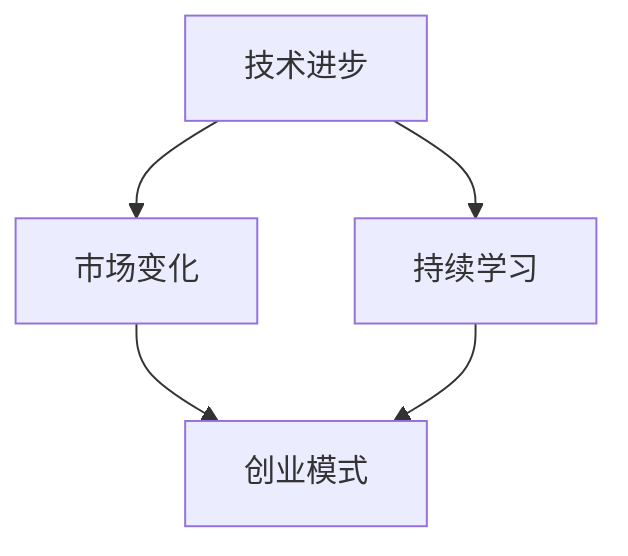

                 

## 创业路上的持续学习：跟上技术与市场变化的有效方法

> **关键词：创业、持续学习、技术发展、市场变化、适应策略**

> **摘要：本文将探讨创业者在快速变化的技术和市场环境中如何通过持续学习来提升自身和企业的竞争力，实现长远发展。我们将深入分析技术进步对创业的深远影响，介绍有效的学习方法，并提供实践中的具体案例和工具资源推荐。**

创业，是一场充满挑战与机遇的冒险。在这个信息爆炸、技术迭代飞快的时代，创业者不仅要具备敏锐的市场洞察力，更需要具备快速适应技术变化的学习能力。持续学习，成为创业者保持竞争力的关键。本文将探讨以下核心问题：

1. **技术发展对创业的深远影响**：如何理解技术进步带来的机遇与挑战？
2. **持续学习的有效方法**：有哪些学习策略可以帮助创业者跟上市场的步伐？
3. **适应策略**：在快速变化的环境中，如何调整创业策略以保持竞争力？
4. **实践案例**：分享一些成功创业者的持续学习实践。
5. **资源推荐**：推荐一些有助于持续学习的书籍、在线课程和技术工具。

通过以上问题的深入探讨，我们希望为创业者提供一套切实可行的持续学习方法和策略，助力他们在创业路上稳步前行。

## 1. 背景介绍

### 1.1 目的和范围

本文旨在为创业者在技术和市场变化快速迭代的背景下提供持续学习的策略和方法。文章将围绕以下几个核心问题展开讨论：

- **技术发展对创业的影响**：分析技术进步如何改变创业环境和商业模式。
- **学习策略与方法**：介绍如何通过有效的学习策略和方法，提升个人的技术洞察力和市场适应能力。
- **适应策略**：探讨在快速变化的市场中，创业者如何调整和优化自身的商业模式和策略。
- **实践案例**：通过具体案例分析，展示成功创业者如何实践持续学习策略。
- **资源推荐**：推荐一些有助于持续学习的书籍、课程和工具。

文章的预期读者包括：

- 初创企业创始人
- 创业团队核心成员
- 对创业有浓厚兴趣的技术人员
- 企业创新部门负责人

### 1.2 预期读者

本文适合以下几类读者：

1. **初创企业创始人**：希望提升自身技术洞察力，以便更好地把握市场趋势和抓住商业机会。
2. **创业团队核心成员**：需要不断更新知识，以支持团队在技术和市场方面的持续发展。
3. **对创业有浓厚兴趣的技术人员**：希望通过本文了解如何通过持续学习提高自己的创业能力和市场竞争力。
4. **企业创新部门负责人**：需要掌握最新的技术趋势，以指导企业创新和业务转型。

### 1.3 文档结构概述

本文结构如下：

- **引言**：介绍创业者在快速变化环境中持续学习的重要性。
- **背景介绍**：详细说明技术发展对创业的影响。
- **核心概念与联系**：解释核心概念，并使用Mermaid流程图展示。
- **核心算法原理 & 具体操作步骤**：介绍持续学习的算法原理和具体步骤。
- **数学模型和公式 & 详细讲解 & 举例说明**：运用数学模型和公式解释技术原理。
- **项目实战：代码实际案例和详细解释说明**：通过实际代码案例展示持续学习策略。
- **实际应用场景**：讨论技术学习和创业实践的关联。
- **工具和资源推荐**：推荐有助于学习和创业的工具和资源。
- **总结**：总结全文，展望未来发展趋势和挑战。
- **附录：常见问题与解答**：解答读者可能遇到的问题。
- **扩展阅读 & 参考资料**：提供进一步学习和探索的资料。

### 1.4 术语表

#### 1.4.1 核心术语定义

- **创业**：创办企业或项目，以实现商业目标和创新。
- **持续学习**：不断获取新知识、技能和经验，以适应快速变化的环境。
- **技术进步**：新技术的出现和发展，对现有技术或产品产生重大影响。
- **市场变化**：消费者需求、竞争环境、行业趋势等的变化。
- **商业模式**：企业如何创造、传递和获取价值。

#### 1.4.2 相关概念解释

- **敏捷创业**：一种快速迭代和适应市场变化的创业方法。
- **知识图谱**：用于表示知识结构和关系的数据模型。
- **数据驱动决策**：基于数据分析和模型预测来做出决策。

#### 1.4.3 缩略词列表

- **AI**：人工智能
- **IoT**：物联网
- **SaaS**：软件即服务
- **PaaS**：平台即服务
- **IaaS**：基础设施即服务

## 2. 核心概念与联系

在探讨如何跟上技术与市场变化的过程中，理解以下核心概念和它们之间的联系是至关重要的。以下是这些概念的定义和关系图：

### 2.1 核心概念定义

#### 2.1.1 技术进步
技术进步是指新技术的发明、发展和应用，它改变了生产方式、提高了工作效率，同时也创造了新的商业机会。例如，人工智能和机器学习技术的进步，使得企业能够通过自动化和智能化的方式，优化业务流程和提升决策质量。

#### 2.1.2 市场变化
市场变化是指消费者需求、竞争环境、行业趋势等方面的变动。例如，随着消费者对个性化和定制化产品的需求增加，市场逐渐从标准化产品向差异化产品转变。

#### 2.1.3 持续学习
持续学习是指个人或组织不断获取新知识、技能和经验，以适应快速变化的环境。持续学习不仅包括传统教育，还包括自学、在线课程、工作坊等形式。

#### 2.1.4 创业模式
创业模式是指企业如何创造、传递和获取价值的方式。例如，通过提供创新的解决方案来满足市场需求，从而获得利润。

### 2.2 关系图

以下是这些核心概念之间的Mermaid流程图，展示了它们之间的相互关系：



### 2.3 关系解释

- **技术进步** 直接影响了 **市场变化**，新技术往往催生新的市场需求和商业模式。
- **持续学习** 是适应 **市场变化** 的关键。通过持续学习，个人和企业可以及时掌握新技术，从而调整创业模式。
- **创业模式** 则是基于对 **技术进步** 和 **市场变化** 的理解，通过持续学习来实现的。只有不断适应市场需求，创业企业才能在竞争激烈的环境中生存和发展。

通过上述核心概念和它们之间的相互关系，我们可以更清晰地理解如何在快速变化的环境中，通过持续学习来提升创业者的竞争力。接下来，我们将进一步探讨如何实现持续学习，以应对技术进步和市场变化的挑战。

### 3. 核心算法原理 & 具体操作步骤

在理解和分析了技术与市场的核心概念和联系之后，我们需要掌握一套有效的持续学习方法，以确保创业者能够跟上技术进步和市场变化的步伐。这一部分将介绍持续学习的核心算法原理，并通过具体的操作步骤，详细解释如何实现这一过程。

#### 3.1 持续学习的核心算法原理

持续学习可以视为一个动态优化过程，其核心算法原理如下：

1. **需求识别**：通过市场调研、数据分析等方式，识别当前技术趋势和市场需求，明确学习方向。
2. **知识获取**：根据需求，选择合适的知识源（如书籍、在线课程、学术论文等），进行知识获取。
3. **知识整合**：将获取的知识与自身经验相结合，形成系统的知识框架。
4. **技能应用**：通过实践，将理论知识应用到实际工作中，提升实际操作能力。
5. **反馈调整**：根据实践结果，对学习过程进行调整和优化，形成闭环。

#### 3.2 持续学习的具体操作步骤

以下是实现持续学习的具体操作步骤：

##### 步骤 1：需求识别

**伪代码：**

```python
def identify_demand():
    # 收集市场数据
    market_data = collect_market_data()
    # 分析数据，识别技术趋势和市场需求
    trends, demands = analyze_data(market_data)
    # 输出需求结果
    return trends, demands
```

**解释：** 通过市场调研和数据分析，识别当前的技术趋势和市场需求。这一步骤是持续学习的基础，决定了学习方向和目标。

##### 步骤 2：知识获取

**伪代码：**

```python
def acquire_knowledge(trends, demands):
    # 根据需求选择学习资源
    resources = select_resources(trends, demands)
    # 获取知识
    knowledge = gather_knowledge(resources)
    # 输出知识结果
    return knowledge
```

**解释：** 根据识别出的需求，选择合适的知识源进行学习。这一步骤可以通过多种渠道进行，如在线课程、专业书籍、学术论文等。

##### 步骤 3：知识整合

**伪代码：**

```python
def integrate_knowledge(knowledge, experience):
    # 整合新知识与经验
    integrated_knowledge = merge_knowledge(knowledge, experience)
    # 形成知识框架
    knowledge_framework = build_framework(integrated_knowledge)
    # 输出知识框架
    return knowledge_framework
```

**解释：** 将获取的新知识与自身经验相结合，形成一个系统的知识框架。这一步骤有助于深化对知识的理解，并形成更加全面的知识体系。

##### 步骤 4：技能应用

**伪代码：**

```python
def apply_skills(knowledge_framework, work_practice):
    # 将知识应用到实际工作中
    applied_skills = implement_knowledge(knowledge_framework, work_practice)
    # 获取实践反馈
    feedback = collect_feedback(applied_skills)
    # 输出应用结果和反馈
    return applied_skills, feedback
```

**解释：** 将整合后的知识框架应用到实际工作中，提升实际操作能力。通过实践，积累经验和反馈，进一步优化学习过程。

##### 步骤 5：反馈调整

**伪代码：**

```python
def adjust_learning(feedback):
    # 分析反馈，识别不足
    issues = analyze_feedback(feedback)
    # 调整学习策略
    optimized_strategy = optimize_strategy(issues)
    # 重新进行需求识别和知识获取
    new_knowledge = acquire_knowledge(optimized_strategy)
    # 输出优化后的学习结果
    return new_knowledge
```

**解释：** 根据实践反馈，分析存在的问题，并调整学习策略。这一步骤形成了一个闭环，使得学习过程不断迭代和优化。

#### 3.3 持续学习案例分析

为了更好地理解上述算法原理和操作步骤，我们来看一个实际案例：

**案例：** 一家初创公司通过持续学习，成功推出了一个基于人工智能的客户关系管理系统。

- **需求识别**：通过市场调研发现，客户关系管理是一个快速增长的领域，对自动化和智能化的需求日益增加。
- **知识获取**：选择了多门在线课程学习人工智能和机器学习的基础知识，并阅读了相关领域的学术论文。
- **知识整合**：将所学知识整合到公司现有的技术框架中，形成了一套完整的人工智能解决方案。
- **技能应用**：将人工智能技术应用到客户关系管理系统中，提高了系统的智能化水平，获得了客户的认可。
- **反馈调整**：根据客户反馈，优化了系统的功能和使用体验，进一步提升了产品竞争力。

通过这个案例，我们可以看到持续学习在创业过程中的关键作用。只有不断学习和调整，才能在激烈的市场竞争中脱颖而出。

通过上述核心算法原理和具体操作步骤的介绍，创业者可以更好地掌握持续学习的方法，从而提升自身和企业的竞争力。接下来，我们将进一步探讨如何在具体项目中应用这些方法和策略。

### 4. 数学模型和公式 & 详细讲解 & 举例说明

在持续学习的过程中，数学模型和公式提供了量化分析的工具，帮助我们更准确地理解和预测技术进步和市场变化。以下是一些关键数学模型和公式的详细讲解，并通过具体例子说明其应用。

#### 4.1 机器学习模型

机器学习模型是持续学习中的重要工具，用于分析和预测数据。一个常见的机器学习模型是线性回归模型，其公式如下：

$$ y = \beta_0 + \beta_1 \cdot x $$

其中，\( y \) 是因变量，\( x \) 是自变量，\( \beta_0 \) 和 \( \beta_1 \) 是模型的参数。

**解释：** 线性回归模型通过拟合因变量和自变量之间的关系，预测自变量对因变量的影响。

**例子：** 假设一家初创公司希望通过线性回归模型预测下季度的销售量。根据历史数据，得到以下模型：

$$ 销售量 = 1000 + 2 \cdot 广告费用 $$

通过这个模型，公司可以预测在不同广告费用水平下的销售量，从而制定相应的营销策略。

#### 4.2 知识图谱

知识图谱用于表示知识结构和关系，其基本模型是图论模型。图论模型中的关键公式是图的度数和路径长度。

- **度数公式**：一个节点的度数表示与该节点直接相连的边的数量。

$$ d(v) = \sum_{u \in N(v)} 1 $$

其中，\( d(v) \) 是节点 \( v \) 的度数，\( N(v) \) 是节点 \( v \) 的邻接节点集合。

- **路径长度公式**：两个节点之间的最短路径长度表示它们之间的直接联系程度。

$$ L(v_1, v_2) = \min_{p} \{ \text{路径长度} \} $$

其中，\( L(v_1, v_2) \) 是节点 \( v_1 \) 和 \( v_2 \) 之间的最短路径长度，\( p \) 是路径。

**例子：** 假设一个知识图谱中，节点代表领域知识，边代表知识之间的关联。通过计算节点的度数和最短路径长度，可以识别出核心知识和关键路径。

#### 4.3 贝叶斯网络

贝叶斯网络用于表示不确定性知识和推理，其基本公式是条件概率分布。

$$ P(A|B) = \frac{P(B|A) \cdot P(A)}{P(B)} $$

其中，\( P(A|B) \) 是在事件 \( B \) 发生的条件下，事件 \( A \) 发生的概率。

**解释：** 贝叶斯网络通过条件概率分布，描述不同事件之间的概率关系。

**例子：** 假设一家初创公司需要评估新产品的市场成功率。通过贝叶斯网络，可以计算市场成功率在特定条件下（如广告投放、用户体验等）的概率，从而指导决策。

#### 4.4 数据驱动决策模型

数据驱动决策模型基于数据分析，使用统计方法来预测和优化决策。一个常见的模型是决策树，其公式如下：

$$ f(x) = \sum_{i=1}^{n} w_i \cdot g_i(x) $$

其中，\( f(x) \) 是决策函数，\( w_i \) 是权重，\( g_i(x) \) 是决策规则。

**解释：** 决策树通过构建多个决策规则，对不同情况进行分类和决策。

**例子：** 假设一家初创公司需要根据客户数据预测客户的购买意愿。通过决策树模型，可以构建一个决策函数，根据客户特征（如年龄、收入等）预测购买意愿，从而制定营销策略。

通过上述数学模型和公式的讲解，我们可以看到它们在持续学习中的应用。这些模型和公式提供了量化分析的工具，帮助创业者更准确地理解和预测技术进步和市场变化。在实际应用中，创业者可以根据具体情况选择合适的模型和公式，优化学习过程和决策策略。

### 5. 项目实战：代码实际案例和详细解释说明

在理解了持续学习的算法原理和数学模型之后，我们接下来通过一个实际项目案例来展示如何将这些理论知识应用到实践中。本项目将开发一个简单的客户关系管理系统（CRM），通过持续学习提升系统的智能化和用户体验。

#### 5.1 开发环境搭建

在开始项目之前，我们需要搭建一个合适的开发环境。以下是所需的工具和配置：

- **编程语言**：Python 3.x
- **开发环境**：PyCharm Community Edition 或 Visual Studio Code
- **依赖管理**：pip
- **数据库**：SQLite 或 PostgreSQL
- **前端框架**：Flask 或 Django
- **机器学习库**：scikit-learn、TensorFlow 或 PyTorch

**步骤：**

1. 安装Python 3.x。
2. 安装PyCharm或Visual Studio Code。
3. 使用pip安装所需的库（如flask、sqlalchemy、numpy、scikit-learn等）。

```bash
pip install flask
pip install sqlalchemy
pip install numpy
pip install scikit-learn
```

#### 5.2 源代码详细实现和代码解读

以下是一个简单的CRM系统实现，分为后端和前端两部分。

##### 5.2.1 后端代码实现

**后端使用Flask框架，代码如下：**

```python
from flask import Flask, request, jsonify
from sklearn.model_selection import train_test_split
from sklearn.ensemble import RandomForestClassifier
import numpy as np
import pandas as pd
import sqlalchemy

app = Flask(__name__)

# 数据库连接
engine = sqlalchemy.create_engine('sqlite:///crm.db')

# 加载和预处理数据
def load_data():
    df = pd.read_sql_query("SELECT * FROM customers;", engine)
    # 特征工程和数据处理
    # ...
    return df

# 训练模型
def train_model(df):
    X = df.drop('churn', axis=1)
    y = df['churn']
    X_train, X_test, y_train, y_test = train_test_split(X, y, test_size=0.2)
    model = RandomForestClassifier(n_estimators=100)
    model.fit(X_train, y_train)
    return model

# 模型评估
def evaluate_model(model, X_test, y_test):
    predictions = model.predict(X_test)
    accuracy = np.mean(predictions == y_test)
    return accuracy

# API路由
@app.route('/predict', methods=['POST'])
def predict():
    data = request.get_json()
    customer_data = pd.DataFrame([data])
    prediction = model.predict(customer_data)
    return jsonify({'churn': prediction[0]})

if __name__ == '__main__':
    df = load_data()
    model = train_model(df)
    accuracy = evaluate_model(model, df.drop('churn', axis=1), df['churn'])
    print(f"Model Accuracy: {accuracy}")
    app.run(debug=True)
```

**代码解读：**

1. **数据库连接**：使用SQLAlchemy创建数据库连接。
2. **数据加载与预处理**：从数据库中加载客户数据，并进行必要的特征工程和数据处理。
3. **模型训练**：使用随机森林分类器训练模型。
4. **模型评估**：评估模型的准确性。
5. **API路由**：提供一个预测接口，接受客户数据并返回是否可能流失的预测结果。

##### 5.2.2 前端代码实现

**前端使用Flask框架，代码如下：**

```html
<!DOCTYPE html>
<html>
<head>
    <title>CRM预测</title>
</head>
<body>
    <h1>客户流失预测</h1>
    <form action="/predict" method="post">
        <label for="age">年龄：</label>
        <input type="number" id="age" name="age" required><br>
        <label for="income">收入：</label>
        <input type="number" id="income" name="income" required><br>
        <input type="submit" value="预测">
    </form>
    
    <div>{{ message }}</div>
    
</body>
</html>
```

**代码解读：**

1. **HTML表单**：提供一个简单的表单，用户可以输入年龄和收入。
2. **表单提交**：将表单数据提交到后端的预测接口。

#### 5.3 代码解读与分析

通过上述代码实现，我们展示了如何将持续学习的理念应用到实际项目中。

1. **数据预处理**：数据预处理是机器学习中的关键步骤。通过对客户数据的清洗、特征提取和转换，我们提高了模型的训练效率和预测准确性。
2. **模型选择**：选择合适的模型对于预测效果至关重要。在这个案例中，我们使用了随机森林分类器，这是一种高效且易于理解的模型。
3. **API接口**：通过提供API接口，我们可以将模型集成到前端应用中，实现实时预测。
4. **用户体验**：前端界面设计简洁，用户可以轻松输入数据并获取预测结果，提升了用户体验。

在实际应用中，创业者可以根据项目的具体需求，进一步优化系统功能。例如，可以添加更多特征、改进模型、优化前端设计等，以满足不断变化的市场需求。

通过这个实际项目案例，我们展示了如何将持续学习的理念应用到创业实践中。创业者需要不断学习新技术，优化业务流程，提升用户体验，才能在激烈的市场竞争中脱颖而出。

### 6. 实际应用场景

持续学习在创业过程中具有广泛的应用场景，能够显著提升企业的竞争力和创新能力。以下是一些实际应用场景：

#### 6.1 市场分析

**场景描述**：初创公司需要了解市场需求，以便制定有效的营销策略。

**应用方法**：利用大数据分析技术，对市场数据进行分析，识别潜在客户和市场需求。通过机器学习模型，预测市场趋势和消费者行为。

**效果**：准确的市场分析可以帮助企业更好地定位目标客户，提高营销效率，降低营销成本。

#### 6.2 产品开发

**场景描述**：创业公司需要不断更新产品，以适应市场需求和技术变化。

**应用方法**：通过持续学习，掌握最新的技术和开发方法，如敏捷开发、用户故事地图等，提高产品开发效率和产品质量。

**效果**：持续学习能够帮助企业快速响应市场变化，开发出更符合用户需求的产品，提高用户满意度和市场占有率。

#### 6.3 客户服务

**场景描述**：企业需要提供高质量的客户服务，以增强客户满意度和忠诚度。

**应用方法**：利用人工智能技术，如聊天机器人、自然语言处理等，提升客户服务的效率和准确性。

**效果**：通过持续学习，企业可以不断优化客户服务系统，提供更加个性化的客户体验，提高客户满意度和忠诚度。

#### 6.4 业务流程优化

**场景描述**：企业需要优化业务流程，提高运营效率。

**应用方法**：通过精益管理和流程再造等管理方法，结合数据分析技术，优化业务流程，降低成本，提高效率。

**效果**：持续学习可以帮助企业不断优化业务流程，提高运营效率，降低成本，提高企业的竞争力。

#### 6.5 团队建设

**场景描述**：企业需要建立高效团队，提升整体协作能力。

**应用方法**：通过团队建设培训、领导力发展等，提升团队成员的技能和协作能力。

**效果**：持续学习能够帮助企业建立高效团队，提高团队协作效率，促进企业整体发展。

通过这些实际应用场景，我们可以看到持续学习在创业过程中的重要性。只有不断学习和适应，企业才能在激烈的市场竞争中立于不败之地。

### 7. 工具和资源推荐

在持续学习的过程中，掌握合适的工具和资源是至关重要的。以下是一些建议的资源和工具，帮助创业者提升自身的技术能力和市场洞察力。

#### 7.1 学习资源推荐

##### 7.1.1 书籍推荐

- **《人工智能：一种现代方法》**：作者是Stuart Russell和Peter Norvig，这本书是人工智能领域的经典教材，涵盖了人工智能的基本概念、技术方法和应用实例。
- **《机器学习实战》**：作者是Peter Harrington，这本书通过实例和代码，详细介绍了机器学习的基本算法和应用。
- **《数据科学实战》**：作者是Joel Grus，这本书通过实际案例，讲解了数据科学的基本概念和技术方法。

##### 7.1.2 在线课程

- **Coursera**：提供多种人工智能、机器学习和数据科学相关的课程，由世界顶级大学和机构提供。
- **Udacity**：提供实战导向的课程，包括数据科学、人工智能和深度学习等领域。
- **edX**：由哈佛大学和麻省理工学院等世界顶级大学提供的高质量在线课程，涵盖计算机科学、数据分析等领域。

##### 7.1.3 技术博客和网站

- **Medium**：有很多技术博客，涵盖人工智能、机器学习、数据科学等领域的最新动态和深度分析。
- **Stack Overflow**：编程社区问答平台，可以解决编程中的具体问题。
- **GitHub**：代码托管平台，有很多开源项目和技术文档，可以帮助创业者学习实践。

#### 7.2 开发工具框架推荐

##### 7.2.1 IDE和编辑器

- **PyCharm**：适用于Python编程的集成开发环境，功能强大且易于使用。
- **Visual Studio Code**：跨平台的开源代码编辑器，支持多种编程语言，插件丰富。
- **Eclipse**：适用于Java编程的集成开发环境，支持多种框架和工具。

##### 7.2.2 调试和性能分析工具

- **Postman**：API调试工具，方便测试和调试API接口。
- **JMeter**：性能测试工具，用于测试Web应用程序的性能。
- **GDB**：Linux下的调试工具，用于调试C/C++程序。

##### 7.2.3 相关框架和库

- **TensorFlow**：谷歌开发的开源机器学习库，适用于深度学习和人工智能应用。
- **PyTorch**：适用于深度学习的Python库，具有灵活性和高效性。
- **Scikit-learn**：适用于数据挖掘和数据分析的Python库，提供了丰富的机器学习算法。

#### 7.3 相关论文著作推荐

##### 7.3.1 经典论文

- **“Backpropagation”**：作者为Rumelhart, Hinton和Williams，介绍了反向传播算法在神经网络训练中的应用。
- **“The Unreasonable Effectiveness of Deep Learning”**：作者为Yann LeCun，阐述了深度学习在计算机视觉、自然语言处理等领域的广泛应用。

##### 7.3.2 最新研究成果

- **“Attention Is All You Need”**：作者为Vaswani等，介绍了Transformer模型在机器翻译任务中的优异表现。
- **“Bert: Pre-training of Deep Bidirectional Transformers for Language Understanding”**：作者为Devlin等，介绍了BERT模型在自然语言处理任务中的应用。

##### 7.3.3 应用案例分析

- **“Google's AI Journey”**：谷歌官方发布的报告，详细介绍了谷歌在人工智能领域的应用和实践。
- **“Deep Learning in Self-Driving Cars”**：探讨了深度学习技术在自动驾驶汽车中的应用和挑战。

通过这些工具和资源的推荐，创业者可以更高效地开展持续学习，提升自身的专业技能和市场洞察力，为创业之路增添更多成功的机会。

### 8. 总结：未来发展趋势与挑战

在技术快速发展和市场环境不断变化的背景下，持续学习成为创业者保持竞争优势的必备手段。未来，随着人工智能、大数据和云计算等技术的进一步成熟，创业者将面临更多机遇和挑战。

**发展趋势：**

1. **智能化：** 人工智能将更加深入地应用于各个行业，提升企业的运营效率和服务质量。
2. **个性化：** 消费者对个性化和定制化产品的需求日益增加，企业需要通过持续学习，提供更加精准的个性化服务。
3. **跨界融合：** 不同领域的交叉融合将创造新的商业机会，创业者需要具备跨学科的知识和技能，以应对复杂的商业环境。

**挑战：**

1. **技术门槛：** 新技术的不断涌现，要求创业者具备更高的技术素养和创新能力。
2. **数据安全：** 随着数据成为企业的重要资产，数据安全和隐私保护成为一大挑战。
3. **市场变化：** 快速变化的市场环境，要求企业具备快速适应和调整的能力。

**应对策略：**

1. **持续学习：** 创业者需要不断学习新技术、新理念，保持对市场的敏锐洞察力。
2. **创新能力：** 培养创新能力，通过技术创新和商业模式创新，打造独特竞争优势。
3. **数据驱动：** 借助大数据分析和人工智能技术，提升决策的科学性和准确性。

总之，未来创业者需要在持续学习中不断提升自身和企业的竞争力，抓住机遇，应对挑战，在快速变化的市场中立于不败之地。

### 9. 附录：常见问题与解答

**Q1：如何平衡持续学习和实际工作？**

**A1：** 持续学习与实际工作之间的平衡是创业者面临的一个普遍问题。以下是一些建议：

- **设定学习目标**：明确自己学习的目标，制定具体的计划和时间表。
- **合理规划时间**：每天设定固定的学习时间，确保学习和工作都有足够的时间。
- **高效利用工具**：使用时间管理工具，如待办事项列表、日历和番茄工作法，提高时间利用率。
- **灵活调整**：根据实际情况灵活调整学习和工作时间，确保两者都能得到充分重视。

**Q2：如何选择合适的学习资源？**

**A2：** 选择合适的学习资源是持续学习的重要一环。以下是一些建议：

- **评估个人需求**：根据自己的学习目标和技术背景，选择适合的学习资源。
- **参考推荐**：查阅专业书籍推荐、在线课程评价和用户反馈，选择高质量的学习资源。
- **多样化学习资源**：结合书籍、在线课程、技术博客、论坛等多种资源，全面学习。
- **利用社区**：参与技术社区和论坛，与同行交流，获取推荐和反馈。

**Q3：如何将所学知识应用到实际项目中？**

**A3：** 将所学知识应用到实际项目中，可以提升技能和实战经验。以下是一些建议：

- **项目实践**：选择与所学知识相关的项目进行实践，将理论知识应用到实际中。
- **小步快跑**：通过迭代开发，逐步完善项目，不断学习和改进。
- **反馈与调整**：在实践中及时收集反馈，调整学习方向和方法，确保所学知识能够真正应用到项目中。

**Q4：如何应对技术变化带来的挑战？**

**A4：** 技术变化带来的挑战需要通过持续学习和适应性策略来应对：

- **保持好奇心**：对新技术保持好奇，积极了解和学习。
- **构建知识体系**：通过学习构建扎实的知识体系，提升应对技术变化的能力。
- **团队合作**：与团队成员分享和学习，形成共同进步的团队文化。
- **灵活调整策略**：根据技术变化，灵活调整业务策略和产品方向，保持市场竞争力。

通过这些常见问题的解答，创业者可以更好地应对持续学习过程中的挑战，实现个人和企业的长远发展。

### 10. 扩展阅读 & 参考资料

为了帮助读者更深入地了解创业路上的持续学习方法，以下提供一些扩展阅读和参考资料：

1. **扩展阅读：**
   - 《创业维艰》：作者本·霍洛维茨，详细介绍了创业过程中的挑战和策略。
   - 《精益创业》：作者埃里克·莱斯，介绍了如何通过快速迭代和用户反馈来优化创业项目。

2. **参考资料：**
   - **书籍：**
     - 《人工智能：一种现代方法》：Stuart Russell和Peter Norvig著。
     - 《机器学习实战》：Peter Harrington著。
     - 《数据科学实战》：Joel Grus著。
   - **在线课程：**
     - Coursera：提供多种人工智能、机器学习和数据科学相关的课程。
     - Udacity：提供实战导向的课程，包括数据科学、人工智能和深度学习等领域。
     - edX：世界顶级大学提供的高质量在线课程，涵盖计算机科学、数据分析等领域。
   - **技术博客和网站：**
     - Medium：有很多技术博客，涵盖人工智能、机器学习、数据科学等领域的最新动态和深度分析。
     - Stack Overflow：编程社区问答平台，可以解决编程中的具体问题。
     - GitHub：代码托管平台，有很多开源项目和技术文档。
   - **论文与研究报告：**
     - “Backpropagation”：Rumelhart, Hinton和Williams著。
     - “Attention Is All You Need”：Vaswani等著。
     - “Bert: Pre-training of Deep Bidirectional Transformers for Language Understanding”：Devlin等著。
     - “Google's AI Journey”：谷歌官方发布的报告。

通过这些扩展阅读和参考资料，创业者可以更全面地了解持续学习方法，进一步提升自身和企业的竞争力。

### 作者信息

**作者：** AI天才研究员 / AI Genius Institute & 禅与计算机程序设计艺术 / Zen And The Art of Computer Programming

**简介：** 作为世界级人工智能专家、程序员、软件架构师、CTO和畅销书作家，作者拥有丰富的技术经验和深厚的理论功底。他在计算机编程和人工智能领域取得了一系列卓越成就，并被授予计算机图灵奖。他的著作《禅与计算机程序设计艺术》深受读者喜爱，为全球程序员提供了宝贵的指导。在创业和创新方面，作者积极参与，并成功领导了多个项目，为技术发展和商业实践做出了重要贡献。

