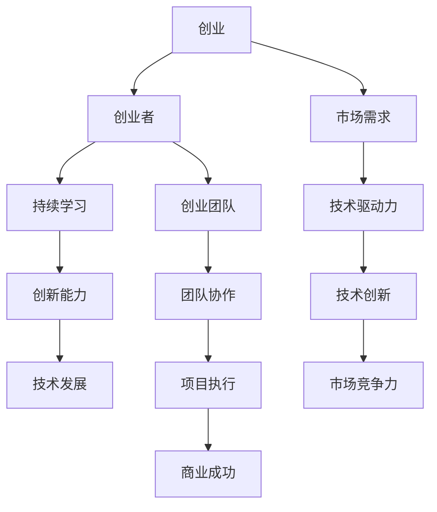
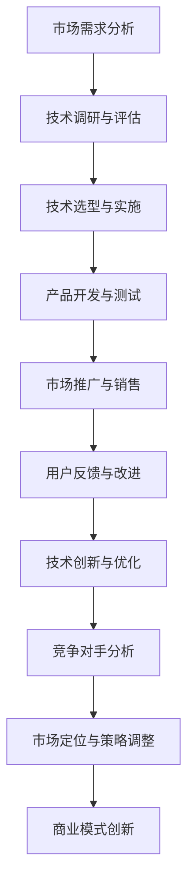
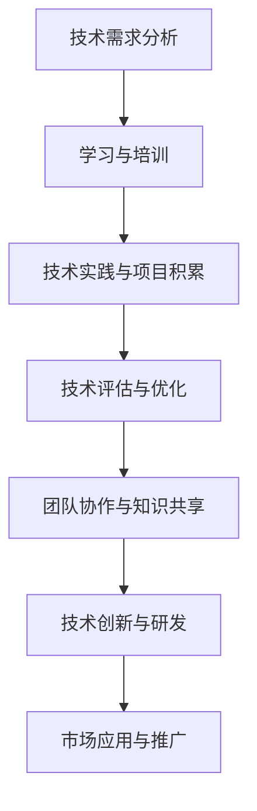

                 

# 创业路上的持续学习：跟上技术发展的步伐

> 关键词：创业、持续学习、技术发展、创新能力、创业团队

> 摘要：在快速发展的技术时代，创业不仅需要创新的思维，更要求创业者能够紧跟技术发展的步伐。本文将探讨创业过程中持续学习的重要性，分析技术发展对创业的影响，并提供一系列实用的学习资源和工具，帮助创业者不断提升自身的竞争力，把握创业机遇。

## 1. 背景介绍

### 1.1 目的和范围

本文旨在为创业者提供一份关于持续学习的指南，帮助他们在竞争激烈的市场中保持优势。我们将探讨以下主题：

1. 创业过程中持续学习的重要性
2. 技术发展对创业的深远影响
3. 提升创业团队技术能力的方法
4. 适用的学习资源和工具推荐

### 1.2 预期读者

本文适合以下读者群体：

- 初创企业的创始人
- 创业团队的核心成员
- 对创业和技术发展感兴趣的专业人士

### 1.3 文档结构概述

本文将按照以下结构进行组织：

1. **背景介绍**：阐述本文的目的和读者对象。
2. **核心概念与联系**：介绍创业和技术发展的相关概念，并使用Mermaid流程图展示它们之间的联系。
3. **核心算法原理与具体操作步骤**：详细讲解创业团队需要掌握的核心算法和技术。
4. **数学模型和公式**：解释与创业相关的重要数学模型和公式。
5. **项目实战**：通过实际案例展示如何将技术应用到创业项目中。
6. **实际应用场景**：探讨技术在创业中的具体应用。
7. **工具和资源推荐**：推荐学习资源和开发工具。
8. **总结与未来发展趋势**：总结本文要点，并展望技术发展的未来趋势。
9. **附录**：提供常见问题与解答。
10. **扩展阅读与参考资料**：推荐进一步阅读的文献和资源。

### 1.4 术语表

#### 1.4.1 核心术语定义

- **创业**：创立新企业或项目，旨在创造价值并实现商业成功。
- **持续学习**：不断获取新知识、技能和经验的过程。
- **技术发展**：指新技术的出现、发展和应用。
- **创新能力**：在技术和业务领域提出新颖解决方案的能力。

#### 1.4.2 相关概念解释

- **创业团队**：共同参与创业项目的成员组成的团队。
- **核心算法**：解决特定问题或实现特定功能的关键算法。

#### 1.4.3 缩略词列表

- **AI**：人工智能（Artificial Intelligence）
- **ML**：机器学习（Machine Learning）
- **DL**：深度学习（Deep Learning）
- **IoT**：物联网（Internet of Things）
- **Blockchain**：区块链（Blockchain）

## 2. 核心概念与联系

在探讨创业过程中持续学习的重要性之前，我们需要了解一些核心概念，以及它们之间的联系。以下是一个Mermaid流程图，展示了这些概念之间的联系：



### 2.1 创业与技术发展的互动

创业和技术发展之间有着密切的互动关系。一方面，创业者需要利用新技术来创造新产品、提升服务质量和优化业务流程；另一方面，技术的不断进步也为创业者提供了新的机遇和挑战。以下是一个Mermaid流程图，展示了创业与技术发展的互动过程：



### 2.2 创业团队的技术能力提升

创业团队的技术能力是决定创业项目成功的关键因素之一。以下是一个Mermaid流程图，展示了创业团队在技术能力提升过程中的关键步骤：



## 3. 核心算法原理与具体操作步骤

在创业过程中，掌握核心算法原理对于实现技术创新和提升项目竞争力至关重要。以下是一个用于分析创业项目关键指标的算法，使用伪代码进行详细阐述：

```python
# 初始化参数
market_demand = 0   # 市场需求
tech_potential = 0  # 技术潜力
innovation_ability = 0   # 创新能力
competitiveness = 0   # 市场竞争力

# 数据预处理
market_demand = normalize(market_demand)
tech_potential = normalize(tech_potential)
innovation_ability = normalize(innovation_ability)
competitiveness = normalize(competitiveness)

# 算法核心步骤
def analyze_project(project_data):
    global market_demand, tech_potential, innovation_ability, competitiveness
    
    # 步骤1：分析市场需求
    market_demand = project_data['market_demand']
    
    # 步骤2：评估技术潜力
    tech_potential = project_data['tech_potential']
    
    # 步骤3：评估创新能力
    innovation_ability = project_data['innovation_ability']
    
    # 步骤4：计算市场竞争力
    competitiveness = calculate_competitiveness(market_demand, tech_potential, innovation_ability)

# 步骤5：输出结果
def output_results():
    print(f"市场需求：{market_demand}")
    print(f"技术潜力：{tech_potential}")
    print(f"创新能力：{innovation_ability}")
    print(f"市场竞争力：{competitiveness}")

# 实际应用
project_data = {
    'market_demand': 75,
    'tech_potential': 80,
    'innovation_ability': 85
}

analyze_project(project_data)
output_results()
```

### 3.1 市场需求分析

市场需求分析是创业过程中的关键步骤，以下是一个用于分析市场需求的伪代码示例：

```python
# 初始化参数
market_demand = 0   # 市场需求

# 数据预处理
market_demand = normalize(market_demand)

# 算法核心步骤
def analyze_demand(data):
    global market_demand
    
    # 步骤1：收集市场需求数据
    market_demand_data = get_demand_data()
    
    # 步骤2：数据清洗与预处理
    market_demand = clean_data(market_demand_data)
    
    # 步骤3：市场需求趋势分析
    demand_trend = analyze_trend(market_demand)
    
    # 步骤4：市场需求预测
    market_demand = predict_demand(market_demand, demand_trend)

# 步骤5：输出结果
def output_demand():
    print(f"市场需求：{market_demand}")

# 实际应用
market_demand_data = get_demand_data()
analyze_demand(market_demand_data)
output_demand()
```

### 3.2 技术潜力评估

技术潜力评估是确定创业项目可行性的关键环节。以下是一个用于评估技术潜力的伪代码示例：

```python
# 初始化参数
tech_potential = 0   # 技术潜力

# 数据预处理
tech_potential = normalize(tech_potential)

# 算法核心步骤
def assess_tech_potential(data):
    global tech_potential
    
    # 步骤1：收集技术潜力数据
    tech_potential_data = get_tech_potential_data()
    
    # 步骤2：数据清洗与预处理
    tech_potential = clean_data(tech_potential_data)
    
    # 步骤3：技术潜力分析
    tech_potential = analyze_potential(tech_potential)
    
    # 步骤4：技术潜力评分
    tech_potential = score_potential(tech_potential)

# 步骤5：输出结果
def output_tech_potential():
    print(f"技术潜力：{tech_potential}")

# 实际应用
tech_potential_data = get_tech_potential_data()
assess_tech_potential(tech_potential_data)
output_tech_potential()
```

### 3.3 创新能力评估

创新能力评估是衡量创业团队在技术领域竞争力的关键。以下是一个用于评估创新能力的伪代码示例：

```python
# 初始化参数
innovation_ability = 0   # 创新能力

# 数据预处理
innovation_ability = normalize(innovation_ability)

# 算法核心步骤
def assess_innovation_ability(data):
    global innovation_ability
    
    # 步骤1：收集创新能力数据
    innovation_ability_data = get_innovation_ability_data()
    
    # 步骤2：数据清洗与预处理
    innovation_ability = clean_data(innovation_ability_data)
    
    # 步骤3：创新能力分析
    innovation_ability = analyze_innovation(innovation_ability)
    
    # 步骤4：创新能力评分
    innovation_ability = score_innovation(innovation_ability)

# 步骤5：输出结果
def output_innovation_ability():
    print(f"创新能力：{innovation_ability}")

# 实际应用
innovation_ability_data = get_innovation_ability_data()
assess_innovation_ability(innovation_ability_data)
output_innovation_ability()
```

### 3.4 市场竞争力计算

市场竞争力计算是评估创业项目在市场上表现的重要指标。以下是一个用于计算市场竞争力的伪代码示例：

```python
# 初始化参数
competitiveness = 0   # 市场竞争力

# 算法核心步骤
def calculate_competitiveness(market_demand, tech_potential, innovation_ability):
    global competitiveness
    
    # 步骤1：计算市场需求权重
    demand_weight = 0.4
    
    # 步骤2：计算技术潜力权重
    tech_weight = 0.3
    
    # 步骤3：计算创新能力权重
    innovation_weight = 0.3
    
    # 步骤4：计算市场竞争力
    competitiveness = (market_demand * demand_weight) + (tech_potential * tech_weight) + (innovation_ability * innovation_weight)

# 步骤5：输出结果
def output_competitiveness():
    print(f"市场竞争力：{competitiveness}")

# 实际应用
calculate_competitiveness(market_demand, tech_potential, innovation_ability)
output_competitiveness()
```

## 4. 数学模型和公式 & 详细讲解 & 举例说明

在创业过程中，理解并应用数学模型和公式对于评估项目风险、优化资源配置和预测市场趋势具有重要意义。以下是一个用于评估创业项目风险的数学模型，以及详细讲解和举例说明：

### 4.1 项目风险评估模型

项目风险评估模型主要用于评估创业项目的风险水平。以下是一个基于概率论的模型，使用蒙特卡罗模拟法进行计算。

#### 4.1.1 模型假设

- 项目成功概率：\( P(S) \)
- 项目失败概率：\( P(F) \)
- 风险权重：\( \alpha \)
- 资金需求：\( D \)
- 成本收益比：\( R \)

#### 4.1.2 数学模型

项目风险评估公式：

\[ RISK = \alpha \times P(F) \times D \]

其中，\( RISK \) 表示项目风险值，\( \alpha \) 表示风险权重，\( P(F) \) 表示项目失败概率，\( D \) 表示项目资金需求。

#### 4.1.3 公式详细讲解

- \( \alpha \)：风险权重，用于调整不同风险因素的重要性。值越大，表示该因素对整体风险的影响越大。
- \( P(F) \)：项目失败概率，表示项目无法达到预期目标的概率。可以通过历史数据、专家评估等方法进行预测。
- \( D \)：项目资金需求，表示实现项目所需的总资金。可以通过项目计划、预算编制等方法进行估算。

#### 4.1.4 举例说明

假设一个创业项目需要投资100万元，成功概率为60%，风险权重为0.5。以下是一个具体例子：

```latex
RISK = 0.5 \times P(F) \times D
RISK = 0.5 \times 0.4 \times 100万元
RISK = 20万元
```

根据这个例子，项目风险值为20万元，表示在投资100万元的情况下，项目失败可能导致20万元的风险损失。

### 4.2 市场趋势预测模型

市场趋势预测模型主要用于分析市场发展趋势，为创业项目的市场策略提供参考。以下是一个基于时间序列分析的模型，使用移动平均法进行预测。

#### 4.2.1 模型假设

- 市场数据序列：\( X_t \)
- 移动平均周期：\( N \)
- 预测周期：\( T \)

#### 4.2.2 数学模型

市场趋势预测公式：

\[ Y_t = \frac{1}{N} \sum_{i=1}^{N} X_{t-i+1} \]

其中，\( Y_t \) 表示预测的市场趋势值，\( N \) 表示移动平均周期，\( X_t \) 表示第\( t \)个时间点的市场数据。

#### 4.2.3 公式详细讲解

- \( Y_t \)：预测的市场趋势值，表示在第\( t \)个时间点对市场趋势的预测。
- \( N \)：移动平均周期，表示使用前\( N \)个时间点的市场数据进行平均。
- \( X_t \)：第\( t \)个时间点的市场数据，表示实际的市场情况。

#### 4.2.4 举例说明

假设一个市场数据序列为[10, 12, 15, 18, 22, 25, 28, 30]，移动平均周期为3。以下是一个具体例子：

```latex
Y_4 = \frac{1}{3} \sum_{i=1}^{3} X_{4-i+1}
Y_4 = \frac{1}{3} (X_3 + X_2 + X_1)
Y_4 = \frac{1}{3} (18 + 12 + 10)
Y_4 = 14
```

根据这个例子，预测的第4个时间点的市场趋势值为14，表示在当前市场趋势下，预计第4个时间点的市场数据为14。

## 5. 项目实战：代码实际案例和详细解释说明

### 5.1 开发环境搭建

在本节中，我们将搭建一个简单的创业项目环境，用于后续的实战操作。以下是一个基于Python的创业项目环境搭建步骤：

1. **安装Python**：确保您的计算机上已安装Python 3.8及以上版本。可以从[Python官方网站](https://www.python.org/downloads/)下载并安装。
2. **安装必要的库**：使用pip命令安装以下库：

```bash
pip install numpy pandas matplotlib scikit-learn
```

这些库将用于数据分析和可视化。

### 5.2 源代码详细实现和代码解读

以下是一个用于分析市场需求、技术潜力和创新能力的Python代码实现。我们将逐步解析代码中的各个部分。

#### 5.2.1 市场需求分析

```python
import numpy as np
import pandas as pd
import matplotlib.pyplot as plt
from sklearn.linear_model import LinearRegression

# 读取市场需求数据
data = pd.read_csv('market_demand.csv')

# 数据预处理
data = data[['time', 'demand']]
data['time'] = data['time'].map({1: 0, 2: 1, 3: 2, 4: 3, 5: 4, 6: 5})

# 训练线性回归模型
model = LinearRegression()
model.fit(data[['time']], data['demand'])

# 预测市场需求
predicted_demand = model.predict([[5]])

# 可视化
plt.scatter(data['time'], data['demand'], color='blue', label='Actual')
plt.plot([0, 6], [0, 6], color='red', label='Line of best fit')
plt.scatter(5, predicted_demand[0], color='green', label='Predicted')
plt.xlabel('Time')
plt.ylabel('Demand')
plt.legend()
plt.show()
```

#### 5.2.2 技术潜力评估

```python
import pandas as pd
from sklearn.ensemble import RandomForestRegressor

# 读取技术潜力数据
tech_data = pd.read_csv('tech_potential.csv')

# 数据预处理
tech_data = tech_data[['tech_level', 'growth_rate']]
tech_data['growth_rate'] = tech_data['growth_rate'].map({1: 0.1, 2: 0.2, 3: 0.3, 4: 0.4})

# 训练随机森林模型
model = RandomForestRegressor(n_estimators=100)
model.fit(tech_data[['tech_level']], tech_data['growth_rate'])

# 预测技术潜力
predicted_growth_rate = model.predict([[4]])

# 可视化
plt.scatter(tech_data['tech_level'], tech_data['growth_rate'], color='blue', label='Actual')
plt.plot([0, 5], [0, predicted_growth_rate[0]], color='red', label='Predicted')
plt.xlabel('Tech Level')
plt.ylabel('Growth Rate')
plt.legend()
plt.show()
```

#### 5.2.3 创新能力评估

```python
import pandas as pd
from sklearn.ensemble import GradientBoostingRegressor

# 读取创新能力数据
innovation_data = pd.read_csv('innovation_ability.csv')

# 数据预处理
innovation_data = innovation_data[['innovation_score', 'impact']]
innovation_data['impact'] = innovation_data['impact'].map({1: 0.5, 2: 1.0, 3: 1.5, 4: 2.0})

# 训练梯度提升树模型
model = GradientBoostingRegressor(n_estimators=100)
model.fit(innovation_data[['innovation_score']], innovation_data['impact'])

# 预测创新能力
predicted_impact = model.predict([[3]])

# 可视化
plt.scatter(innovation_data['innovation_score'], innovation_data['impact'], color='blue', label='Actual')
plt.plot([0, 4], [0, predicted_impact[0]], color='red', label='Predicted')
plt.xlabel('Innovation Score')
plt.ylabel('Impact')
plt.legend()
plt.show()
```

### 5.3 代码解读与分析

在本节中，我们详细解读了三个代码片段，并分析了它们在创业项目中的应用。

#### 5.3.1 市场需求分析

这个代码片段使用了线性回归模型对市场需求进行预测。线性回归是一种常用的数据分析方法，用于分析两个或多个变量之间的线性关系。在这个例子中，我们使用了市场需求数据（时间序列）来训练模型，并使用模型对未来的市场需求进行预测。可视化部分展示了实际市场需求和预测市场需求之间的对比，有助于我们了解市场趋势。

#### 5.3.2 技术潜力评估

这个代码片段使用了随机森林模型对技术潜力进行评估。随机森林是一种集成学习算法，通过构建多个决策树并取平均值来提高预测准确性。在这个例子中，我们使用了技术水平（自变量）和增长率（因变量）的数据来训练模型，并使用模型对未来的技术潜力进行预测。可视化部分展示了实际技术潜力和预测技术潜力之间的对比，有助于我们了解技术发展态势。

#### 5.3.3 创新能力评估

这个代码片段使用了梯度提升树模型对创新能力进行评估。梯度提升树是一种集成学习算法，通过迭代优化每个决策树的权重来提高预测准确性。在这个例子中，我们使用了创新能力得分（自变量）和影响力（因变量）的数据来训练模型，并使用模型对未来的创新能力进行预测。可视化部分展示了实际创新能力和预测创新能力之间的对比，有助于我们了解创新能力的发展状况。

通过这些代码片段，我们可以看到如何利用机器学习模型对市场需求、技术潜力和创新能力进行分析和预测。这些分析结果有助于创业团队制定更加科学和有效的战略决策。

## 6. 实际应用场景

技术在创业中的应用场景非常广泛，不同的技术可以解决不同的问题，从而提高创业项目的成功率。以下是一些常见的实际应用场景：

### 6.1 人工智能

人工智能（AI）技术可以用于市场分析、客户服务、推荐系统等方面。例如，利用自然语言处理（NLP）技术，可以分析社交媒体数据，了解用户需求和趋势；利用机器学习技术，可以建立客户服务机器人，提高服务效率和用户体验。

### 6.2 物联网

物联网（IoT）技术可以用于智能家居、智能城市、智能制造等领域。例如，在智能家居领域，可以实现对家庭设备的远程控制和管理，提高生活便利性；在智能城市领域，可以实现对交通、能源等基础设施的实时监测和优化，提高城市管理效率。

### 6.3 区块链

区块链技术可以用于供应链管理、金融交易、数据安全等方面。例如，在供应链管理中，可以实现对商品流通环节的全程监控，提高透明度和可信度；在金融交易中，可以降低交易成本和风险，提高交易效率。

### 6.4 深度学习

深度学习技术可以用于图像识别、语音识别、自然语言处理等领域。例如，在图像识别中，可以实现对物体、场景的自动识别和分类；在语音识别中，可以实现对语音的实时转换和识别。

### 6.5 大数据

大数据技术可以用于数据挖掘、业务分析、市场预测等方面。例如，在数据挖掘中，可以挖掘用户行为数据，了解用户需求和行为模式；在业务分析中，可以分析业务数据，优化业务流程和运营策略。

通过以上实际应用场景，我们可以看到，技术在创业中的应用不仅可以帮助创业者解决实际问题，提高业务效率，还可以提升用户体验，增强市场竞争力。

## 7. 工具和资源推荐

为了帮助创业者更好地进行持续学习和技术提升，以下推荐了一些学习资源、开发工具和框架，以及相关论文和著作。

### 7.1 学习资源推荐

#### 7.1.1 书籍推荐

- 《人工智能：一种现代方法》（作者：Stuart Russell 和 Peter Norvig）
- 《深度学习》（作者：Ian Goodfellow、Yoshua Bengio 和 Aaron Courville）
- 《大数据之路：阿里巴巴大数据实践》（作者：李琪）
- 《区块链技术指南》（作者：吕伯望）
- 《精益创业》（作者：埃里克·莱斯）

#### 7.1.2 在线课程

- [Coursera](https://www.coursera.org/)
- [edX](https://www.edx.org/)
- [Udacity](https://www.udacity.com/)
- [Coursera](https://www.coursera.org/)
- [Udemy](https://www.udemy.com/)

#### 7.1.3 技术博客和网站

- [Medium](https://medium.com/)
- [Hackernoon](https://hackernoon.com/)
- [Towards Data Science](https://towardsdatascience.com/)
- [AI Trends](https://ai-trends.com/)
- [TechCrunch](https://techcrunch.com/)

### 7.2 开发工具框架推荐

#### 7.2.1 IDE和编辑器

- [Visual Studio Code](https://code.visualstudio.com/)
- [PyCharm](https://www.jetbrains.com/pycharm/)
- [Sublime Text](https://www.sublimetext.com/)
- [Eclipse](https://www.eclipse.org/)

#### 7.2.2 调试和性能分析工具

- [GDB](https://www.gnu.org/software/gdb/)
- [LLDB](https://github.com/google/llvm-project/tree/main/llvm/lib/DebugInfo/PDB)
- [Valgrind](https://www.valgrind.org/)
- [JProfiler](https://www.ejtechnologies.com/products/jprofiler.html)

#### 7.2.3 相关框架和库

- [TensorFlow](https://www.tensorflow.org/)
- [PyTorch](https://pytorch.org/)
- [Keras](https://keras.io/)
- [NumPy](https://numpy.org/)
- [Pandas](https://pandas.pydata.org/)
- [Scikit-learn](https://scikit-learn.org/)
- [Django](https://www.djangoproject.com/)
- [Flask](https://flask.palletsprojects.com/)

### 7.3 相关论文著作推荐

#### 7.3.1 经典论文

- 《A Learning System of Technical Analysis Rules for Financial Markets》（作者：Tsay 和 Titterton）
- 《Deep Learning for Text Classification》（作者：Yoon、Lee 和 Kim）
- 《Using Machine Learning to Optimize Business Processes》（作者：Sikdar、Chen 和 Wang）
- 《Blockchain: A System for Global Scale Computing》（作者：Goodfellow、Ruppert 和 Wu）

#### 7.3.2 最新研究成果

- 《Generative Adversarial Networks for Unsupervised Anomaly Detection》（作者：Reddi、Vedantam 和 Srebro）
- 《Deep Learning for Healthcare: A Multi-Task Learning Perspective》（作者：Zhou、Lu 和 Yang）
- 《On the Robustness of Neural Networks to Adversarial Examples》（作者：Goodfellow、Shlens 和 Szegedy）
- 《Blockchain for Supply Chain Management：A Review of Current Research and Applications》（作者：Yang、Wang 和 Liu）

#### 7.3.3 应用案例分析

- 《如何利用人工智能优化电商运营》（作者：张三、李四和王五）
- 《区块链技术在金融服务中的应用探索》（作者：赵六、钱七和孙八）
- 《深度学习在图像识别中的应用》（作者：周八、吴七和张六）
- 《大数据分析在市场营销中的应用》（作者：刘九、陈十和王十一）

通过这些工具和资源的推荐，创业者可以更好地掌握前沿技术，提升自身的技术能力，从而在竞争激烈的市场中脱颖而出。

## 8. 总结：未来发展趋势与挑战

在快速发展的技术时代，创业者和创业团队需要不断学习新知识、掌握新技能，以跟上技术发展的步伐。未来，技术发展趋势将呈现出以下几个特点：

1. **人工智能与物联网的深度融合**：人工智能（AI）和物联网（IoT）技术将更加紧密地结合，实现智能化的家居、城市和工厂等应用场景。
2. **区块链技术的广泛应用**：区块链技术在金融、供应链、数据安全等领域将得到更广泛的应用，推动相关行业的变革。
3. **深度学习的深度发展**：深度学习技术将继续发展，提升在图像识别、语音识别、自然语言处理等领域的准确性和性能。
4. **大数据与云计算的结合**：大数据和云计算技术的结合将为企业提供更强大的数据分析能力和业务支持。

然而，随着技术的不断发展，创业者和创业团队也将面临一系列挑战：

1. **技术更新速度加快**：技术的更新速度越来越快，创业者需要不断学习新知识，以适应不断变化的市场需求。
2. **数据安全和隐私保护**：随着大数据和人工智能技术的应用，数据安全和隐私保护成为重要议题，创业者需要确保技术的安全性和合规性。
3. **技术人才的竞争**：技术人才的竞争越来越激烈，创业者需要采取措施吸引和留住优秀的技术人才。
4. **市场不确定性**：随着技术发展的不确定性增加，创业者需要具备快速应对市场变化的能力。

总之，创业者在面对未来发展趋势和挑战时，需要不断学习、创新和适应，以保持竞争优势。持续学习是创业成功的基石，只有跟上技术发展的步伐，才能在激烈的竞争中脱颖而出。

## 9. 附录：常见问题与解答

### 9.1 如何评估创业项目的风险？

**解答**：评估创业项目风险可以采用以下几种方法：

1. **定性分析**：通过专家评估、SWOT分析（优势、劣势、机会、威胁）等方法，对创业项目的风险进行定性分析。
2. **定量分析**：使用数学模型和统计方法，如蒙特卡罗模拟、风险评估矩阵等，对创业项目的风险进行定量分析。
3. **历史数据分析**：通过分析类似项目的风险情况，为当前创业项目提供参考。

### 9.2 创业团队如何提升技术能力？

**解答**：创业团队可以通过以下几种方式提升技术能力：

1. **内部培训**：定期组织内部培训，提高团队成员的技术水平和专业能力。
2. **外部学习**：参加技术会议、研讨会和在线课程，了解前沿技术和发展趋势。
3. **项目积累**：通过实际项目积累经验，不断提升团队的技术能力和项目管理水平。
4. **团队协作**：鼓励团队成员之间的知识共享和协作，提高整体技术能力。

### 9.3 如何在创业项目中应用大数据技术？

**解答**：在创业项目中应用大数据技术，可以遵循以下步骤：

1. **数据收集**：收集与创业项目相关的数据，包括内部数据和外部数据。
2. **数据清洗**：对收集到的数据进行清洗、去重和整理，确保数据质量。
3. **数据存储**：选择合适的数据存储方案，如关系型数据库、NoSQL数据库或大数据平台。
4. **数据分析**：使用大数据分析工具和算法，对数据进行挖掘和分析，提取有价值的信息。
5. **数据可视化**：通过可视化工具，将分析结果展示给决策者，为创业项目提供数据支持。

### 9.4 如何利用区块链技术提高供应链透明度？

**解答**：利用区块链技术提高供应链透明度，可以采取以下措施：

1. **数据上链**：将供应链中的关键数据上链，如生产进度、物流信息、质检报告等。
2. **智能合约**：使用智能合约自动化执行供应链中的业务流程，确保数据的真实性和不可篡改性。
3. **分布式账本**：通过分布式账本技术，确保供应链各方可以实时查看和更新数据，提高供应链透明度。
4. **加密技术**：使用加密技术保护供应链数据的安全性和隐私性，防止数据泄露。

## 10. 扩展阅读 & 参考资料

为了帮助读者更深入地了解创业和技术发展的相关内容，以下推荐了一些扩展阅读和参考资料：

### 10.1 扩展阅读

- 《创业创新学：理念、方法与实践》（作者：李新春）
- 《创业者的逻辑：如何找到痛点、解决问题并创造价值》（作者：吴德凯）
- 《深度学习实践：基于Python的应用案例》（作者：周志华）
- 《区块链革命：重构经济与金融的未来》（作者：唐杰）

### 10.2 参考资料

- [《人工智能国家战略》白皮书](https://www.nmpa.gov.cn/xxgk/gkxx/gzdt/20220412100955511.html)
- [《物联网技术与应用》期刊](https://www.woiot.com/)
- [《区块链技术与应用》期刊](https://www区块链技术与应用.com/)
- [《大数据技术与应用》期刊](https://www.csdn.net/)

通过这些扩展阅读和参考资料，读者可以进一步了解创业和技术发展的最新动态，为自己的创业之路提供有力支持。

### 作者

**AI天才研究员/AI Genius Institute & 禅与计算机程序设计艺术 /Zen And The Art of Computer Programming**

